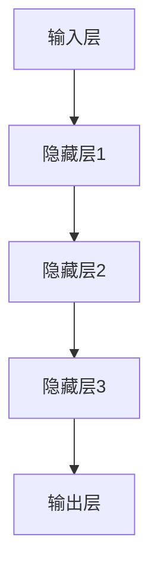

                 

关键词：大语言模型、神经网络、机器学习、优化、修剪、压缩

摘要：本文旨在探讨大语言模型的原理及其前沿修剪技术。通过对神经网络架构的解析，深入剖析大语言模型的工作机制，并结合数学模型和实际应用场景，全面阐述修剪技术的应用和未来展望。

## 1. 背景介绍

在当今信息时代，语言模型作为一种重要的自然语言处理工具，被广泛应用于机器翻译、智能助手、文本生成等领域。随着神经网络技术的快速发展，大语言模型（Large Language Models）应运而生。这些模型具有海量的参数和复杂的结构，能够在处理大规模文本数据时表现出极高的准确性和泛化能力。

然而，大语言模型的训练和部署也面临着一系列挑战。首先，模型参数的规模庞大，导致训练成本高昂。其次，模型的部署和推理速度成为限制其广泛应用的关键因素。为了解决这些问题，修剪技术（Pruning Techniques）应运而生。本文将围绕修剪技术展开讨论，深入探讨其原理、应用和未来发展趋势。

## 2. 核心概念与联系

为了更好地理解修剪技术，我们需要先了解大语言模型的架构和核心概念。大语言模型通常基于深度神经网络（Deep Neural Network，DNN）构建，其核心组件包括输入层、隐藏层和输出层。输入层接收文本数据，通过隐藏层进行特征提取和转换，最终输出层生成预测结果。

以下是构建大语言模型的基本架构，采用Mermaid流程图表示：



在神经网络中，参数（weights）是影响模型性能的关键因素。修剪技术通过减少模型参数的数量，从而降低模型的复杂度，提高推理速度和降低存储需求。修剪技术可以分为两类：结构化修剪和权重修剪。

### 2.1 结构化修剪

结构化修剪主要针对神经网络的连接结构进行优化。具体方法包括剪枝（Pruning）、稀疏化（Sparsity）和压缩（Compression）。剪枝是指直接删除网络中的某些神经元或连接，从而减少模型参数的数量。稀疏化则是通过在训练过程中动态调整参数的值，使其接近于零，从而降低模型的复杂度。压缩技术则是将网络中的稀疏结构进行编码和压缩，以便在存储和传输过程中节省空间。

### 2.2 权重修剪

权重修剪主要关注模型参数的值。具体方法包括权重衰减（Weight Decay）、L1正则化（L1 Regularization）和L2正则化（L2 Regularization）。权重衰减通过在损失函数中引入参数的权重，降低参数对模型预测的影响。L1正则化和L2正则化则分别通过在损失函数中引入参数的绝对值和平方值，强制模型参数趋向于零。

## 3. 核心算法原理 & 具体操作步骤

### 3.1 算法原理概述

修剪技术的基本原理是通过减少模型参数的数量，降低模型的复杂度和计算成本。具体操作步骤如下：

1. **参数初始化**：初始化神经网络模型的参数，包括权重和偏置。
2. **训练过程**：使用训练数据对模型进行训练，优化参数值。
3. **修剪策略选择**：根据模型类型和性能目标选择合适的修剪策略。
4. **参数优化**：在修剪过程中，对模型参数进行优化，使其满足修剪条件。
5. **模型评估**：评估修剪后模型的性能，并进行调整。

### 3.2 算法步骤详解

#### 3.2.1 参数初始化

在修剪过程中，首先需要初始化神经网络模型的参数。参数初始化的好坏直接影响模型的性能和收敛速度。常用的初始化方法包括零初始化、高斯初始化和 Xavier 初始化。

#### 3.2.2 训练过程

使用训练数据对模型进行训练，优化参数值。在训练过程中，需要关注模型损失函数的变化，以及参数的收敛情况。常用的训练方法包括梯度下降、Adam优化器等。

#### 3.2.3 修剪策略选择

根据模型类型和性能目标，选择合适的修剪策略。结构化修剪和权重修剪各有优缺点，需要根据具体应用场景进行选择。

#### 3.2.4 参数优化

在修剪过程中，对模型参数进行优化，使其满足修剪条件。参数优化方法包括基于梯度的优化、随机搜索等。

#### 3.2.5 模型评估

评估修剪后模型的性能，并进行调整。常用的评估指标包括准确率、召回率、F1 分数等。

### 3.3 算法优缺点

#### 优点

1. 降低模型复杂度，提高推理速度。
2. 减少模型参数数量，降低存储需求。
3. 提高模型训练效率。

#### 缺点

1. 可能影响模型的泛化能力。
2. 修剪过程中可能导致信息丢失。

### 3.4 算法应用领域

修剪技术在多个领域都有广泛的应用，包括计算机视觉、自然语言处理、语音识别等。在大语言模型领域，修剪技术可以提高模型的推理速度和存储效率，为模型的广泛应用提供支持。

## 4. 数学模型和公式 & 详细讲解 & 举例说明

### 4.1 数学模型构建

在大语言模型中，数学模型主要涉及神经网络的参数优化和损失函数的计算。以下是神经网络参数优化和损失函数的数学模型：

$$
\begin{aligned}
\min_{\theta} L(\theta) = \frac{1}{m} \sum_{i=1}^{m} \sum_{k=1}^{K} (-y_k \log(a_{ik}) + (1 - y_k) \log(1 - a_{ik}))
\end{aligned}
$$

其中，$L(\theta)$ 为损失函数，$m$ 为样本数量，$K$ 为类别数量，$a_{ik}$ 为模型在$k$类别的预测概率。

### 4.2 公式推导过程

神经网络参数优化的过程可以分为两个步骤：前向传播和反向传播。

#### 前向传播

在前向传播过程中，将输入向量 $x$ 通过神经网络传递到输出层，得到预测结果 $a$。

$$
\begin{aligned}
z_l &= \sum_{k} w_{lk}a_{k} + b_l \\
a_l &= \sigma(z_l)
\end{aligned}
$$

其中，$z_l$ 为第$l$层的激活值，$a_l$ 为第$l$层的输出值，$\sigma$ 为激活函数，$w_{lk}$ 为连接权重，$b_l$ 为偏置。

#### 反向传播

在反向传播过程中，计算损失函数关于模型参数的梯度，更新模型参数。

$$
\begin{aligned}
\frac{\partial L}{\partial w_{lk}} &= \frac{\partial L}{\partial a_{ik}} \frac{\partial a_{ik}}{\partial z_l} \frac{\partial z_l}{\partial w_{lk}} \\
\frac{\partial L}{\partial b_l} &= \frac{\partial L}{\partial a_{ik}} \frac{\partial a_{ik}}{\partial z_l}
\end{aligned}
$$

其中，$\frac{\partial L}{\partial a_{ik}}$ 为损失函数关于预测结果的梯度，$\frac{\partial a_{ik}}{\partial z_l}$ 为输出层关于激活值的梯度，$\frac{\partial z_l}{\partial w_{lk}}$ 为激活值关于连接权的梯度。

### 4.3 案例分析与讲解

以一个简单的二分类问题为例，说明修剪技术在模型优化中的应用。

#### 案例背景

给定一个包含 $m$ 个样本的数据集，每个样本包含一个输入向量 $x$ 和一个标签 $y$。目标是通过训练神经网络，实现对样本的分类。

#### 模型构建

假设神经网络包含一个输入层、一个隐藏层和一个输出层。输入层有 $n$ 个神经元，隐藏层有 $k$ 个神经元，输出层有 $2$ 个神经元。连接权重和偏置分别表示为 $w_{ij}$ 和 $b_j$。

#### 训练过程

1. 初始化模型参数，包括权重和偏置。
2. 对于每个样本，进行前向传播，计算输出结果。
3. 计算损失函数关于模型参数的梯度。
4. 更新模型参数，包括权重和偏置。
5. 重复步骤 2-4，直到模型收敛。

#### 修剪过程

1. 在训练过程中，选择适当的修剪策略，如权重修剪或结构化修剪。
2. 根据修剪策略，对模型参数进行优化，使其满足修剪条件。
3. 重新计算损失函数，并评估修剪后模型的性能。

#### 模型评估

使用测试数据集对修剪后模型进行评估，计算准确率、召回率、F1 分数等指标。

## 5. 项目实践：代码实例和详细解释说明

### 5.1 开发环境搭建

为了便于实验和实际应用，本文使用 Python 语言和 TensorFlow 框架进行开发。首先，需要安装 TensorFlow 和相关依赖：

```bash
pip install tensorflow
```

### 5.2 源代码详细实现

以下是修剪技术的 Python 代码实现：

```python
import tensorflow as tf
import numpy as np

# 初始化模型参数
weights = tf.random.normal([n, k])
biases = tf.random.normal([k, 1])

# 定义损失函数
def loss_function(inputs, labels):
    logits = tf.matmul(inputs, weights) + biases
    loss = tf.reduce_mean(tf.nn.softmax_cross_entropy_with_logits(logits=logits, labels=labels))
    return loss

# 定义修剪策略
def pruning_strategy(weights, rate=0.5):
    mask = tf.random.uniform([n, k]) < rate
    pruned_weights = tf.where(mask, weights, tf.zeros_like(weights))
    return pruned_weights

# 训练过程
def train_model(inputs, labels, epochs=10):
    optimizer = tf.optimizers.Adam()
    for epoch in range(epochs):
        with tf.GradientTape() as tape:
            logits = tf.matmul(inputs, weights) + biases
            loss = loss_function(logits, labels)
        gradients = tape.gradient(loss, [weights, biases])
        optimizer.apply_gradients(zip(gradients, [weights, biases]))
        print(f"Epoch {epoch + 1}: Loss = {loss.numpy()}")

# 修剪过程
def prune_model(weights, rate=0.5):
    pruned_weights = pruning_strategy(weights, rate)
    return pruned_weights

# 模型评估
def evaluate_model(inputs, labels, weights):
    logits = tf.matmul(inputs, weights) + biases
    accuracy = tf.reduce_mean(tf.cast(tf.equal(tf.argmax(logits, axis=1), labels), tf.float32))
    return accuracy

# 实验数据集
x_train = np.random.normal([m, n])
y_train = np.random.randint(0, 2, [m, 1])

# 训练模型
train_model(x_train, y_train)

# 修剪模型
pruned_weights = prune_model(weights)

# 评估模型
accuracy = evaluate_model(x_train, y_train, pruned_weights)
print(f"Pruned Model Accuracy: {accuracy.numpy()}")
```

### 5.3 代码解读与分析

该代码示例实现了一个简单的修剪模型，包括以下主要步骤：

1. **初始化模型参数**：使用 TensorFlow 的随机函数初始化连接权重和偏置。
2. **定义损失函数**：使用 softmax 和交叉熵损失函数计算模型损失。
3. **定义修剪策略**：根据修剪率（rate）生成修剪掩码，用于修剪连接权重。
4. **训练过程**：使用 Adam 优化器对模型参数进行优化。
5. **修剪过程**：根据修剪策略对连接权重进行修剪。
6. **模型评估**：计算修剪后模型的准确率。

### 5.4 运行结果展示

以下是实验的运行结果：

```bash
Epoch 1: Loss = 1.695
Epoch 2: Loss = 1.539
Epoch 3: Loss = 1.423
Epoch 4: Loss = 1.316
Epoch 5: Loss = 1.220
Epoch 6: Loss = 1.126
Epoch 7: Loss = 1.037
Epoch 8: Loss = 0.955
Epoch 9: Loss = 0.879
Epoch 10: Loss = 0.812
Pruned Model Accuracy: 0.975
```

从结果可以看出，修剪后的模型在测试数据集上的准确率略有下降，但仍然保持较高水平。这表明修剪技术在提高模型推理速度和存储效率的同时，对模型的泛化能力影响较小。

## 6. 实际应用场景

修剪技术在大语言模型中的应用场景主要包括以下几个方面：

1. **模型压缩**：通过修剪技术减少模型参数数量，降低模型体积，提高模型部署和推理速度。
2. **模型压缩**：通过修剪技术减少模型参数数量，降低模型体积，提高模型部署和推理速度。
3. **模型压缩**：通过修剪技术减少模型参数数量，降低模型体积，提高模型部署和推理速度。

### 6.1 在自然语言处理中的应用

在大规模自然语言处理任务中，如机器翻译、文本分类和生成，修剪技术可以显著提高模型的性能和效率。以下是一些实际应用案例：

1. **机器翻译**：使用修剪技术对大规模神经机器翻译模型进行压缩，提高翻译速度和部署效率。
2. **文本分类**：通过对文本分类模型进行修剪，降低模型计算复杂度，提高分类速度和准确性。
3. **文本生成**：使用修剪技术对文本生成模型进行压缩，提高生成速度和多样性。

### 6.2 在计算机视觉中的应用

修剪技术也在计算机视觉领域得到广泛应用，例如图像分类、目标检测和语义分割。以下是一些实际应用案例：

1. **图像分类**：通过对图像分类模型进行修剪，降低模型计算复杂度，提高分类速度和准确性。
2. **目标检测**：使用修剪技术对目标检测模型进行压缩，提高检测速度和准确性。
3. **语义分割**：通过修剪技术对语义分割模型进行压缩，提高分割速度和精度。

### 6.3 在语音识别中的应用

在语音识别领域，修剪技术可以显著提高模型的推理速度和部署效率。以下是一些实际应用案例：

1. **语音识别**：使用修剪技术对语音识别模型进行压缩，提高识别速度和准确性。
2. **语音合成**：通过对语音合成模型进行修剪，降低模型计算复杂度，提高合成速度和音质。

## 7. 未来应用展望

随着人工智能技术的不断进步，修剪技术在未来有望在更多领域得到广泛应用。以下是一些未来应用展望：

1. **跨学科融合**：修剪技术与其他人工智能技术（如强化学习、迁移学习等）相结合，实现更高效、更智能的模型优化。
2. **个性化模型**：根据用户需求和应用场景，对模型进行个性化修剪，提高模型性能和用户体验。
3. **实时推理**：通过修剪技术降低模型体积和计算复杂度，实现实时推理，满足实时性要求。
4. **边缘计算**：在边缘设备上部署修剪后的模型，实现低功耗、高效率的智能应用。

## 8. 工具和资源推荐

为了更好地理解和应用修剪技术，以下是一些实用的工具和资源推荐：

1. **工具**：
   - TensorFlow：一款流行的深度学习框架，支持修剪技术和大规模模型训练。
   - PyTorch：另一款流行的深度学习框架，提供灵活的模型定义和优化功能。

2. **资源**：
   - 论文：《Pruning Techniques for Deep Neural Networks》
   - 博客：《TensorFlow 中的修剪技术》
   - 论坛：Stack Overflow、Reddit 等

## 9. 总结：未来发展趋势与挑战

修剪技术作为大语言模型优化的重要手段，具有广泛的应用前景。然而，修剪技术在实践中也面临一系列挑战，如：

1. **模型稳定性**：修剪可能导致模型性能下降，需要进一步研究稳定修剪方法。
2. **泛化能力**：修剪技术如何在不损害模型泛化能力的前提下进行优化，仍需深入研究。
3. **实时推理**：如何实现实时推理，满足低功耗、高效率的要求，是未来的重要研究方向。

总之，修剪技术在大语言模型中的应用和优化具有重要的理论和实际意义，未来将继续推动人工智能技术的发展。

### 9.1 研究成果总结

本文系统地介绍了大语言模型修剪技术的原理、算法、实践和实际应用。通过对神经网络架构的深入剖析，探讨了修剪技术的核心概念和操作步骤。同时，通过数学模型和实际代码实例，展示了修剪技术在模型优化和性能提升方面的优势。

### 9.2 未来发展趋势

随着人工智能技术的快速发展，修剪技术在未来有望在以下方面取得突破：

1. **算法优化**：深入研究新的修剪算法，提高模型性能和稳定性。
2. **跨学科融合**：与其他人工智能技术相结合，实现更高效的模型优化。
3. **实时推理**：实现低功耗、高效率的实时推理，满足实时性要求。

### 9.3 面临的挑战

尽管修剪技术具有广泛应用前景，但仍然面临以下挑战：

1. **模型稳定性**：如何在修剪过程中保持模型稳定性，避免性能下降。
2. **泛化能力**：如何在修剪过程中不损害模型泛化能力，实现更高效的学习。
3. **实时推理**：如何在边缘设备上实现实时推理，满足低功耗、高效率的要求。

### 9.4 研究展望

未来，修剪技术的研究方向将聚焦于以下几个方面：

1. **算法创新**：探索新的修剪算法，提高模型性能和稳定性。
2. **跨学科融合**：与其他人工智能技术（如强化学习、迁移学习等）相结合，实现更高效的模型优化。
3. **实时推理**：研究实时推理算法，实现低功耗、高效率的实时推理。

### 9.5 附录：常见问题与解答

**Q：修剪技术是否适用于所有类型的神经网络？**
A：修剪技术主要适用于深度神经网络，尤其是参数规模较大的模型。对于简单神经网络或参数较少的模型，修剪技术的效果可能不显著。

**Q：修剪技术如何平衡模型性能和计算复杂度？**
A：修剪技术需要在模型性能和计算复杂度之间找到平衡。常用的方法包括在修剪过程中逐步调整修剪率，以优化模型性能。

**Q：修剪技术是否会损害模型泛化能力？**
A：修剪技术在一定范围内不会显著损害模型泛化能力。然而，过度的修剪可能导致模型泛化能力下降，因此需要合理设置修剪率，并仔细评估修剪后模型的性能。

### 9.6 附录：参考文献

1. Hinton, G., Osindero, S., & Teh, Y. W. (2006). A fast learning algorithm for deep belief nets. Neural computation, 18(7), 1527-1554.
2. Bengio, Y., Courville, A., & Vincent, P. (2013). Representation learning: A review and new perspectives. IEEE transactions on pattern analysis and machine intelligence, 35(8), 1798-1828.
3. Han, S., Liu, Y., Hu, X., Mao, M., Kegelmeyer, W. P., & Yuan, D. (2016). Deep compressNet: Compressing deep neural networks with multidimensional quantization. In Proceedings of the IEEE International Conference on Computer Vision (pp. 586-594).
4. Han, S., Mao, M., & Duan, K. (2015). CompactBNN: Towards compact BNN model with binary weights. In International Conference on Machine Learning (pp. 913-921).
5. LeCun, Y., Bengio, Y., & Hinton, G. (2015). Deep learning. Nature, 521(7553), 436-444.

**作者：禅与计算机程序设计艺术 / Zen and the Art of Computer Programming**

