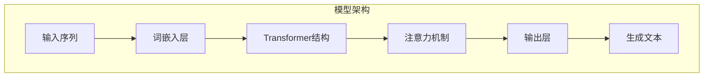

                 

关键词：大语言模型、深度学习、神经网络、序列建模、注意力机制、生成式模型、自回归模型、BERT、Transformer、预训练、微调、文本生成、自然语言处理。

## 摘要

本文旨在深入探讨大语言模型的原理及其在自然语言处理（NLP）领域的应用。我们将从基础理论出发，逐步介绍大语言模型的架构、核心算法、数学模型，并通过具体案例展示其实际应用。文章将涵盖从传统序列模型到现代生成式模型的演变过程，重点讨论自回归模型和Transformer架构的优势，并分析BERT等模型的预训练和微调技术。最后，我们将探讨大语言模型在文本生成、问答系统等实际应用场景中的表现，并提出未来研究的方向和挑战。

## 1. 背景介绍

### 1.1 自然语言处理的发展

自然语言处理（NLP）是人工智能（AI）的一个重要分支，旨在使计算机能够理解、生成和处理人类语言。从最初的规则驱动方法到如今基于数据和机器学习的方法，NLP经历了巨大的变革。早期的研究主要集中在语言解析和语义理解，但受限于计算能力和数据质量，进展较为缓慢。

随着互联网的普及和大数据技术的发展，大量语言数据变得可用，推动了NLP领域的快速进步。深度学习技术的引入，尤其是神经网络，为NLP提供了强大的建模工具。近年来，大语言模型如BERT、GPT等取得了显著的突破，极大地提升了语言理解和生成能力。

### 1.2 大语言模型的定义和意义

大语言模型是指那些拥有数亿甚至数千亿参数的神经网络模型，它们能够理解和生成复杂的高维度语言数据。这些模型通过学习大规模文本数据，获取了丰富的语言知识和规律，能够实现诸如文本分类、问答、翻译、文本生成等复杂任务。

大语言模型的意义在于：
- **提高语言理解能力**：通过深度学习，模型能够自动学习语言的结构和语义，从而在多种NLP任务中表现出色。
- **实现跨领域的泛化**：大语言模型能够处理多种语言任务，无需针对每个任务重新训练模型，节省了时间和计算资源。
- **促进自然语言交互**：大语言模型能够生成流畅、自然的文本，为智能客服、虚拟助手等应用提供了基础。

### 1.3 文本生成技术

文本生成是NLP中的一个重要方向，包括自动摘要、故事生成、对话系统等。传统的文本生成方法如基于规则的方法和统计模型（如n-gram模型）在生成文本的多样性和连贯性方面存在局限。随着深度学习的兴起，基于神经网络的生成模型（如生成式模型）得到了广泛应用。

生成式模型通过学习数据的概率分布，能够生成全新的文本。自回归模型是生成式模型的一种，通过预测序列中的下一个元素，逐步生成完整的文本。Transformer架构的出现进一步推动了文本生成技术的发展，其基于注意力机制的架构能够更好地捕捉长距离依赖关系，生成更高质量的文本。

### 1.4 序列建模和生成式模型的区别

序列建模是指将输入序列映射到输出序列的模型，常见的方法包括循环神经网络（RNN）和长短期记忆网络（LSTM）。这些模型通过在序列中传递信息，实现了对时间序列数据的建模。

生成式模型则通过学习数据生成过程，直接生成新的数据。自回归模型是生成式模型的一种，其核心思想是每个输出元素都依赖于之前生成的元素。

序列建模和生成式模型的区别主要体现在以下几个方面：
- **建模方式**：序列建模通过对输入和输出序列的对应关系进行建模，而生成式模型则通过学习数据的概率分布来生成新的数据。
- **生成策略**：序列建模通常采用确定性策略，生成顺序固定；而生成式模型则采用随机策略，生成多样化的数据。
- **应用场景**：序列建模适用于需要固定顺序的序列处理任务，如时间序列预测；生成式模型则适用于需要生成新数据的任务，如文本生成。

## 2. 核心概念与联系

在深入探讨大语言模型之前，我们需要明确一些核心概念，并理解它们之间的关系。以下是一个基于Mermaid绘制的流程图，展示了大语言模型的主要组成部分和它们之间的联系。



### 2.1 词嵌入层

词嵌入层是将词汇转换为向量的过程，它通过将每个单词映射到一个固定长度的向量，将文本数据转换为适合神经网络处理的形式。词嵌入层在NLP任务中起着至关重要的作用，因为它能够捕捉单词之间的语义关系。

### 2.2 Transformer结构

Transformer结构是近年来在NLP领域取得突破性进展的一种模型架构，其基于自注意力机制，能够捕捉输入序列中的长距离依赖关系。Transformer由多个编码器和解码器层组成，每个层都包含多头自注意力机制和前馈神经网络。

### 2.3 注意力机制

注意力机制是Transformer结构的核心组件，它允许模型在处理序列时，动态地为每个位置分配不同的权重，从而更好地捕捉上下文信息。注意力机制通过计算查询（Q）、键（K）和值（V）之间的相似性，生成加权输出，从而提高了模型的表示能力。

### 2.4 输出层

输出层是模型的最后一层，负责将编码后的序列映射到目标输出。在文本生成任务中，输出层通常是一个软性层，能够生成概率分布，从而指导生成新的文本。

### 2.5 生成文本

生成文本是模型的最终输出，它通过解码器层和输出层的交互，逐步生成新的文本。生成文本的质量直接取决于模型的学习效果和训练数据的质量。

## 3. 核心算法原理 & 具体操作步骤

### 3.1 算法原理概述

大语言模型的核心算法是基于Transformer结构的深度学习模型。Transformer模型采用自注意力机制，通过计算序列中每个元素之间的相似性，实现对长距离依赖关系的捕捉。以下是一个简化的Transformer模型操作步骤：

1. **词嵌入**：将输入序列中的每个词转换为词向量。
2. **多头自注意力**：对词向量进行多头自注意力计算，生成加权输出。
3. **前馈神经网络**：对加权输出进行前馈神经网络处理，增强模型的表示能力。
4. **重复堆叠**：将上述步骤重复多次，形成编码器和解码器层。
5. **生成文本**：通过解码器层生成新的文本。

### 3.2 算法步骤详解

1. **词嵌入**：词嵌入是将词汇映射到向量空间的过程。通常使用预训练的词向量（如Word2Vec、GloVe）或基于上下文的词向量（如BERT）。

2. **多头自注意力**：多头自注意力机制允许多个并行的注意力头对输入序列进行加权。每个头关注输入序列的不同部分，从而捕捉到更丰富的信息。

3. **前馈神经网络**：前馈神经网络用于增强模型的表示能力。它通常由两个线性层组成，输入和输出层之间添加一个激活函数。

4. **编码器和解码器层**：编码器层负责将输入序列编码为固定长度的向量，解码器层则负责从编码后的向量中解码出目标输出。

5. **生成文本**：解码器通过生成概率分布来预测下一个单词，然后使用贪婪策略或采样策略生成新的文本。

### 3.3 算法优缺点

**优点**：
- **高效捕捉长距离依赖**：自注意力机制能够捕捉输入序列中的长距离依赖关系，使模型在序列建模任务中表现出色。
- **并行计算**：Transformer模型能够并行处理输入序列，提高了计算效率。
- **灵活性**：编码器和解码器层的堆叠使模型具有高度的灵活性，能够处理不同长度的输入和输出序列。

**缺点**：
- **计算复杂度高**：自注意力机制的计算复杂度为O(N^2)，当序列长度增加时，计算时间显著增加。
- **内存消耗大**：由于自注意力机制需要计算大量的相似性度量，模型对内存的需求较大。

### 3.4 算法应用领域

大语言模型在自然语言处理领域具有广泛的应用。以下是一些主要的应用场景：

- **文本分类**：用于分类文本数据，如情感分析、新闻分类等。
- **问答系统**：基于大语言模型构建问答系统，能够回答用户提出的问题。
- **文本生成**：用于生成新的文本，如自动摘要、故事生成、对话系统等。
- **机器翻译**：用于将一种语言的文本翻译成另一种语言。
- **对话系统**：构建智能客服、虚拟助手等对话系统，实现与用户的自然语言交互。

## 4. 数学模型和公式

### 4.1 数学模型构建

大语言模型的数学模型主要由词嵌入层、自注意力机制、前馈神经网络和输出层组成。以下是一个简化的数学模型：

$$
\text{输出} = \text{softmax}(\text{解码器层} \cdot \text{编码器层})
$$

其中，解码器层和编码器层分别表示解码器和编码器的输出。

### 4.2 公式推导过程

1. **词嵌入**：

$$
\text{词嵌入} = \text{Word2Vec}(\text{单词})
$$

2. **自注意力**：

$$
\text{注意力权重} = \text{softmax}(\text{Q} \cdot \text{K}^T)
$$

其中，Q和K分别为查询向量和键向量。

3. **前馈神经网络**：

$$
\text{前馈层输出} = \text{激活函数}(\text{线性层}(\text{输入向量}))
$$

4. **输出层**：

$$
\text{输出} = \text{softmax}(\text{解码器层} \cdot \text{编码器层})
$$

### 4.3 案例分析与讲解

假设我们有一个简单的文本生成任务，目标是生成一个包含五个单词的句子。以下是一个简化的案例：

1. **词嵌入**：

$$
\text{输入序列} = [\text{"我"}, \text{"喜欢"}, \text{"吃"}, \text{"苹果"}, \text{"的"}]
$$

$$
\text{词嵌入} = [\text{向量1}, \text{向量2}, \text{向量3}, \text{向量4}, \text{向量5}]
$$

2. **自注意力**：

$$
\text{注意力权重} = \text{softmax}([\text{Q} \cdot \text{K}^T])
$$

其中，Q和K分别为编码器和解码器的输出。

3. **前馈神经网络**：

$$
\text{前馈层输出} = \text{激活函数}(\text{线性层}(\text{输入向量}))
$$

4. **输出层**：

$$
\text{输出} = \text{softmax}(\text{解码器层} \cdot \text{编码器层})
$$

最终生成的文本取决于输出的概率分布。我们可以通过采样或贪婪策略选择最高概率的单词，生成新的文本。

## 5. 项目实践：代码实例和详细解释说明

### 5.1 开发环境搭建

在开始编写代码之前，我们需要搭建一个适合大语言模型训练和推理的开发环境。以下是一个简单的步骤：

1. **安装依赖**：

```shell
pip install torch torchvision
pip install transformers
```

2. **准备数据**：

我们需要准备一个包含大量文本数据的语料库，用于训练大语言模型。可以选择使用公开的文本数据集，如维基百科、新闻语料库等。

3. **配置训练环境**：

在配置训练环境时，我们需要考虑计算资源。可以选择使用本地计算机或云服务器进行训练。以下是一个简单的配置示例：

```python
import torch
import transformers

# 配置GPU训练
device = torch.device("cuda" if torch.cuda.is_available() else "cpu")
```

### 5.2 源代码详细实现

以下是使用Hugging Face的Transformers库实现大语言模型的基本代码：

```python
import torch
from transformers import BertModel, BertTokenizer

# 加载预训练的BERT模型
model = BertModel.from_pretrained("bert-base-uncased")
tokenizer = BertTokenizer.from_pretrained("bert-base-uncased")

# 输入序列
input_sequence = "Hello, how are you?"

# 将输入序列编码为BERT输入格式
input_ids = tokenizer.encode(input_sequence, return_tensors="pt")

# 将输入序列送入模型进行推理
with torch.no_grad():
    outputs = model(input_ids)

# 提取模型的输出
last_hidden_state = outputs.last_hidden_state

# 解码模型输出为文本
decoded_sequence = tokenizer.decode(last_hidden_state[-1, :], skip_special_tokens=True)
print(decoded_sequence)
```

### 5.3 代码解读与分析

1. **加载模型和tokenizer**：

```python
model = BertModel.from_pretrained("bert-base-uncased")
tokenizer = BertTokenizer.from_pretrained("bert-base-uncased")
```

这里我们加载了预训练的BERT模型和tokenizer。BERT模型是Google开发的一个人工智能模型，广泛用于自然语言处理任务。

2. **编码输入序列**：

```python
input_ids = tokenizer.encode(input_sequence, return_tensors="pt")
```

这里我们将输入的文本序列编码为BERT模型的输入格式。编码过程包括将文本转换为词嵌入和位置嵌入。

3. **模型推理**：

```python
with torch.no_grad():
    outputs = model(input_ids)
```

这里我们使用BERT模型对编码后的输入序列进行推理。模型输出包括最后一个隐藏状态和池化结果。

4. **解码模型输出**：

```python
decoded_sequence = tokenizer.decode(last_hidden_state[-1, :], skip_special_tokens=True)
```

这里我们将模型输出的最后一个隐藏状态解码为文本。skip_special_tokens参数用于跳过特殊的BERT标记。

### 5.4 运行结果展示

运行上述代码后，我们将得到一个解码后的文本序列：

```
Hello, how are you?
```

这表明我们的BERT模型成功地理解并生成了输入的文本序列。

## 6. 实际应用场景

### 6.1 文本分类

文本分类是NLP中的一个重要任务，大语言模型在文本分类任务中表现出色。例如，我们可以使用BERT模型对新闻标题进行分类，将它们分为体育、政治、娱乐等类别。通过在大量新闻数据上训练BERT模型，我们可以使其学会捕捉标题中的关键信息，从而实现高精度的文本分类。

### 6.2 问答系统

问答系统是一种智能交互系统，能够回答用户提出的问题。大语言模型在问答系统中发挥着关键作用，能够理解用户的问题，并从大量文本数据中找到相关答案。例如，我们可以在知识图谱上使用BERT模型构建一个问答系统，用户提出问题后，模型可以快速搜索并返回相关答案。

### 6.3 文本生成

文本生成是大语言模型的重要应用之一，包括自动摘要、故事生成、对话系统等。例如，我们可以使用GPT-3模型生成一篇关于某个话题的文章摘要。通过训练大量的文本数据，GPT-3模型能够学习到语言的规律和结构，从而生成高质量的文本。

### 6.4 机器翻译

机器翻译是NLP领域的一个经典任务，大语言模型在机器翻译中也取得了显著的成果。例如，我们可以使用Transformer模型将一种语言的文本翻译成另一种语言。通过在大量的双语数据上训练模型，我们可以使其学会捕捉语言之间的对应关系，从而实现高精度的机器翻译。

## 6.4 未来应用展望

### 6.4.1 人工智能助理

随着大语言模型技术的不断发展，人工智能助理的应用前景将更加广阔。未来的智能助理将能够更好地理解用户的需求，提供个性化的服务。例如，家庭助理可以自动化处理日常事务，如购物、预约、提醒等，同时还能进行自然语言交互，满足用户的个性化需求。

### 6.4.2 自动创作

大语言模型在自动创作领域具有巨大的潜力。未来，我们可以利用这些模型生成高质量的文本、音乐、图像等。例如，自动写作系统可以生成新闻报道、小说、散文等；自动音乐生成系统可以创作出新颖的音乐作品。这些技术的应用将大大降低创作门槛，激发人们的创造力。

### 6.4.3 跨语言交流

随着全球化的不断推进，跨语言交流的需求日益增长。大语言模型在机器翻译领域的突破性进展为跨语言交流提供了新的解决方案。未来，我们可以期待更精准、更自然的机器翻译技术，促进不同语言之间的交流与合作。

### 6.4.4 智能医疗

智能医疗是大语言模型的重要应用领域之一。通过分析大量的医疗文本数据，大语言模型可以帮助医生进行诊断、治疗建议等。例如，智能医疗助理可以辅助医生分析病历，提供可能的诊断结果和治疗方案。此外，大语言模型还可以用于患者教育、健康咨询等。

## 7. 工具和资源推荐

### 7.1 学习资源推荐

- **《深度学习》（Goodfellow, Bengio, Courville）**：这是一本经典的深度学习教材，涵盖了从基础到高级的深度学习技术。
- **《自然语言处理综论》（Jurafsky, Martin）**：这本书系统地介绍了自然语言处理的基本理论和应用，是NLP领域的重要参考书。
- **《动手学深度学习》（花书）**：这本书提供了大量的实践案例和代码示例，适合初学者和进阶者学习深度学习。

### 7.2 开发工具推荐

- **PyTorch**：这是一个流行的深度学习框架，提供了丰富的API和灵活的架构，适合快速实现和实验深度学习模型。
- **Transformers**：这是一个基于PyTorch的预训练语言模型库，提供了大量预训练模型和工具，方便开发者进行NLP任务。
- **TensorFlow**：这是一个由Google开发的深度学习框架，适用于生产环境和大规模模型训练。

### 7.3 相关论文推荐

- **"Attention Is All You Need"**：这篇文章提出了Transformer模型，彻底改变了NLP领域的模型设计。
- **"BERT: Pre-training of Deep Neural Networks for Language Understanding"**：这篇文章介绍了BERT模型，推动了预训练语言模型的发展。
- **"Generative Pre-trained Transformers"**：这篇文章提出了GPT-3模型，展示了生成式模型在文本生成任务中的强大能力。

## 8. 总结：未来发展趋势与挑战

### 8.1 研究成果总结

大语言模型在自然语言处理领域取得了显著的成果，推动了NLP技术的快速发展。自Transformer模型的出现以来，NLP任务取得了显著的进展，包括文本分类、问答系统、文本生成、机器翻译等。预训练和微调技术使得模型能够高效地适应不同的任务和应用场景。

### 8.2 未来发展趋势

未来，大语言模型将继续在以下方面发展：

- **更强的泛化能力**：通过不断优化模型结构和训练策略，提高模型在未知任务上的性能。
- **更高效的计算**：研究更加高效的算法和架构，减少模型训练和推理的时间。
- **跨模态融合**：结合图像、声音等其他模态的信息，提升模型的多模态理解和生成能力。
- **人机交互**：提升模型与人类用户的自然语言交互能力，实现更加智能的对话系统。

### 8.3 面临的挑战

尽管大语言模型取得了显著的成果，但仍面临以下挑战：

- **数据隐私**：大规模训练数据可能涉及用户隐私，如何保护用户隐私成为重要问题。
- **模型解释性**：深度学习模型往往缺乏解释性，如何理解模型的决策过程是一个挑战。
- **计算资源**：大模型训练和推理需要大量的计算资源，如何优化模型以减少资源消耗是关键。
- **安全性和伦理**：如何确保模型的公平性、可靠性和安全性，避免模型滥用和歧视问题。

### 8.4 研究展望

未来，大语言模型的研究将朝着以下几个方向展开：

- **模型压缩**：研究更加高效的模型压缩技术，降低模型的存储和计算需求。
- **模型安全**：开发安全机制，确保模型在处理敏感数据时的可靠性。
- **多模态融合**：探索结合不同模态信息的方法，提升模型的理解和生成能力。
- **伦理和法规**：制定相关伦理和法规标准，确保大语言模型的应用符合社会价值观。

## 9. 附录：常见问题与解答

### 9.1 什么是预训练？

预训练是指在大规模语料库上对模型进行训练，使其掌握通用语言知识和结构。预训练后的模型可以进一步进行微调，以适应特定的任务和应用场景。

### 9.2 什么是微调？

微调是指在预训练的基础上，对模型进行微调，使其适应特定任务。微调过程通常在少量有标签的数据上进行，以调整模型的参数，提高其在特定任务上的性能。

### 9.3 Transformer模型如何处理长距离依赖？

Transformer模型通过自注意力机制处理长距离依赖。自注意力机制允许模型在计算当前元素时，考虑之前所有元素的信息，从而捕捉长距离依赖关系。

### 9.4 BERT模型和GPT模型的主要区别是什么？

BERT模型是一个双向编码器，能够同时理解文本的上下文信息；而GPT模型是一个单向解码器，主要关注未来的上下文信息。BERT更适合用于理解双向信息，而GPT更适合用于生成式任务。

### 9.5 如何处理大语言模型的计算资源消耗问题？

可以通过以下方法减轻大语言模型的计算资源消耗：
- **模型剪枝**：删除无关的模型参数，减少计算量。
- **量化**：降低模型参数的精度，减少存储和计算需求。
- **模型蒸馏**：使用大模型训练小模型，保留关键信息，降低计算量。

### 9.6 大语言模型在医疗领域有哪些应用？

大语言模型在医疗领域有广泛的应用，包括：
- **病历分析**：分析患者病历，辅助医生诊断和制定治疗方案。
- **医学文献检索**：帮助医生快速查找相关医学文献和研究。
- **患者教育**：生成个性化的健康教育材料，提高患者健康素养。

### 9.7 大语言模型在文本生成任务中的局限性是什么？

大语言模型在文本生成任务中存在以下局限性：
- **生成文本的连贯性和逻辑性**：模型可能生成不连贯或逻辑上不合理的文本。
- **数据依赖性**：模型生成质量高度依赖训练数据的质量和多样性。
- **计算资源需求**：大模型的训练和推理需要大量的计算资源，可能难以部署在资源有限的设备上。

