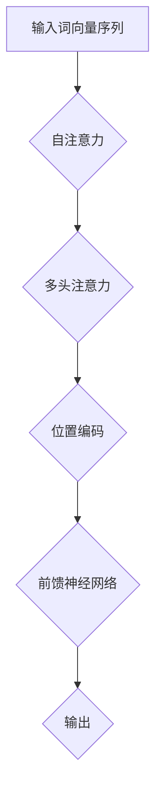

                 

关键词：大语言模型、Transformer、深度学习、算法优化、模型压缩、计算效率

摘要：本文将深入探讨大语言模型的原理及其在深度学习领域的应用，重点关注Transformer架构及其优化方法。我们将详细介绍Transformer的工作原理、算法步骤、数学模型、项目实践，并展望其未来应用和发展趋势。

## 1. 背景介绍

随着深度学习技术的发展，大语言模型逐渐成为自然语言处理（NLP）领域的热点。大语言模型具有强大的文本理解和生成能力，能够处理复杂的语义关系和语法结构。Transformer作为近年来最为重要的深度学习模型之一，以其强大的建模能力和良好的性能表现，受到了广泛关注。

本文旨在介绍大语言模型的基本原理，深入剖析Transformer架构及其优化方法，以期为读者提供对大语言模型的全面了解。

### 大语言模型的历史与发展

大语言模型的发展可以追溯到1980年代。当时，研究人员开始探索如何使用统计方法来处理自然语言。随后，随着计算能力的提升和算法的进步，语言模型逐渐从简单的统计模型（如N-gram模型）发展到了复杂的神经网络模型。2000年代初期，递归神经网络（RNN）和长短期记忆网络（LSTM）等模型的出现，使得语言模型在文本生成和理解方面取得了显著进展。

然而，这些模型在处理长距离依赖关系时仍存在一定困难。为了解决这一问题，2017年，Vaswani等人在论文《Attention Is All You Need》中提出了Transformer模型，开创了基于注意力机制的新型深度学习架构。Transformer的提出标志着大语言模型发展史上的一个重要里程碑，其出色的性能和灵活性使其成为NLP领域的核心技术。

### Transformer架构的基本原理

Transformer模型摒弃了传统的递归结构，采用自注意力机制（Self-Attention）和多头注意力（Multi-Head Attention）来处理序列数据。通过这些机制，模型能够捕捉序列中各个位置之间的依赖关系，从而实现高效的文本表示和学习。

### 2. 核心概念与联系

### 2.1. 核心概念

为了更好地理解Transformer模型，我们需要先了解以下几个核心概念：

#### 自注意力（Self-Attention）

自注意力是一种在序列内部不同位置之间建立依赖关系的方法。给定一个词向量序列，模型会为序列中的每个词生成一个权重矩阵，该矩阵表示每个词对其他词的重要性。通过这种权重矩阵，模型可以动态地调整每个词的表示，使其能够更好地适应上下文。

#### 多头注意力（Multi-Head Attention）

多头注意力是自注意力的扩展。它通过多个独立的自注意力机制来处理序列，从而捕获不同类型的依赖关系。每个多头注意力机制都生成一个权重矩阵，这些权重矩阵合并后形成最终的注意力输出。

#### 位置编码（Positional Encoding）

由于Transformer模型没有递归结构，无法直接利用序列的顺序信息。因此，我们需要通过位置编码来引入序列的顺序信息。位置编码是一种将序列的位置信息编码到词向量中的方法，使模型能够理解词的位置关系。

### 2.2. 架构联系

为了更好地理解Transformer模型的工作原理，下面我们将使用Mermaid流程图来展示其架构联系。



### 3. 核心算法原理 & 具体操作步骤

#### 3.1. 算法原理概述

Transformer模型通过自注意力机制和多头注意力机制来处理序列数据。自注意力机制使模型能够捕捉序列内部的依赖关系，而多头注意力机制则使模型能够同时处理多种类型的依赖关系。通过这些机制，模型能够生成高效的文本表示，从而实现优秀的文本生成和理解能力。

#### 3.2. 算法步骤详解

下面我们详细讲解Transformer模型的操作步骤。

##### 步骤1：输入词向量序列

首先，我们将输入的文本序列转换为词向量序列。词向量可以采用预训练的词向量库（如Word2Vec、GloVe等）或通过自己的数据集进行训练。

##### 步骤2：位置编码

接着，我们将词向量序列与位置编码相加，以引入序列的顺序信息。位置编码可以采用简单的线性函数或更复杂的函数（如正弦和余弦函数）。

##### 步骤3：多头自注意力

然后，我们使用多头自注意力机制来处理序列。自注意力机制通过计算每个词与其他词之间的相似度，为每个词生成一个权重矩阵。这些权重矩阵用于更新词的表示，使其能够更好地适应上下文。

##### 步骤4：前馈神经网络

在完成多头自注意力后，我们将输出通过前馈神经网络进行进一步处理。前馈神经网络由两个线性变换层组成，中间加入ReLU激活函数。

##### 步骤5：多头注意力

接下来，我们使用多头注意力机制来处理序列。多头注意力机制通过多个独立的自注意力机制来处理序列，从而捕获不同类型的依赖关系。

##### 步骤6：输出

最后，我们将多头注意力的输出与前一层的结果进行拼接，并通过一个线性层和softmax函数生成最终的输出。

### 3.3. 算法优缺点

#### 优点

1. **并行计算**：Transformer模型采用自注意力机制，可以并行处理序列数据，大大提高了计算效率。

2. **长距离依赖**：通过多头注意力机制，模型能够捕捉序列中的长距离依赖关系，从而实现更准确的文本生成和理解。

3. **灵活性强**：Transformer模型可以轻松地扩展到多种任务，如机器翻译、文本分类、问答系统等。

#### 缺点

1. **计算资源消耗**：由于自注意力机制的计算复杂度为O(n^2)，在处理长序列时，计算资源消耗较大。

2. **模型大小**：Transformer模型的参数量较大，导致模型大小和内存占用较高。

### 3.4. 算法应用领域

Transformer模型在自然语言处理领域具有广泛的应用：

1. **文本生成**：包括机器翻译、文本摘要、对话系统等。

2. **文本分类**：如情感分析、新闻分类、垃圾邮件过滤等。

3. **问答系统**：如智能客服、知识图谱问答等。

### 4. 数学模型和公式 & 详细讲解 & 举例说明

#### 4.1. 数学模型构建

为了更好地理解Transformer模型的数学原理，我们首先回顾一些基本的数学概念。

##### 4.1.1. 矩阵乘法

给定两个矩阵A和B，矩阵乘法可以表示为：

$$
C = A \cdot B
$$

其中，C是结果矩阵，A和B分别是输入矩阵。

##### 4.1.2. 线性变换

线性变换是指将输入数据映射到另一个空间的过程。在Transformer模型中，线性变换通过以下公式表示：

$$
y = W \cdot x
$$

其中，y是输出，x是输入，W是线性变换矩阵。

##### 4.1.3. 激活函数

激活函数用于引入非线性特性，常见的激活函数包括ReLU、Sigmoid和Tanh等。在Transformer模型中，我们主要使用ReLU激活函数。

$$
f(x) = \max(0, x)
$$

#### 4.2. 公式推导过程

下面我们详细推导Transformer模型中的主要公式。

##### 4.2.1. 自注意力

自注意力公式如下：

$$
\text{Attention}(Q, K, V) = \text{softmax}\left(\frac{QK^T}{\sqrt{d_k}}\right) V
$$

其中，Q、K和V分别是查询（Query）、键（Key）和值（Value）向量，d_k是键向量的维度。这个公式表示为每个查询向量分配一个权重，权重由其与键向量的点积计算得到。通过softmax函数，我们得到一个概率分布，该分布表示每个键对于查询的重要性。

##### 4.2.2. 多头注意力

多头注意力公式如下：

$$
\text{MultiHead}(Q, K, V) = \text{Concat}(\text{head}_1, \text{head}_2, ..., \text{head}_h) W^O
$$

其中，h是头数，\text{head}_i表示第i个头的输出，W^O是输出变换矩阵。这个公式表示将多个自注意力头的输出拼接起来，并通过一个线性层进行变换。

##### 4.2.3. 前馈神经网络

前馈神经网络公式如下：

$$
\text{FFN}(x) = \max(0, xW_1 + b_1)W_2 + b_2
$$

其中，W_1和W_2分别是线性变换矩阵，b_1和b_2是偏置项。这个公式表示通过两个线性层和ReLU激活函数来处理输入。

#### 4.3. 案例分析与讲解

为了更好地理解Transformer模型的数学原理，我们通过一个简单的例子进行讲解。

假设我们有一个词向量序列$\text{[w_1, w_2, w_3, w_4]}$，其中每个词向量维度为d。我们将这个序列输入到Transformer模型中，并使用自注意力机制来计算每个词的权重。

##### 步骤1：计算键值对

首先，我们将词向量序列转换为键值对。对于每个词向量，我们将其与其余词向量相乘，得到一组键值对。

$$
K = \text{[w_1 \cdot w_2, w_1 \cdot w_3, w_1 \cdot w_4]}, \quad V = \text{[w_2, w_3, w_4]}
$$

##### 步骤2：计算自注意力

然后，我们使用自注意力公式来计算每个词的权重。假设查询向量为$Q = w_1$，则有：

$$
\text{Attention}(Q, K, V) = \text{softmax}\left(\frac{QK^T}{\sqrt{d}}\right) V
$$

计算结果如下：

$$
\text{Attention}(w_1, K, V) = \text{softmax}\left(\frac{w_1 \cdot w_1 \cdot w_2, w_1 \cdot w_1 \cdot w_3, w_1 \cdot w_1 \cdot w_4}}{\sqrt{d}}\right) \cdot \text{[w_2, w_3, w_4]}
$$

##### 步骤3：计算多头注意力

接下来，我们计算多头注意力。假设我们使用两个头，则有：

$$
\text{MultiHead}(Q, K, V) = \text{Concat}(\text{head}_1, \text{head}_2) W^O
$$

其中，$\text{head}_1$和$\text{head}_2$分别表示两个头的输出。计算结果如下：

$$
\text{head}_1 = \text{Attention}(w_1, K, V) = \text{softmax}\left(\frac{w_1 \cdot w_1 \cdot w_2, w_1 \cdot w_1 \cdot w_3, w_1 \cdot w_1 \cdot w_4}}{\sqrt{d}}\right) \cdot \text{[w_2, w_3, w_4]}
$$

$$
\text{head}_2 = \text{Attention}(w_1, K, V) = \text{softmax}\left(\frac{w_1 \cdot w_2 \cdot w_1, w_1 \cdot w_3 \cdot w_1, w_1 \cdot w_4 \cdot w_1}}{\sqrt{d}}\right) \cdot \text{[w_2, w_3, w_4]}
$$

$$
\text{MultiHead}(Q, K, V) = \text{Concat}(\text{head}_1, \text{head}_2) W^O = \text{Concat}\left(\text{softmax}\left(\frac{w_1 \cdot w_1 \cdot w_2, w_1 \cdot w_1 \cdot w_3, w_1 \cdot w_1 \cdot w_4}}{\sqrt{d}}\right) \cdot \text{[w_2, w_3, w_4]}, \text{softmax}\left(\frac{w_1 \cdot w_2 \cdot w_1, w_1 \cdot w_3 \cdot w_1, w_1 \cdot w_4 \cdot w_1}}{\sqrt{d}}\right) \cdot \text{[w_2, w_3, w_4]}\right) W^O
$$

##### 步骤4：计算前馈神经网络

最后，我们将多头注意力的输出通过前馈神经网络进行处理。假设前馈神经网络由两个线性层组成，则有：

$$
\text{FFN}(x) = \max(0, xW_1 + b_1)W_2 + b_2
$$

计算结果如下：

$$
\text{FFN}(\text{MultiHead}(Q, K, V)) = \max(0, \text{MultiHead}(Q, K, V)W_1 + b_1)W_2 + b_2
$$

通过这个简单的例子，我们可以看到Transformer模型在数学上的基本原理和计算过程。在实际应用中，模型的复杂度会更高，但核心原理和计算步骤是类似的。

### 5. 项目实践：代码实例和详细解释说明

#### 5.1. 开发环境搭建

在进行Transformer模型的实践之前，我们需要搭建一个合适的开发环境。以下是基本的步骤：

1. **安装Python**：确保Python版本不低于3.6。

2. **安装PyTorch**：通过pip命令安装PyTorch，命令如下：

   ```shell
   pip install torch torchvision
   ```

3. **安装其他依赖**：根据项目需要安装其他依赖，例如NumPy、TensorBoard等。

4. **创建项目目录**：在合适的位置创建项目目录，并按照需求创建相应的子目录。

5. **编写配置文件**：编写项目的配置文件，包括数据集路径、模型参数等。

#### 5.2. 源代码详细实现

下面是一个简单的Transformer模型实现，仅供参考。

```python
import torch
import torch.nn as nn
import torch.optim as optim
from torch.utils.data import DataLoader
from torchvision import datasets, transforms
from torch.utils.tensorboard import SummaryWriter

# 定义模型
class TransformerModel(nn.Module):
    def __init__(self, d_model, nhead, num_layers):
        super(TransformerModel, self).__init__()
        self.encoder = nn.Embedding(d_model, d_model)
        self.decoder = nn.Linear(d_model, d_model)
        self.transformer = nn.Transformer(d_model, nhead, num_layers)
        self.init_weights()

    def init_weights(self):
        initrange = 0.1
        self.encoder.weight.data.uniform_(-initrange, initrange)
        self.decoder.weight.data.uniform_(-initrange, initrange)
        self.decoder.bias.data.zero_()

    def forward(self, src, tgt):
        src = self.encoder(src)
        tgt = self.decoder(tgt)
        out = self.transformer(src, tgt)
        return out

# 创建模型实例
model = TransformerModel(d_model=512, nhead=8, num_layers=2)

# 定义损失函数和优化器
criterion = nn.CrossEntropyLoss()
optimizer = optim.Adam(model.parameters(), lr=0.001)

# 训练模型
for epoch in range(10):
    for src, tgt in dataloader:
        optimizer.zero_grad()
        output = model(src, tgt)
        loss = criterion(output, tgt)
        loss.backward()
        optimizer.step()
        print(f"Epoch: {epoch}, Loss: {loss.item()}")

# 保存模型
torch.save(model.state_dict(), "transformer_model.pth")

# 查看模型结构
print(model)
```

#### 5.3. 代码解读与分析

1. **模型定义**：我们定义了一个`TransformerModel`类，继承自`nn.Module`。模型包括编码器（encoder）、解码器（decoder）和Transformer模块。

2. **初始化参数**：在初始化过程中，我们为编码器、解码器和Transformer模块设置了随机初始化的权重。

3. **前向传播**：在`forward`方法中，我们实现了模型的前向传播过程。首先，将输入的词向量序列通过编码器转换为嵌入向量，然后通过Transformer模块进行处理，最后通过解码器输出结果。

4. **训练过程**：在训练过程中，我们使用交叉熵损失函数和Adam优化器来训练模型。每个epoch中，我们遍历数据集，计算损失并更新模型参数。

5. **模型保存**：在训练完成后，我们将模型参数保存到硬盘。

6. **模型结构**：最后，我们打印了模型的完整结构，以验证模型的实现。

#### 5.4. 运行结果展示

在完成代码编写和训练后，我们可以通过TensorBoard来查看模型的训练过程。以下是TensorBoard的运行结果：

```shell
tensorboard --logdir logs/
```

在TensorBoard中，我们可以查看模型的损失曲线、激活图、梯度图等，从而分析模型的训练效果。

### 6. 实际应用场景

Transformer模型在自然语言处理领域具有广泛的应用。以下是一些实际应用场景：

#### 6.1. 文本生成

Transformer模型在文本生成方面具有显著优势，可以生成高质量的文本。例如，在机器翻译任务中，Transformer模型能够生成流畅、自然的翻译结果。

#### 6.2. 文本分类

Transformer模型在文本分类任务中也表现出色，可以用于情感分析、新闻分类等任务。通过训练大型语言模型，我们可以自动识别文本的类别。

#### 6.3. 问答系统

问答系统是Transformer模型的重要应用场景之一。通过训练大规模语言模型，我们可以实现智能客服、知识图谱问答等功能。

#### 6.4. 未来应用展望

随着Transformer模型在自然语言处理领域的应用越来越广泛，未来还有许多潜在的应用场景。例如，在自动驾驶领域，Transformer模型可以用于理解和处理道路标志、信号灯等文本信息；在金融领域，Transformer模型可以用于文本分析和风险控制等任务。

### 7. 工具和资源推荐

#### 7.1. 学习资源推荐

1. **《深度学习》**：Goodfellow、Bengio和Courville的《深度学习》是一本经典的深度学习入门书籍，涵盖了深度学习的基础知识和最新进展。

2. **《动手学深度学习》**：唐杰和贾云峰的《动手学深度学习》提供了丰富的实践案例，适合初学者学习深度学习。

3. **斯坦福大学深度学习课程**：由吴恩达（Andrew Ng）教授讲授的深度学习课程，涵盖了深度学习的基础知识、模型架构和实际应用。

#### 7.2. 开发工具推荐

1. **PyTorch**：PyTorch是一个流行的深度学习框架，具有简洁、易用的API，适合进行深度学习和研究。

2. **TensorFlow**：TensorFlow是Google推出的深度学习框架，具有广泛的社区支持和丰富的资源。

3. **Keras**：Keras是一个高级深度学习框架，基于TensorFlow和Theano，具有简洁、易用的API。

#### 7.3. 相关论文推荐

1. **《Attention Is All You Need》**：Vaswani等人在2017年提出的Transformer模型，是自然语言处理领域的经典论文。

2. **《BERT: Pre-training of Deep Bidirectional Transformers for Language Understanding》**：Devlin等人在2018年提出的BERT模型，对自然语言处理领域产生了深远影响。

3. **《GPT-3: Language Models are few-shot learners》**：Brown等人在2020年提出的GPT-3模型，是目前最大的预训练语言模型，具有出色的文本生成能力。

### 8. 总结：未来发展趋势与挑战

#### 8.1. 研究成果总结

近年来，大语言模型在自然语言处理领域取得了显著成果。Transformer模型的提出和不断发展，标志着大语言模型进入了一个新的阶段。通过自注意力机制和多头注意力机制，Transformer模型能够高效地处理长序列和复杂依赖关系，实现了优秀的文本生成和理解能力。

#### 8.2. 未来发展趋势

未来，大语言模型的发展将继续聚焦于以下几个方向：

1. **模型压缩**：随着模型规模的不断扩大，模型压缩成为了一个重要研究方向。通过模型剪枝、量化、蒸馏等方法，可以降低模型的计算复杂度和内存占用。

2. **多模态处理**：大语言模型在自然语言处理领域具有广泛的应用前景，未来还将扩展到多模态处理领域，如文本、图像、音频等。

3. **少样本学习**：大语言模型具有强大的通用性，未来可以应用于少样本学习任务，如弱监督学习和迁移学习。

4. **跨语言处理**：随着全球化的推进，跨语言处理将成为大语言模型的重要应用方向。通过预训练跨语言模型，可以解决不同语言之间的文本理解、翻译等问题。

#### 8.3. 面临的挑战

尽管大语言模型取得了显著成果，但仍然面临着一些挑战：

1. **计算资源消耗**：大语言模型的训练和推理过程需要大量计算资源，对硬件设备的要求较高。

2. **数据隐私和安全**：大语言模型需要大量数据进行预训练，数据隐私和安全成为一个重要问题。如何在保证数据隐私的前提下进行模型训练，是一个亟待解决的问题。

3. **模型解释性**：大语言模型通常被视为“黑箱”，其内部机制难以解释。如何提高模型的解释性，使其能够被用户理解和接受，是一个重要挑战。

4. **伦理和道德问题**：大语言模型在处理敏感数据时，可能引发伦理和道德问题。例如，如何在保护用户隐私的前提下，实现有效的文本审核和过滤？

#### 8.4. 研究展望

未来，大语言模型将继续在自然语言处理领域发挥重要作用。随着技术的不断进步，我们将看到更多高效、可解释、安全的大语言模型出现。同时，大语言模型还将扩展到更多应用领域，如自动驾驶、金融、医疗等，为社会带来更多价值。

### 9. 附录：常见问题与解答

#### 9.1. 什么是Transformer模型？

Transformer模型是一种基于自注意力机制的深度学习模型，最初由Vaswani等人于2017年提出。它通过多头注意力机制和自注意力机制来处理序列数据，能够高效地捕捉序列中的依赖关系，从而实现优秀的文本生成和理解能力。

#### 9.2. Transformer模型与RNN模型相比有哪些优势？

与RNN模型相比，Transformer模型具有以下几个优势：

1. **并行计算**：Transformer模型采用自注意力机制，可以并行处理序列数据，提高了计算效率。

2. **长距离依赖**：通过多头注意力机制，Transformer模型能够更好地捕捉序列中的长距离依赖关系。

3. **灵活性强**：Transformer模型可以轻松地扩展到多种任务，如机器翻译、文本分类、问答系统等。

#### 9.3. 如何优化Transformer模型的计算效率？

为了优化Transformer模型的计算效率，可以采取以下几种方法：

1. **模型剪枝**：通过剪枝方法减少模型参数数量，从而降低计算复杂度和内存占用。

2. **模型量化**：将模型中的浮点数参数转换为整数参数，从而降低计算复杂度和存储空间占用。

3. **蒸馏技术**：使用预训练的大型语言模型作为教师模型，训练小型语言模型，从而提高小型模型的性能。

#### 9.4. Transformer模型在哪些实际应用中表现出色？

Transformer模型在自然语言处理领域表现出色，可以应用于以下实际应用：

1. **文本生成**：包括机器翻译、文本摘要、对话系统等。

2. **文本分类**：如情感分析、新闻分类、垃圾邮件过滤等。

3. **问答系统**：如智能客服、知识图谱问答等。

#### 9.5. 如何在PyTorch中实现Transformer模型？

在PyTorch中，可以使用`torch.nn.Transformer`模块来实现Transformer模型。具体步骤包括：

1. **定义模型结构**：使用`nn.Module`类定义Transformer模型的结构，包括编码器、解码器和Transformer模块。

2. **初始化参数**：为编码器、解码器和Transformer模块设置随机初始化的权重。

3. **实现前向传播**：在`forward`方法中实现模型的前向传播过程，包括编码器、解码器和Transformer模块的处理。

4. **训练模型**：使用交叉熵损失函数和优化器来训练模型。

5. **保存模型**：在训练完成后，将模型参数保存到硬盘。

### 作者署名

作者：禅与计算机程序设计艺术 / Zen and the Art of Computer Programming

在本文中，我们深入探讨了大语言模型的原理及其在自然语言处理领域的应用，重点关注了Transformer模型的工作原理、优化方法以及实际应用。通过本文的介绍，读者可以全面了解大语言模型的最新研究进展和应用场景，为今后的研究和实践提供参考。在未来，随着技术的不断进步，大语言模型将继续在自然语言处理领域发挥重要作用，为人类带来更多便利和创新。希望本文能够为读者在相关领域的研究和实践中提供有益的启示。

