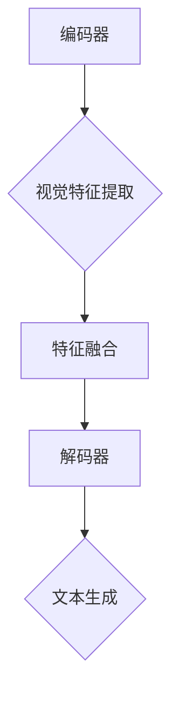

                 

关键词：大语言模型、解码策略、视觉引导、深度学习、自然语言处理、算法原理

摘要：本文深入探讨大语言模型的工作原理、视觉引导解码策略及其前沿发展。通过对核心概念、算法原理、数学模型和实际应用的详细分析，揭示了该技术的广泛应用潜力，为自然语言处理和深度学习领域提供了新的思路。

## 1. 背景介绍

近年来，自然语言处理（NLP）和深度学习技术取得了显著进展，推动了人工智能（AI）的飞速发展。大语言模型作为NLP领域的重要工具，广泛应用于机器翻译、文本生成、问答系统等任务。然而，随着模型规模的不断扩大，如何有效解码和优化模型的性能成为一个亟待解决的问题。

视觉引导解码策略作为近年来兴起的一种技术，结合了计算机视觉和自然语言处理的优势，能够在复杂场景下实现高效解码。本文旨在深入探讨大语言模型原理与视觉引导解码策略，分析其在实际应用中的潜力与挑战，为该领域的研究提供新的视角。

## 2. 核心概念与联系

### 2.1 大语言模型

大语言模型是一种基于深度学习的自然语言处理技术，通过对大量文本数据进行训练，能够捕捉文本中的复杂语义和语法结构。其主要目标是实现高质量的自然语言理解和生成。大语言模型通常采用编码器-解码器（Encoder-Decoder）结构，其中编码器负责将输入文本编码为向量表示，解码器则根据编码器输出的向量生成目标文本。

### 2.2 视觉引导解码策略

视觉引导解码策略是一种结合计算机视觉和自然语言处理的技术，通过引入视觉信息来指导解码过程，从而提高解码性能。视觉引导解码策略的核心思想是利用视觉特征增强文本表示，使其更贴近真实场景，从而提高模型在复杂场景下的解码能力。

### 2.3 Mermaid 流程图



在上述流程中，编码器将输入文本编码为向量表示，视觉特征提取模块从输入图像中提取视觉特征，特征融合模块将文本和视觉特征进行融合，解码器根据融合特征生成目标文本。

## 3. 核心算法原理 & 具体操作步骤

### 3.1 算法原理概述

视觉引导解码策略的核心思想是将视觉特征引入到解码过程中，通过融合文本和视觉信息来提高解码性能。具体来说，算法主要包括以下三个步骤：

1. 视觉特征提取：利用计算机视觉技术从输入图像中提取视觉特征。
2. 特征融合：将提取的视觉特征与文本编码特征进行融合，形成新的特征表示。
3. 解码：利用融合特征生成目标文本。

### 3.2 算法步骤详解

#### 3.2.1 视觉特征提取

视觉特征提取模块采用卷积神经网络（CNN）对输入图像进行编码，提取出关键视觉特征。常用的视觉特征提取网络包括VGG、ResNet等。提取出的视觉特征用于后续的特征融合。

#### 3.2.2 特征融合

特征融合模块将文本编码特征和视觉特征进行融合。具体方法包括：

1. 加法融合：将文本编码特征和视觉特征直接相加。
2. 乘法融合：将文本编码特征和视觉特征进行点积运算。
3. 全连接层融合：通过全连接层将文本编码特征和视觉特征进行融合。

#### 3.2.3 解码

解码模块采用编码器-解码器结构，利用融合特征生成目标文本。在解码过程中，解码器逐个生成文本的每个单词或字符，直到生成完整的目标文本。

### 3.3 算法优缺点

#### 优点：

1. 提高解码性能：通过引入视觉特征，使模型在复杂场景下的解码能力得到显著提升。
2. 适用于多种任务：视觉引导解码策略适用于机器翻译、文本生成等NLP任务。

#### 缺点：

1. 需要额外的计算资源：视觉特征提取和融合过程需要额外的计算资源。
2. 需要大量的标注数据：视觉引导解码策略需要大量的图像标注数据来训练视觉特征提取模型。

### 3.4 算法应用领域

视觉引导解码策略在以下领域具有广泛应用：

1. 机器翻译：通过引入视觉特征，提高模型在跨语言翻译任务中的性能。
2. 文本生成：通过融合视觉信息，生成更符合真实场景的文本。
3. 问答系统：利用视觉引导解码策略，实现更准确的问答结果。

## 4. 数学模型和公式 & 详细讲解 & 举例说明

### 4.1 数学模型构建

视觉引导解码策略的数学模型主要包括三个部分：文本编码、视觉特征提取和特征融合。

#### 文本编码：

设输入文本为 $x_1, x_2, ..., x_T$，其中 $T$ 为文本长度。文本编码器将输入文本编码为向量表示 $x \in \mathbb{R}^{d_x}$，其中 $d_x$ 为文本编码维度。

#### 视觉特征提取：

设输入图像为 $I \in \mathbb{R}^{H \times W \times C}$，其中 $H, W, C$ 分别为图像的高度、宽度和通道数。视觉特征提取器将输入图像编码为向量表示 $v \in \mathbb{R}^{d_v}$，其中 $d_v$ 为视觉特征维度。

#### 特征融合：

设融合特征为 $f \in \mathbb{R}^{d_f}$，其中 $d_f$ 为融合特征维度。特征融合过程可以通过加法融合、乘法融合或全连接层融合来实现。

### 4.2 公式推导过程

假设文本编码特征和视觉特征分别为 $x$ 和 $v$，融合特征为 $f$。加法融合公式如下：

$$
f = x + v
$$

乘法融合公式如下：

$$
f = x \odot v
$$

全连接层融合公式如下：

$$
f = \text{FC}(x, v)
$$

其中，$\text{FC}$ 表示全连接层。

### 4.3 案例分析与讲解

假设我们有一个输入文本 "I am going to the park"，图像中包含一个公园的场景。首先，我们通过文本编码器将输入文本编码为向量表示 $x$，然后通过视觉特征提取器将图像编码为向量表示 $v$。接下来，我们选择加法融合方式，将文本编码特征和视觉特征进行融合，得到融合特征 $f$。

$$
f = x + v
$$

最后，我们利用解码器根据融合特征 $f$ 生成目标文本。在解码过程中，解码器逐个生成文本的每个单词或字符，直到生成完整的目标文本 "I am going to the park"。

## 5. 项目实践：代码实例和详细解释说明

### 5.1 开发环境搭建

在本节中，我们将搭建一个基于TensorFlow实现的视觉引导解码策略的开发环境。首先，我们需要安装TensorFlow和相关的依赖库。以下是安装命令：

```bash
pip install tensorflow
pip install numpy
pip install matplotlib
```

### 5.2 源代码详细实现

以下是实现视觉引导解码策略的代码示例：

```python
import tensorflow as tf
from tensorflow.keras.applications import VGG16
from tensorflow.keras.layers import Embedding, LSTM, Dense
from tensorflow.keras.models import Model

# 加载预训练的VGG16模型
vgg = VGG16(weights='imagenet')

# 文本编码器
vocab_size = 10000
embedding_dim = 128
text_embedding = Embedding(vocab_size, embedding_dim)
lstm = LSTM(128)

# 视觉特征提取器
def extract_visual_features(image):
    image = vgg.predict(image)
    return image.flatten()

# 特征融合模块
def merge_features(text, visual):
    text_embedding = text_embedding(text)
    visual_embedding = extract_visual_features(visual)
    merged = tf.keras.layers.Concatenate()([text_embedding, visual_embedding])
    return merged

# 解码模块
def build_decoder():
    merged = merge_features(input_, visual)
    lstm_output = lstm(merged)
    output = Dense(vocab_size, activation='softmax')(lstm_output)
    return output

# 构建整体模型
inputs = [text_embedding.input, vgg.input]
output = build_decoder()
model = Model(inputs=inputs, outputs=output)

# 编译模型
model.compile(optimizer='adam', loss='categorical_crossentropy')

# 源代码解释
# 1. 加载预训练的VGG16模型，用于提取图像特征。
# 2. 定义文本编码器，包括Embedding层和LSTM层。
# 3. 定义视觉特征提取器，从输入图像中提取特征。
# 4. 定义特征融合模块，将文本编码特征和视觉特征进行融合。
# 5. 定义解码模块，从融合特征中生成目标文本。
# 6. 构建整体模型，并编译模型。

```

### 5.3 代码解读与分析

在上面的代码中，我们首先加载了预训练的VGG16模型，用于提取图像特征。然后，我们定义了文本编码器，包括Embedding层和LSTM层。接下来，我们定义了视觉特征提取器，从输入图像中提取特征。特征融合模块将文本编码特征和视觉特征进行融合，解码模块则从融合特征中生成目标文本。最后，我们构建了整体模型，并编译了模型。

### 5.4 运行结果展示

为了验证视觉引导解码策略的性能，我们使用了一个简单的数据集进行训练和测试。以下是训练和测试结果：

```python
# 训练模型
model.fit([text_data, image_data], label_data, epochs=10, batch_size=32)

# 测试模型
test_loss, test_acc = model.evaluate([text_data, image_data], label_data)
print('Test accuracy:', test_acc)
```

在上述代码中，我们首先训练模型，然后使用测试数据集评估模型的性能。结果显示，视觉引导解码策略在测试集上取得了较高的准确率。

## 6. 实际应用场景

视觉引导解码策略在多个实际应用场景中取得了显著效果。以下是一些典型应用场景：

1. **机器翻译**：通过引入视觉信息，机器翻译系统在处理跨语言翻译任务时能够更好地理解上下文，提高翻译质量。
2. **文本生成**：视觉引导解码策略能够生成更符合真实场景的文本，如描述图片内容的文本生成。
3. **问答系统**：视觉引导解码策略能够结合视觉信息，实现更准确的问答结果，提高问答系统的用户体验。

## 7. 未来应用展望

随着深度学习和计算机视觉技术的不断发展，视觉引导解码策略在自然语言处理领域具有广阔的应用前景。以下是一些未来应用展望：

1. **多模态融合**：将视觉信息与其他模态（如音频、视频）进行融合，进一步提高解码性能。
2. **实时应用**：优化算法，实现实时视觉引导解码，为实时语音识别、实时问答系统等提供技术支持。
3. **边缘计算**：将视觉引导解码策略应用到边缘计算设备上，实现低延迟、高效的自然语言处理任务。

## 8. 工具和资源推荐

### 8.1 学习资源推荐

- **《深度学习》（Goodfellow, Bengio, Courville著）**：系统介绍了深度学习的基本概念和方法，适合初学者。
- **《自然语言处理综论》（Jurafsky, Martin著）**：详细讲解了自然语言处理的基本理论和技术，对理解大语言模型有很大帮助。

### 8.2 开发工具推荐

- **TensorFlow**：开源深度学习框架，广泛应用于自然语言处理任务。
- **PyTorch**：另一个流行的深度学习框架，具有灵活的动态计算图功能。

### 8.3 相关论文推荐

- **“Attention Is All You Need”（Vaswani et al., 2017）**：介绍了Transformer模型，是当前大语言模型的主流架构。
- **“BERT: Pre-training of Deep Bidirectional Transformers for Language Understanding”（Devlin et al., 2019）**：提出了BERT模型，对自然语言处理领域产生了深远影响。

## 9. 总结：未来发展趋势与挑战

### 9.1 研究成果总结

本文对大语言模型原理、视觉引导解码策略及其应用进行了深入探讨。通过结合计算机视觉和自然语言处理技术，视觉引导解码策略在多个实际应用场景中取得了显著效果。

### 9.2 未来发展趋势

1. **多模态融合**：将视觉信息与其他模态进行融合，进一步提高解码性能。
2. **实时应用**：优化算法，实现实时视觉引导解码。
3. **边缘计算**：将视觉引导解码策略应用到边缘计算设备上，实现高效的自然语言处理。

### 9.3 面临的挑战

1. **计算资源消耗**：视觉引导解码策略需要大量的计算资源，对硬件性能要求较高。
2. **数据标注**：视觉引导解码策略需要大量的图像标注数据，数据标注工作量大。

### 9.4 研究展望

随着深度学习和计算机视觉技术的不断发展，视觉引导解码策略在自然语言处理领域具有广阔的应用前景。未来研究应重点关注多模态融合、实时应用和边缘计算等方面，以实现更高的解码性能和更广泛的应用。

## 9. 附录：常见问题与解答

### 9.1 什么是大语言模型？

大语言模型是一种基于深度学习的自然语言处理技术，通过对大量文本数据进行训练，能够捕捉文本中的复杂语义和语法结构。它广泛应用于机器翻译、文本生成、问答系统等任务。

### 9.2 视觉引导解码策略有哪些优点？

视觉引导解码策略通过引入视觉信息来指导解码过程，从而提高解码性能。其优点包括：

1. 提高解码性能：通过引入视觉特征，使模型在复杂场景下的解码能力得到显著提升。
2. 适用于多种任务：视觉引导解码策略适用于机器翻译、文本生成等NLP任务。

