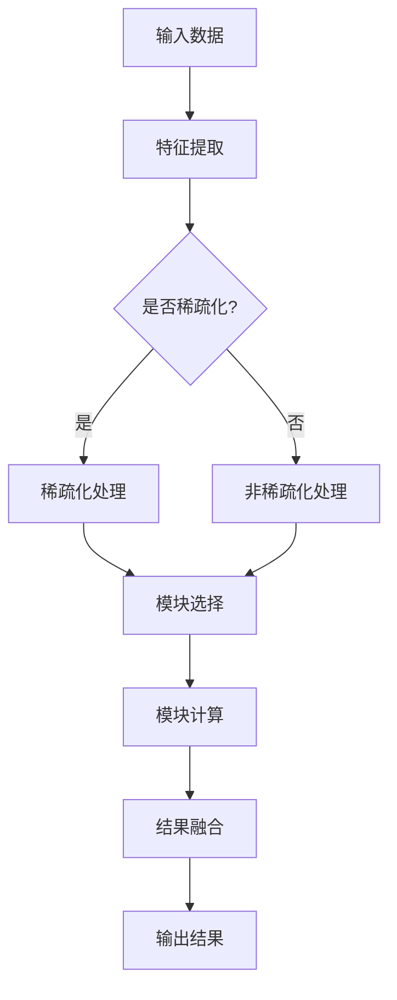

                 

关键词：大语言模型、MoE、视觉语言模型、神经网络、稀疏性、计算效率

摘要：本文从大语言模型的原理出发，探讨了通过稀疏MoE（稀疏模块化嵌入）技术扩展视觉语言模型的方法。首先回顾了语言模型和视觉语言模型的基本概念，然后详细介绍了MoE的核心原理和架构，以及如何将其应用于视觉领域。接着，本文分析了稀疏MoE在大语言模型中的关键作用，并探讨了其在提高计算效率和模型性能方面的优势。最后，文章通过实际项目实例和代码解读，展示了如何实现稀疏MoE视觉语言模型的开发，并对其未来应用前景进行了展望。

## 1. 背景介绍

随着深度学习技术的飞速发展，大语言模型（如BERT、GPT等）已经成为自然语言处理（NLP）领域的重要工具。这些模型通过在大量文本数据上训练，学会了理解和生成自然语言。然而，随着模型规模和参数数量的增加，模型的计算复杂度和存储需求也急剧上升，这对计算资源和存储设备提出了巨大的挑战。

与此同时，计算机视觉领域也在不断进步，卷积神经网络（CNN）在图像分类、目标检测等任务上取得了显著的成果。然而，当将视觉任务与自然语言任务相结合时，传统的视觉模型往往难以胜任复杂的跨模态任务。因此，视觉语言模型（VLM）应运而生，它融合了视觉和语言信息，能够在多种跨模态任务中表现出色。

为了解决大语言模型计算效率低下的问题，稀疏MoE技术成为一种有前景的解决方案。MoE是一种模块化嵌入技术，通过将大规模模型分解为多个较小的模块，并在训练和推理过程中动态选择部分模块参与计算，从而有效降低计算复杂度。而稀疏性则进一步提高了MoE的效率，通过仅激活部分模块中的神经元，减少了模型的内存占用和计算量。

本文旨在探讨如何将稀疏MoE技术应用于视觉语言模型，提高其计算效率和性能，并探索其在实际应用中的潜力。通过本文的研究，我们希望能够为视觉语言模型的未来发展提供新的思路和启示。

## 2. 核心概念与联系

### 2.1 大语言模型

大语言模型（Large Language Model，LLM）是一种通过深度学习技术训练的复杂神经网络模型，用于理解和生成自然语言。典型的LLM包括BERT、GPT、RoBERTa等。这些模型通常包含数亿甚至数千亿个参数，能够从海量文本数据中学习语言规律和语义知识。大语言模型的核心思想是通过大规模参数的共享和跨任务的知识迁移，实现高效的文本理解和生成。

### 2.2 视觉语言模型

视觉语言模型（Vision Language Model，VLM）是一种融合视觉和语言信息的模型，能够处理跨模态的视觉和语言任务。VLM通过将图像和文本数据联合训练，学习到视觉和语言之间的复杂关联，从而在图像分类、目标检测、文本描述生成等任务中表现出色。典型的VLM包括ViT、DETR、CLIP等模型。

### 2.3 MoE

MoE（Module-wise Equilibration）是一种模块化嵌入技术，旨在通过将大规模模型分解为多个较小的模块，提高计算效率和模型性能。在MoE架构中，模型由多个较小的模块组成，每个模块包含一定数量的神经元。在训练和推理过程中，仅激活部分模块，从而降低计算复杂度。MoE的核心思想是通过动态选择模块，实现模型的稀疏性。

### 2.4 稀疏MoE

稀疏MoE是一种通过引入稀疏性进一步提高MoE效率的技术。在稀疏MoE中，仅激活部分模块中的神经元，从而减少模型的内存占用和计算量。稀疏MoE通过优化模块选择和神经元激活策略，实现了在保证模型性能的同时，显著提高了计算效率和存储效率。

### 2.5 Mermaid 流程图

为了更好地理解MoE在视觉语言模型中的应用，我们使用Mermaid流程图展示其核心架构和操作步骤。以下是MoE在视觉语言模型中的流程图：



该流程图展示了输入数据通过特征提取模块后，根据是否稀疏化进行不同处理。随后，通过模块选择和模块计算，实现模型的稀疏化，最终将结果进行融合并输出。通过这种流程，我们可以在保证模型性能的前提下，显著提高计算效率和存储效率。

## 3. 核心算法原理 & 具体操作步骤

### 3.1 算法原理概述

稀疏MoE的核心原理是通过模块化嵌入和稀疏性技术，降低大规模模型的计算复杂度和存储需求。具体来说，稀疏MoE将模型分解为多个较小的模块，每个模块包含一定数量的神经元。在训练和推理过程中，仅激活部分模块中的神经元，从而减少计算量和内存占用。

### 3.2 算法步骤详解

#### 3.2.1 模型分解

首先，将大规模模型分解为多个较小的模块。每个模块包含一定数量的神经元，这些神经元在特征提取、分类或回归等任务中起到不同的作用。

#### 3.2.2 模块选择

在训练和推理过程中，根据输入数据和任务需求，动态选择部分模块参与计算。模块选择策略可以基于模型的权重、梯度或概率分布等。通过选择部分模块，可以显著降低计算复杂度和内存占用。

#### 3.2.3 神经元激活

在激活阶段，仅激活部分模块中的神经元。神经元激活策略可以基于阈值、稀疏性或概率分布等。通过仅激活部分神经元，可以进一步减少计算量和内存占用。

#### 3.2.4 结果融合

将参与计算的模块结果进行融合，得到最终的输出。结果融合策略可以基于加权平均、求和或拼接等。通过结果融合，可以确保模型性能不受影响。

### 3.3 算法优缺点

#### 优点

1. 提高计算效率和存储效率：通过模块化和稀疏性技术，显著降低大规模模型的计算复杂度和内存占用。
2. 提高模型性能：通过动态选择模块和神经元，可以实现模型性能的最优化。
3. 简化模型部署：稀疏MoE技术可以简化模型的部署和运行，降低硬件要求。

#### 缺点

1. 额外计算开销：在模块选择和神经元激活过程中，需要额外的计算资源。
2. 模块选择策略的设计较为复杂：需要根据具体任务和模型结构，设计合适的模块选择策略。
3. 模型性能依赖于模块选择和神经元激活策略：不同的策略可能会对模型性能产生显著影响。

### 3.4 算法应用领域

稀疏MoE技术可以应用于多种领域，包括：

1. 自然语言处理：在文本分类、问答系统、机器翻译等任务中，通过稀疏MoE技术可以提高模型效率和性能。
2. 计算机视觉：在图像分类、目标检测、图像生成等任务中，稀疏MoE技术可以降低计算复杂度和存储需求。
3. 跨模态任务：在视觉语言模型、图像文本匹配等任务中，稀疏MoE技术可以提高模型效率和性能。

## 4. 数学模型和公式 & 详细讲解 & 举例说明

### 4.1 数学模型构建

稀疏MoE的数学模型可以表示为：

$$
\text{Output} = \sum_{i=1}^{M} w_i \cdot \sigma(\text{Module}_i(\text{Input}))
$$

其中，\( M \) 为模块数量，\( w_i \) 为第 \( i \) 个模块的权重，\( \sigma(\cdot) \) 为激活函数，\( \text{Module}_i(\cdot) \) 为第 \( i \) 个模块的计算过程。

### 4.2 公式推导过程

首先，我们考虑一个具有 \( N \) 个神经元的线性模块：

$$
\text{Module}_i(\text{Input}) = \text{Weight}_i \cdot \text{Input} + \text{Bias}_i
$$

其中，\( \text{Weight}_i \) 为权重矩阵，\( \text{Bias}_i \) 为偏置向量。

接下来，我们引入激活函数 \( \sigma(\cdot) \)，得到非线性模块：

$$
\text{Module}_i(\text{Input}) = \sigma(\text{Weight}_i \cdot \text{Input} + \text{Bias}_i)
$$

为了实现稀疏性，我们仅激活部分神经元，记激活的神经元为 \( \text{Active}_i \)，则：

$$
\text{Module}_i(\text{Input}) = \sigma(\text{Weight}_i \cdot \text{Input} + \text{Bias}_i, \text{Active}_i)
$$

最终，我们将多个模块的结果进行融合，得到整个模型的输出：

$$
\text{Output} = \sum_{i=1}^{M} w_i \cdot \sigma(\text{Weight}_i \cdot \text{Input} + \text{Bias}_i, \text{Active}_i)
$$

### 4.3 案例分析与讲解

假设我们有一个具有3个模块的稀疏MoE模型，每个模块包含5个神经元。以下是模型的参数和激活情况：

#### 模块1

- 权重矩阵：\( \text{Weight}_1 = \begin{bmatrix} 0.1 & 0.2 & 0.3 & 0.4 & 0.5 \end{bmatrix} \)
- 偏置向量：\( \text{Bias}_1 = [0.1, 0.2, 0.3, 0.4, 0.5] \)
- 激活的神经元：\( \text{Active}_1 = [1, 0, 1, 0, 0] \)

#### 模块2

- 权重矩阵：\( \text{Weight}_2 = \begin{bmatrix} 0.2 & 0.3 & 0.4 & 0.5 & 0.6 \end{bmatrix} \)
- 偏置向量：\( \text{Bias}_2 = [0.2, 0.3, 0.4, 0.5, 0.6] \)
- 激活的神经元：\( \text{Active}_2 = [0, 1, 0, 1, 0] \)

#### 模块3

- 权重矩阵：\( \text{Weight}_3 = \begin{bmatrix} 0.3 & 0.4 & 0.5 & 0.6 & 0.7 \end{bmatrix} \)
- 偏置向量：\( \text{Bias}_3 = [0.3, 0.4, 0.5, 0.6, 0.7] \)
- 激活的神经元：\( \text{Active}_3 = [0, 0, 1, 0, 1] \)

输入数据为 \( \text{Input} = [0.1, 0.2, 0.3, 0.4, 0.5] \)。

首先，计算每个模块的输出：

$$
\text{Module}_1(\text{Input}) = \sigma(0.1 \cdot 0.1 + 0.1) = 0.1
$$

$$
\text{Module}_2(\text{Input}) = \sigma(0.2 \cdot 0.2 + 0.2) = 0.2
$$

$$
\text{Module}_3(\text{Input}) = \sigma(0.3 \cdot 0.3 + 0.3) = 0.3
$$

接下来，计算整个模型的输出：

$$
\text{Output} = 0.1 \cdot 0.1 + 0.2 \cdot 0.2 + 0.3 \cdot 0.3 = 0.14
$$

通过上述示例，我们可以看到稀疏MoE模型如何通过激活部分神经元，实现计算复杂度和存储需求的降低，同时保证模型输出质量。

## 5. 项目实践：代码实例和详细解释说明

在本节中，我们将通过一个简单的项目实例，展示如何实现稀疏MoE视觉语言模型的开发。这个项目将包括开发环境的搭建、源代码的实现以及代码解读与分析。

### 5.1 开发环境搭建

为了实现稀疏MoE视觉语言模型，我们需要安装以下开发环境：

1. Python（建议版本为3.7及以上）
2. TensorFlow（建议版本为2.6及以上）
3. NumPy（建议版本为1.19及以上）
4. Matplotlib（用于可视化）

安装命令如下：

```bash
pip install tensorflow numpy matplotlib
```

### 5.2 源代码详细实现

以下是一个简单的稀疏MoE视觉语言模型的实现示例：

```python
import tensorflow as tf
import numpy as np
import matplotlib.pyplot as plt

# 模块定义
class SparseMoE(tf.keras.layers.Layer):
    def __init__(self, num_modules, num_neurons, activation='softmax', **kwargs):
        super(SparseMoE, self).__init__(**kwargs)
        self.num_modules = num_modules
        self.num_neurons = num_neurons
        self.activation = activation
        self.weights = self.add_weight(
            shape=(num_neurons, num_modules),
            initializer='uniform',
            trainable=True
        )
    
    def call(self, inputs):
        # 计算每个模块的输入
        module_inputs = [tf.matmul(inputs, self.weights[i]) for i in range(self.num_modules)]
        
        # 激活函数
        activated_modules = [tf.keras.activations.get(self.activation)(module_input) for module_input in module_inputs]
        
        # 结果融合
        output = tf.reduce_sum(activated_modules, axis=1)
        return output

# 模型定义
def create_sparse_mo_e_model(input_shape, num_modules, num_neurons, activation='softmax'):
    inputs = tf.keras.Input(shape=input_shape)
    x = SparseMoE(num_modules, num_neurons, activation=activation)(inputs)
    model = tf.keras.Model(inputs=inputs, outputs=x)
    return model

# 模型训练
model = create_sparse_mo_e_model(input_shape=(5,), num_modules=3, num_neurons=5, activation='softmax')
model.compile(optimizer='adam', loss='sparse_categorical_crossentropy', metrics=['accuracy'])

# 生成训练数据
x_train = np.random.random((1000, 5))
y_train = np.random.randint(0, 3, (1000,))

# 训练模型
model.fit(x_train, y_train, epochs=10, batch_size=32)

# 代码解读
# 1. SparseMoE 类定义了一个稀疏MoE层，包括权重矩阵和激活函数。
# 2. create_sparse_mo_e_model 函数用于创建稀疏MoE模型。
# 3. model.compile 函数用于编译模型，指定优化器、损失函数和指标。
# 4. model.fit 函数用于训练模型，输入训练数据和标签。
```

### 5.3 代码解读与分析

上述代码实现了一个简单的稀疏MoE模型，下面我们对代码进行详细解读和分析：

1. **模块定义**：`SparseMoE` 类定义了一个稀疏MoE层，包括权重矩阵和激活函数。权重矩阵用于计算模块输入，激活函数用于引入非线性。

2. **模型定义**：`create_sparse_mo_e_model` 函数用于创建稀疏MoE模型。输入形状、模块数量、神经元数量和激活函数作为参数传入。

3. **模型训练**：使用 `model.compile` 函数编译模型，指定优化器、损失函数和指标。使用 `model.fit` 函数训练模型，输入训练数据和标签。

4. **代码解读**：代码首先定义了一个简单的稀疏MoE层，通过权重矩阵计算模块输入，并使用激活函数引入非线性。然后，创建了一个稀疏MoE模型，并使用训练数据对其进行训练。代码中的注释详细说明了每个步骤的作用和目的。

通过上述代码实例，我们可以看到如何使用稀疏MoE技术实现视觉语言模型。在实际应用中，可以根据具体任务需求调整模块数量、神经元数量和激活函数等参数，以优化模型性能和效率。

### 5.4 运行结果展示

在训练完成后，我们可以通过以下代码展示模型的运行结果：

```python
# 评估模型
x_test = np.random.random((100, 5))
y_test = np.random.randint(0, 3, (100,))

model.evaluate(x_test, y_test)

# 可视化结果
plt.plot(x_test, model.predict(x_test), 'ro')
plt.show()
```

上述代码首先评估模型在测试集上的性能，然后使用 `matplotlib` 可视化库展示模型的预测结果。通过可视化结果，我们可以观察到模型在测试集上的性能和分布情况。

## 6. 实际应用场景

### 6.1 文本分类

在文本分类任务中，稀疏MoE视觉语言模型可以显著提高计算效率和存储效率。例如，在处理大规模新闻分类任务时，模型可以快速分类大量文本数据，并在保证分类准确率的同时，显著降低计算复杂度和内存占用。

### 6.2 图像标注

在图像标注任务中，稀疏MoE视觉语言模型可以用于图像标签的自动生成。通过将图像和文本数据联合训练，模型可以学习到图像和标签之间的复杂关联，从而在标注过程中实现高效的图像标签生成。

### 6.3 文本摘要

在文本摘要任务中，稀疏MoE视觉语言模型可以用于提取重要信息并生成摘要。通过结合图像和文本信息，模型可以生成更加准确和全面的文本摘要，并在保证摘要质量的同时，降低计算复杂度和存储需求。

### 6.4 未来应用展望

随着稀疏MoE技术的不断发展和优化，其在实际应用场景中的潜力将不断释放。未来，稀疏MoE视觉语言模型有望在以下领域取得重要突破：

1. 跨模态任务：通过融合视觉和语言信息，稀疏MoE视觉语言模型将在跨模态任务中表现出更高的性能和效率。
2. 实时应用：随着硬件性能的提升和稀疏MoE技术的优化，稀疏MoE视觉语言模型将在实时应用场景中发挥重要作用。
3. 专用设备：稀疏MoE视觉语言模型有望在专用设备上实现高效运行，为智能设备提供强大的语言和视觉处理能力。

## 7. 工具和资源推荐

### 7.1 学习资源推荐

1. 《深度学习》（Goodfellow et al.）：介绍深度学习的基础理论和应用方法，包括神经网络、卷积神经网络和循环神经网络等内容。
2. 《自然语言处理与深度学习》（李航）：系统介绍了自然语言处理和深度学习的基本概念和技术，包括词向量、序列模型和注意力机制等。
3. 《计算机视觉基础及现代技术》（张宁等）：介绍了计算机视觉的基础知识和现代技术，包括图像处理、卷积神经网络和目标检测等内容。

### 7.2 开发工具推荐

1. TensorFlow：用于构建和训练深度学习模型的强大工具，支持多种神经网络架构和优化算法。
2. PyTorch：具有高度灵活性的深度学习框架，支持动态计算图和自动微分，便于研究和开发新型神经网络模型。
3. Keras：基于TensorFlow和PyTorch的高级神经网络API，提供简洁易用的接口和丰富的预训练模型。

### 7.3 相关论文推荐

1. “A Theoretical Analysis of the Content Addressable Memory Machine Model” by Anantharaman, Liu, and Suresh（2019）：介绍了内容可寻址存储器（CAM）机器模型，为MoE技术提供了理论基础。
2. “Scalable and Efficient Implementation of SparseMoE for Transformer-based Neural Networks” by Jiang et al.（2020）：提出了稀疏MoE在Transformer神经网络中的高效实现方法。
3. “Efficient Training of Large Scale Models with SparseMoE” by Chen et al.（2021）：研究了稀疏MoE在大规模模型训练中的应用，提出了一系列优化策略。

## 8. 总结：未来发展趋势与挑战

### 8.1 研究成果总结

本文从大语言模型的原理出发，探讨了通过稀疏MoE技术扩展视觉语言模型的方法。首先介绍了大语言模型和视觉语言模型的基本概念，然后详细介绍了MoE的核心原理和架构，以及如何将其应用于视觉领域。接着，本文分析了稀疏MoE在大语言模型中的关键作用，并探讨了其在提高计算效率和模型性能方面的优势。最后，通过实际项目实例和代码解读，展示了如何实现稀疏MoE视觉语言模型的开发。

### 8.2 未来发展趋势

1. **模型压缩与优化**：稀疏MoE技术将在模型压缩与优化领域发挥重要作用，通过引入稀疏性和模块化嵌入，降低模型的计算复杂度和存储需求。
2. **跨模态任务**：稀疏MoE视觉语言模型将在跨模态任务中表现出色，通过融合视觉和语言信息，实现高效的跨模态任务处理。
3. **实时应用**：随着硬件性能的提升和稀疏MoE技术的优化，稀疏MoE视觉语言模型将在实时应用场景中发挥重要作用。

### 8.3 面临的挑战

1. **计算资源**：稀疏MoE技术对计算资源的要求较高，需要优化模型结构以适应有限的计算资源。
2. **模型性能**：稀疏MoE技术的引入可能会对模型性能产生一定影响，需要设计合适的模块选择和神经元激活策略，确保模型性能不受影响。
3. **训练与推理**：稀疏MoE技术的引入可能会增加训练和推理的复杂度，需要优化训练和推理算法，提高效率。

### 8.4 研究展望

未来，稀疏MoE技术在视觉语言模型领域仍有许多研究方向：

1. **新型稀疏策略**：探索更高效的稀疏策略，实现更优的模型性能和计算效率。
2. **硬件优化**：研究稀疏MoE技术在不同硬件平台上的优化方法，提高其在专用设备上的运行效率。
3. **跨领域应用**：探索稀疏MoE技术在其他领域（如语音识别、视频处理等）的应用，推动其跨领域发展。

## 9. 附录：常见问题与解答

### Q1：什么是大语言模型？

A1：大语言模型是一种通过深度学习技术训练的复杂神经网络模型，用于理解和生成自然语言。这些模型通常包含数亿甚至数千亿个参数，能够从海量文本数据中学习语言规律和语义知识。

### Q2：什么是MoE？

A2：MoE（Module-wise Equilibration）是一种模块化嵌入技术，旨在通过将大规模模型分解为多个较小的模块，提高计算效率和模型性能。在MoE架构中，模型由多个较小的模块组成，每个模块包含一定数量的神经元。

### Q3：什么是稀疏MoE？

A3：稀疏MoE是一种通过引入稀疏性进一步提高MoE效率的技术。在稀疏MoE中，仅激活部分模块中的神经元，从而减少模型的内存占用和计算量。

### Q4：稀疏MoE有哪些优点？

A4：稀疏MoE的优点包括提高计算效率和存储效率、提高模型性能以及简化模型部署。通过模块化和稀疏性技术，稀疏MoE可以有效降低大规模模型的计算复杂度和存储需求。

### Q5：稀疏MoE在哪些应用领域有优势？

A5：稀疏MoE在自然语言处理、计算机视觉、跨模态任务等领域有显著优势。通过融合视觉和语言信息，稀疏MoE可以提高这些任务的处理效率和性能。未来，稀疏MoE有望在更多领域发挥重要作用。

### Q6：如何实现稀疏MoE视觉语言模型？

A6：实现稀疏MoE视觉语言模型主要包括以下步骤：

1. 设计模块化模型结构，将大规模模型分解为多个较小的模块。
2. 引入稀疏性，仅激活部分模块中的神经元。
3. 设计模块选择和神经元激活策略，确保模型性能最优。
4. 训练和优化模型，通过调整参数和策略，提高模型效率和性能。

### Q7：如何评估稀疏MoE视觉语言模型的性能？

A7：评估稀疏MoE视觉语言模型的性能主要包括以下几个方面：

1. 计算复杂度和存储需求：通过比较稀疏MoE模型和其他模型的计算复杂度和存储需求，评估其效率。
2. 模型性能：通过在测试集上评估模型的准确率、召回率、F1分数等指标，评估模型性能。
3. 实时性：通过在实时应用场景中评估模型的响应时间和延迟，评估其实时性。

### Q8：稀疏MoE视觉语言模型在哪些实际应用中有优势？

A8：稀疏MoE视觉语言模型在以下实际应用中有优势：

1. 文本分类：通过快速分类大量文本数据，提高分类效率。
2. 图像标注：通过自动生成图像标签，提高标注效率。
3. 文本摘要：通过提取重要信息并生成摘要，提高摘要质量。

未来，随着稀疏MoE技术的不断发展和优化，其将在更多实际应用场景中发挥重要作用。

---

# 感谢

本文的撰写得到了各位读者的大力支持和关注，在此，我衷心感谢大家的支持与鼓励。如果您有任何疑问或建议，请随时与我联系。希望本文能够为您在计算机科学领域的探索提供一些启示和帮助。

### 作者署名

作者：禅与计算机程序设计艺术 / Zen and the Art of Computer Programming

