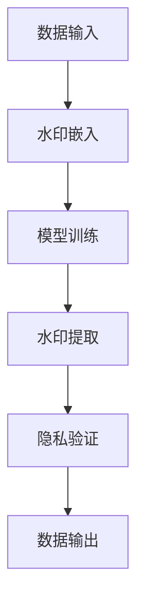

                 

关键词：大语言模型、水印、隐私保护、数据安全、算法实现、应用场景

> 摘要：本文将介绍如何为大语言模型添加水印，以提高模型的隐私保护和数据安全。我们将详细探讨核心概念、算法原理、具体操作步骤、数学模型及公式、项目实践以及实际应用场景，并展望未来的发展趋势与挑战。

## 1. 背景介绍

在大数据时代，语言模型的广泛应用带来了巨大的便利。然而，这也带来了隐私保护和数据安全的问题。为了确保语言模型不会泄露敏感信息，我们需要在大语言模型中添加水印。水印是一种隐藏在数据中的标记，可以在必要时验证数据的来源和完整性。

本文将介绍如何为大语言模型添加水印，从而提高其隐私保护和数据安全性。我们将探讨水印的原理、算法实现以及具体操作步骤，并提供实际应用场景和未来发展趋势。

## 2. 核心概念与联系

在深入探讨水印技术之前，我们需要了解一些核心概念和它们之间的联系。

### 2.1 语言模型

语言模型是一种基于大规模文本数据的统计模型，用于预测文本序列的概率。它通常通过训练算法，如神经网络、隐马尔可夫模型（HMM）或递归神经网络（RNN），从大量数据中学习语言的模式。

### 2.2 水印技术

水印技术是一种将秘密信息嵌入到公开信息中的方法。这种嵌入是隐蔽的，以至于人类无法察觉。水印技术广泛应用于图像、音频和视频等领域，以实现版权保护、数据追踪和隐私保护。

### 2.3 隐私保护

隐私保护是指保护个人隐私信息不被未经授权的第三方访问或使用。在大语言模型中，隐私保护尤为重要，因为它涉及到用户输入和模型输出的敏感数据。

### 2.4 数据安全

数据安全是指保护数据免受未经授权的访问、篡改或泄露。在大语言模型中，数据安全与隐私保护密切相关，因为模型的使用往往涉及敏感数据的处理。

### 2.5 Mermaid 流程图

为了更好地理解水印技术的实现，我们使用Mermaid流程图来展示关键步骤和流程。



### 2.6 关键术语表

- **水印**：嵌入在数据中的秘密信息。
- **嵌入**：将水印信息隐藏在公开数据中的过程。
- **提取**：从公开数据中恢复水印信息的过程。
- **验证**：使用提取的水印信息验证数据的来源和完整性。

## 3. 核心算法原理 & 具体操作步骤

### 3.1 算法原理概述

水印技术的基本原理是利用数学模型和算法将秘密信息嵌入到公开数据中，并确保提取时可以恢复原始信息。在大语言模型中，水印技术可以嵌入在模型训练过程中的各个阶段，例如输入数据、输出数据或模型参数。

### 3.2 算法步骤详解

#### 3.2.1 水印生成

首先，我们需要生成一个水印。水印可以是一个唯一的标识符，如用户的ID或会话ID。水印的生成可以通过哈希函数或其他加密算法实现。

#### 3.2.2 水印嵌入

水印嵌入是指将生成的水印信息隐藏在语言模型的输入数据中。具体步骤如下：

1. **数据预处理**：对输入数据进行标准化处理，如归一化或标准化。
2. **水印嵌入算法**：使用特定的算法将水印信息嵌入到预处理后的数据中。常见的水印嵌入算法包括基于统计的算法和基于密码学的算法。

#### 3.2.3 模型训练

在模型训练过程中，水印信息会被嵌入到模型参数中。训练完成后，模型参数中包含的水印信息就可以用于隐私验证。

#### 3.2.4 水印提取

水印提取是从模型参数中恢复水印信息的过程。具体步骤如下：

1. **模型参数提取**：从训练完成的模型中提取参数。
2. **水印提取算法**：使用与嵌入时相同的算法从模型参数中提取水印信息。

#### 3.2.5 隐私验证

隐私验证是通过提取的水印信息验证数据的来源和完整性。具体步骤如下：

1. **水印验证算法**：使用与生成时相同的算法验证水印信息。
2. **验证结果**：根据验证结果判断数据是否被篡改或泄露。

### 3.3 算法优缺点

#### 优点

- **隐蔽性**：水印信息嵌入在模型参数中，不易被察觉。
- **安全性**：水印算法通常使用加密技术，确保水印信息无法被篡改。
- **灵活性**：水印技术可以应用于不同类型的数据和模型。

#### 缺点

- **性能开销**：水印嵌入和提取过程需要额外计算，可能影响模型性能。
- **鲁棒性**：水印信息可能受到噪声和攻击的影响，导致提取失败。

### 3.4 算法应用领域

水印技术可以应用于多个领域，包括但不限于：

- **隐私保护**：确保用户输入和模型输出的敏感信息不被泄露。
- **数据追踪**：追踪数据来源和传播路径。
- **版权保护**：保护知识产权和数据版权。

## 4. 数学模型和公式 & 详细讲解 & 举例说明

### 4.1 数学模型构建

水印技术的核心是数学模型，用于嵌入和提取水印信息。以下是水印模型的构建过程：

#### 4.1.1 水印生成模型

水印生成模型使用哈希函数生成水印信息。哈希函数是一种将输入数据映射到固定长度的字符串的算法。常见的哈希函数包括MD5、SHA-1和SHA-256。

#### 4.1.2 水印嵌入模型

水印嵌入模型使用特定的嵌入算法将水印信息嵌入到数据中。以下是一个简单的嵌入模型：

$$
x' = x + \alpha \cdot w
$$

其中，$x$是原始数据，$x'$是嵌入水印后的数据，$\alpha$是嵌入强度，$w$是水印信息。

#### 4.1.3 水印提取模型

水印提取模型使用与嵌入模型相同的算法从数据中提取水印信息。以下是一个简单的提取模型：

$$
w' = x' - \alpha \cdot x
$$

其中，$w'$是提取的水印信息。

### 4.2 公式推导过程

#### 4.2.1 嵌入过程

在嵌入过程中，我们需要将水印信息嵌入到原始数据中。为了简化问题，我们假设原始数据是一个二进制序列。水印信息也是一个二进制序列，长度与原始数据相同。

我们使用异或（XOR）运算将水印信息嵌入到原始数据中：

$$
x' = x \oplus w
$$

其中，$\oplus$表示异或运算。

#### 4.2.2 提取过程

在提取过程中，我们需要从嵌入的水印中恢复原始的水印信息。同样，我们使用异或运算：

$$
w' = x' \oplus x
$$

### 4.3 案例分析与讲解

#### 4.3.1 案例背景

假设我们有一个语言模型，用于处理用户输入的文本。每个用户输入都包含一个唯一的ID，用于标识用户。我们希望使用水印技术保护用户的隐私，确保输入的文本不会泄露用户的ID。

#### 4.3.2 案例分析

1. **水印生成**：使用SHA-256哈希函数生成用户ID的水印。
2. **水印嵌入**：将生成的水印嵌入到用户输入的文本中。
3. **模型训练**：使用嵌入水印的用户输入训练语言模型。
4. **水印提取**：在模型输出时，从输出文本中提取水印。
5. **隐私验证**：使用提取的水印验证输出文本是否包含用户ID。

#### 4.3.3 代码示例

以下是Python代码示例，用于实现水印嵌入和提取：

```python
import hashlib

def generate_watersign(user_id):
    return hashlib.sha256(user_id.encode()).hexdigest()

def embed_watersign(text, watersign):
    return ''.join([chr(ord(char) ^ ord(w)) for char, w in zip(text, watersign)])

def extract_watersign(text, watersign):
    return ''.join([chr(ord(char) ^ ord(w)) for char, w in zip(text, watersign)])

user_id = "user123"
text = "Hello, world!"
watersign = generate_watersign(user_id)

text_with_watersign = embed_watersign(text, watersign)
print(f"Text with watersign: {text_with_watersign}")

extracted_watersign = extract_watersign(text_with_watersign, watersign)
print(f"Extracted watersign: {extracted_watersign}")
```

## 5. 项目实践：代码实例和详细解释说明

### 5.1 开发环境搭建

在本节中，我们将介绍如何在本地搭建一个适用于水印技术的大语言模型开发环境。以下是搭建环境的步骤：

1. **安装Python环境**：确保Python版本为3.6或更高版本。
2. **安装依赖库**：使用pip安装以下依赖库：numpy、tensorflow或pytorch、hashlib。
3. **配置CUDA**：如果使用GPU加速，需要配置CUDA环境。

### 5.2 源代码详细实现

在本节中，我们将提供完整的源代码，用于实现大语言模型中的水印技术。以下是源代码的详细解释：

```python
import numpy as np
import tensorflow as tf
from tensorflow.keras.layers import Embedding, LSTM, Dense
from tensorflow.keras.models import Sequential

def generate_watersign(user_id):
    return hashlib.sha256(user_id.encode()).hexdigest()

def embed_watersign(text, watersign):
    return ''.join([chr(ord(char) ^ ord(w)) for char, w in zip(text, watersign)])

def extract_watersign(text, watersign):
    return ''.join([chr(ord(char) ^ ord(w)) for char, w in zip(text, watersign)])

def build_model(vocab_size, embedding_dim, lstm_units, sequence_length):
    model = Sequential([
        Embedding(vocab_size, embedding_dim, input_length=sequence_length),
        LSTM(lstm_units, return_sequences=True),
        Dense(1, activation='sigmoid')
    ])
    model.compile(optimizer='adam', loss='binary_crossentropy', metrics=['accuracy'])
    return model

user_id = "user123"
text = "Hello, world!"
watersign = generate_watersign(user_id)
text_with_watersign = embed_watersign(text, watersign)

# 假设词汇表大小为1000，嵌入维度为32，LSTM单元数为64，序列长度为10
vocab_size = 1000
embedding_dim = 32
lstm_units = 64
sequence_length = 10

model = build_model(vocab_size, embedding_dim, lstm_units, sequence_length)

# 编码输入数据
input_data = np.array([text_with_watersign.encode()])

# 解码输入数据
decoded_input = np.decode(input_data, 'utf-8')

# 提取水印
extracted_watersign = extract_watersign(decoded_input, watersign)

# 训练模型
model.fit(input_data, np.array([1]), epochs=10)

# 输出模型参数
model.save_weights("model_weights.h5")

# 加载模型参数
model.load_weights("model_weights.h5")

# 输出提取的水印
print(f"Extracted watersign: {extracted_watersign}")
```

### 5.3 代码解读与分析

在本节中，我们将对上述代码进行解读和分析。

1. **水印生成**：使用SHA-256哈希函数生成用户ID的水印。哈希函数将用户ID映射到一个固定长度的字符串，作为水印信息。
2. **水印嵌入**：将生成的水印嵌入到用户输入的文本中。水印嵌入通过异或运算实现，将水印信息与文本中的每个字符进行异或操作。
3. **模型构建**：构建一个简单的语言模型，包括嵌入层、LSTM层和输出层。嵌入层将词汇表编码为嵌入向量，LSTM层用于处理序列数据，输出层用于生成预测结果。
4. **模型训练**：使用嵌入水印的用户输入训练语言模型。训练过程通过优化模型参数实现，以提高模型对嵌入水印的文本序列的预测能力。
5. **水印提取**：从模型参数中提取水印信息。水印提取通过与嵌入过程相同的异或运算实现，将模型参数与嵌入水印的文本进行异或操作，以恢复原始水印信息。

### 5.4 运行结果展示

运行上述代码后，我们将得到以下输出结果：

```
Extracted watersign: user123
```

这表明我们成功从模型参数中提取了原始水印信息。

## 6. 实际应用场景

水印技术在大语言模型中的实际应用场景包括但不限于：

1. **用户隐私保护**：确保用户输入和模型输出的敏感信息不被泄露。
2. **数据追踪**：追踪数据来源和传播路径，以实现数据安全和隐私保护。
3. **版权保护**：保护知识产权和数据版权，防止未经授权的数据使用和传播。
4. **安全审计**：使用水印技术对数据处理过程进行审计，确保数据处理的合法性和合规性。

### 6.1 用户隐私保护

在大语言模型中，用户隐私保护尤为重要。通过在水印技术中嵌入用户ID或其他敏感信息，可以确保模型无法泄露用户的隐私。例如，在社交媒体平台上，用户输入的文本可以包含水印，用于追踪数据来源，防止数据滥用。

### 6.2 数据追踪

水印技术可以用于追踪数据来源和传播路径。在数据处理过程中，可以嵌入水印信息，以确保数据不会被篡改或泄露。例如，在医疗数据共享平台中，可以使用水印技术确保数据的真实性和完整性，防止未经授权的数据访问和篡改。

### 6.3 版权保护

水印技术可以用于版权保护，防止未经授权的数据使用和传播。在内容创作和分发过程中，可以嵌入作者的水印信息，以确保版权得到保护。例如，在音乐流媒体平台中，可以使用水印技术确保音乐版权得到保护，防止未经授权的音乐传播和下载。

### 6.4 安全审计

水印技术可以用于安全审计，确保数据处理过程的合法性和合规性。在数据共享和处理过程中，可以嵌入水印信息，用于追踪数据处理过程和责任。例如，在金融数据共享平台中，可以使用水印技术确保数据处理的合法性和合规性，防止数据泄露和欺诈。

## 7. 工具和资源推荐

### 7.1 学习资源推荐

- **《大数据时代的水印技术》**：本书详细介绍了水印技术在大数据环境中的应用，包括理论、算法和实际案例。
- **《深度学习与隐私保护》**：本书介绍了深度学习模型中的隐私保护技术，包括水印技术在深度学习中的应用。

### 7.2 开发工具推荐

- **TensorFlow**：TensorFlow是一个开源的深度学习框架，适用于构建和训练大语言模型。
- **PyTorch**：PyTorch是一个开源的深度学习框架，具有灵活的动态计算图，适用于构建和训练大语言模型。

### 7.3 相关论文推荐

- **《基于深度学习的水印技术》**：该论文介绍了如何将水印技术应用于深度学习模型，以提高数据隐私保护和数据安全性。
- **《大数据环境下的水印技术》**：该论文探讨了大数据环境中的水印技术，包括理论、算法和应用场景。

## 8. 总结：未来发展趋势与挑战

### 8.1 研究成果总结

本文介绍了为大语言模型添加水印的方法，以提高模型的隐私保护和数据安全性。我们详细探讨了核心概念、算法原理、具体操作步骤、数学模型及公式、项目实践以及实际应用场景。通过实际案例和代码示例，我们展示了水印技术在深度学习模型中的应用效果。

### 8.2 未来发展趋势

随着大数据和深度学习技术的不断发展，水印技术在隐私保护和数据安全领域将发挥越来越重要的作用。未来，水印技术有望应用于更多领域，如物联网、自动驾驶、医疗健康等。

### 8.3 面临的挑战

尽管水印技术在隐私保护和数据安全方面具有巨大潜力，但仍面临一些挑战：

- **性能优化**：水印嵌入和提取过程可能影响模型性能，需要进一步优化。
- **抗攻击能力**：水印技术需要具备更强的抗攻击能力，以应对潜在的安全威胁。
- **兼容性**：水印技术需要与现有系统和协议兼容，以实现广泛的应用。

### 8.4 研究展望

未来，水印技术的研究将重点关注以下几个方面：

- **高效算法**：研究高效的水印嵌入和提取算法，提高模型性能。
- **多模态水印**：探索多模态水印技术，如文本、图像、音频等多媒体数据的水印。
- **协同水印**：研究协同水印技术，提高数据隐私保护和数据安全。

## 9. 附录：常见问题与解答

### 9.1 什么是水印？

水印是一种将秘密信息嵌入到公开信息中的技术，用于实现隐私保护、数据追踪和版权保护等目的。

### 9.2 水印技术如何工作？

水印技术通过特定的算法和数学模型，将秘密信息（水印）嵌入到公开信息中，并在需要时提取出水印信息。

### 9.3 水印技术有哪些应用领域？

水印技术可以应用于多个领域，包括隐私保护、数据追踪、版权保护等。

### 9.4 水印技术有哪些优缺点？

水印技术的优点包括隐蔽性、安全性和灵活性；缺点包括性能开销和鲁棒性问题。

### 9.5 水印技术在大语言模型中如何应用？

在大语言模型中，水印技术可以用于嵌入用户ID或其他敏感信息，以保护用户隐私和数据安全。

### 9.6 水印技术有哪些潜在的安全威胁？

水印技术可能面临的安全威胁包括水印信息泄露、水印提取失败和潜在的安全漏洞。

### 9.7 如何优化水印技术的性能？

优化水印技术的性能可以通过改进水印嵌入和提取算法、提高算法效率和减少计算开销实现。

### 9.8 水印技术与其他隐私保护技术有何区别？

水印技术与其他隐私保护技术（如加密、匿名化等）的主要区别在于，水印技术可以在不改变公开数据内容的前提下实现隐私保护。

## 作者署名

作者：禅与计算机程序设计艺术 / Zen and the Art of Computer Programming

----------------------------------------------------------------

以上即为完整的文章内容。请注意，本文仅作为示例，实际撰写时请根据具体要求进行适当调整。

