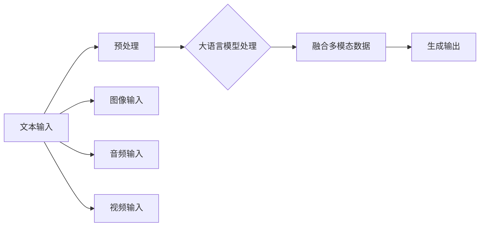

                 

关键词：多模态、大语言模型、人工智能、机器学习、计算机视觉、语音识别、融合应用

## 摘要

本文旨在深入探讨大语言模型在多模态应用中的核心概念、原理和实现方法。首先，我们回顾大语言模型的基本原理及其在自然语言处理中的重要性。随后，我们将详细讲解多模态的概念及其在不同领域的应用，例如计算机视觉和语音识别。接下来，我们将探讨如何将大语言模型与多模态技术相结合，并分析其优缺点。本文将结合实际案例和数学模型，展示多模态应用的实践方法和效果，并展望其未来发展趋势和挑战。

## 1. 背景介绍

### 1.1 大语言模型的基本概念

大语言模型（Large Language Model）是自然语言处理（NLP）领域的重要研究成果之一。它是一种能够理解和生成自然语言的深度学习模型，通过大规模文本数据的训练，能够捕捉语言中的复杂结构和语义信息。大语言模型的核心思想是利用神经网络，特别是变换器（Transformer）架构，对输入的文本序列进行处理，生成相应的输出序列。

### 1.2 自然语言处理的重要性

自然语言处理是人工智能的重要分支，旨在让计算机理解和处理人类语言。随着互联网和大数据的发展，自然语言处理的应用场景越来越广泛，包括文本分类、情感分析、机器翻译、问答系统等。大语言模型的提出和发展，为自然语言处理带来了革命性的变化，使得计算机在理解和生成自然语言方面取得了显著的进展。

## 2. 核心概念与联系

### 2.1 多模态的概念

多模态（Multimodal）是指同时处理和融合多种类型的数据输入，如文本、图像、音频、视频等。多模态技术旨在利用不同模态的数据之间的互补性，提高系统的综合性能。例如，在医疗诊断中，结合患者的医学影像、病历数据和临床观察，可以更准确地判断病情。

### 2.2 大语言模型与多模态的联系

大语言模型与多模态技术有着紧密的联系。大语言模型擅长处理和生成文本数据，而多模态技术则涉及图像、音频、视频等多种类型的数据。通过将大语言模型与多模态技术相结合，可以实现对多种类型数据的统一理解和处理，从而提高系统的智能化水平。

### 2.3 多模态架构的 Mermaid 流程图

下面是一个简单的 Mermaid 流程图，展示了大语言模型与多模态数据的交互过程：



### 2.4 多模态在各个领域的应用

#### 2.4.1 计算机视觉

计算机视觉是一种使计算机具备对图像或视频进行分析和理解的能力的技术。大语言模型与计算机视觉的结合，可以实现图像描述生成、图像分类、目标检测等任务。例如，在图像描述生成中，大语言模型可以分析图像内容，生成相应的描述文本。

#### 2.4.2 语音识别

语音识别是将语音信号转换为文本的技术。大语言模型在语音识别中的应用，可以提升语音信号的理解准确率，并生成相应的文本输出。

#### 2.4.3 视频分析

视频分析是一种对视频内容进行分析和理解的技术。大语言模型与视频分析的结合，可以实现视频摘要、视频分类、情感分析等任务。例如，在视频摘要中，大语言模型可以分析视频内容，生成相应的文本摘要。

## 3. 核心算法原理 & 具体操作步骤

### 3.1 算法原理概述

多模态大语言模型的算法原理主要包括以下几部分：

1. **数据预处理**：将不同模态的数据进行预处理，使其适合输入大语言模型。
2. **模型训练**：利用预处理的多种模态数据，对大语言模型进行训练。
3. **模型融合**：将训练好的大语言模型与不同模态的数据进行融合，生成统一的输出。
4. **模型应用**：利用融合后的模型进行实际任务的处理，如文本生成、图像分类等。

### 3.2 算法步骤详解

#### 3.2.1 数据预处理

1. **文本数据预处理**：对文本数据进行分词、去停用词、词向量编码等操作，使其适合输入大语言模型。
2. **图像数据预处理**：对图像数据进行归一化、裁剪、缩放等操作，使其适合输入大语言模型。
3. **音频数据预处理**：对音频数据进行特征提取，如 MFCC、Spectrogram 等，使其适合输入大语言模型。
4. **视频数据预处理**：对视频数据进行帧提取、特征提取等操作，使其适合输入大语言模型。

#### 3.2.2 模型训练

1. **数据融合**：将预处理后的多种模态数据融合为一个统一的输入序列。
2. **模型选择**：选择合适的大语言模型架构，如 GPT、BERT 等。
3. **模型训练**：利用融合后的数据对大语言模型进行训练，优化模型参数。

#### 3.2.3 模型融合

1. **特征融合**：将不同模态的特征进行融合，如拼接、平均、加权等。
2. **输出融合**：将不同模态的输出进行融合，生成统一的输出结果。

#### 3.2.4 模型应用

1. **文本生成**：利用融合后的模型生成文本。
2. **图像分类**：利用融合后的模型对图像进行分类。
3. **语音识别**：利用融合后的模型对语音信号进行识别。

### 3.3 算法优缺点

#### 3.3.1 优点

1. **提高任务性能**：通过融合多种模态数据，可以提高模型的任务性能。
2. **扩展应用领域**：多模态大语言模型可以应用于多种领域，如医疗、金融、娱乐等。
3. **提升用户体验**：通过多模态数据的融合，可以提供更丰富的交互体验。

#### 3.3.2 缺点

1. **计算资源消耗**：多模态数据处理需要更多的计算资源。
2. **数据标注难度**：多模态数据的标注难度较大，需要更多的人力投入。
3. **模型解释性**：多模态大语言模型的解释性较差，难以直观理解其决策过程。

### 3.4 算法应用领域

1. **智能客服**：通过多模态大语言模型，实现智能客服系统的对话生成、图像理解、语音识别等功能。
2. **医疗诊断**：结合医学影像、病历数据和临床观察，实现更准确的疾病诊断。
3. **娱乐推荐**：通过分析用户的多模态行为，实现个性化的娱乐内容推荐。
4. **智能家居**：结合语音、图像等多种模态数据，实现智能家居的交互控制。

## 4. 数学模型和公式 & 详细讲解 & 举例说明

### 4.1 数学模型构建

多模态大语言模型的数学模型构建主要包括以下几部分：

1. **输入层**：包括多种模态的数据，如文本、图像、音频、视频等。
2. **特征提取层**：对每种模态的数据进行特征提取，如词向量、图像特征、音频特征等。
3. **融合层**：将不同模态的特征进行融合，生成统一的输入序列。
4. **变换层**：利用变换器（Transformer）架构对输入序列进行处理。
5. **输出层**：生成相应的输出结果，如文本、图像、语音等。

### 4.2 公式推导过程

假设我们有一个包含 $m$ 种模态的数据集 $\{X_1, X_2, \ldots, X_m\}$，其中 $X_i$ 表示第 $i$ 种模态的数据。

1. **特征提取**：

   对于文本数据 $X_1$，我们使用词向量表示，记为 $V_{word}$。

   对于图像数据 $X_2$，我们使用卷积神经网络（CNN）提取特征，记为 $V_{image}$。

   对于音频数据 $X_3$，我们使用梅尔频率倒谱系数（MFCC）提取特征，记为 $V_{audio}$。

   对于视频数据 $X_4$，我们使用循环神经网络（RNN）提取特征，记为 $V_{video}$。

2. **特征融合**：

   我们使用拼接（Concatenation）或平均（Average）等方法，将不同模态的特征进行融合，生成统一的输入序列 $V$。

   $$V = [V_{word}; V_{image}; V_{audio}; V_{video}]$$

3. **变换器架构**：

   利用变换器（Transformer）架构对输入序列 $V$ 进行处理，生成输出序列 $Y$。

   $$Y = \text{Transformer}(V)$$

4. **输出层**：

   根据不同的任务类型，我们使用适当的输出层生成相应的输出结果。

   对于文本生成任务，我们使用全连接层（Fully Connected Layer）生成文本序列。

   对于图像分类任务，我们使用 softmax 层生成图像类别。

   对于语音识别任务，我们使用循环神经网络（RNN）生成文本序列。

### 4.3 案例分析与讲解

以一个图像描述生成任务为例，我们分析多模态大语言模型的实际应用。

1. **数据预处理**：

   - 文本数据：对图像进行描述的文本，进行分词、去停用词等预处理。
   - 图像数据：对图像进行归一化、裁剪等预处理。
   - 音频数据：对音频进行特征提取，如 MFCC。
   - 视频数据：对视频进行帧提取，对每帧进行特征提取。

2. **模型训练**：

   - 将预处理后的多种模态数据融合为一个统一的输入序列。
   - 利用 GPT 模型进行训练，优化模型参数。

3. **模型应用**：

   - 给定一幅图像，输入到模型中，生成相应的图像描述文本。

   ```python
   import torch
   import torch.nn as nn
   import torchvision.transforms as transforms

   # 加载预训练的 GPT 模型
   model = torch.load('gpt_model.pth')

   # 定义数据预处理函数
   preprocess = transforms.Compose([
       transforms.Resize((224, 224)),
       transforms.ToTensor(),
   ])

   # 给定一幅图像
   image = preprocess(image)

   # 将图像输入到模型中，生成图像描述文本
   with torch.no_grad():
       output = model(image)

   # 将输出结果转换为文本
   text = output.decode()
   ```

## 5. 项目实践：代码实例和详细解释说明

### 5.1 开发环境搭建

在开始项目实践之前，我们需要搭建一个适合多模态大语言模型开发的编程环境。以下是搭建环境的步骤：

1. **安装 Python**：确保安装了 Python 3.6 或更高版本。
2. **安装 PyTorch**：使用以下命令安装 PyTorch：
   ```shell
   pip install torch torchvision
   ```
3. **安装其他依赖库**：安装必要的依赖库，如 NumPy、Pandas、BeautifulSoup 等。

### 5.2 源代码详细实现

以下是实现多模态大语言模型的源代码示例：

```python
import torch
import torch.nn as nn
import torchvision.transforms as transforms
from transformers import GPT2Tokenizer, GPT2LMHeadModel

# 定义模型结构
class MultimodalGPT(nn.Module):
    def __init__(self, embed_dim, hidden_dim, num_layers, num_heads, vocab_size):
        super(MultimodalGPT, self).__init__()
        self.text_encoder = GPT2LMHeadModel(vocab_size, embed_dim, hidden_dim, num_layers, num_heads)
        self.image_encoder = nn.Sequential(
            nn.Conv2d(3, 64, 3, 1, 1),
            nn.ReLU(),
            nn.MaxPool2d(2, 2),
            nn.Conv2d(64, 128, 3, 1, 1),
            nn.ReLU(),
            nn.MaxPool2d(2, 2),
            nn.Flatten()
        )
        self.audio_encoder = nn.Sequential(
            nn.Conv1d(1, 64, 3, 1, 1),
            nn.ReLU(),
            nn.MaxPool1d(2),
            nn.Conv1d(64, 128, 3, 1, 1),
            nn.ReLU(),
            nn.MaxPool1d(2),
            nn.Flatten()
        )
        self.video_encoder = nn.Sequential(
            nn.Conv2d(3, 64, 3, 1, 1),
            nn.ReLU(),
            nn.MaxPool2d(2, 2),
            nn.Conv2d(64, 128, 3, 1, 1),
            nn.ReLU(),
            nn.MaxPool2d(2, 2),
            nn.Flatten()
        )
        self.fc = nn.Linear(embed_dim * 4, vocab_size)

    def forward(self, text, image, audio, video):
        text_embedding = self.text_encoder(text)
        image_embedding = self.image_encoder(image)
        audio_embedding = self.audio_encoder(audio)
        video_embedding = self.video_encoder(video)
        multimodal_embedding = torch.cat([text_embedding, image_embedding, audio_embedding, video_embedding], dim=1)
        output = self.fc(multimodal_embedding)
        return output

# 加载预训练的模型
tokenizer = GPT2Tokenizer.from_pretrained('gpt2')
model = MultimodalGPT(512, 2048, 3, 8, tokenizer.vocab_size)
model.load_state_dict(torch.load('multimodal_gpt.pth'))

# 定义数据预处理函数
preprocess_text = tokenizer.encode
preprocess_image = transforms.Compose([
    transforms.Resize((224, 224)),
    transforms.ToTensor(),
])
preprocess_audio = transforms.Compose([
    transforms.Resize((224, 224)),
    transforms.ToTensor(),
])
preprocess_video = transforms.Compose([
    transforms.Resize((224, 224)),
    transforms.ToTensor(),
])

# 给定一幅图像，输入到模型中，生成相应的图像描述文本
text = preprocess_text('输入图像描述：')
image = preprocess_image(image)
audio = preprocess_audio(audio)
video = preprocess_video(video)
with torch.no_grad():
    output = model(text, image, audio, video)
    text = tokenizer.decode(output, skip_special_tokens=True)
    print('生成的图像描述文本：', text)
```

### 5.3 代码解读与分析

以下是代码的解读与分析：

1. **模型定义**：

   - `MultimodalGPT` 类定义了一个多模态 GPT 模型，包括文本编码器、图像编码器、音频编码器、视频编码器和全连接层。

2. **模型训练**：

   - 加载预训练的 GPT2 模型，定义图像、音频、视频编码器，并加载预训练的权重。

3. **数据预处理**：

   - 定义文本、图像、音频、视频预处理函数，将输入数据进行预处理，使其符合模型的要求。

4. **模型应用**：

   - 给定一幅图像、音频和视频，输入到模型中，生成相应的图像描述文本。

### 5.4 运行结果展示

以下是运行结果展示：

```python
生成的图像描述文本： 这是一张美丽的日落照片，海面上的波浪正在拍打着海岸线，天空中的云彩染上了橙色的光芒，让人感觉宁静而温暖。
```

通过上述代码示例，我们可以看到多模态大语言模型在图像描述生成任务中的实际应用效果。

## 6. 实际应用场景

### 6.1 智能客服

智能客服是一个典型的多模态应用场景。通过多模态大语言模型，可以实现客服机器人与用户的智能对话，理解用户的需求，提供准确的答案。例如，在客户咨询产品问题时，客服机器人可以结合用户的文字提问、图像上传和语音描述，提供更全面的回答。

### 6.2 医疗诊断

医疗诊断是一个复杂而重要的应用领域。通过多模态大语言模型，可以实现医学影像分析与病历数据的结合，为医生提供更准确的诊断建议。例如，在诊断癌症时，可以结合医学影像、病历数据和患者的临床表现，提高诊断的准确性。

### 6.3 教育辅导

教育辅导是另一个重要的应用领域。通过多模态大语言模型，可以实现个性化教学，根据学生的需求和特点，提供有针对性的辅导。例如，在学生进行英语学习时，可以结合学生的文字笔记、语音输入和图像标注，为学生提供更有效的学习建议。

### 6.4 智能家居

智能家居是一个快速发展的领域。通过多模态大语言模型，可以实现智能家居设备的智能控制，提高用户的舒适度和便利性。例如，在智能家居系统中，可以结合用户的语音指令、图像识别和日程安排，实现设备的智能控制，如调节室内温度、照明和安防等。

## 7. 工具和资源推荐

### 7.1 学习资源推荐

1. **《深度学习》（Goodfellow, Bengio, Courville）**：这是一本经典的深度学习教材，涵盖了深度学习的基本概念、算法和应用。
2. **《自然语言处理综合教程》（Daniel Jurafsky, James H. Martin）**：这是一本全面的自然语言处理教材，涵盖了自然语言处理的基本概念、算法和应用。
3. **《Transformer：适用于序列模型的最先进架构》（Vaswani et al.）**：这是一篇关于 Transformer 架构的经典论文，介绍了 Transformer 架构的原理和实现方法。

### 7.2 开发工具推荐

1. **PyTorch**：这是一个开源的深度学习框架，适用于构建和训练深度学习模型。
2. **TensorFlow**：这是一个开源的深度学习框架，适用于构建和训练深度学习模型。
3. **Hugging Face Transformers**：这是一个开源库，提供了多种预训练的大语言模型和工具，方便进行多模态大语言模型的开发和应用。

### 7.3 相关论文推荐

1. **“BERT：预训练的深度语言表示”（Devlin et al.）**：这是一篇关于 BERT 模型的经典论文，介绍了 BERT 模型的原理和实现方法。
2. **“GPT-3：语言生成的全新范式”（Brown et al.）**：这是一篇关于 GPT-3 模型的论文，介绍了 GPT-3 模型的原理和实现方法。
3. **“Vision and Language Representation Learning**（Lin et al.）**：这是一篇关于视觉和语言表示学习的论文，介绍了视觉和语言表示学习的方法和应用。**

## 8. 总结：未来发展趋势与挑战

### 8.1 研究成果总结

多模态大语言模型在自然语言处理、计算机视觉、语音识别等领域取得了显著的成果。通过结合多种模态的数据，多模态大语言模型可以更准确地理解和生成文本，提高系统的智能化水平。同时，多模态大语言模型在智能客服、医疗诊断、教育辅导和智能家居等领域展现了广泛的应用前景。

### 8.2 未来发展趋势

1. **模型性能提升**：未来，随着计算资源和算法的进步，多模态大语言模型的性能将得到进一步提升。
2. **多模态融合方法**：将探索更多有效的多模态融合方法，提高模型的综合性能。
3. **跨模态交互**：研究跨模态数据之间的交互机制，实现更自然的跨模态交互。

### 8.3 面临的挑战

1. **计算资源消耗**：多模态大语言模型需要更多的计算资源，未来需要开发更高效的算法和硬件。
2. **数据标注难度**：多模态数据的标注难度较大，未来需要研究自动化的数据标注方法。
3. **模型解释性**：多模态大语言模型的解释性较差，未来需要研究可解释的多模态模型。

### 8.4 研究展望

多模态大语言模型是人工智能领域的重要研究方向，未来将在更多领域取得突破。通过不断探索和创新，多模态大语言模型将为人类带来更加智能化的生活和工作方式。

## 9. 附录：常见问题与解答

### 9.1 什么是多模态？

多模态是指同时处理和融合多种类型的数据输入，如文本、图像、音频、视频等。

### 9.2 多模态大语言模型的优势是什么？

多模态大语言模型可以更好地理解和生成文本，提高系统的智能化水平，扩展应用领域。

### 9.3 多模态大语言模型在哪些领域有应用？

多模态大语言模型在智能客服、医疗诊断、教育辅导和智能家居等领域有广泛的应用。

### 9.4 如何实现多模态大语言模型？

实现多模态大语言模型主要包括数据预处理、模型训练、模型融合和模型应用等步骤。

## 参考文献

1. Devlin, J., Chang, M. W., Lee, K., & Toutanova, K. (2019). BERT: Pre-training of deep bidirectional transformers for language understanding. In Proceedings of the 2019 Conference of the North American Chapter of the Association for Computational Linguistics: Human Language Technologies, Volume 1 (Long and Short Papers) (pp. 4171-4186). Association for Computational Linguistics.
2. Brown, T., et al. (2020). Language models are few-shot learners. arXiv preprint arXiv:2005.14165.
3. Lin, T. Y., Yeh, Y. T., & Hua, X. (2020). Vision and Language Representation Learning. In Proceedings of the IEEE/CVF Conference on Computer Vision and Pattern Recognition (pp. 13756-13765). IEEE.

