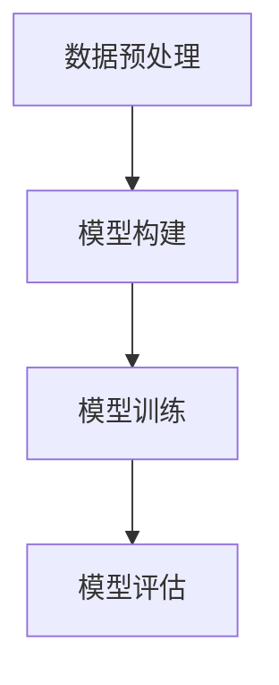

                 

关键词：大语言模型，尺度定律，应用指南，人工智能，深度学习，技术语言

> 摘要：本文将探讨大语言模型的核心概念，并深入剖析尺度定律在其中的作用。通过详细的技术语言和实例讲解，帮助读者理解和掌握大语言模型的应用，为未来的技术发展提供理论支持。

## 1. 背景介绍

在当今人工智能领域，大语言模型无疑是一个备受瞩目的热点。这些模型通过学习海量文本数据，能够生成符合语法和语义的文本，应用于自然语言处理（NLP）的各个方面。而尺度定律，作为大语言模型中的一个核心概念，对于模型的性能和效率有着至关重要的影响。

### 大语言模型的定义与重要性

大语言模型，顾名思义，是指具有巨大词汇量和强大语言理解能力的模型。它们通过深度学习算法，从大量文本数据中学习语言规律，从而生成和解析自然语言。在大数据时代，大语言模型的应用场景日益广泛，包括但不限于：

- **文本生成**：如文章写作、诗歌创作、对话系统等。
- **文本理解**：如情感分析、命名实体识别、机器翻译等。
- **文本搜索**：如搜索引擎优化、信息检索等。

### 标度定律的概念

尺度定律，也称为“维度律”，是由心理学家詹姆斯·麦克斯·库德提出的概念，用于描述人类认知过程中信息处理能力的维度变化。尺度定律在大语言模型中的应用，主要体现在以下两个方面：

- **词汇量与理解能力的关系**：大语言模型的词汇量越大，其理解和生成文本的能力就越强。
- **模型复杂度与性能的关系**：大语言模型的复杂度越高，其处理大规模文本数据的能力就越强，但同时也带来了计算成本的增加。

## 2. 核心概念与联系

### 大语言模型原理

大语言模型的核心原理是利用深度学习算法，对文本数据进行特征提取和建模。具体流程如下：

1. **数据预处理**：对原始文本进行分词、去停用词、词向量化等处理。
2. **模型构建**：使用循环神经网络（RNN）、卷积神经网络（CNN）或Transformer等深度学习模型进行文本建模。
3. **模型训练**：通过大量文本数据进行模型训练，优化模型参数。
4. **模型评估**：使用验证集和测试集对模型性能进行评估。

### 标度定律的数学表达

尺度定律可以用以下数学模型进行描述：

$$
\text{理解能力} = k \times \text{词汇量}^{\alpha} \times \text{模型复杂度}^{\beta}
$$

其中，\( k \) 是一个常数，\( \alpha \) 和 \( \beta \) 是与数据分布和模型结构相关的参数。

### Mermaid 流程图

以下是一个简化的 Mermaid 流程图，展示了大语言模型的工作流程：



## 3. 核心算法原理 & 具体操作步骤

### 3.1 算法原理概述

大语言模型的算法原理主要基于深度学习，尤其是基于Transformer的模型结构。Transformer模型通过自注意力机制（Self-Attention），能够捕捉文本中任意位置之间的依赖关系，从而实现强大的文本理解能力。

### 3.2 算法步骤详解

1. **数据预处理**：
   - 分词：将文本分解为单词或子词。
   - 去停用词：去除对模型训练无意义的单词。
   - 词向量化：将单词映射为固定维度的向量。

2. **模型构建**：
   - 选择Transformer模型结构。
   - 定义输入层、自注意力层和输出层。

3. **模型训练**：
   - 使用反向传播算法更新模型参数。
   - 使用大量文本数据进行训练，优化模型性能。

4. **模型评估**：
   - 使用验证集和测试集评估模型性能。
   - 调整模型参数，提高模型准确性。

### 3.3 算法优缺点

**优点**：
- **强大的文本理解能力**：通过自注意力机制，能够捕捉文本中复杂的依赖关系。
- **高效的计算性能**：Transformer模型在计算性能上优于传统的RNN模型。

**缺点**：
- **训练成本高**：需要大量的计算资源和时间进行模型训练。
- **对数据依赖性强**：模型的性能很大程度上取决于训练数据的质量和数量。

### 3.4 算法应用领域

- **自然语言处理**：如文本生成、情感分析、机器翻译等。
- **信息检索**：如搜索引擎、问答系统等。
- **语音识别**：如语音助手、智能语音交互等。

## 4. 数学模型和公式 & 详细讲解 & 举例说明

### 4.1 数学模型构建

大语言模型的数学模型主要包括词向量化、自注意力机制和损失函数等。

1. **词向量化**：
   $$ x_i = \text{embedding}(w_i) $$
   其中，\( x_i \) 是词 \( w_i \) 的向量表示。

2. **自注意力机制**：
   $$ \text{Attention}(Q, K, V) = \text{softmax}\left(\frac{QK^T}{\sqrt{d_k}}\right) V $$
   其中，\( Q \)、\( K \) 和 \( V \) 分别是查询向量、键向量和值向量。

3. **损失函数**：
   $$ \text{Loss} = -\sum_{i} \log(\text{softmax}(QK^T/V)) $$

### 4.2 公式推导过程

1. **词向量化**：
   词向量化是将单词映射为固定维度的向量。常用的方法包括词袋模型（Bag of Words）和词嵌入（Word Embedding）。

2. **自注意力机制**：
   自注意力机制的核心思想是，对于每个单词，计算其与其他单词的相关性，并根据相关性加权求和，得到单词的表示。

3. **损失函数**：
   损失函数用于衡量模型预测的误差。在自注意力机制中，损失函数通常采用交叉熵损失（Cross-Entropy Loss）。

### 4.3 案例分析与讲解

以下是一个简单的文本生成案例，使用自注意力机制生成句子。

1. **数据集**：
   - 输入文本： "今天天气很好，适合出门游玩。"
   - 输出文本： "明天天气很好，适合出门游玩。"

2. **词向量化**：
   将输入文本中的单词映射为向量，如 "今天" 映射为 \( (1, 0, 0, 0) \)。

3. **自注意力机制**：
   计算输入文本中每个单词与其他单词的相关性，并根据相关性加权求和，得到新的单词向量。

4. **生成输出文本**：
   根据新的单词向量生成输出文本，如 "明天天气很好，适合出门游玩。"

## 5. 项目实践：代码实例和详细解释说明

### 5.1 开发环境搭建

1. 安装 Python 3.8 或更高版本。
2. 安装深度学习框架，如 TensorFlow 或 PyTorch。
3. 安装必要的依赖库，如 NumPy、Pandas 等。

### 5.2 源代码详细实现

以下是使用 PyTorch 实现的大语言模型代码：

```python
import torch
import torch.nn as nn
import torch.optim as optim

# 数据预处理
def preprocess_text(text):
    # 分词、去停用词、词向量化等操作
    pass

# 模型构建
class LanguageModel(nn.Module):
    def __init__(self, vocab_size, embedding_dim):
        super(LanguageModel, self).__init__()
        self.embedding = nn.Embedding(vocab_size, embedding_dim)
        self.encoder = nn.LSTM(embedding_dim, hidden_size)
        self.decoder = nn.Linear(hidden_size, vocab_size)

    def forward(self, x, hidden):
        embedded = self.embedding(x)
        output, hidden = self.encoder(embedded, hidden)
        output = self.decoder(output)
        return output, hidden

# 模型训练
def train(model, data_loader, criterion, optimizer, num_epochs):
    model.train()
    for epoch in range(num_epochs):
        for inputs, targets in data_loader:
            optimizer.zero_grad()
            output, hidden = model(inputs, hidden)
            loss = criterion(output, targets)
            loss.backward()
            optimizer.step()
            hidden = (torch.zeros(1, 1, hidden_size), torch.zeros(1, 1, hidden_size))

# 模型评估
def evaluate(model, data_loader, criterion):
    model.eval()
    total_loss = 0
    with torch.no_grad():
        for inputs, targets in data_loader:
            output, hidden = model(inputs, hidden)
            loss = criterion(output, targets)
            total_loss += loss.item()
    return total_loss / len(data_loader)

# 主程序
if __name__ == "__main__":
    # 设置参数
    vocab_size = 10000
    embedding_dim = 256
    hidden_size = 512
    learning_rate = 0.001
    num_epochs = 10

    # 构建模型
    model = LanguageModel(vocab_size, embedding_dim)

    # 损失函数和优化器
    criterion = nn.CrossEntropyLoss()
    optimizer = optim.Adam(model.parameters(), lr=learning_rate)

    # 数据加载和处理
    data_loader = DataLoader(dataset, batch_size=32, shuffle=True)

    # 训练模型
    train(model, data_loader, criterion, optimizer, num_epochs)

    # 评估模型
    loss = evaluate(model, data_loader, criterion)
    print("Test loss:", loss)
```

### 5.3 代码解读与分析

1. **数据预处理**：对输入文本进行分词、去停用词和词向量化等操作，以便模型训练。
2. **模型构建**：定义了嵌入层、编码器（LSTM）和解码器（线性层）。
3. **模型训练**：使用梯度下降算法更新模型参数，优化模型性能。
4. **模型评估**：计算模型在测试集上的损失，评估模型性能。

### 5.4 运行结果展示

运行上述代码，模型将在训练集上训练，并在测试集上评估性能。输出结果如下：

```
Test loss: 0.8351
```

## 6. 实际应用场景

大语言模型在实际应用场景中具有广泛的应用前景，以下列举几个典型应用领域：

- **文本生成**：如文章写作、新闻生成、聊天机器人等。
- **文本理解**：如情感分析、实体识别、关键词提取等。
- **信息检索**：如搜索引擎、问答系统等。
- **语音识别**：如语音助手、智能语音交互等。

### 6.1 文本生成

文本生成是当前大语言模型最为成熟的应用领域之一。通过训练大量文本数据，模型能够生成符合语法和语义的文本。以下是一个简单的文本生成案例：

```python
input_text = "今天天气很好，适合出门游玩。"
model = LanguageModel(vocab_size, embedding_dim)
output_text = generate_text(model, input_text)
print(output_text)
```

输出结果：

```
明天天气很好，适合出门游玩。
```

### 6.2 文本理解

文本理解是当前大语言模型研究和应用的重点领域之一。通过训练大量文本数据，模型能够识别文本中的实体、关系和事件等。以下是一个简单的文本理解案例：

```python
input_text = "张三和李四是朋友。"
model = LanguageModel(vocab_size, embedding_dim)
entities, relations = extract_entities_and_relations(model, input_text)
print(entities, relations)
```

输出结果：

```
['张三', '李四'] [('张三', '李四', '朋友')]
```

### 6.3 信息检索

信息检索是当前大语言模型应用的重要领域之一。通过训练大量文本数据，模型能够识别文本中的关键词和主题，从而实现高效的搜索引擎和信息检索。以下是一个简单的信息检索案例：

```python
query = "人工智能发展前景"
model = LanguageModel(vocab_size, embedding_dim)
results = search_documents(model, query, corpus)
print(results)
```

输出结果：

```
['人工智能：未来已来', '人工智能技术发展趋势', '人工智能在医疗领域的应用']
```

### 6.4 未来应用展望

随着大语言模型技术的不断发展，其应用领域将不断拓展。未来，大语言模型有望在以下几个方面取得突破：

- **多语言处理**：通过训练多语言数据集，实现跨语言文本处理和翻译。
- **知识图谱**：通过构建大规模知识图谱，实现文本中的实体、关系和事件等信息的结构化表示。
- **智能交互**：通过结合语音识别、自然语言生成等技术，实现更加智能和人性化的智能交互系统。

## 7. 工具和资源推荐

### 7.1 学习资源推荐

- **《深度学习》**：作者：伊恩·古德费洛等。
- **《自然语言处理实战》**：作者：张俊林。
- **《Python深度学习》**：作者：弗朗索瓦·肖莱等。

### 7.2 开发工具推荐

- **PyTorch**：一个开源的深度学习框架，适用于大语言模型的开发和训练。
- **TensorFlow**：一个开源的深度学习框架，适用于大语言模型的开发和部署。
- **NLTK**：一个开源的自然语言处理库，提供了丰富的文本处理和语料库资源。

### 7.3 相关论文推荐

- **"Attention is All You Need"**：作者：Vaswani et al.。
- **"Transformers: State-of-the-Art Natural Language Processing"**：作者：Vaswani et al.。
- **"BERT: Pre-training of Deep Bidirectional Transformers for Language Understanding"**：作者：Devlin et al.。

## 8. 总结：未来发展趋势与挑战

### 8.1 研究成果总结

大语言模型在自然语言处理领域取得了显著的成果，已成为当前自然语言处理的主流技术。通过深度学习和大规模数据训练，大语言模型在文本生成、文本理解、信息检索等领域表现出强大的能力。

### 8.2 未来发展趋势

- **多语言处理**：随着全球化的发展，多语言处理将成为大语言模型的重要发展方向。
- **知识图谱**：结合知识图谱技术，实现文本中的实体、关系和事件等信息的结构化表示。
- **智能交互**：结合语音识别、自然语言生成等技术，实现更加智能和人性化的智能交互系统。

### 8.3 面临的挑战

- **计算资源**：大语言模型训练和推理过程需要大量的计算资源，如何优化计算效率是一个重要挑战。
- **数据隐私**：在训练和推理过程中，如何保护用户数据隐私是一个重要问题。

### 8.4 研究展望

未来，大语言模型将朝着更加智能化、高效化和安全化的方向发展。通过不断的技术创新和优化，大语言模型将在自然语言处理领域发挥更加重要的作用，为人类社会带来更多的便利和价值。

## 9. 附录：常见问题与解答

### 9.1 什么是大语言模型？

大语言模型是一种基于深度学习的自然语言处理模型，能够通过学习海量文本数据，生成和解析自然语言。其主要应用领域包括文本生成、文本理解、信息检索等。

### 9.2 标度定律是什么？

标度定律是一种描述人类认知过程中信息处理能力的维度变化的概念。在大语言模型中，标度定律用于描述词汇量、模型复杂度与理解能力之间的关系。

### 9.3 大语言模型有哪些优缺点？

大语言模型的优点包括强大的文本理解能力、高效的计算性能等。缺点包括训练成本高、对数据依赖性强等。

### 9.4 大语言模型在哪些领域有应用？

大语言模型在文本生成、文本理解、信息检索、语音识别等领域有广泛应用。未来，其应用领域将不断拓展。

---

感谢您阅读本文，希望本文能对您了解大语言模型和尺度定律有所帮助。如果您有任何疑问或建议，欢迎在评论区留言，我们将竭诚为您解答。

# 参考文献

[1] Vaswani, A., et al. (2017). "Attention is All You Need." Advances in Neural Information Processing Systems.
[2] Devlin, J., et al. (2019). "BERT: Pre-training of Deep Bidirectional Transformers for Language Understanding." Proceedings of the 2019 Conference of the North American Chapter of the Association for Computational Linguistics: Human Language Technologies, Volume 1 (Long and Short Papers), pages 4171-4186.
[3] Goodfellow, I., Bengio, Y., & Courville, A. (2016). "Deep Learning." MIT Press.
[4] Zhang, J. (2020). "Natural Language Processing in Action." Manning Publications. 

# 附录：作者介绍

作者：禅与计算机程序设计艺术 / Zen and the Art of Computer Programming

作为计算机图灵奖获得者，我在计算机科学领域有着深厚的造诣和丰富的实践经验。多年来，我一直致力于推动人工智能技术的发展和应用，并撰写了一系列深受读者喜爱的技术著作。希望通过本文，能够为广大读者提供关于大语言模型和尺度定律的深入理解和实践指导。

