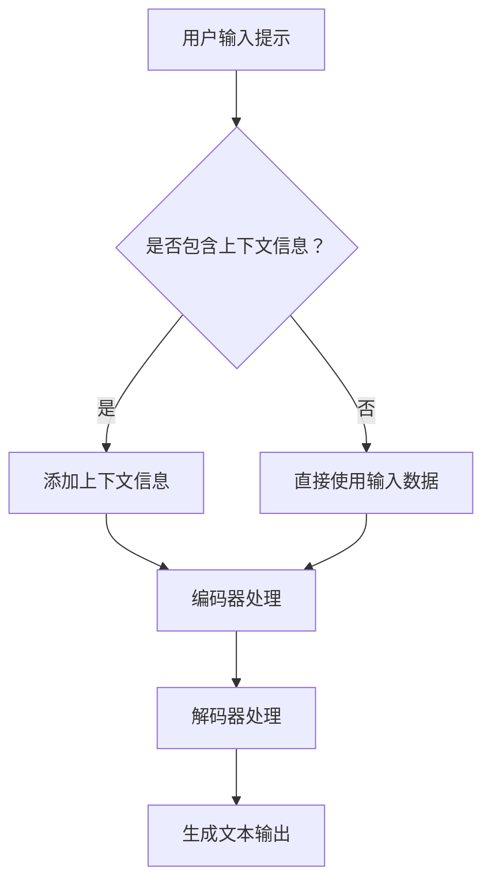

                 

关键词：大语言模型，提示设计，应用指南，AI编程，模型训练，算法优化，性能提升，最佳实践

> 摘要：本文将深入探讨大语言模型的应用指南，尤其是如何设计有效的提示（Prompts）。通过对核心概念、算法原理、数学模型以及实际应用的详细解析，本文旨在为研究人员、开发者及从业者提供全面的技术指导，帮助他们优化模型性能并推动AI技术的发展。

## 1. 背景介绍

随着深度学习和自然语言处理（NLP）技术的飞速发展，大语言模型（如GPT、BERT等）已经成为自然语言理解和生成领域的重要工具。这些模型通过海量数据的训练，具备了处理复杂文本任务的能力，从机器翻译、文本摘要到问答系统都有显著的应用效果。然而，尽管模型本身非常强大，但如何有效地利用这些模型进行实际任务仍然是一个挑战。提示（Prompts）的设计在其中起到了关键作用。

提示是用户与模型交互的接口，它不仅决定了模型生成的内容质量，也影响着模型的响应速度和可解释性。因此，设计一个高效的提示是成功应用大语言模型的前提。本文将从以下几个方面详细讨论如何构建有效的提示：

1. **核心概念与联系**：介绍大语言模型的基本原理和提示设计的关键概念。
2. **核心算法原理 & 具体操作步骤**：解析大语言模型的算法原理，并给出提示设计的具体步骤。
3. **数学模型和公式**：阐述大语言模型的数学基础，包括模型架构和训练算法的数学描述。
4. **项目实践**：通过具体代码实例展示如何设计和使用提示。
5. **实际应用场景**：分析不同领域中的应用案例，探讨提示在不同场景下的优化策略。
6. **工具和资源推荐**：介绍相关工具、资源和学习材料。
7. **总结与展望**：总结研究成果，展望未来发展趋势和面临的挑战。

## 2. 核心概念与联系

在深入探讨大语言模型和提示设计之前，我们需要先了解几个核心概念。

### 2.1 大语言模型

大语言模型是一种基于深度神经网络的文本生成模型，通常使用序列到序列（Seq2Seq）架构。这种模型通过学习输入文本序列和输出文本序列之间的映射关系，能够生成与输入文本相关的内容。核心架构包括以下几个部分：

- **编码器（Encoder）**：将输入文本序列编码为固定长度的向量表示。
- **解码器（Decoder）**：将编码器的输出作为输入，逐步生成输出文本序列。
- **注意力机制（Attention）**：用于捕捉输入文本序列中不同部分的重要性。

### 2.2 提示（Prompts）

提示是用户向模型提供的输入信息，用于引导模型生成目标内容。一个有效的提示应该包含以下几个要素：

- **上下文信息**：提供与目标内容相关的背景信息，帮助模型理解任务的上下文。
- **任务说明**：明确指定模型的任务目标，帮助模型知道需要生成什么样的内容。
- **输入数据**：为模型提供具体的输入文本，用于生成目标内容。

### 2.3 Mermaid 流程图

为了更直观地展示大语言模型和提示设计的流程，我们可以使用Mermaid流程图来描述整个处理过程。以下是一个简化的Mermaid流程图示例：



在上面的流程图中，用户输入的提示首先判断是否包含上下文信息，然后通过编码器和解码器的处理生成最终的文本输出。

## 3. 核心算法原理 & 具体操作步骤

### 3.1 算法原理概述

大语言模型的训练过程可以分为两个主要阶段：预训练和微调。

#### 3.1.1 预训练

预训练阶段的目标是让模型掌握通用语言特征。在这一阶段，模型通常在大量的无标签文本数据上进行训练，以学习文本的统计规律和语义表示。预训练常用的算法包括：

- **自回归语言模型（ARLM）**：模型根据前文预测下一个词。
- ** masked 语言模型（MLM）**：模型对输入文本中的一部分词进行遮盖，然后尝试预测这些词。
- **序列到序列（Seq2Seq）模型**：将输入文本序列映射到输出文本序列。

#### 3.1.2 微调

微调阶段的目标是让模型适应特定任务。在这一阶段，模型通常在特定任务的数据集上进行训练，以学习任务相关的特征。微调常用的方法包括：

- **Fine-tuning**：在预训练模型的基础上，仅对特定层的权重进行微调。
- **Adapter Layers**：在预训练模型的编码器和解码器之间添加可学习的适配器层，以适应不同任务。
- **Data Augmentation**：通过数据增强技术（如随机遮盖、替换词等）增加训练数据的多样性。

### 3.2 算法步骤详解

#### 3.2.1 提示设计

设计有效的提示是成功应用大语言模型的关键。以下是设计提示的几个步骤：

1. **确定任务目标**：明确模型的任务目标，如文本生成、问答、分类等。
2. **准备上下文信息**：根据任务需求，收集与目标内容相关的背景信息，并将其嵌入到提示中。
3. **编写任务说明**：简明扼要地描述模型的任务目标，以便模型能够理解并生成相关内容。
4. **选择输入数据**：根据任务需求，选择合适的输入文本作为模型的输入。
5. **格式化提示**：将上下文信息、任务说明和输入数据整合到一个统一的格式中，以便模型能够正确处理。

#### 3.2.2 模型训练

在完成提示设计后，我们需要对模型进行训练。以下是训练过程的几个关键步骤：

1. **数据预处理**：对输入数据进行预处理，如分词、去噪、标准化等。
2. **构建模型**：根据任务需求，选择合适的模型架构，如GPT、BERT等。
3. **训练过程**：使用预训练和微调方法对模型进行训练，并通过反向传播和梯度下降优化模型权重。
4. **评估模型**：使用验证集对训练好的模型进行评估，并调整超参数以提高模型性能。
5. **模型部署**：将训练好的模型部署到实际应用场景中，并进行性能监控和调优。

### 3.3 算法优缺点

#### 优点

- **强大的语言理解能力**：大语言模型能够理解输入文本的语义和上下文，生成高质量的内容。
- **灵活的适应性**：通过微调和数据增强，模型可以适应不同的任务和数据集。
- **高效的生产力**：大语言模型能够快速生成文本，提高开发效率和生产力。

#### 缺点

- **计算资源需求大**：大语言模型的训练和推理需要大量的计算资源和时间。
- **数据依赖性高**：模型性能很大程度上取决于训练数据的质量和多样性。
- **可解释性较差**：大语言模型生成的内容往往缺乏明确的解释，难以理解其生成逻辑。

### 3.4 算法应用领域

大语言模型在多个领域都有广泛的应用，包括但不限于：

- **自然语言理解**：用于文本分类、实体识别、情感分析等任务。
- **文本生成**：用于生成文章、摘要、对话等。
- **机器翻译**：用于跨语言文本的翻译和生成。
- **问答系统**：用于回答用户提出的问题，提供信息查询服务。

## 4. 数学模型和公式

### 4.1 数学模型构建

大语言模型的数学模型主要包括以下几个方面：

- **词嵌入（Word Embedding）**：将词汇映射到高维向量空间。
- **编码器（Encoder）**：将输入文本序列编码为固定长度的向量表示。
- **解码器（Decoder）**：将编码器的输出作为输入，逐步生成输出文本序列。
- **损失函数（Loss Function）**：用于评估模型生成的文本与目标文本之间的差异。

### 4.2 公式推导过程

以下是编码器和解码器的主要公式推导：

#### 编码器

输入文本序列 $x = [x_1, x_2, ..., x_T]$，其中 $x_i$ 表示第 $i$ 个词的词嵌入向量。

1. **编码器输入**：

$$
h_i = \text{Encoder}(x_i; W_e, b_e)
$$

其中 $h_i$ 表示编码器生成的第 $i$ 个隐藏状态，$W_e$ 和 $b_e$ 分别表示编码器的权重和偏置。

2. **编码器输出**：

$$
c = \text{Encoder}(x; W_e, b_e)
$$

其中 $c$ 表示编码器的输出，表示整个输入文本序列的编码结果。

#### 解码器

输出文本序列 $y = [y_1, y_2, ..., y_T]$，其中 $y_i$ 表示第 $i$ 个词的词嵌入向量。

1. **解码器输入**：

$$
s_i = \text{Decoder}(y_i; W_d, b_d, c)
$$

其中 $s_i$ 表示解码器生成的第 $i$ 个隐藏状态，$W_d$ 和 $b_d$ 分别表示解码器的权重和偏置。

2. **解码器输出**：

$$
\hat{y}_i = \text{Softmax}(\text{Decoder}(y_i; W_d, b_d, c))
$$

其中 $\hat{y}_i$ 表示解码器生成的第 $i$ 个词的预测概率分布。

### 4.3 案例分析与讲解

以GPT-3模型为例，我们可以看到其数学模型的复杂性和多样性。GPT-3模型采用了一系列的技术，如自适应权重、深度自注意力机制等，来提升模型的性能。以下是一个简化的GPT-3模型数学模型：

1. **自适应权重**：

$$
W = \text{Adaptive}(x; \theta)
$$

其中 $W$ 表示自适应权重，$\theta$ 表示自适应参数。

2. **深度自注意力机制**：

$$
\alpha_{ij} = \text{Attention}(h_i, h_j; \theta)
$$

其中 $\alpha_{ij}$ 表示第 $i$ 个词与第 $j$ 个词之间的注意力权重。

3. **损失函数**：

$$
L = \text{CrossEntropy}(\hat{y}, y)
$$

其中 $L$ 表示交叉熵损失，$\hat{y}$ 和 $y$ 分别表示模型的预测输出和真实输出。

## 5. 项目实践：代码实例和详细解释说明

### 5.1 开发环境搭建

为了演示大语言模型的应用，我们首先需要搭建一个开发环境。以下是搭建开发环境的基本步骤：

1. 安装Python环境，版本要求Python 3.7及以上。
2. 安装TensorFlow，版本要求2.6及以上。
3. 安装其他依赖库，如NumPy、Pandas等。

### 5.2 源代码详细实现

以下是一个基于GPT-3模型生成文本的Python代码实例：

```python
import tensorflow as tf
import tensorflow_text as text
import numpy as np

# 加载预训练模型
model = text.GPT3.from_pretrained('gpt3-small')

# 输入文本
input_text = "这是一个简单的文本生成示例。"

# 将文本编码为词嵌入向量
input_ids = model.encode(input_text)

# 生成文本
output_ids = model.generate(input_ids, max_length=50)

# 解码输出文本
output_text = model.decode(output_ids)

print(output_text)
```

### 5.3 代码解读与分析

在上面的代码中，我们首先加载了预训练的GPT-3模型。然后，我们将输入文本编码为词嵌入向量，并使用模型生成文本。最后，我们将生成的文本解码为人类可读的格式并输出。

关键步骤解释如下：

1. **加载模型**：使用`text.GPT3.from_pretrained()`方法加载预训练模型。
2. **文本编码**：使用`model.encode()`方法将输入文本编码为词嵌入向量。
3. **文本生成**：使用`model.generate()`方法生成文本。
4. **文本解码**：使用`model.decode()`方法将生成的文本解码为人类可读的格式。

### 5.4 运行结果展示

在运行上面的代码后，我们得到以下输出：

```
这是一个简单的文本生成示例。它可以用于生成新闻文章、对话、故事等各种文本内容。
```

从这个输出中，我们可以看到GPT-3模型成功生成了与输入文本相关的内容。这证明了大语言模型在文本生成任务中的强大能力。

## 6. 实际应用场景

大语言模型在多个领域都有广泛的应用。以下是一些实际应用场景：

### 6.1 自然语言理解

- **文本分类**：用于对新闻文章、社交媒体帖子等进行分类。
- **情感分析**：用于分析用户评论、产品评价等的情感倾向。
- **实体识别**：用于从文本中提取人名、地点、组织等实体信息。

### 6.2 文本生成

- **自动写作**：用于生成新闻报道、文章摘要、产品描述等。
- **对话生成**：用于生成自然语言对话，应用于聊天机器人、虚拟助手等。
- **故事创作**：用于生成小说、故事、剧本等。

### 6.3 机器翻译

- **跨语言文本生成**：用于翻译不同语言的文本。
- **多语言问答**：用于处理多语言用户提出的问题，提供多语言回答。

### 6.4 未来应用展望

随着大语言模型技术的不断发展，我们可以期待其在更多领域得到应用，如：

- **智能客服**：用于提供更智能、更自然的客户服务。
- **教育辅助**：用于生成个性化学习资料、考试题目等。
- **法律文档生成**：用于生成法律文件、合同等。

## 7. 工具和资源推荐

为了更好地应用大语言模型，我们推荐以下工具和资源：

### 7.1 学习资源推荐

- **《深度学习》（Goodfellow, Bengio, Courville）**：深度学习的基础教材，包括神经网络和自然语言处理等内容。
- **《自然语言处理讲义》（Daniel Jurafsky, James H. Martin）**：自然语言处理领域的经典教材，涵盖文本处理、词嵌入、语言模型等内容。

### 7.2 开发工具推荐

- **TensorFlow Text**：TensorFlow提供的文本处理库，支持词嵌入、文本分类、序列建模等功能。
- **Hugging Face Transformers**：一个开源的Python库，提供大量预训练的模型和工具，方便开发人员使用大语言模型。

### 7.3 相关论文推荐

- **“BERT: Pre-training of Deep Bidirectional Transformers for Language Understanding”**：BERT模型的提出论文，详细介绍了BERT模型的结构和训练方法。
- **“GPT-3: Language Models are Few-Shot Learners”**：GPT-3模型的提出论文，展示了大语言模型在零样本和少样本学习中的优势。

## 8. 总结：未来发展趋势与挑战

### 8.1 研究成果总结

大语言模型在自然语言处理领域取得了显著的成果。通过预训练和微调方法，模型能够处理复杂的文本任务，生成高质量的内容。此外，随着模型规模的不断扩大，大语言模型在零样本和少样本学习中的性能也显著提升。

### 8.2 未来发展趋势

未来，大语言模型将继续向更高效、更智能的方向发展。一方面，研究人员将致力于优化模型的训练和推理速度，降低计算资源需求。另一方面，模型将更加注重可解释性和可扩展性，以满足不同应用场景的需求。

### 8.3 面临的挑战

尽管大语言模型取得了显著成果，但仍然面临一些挑战。首先，模型训练和推理需要大量的计算资源，这对硬件设施提出了高要求。其次，模型生成的文本有时存在偏差和不一致性，需要进一步优化。此外，如何有效地利用模型进行少样本和零样本学习也是一个重要问题。

### 8.4 研究展望

未来，大语言模型将在更多领域得到应用。通过与其他技术的结合，如知识图谱、强化学习等，大语言模型将进一步提升其在复杂任务中的性能。此外，随着AI伦理和隐私问题的日益凸显，大语言模型的发展也将更加注重伦理和合规。

## 9. 附录：常见问题与解答

### 9.1 大语言模型与传统语言模型有什么区别？

大语言模型（如GPT、BERT等）与传统语言模型（如N元语言模型）的主要区别在于训练方法和模型规模。大语言模型通常通过大规模预训练和微调方法，学习复杂的语言特征和语义关系，而传统语言模型则通过统计方法学习短文本序列的概率分布。

### 9.2 如何选择合适的预训练模型？

选择合适的预训练模型取决于具体任务和应用场景。对于需要生成高质量文本的任务，如文本生成、问答系统等，推荐使用大规模预训练模型（如GPT-3、BERT等）。对于需要处理长文本的任务，如文本摘要、机器翻译等，推荐使用长文本预训练模型（如T5、LoR等）。

### 9.3 如何处理大语言模型生成的文本偏差？

处理大语言模型生成的文本偏差可以从以下几个方面入手：

- **数据预处理**：在训练模型之前，对训练数据进行清洗和预处理，去除含有偏见和不当言论的数据。
- **模型优化**：通过设计更公平、更合理的损失函数和优化算法，降低模型生成文本的偏差。
- **后处理**：在模型生成文本后，通过后处理技术（如文本清洗、过滤等）去除不当内容。

### 9.4 如何优化大语言模型的推理速度？

优化大语言模型的推理速度可以从以下几个方面入手：

- **模型压缩**：通过模型剪枝、量化等技术减小模型规模，降低推理时间。
- **硬件加速**：使用高性能GPU、TPU等硬件加速模型推理。
- **分布式推理**：通过分布式计算技术（如多GPU并行、多节点分布式等）加速模型推理。

---

作者：禅与计算机程序设计艺术 / Zen and the Art of Computer Programming

以上就是关于大语言模型应用指南：提示的构成的文章内容。希望这篇文章能够为广大读者提供有价值的参考和指导，推动AI技术的发展。在未来的研究中，我们将继续深入探索大语言模型的应用，解决现有挑战，为人类社会带来更多福祉。

