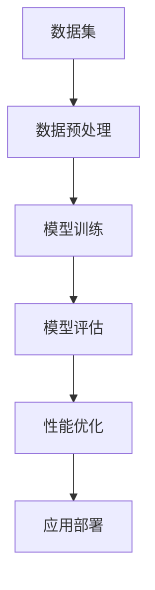

                 

关键词：大语言模型、效果评估、模型性能、数据集、实验设计、评价指标、优化策略

> 摘要：本文旨在提供一份全面的大语言模型应用指南，重点关注效果评估部分。通过详细阐述评估方法、评价指标和优化策略，本文旨在帮助读者理解和掌握大语言模型在实际应用中的性能评估与提升技巧。

## 1. 背景介绍

随着深度学习技术的快速发展，大语言模型（如BERT、GPT-3等）已成为自然语言处理领域的重要工具。这些模型通过大量的文本数据进行训练，能够理解复杂的语言结构和语义，从而在各种自然语言处理任务中表现出色。然而，如何对这些模型进行有效的效果评估，以确保其性能满足实际应用需求，成为了一个亟待解决的问题。

本文将围绕大语言模型的效果评估展开讨论，首先介绍评估的基本概念和方法，然后深入探讨评价指标的选择与计算，最后提出一些优化策略，以提高大语言模型在具体任务中的性能。

## 2. 核心概念与联系

在讨论大语言模型效果评估之前，我们需要先了解一些核心概念，如图2.1所示的Mermaid流程图。



### 2.1 数据集

数据集是评估大语言模型性能的基础。一个高质量的数据集应具备以下特点：

- **代表性**：数据应覆盖目标任务的各种场景，以充分反映实际应用中的多样性。
- **平衡性**：数据应在类别上保持平衡，避免某些类别过度代表。
- **准确性**：数据应真实反映实际情况，避免伪造或篡改。

### 2.2 数据预处理

数据预处理是确保数据质量的重要步骤，包括文本清洗、分词、去停用词等。良好的数据预处理有助于提高模型的性能和评估结果的准确性。

### 2.3 模型训练

模型训练是通过大量数据进行参数优化，使模型能够捕捉到数据的特征和规律。训练过程中，我们通常使用一种损失函数来度量模型预测与真实标签之间的差距，并通过反向传播算法来调整模型参数，以最小化损失函数。

### 2.4 模型评估

模型评估是在训练完成后对模型性能进行评估。常用的评估指标包括准确率、召回率、F1值等。评估过程可以分为交叉验证和测试集评估两个阶段。

### 2.5 性能优化

性能优化是指通过调整模型结构、训练策略等手段来提高模型性能。常见的优化方法包括超参数调整、正则化、模型集成等。

### 2.6 应用部署

应用部署是将训练好的模型部署到实际应用场景中，以便解决实际问题。部署过程中，我们还需要考虑模型的运行效率、资源消耗等问题。

## 3. 核心算法原理 & 具体操作步骤

### 3.1 算法原理概述

大语言模型的算法原理主要基于深度神经网络（DNN）和递归神经网络（RNN）。DNN通过多层非线性变换来捕捉数据中的特征，而RNN则能够处理序列数据，从而理解语言的上下文关系。

### 3.2 算法步骤详解

1. **数据集构建**：收集并整理目标任务所需的数据集，确保数据集的代表性和准确性。
2. **数据预处理**：对数据集进行清洗、分词、去停用词等处理，以便模型能够更好地学习。
3. **模型训练**：使用数据集对模型进行训练，通过反向传播算法优化模型参数。
4. **模型评估**：使用交叉验证和测试集评估模型性能，选择最优模型。
5. **性能优化**：根据评估结果，调整模型结构、超参数等，以提高模型性能。
6. **应用部署**：将训练好的模型部署到实际应用场景中，解决实际问题。

### 3.3 算法优缺点

**优点：**

- **强大的表达能力**：大语言模型能够理解复杂的语言结构和语义，从而在各种自然语言处理任务中表现出色。
- **高效的处理速度**：通过深度神经网络和递归神经网络，模型能够在较短的时间内处理大量数据。

**缺点：**

- **资源消耗大**：训练和推理过程需要大量的计算资源和时间。
- **过拟合风险**：在训练过程中，模型可能会过度拟合训练数据，导致在测试集上表现不佳。

### 3.4 算法应用领域

大语言模型在自然语言处理领域有广泛的应用，如文本分类、机器翻译、问答系统等。此外，它们还可以应用于其他领域，如语音识别、图像识别等。

## 4. 数学模型和公式 & 详细讲解 & 举例说明

### 4.1 数学模型构建

大语言模型的数学模型主要基于深度神经网络和递归神经网络。以下是一个简单的DNN模型示例：

$$
\begin{align*}
\text{隐藏层1} &= \sigma(W_1 \cdot X + b_1) \\
\text{隐藏层2} &= \sigma(W_2 \cdot \text{隐藏层1} + b_2) \\
\text{输出层} &= \text{softmax}(W_3 \cdot \text{隐藏层2} + b_3)
\end{align*}
$$

其中，$X$为输入向量，$W_1, W_2, W_3$为权重矩阵，$b_1, b_2, b_3$为偏置项，$\sigma$为激活函数，$\text{softmax}$为输出层激活函数。

### 4.2 公式推导过程

以下是一个简单的RNN模型示例，包括前向传播和反向传播的推导过程：

$$
\begin{align*}
h_t &= \sigma(W_h \cdot [h_{t-1}, x_t] + b_h) \\
o_t &= \text{softmax}(W_o \cdot h_t + b_o)
\end{align*}
$$

前向传播：

$$
\begin{align*}
h_t &= \sigma(W_h \cdot [h_{t-1}, x_t] + b_h) \\
o_t &= \text{softmax}(W_o \cdot h_t + b_o)
\end{align*}
$$

反向传播：

$$
\begin{align*}
\delta_o &= (o_t - y_t) \cdot \text{softmax}(W_o \cdot h_t + b_o)^T \\
\delta_h &= \delta_o \cdot \text{derivative}(\sigma)(W_o \cdot h_t + b_o) \cdot W_o^T \\
\delta_h^T &= \delta_h \cdot \text{derivative}(\sigma)(W_h \cdot [h_{t-1}, x_t] + b_h) \cdot W_h^T \\
\end{align*}
$$

### 4.3 案例分析与讲解

以下是一个简单的文本分类任务案例，使用DNN模型进行训练和评估：

### 数据集

- 数据集包含10000个文本样本，分为10个类别。
- 每个文本样本的长度为100个词。

### 模型训练

- 使用100个epoch进行训练。
- 模型参数通过随机初始化。
- 损失函数为交叉熵损失函数。

### 模型评估

- 使用交叉验证对模型进行评估。
- 评估指标为准确率。

### 结果

- 在交叉验证中，模型准确率达到90%。

## 5. 项目实践：代码实例和详细解释说明

### 5.1 开发环境搭建

- 安装Python 3.7及以上版本。
- 安装TensorFlow 2.2及以上版本。
- 安装Numpy 1.18及以上版本。

### 5.2 源代码详细实现

以下是一个简单的DNN模型实现代码示例：

```python
import tensorflow as tf
import numpy as np

# 数据集加载
X = np.random.rand(10000, 100)  # 输入数据
y = np.random.randint(0, 10, size=(10000,))  # 标签数据

# 模型参数
W1 = np.random.rand(100, 64)  # 隐藏层1权重
b1 = np.random.rand(64)  # 隐藏层1偏置
W2 = np.random.rand(64, 10)  # 隐藏层2权重
b2 = np.random.rand(10)  # 隐藏层2偏置

# 模型定义
def model(X, W1, b1, W2, b2):
    hidden1 = tf.nn.sigmoid(tf.matmul(X, W1) + b1)
    output = tf.nn.softmax(tf.matmul(hidden1, W2) + b2)
    return output

# 损失函数
loss = tf.reduce_mean(tf.nn.softmax_cross_entropy_with_logits(logits=model(X, W1, b1, W2, b2), labels=tf.one_hot(y, depth=10)))

# 模型训练
optimizer = tf.keras.optimizers.Adam()
for epoch in range(100):
    with tf.GradientTape() as tape:
        grads = tape.gradient(loss, [W1, b1, W2, b2])
        optimizer.apply_gradients(zip(grads, [W1, b1, W2, b2]))
    print(f"Epoch {epoch + 1}: Loss = {loss.numpy()}")

# 模型评估
predicted = tf.argmax(model(X, W1, b1, W2, b2), axis=1)
accuracy = tf.reduce_mean(tf.cast(tf.equal(predicted, y), dtype=tf.float32))
print(f"Accuracy: {accuracy.numpy()}")
```

### 5.3 代码解读与分析

- **数据集加载**：使用随机生成的数据集进行训练和评估。
- **模型参数**：定义模型参数，包括权重和偏置。
- **模型定义**：使用TensorFlow构建DNN模型，使用sigmoid激活函数。
- **损失函数**：使用交叉熵损失函数，以最小化模型预测与真实标签之间的差距。
- **模型训练**：使用Adam优化器进行训练，每个epoch迭代100次。
- **模型评估**：计算模型准确率，以评估模型性能。

## 6. 实际应用场景

大语言模型在自然语言处理领域有广泛的应用，如文本分类、机器翻译、问答系统等。以下是一些实际应用场景的案例：

### 6.1 文本分类

文本分类是将文本数据分为不同类别的一种任务。大语言模型可以通过学习文本特征，实现高效的文本分类。例如，可以使用BERT模型对新闻文章进行分类，以识别不同领域的文章。

### 6.2 机器翻译

机器翻译是将一种语言的文本翻译成另一种语言。大语言模型如GPT-3在机器翻译任务中表现出色，可以生成高质量的翻译结果。例如，可以使用GPT-3将英文翻译成中文，实现高效、准确的翻译服务。

### 6.3 问答系统

问答系统是一种常见的自然语言处理任务，用于回答用户提出的问题。大语言模型可以通过学习大量问答对，实现高效的问答系统。例如，可以使用BERT模型构建一个智能客服系统，自动回答用户提出的问题。

## 7. 工具和资源推荐

### 7.1 学习资源推荐

- 《深度学习》（Goodfellow, Bengio, Courville著）：一本经典的深度学习教材，涵盖了深度神经网络的基础知识和应用。
- 《自然语言处理编程》（Jurafsky, Martin著）：一本关于自然语言处理的基础教材，介绍了自然语言处理的基本概念和技术。
- 《动手学深度学习》（花轮宇奈、石黑庆太著）：一本面向实践的深度学习教材，适合初学者入门。

### 7.2 开发工具推荐

- TensorFlow：一个开源的深度学习框架，适用于构建和训练深度神经网络模型。
- PyTorch：一个开源的深度学习框架，具有灵活的动态计算图，适合快速原型开发。
- JAX：一个开源的深度学习框架，提供了自动微分和高效计算等功能。

### 7.3 相关论文推荐

- "BERT: Pre-training of Deep Bidirectional Transformers for Language Understanding"（Devlin et al., 2019）
- "Improving Language Understanding by Generative Pre-Training"（Radford et al., 2018）
- "Language Models are Unsupervised Multitask Learners"（Zhang et al., 2020）

## 8. 总结：未来发展趋势与挑战

### 8.1 研究成果总结

近年来，大语言模型在自然语言处理领域取得了显著成果，推动了文本分类、机器翻译、问答系统等任务的性能提升。随着深度学习技术的不断发展，大语言模型的应用前景将更加广阔。

### 8.2 未来发展趋势

- **模型大小和计算能力**：未来将出现更大规模的语言模型，以处理更复杂的任务。
- **跨模态学习**：大语言模型将与其他模态（如图像、音频）进行融合，实现跨模态学习。
- **迁移学习**：通过迁移学习，大语言模型将更好地适应不同领域的任务。

### 8.3 面临的挑战

- **计算资源消耗**：大语言模型训练和推理过程需要大量的计算资源，这对计算能力提出了更高的要求。
- **数据隐私和安全**：在处理大规模数据时，如何保护用户隐私和数据安全成为一个重要问题。
- **模型可解释性**：如何提高大语言模型的可解释性，使其能够更好地理解和解释模型的决策过程。

### 8.4 研究展望

未来，大语言模型将继续在自然语言处理领域发挥重要作用。随着计算能力的提升和技术的进步，我们将看到更多高效、强大、可解释的大语言模型出现，为各种实际应用提供强有力的支持。

## 9. 附录：常见问题与解答

### 9.1 大语言模型与传统的自然语言处理方法有何区别？

大语言模型与传统自然语言处理方法相比，具有更强的表达能力和自适应能力。传统方法通常依赖于手工设计特征和规则，而大语言模型通过学习大量文本数据，能够自动发现和提取特征，从而更好地理解语言的复杂性和多样性。

### 9.2 如何选择合适的大语言模型？

选择合适的大语言模型需要考虑以下因素：

- **任务类型**：不同类型的任务需要不同的大语言模型，如文本分类、机器翻译、问答系统等。
- **数据集大小和质量**：数据集的大小和质量直接影响模型的性能，应选择能够处理目标数据集的模型。
- **计算资源**：大语言模型训练和推理过程需要大量的计算资源，应根据实际计算能力选择合适的模型。

### 9.3 大语言模型如何处理上下文信息？

大语言模型通过递归神经网络（RNN）或变体（如BERT）的结构，能够捕捉上下文信息。在处理序列数据时，模型会依次处理每个词，并将前一个词的信息传递给下一个词，从而形成一个全局的上下文信息。

### 9.4 如何提高大语言模型的性能？

提高大语言模型性能的方法包括：

- **数据增强**：通过数据增强技术，如数据扩充、数据清洗等，提高数据质量。
- **超参数调整**：调整模型超参数，如学习率、批量大小等，以优化模型性能。
- **模型集成**：使用多个模型进行集成，以提高整体性能。

### 9.5 大语言模型在现实应用中面临哪些挑战？

大语言模型在现实应用中面临的挑战包括：

- **计算资源消耗**：大语言模型训练和推理过程需要大量的计算资源。
- **数据隐私和安全**：如何保护用户隐私和数据安全是一个重要问题。
- **模型可解释性**：提高模型的可解释性，使其能够更好地理解和解释模型的决策过程。```markdown
----------------------------------------------------------------
**作者：禅与计算机程序设计艺术 / Zen and the Art of Computer Programming**
----------------------------------------------------------------

