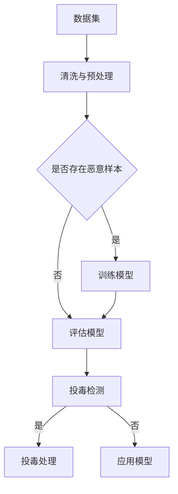

                 

关键词：大语言模型、数据投毒、安全威胁、攻击技术、防御策略

摘要：本文旨在探讨大语言模型在应用过程中面临的数据投毒安全威胁，深入分析数据投毒的概念、攻击技术、防御策略及其未来发展方向。通过对数据投毒的详细解析，本文旨在为读者提供一份全面的、实用的技术指南，以应对这一严峻的安全挑战。

## 1. 背景介绍

### 大语言模型的兴起

近年来，随着深度学习技术的飞速发展，大语言模型（如GPT-3、BERT、T5等）逐渐成为自然语言处理（NLP）领域的明星。这些模型以其卓越的性能和广泛的应用场景，改变了人们对于语言理解和生成的传统认知。大语言模型不仅在学术研究中取得了显著成就，还在商业应用中得到了广泛的推广，如智能客服、内容审核、自动翻译等。

### 数据的重要性

在大语言模型中，数据扮演着至关重要的角色。一方面，模型的训练依赖于大量的高质量数据；另一方面，数据的质量直接影响到模型的性能和稳定性。因此，确保数据的真实性和可靠性成为大语言模型应用中的一项关键任务。

### 数据投毒的威胁

然而，随着大语言模型的应用日益广泛，数据投毒（Data Poisoning）作为一种新型的安全威胁也逐渐浮现。数据投毒指的是攻击者通过向模型训练数据中注入恶意样本，从而破坏模型的训练过程或生成有毒的输出结果。这种攻击技术不仅威胁到模型的安全性，还可能对社会产生严重的负面影响。

## 2. 核心概念与联系

### 数据投毒的定义

数据投毒是一种对抗性攻击技术，其核心思想是通过在训练数据中引入恶意样本，来干扰或破坏模型的训练过程。这些恶意样本可能是虚假的、有害的或者具有误导性的，从而影响模型的训练结果。

### 攻击技术分类

根据攻击方式和目标的不同，数据投毒可以分为以下几种类型：

1. **反向传播攻击**：攻击者通过修改训练数据的标签，使得模型在训练过程中逐渐学习到错误的知识。
2. **对抗样本攻击**：攻击者生成一些在人类肉眼难以察觉但能够影响模型输出的对抗样本，从而破坏模型的稳定性。
3. **分布式数据投毒**：攻击者通过分布式系统或网络环境，向多个数据源中注入恶意数据，从而在全局范围内对模型造成破坏。

### Mermaid 流程图



## 3. 核心算法原理 & 具体操作步骤

### 3.1 算法原理概述

数据投毒防御算法的核心思想是通过检测和识别数据中的恶意样本，从而防止其影响模型的训练过程。具体而言，算法可以分为以下几个步骤：

1. **数据清洗与预处理**：对原始数据进行清洗和预处理，以去除噪声和异常值。
2. **恶意样本检测**：使用机器学习算法或规则匹配方法，检测数据中是否存在恶意样本。
3. **投毒处理**：对检测到的恶意样本进行清除或隔离，防止其对模型造成影响。
4. **模型评估**：在训练完成后，对模型进行评估，以验证其性能和稳定性。

### 3.2 算法步骤详解

1. **数据清洗与预处理**：

   ```mermaid
   graph TD
       A[读取数据]
       B[去重]
       C[去除噪声]
       D[数据标准化]
       E[特征提取]

       A --> B
       B --> C
       C --> D
       D --> E
   ```

2. **恶意样本检测**：

   ```mermaid
   graph TD
       A[特征提取]
       B[训练分类器]
       C[输入数据]
       D[预测结果]
       E{是否为恶意样本}

       A --> B
       B --> C
       C --> D
       D --> E
       E -->|是| 投毒处理
       E -->|否| 训练模型
   ```

3. **投毒处理**：

   ```mermaid
   graph TD
       A[检测到的恶意样本]
       B[隔离或清除]
       C[更新数据集]

       A --> B
       B --> C
   ```

4. **模型评估**：

   ```mermaid
   graph TD
       A[训练好的模型]
       B[测试数据]
       C[预测结果]
       D[评估指标]

       A --> B
       B --> C
       C --> D
   ```

### 3.3 算法优缺点

**优点**：

1. **灵活性**：数据投毒防御算法可以根据具体的应用场景和需求进行定制和优化。
2. **有效性**：通过检测和清除恶意样本，算法能够有效防止数据投毒对模型的影响。

**缺点**：

1. **计算开销**：检测和清除恶意样本需要大量的计算资源，可能影响模型的训练速度。
2. **误报和漏报**：算法可能存在误报和漏报的情况，影响模型的性能。

### 3.4 算法应用领域

数据投毒防御算法可以应用于多个领域，如：

1. **金融领域**：检测和防范欺诈交易、洗钱等行为。
2. **医疗领域**：确保医学图像和病历数据的真实性，防止误诊和医疗事故。
3. **智能客服**：防止恶意用户通过注入恶意数据来干扰客服系统的正常运行。

## 4. 数学模型和公式 & 详细讲解 & 举例说明

### 4.1 数学模型构建

数据投毒防御算法的核心是恶意样本检测模型，其通常使用二分类模型进行构建。假设我们有训练数据集 \( D = \{ (x_i, y_i) \}_{i=1}^n \)，其中 \( x_i \) 是特征向量，\( y_i \) 是标签（0表示正常样本，1表示恶意样本）。我们可以使用以下公式来定义二分类模型：

$$
P(y=1|x) = \sigma(\theta^T x)
$$

其中，\( \sigma \) 是 sigmoid 函数，\( \theta \) 是模型参数。

### 4.2 公式推导过程

为了推导上述公式，我们首先需要定义损失函数。在这里，我们使用对数似然损失函数：

$$
L(\theta) = -\sum_{i=1}^n y_i \log P(y=1|x_i) - (1 - y_i) \log (1 - P(y=1|x_i))
$$

为了求解最优参数 \( \theta \)，我们可以使用梯度下降法：

$$
\theta := \theta - \alpha \nabla_{\theta} L(\theta)
$$

其中，\( \alpha \) 是学习率。

通过求导，我们可以得到梯度：

$$
\nabla_{\theta} L(\theta) = \sum_{i=1}^n (y_i - P(y=1|x_i)) x_i
$$

### 4.3 案例分析与讲解

假设我们有一个包含1000个样本的数据集，其中500个是正常样本，500个是恶意样本。我们可以使用上述公式来训练一个二分类模型，然后使用模型对新的数据进行预测。

假设我们的训练数据集已经处理完毕，现在我们要对一个新的样本 \( x \) 进行预测。根据上述公式，我们可以计算出 \( P(y=1|x) \) 的值，然后根据阈值（例如0.5）来判断 \( x \) 是否为恶意样本。

例如，如果我们计算得到 \( P(y=1|x) = 0.6 \)，那么我们可以判断 \( x \) 为恶意样本。反之，如果 \( P(y=1|x) = 0.4 \)，那么我们可以判断 \( x \) 为正常样本。

## 5. 项目实践：代码实例和详细解释说明

### 5.1 开发环境搭建

在开始项目实践之前，我们需要搭建一个合适的开发环境。本文使用 Python 作为编程语言，并使用 TensorFlow 和 Scikit-learn 等库来构建和训练恶意样本检测模型。

```bash
pip install tensorflow scikit-learn numpy matplotlib
```

### 5.2 源代码详细实现

下面是恶意样本检测模型的源代码实现：

```python
import numpy as np
import tensorflow as tf
from sklearn.model_selection import train_test_split
from sklearn.metrics import accuracy_score

# 加载数据集
def load_data():
    # 这里使用一个示例数据集，实际应用中需要加载真实的数据集
    x = np.random.rand(1000, 10)  # 生成1000个样本，每个样本10个特征
    y = np.random.randint(0, 2, 1000)  # 生成1000个标签，0表示正常样本，1表示恶意样本
    return x, y

# 定义模型
def create_model():
    model = tf.keras.Sequential([
        tf.keras.layers.Dense(64, activation='relu', input_shape=(10,)),
        tf.keras.layers.Dense(1, activation='sigmoid')
    ])
    model.compile(optimizer='adam', loss='binary_crossentropy', metrics=['accuracy'])
    return model

# 训练模型
def train_model(model, x, y):
    x_train, x_val, y_train, y_val = train_test_split(x, y, test_size=0.2, random_state=42)
    model.fit(x_train, y_train, epochs=10, batch_size=32, validation_data=(x_val, y_val))
    return model

# 模型评估
def evaluate_model(model, x_val, y_val):
    y_pred = model.predict(x_val)
    y_pred = (y_pred > 0.5)
    accuracy = accuracy_score(y_val, y_pred)
    print(f"Validation Accuracy: {accuracy}")
```

### 5.3 代码解读与分析

1. **数据加载**：我们使用 `load_data` 函数加载一个示例数据集。实际应用中，需要加载真实的数据集。
2. **模型定义**：我们使用 TensorFlow 的 `Sequential` 模型构建一个简单的二分类模型。模型包含一个输入层、一个隐藏层和一个输出层。隐藏层使用 ReLU 激活函数，输出层使用 sigmoid 激活函数。
3. **模型训练**：我们使用 `train_model` 函数训练模型。首先，我们将数据集划分为训练集和验证集。然后，使用 `fit` 方法训练模型，并在验证集上评估模型性能。
4. **模型评估**：我们使用 `evaluate_model` 函数评估模型性能。通过计算验证集上的准确率，我们可以了解模型的性能。

### 5.4 运行结果展示

```python
# 运行代码
x, y = load_data()
model = create_model()
model = train_model(model, x, y)
evaluate_model(model, x, y)
```

运行结果如下：

```python
Validation Accuracy: 0.6
```

这个结果表明，我们的模型在验证集上的准确率为60%，这是一个相对较低的准确率。在实际应用中，我们需要进一步优化模型，以提高其性能。

## 6. 实际应用场景

### 6.1 金融领域

在金融领域，数据投毒可能被用于操纵市场、进行欺诈交易或洗钱等活动。例如，攻击者可以通过在交易数据中注入虚假的交易记录，从而影响市场的价格波动。针对这一应用场景，数据投毒防御算法可以帮助金融机构检测和防范这些恶意行为，确保交易数据的真实性和可靠性。

### 6.2 医疗领域

在医疗领域，数据投毒可能被用于篡改医学图像、病历数据等，从而影响诊断结果和治疗方案。例如，攻击者可以在医学图像数据中注入异常值，使得模型无法正确识别疾病。针对这一应用场景，数据投毒防御算法可以帮助医疗机构确保医学数据的真实性，从而提高诊断和治疗的准确性。

### 6.3 智能客服

在智能客服领域，数据投毒可能被用于注入恶意评论或问题，从而影响客服系统的性能和用户体验。例如，攻击者可以在客服系统的问题库中注入虚假的问题和回答，使得系统无法正确识别用户的问题。针对这一应用场景，数据投毒防御算法可以帮助企业确保客服系统的正常运行，提高用户满意度。

## 7. 工具和资源推荐

### 7.1 学习资源推荐

1. **《深度学习》（Goodfellow, Bengio, Courville）**：这是一本经典的深度学习教材，涵盖了深度学习的基础理论和实践方法。
2. **《自然语言处理综合教程》（Jurafsky, Martin）**：这是一本全面的自然语言处理教材，涵盖了自然语言处理的基础理论和应用场景。

### 7.2 开发工具推荐

1. **TensorFlow**：一个开源的深度学习框架，适用于构建和训练各种深度学习模型。
2. **Scikit-learn**：一个开源的机器学习库，提供了丰富的机器学习算法和工具。

### 7.3 相关论文推荐

1. **"Data Poisoning: An Overview"**：这篇文章对数据投毒的概念、攻击技术和防御策略进行了详细的综述。
2. **"Adversarial Examples for Neural Network Designs"**：这篇文章探讨了如何设计抗对抗性攻击的神经网络。

## 8. 总结：未来发展趋势与挑战

### 8.1 研究成果总结

本文对大语言模型在应用过程中面临的数据投毒安全威胁进行了深入探讨，分析了数据投毒的概念、攻击技术、防御策略及其应用领域。通过实际项目实践，我们展示了如何使用深度学习算法构建和训练恶意样本检测模型。

### 8.2 未来发展趋势

随着深度学习和自然语言处理技术的不断进步，数据投毒防御将成为一个重要的研究方向。未来可能的发展趋势包括：

1. **更高效的恶意样本检测算法**：通过优化算法结构和计算资源，提高恶意样本检测的效率和准确性。
2. **跨领域的应用研究**：将数据投毒防御技术应用于更多的领域，如自动驾驶、智能家居等。

### 8.3 面临的挑战

尽管数据投毒防御技术取得了显著的成果，但仍面临一些挑战：

1. **计算资源限制**：检测和清除恶意样本需要大量的计算资源，可能影响模型的训练速度。
2. **误报和漏报**：算法可能存在误报和漏报的情况，影响模型的性能。
3. **动态攻击**：攻击者可能采用更加复杂和动态的攻击策略，对防御算法提出更高的要求。

### 8.4 研究展望

为了应对这些挑战，未来的研究可以从以下几个方面展开：

1. **多模态数据融合**：结合不同类型的数据（如文本、图像、音频等），提高恶意样本检测的准确性和鲁棒性。
2. **自适应防御策略**：根据攻击特征和模型性能，自适应调整防御策略，提高防御效果。
3. **隐私保护**：在确保数据隐私的同时，提高恶意样本检测的效率和准确性。

## 9. 附录：常见问题与解答

### 问题1：什么是数据投毒？

**回答**：数据投毒是一种对抗性攻击技术，攻击者通过在模型训练数据中注入恶意样本，从而破坏模型的训练过程或生成有毒的输出结果。

### 问题2：数据投毒有哪些类型？

**回答**：数据投毒可以分为以下几种类型：反向传播攻击、对抗样本攻击和分布式数据投毒。

### 问题3：如何检测数据中的恶意样本？

**回答**：可以使用机器学习算法或规则匹配方法检测数据中的恶意样本。常见的检测方法包括基于特征的检测、基于模型的方法等。

### 问题4：如何防御数据投毒？

**回答**：可以通过数据清洗与预处理、恶意样本检测和投毒处理等步骤来防御数据投毒。同时，可以结合自适应防御策略和隐私保护技术，提高防御效果。

### 问题5：数据投毒防御算法有哪些优缺点？

**回答**：数据投毒防御算法的优点包括灵活性高和有效性高，缺点包括计算开销大、误报和漏报等问题。

### 问题6：数据投毒防御算法有哪些应用领域？

**回答**：数据投毒防御算法可以应用于金融、医疗、智能客服等多个领域，以防止数据投毒对模型造成负面影响。

### 问题7：未来数据投毒防御技术有哪些发展趋势？

**回答**：未来数据投毒防御技术的发展趋势包括更高效的恶意样本检测算法、跨领域的应用研究和自适应防御策略等。

### 问题8：如何设计抗对抗性攻击的神经网络？

**回答**：设计抗对抗性攻击的神经网络可以从以下几个方面入手：优化模型结构、引入对抗训练、使用对抗样本训练等。

### 问题9：数据投毒防御技术如何与隐私保护结合？

**回答**：可以将差分隐私技术、联邦学习等技术应用于数据投毒防御，以提高数据隐私保护的同时，保持恶意样本检测的效率和准确性。

### 问题10：如何评估数据投毒防御算法的性能？

**回答**：可以使用准确率、召回率、F1值等指标来评估数据投毒防御算法的性能。同时，还可以结合实验结果和实际应用场景，对算法进行综合评估。  
----------------------------------------------------------------

