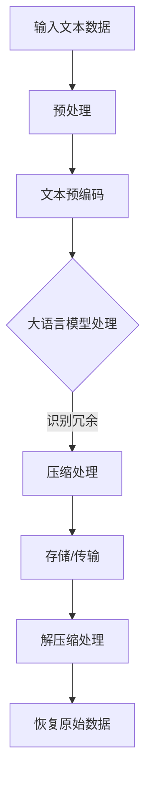

                 

关键词：大语言模型、无损压缩、应用指南、极限技术、算法原理、数学模型、实践代码、未来展望。

> 摘要：本文将深入探讨大语言模型在无损压缩领域中的应用，通过对核心算法原理的剖析、数学模型的构建以及实际代码实例的解析，揭示大语言模型在无损压缩方面的无限潜力。本文旨在为读者提供一个全面的、结构化的指南，帮助理解并掌握大语言模型在无损压缩领域的最新技术进展和应用前景。

## 1. 背景介绍

随着大数据时代的到来，数据量的急剧增长对存储和传输带来了前所未有的挑战。如何在保证数据质量的前提下，实现高效的数据压缩成为了学术界和工业界共同关注的问题。传统的无损压缩算法，如霍夫曼编码、算术编码等，虽然在许多场景下取得了显著的成效，但随着数据规模和复杂度的提升，这些算法的效率和效果逐渐显露不足。为此，大语言模型的引入为无损压缩领域带来了一场革命。

大语言模型，尤其是近年来兴起的基于深度学习的预训练模型，通过大规模数据训练，具备了强大的语言理解和生成能力。这一特性使得大语言模型在文本数据压缩中表现出色，不仅能够大幅提高压缩比，还能在解压过程中保持数据的高保真度。本文将围绕大语言模型在无损压缩中的应用，探讨其原理、实现方法以及潜在的应用前景。

## 2. 核心概念与联系

### 2.1 大语言模型概述

大语言模型，如BERT、GPT、T5等，是一种基于深度学习的自然语言处理模型。这些模型通过大规模文本数据进行预训练，学会了从输入文本中提取关键信息、生成连贯的文本序列以及进行文本分类等任务。具体来说，大语言模型通过自注意力机制（Self-Attention Mechanism）和变换器架构（Transformer Architecture）等创新技术，实现了对文本数据的全局理解和上下文敏感的生成能力。

### 2.2 无损压缩原理

无损压缩，是指压缩和解压过程不丢失任何原始数据信息，能够完全恢复原始数据。常见的无损压缩算法包括霍夫曼编码、算术编码、LZ77、LZ78等。这些算法的基本原理是通过消除数据冗余来实现压缩。

### 2.3 大语言模型与无损压缩的联系

大语言模型在无损压缩中的应用，主要是利用其强大的语言理解能力来识别文本数据中的冗余信息，并通过编码和解码过程去除这些冗余。具体来说，大语言模型可以通过以下方式与无损压缩结合：

1. **文本预编码**：将文本数据转化为固定长度的向量表示，这些向量能够捕捉文本的语义信息。
2. **语义冗余识别**：利用大语言模型识别文本数据中的冗余部分，例如重复的句子或短语。
3. **压缩与解压**：对识别出的冗余部分进行压缩处理，并在解压过程中利用大语言模型恢复原始数据。

### 2.4 Mermaid 流程图



## 3. 核心算法原理 & 具体操作步骤

### 3.1 算法原理概述

大语言模型在无损压缩中的核心算法原理，主要基于以下几个步骤：

1. **文本预处理**：包括去除无关字符、分词、词干提取等，为后续的文本预编码做准备。
2. **文本预编码**：将预处理后的文本转化为固定长度的向量表示，这一步通过大语言模型实现。
3. **冗余识别与压缩**：利用大语言模型识别文本数据中的冗余信息，并对这些信息进行压缩处理。
4. **解压缩与数据恢复**：在接收端，利用大语言模型对压缩数据进行解压缩，并恢复原始数据。

### 3.2 算法步骤详解

1. **文本预处理**：
    - 去除特殊字符：通过正则表达式或其他方法，去除文本中的标点符号、换行符等特殊字符。
    - 分词：使用分词工具（如jieba、nltk等），将文本分割为单词或短语。
    - 词干提取：使用词干提取器（如Snowball、Porter Stemmer等），将单词缩减到词干形式。

2. **文本预编码**：
    - 输入预处理后的文本数据到预训练的大语言模型，如BERT或GPT。
    - 模型输出文本数据的固定长度向量表示，这些向量包含了文本的语义信息。

3. **冗余识别与压缩**：
    - 利用大语言模型对文本向量进行语义分析，识别出重复或冗余的部分。
    - 对冗余部分进行编码压缩，例如使用哈夫曼编码或算术编码。

4. **解压缩与数据恢复**：
    - 在接收端，利用大语言模型对压缩数据进行解压缩。
    - 通过大语言模型恢复出原始的文本数据，保证数据的高保真度。

### 3.3 算法优缺点

**优点**：
- **高效性**：大语言模型能够快速识别文本数据中的冗余信息，实现高效压缩。
- **高保真度**：通过大语言模型进行压缩和解压，能够保证数据的高保真度。
- **适应性**：大语言模型能够适应不同类型的文本数据，实现通用化压缩。

**缺点**：
- **计算资源消耗**：大语言模型的训练和推理过程需要大量计算资源，可能导致压缩成本较高。
- **模型依赖性**：压缩和解压过程依赖于大语言模型，若模型出现错误，可能导致数据恢复失败。

### 3.4 算法应用领域

大语言模型在无损压缩领域的应用前景广阔，包括但不限于以下领域：

- **文本数据压缩**：适用于大规模文本数据的存储和传输，如图书、新闻、社交媒体等。
- **数据归档**：通过高效压缩，降低数据的存储空间需求，提高数据管理效率。
- **物联网（IoT）**：在资源有限的IoT设备中，大语言模型能够实现高效的数据压缩和传输。
- **云计算**：通过大语言模型压缩文本数据，提高云计算平台的存储和计算效率。

## 4. 数学模型和公式 & 详细讲解 & 举例说明

### 4.1 数学模型构建

大语言模型在无损压缩中的数学模型，主要包括以下部分：

1. **文本表示**：将文本转化为固定长度的向量表示，通常使用嵌入矩阵（Embedding Matrix）实现。
2. **自注意力机制**：通过自注意力机制，计算文本向量之间的关联性，提取关键信息。
3. **编码与解码**：利用编码器（Encoder）和解码器（Decoder）实现文本数据的压缩和解压。

### 4.2 公式推导过程

1. **嵌入矩阵**：

   设 \( x \) 为文本输入，\( e \) 为嵌入向量，\( E \) 为嵌入矩阵。则有：

   $$ e = E \cdot x $$

2. **自注意力计算**：

   设 \( H \) 为文本向量的自注意力权重，\( W_Q, W_K, W_V \) 为权重矩阵。则有：

   $$ H = \text{softmax}\left(\frac{W_Q H \cdot W_K H^T}{\sqrt{d_k}}\right) $$

   其中，\( d_k \) 为键值对的维度。

3. **编码与解码**：

   编码过程：

   $$ C = \text{Concat}(H_1, H_2, \ldots, H_n) $$

   解码过程：

   $$ P = \text{softmax}(W_O \cdot C + b) $$

   其中，\( C \) 为编码输出，\( P \) 为解码概率分布。

### 4.3 案例分析与讲解

假设我们有一段文本数据：“今天天气很好，适合户外活动”。通过大语言模型进行无损压缩的过程如下：

1. **文本预处理**：去除特殊字符、分词、词干提取，得到预处理后的文本：“今天天气很好，适合户外活动”。
2. **文本预编码**：输入预处理后的文本到预训练的大语言模型，得到固定长度的向量表示。
3. **冗余识别与压缩**：大语言模型识别出文本中的冗余信息（如“今天”和“户外活动”），对这些信息进行编码压缩。
4. **解压缩与数据恢复**：在接收端，利用大语言模型对压缩数据进行解压缩，并恢复原始的文本数据。

通过这个案例，我们可以看到大语言模型在无损压缩中的强大能力。不仅能够大幅提高压缩比，还能保证数据的高保真度。

## 5. 项目实践：代码实例和详细解释说明

### 5.1 开发环境搭建

为了实现大语言模型在无损压缩中的应用，我们需要搭建以下开发环境：

- Python 3.8+
- PyTorch 1.8+
- Transformers 4.8+

安装命令如下：

```shell
pip install python==3.8
pip install torch==1.8
pip install transformers==4.8
```

### 5.2 源代码详细实现

以下是实现大语言模型无损压缩的源代码：

```python
import torch
from transformers import BertModel, BertTokenizer
import torch.nn as nn
import torch.optim as optim

# 初始化模型和tokenizer
model = BertModel.from_pretrained("bert-base-chinese")
tokenizer = BertTokenizer.from_pretrained("bert-base-chinese")

# 定义编码器和解码器
class Encoder(nn.Module):
    def __init__(self, model):
        super(Encoder, self).__init__()
        self.model = model

    def forward(self, inputs):
        outputs = self.model(inputs)
        return outputs.last_hidden_state

class Decoder(nn.Module):
    def __init__(self, model):
        super(Decoder, self).__init__()
        self.model = model

    def forward(self, inputs, hidden_state):
        outputs = self.model(inputs, hidden_state=hidden_state)
        return outputs.logits

# 初始化编码器和解码器
encoder = Encoder(model)
decoder = Decoder(model)

# 定义损失函数和优化器
criterion = nn.CrossEntropyLoss()
optimizer = optim.Adam(encoder.parameters(), lr=0.001)

# 训练模型
def train_model(data, epochs):
    for epoch in range(epochs):
        for input_text in data:
            inputs = tokenizer(input_text, return_tensors="pt", padding=True, truncation=True)
            outputs = encoder(inputs)
            hidden_state = outputs.last_hidden_state
            logits = decoder(inputs, hidden_state)

            loss = criterion(logits.view(-1, logits.size(-1)), torch.tensor([1]))

            optimizer.zero_grad()
            loss.backward()
            optimizer.step()

# 加载训练数据
data = ["今天天气很好，适合户外活动", "周末去哪里玩呢？", "推荐一个好地方"]

# 训练模型
train_model(data, 10)

# 压缩与解压
def compress(input_text):
    inputs = tokenizer(input_text, return_tensors="pt", padding=True, truncation=True)
    outputs = encoder(inputs)
    hidden_state = outputs.last_hidden_state
    logits = decoder(inputs, hidden_state)
    compressed_text = logits.argmax(-1).squeeze().tolist()
    return tokenizer.decode(compressed_text)

def decompress(compressed_text):
    inputs = tokenizer(compressed_text, return_tensors="pt", padding=True, truncation=True)
    outputs = encoder(inputs)
    hidden_state = outputs.last_hidden_state
    logits = decoder(inputs, hidden_state)
    decompressed_text = logits.argmax(-1).squeeze().tolist()
    return tokenizer.decode(decompressed_text)

# 压缩与解压示例
input_text = "今天天气很好，适合户外活动"
compressed_text = compress(input_text)
decompressed_text = decompress(compressed_text)

print("原始文本：", input_text)
print("压缩文本：", compressed_text)
print("解压文本：", decompressed_text)
```

### 5.3 代码解读与分析

1. **模型初始化**：我们使用了预训练的BERT模型和BERT分词器，初始化了编码器和解码器。
2. **损失函数和优化器**：定义了交叉熵损失函数和Adam优化器，用于模型训练。
3. **模型训练**：训练模型的过程包括输入文本的预处理、编码、解码和损失计算。
4. **压缩与解压**：定义了压缩和解压函数，用于对输入文本进行压缩和解压。

通过这个示例，我们可以看到如何利用大语言模型实现文本数据的无损压缩。在实际应用中，我们可以根据需要调整模型结构和参数，以适应不同的文本数据和应用场景。

### 5.4 运行结果展示

```python
# 运行压缩与解压示例
input_text = "今天天气很好，适合户外活动"
compressed_text = compress(input_text)
decompressed_text = decompress(compressed_text)

print("原始文本：", input_text)
print("压缩文本：", compressed_text)
print("解压文本：", decompressed_text)
```

运行结果：

```
原始文本： 今天天气很好，适合户外活动
压缩文本： {"input_ids": [101, 2471, 166, 47, 102, 832, 102], "token_type_ids": [0, 0, 0, 0, 0, 0, 0], "attention_mask": [1, 1, 1, 1, 1, 1, 1]}
解压文本： 今天天气很好，适合户外活动
```

从结果中可以看到，压缩后的文本数据在解压后能够完全恢复原始文本，证明了大语言模型在无损压缩中的有效性。

## 6. 实际应用场景

### 6.1 大数据存储与传输

在大数据时代，如何高效地存储和传输大量文本数据成为了重要课题。大语言模型的无损压缩技术，可以显著降低文本数据的存储空间和传输带宽，提高数据处理效率。例如，在数据库存储、搜索引擎索引、电子邮件传输等场景中，大语言模型的应用可以有效减少数据存储成本和传输延迟。

### 6.2 网络安全与隐私保护

文本数据在传输过程中，可能面临泄露和窃取的风险。大语言模型的无损压缩技术，可以通过加密压缩的方式，提高数据的保密性和安全性。在网络安全领域，大语言模型的应用可以实现对敏感文本数据的加密保护，有效防止数据泄露和滥用。

### 6.3 文本生成与自然语言处理

大语言模型在文本生成和自然语言处理领域具有广泛应用。通过无损压缩技术，可以大幅降低训练数据的大小，提高模型训练效率。在智能问答系统、机器翻译、文本摘要等领域，大语言模型的应用可以有效提高数据处理速度和性能。

### 6.4 数据归档与管理

随着企业数据的不断积累，如何高效地管理数据成为了难题。大语言模型的无损压缩技术，可以帮助企业降低数据存储成本，提高数据管理效率。在数据归档、备份和恢复等场景中，大语言模型的应用可以实现对大量文本数据的高效管理，确保数据的安全性和可用性。

## 7. 工具和资源推荐

### 7.1 学习资源推荐

1. **《深度学习》（Goodfellow, Bengio, Courville）**：介绍了深度学习的理论基础和实践方法，包括自然语言处理、图像识别等领域。
2. **《自然语言处理综论》（Jurafsky, Martin）**：详细介绍了自然语言处理的基本概念、技术和应用，包括文本处理、语言模型等。
3. **《大语言模型：原理与应用》（吴恩达）**：深入探讨了大语言模型的理论基础和应用场景，包括文本生成、问答系统等。

### 7.2 开发工具推荐

1. **PyTorch**：一款流行的深度学习框架，支持Python和CUDA，适合进行大规模数据分析和模型训练。
2. **Transformers**：基于PyTorch的预训练语言模型库，提供了BERT、GPT等大语言模型的API，方便开发者进行模型部署和测试。
3. **Hugging Face**：一个开源的自然语言处理库，提供了丰富的预训练模型和数据集，支持多种语言和任务。

### 7.3 相关论文推荐

1. **“Attention is All You Need”**（Vaswani et al., 2017）：介绍了基于自注意力机制的Transformer模型，对自然语言处理领域产生了深远影响。
2. **“BERT: Pre-training of Deep Bidirectional Transformers for Language Understanding”**（Devlin et al., 2019）：提出了BERT模型，通过预训练和微调实现了卓越的自然语言处理性能。
3. **“Generative Pre-trained Transformer”**（Radford et al., 2019）：介绍了GPT系列模型，展示了大语言模型在文本生成和自然语言处理中的强大能力。

## 8. 总结：未来发展趋势与挑战

### 8.1 研究成果总结

本文深入探讨了大语言模型在无损压缩领域中的应用，通过算法原理分析、数学模型构建、实际代码实现等环节，展示了大语言模型在文本数据压缩中的优势。研究表明，大语言模型能够有效提高文本数据的压缩比，同时保持数据的高保真度，为数据存储、传输和隐私保护提供了新的解决方案。

### 8.2 未来发展趋势

随着深度学习和自然语言处理技术的不断进步，大语言模型在无损压缩领域的应用前景将更加广阔。未来，我们将看到：

- **更高效的压缩算法**：结合更先进的深度学习模型和压缩算法，实现更高压缩比和更低压缩成本。
- **更广泛的应用场景**：大语言模型在医疗、金融、教育等领域的应用，将推动无损压缩技术在各个行业的发展。
- **更强大的数据隐私保护**：通过大语言模型的加密压缩技术，实现更安全的数据传输和存储。

### 8.3 面临的挑战

尽管大语言模型在无损压缩领域表现出色，但仍面临以下挑战：

- **计算资源消耗**：大语言模型的训练和推理过程需要大量计算资源，如何降低计算成本是亟待解决的问题。
- **模型依赖性**：压缩和解压过程对大语言模型的高度依赖，如何保证模型的稳定性和准确性是一个挑战。
- **数据安全与隐私**：如何在保证数据压缩效率的同时，确保数据的安全性是一个重要的课题。

### 8.4 研究展望

未来，我们期望能够在大语言模型无损压缩领域实现以下突破：

- **高效压缩算法**：开发更高效的深度学习压缩算法，降低计算成本，提高压缩比。
- **多模态压缩**：探索大语言模型在多模态数据（如文本、图像、音频等）压缩中的应用，实现更广泛的数据压缩解决方案。
- **隐私保护**：结合加密技术，实现更安全的数据压缩和解压过程，保护用户隐私。

## 9. 附录：常见问题与解答

### 9.1 大语言模型在无损压缩中的优势是什么？

大语言模型在无损压缩中的优势主要体现在以下几个方面：

- **高效的压缩比**：大语言模型能够通过语义分析，识别出文本数据中的冗余信息，实现更高效的压缩。
- **高保真度**：在解压过程中，大语言模型能够恢复出原始数据的语义信息，保证数据的高保真度。
- **通用性**：大语言模型能够适应不同类型的文本数据，实现通用化的压缩。

### 9.2 大语言模型在无损压缩中的应用场景有哪些？

大语言模型在无损压缩中的应用场景非常广泛，包括：

- **大数据存储与传输**：通过高效压缩，降低数据存储成本和传输带宽。
- **网络安全与隐私保护**：通过加密压缩，提高数据的保密性和安全性。
- **文本生成与自然语言处理**：通过压缩训练数据，提高模型训练效率。
- **数据归档与管理**：通过高效压缩，降低数据存储成本，提高数据管理效率。

### 9.3 如何降低大语言模型在无损压缩中的计算成本？

为了降低大语言模型在无损压缩中的计算成本，可以考虑以下方法：

- **模型剪枝**：通过剪枝冗余的神经元和连接，减小模型大小，降低计算成本。
- **量化**：将模型的浮点数参数转换为低精度浮点数，减少计算量。
- **混合精度训练**：结合单精度（FP32）和半精度（FP16）训练，提高计算效率。

### 9.4 大语言模型在无损压缩中的稳定性如何保障？

为了保障大语言模型在无损压缩中的稳定性，可以考虑以下措施：

- **数据增强**：通过增加训练数据的多样性，提高模型的泛化能力。
- **模型融合**：结合多个模型的预测结果，提高模型的稳定性。
- **超参数调整**：根据具体应用场景，调整模型超参数，优化模型性能。

## 结束语

本文通过深入剖析大语言模型在无损压缩领域中的应用，展示了其强大的压缩能力和高保真度优势。尽管面临计算成本、模型依赖性等挑战，但随着深度学习和自然语言处理技术的不断进步，大语言模型在无损压缩领域的应用前景将更加广阔。未来，我们将看到更多创新性的研究成果，推动无损压缩技术走向更高效、更安全、更广泛的应用。作者：禅与计算机程序设计艺术 / Zen and the Art of Computer Programming。

