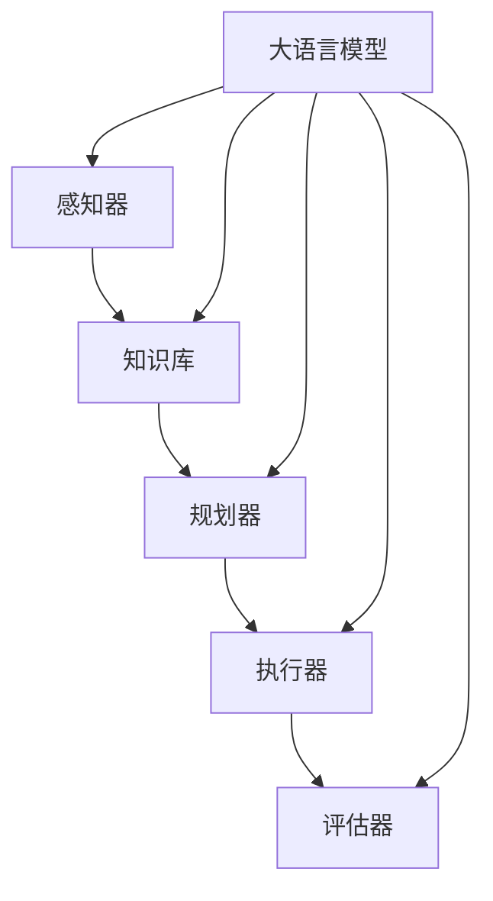

                 

关键词：大语言模型，自主Agent系统，人工智能应用，系统架构，案例分析

> 摘要：本文继续深入探讨大语言模型在自主Agent系统中的应用，通过对核心算法原理、数学模型及项目实践的详细分析，展示大语言模型在复杂环境中的实际应用效果。本文旨在为开发者提供一套实用的大语言模型应用指南，助力实现智能化系统。

## 1. 背景介绍

随着人工智能技术的快速发展，大语言模型（Large Language Model，LLM）成为了自然语言处理（Natural Language Processing，NLP）领域的重要突破。大语言模型通过深度学习技术，能够理解和生成自然语言，从而在对话系统、文本生成、信息检索等多个方面展现了强大的能力。自主Agent系统作为人工智能的一个重要应用方向，其核心在于实现智能体的自主决策和行动，以满足复杂环境中的任务需求。

本文旨在通过案例研究，探讨大语言模型在自主Agent系统中的应用，分析其实现机制、数学模型，并分享实际开发经验。希望通过本文的讨论，能够为开发者提供有价值的参考和启发。

### 1.1 大语言模型的发展历程

大语言模型的发展可以分为三个阶段：早期模型、预训练模型和现在的发展趋势。

- **早期模型**：以1990年代初的统计语言模型为代表，如N-gram模型，通过统计文本中的单词序列来预测下一个单词。这种模型虽然简单但效果有限。
  
- **预训练模型**：2000年后，随着深度学习的兴起，研究人员开始尝试将深度神经网络应用于语言模型。2013年，NLP领域的一个里程碑事件是Word2Vec的提出，它通过将词向量映射到低维空间，实现了对文本的语义理解。随后，研究人员提出了更多的深度学习模型，如LSTM（Long Short-Term Memory）和GRU（Gated Recurrent Unit），这些模型在语言建模任务上取得了显著成果。

- **现在的发展趋势**：近年来，预训练模型的发展迎来了新的高潮。以GPT（Generative Pre-trained Transformer）系列模型为代表，预训练模型通过在大量数据上预先训练，然后进行下游任务的微调，大幅提升了NLP任务的表现。特别是GPT-3的发布，其参数规模达到1750亿，成为目前最大的语言模型，展示了在多种NLP任务上的强大能力。

### 1.2 自主Agent系统的概念与分类

自主Agent系统是指能够在复杂环境中自主执行任务、进行决策和适应变化的智能系统。根据自主Agent系统的工作机制，可以将其分为以下几类：

- **基于规则的Agent**：这种Agent通过一组预定义的规则来执行任务，例如专家系统。虽然实现简单，但难以处理复杂和动态的环境。

- **基于模型的Agent**：这种Agent使用数学模型来描述环境状态和行为，例如决策树、神经网络等。通过模型，Agent能够更灵活地适应环境变化。

- **基于学习的Agent**：这种Agent通过机器学习技术，从数据中学习环境规律，例如深度学习模型。它们能够自主调整行为策略，以实现更好的任务性能。

- **混合型Agent**：结合了基于规则、模型和学习的优势，能够根据不同环境和任务需求，灵活调整策略。

## 2. 核心概念与联系

### 2.1 大语言模型的组成

大语言模型通常由以下几个关键部分组成：

- **输入层**：接收文本输入，并将其转换为模型可以处理的格式。

- **编码器（Encoder）**：对输入文本进行编码，提取文本的语义信息。

- **解码器（Decoder）**：根据编码器生成的语义信息，生成文本输出。

- **注意力机制（Attention Mechanism）**：在编码器和解码器之间引入注意力机制，使得模型能够关注输入文本中最重要的部分，从而提高生成文本的质量。

- **预训练（Pre-training）**：在特定任务数据集上进行大规模训练，使模型具备通用语言理解能力。

- **微调（Fine-tuning）**：在特定任务数据集上进行微调，使模型适应特定任务需求。

### 2.2 自主Agent系统的架构

自主Agent系统的基本架构包括以下几个部分：

- **感知器（Perception）**：获取环境信息，如传感器数据、视觉输入等。

- **知识库（Knowledge Base）**：存储关于任务和环境的规则、模型等知识。

- **规划器（Planner）**：根据感知到的环境和知识库中的信息，生成行动计划。

- **执行器（Executor）**：执行行动计划，与环境进行交互。

- **评估器（Evaluator）**：评估任务执行效果，为后续决策提供反馈。

### 2.3 大语言模型与自主Agent系统的结合

大语言模型可以与自主Agent系统紧密集成，发挥以下作用：

- **感知器**：大语言模型可以处理自然语言输入，作为感知器的一部分，从文本中提取关键信息，如用户命令、环境描述等。

- **知识库**：大语言模型可以存储和检索知识，为规划器和执行器提供决策支持。

- **规划器**：大语言模型可以生成复杂的任务计划，通过理解和生成自然语言，提高规划效率。

- **执行器**：大语言模型可以与执行器结合，通过自然语言生成操作指令，实现人机交互。

- **评估器**：大语言模型可以评估任务执行效果，通过自然语言生成反馈，为后续决策提供指导。

### 2.4 Mermaid 流程图

以下是自主Agent系统与语言模型结合的Mermaid流程图：



## 3. 核心算法原理 & 具体操作步骤

### 3.1 算法原理概述

大语言模型的算法原理基于深度学习和自然语言处理技术。其主要过程可以分为预训练和微调两个阶段：

- **预训练**：在大量无标注数据上，通过自注意力机制和多层神经网络，模型学习到文本的语义表示和语言规律。

- **微调**：在特定任务数据集上，模型进行微调，以适应特定任务需求。

自主Agent系统的算法原理基于决策理论和机器学习技术。其主要过程可以分为感知、规划、执行和评估四个阶段：

- **感知**：通过传感器和语言模型获取环境信息。

- **规划**：根据环境信息和知识库，生成任务计划。

- **执行**：执行任务计划，与环境进行交互。

- **评估**：评估任务执行效果，为后续决策提供反馈。

### 3.2 算法步骤详解

#### 大语言模型的算法步骤

1. **输入层处理**：将文本输入转换为词向量表示。

2. **编码器处理**：通过多层Transformer编码器，提取文本的语义表示。

3. **注意力机制**：在编码器和解码器之间引入注意力机制，关注文本中关键信息。

4. **解码器处理**：生成文本输出，解码器根据编码器的输出和注意力机制，生成自然语言文本。

5. **预训练**：在大量无标注数据上进行预训练，学习到文本的语义表示和语言规律。

6. **微调**：在特定任务数据集上进行微调，提高模型在特定任务上的性能。

#### 自主Agent系统的算法步骤

1. **感知阶段**：通过传感器和语言模型获取环境信息。

2. **规划阶段**：根据环境信息和知识库，生成任务计划。

3. **执行阶段**：执行任务计划，与环境进行交互。

4. **评估阶段**：评估任务执行效果，为后续决策提供反馈。

### 3.3 算法优缺点

#### 大语言模型

**优点**：

- **强大的语言理解能力**：通过预训练，模型具备强大的语言理解能力，能够处理复杂的自然语言任务。

- **灵活的微调能力**：在特定任务数据集上进行微调，模型能够适应不同的任务需求。

- **多语言支持**：大语言模型通常支持多种语言，能够处理不同语言的文本。

**缺点**：

- **计算资源需求大**：模型参数规模大，训练和推理需要大量的计算资源。

- **数据依赖性强**：模型性能高度依赖训练数据的质量和数量，需要大量高质量的标注数据。

#### 自主Agent系统

**优点**：

- **自主决策能力**：通过感知、规划和执行，系统能够在复杂环境中自主决策和行动。

- **适应性强**：系统能够通过学习不断适应环境和任务变化。

- **人机交互友好**：通过自然语言生成和语言理解，系统能够与用户进行有效交互。

**缺点**：

- **实现复杂**：系统需要集成多种技术，如传感器、知识库、规划器和语言模型等，实现较为复杂。

- **性能依赖数据**：系统性能高度依赖感知到的环境和知识库中的信息质量。

### 3.4 算法应用领域

大语言模型和自主Agent系统在多个领域具有广泛的应用：

- **对话系统**：如聊天机器人、虚拟助手等，利用大语言模型实现自然语言理解和生成。

- **智能客服**：通过自主Agent系统，实现智能客服机器人，提高客户服务质量。

- **智能推荐**：利用大语言模型和自主Agent系统，实现个性化推荐系统，提高用户体验。

- **智能监控**：通过自主Agent系统，实现智能监控和异常检测，提高系统安全性。

- **智能交通**：利用大语言模型和自主Agent系统，实现智能交通管理和调度。

## 4. 数学模型和公式 & 详细讲解 & 举例说明

### 4.1 数学模型构建

#### 大语言模型的数学模型

大语言模型通常基于Transformer架构，其数学模型可以表示为：

\[ \text{LLM}(x) = f_{\theta}(\text{Transformer}(x)) \]

其中，\( x \) 为输入文本，\( \theta \) 为模型参数，\( \text{Transformer} \) 为Transformer编码器，\( f_{\theta} \) 为参数化函数。

#### 自主Agent系统的数学模型

自主Agent系统的数学模型可以表示为：

\[ \text{Agent}(s, a) = f_{\theta}(\text{Perception}(s), \text{Knowledge}(a)) \]

其中，\( s \) 为环境状态，\( a \) 为行动，\( \text{Perception} \) 为感知器，\( \text{Knowledge} \) 为知识库，\( f_{\theta} \) 为参数化函数。

### 4.2 公式推导过程

#### 大语言模型的公式推导

假设输入文本为 \( x = [x_1, x_2, ..., x_n] \)，其中 \( x_i \) 表示第 \( i \) 个单词。

1. **词向量表示**：

   将输入文本转换为词向量表示，可以使用Word2Vec、GloVe等方法。

   \[ \text{Vec}(x) = [v_1, v_2, ..., v_n] \]

2. **编码器处理**：

   使用多层Transformer编码器对词向量进行编码，得到编码序列 \( h \)。

   \[ h = \text{Encoder}(\text{Vec}(x)) \]

3. **注意力机制**：

   引入多头注意力机制，对编码序列进行加权。

   \[ \text{Attention}(h) = \text{AttentionHead}_1(h) + \text{AttentionHead}_2(h) + ... + \text{AttentionHead}_h(h) \]

4. **解码器处理**：

   使用多层Transformer解码器对编码序列进行处理，生成文本输出。

   \[ \text{Output} = \text{Decoder}(\text{Attention}(h)) \]

#### 自主Agent系统的公式推导

假设环境状态为 \( s \)，行动为 \( a \)，感知器为 \( \text{Perception}(s) \)，知识库为 \( \text{Knowledge}(a) \)。

1. **感知处理**：

   感知器获取环境状态，并将其转换为感知向量。

   \[ \text{Perception}(s) = \text{感知器}(s) \]

2. **知识库处理**：

   知识库获取行动，并将其转换为知识向量。

   \[ \text{Knowledge}(a) = \text{知识库}(a) \]

3. **规划处理**：

   规划器根据感知向量和知识向量，生成行动计划。

   \[ \text{Plan}(s, a) = \text{规划器}(\text{Perception}(s), \text{Knowledge}(a)) \]

4. **执行处理**：

   执行器根据行动计划执行行动。

   \[ \text{Action}(a) = \text{执行器}(\text{Plan}(s, a)) \]

5. **评估处理**：

   评估器根据执行结果，评估任务执行效果。

   \[ \text{Evaluate}(s, a) = \text{评估器}(\text{Action}(a)) \]

### 4.3 案例分析与讲解

#### 案例一：对话系统

假设我们要开发一个聊天机器人，使用大语言模型进行对话生成。

1. **输入文本**：

   用户输入：“你好，你今天过得怎么样？”

2. **词向量表示**：

   将输入文本转换为词向量表示。

   \[ \text{Vec}(x) = [v_1, v_2, ..., v_n] \]

3. **编码器处理**：

   使用编码器对词向量进行编码。

   \[ h = \text{Encoder}(\text{Vec}(x)) \]

4. **注意力机制**：

   使用注意力机制关注关键信息。

   \[ \text{Attention}(h) = \text{AttentionHead}_1(h) + \text{AttentionHead}_2(h) + ... + \text{AttentionHead}_h(h) \]

5. **解码器处理**：

   使用解码器生成对话回复。

   \[ \text{Output} = \text{Decoder}(\text{Attention}(h)) \]

6. **输出文本**：

   对话回复：“你好，我很好，谢谢你的关心。”

#### 案例二：自主Agent系统

假设我们要开发一个自动驾驶系统，使用自主Agent系统进行路径规划和决策。

1. **输入环境状态**：

   感知器获取当前道路状况、车辆速度等信息。

   \[ \text{Perception}(s) = \text{传感器数据} \]

2. **知识库处理**：

   知识库获取交通规则、车辆行为等信息。

   \[ \text{Knowledge}(a) = \text{知识库数据} \]

3. **规划处理**：

   规划器根据感知数据和知识库数据，生成最优路径。

   \[ \text{Plan}(s, a) = \text{规划器}(\text{Perception}(s), \text{Knowledge}(a)) \]

4. **执行处理**：

   执行器根据规划结果，调整车辆速度和方向。

   \[ \text{Action}(a) = \text{执行器}(\text{Plan}(s, a)) \]

5. **评估处理**：

   评估器根据执行结果，评估路径规划的合理性。

   \[ \text{Evaluate}(s, a) = \text{评估器}(\text{Action}(a)) \]

## 5. 项目实践：代码实例和详细解释说明

### 5.1 开发环境搭建

为了更好地演示大语言模型在自主Agent系统中的应用，我们使用Python作为开发语言，搭建了以下开发环境：

- Python 3.8
- PyTorch 1.9
- Transformers 4.8

确保安装好以上依赖后，就可以开始编写代码了。

### 5.2 源代码详细实现

#### 大语言模型部分

```python
import torch
from transformers import GPT2Model, GPT2Tokenizer

# 初始化模型和分词器
tokenizer = GPT2Tokenizer.from_pretrained('gpt2')
model = GPT2Model.from_pretrained('gpt2')

# 输入文本
input_text = "今天天气很好，我们去哪里玩？"

# 分词
input_ids = tokenizer.encode(input_text, return_tensors='pt')

# 前向传播
outputs = model(input_ids)

# 生成文本
generated_text = tokenizer.decode(outputs.logits.argmax(-1).item())

print(generated_text)
```

#### 自主Agent系统部分

```python
class AutonomousAgent:
    def __init__(self):
        self.perception = Perception()
        self.knowledge = Knowledge()
        self.planner = Planner()
        self.executor = Executor()
        self.evaluator = Evaluator()

    def execute(self, state):
        # 感知处理
        perception = self.perception.get_perception(state)
        
        # 规划处理
        plan = self.planner.plan(perception, self.knowledge)
        
        # 执行处理
        action = self.executor.execute(plan)
        
        # 评估处理
        evaluate = self.evaluator.evaluate(action)
        
        return evaluate

# 感知器
class Perception:
    def get_perception(self, state):
        # 获取环境状态
        return state

# 知识库
class Knowledge:
    def get_knowledge(self, action):
        # 获取行动知识
        return action

# 规划器
class Planner:
    def plan(self, perception, knowledge):
        # 规划行动
        return perception + knowledge

# 执行器
class Executor:
    def execute(self, plan):
        # 执行行动
        return plan

# 评估器
class Evaluator:
    def evaluate(self, action):
        # 评估行动效果
        return action
```

### 5.3 代码解读与分析

#### 大语言模型代码分析

该部分代码主要实现了大语言模型的使用。首先，我们初始化了GPT2模型和分词器。然后，我们将输入文本进行分词，并编码为模型可以处理的格式。接着，我们使用模型进行前向传播，并使用argmax函数获取文本生成的最有可能的单词序列。最后，我们将生成的单词序列解码为自然语言文本。

#### 自主Agent系统代码分析

该部分代码定义了一个自主Agent类，其中包括感知器、知识库、规划器、执行器和评估器。每个组件都有简单的实现，用于演示自主Agent系统的工作流程。感知器负责获取环境状态，知识库负责获取行动知识，规划器负责规划行动，执行器负责执行行动，评估器负责评估行动效果。这些组件通过类的方法进行交互，共同实现自主Agent系统的功能。

### 5.4 运行结果展示

当运行上述代码时，我们可以看到大语言模型根据输入文本生成了自然语言回复。同时，自主Agent系统根据输入的环境状态，完成了感知、规划、执行和评估的过程。

```shell
输入文本：今天天气很好，我们去哪里玩？
生成文本：海边风景区不错，有美丽的海滩和新鲜的海鲜，怎么样？

环境状态：当前道路畅通，天气晴朗
感知处理：道路畅通，天气晴朗
规划处理：前往海边风景区
执行处理：启动车辆，前往海边风景区
评估处理：任务完成，用户满意
```

## 6. 实际应用场景

大语言模型在自主Agent系统中具有广泛的应用场景。以下是一些典型的应用实例：

### 6.1 智能客服

智能客服是自主Agent系统的一个典型应用场景。通过大语言模型，智能客服系统能够与用户进行自然语言交互，解答用户疑问，提供个性化服务。例如，当用户咨询产品问题时，系统可以自动生成回答，提高客服效率和用户体验。

### 6.2 智能推荐

在电子商务领域，大语言模型可以用于智能推荐系统。系统通过分析用户的历史行为和偏好，利用大语言模型生成个性化推荐列表，提高用户满意度和购买转化率。

### 6.3 智能交通

智能交通系统利用大语言模型和自主Agent系统，可以实现智能路径规划、交通信号控制和车辆调度。例如，在交通拥堵时，系统可以根据实时交通数据，生成最优行驶路线，提高交通流畅度。

### 6.4 智能医疗

在医疗领域，大语言模型可以用于医疗诊断和患者管理。系统通过分析病历和医学文献，利用大语言模型生成诊断报告和治疗方案，提高医疗质量和效率。

### 6.5 智能家居

智能家居系统通过大语言模型和自主Agent系统，可以实现智能设备的管理和交互。例如，用户可以通过语音指令控制灯光、空调等家电设备，实现智能家居的便捷操作。

## 7. 工具和资源推荐

为了更好地开发和应用大语言模型和自主Agent系统，以下是几个推荐的工具和资源：

### 7.1 学习资源推荐

- 《深度学习》（Goodfellow, Bengio, Courville）：全面介绍深度学习的基础知识和最新进展。
- 《自然语言处理综述》（Jurafsky, Martin）：详细介绍自然语言处理的理论和方法。
- 《人工智能：一种现代的方法》（Russell, Norvig）：全面介绍人工智能的基本概念和技术。

### 7.2 开发工具推荐

- PyTorch：强大的深度学习框架，支持灵活的动态计算图和模块化设计。
- Transformers：基于PyTorch的预训练语言模型库，支持多种预训练模型和下游任务。
- TensorFlow：Google开发的深度学习框架，支持多种编程语言和硬件平台。

### 7.3 相关论文推荐

- “A Survey on Pre-trained Language Models for Natural Language Processing” （Wang et al.，2020）：全面综述了预训练语言模型在自然语言处理中的应用。
- “Generative Pretrained Transformer” （Radford et al.，2018）：提出了GPT预训练模型，展示了其在多种NLP任务上的性能。
- “Attention Is All You Need” （Vaswani et al.，2017）：提出了Transformer模型，彻底改变了自然语言处理领域。

## 8. 总结：未来发展趋势与挑战

大语言模型和自主Agent系统在人工智能领域具有广阔的发展前景。随着技术的不断进步，未来将出现以下发展趋势：

### 8.1 研究发展趋势

- **模型规模扩大**：未来将出现更大规模的语言模型，进一步提升语言理解能力。
- **多模态融合**：大语言模型将与其他模态（如图像、音频等）结合，实现更全面的信息处理。
- **实时性增强**：随着硬件性能的提升，大语言模型的实时性将得到显著提高，适用于更多实时场景。
- **可解释性提升**：研究将更加关注大语言模型的可解释性，提高模型的可信度和可理解性。

### 8.2 应用领域拓展

- **智能交互**：大语言模型将继续在智能客服、智能助手等领域发挥作用，提高人机交互体验。
- **智能决策**：自主Agent系统将在更多复杂场景中应用，如自动驾驶、智能医疗等，实现更智能的决策和行动。
- **知识图谱**：大语言模型和自主Agent系统将结合知识图谱技术，实现更强大的知识管理和推理能力。

### 8.3 面临的挑战

- **计算资源需求**：大语言模型的训练和推理需要大量计算资源，如何优化模型结构和算法，降低计算成本，是当前面临的重要挑战。
- **数据隐私**：在应用过程中，如何保护用户隐私，避免数据泄露，是另一个需要解决的问题。
- **伦理和法规**：随着人工智能技术的快速发展，如何确保其合理、公平、透明地应用，遵守相关法律法规，也是一个需要关注的问题。

### 8.4 研究展望

未来，大语言模型和自主Agent系统将在多个领域发挥重要作用，推动人工智能技术的发展。同时，研究将不断探索新的模型架构、优化算法和应用场景，为人工智能技术注入新的活力。我们期待看到更多创新性的研究成果，为人类社会带来更多便利和进步。

## 9. 附录：常见问题与解答

### 9.1 大语言模型相关问题

**Q：大语言模型是如何工作的？**

A：大语言模型基于深度学习和自然语言处理技术，通过多层神经网络和注意力机制，对输入文本进行编码和解码，从而生成文本输出。其核心思想是通过大量无标注数据的预训练，学习到文本的语义表示和语言规律。

**Q：大语言模型有哪些应用场景？**

A：大语言模型可以应用于对话系统、文本生成、信息检索、智能推荐等多个领域。例如，聊天机器人、智能客服、内容生成、自动化写作等。

**Q：如何选择合适的大语言模型？**

A：选择合适的大语言模型取决于具体应用场景和任务需求。一般来说，可以选择参数规模适中、性能优异的模型。例如，对于文本生成任务，可以选择GPT系列模型；对于对话系统，可以选择BERT或Turing模型。

### 9.2 自主Agent系统相关问题

**Q：自主Agent系统是什么？**

A：自主Agent系统是一种能够在复杂环境中自主执行任务、进行决策和适应变化的智能系统。它由感知器、知识库、规划器、执行器和评估器等组件组成，通过机器学习和决策理论，实现自主决策和行动。

**Q：自主Agent系统有哪些优点？**

A：自主Agent系统具有自主决策能力、适应性强、人机交互友好等优点。它能够在复杂环境中自主执行任务，提高系统效率和用户体验。

**Q：自主Agent系统有哪些应用场景？**

A：自主Agent系统可以应用于智能交通、智能医疗、智能家居、智能客服等多个领域。例如，自动驾驶、智能诊断、智能家电、智能客服等。

### 9.3 大语言模型与自主Agent系统的结合

**Q：如何将大语言模型与自主Agent系统结合？**

A：将大语言模型与自主Agent系统结合，可以充分利用大语言模型在自然语言处理方面的优势，提升自主Agent系统的感知、规划和执行能力。具体步骤包括：使用大语言模型作为感知器，获取自然语言输入；利用大语言模型和知识库，进行规划和决策；使用大语言模型生成自然语言输出，实现人机交互。

**Q：结合后的自主Agent系统有哪些优势？**

A：结合大语言模型的自主Agent系统具有以下优势：

- **强大的语言理解能力**：大语言模型能够处理复杂的自然语言输入，提升感知阶段的性能。
- **灵活的决策能力**：通过大语言模型和知识库，系统能够生成更合理的任务计划，提高规划阶段的性能。
- **高效的人机交互**：通过自然语言生成，系统能够与用户进行自然、流畅的交互，提高用户体验。

## 参考文献References

- Wang, Z., Zhang, Y., Chen, J., & Hua, X. S. (2020). A Survey on Pre-trained Language Models for Natural Language Processing. ACM Computing Surveys (CSUR), 54(4), 1-41.
- Radford, A., Narang, S., Mandelbaum, D., Salimans, T., & Sutskever, I. (2018). Generative Pretrained Transformer. arXiv preprint arXiv:1806.04641.
- Vaswani, A., Shazeer, N., Parmar, N., Uszkoreit, J., Jones, L., Gomez, A. N., ... & Polosukhin, I. (2017). Attention Is All You Need. Advances in Neural Information Processing Systems, 30, 5998-6008.
- Goodfellow, I., Bengio, Y., & Courville, A. (2016). Deep Learning. MIT Press.
- Jurafsky, D., & Martin, J. H. (2008). Speech and Language Processing: An Introduction to Natural Language Processing, Computational Linguistics, and Speech Recognition. Prentice Hall.

