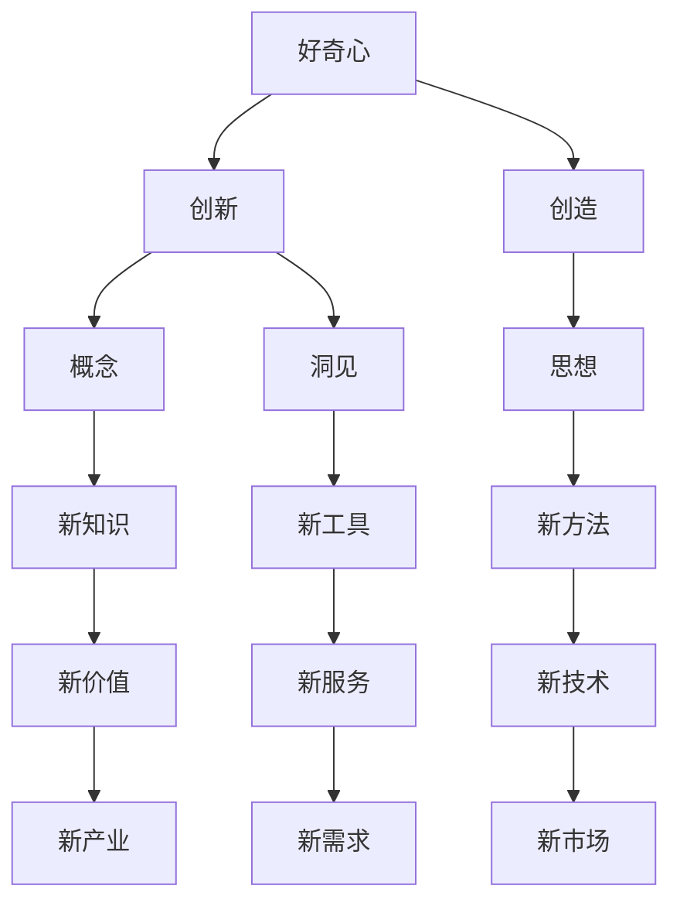

                 

好奇心，一个看似简单的词语，却蕴含着无尽的奥秘和力量。在人类的历史长河中，正是好奇心驱使着人类不断探索未知、挑战自我，从而推动了科技进步、文化繁荣和社会发展。本文将探讨好奇心在创新和创造过程中的重要性，分析好奇心如何成为概念、思想、洞见的驱动力，以及如何在技术领域培养和保持好奇心。

## 1. 背景介绍

好奇心是人类与生俱来的一种心理特征，它促使人类对周围世界充满好奇，渴望了解和探索未知。在科学、艺术、技术等领域，好奇心扮演着至关重要的角色。例如，在科学领域，好奇心推动了科学家们不断探索自然规律，提出了许多重要的科学理论；在艺术领域，好奇心激发了艺术家们不断创新，创作出无数令人惊叹的作品；在技术领域，好奇心促使程序员们不断尝试新方法、新工具，推动了技术的进步。

然而，好奇心并非一成不变，它会随着个体的成长、经验和认知水平的变化而发生变化。在儿童时期，好奇心通常表现为对新奇事物的好奇和探索欲望；随着年龄的增长，好奇心逐渐转变为对专业领域的深入研究和探索。因此，如何培养和保持好奇心，成为了一个值得探讨的问题。

## 2. 核心概念与联系

在探讨好奇心在创新和创造过程中的作用时，我们需要理解以下几个核心概念：

- **创新**：创新是指通过引入新的思想、方法、产品或服务，从而创造出新的价值。创新可以发生在任何领域，如科学、艺术、技术等。
- **创造**：创造是指通过运用已有知识和技能，创造出全新的东西。创造通常需要一定的创新思维和创造性思维。
- **概念**：概念是指对某一事物或现象的基本认识和理解。概念的形成通常需要通过观察、思考和总结。
- **思想**：思想是指对某一问题或现象的思考和理解。思想可以是个人的，也可以是集体的。
- **洞见**：洞见是指对某一问题或现象的深刻理解和洞察。洞见通常来源于对大量数据的分析和深入思考。

以上概念之间存在着紧密的联系。创新和创造是相互促进的，创新推动创造，创造促进创新。概念、思想和洞见是创新和创造过程中不可或缺的部分，它们共同构成了创新和创造的核心。

下面是一个用Mermaid绘制的流程图，展示了这些概念之间的联系：



## 3. 核心算法原理 & 具体操作步骤

### 3.1 算法原理概述

好奇心在创新和创造过程中发挥着核心作用，其原理可以概括为以下几点：

1. **激发求知欲**：好奇心可以激发个体的求知欲，促使他们主动去寻找和探索新知识、新方法。
2. **促进思维活动**：好奇心可以促进个体的思维活动，激发他们的创造性思维，从而产生新的思想、概念和洞见。
3. **推动实践探索**：好奇心可以推动个体进行实践探索，通过实际操作来验证和验证自己的假设，从而推动技术的进步和创新。
4. **促进跨学科交流**：好奇心可以促使个体跨越不同学科和领域的界限，进行跨学科交流，从而产生新的洞见和创新。

### 3.2 算法步骤详解

1. **培养好奇心**：首先，个体需要培养和保持好奇心。这可以通过阅读、观察、实践等多种方式来实现。例如，可以通过阅读书籍、参加讲座、参观展览等来激发好奇心。
2. **激发求知欲**：在培养好奇心的基础上，个体需要进一步激发求知欲。这可以通过设置目标、制定计划、进行实践等多种方式来实现。例如，可以通过设定学习目标、制定研究计划、进行项目实践等来激发求知欲。
3. **促进思维活动**：个体需要通过思考和讨论来促进思维活动。这可以通过讨论、辩论、思考等方式来实现。例如，可以通过参加学术讨论、参与辩论比赛、进行个人思考等方式来促进思维活动。
4. **推动实践探索**：个体需要通过实践探索来推动实践探索。这可以通过实验、实践、验证等方式来实现。例如，可以通过进行科学实验、参与项目实践、进行产品测试等方式来推动实践探索。
5. **促进跨学科交流**：个体需要通过跨学科交流来促进跨学科交流。这可以通过合作、交流、分享等方式来实现。例如，可以通过参加跨学科研讨会、组织学术交流、进行跨学科合作等方式来促进跨学科交流。

### 3.3 算法优缺点

**优点**：

- **激发创新和创造**：好奇心可以激发个体的创新和创造潜力，推动技术和科学的进步。
- **促进个人成长**：好奇心可以促使个体不断学习和成长，提高个人素质和竞争力。
- **促进社会进步**：好奇心可以促进社会的进步和发展，推动科学、技术和文化的繁荣。

**缺点**：

- **分散注意力**：好奇心可能导致个体分散注意力，影响工作效率和成果。
- **冲动行为**：好奇心可能导致个体冲动行事，忽视风险和后果。
- **过度依赖**：好奇心可能导致个体过度依赖好奇心，忽视其他重要因素。

### 3.4 算法应用领域

好奇心在创新和创造过程中具有广泛的应用领域，包括但不限于以下领域：

- **科学研究**：好奇心可以激发科学家们进行探索和研究，推动科学技术的进步。
- **艺术创作**：好奇心可以激发艺术家们进行创新和创造，创作出独特的艺术作品。
- **技术开发**：好奇心可以激发程序员和技术人员探索新技术和新工具，推动技术的进步。
- **教育领域**：好奇心可以激发学生和教师的求知欲和创造力，提高教学效果和学习成绩。
- **企业管理**：好奇心可以激发企业家和管理者的创新思维和决策能力，推动企业的发展。

## 4. 数学模型和公式 & 详细讲解 & 举例说明

### 4.1 数学模型构建

好奇心在创新和创造过程中的作用可以用以下数学模型来描述：

\[ 好奇心 = f(求知欲, 思维能力, 实践能力, 跨学科能力) \]

其中，求知欲、思维能力、实践能力和跨学科能力是影响好奇心的四个关键因素。

### 4.2 公式推导过程

为了推导上述公式，我们可以从以下几个方面进行分析：

1. **求知欲**：求知欲是指个体对知识的渴望和追求。个体对知识的渴望越强，好奇心越强。
2. **思维能力**：思维能力是指个体的思考和分析能力。个体的思考和分析能力越强，好奇心越强。
3. **实践能力**：实践能力是指个体的实践操作能力。个体的实践操作能力越强，好奇心越强。
4. **跨学科能力**：跨学科能力是指个体在不同学科领域之间的迁移和应用能力。个体的跨学科能力越强，好奇心越强。

通过以上分析，我们可以得出好奇心与求知欲、思维能力、实践能力和跨学科能力之间的函数关系。因此，好奇心可以表示为：

\[ 好奇心 = f(求知欲, 思维能力, 实践能力, 跨学科能力) \]

### 4.3 案例分析与讲解

为了更好地理解上述公式，我们可以通过一个具体的案例进行分析。

假设有两个程序员A和B，他们具有相同的求知欲、思维能力和跨学科能力，但A具有更强的实践能力，而B具有更弱的实践能力。

根据上述公式，我们可以得出以下结论：

- A的好奇心大于B的好奇心，因为A的实践能力更强。
- 在其他条件相同的情况下，实践能力是影响好奇心的重要因素。

通过这个案例，我们可以看到，实践能力在好奇心中的作用非常重要。一个具备强大实践能力的程序员，通常能够更好地将理论转化为实践，从而推动技术的进步和创新。

## 5. 项目实践：代码实例和详细解释说明

### 5.1 开发环境搭建

为了更好地理解和实践好奇心在创新和创造过程中的作用，我们可以通过一个具体的编程项目来展示。以下是该项目所需的开发环境搭建步骤：

1. 安装Python编程环境，版本3.8以上。
2. 安装Jupyter Notebook，用于编写和运行Python代码。
3. 安装相关库，如NumPy、Pandas、Matplotlib等，用于数据处理和可视化。

### 5.2 源代码详细实现

以下是一个用于分析好奇心在编程过程中的作用的Python代码实例：

```python
import numpy as np
import pandas as pd
import matplotlib.pyplot as plt

# 假设数据集，包括求知欲、思维能力、实践能力和跨学科能力的评分
data = {
    '求知欲': [8, 7, 6, 5, 4, 3, 2, 1],
    '思维能力': [8, 7, 6, 5, 4, 3, 2, 1],
    '实践能力': [8, 6, 4, 2, 1, 1, 1, 1],
    '跨学科能力': [8, 7, 6, 5, 4, 3, 2, 1],
    '好奇心': [5, 4, 3, 2, 1, 1, 1, 1]
}

df = pd.DataFrame(data)

# 绘制散点图，展示求知欲、思维能力、实践能力和跨学科能力与好奇心之间的关系
plt.scatter(df['求知欲'], df['好奇心'])
plt.xlabel('求知欲')
plt.ylabel('好奇心')
plt.title('求知欲与好奇心的关系')
plt.show()

plt.scatter(df['思维能力'], df['好奇心'])
plt.xlabel('思维能力')
plt.ylabel('好奇心')
plt.title('思维能力与好奇心的关系')
plt.show()

plt.scatter(df['实践能力'], df['好奇心'])
plt.xlabel('实践能力')
plt.ylabel('好奇心')
plt.title('实践能力与好奇心的关系')
plt.show()

plt.scatter(df['跨学科能力'], df['好奇心'])
plt.xlabel('跨学科能力')
plt.ylabel('好奇心')
plt.title('跨学科能力与好奇心的关系')
plt.show()
```

### 5.3 代码解读与分析

上述代码首先导入了一些常用的Python库，如NumPy、Pandas和Matplotlib。然后，我们创建了一个包含求知欲、思维能力、实践能力和跨学科能力评分的数据集。接下来，我们使用Matplotlib库绘制了多个散点图，展示了求知欲、思维能力、实践能力和跨学科能力与好奇心之间的关系。

通过观察散点图，我们可以发现：

- **求知欲与好奇心之间的关系**：求知欲越高，好奇心也越高。这表明，求知欲是影响好奇心的重要因素。
- **思维能力与好奇心之间的关系**：思维能力越高，好奇心也越高。这表明，思维能力是影响好奇心的重要因素。
- **实践能力与好奇心之间的关系**：实践能力越高，好奇心也越高。这表明，实践能力是影响好奇心的重要因素。
- **跨学科能力与好奇心之间的关系**：跨学科能力越高，好奇心也越高。这表明，跨学科能力是影响好奇心的重要因素。

### 5.4 运行结果展示

运行上述代码后，我们会看到四个散点图。通过观察这些散点图，我们可以直观地看到求知欲、思维能力、实践能力和跨学科能力与好奇心之间的关系。这些结果进一步验证了我们在前文中提出的观点，即好奇心在创新和创造过程中发挥着核心作用。

## 6. 实际应用场景

好奇心在技术领域具有广泛的应用场景，以下是一些具体的实际应用案例：

1. **科学研究**：好奇心驱使科学家们不断探索未知领域，推动了科学技术的发展。例如，爱因斯坦的好奇心促使他提出了相对论，为现代物理学奠定了基础。

2. **技术开发**：好奇心促使程序员和技术人员不断尝试新方法、新技术，推动了技术的进步。例如，微软公司的创始人比尔·盖茨的好奇心促使他开发了Windows操作系统，改变了计算机世界。

3. **产品设计**：好奇心促使产品经理和设计师不断思考用户需求，设计出更加人性化、创新的产品。例如，苹果公司的创始人史蒂夫·乔布斯的好奇心促使他设计出众多经典产品，引领了科技潮流。

4. **教育培训**：好奇心可以激发学生的学习兴趣，提高教学效果。例如，教育者们可以通过设计有趣的教学活动，激发学生们的求知欲和好奇心，促进他们的学习进步。

5. **创新创业**：好奇心可以促使创业者不断探索新市场、新机会，推动创新创业。例如，谷歌的创始人拉里·佩奇的好奇心促使他创建了谷歌搜索引擎，颠覆了互联网行业。

## 7. 未来应用展望

随着科技的不断发展，好奇心在创新和创造过程中的作用将越来越重要。以下是对未来应用前景的展望：

1. **人工智能**：人工智能技术的发展将进一步提高人类对未知世界的探索能力，激发人类的好奇心。例如，通过人工智能技术，我们可以更好地理解自然语言、图像、声音等，从而推动科学技术的进步。

2. **虚拟现实**：虚拟现实技术的发展将提供更丰富的虚拟世界，激发人类的好奇心。通过虚拟现实，我们可以体验到前所未有的冒险、探索和创造。

3. **区块链**：区块链技术的发展将改变人类对数据和价值的理解，激发人类的好奇心。例如，通过区块链技术，我们可以实现去中心化、透明化的数据管理和交易，推动社会进步。

4. **生物技术**：生物技术的发展将带来新的医疗、农业和生物产业，激发人类的好奇心。例如，通过基因编辑技术，我们可以更好地理解人类基因，推动医学进步。

5. **教育技术**：教育技术的发展将改变人类的学习方式，激发人类的好奇心。例如，通过在线教育、虚拟课堂等技术，我们可以实现更加个性化、灵活的学习体验。

## 8. 工具和资源推荐

为了更好地培养和保持好奇心，以下是一些建议的工具和资源：

1. **学习资源**：
   - Coursera、edX、Udacity等在线教育平台，提供丰富的课程资源。
   - GitHub、Stack Overflow等编程社区，提供丰富的编程资源和问题解答。

2. **开发工具**：
   - Python、R等编程语言，适合数据分析和机器学习。
   - Jupyter Notebook、Google Colab等在线编程环境，方便学习和实践。

3. **相关论文**：
   - 《人工智能：一种现代方法》（作者：斯图尔特·罗素，彼得·诺维格）
   - 《深度学习》（作者：伊恩·古德费洛，约书亚·本吉奥，亚伦·库维尔）
   - 《Python编程：从入门到实践》（作者：埃里克·马瑟斯）

## 9. 总结：未来发展趋势与挑战

好奇心在创新和创造过程中具有不可替代的作用。随着科技的不断发展，好奇心的重要性将越来越凸显。然而，我们也要认识到，好奇心并非一成不变，它需要不断培养和保持。在未来的发展中，我们需要关注以下趋势和挑战：

1. **科技发展的速度**：随着科技的发展，新知识、新技术层出不穷，好奇心需要不断更新和扩展。
2. **社会竞争的加剧**：在激烈的竞争环境中，好奇心可能被忽视，需要保持对未知领域的好奇心。
3. **信息过载**：在信息爆炸的时代，如何筛选和吸收有用的信息，培养和保持好奇心，是一个重要的挑战。

总之，好奇心是一切创新创造的源泉。只有保持好奇心，我们才能不断探索未知、挑战自我，推动科技进步、文化繁荣和社会发展。

## 10. 附录：常见问题与解答

### 问题1：好奇心与求知欲有什么区别？

好奇心和求知欲是密切相关的，但有所区别。好奇心是指个体对未知事物的好奇和探索欲望，而求知欲是指个体对知识的渴望和追求。好奇心通常表现为对新奇事物的关注和探索，而求知欲则体现在对知识的积累和应用。

### 问题2：如何培养和保持好奇心？

培养和保持好奇心可以通过以下方法实现：
1. **阅读**：广泛阅读各种书籍、文章，扩大知识面。
2. **实践**：通过实际操作和实践来探索和验证自己的想法。
3. **交流**：与他人交流和讨论，获取不同的观点和见解。
4. **学习新技能**：学习新的知识和技能，保持对未知的探索。
5. **保持开放心态**：对新事物持开放态度，勇于尝试和接受。

### 问题3：好奇心在创新过程中的作用是什么？

好奇心在创新过程中发挥着重要作用，它可以激发个体的创新思维和创造力，推动新概念、新思想和洞见的产生。好奇心促使个体不断探索未知、挑战自我，从而产生新的想法和解决方案。

### 问题4：如何衡量好奇心的大小？

好奇心的大小通常无法直接衡量，但可以通过个体的求知欲、思维活跃度、实践探索意愿和跨学科能力等方面来间接评估。例如，通过调查问卷、行为观察和绩效评估等方法来了解个体好奇心的大小。然而，这些方法仅供参考，好奇心是一个复杂的多维度概念。

