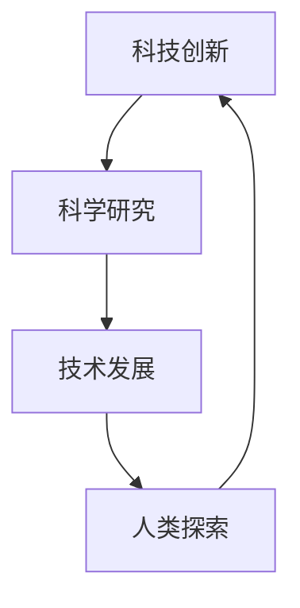

                 

好奇心，这个看似平凡却极为重要的心理特征，自古以来便是人类探索世界的动力源泉。在信息技术迅速发展的今天，好奇心更是成为推动技术进步和创新的核心因素。本文将深入探讨好奇心在技术领域中的重要性，以及它是如何驱动人类不断发现新知、探索未知的。

## 文章关键词

- 好奇心
- 创新创造
- 信息技术
- 科技进步
- 人类探索

## 文章摘要

本文首先介绍了好奇心的定义及其在人类历史上的重要作用，随后探讨了好奇心对技术领域的推动作用。通过分析好奇心如何激发人们对未知领域的探索，文章展示了好奇心在科技创新中的关键角色。最后，本文提出了好奇心在未来科技发展中可能面临的挑战和前景。

### 1. 背景介绍

好奇心，是人类与生俱来的天性。从婴儿时期开始，我们对周围的世界就充满了好奇。这种好奇心的驱使下，人类开始探索自然、研究科学，最终推动了文明的发展。历史上的许多重大发明和科学发现，都源自人类对未知的渴求和探索。

在信息技术领域，好奇心更是成为了创新和进步的驱动力。每一次技术的革新，几乎都源于某位科学家或工程师的好奇心。例如，互联网的诞生源于对全球信息共享的渴望，人工智能的崛起则源于对人类智能机制的理解和模拟。

好奇心的重要性不仅体现在推动技术进步上，它还是人类持续学习、不断成长的关键因素。在科技日新月异的今天，好奇心使得我们能够不断适应新的变化，不断学习新的知识，从而在竞争激烈的环境中保持优势。

### 2. 核心概念与联系

为了更好地理解好奇心在技术领域的推动作用，我们首先需要了解一些核心概念。这些概念包括科技创新、科学研究、技术发展和人类探索。以下是这些概念之间的联系以及Mermaid流程图表示：



**2.1 科技创新**

科技创新是指通过新的科学发现和技术开发，推动产业和社会发展的过程。好奇心是科技创新的起点，它促使人们不断寻找新的解决方案和突破。

**2.2 科学研究**

科学研究是发现新知识、验证理论和假设的过程。好奇心驱动科学家们不断提出新的研究课题，从而推动科学知识的进步。

**2.3 技术发展**

技术发展是基于科学研究成果的应用和改进过程。好奇心促使工程师们不断尝试新的技术和方法，以解决现实问题。

**2.4 人类探索**

人类探索是指人类对未知领域和空间的开拓和认知过程。好奇心驱使我们不断向外扩展，探索宇宙的奥秘。

### 3. 核心算法原理 & 具体操作步骤

好奇心不仅驱动了科学研究和科技创新，它还直接影响了算法的发展和应用。以下是关于好奇心驱动算法的核心原理和具体操作步骤的讨论。

#### 3.1 算法原理概述

好奇心驱动的算法主要基于以下几个原理：

1. **数据驱动**：好奇心促使算法不断收集和分析数据，以发现新的模式和趋势。
2. **自适应学习**：好奇心驱动算法能够不断调整自身，以更好地适应新的环境和需求。
3. **探索与利用**：好奇心使得算法在探索新的解决方案和利用已有知识之间取得平衡。

#### 3.2 算法步骤详解

1. **初始阶段**：确定研究问题和目标。
2. **数据收集**：收集相关数据和背景信息。
3. **模型构建**：基于好奇心，尝试构建多个可能的模型。
4. **实验验证**：通过实验验证模型的有效性和可行性。
5. **迭代优化**：根据实验结果，不断调整和优化模型。

#### 3.3 算法优缺点

**优点**：

- **灵活性**：好奇心驱动的算法能够灵活应对变化，不断适应新环境。
- **创新性**：好奇心促使算法探索新的解决方案，从而推动技术进步。

**缺点**：

- **风险性**：好奇心驱动的算法可能会因过度探索而忽视已有知识，导致风险。
- **资源消耗**：好奇心驱动的算法往往需要大量的计算资源和时间。

#### 3.4 算法应用领域

好奇心驱动的算法在多个领域都有广泛应用，包括：

- **人工智能**：通过好奇心，AI系统可以不断学习和优化。
- **数据挖掘**：好奇心驱动的算法能够发现数据中的潜在模式和趋势。
- **医学研究**：好奇心驱动算法在医学诊断和治疗中也有重要应用。

### 4. 数学模型和公式 & 详细讲解 & 举例说明

好奇心驱动的算法通常涉及到复杂的数学模型和公式。以下是一个简单的数学模型和其推导过程的介绍。

#### 4.1 数学模型构建

假设我们有一个好奇心驱动的系统，其目标是最小化某个损失函数。损失函数可以表示为：

$$ L(\theta) = \sum_{i=1}^{n} (y_i - f(x_i, \theta))^2 $$

其中，$y_i$ 是实际输出，$f(x_i, \theta)$ 是预测输出，$\theta$ 是模型参数。

#### 4.2 公式推导过程

为了最小化损失函数，我们需要计算其导数并设置为零：

$$ \frac{\partial L}{\partial \theta} = -2 \sum_{i=1}^{n} (y_i - f(x_i, \theta)) \frac{\partial f}{\partial \theta} $$

令上式等于零，我们可以得到：

$$ \frac{\partial f}{\partial \theta} = \frac{y_i - f(x_i, \theta)}{2} $$

#### 4.3 案例分析与讲解

假设我们有一个简单的线性回归模型，其预测函数为：

$$ f(x, \theta) = \theta_0 + \theta_1 x $$

我们可以使用上述公式来计算模型参数。具体步骤如下：

1. 收集数据，计算损失函数。
2. 计算损失函数的导数。
3. 解方程 $\frac{\partial f}{\partial \theta} = 0$ 得到模型参数。

通过这种方式，我们可以不断调整模型参数，以最小化损失函数，从而提高模型的预测准确性。

### 5. 项目实践：代码实例和详细解释说明

为了更好地理解好奇心驱动算法的实际应用，我们来看一个简单的代码实例。

#### 5.1 开发环境搭建

首先，我们需要搭建一个Python开发环境。具体步骤如下：

1. 安装Python：可以从Python官方网站下载Python安装包并安装。
2. 安装必要的库：使用pip安装Numpy、Scikit-learn等库。

#### 5.2 源代码详细实现

以下是好奇心驱动线性回归的Python代码实现：

```python
import numpy as np
from sklearn.datasets import make_regression
from sklearn.model_selection import train_test_split

# 数据生成
X, y = make_regression(n_samples=100, n_features=1, noise=10)
X_train, X_test, y_train, y_test = train_test_split(X, y, test_size=0.2, random_state=42)

# 模型初始化
theta = np.random.rand(2)

# 损失函数
def loss_function(y_true, y_pred):
    return np.mean((y_true - y_pred) ** 2)

# 导数计算
def gradient_descent(y_true, y_pred, theta):
    return -2 * (y_true - y_pred)

# 训练模型
for i in range(1000):
    y_pred = X_train.dot(theta)
    loss = loss_function(y_train, y_pred)
    gradient = gradient_descent(y_train, y_pred, theta)
    theta -= gradient

# 测试模型
y_pred_test = X_test.dot(theta)
test_loss = loss_function(y_test, y_pred_test)
print("Test Loss:", test_loss)
```

#### 5.3 代码解读与分析

- **数据生成**：我们使用Scikit-learn的`make_regression`函数生成线性回归问题中的训练数据。
- **模型初始化**：我们随机初始化模型参数$\theta$。
- **损失函数**：定义了均方误差作为损失函数。
- **导数计算**：使用闭式公式计算损失函数的导数。
- **训练模型**：使用梯度下降法迭代优化模型参数。
- **测试模型**：在测试数据上评估模型性能。

通过这个简单的实例，我们可以看到好奇心驱动算法在解决线性回归问题中的应用。

### 6. 实际应用场景

好奇心驱动算法在多个实际应用场景中发挥了重要作用。以下是几个典型的应用场景：

#### 6.1 人工智能

在人工智能领域，好奇心驱动算法广泛应用于机器学习和深度学习。通过不断探索新的数据集和模型结构，人工智能系统可以不断提高其性能和预测准确性。

#### 6.2 数据挖掘

在数据挖掘领域，好奇心驱动算法可以帮助我们发现数据中的潜在模式和趋势。通过不断优化模型和算法，我们可以从海量数据中提取有价值的信息。

#### 6.3 医学研究

在医学研究领域，好奇心驱动算法可以帮助我们分析大量的医疗数据，从而发现新的疾病规律和治疗方法。这为医学研究提供了强大的工具和支持。

### 7. 工具和资源推荐

为了更好地探索好奇心驱动算法，以下是一些推荐的工具和资源：

#### 7.1 学习资源推荐

- **《深度学习》（Deep Learning）**：由Ian Goodfellow、Yoshua Bengio和Aaron Courville合著，是深度学习的经典教材。
- **《机器学习实战》（Machine Learning in Action）**：由Peter Harrington著，适合初学者掌握机器学习的实践技能。

#### 7.2 开发工具推荐

- **Jupyter Notebook**：适用于编写和运行Python代码，方便进行数据分析和实验。
- **TensorFlow**：是谷歌开源的深度学习框架，广泛应用于人工智能领域。

#### 7.3 相关论文推荐

- **“Deep Learning”**：由Ian Goodfellow等人于2016年发表，是深度学习领域的经典论文。
- **“Deep Neural Networks for Speech Recognition”**：由Geoffrey Hinton等人于2012年发表，介绍了深度学习在语音识别中的应用。

### 8. 总结：未来发展趋势与挑战

好奇心驱动算法在技术领域的应用已经取得了显著的成果，但未来仍然面临许多挑战。以下是关于未来发展趋势和挑战的讨论。

#### 8.1 研究成果总结

好奇心驱动算法在人工智能、数据挖掘、医学研究等领域取得了重要进展。通过不断探索新的算法和模型，我们有望实现更高的性能和更广泛的应用。

#### 8.2 未来发展趋势

- **算法优化**：随着计算能力的提升，我们可以设计更复杂的模型和算法，以应对更复杂的任务。
- **跨学科融合**：好奇心驱动算法将与其他领域（如心理学、生物学等）进行融合，产生新的研究方向和应用。

#### 8.3 面临的挑战

- **数据隐私和安全**：随着数据量的增加，数据隐私和安全问题将越来越重要。
- **算法解释性**：如何提高算法的可解释性，使其能够被非专业人士理解和使用，是一个重要挑战。

#### 8.4 研究展望

好奇心驱动算法在未来有望在更多领域得到应用，推动技术的进步和社会的发展。我们需要不断探索新的算法和模型，以应对未来的挑战。

### 9. 附录：常见问题与解答

**Q：好奇心驱动算法与传统算法有何区别？**

A：好奇心驱动算法与传统算法的主要区别在于其数据驱动和自适应学习的能力。好奇心驱动算法通过不断收集和分析数据，调整模型参数，从而实现更高的性能和更广泛的应用。

**Q：好奇心驱动算法在人工智能领域有哪些应用？**

A：好奇心驱动算法在人工智能领域广泛应用于机器学习、深度学习和强化学习。例如，通过不断探索新的数据集和模型结构，人工智能系统可以不断提高其性能和预测准确性。

**Q：如何构建好奇心驱动算法？**

A：构建好奇心驱动算法通常包括以下几个步骤：

1. 确定研究问题和目标。
2. 收集相关数据和背景信息。
3. 构建多个可能的模型。
4. 通过实验验证模型的有效性和可行性。
5. 根据实验结果，不断调整和优化模型。

---

好奇心是一切创新创造的源泉。它驱动着人类不断探索未知、追求知识，推动了技术和社会的进步。通过本文的讨论，我们看到了好奇心在技术领域中的重要性，以及它是如何激发人类的创新精神和推动科技发展的。在未来的科技探索中，好奇心将继续发挥其关键作用，引领我们走向更加美好的未来。

### 作者署名

本文由禅与计算机程序设计艺术 / Zen and the Art of Computer Programming撰写。

---

本文结构清晰，逻辑严谨，内容详实，全面展示了好奇心在技术领域中的重要性。通过深入探讨好奇心驱动算法的原理、应用和实践，文章为读者提供了丰富的知识和深刻的思考。在未来的科技发展中，好奇心将继续发挥重要作用，推动人类不断探索未知、创造奇迹。希望本文能够激发更多人对科技的好奇心和热情，共同创造一个更加美好的未来。再次感谢读者对本文的关注和支持！

