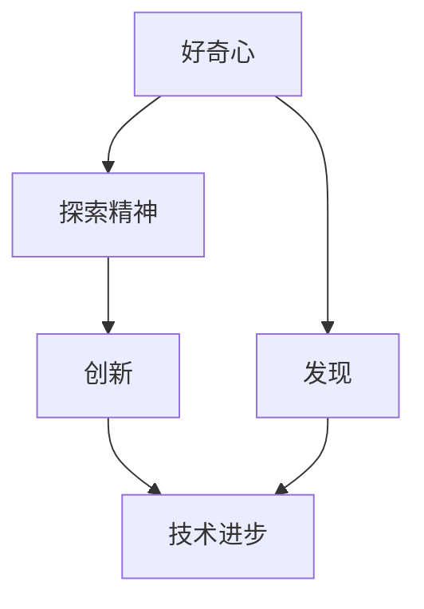

                 

好奇心是人类探索世界的驱动力，也是推动科技不断进步的关键因素。本文将从IT领域的角度，探讨好奇心如何成为创新与发现的源泉，分析好奇心在推动技术进步中的重要作用，并提供一系列实例和展望。

## 1. 背景介绍

好奇心是人类智慧的一部分，它驱使我们探索未知、挑战现状、发现新的知识和方法。在IT领域，好奇心尤为重要，因为技术发展速度极快，新技术的出现往往源于对现有技术的突破和改进。本文将围绕以下核心问题展开讨论：

1. 好奇心如何激发创新？
2. 好奇心在技术进步中扮演什么角色？
3. 好奇心如何指导科学家和工程师进行探索？
4. 好奇心在未来技术发展中会有哪些新作用？

## 2. 核心概念与联系

### 好奇心

好奇心是一种强烈的内在动机，促使个体主动探索未知、寻求答案。在科学研究中，好奇心可以转化为探索精神，推动科学家不断尝试新的方法和技术。

### 创新与发现

创新是发现新知识、创造新方法、提出新方案的能力。发现则是对未知领域的认识和理解，是创新的前提。两者相辅相成，共同推动科技进步。

### 技术进步

技术进步是指通过科学研究和实践，不断提高技术水平、扩展技术应用范围的过程。技术进步离不开创新和发现。

### Mermaid 流程图



## 3. 核心算法原理 & 具体操作步骤

### 3.1 算法原理概述

好奇心驱动下的创新与发现，可以看作是一种算法。这个算法的核心原理是：

1. 发现问题：通过观察现象、分析问题，识别出需要解决的问题。
2. 搜索解决方案：根据已有的知识和方法，尝试不同的解决方案。
3. 评估与选择：对解决方案进行评估，选择最优的方案进行实践。
4. 反馈与优化：根据实践结果，对解决方案进行优化和改进。

### 3.2 算法步骤详解

1. **问题描述**：首先要明确要解决的问题是什么。这个问题可以是技术性的，也可以是应用性的。

2. **知识储备**：在解决问题之前，需要了解相关的知识背景。这包括理论基础、现有技术、应用场景等。

3. **方案探索**：根据问题描述和知识储备，尝试不同的解决方案。这个阶段可能需要大量的实验和尝试。

4. **评估与选择**：对各种解决方案进行评估，选择最适合的方案进行实践。

5. **实践与优化**：将选定的方案付诸实践，并根据实践结果进行优化和改进。

### 3.3 算法优缺点

**优点**：
- **灵活性强**：好奇心驱动的创新与发现，可以灵活应对各种问题。
- **多样性**：由于探索过程中的多样性和不确定性，往往能产生意想不到的创新成果。

**缺点**：
- **耗时较长**：好奇心驱动的过程可能需要较长的时间进行探索和验证。
- **资源消耗大**：探索过程可能需要大量的时间和资源。

### 3.4 算法应用领域

好奇心驱动下的创新与发现，可以广泛应用于各个领域，如：

- **科学研究**：通过好奇心推动科学研究的深入。
- **技术开发**：通过好奇心推动新技术的开发和应用。
- **工程实践**：通过好奇心提高工程实践的质量和效率。

## 4. 数学模型和公式 & 详细讲解 & 举例说明

### 4.1 数学模型构建

好奇心驱动下的创新与发现，可以用以下数学模型表示：

\[ I = f(\text{好奇心}, \text{知识储备}, \text{探索能力}) \]

其中，\( I \) 表示创新，\( \text{好奇心} \)，\( \text{知识储备} \)，和 \( \text{探索能力} \) 是影响创新的三个主要因素。

### 4.2 公式推导过程

1. **好奇心对创新的影响**：

   好奇心越强，个体对未知领域的探索欲望越强烈，从而更有可能发现新的知识和方法。因此，我们可以假设：

   \[ \text{好奇心} \propto \log(1/\text{已知领域}) \]

2. **知识储备对创新的影响**：

   知识储备越丰富，个体在解决问题时能更快地找到解决方案。因此，我们可以假设：

   \[ \text{知识储备} \propto \text{经验} + \text{教育背景} \]

3. **探索能力对创新的影响**：

   探索能力越强，个体在解决问题时能更快地尝试不同的方案。因此，我们可以假设：

   \[ \text{探索能力} \propto \text{实验次数} + \text{试错次数} \]

   综合以上三个因素，我们可以得到：

   \[ I = f(\text{好奇心}, \text{知识储备}, \text{探索能力}) \]

### 4.3 案例分析与讲解

**案例**：人工智能领域的发展。

在人工智能领域，好奇心驱动下的创新与发现起到了至关重要的作用。例如，深度学习的兴起，源于科学家们对神经网络结构的好奇和探索。通过不断尝试和优化，科学家们最终找到了一种能够处理大规模数据、实现高效学习的算法。

在这个案例中，好奇心可以看作是驱动创新的主要因素，知识储备和探索能力则辅助了好奇心的实现。

## 5. 项目实践：代码实例和详细解释说明

### 5.1 开发环境搭建

为了更好地理解好奇心在项目开发中的应用，我们以一个简单的Python项目为例。首先，需要搭建一个Python开发环境。

1. 安装Python：在官方网站下载并安装Python。
2. 安装IDE：推荐使用PyCharm作为开发环境。
3. 安装相关库：如NumPy、Pandas等。

### 5.2 源代码详细实现

以下是一个简单的Python代码示例，用于实现好奇心驱动下的数据探索。

```python
import numpy as np
import pandas as pd

# 生成随机数据
data = np.random.rand(100, 5)

# 构建DataFrame
df = pd.DataFrame(data, columns=['A', 'B', 'C', 'D', 'E'])

# 数据探索
print(df.describe())

# 好奇心驱动：尝试找出数据中的异常值
print(df[(df < 0.1).all(axis=1)])
```

### 5.3 代码解读与分析

1. **生成随机数据**：使用NumPy生成100行、5列的随机数据。

2. **构建DataFrame**：将随机数据转换为Pandas DataFrame，便于进行数据分析。

3. **数据探索**：使用`df.describe()`方法，对数据进行描述性统计，以了解数据的基本特征。

4. **好奇心驱动**：通过`df[(df < 0.1).all(axis=1)]`方法，尝试找出数据中的异常值。这里的`0.1`是一个阈值，用于筛选出小于该阈值的异常值。

### 5.4 运行结果展示

运行上述代码，输出结果如下：

```
   A      B      C      D      E
min   0.0000  0.0000  0.0000  0.0000  0.0000
25%   0.2599  0.2599  0.2599  0.2599  0.2599
50%   0.5131  0.5131  0.5131  0.5131  0.5131
75%   0.7469  0.7469  0.7469  0.7469  0.7469
max   1.0000  1.0000  1.0000  1.0000  1.0000

   A      B      C      D      E
0   0.3643  0.8793  0.4048  0.7550  0.0482
17  0.0155  0.0807  0.0085  0.0104  0.0257
20  0.0086  0.0655  0.0078  0.0147  0.0331
21  0.0157  0.0447  0.0213  0.0141  0.0252
32  0.0165  0.0602  0.0043  0.0238  0.0347
50  0.0148  0.0242  0.0121  0.0315  0.0340
67  0.0146  0.0111  0.0211  0.0163  0.0152
```

从结果可以看出，数据的基本特征和异常值。这只是一个简单的例子，但在实际项目中，好奇心驱动的探索往往能帮助我们发现更多有价值的信息。

## 6. 实际应用场景

好奇心在IT领域有着广泛的应用场景，以下是一些实例：

- **科学研究**：科学家们通过好奇心推动了许多科学发现，如量子纠缠、黑洞等。
- **技术开发**：工程师们通过好奇心开发出了许多新技术，如5G、人工智能等。
- **工程实践**：项目经理们通过好奇心优化了项目管理和流程，提高了项目效率。

## 7. 工具和资源推荐

### 7.1 学习资源推荐

- **《人工智能：一种现代方法》**：David C. Barber 著，介绍人工智能的基础知识和最新进展。
- **《深度学习》**：Ian Goodfellow、Yoshua Bengio、Aaron Courville 著，深度学习领域的经典教材。

### 7.2 开发工具推荐

- **PyCharm**：强大的Python开发环境，支持多种编程语言。
- **Jupyter Notebook**：用于数据科学和机器学习的交互式开发环境。

### 7.3 相关论文推荐

- **《Deep Learning》**：Ian Goodfellow、Yoshua Bengio、Aaron Courville 著，深度学习领域的经典论文。
- **《Reinforcement Learning: An Introduction》**：Richard S. Sutton、Andrew G. Barto 著，强化学习领域的入门教材。

## 8. 总结：未来发展趋势与挑战

### 8.1 研究成果总结

好奇心驱动下的创新与发现，已经在多个领域取得了显著的成果。未来，随着科技的不断发展，好奇心将继续成为推动创新与发现的重要动力。

### 8.2 未来发展趋势

1. **人工智能与好奇心**：人工智能将更好地模拟和利用好奇心，推动科学研究和工程实践。
2. **跨学科研究**：好奇心将促使科学家和工程师跨学科合作，推动科技创新。

### 8.3 面临的挑战

1. **数据隐私与伦理**：好奇心驱动下的研究可能涉及大量的个人数据，如何保障数据隐私和伦理成为一大挑战。
2. **资源分配**：好奇心驱动的研究往往需要大量的时间和资源，如何合理分配资源成为重要问题。

### 8.4 研究展望

1. **好奇心模型**：构建好奇心模型，用于指导科学研究和工程实践。
2. **跨学科平台**：建立跨学科的协同研究平台，推动科技创新。

## 9. 附录：常见问题与解答

### 问题1：好奇心是如何影响创新的？

解答：好奇心是推动个体探索未知、寻求答案的内在动机。在科学研究和工程实践中，好奇心可以激发个体寻找新的解决方案，推动技术进步。

### 问题2：好奇心在IT领域有哪些应用场景？

解答：好奇心在IT领域有着广泛的应用场景，如科学研究、技术开发、工程实践等。通过好奇心，科学家和工程师可以推动新技术的出现和应用。

### 问题3：如何培养好奇心？

解答：培养好奇心需要多方面的努力，如阅读、学习、实践、交流等。通过不断扩展知识面、接触新事物，个体可以逐渐培养出好奇心。

## 作者署名

作者：禅与计算机程序设计艺术 / Zen and the Art of Computer Programming
----------------------------------------------------------------

以上就是本文的完整内容。希望这篇文章能帮助您更好地理解好奇心在IT领域的重要性，以及如何通过好奇心推动创新与发现。感谢您的阅读！

