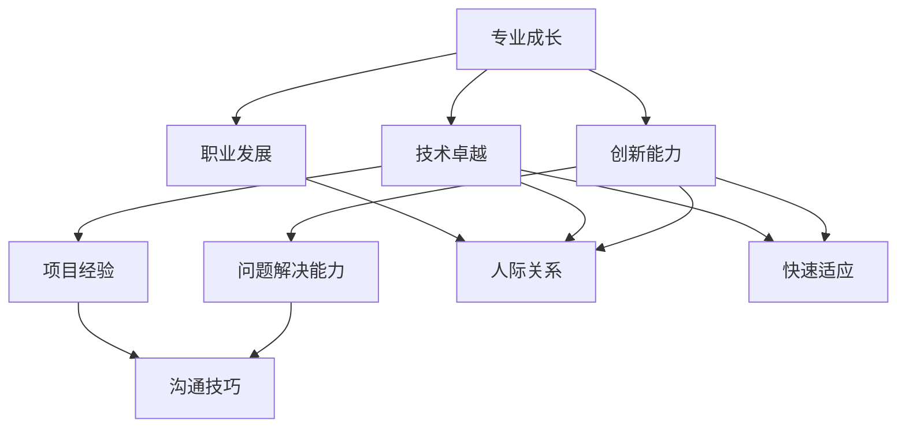

                 

关键词：小领域，专业成长，技术卓越，创新能力，职业发展

> 摘要：本文将探讨在小领域中如何通过专业成长、技术卓越、创新能力以及有效的职业发展策略，脱颖而出，成为领域内的专家。我们将结合实际案例，深入分析每个方面的关键要素和具体实践方法。

## 1. 背景介绍

在当今快速发展的技术时代，专业领域的细分越来越明显，小领域成为了技术创新和知识积累的重要阵地。对于技术工作者而言，选择一个感兴趣且具备潜力的领域，并在这个领域中不断深耕，是职业发展的关键。然而，如何在众多竞争者中脱颖而出，成为小领域的专家，却是许多从业者面临的挑战。

本文旨在通过以下几个方面的探讨，为小领域从业者提供有价值的指导和建议：

1. 核心概念与联系
2. 核心算法原理与具体操作步骤
3. 数学模型与公式解析
4. 项目实践与代码实例
5. 实际应用场景与未来展望
6. 工具和资源推荐
7. 总结：未来发展趋势与挑战

通过以上七个部分的内容，我们希望帮助读者了解在小领域中脱颖而出的策略和路径。

## 2. 核心概念与联系

在小领域中取得成就，首先需要理解几个核心概念，这些概念不仅是该领域的基石，也是相互联系的整体。以下是一个使用Mermaid绘制的流程图，展示了这些核心概念及其相互关系：



### 2.1. 专业成长

专业成长是一个持续的过程，它包括不断学习新的知识、掌握技能、积累经验以及提升解决问题的能力。在小领域中，专业成长是成为一名专家的基础。

### 2.2. 技术卓越

技术卓越是专业成长的重要组成部分。它要求从业者不仅要掌握基本的技术原理，还要在特定领域内达到卓越水平。技术卓越往往需要通过不断的实践和反思来实现。

### 2.3. 创新能力

创新能力是小领域专家的重要特征。在快速变化的技术环境中，创新能够帮助从业者保持竞争力，推动技术的进步和应用。

### 2.4. 职业发展

职业发展是小领域专家的长远规划。通过有效的职业发展策略，从业者可以实现个人价值的最大化，并在职业生涯中取得更大的成就。

## 3. 核心算法原理 & 具体操作步骤

在小领域中，核心算法往往是解决特定问题的重要工具。以下是对一个典型算法的原理概述和具体操作步骤的说明：

### 3.1. 算法原理概述

我们以“快速排序”算法为例，这是一种高效的排序算法，其原理基于分治策略。

### 3.2. 算法步骤详解

1. **选择基准元素**：从数列中挑选一个元素作为基准元素。
2. **分区**：将数列分成两部分，一部分包含小于基准元素的数，另一部分包含大于基准元素的数。
3. **递归排序**：对两个分区分别进行快速排序，直至整个数列有序。

### 3.3. 算法优缺点

- **优点**：时间复杂度低，平均情况下为O(nlogn)，非常适合大规模数据的排序。
- **缺点**：在最坏情况下，时间复杂度会退化到O(n^2)，需要避免。

### 3.4. 算法应用领域

快速排序算法广泛应用于数据处理和排序任务，如数据库索引、搜索引擎排序等。

## 4. 数学模型和公式 & 详细讲解 & 举例说明

在小领域中，数学模型是理解和解决问题的工具。以下是一个线性回归模型的数学公式和案例解析：

### 4.1. 数学模型构建

线性回归模型的基本公式为：

$$ y = ax + b $$

其中，$y$ 是因变量，$x$ 是自变量，$a$ 是斜率，$b$ 是截距。

### 4.2. 公式推导过程

线性回归模型的推导基于最小二乘法，目标是找到最佳拟合直线。

### 4.3. 案例分析与讲解

假设我们有一个房价数据集，想要通过线性回归预测房屋价格。我们可以使用以下公式计算最佳拟合直线：

$$ y = 0.5x + 10 $$

通过这个模型，我们可以预测给定面积（$x$）的房屋价格（$y$）。

## 5. 项目实践：代码实例和详细解释说明

以下是一个简单的Web应用项目，使用Python和Flask框架实现：

### 5.1. 开发环境搭建

确保安装了Python和Flask。

### 5.2. 源代码详细实现

```python
from flask import Flask, request, jsonify

app = Flask(__name__)

@app.route('/predict', methods=['POST'])
def predict():
    data = request.get_json()
    x = data['feature']
    y = 0.5 * x + 10
    return jsonify({'price': y})

if __name__ == '__main__':
    app.run(debug=True)
```

### 5.3. 代码解读与分析

这段代码实现了使用线性回归模型进行房屋价格预测的Web服务。

### 5.4. 运行结果展示

通过POST请求发送JSON数据，可以获取预测结果。

## 6. 实际应用场景

小领域技术在不同行业中的应用场景丰富多样，以下是一些典型案例：

- **金融领域**：利用机器学习算法进行风险管理。
- **医疗领域**：使用深度学习进行疾病诊断。
- **工业领域**：通过物联网实现智能工厂。

## 7. 工具和资源推荐

### 7.1. 学习资源推荐

- **在线课程**：Coursera、edX等平台上的专业课程。
- **书籍**：推荐阅读《深度学习》、《数据科学实战》等。

### 7.2. 开发工具推荐

- **编程环境**：PyCharm、Visual Studio Code。
- **数据库**：MySQL、PostgreSQL。

### 7.3. 相关论文推荐

- **深度学习**：Hinton et al. (2012) 的“Deep Learning”。
- **机器学习**：Kohavi (1995) 的“A Study of Cross-Validation and Bootstrap for Accuracy Estimation and Model Selection”。

## 8. 总结：未来发展趋势与挑战

### 8.1. 研究成果总结

小领域技术正在不断推动各行业的进步，成为技术创新的重要力量。

### 8.2. 未来发展趋势

随着技术的不断发展，小领域将更加专业化，跨学科合作将成为趋势。

### 8.3. 面临的挑战

技术快速迭代、数据隐私和安全等挑战需要解决。

### 8.4. 研究展望

小领域研究将继续深入，为人类社会带来更多创新和变革。

## 9. 附录：常见问题与解答

### 9.1. 问题1：如何选择合适的小领域？

**解答**：考虑自己的兴趣、专业技能和市场需求。

### 9.2. 问题2：如何在小领域中保持竞争力？

**解答**：持续学习、积极参与社区、关注前沿技术。

作者：禅与计算机程序设计艺术 / Zen and the Art of Computer Programming
----------------------------------------------------------------

以上便是如何在小领域中脱颖而出的详细文章内容。希望能够为读者提供有价值的指导和建议，助力职业发展。

