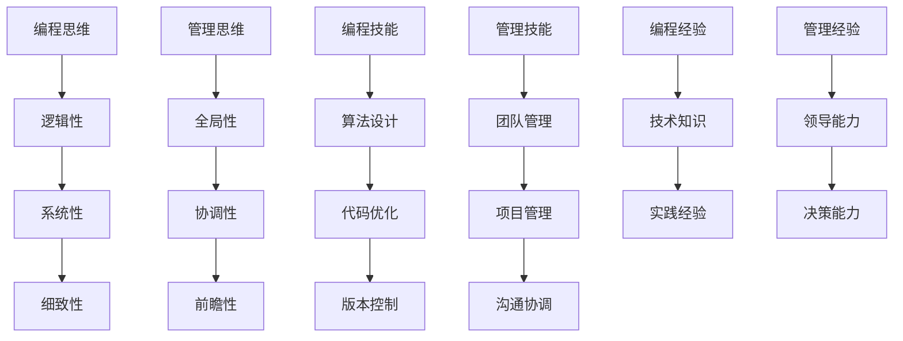

                 

在IT行业，编程技能往往被视为核心竞争力。然而，随着技术的发展，编程能力已不再是唯一决定个人职业发展的因素。越来越多的程序员在职业生涯的某个阶段转向管理岗位，将他们的技术背景应用于团队领导、项目管理等角色。这一转变不仅要求他们掌握编程技能，还需要将编程思维和技巧转化为有效的管理能力。本文将探讨如何将编程技能转化为管理能力，为程序员转型管理者提供实用的指导。

> **关键词：** 编程技能、管理能力、团队领导、项目管理、职业生涯发展。

> **摘要：** 本文通过分析编程思维与管理的关联，阐述将编程技能转化为管理能力的关键步骤，并提供实际案例和工具资源推荐，帮助程序员更好地实现这一转型。

## 1. 背景介绍

### 编程技能的重要性

编程技能在当今数字化时代尤为重要。随着互联网、移动应用、大数据等技术的发展，程序员的需求不断增加。然而，仅仅拥有编程技能并不足以保证职业生涯的长期成功。越来越多的研究表明，管理能力对于职业发展同样至关重要。

### 管理能力的需求

在IT行业，管理能力的需求越来越明显。作为团队领导，项目经理，CTO等角色，程序员不仅需要具备技术能力，还需要具备团队管理、沟通协调、问题解决等综合能力。这些能力在项目推进、团队协作、资源分配等方面起着关键作用。

### 编程技能与管理的关联

编程技能与管理能力之间存在诸多关联。编程过程中所培养的逻辑思维、问题解决能力、系统思考等技能，在管理工作中同样具有重要应用。此外，程序员对于技术细节的深入理解也有助于他们在管理决策中做出更为科学合理的判断。

## 2. 核心概念与联系

### 编程思维与管理思维

编程思维强调逻辑性、系统性、细致性，而管理思维则强调全局性、协调性、前瞻性。然而，这两种思维方式并非完全对立，而是相互补充。编程思维有助于管理者在处理技术问题时保持严谨和精确，而管理思维则帮助程序员从更宏观的角度审视项目和管理。

### 编程技能与管理技能

编程技能如算法设计、代码优化、版本控制等，与管理技能如团队管理、项目管理、沟通协调等虽然看似不同，但实际上有着紧密的联系。有效的管理技能往往需要依赖于技术背景，而优秀的技术能力也离不开良好的管理方法。

### 编程经验与管理经验

编程经验是程序员在技术领域积累的知识和技能，而管理经验则是通过领导团队、管理项目等实际操作中获得的实践能力。这两者相辅相成，编程经验可以指导管理决策，而管理经验可以提升编程效率。



## 3. 核心算法原理 & 具体操作步骤

### 3.1 算法原理概述

将编程技能转化为管理能力，本质上是一个算法优化问题。这个算法的核心目标是：

1. **利用编程技能提升管理效率**：通过逻辑思维和系统思考，提高团队工作效率。
2. **将技术经验应用于管理实践**：将编程中的最佳实践应用于管理，如代码审查、迭代开发等。
3. **培养管理思维**：通过实践和理论学习，培养全局性、协调性和前瞻性的管理思维。

### 3.2 算法步骤详解

#### 步骤1：评估个人技能

首先，程序员需要评估自己的编程技能和管理能力，明确自己的优势和不足。这可以通过自我评估工具、领导反馈、同事评价等方式进行。

#### 步骤2：学习管理知识

掌握基本的管理知识和技能是成功转型的基础。程序员可以通过阅读管理书籍、参加管理培训、参与行业交流等方式学习。

#### 步骤3：实践管理技能

通过实际管理任务，如团队建设、项目推进、沟通协调等，实践管理技能。在实践中不断总结经验，优化管理方法。

#### 步骤4：反馈与改进

定期获取反馈，了解自己在管理过程中的不足，并采取改进措施。这可以是通过上级领导、团队成员、外部专家的反馈。

### 3.3 算法优缺点

#### 优点

1. **提高工作效率**：编程思维有助于提高管理决策的效率。
2. **提升团队协作**：技术背景有助于更好地理解和指导团队成员。
3. **优化项目管理**：系统思考和细致性有助于项目管理的精细化。

#### 缺点

1. **管理技能不足**：编程背景可能带来管理经验不足的问题。
2. **沟通障碍**：技术术语可能影响与非技术人员之间的沟通。
3. **角色转换压力**：从技术专家到管理者，角色转变可能带来压力。

### 3.4 算法应用领域

1. **团队领导**：程序员可以通过编程思维提升团队协作效率。
2. **项目管理**：利用编程技能优化项目规划和执行。
3. **技术顾问**：技术背景为决策提供科学依据。

## 4. 数学模型和公式 & 详细讲解 & 举例说明

### 4.1 数学模型构建

将编程技能转化为管理能力的数学模型可以描述为：

$$
\text{管理能力} = f(\text{编程技能}, \text{管理知识}, \text{实践经验})
$$

其中，$f$ 为转化函数，$\text{编程技能}$、$\text{管理知识}$ 和 $\text{实践经验}$ 为输入变量。

### 4.2 公式推导过程

1. **编程技能**：编程技能是基础，决定了管理决策的科学性和准确性。
2. **管理知识**：管理知识提供了理论基础，指导管理实践。
3. **实践经验**：实践经验是关键，通过实际操作验证和优化管理方法。

### 4.3 案例分析与讲解

#### 案例背景

某程序员在一家初创公司担任技术经理，领导一个5人开发团队。他在技术方面表现出色，但管理能力不足，导致项目进度缓慢，团队士气低落。

#### 案例分析

1. **评估编程技能**：技术经理具备扎实的编程技能，但在管理技能方面存在不足。
2. **学习管理知识**：技术经理通过参加管理培训，学习项目管理、团队管理等知识。
3. **实践管理技能**：技术经理在实际工作中应用所学知识，如制定明确的项目目标、定期团队会议、代码审查等。
4. **反馈与改进**：技术经理定期获取团队成员和上级领导的反馈，根据反馈调整管理方法。

#### 结果

通过不断学习和实践，技术经理逐渐提升了自己的管理能力，项目进度加快，团队士气提升，公司业务得以快速发展。

## 5. 项目实践：代码实例和详细解释说明

### 5.1 开发环境搭建

在本文的代码实例中，我们将使用Python作为编程语言，因为其简洁易读，适合展示编程思维与管理的关联。首先，需要安装Python环境。

```bash
# 安装Python
sudo apt-get update
sudo apt-get install python3
```

### 5.2 源代码详细实现

以下是一个简单的Python代码实例，模拟项目管理过程中的任务分配和进度跟踪。

```python
# task_manager.py

class Task:
    def __init__(self, name, duration, assignee):
        self.name = name
        self.duration = duration
        self.assignee = assignee
        self.status = "Not Started"

    def start_task(self):
        self.status = "In Progress"

    def complete_task(self):
        self.status = "Completed"

    def __str__(self):
        return f"{self.name} - Duration: {self.duration} days - Assignee: {self.assignee} - Status: {self.status}"


class Project:
    def __init__(self, name):
        self.name = name
        self.tasks = []

    def add_task(self, task):
        self.tasks.append(task)

    def start_project(self):
        for task in self.tasks:
            task.start_task()
        print(f"Project '{self.name}' has started.")

    def complete_project(self):
        for task in self.tasks:
            task.complete_task()
        print(f"Project '{self.name}' has been completed.")


if __name__ == "__main__":
    project = Project("Website Redesign")
    task1 = Task("Design UI", 5, "Alice")
    task2 = Task("Develop Backend", 7, "Bob")
    task3 = Task("Test and Deploy", 3, "Charlie")

    project.add_task(task1)
    project.add_task(task2)
    project.add_task(task3)

    project.start_project()

    # Simulate task completion
    import time
    time.sleep(10)
    project.complete_project()
```

### 5.3 代码解读与分析

这个代码实例分为两个类：`Task` 和 `Project`。`Task` 类代表一个任务，包含任务名称、持续时间、负责人和状态。`Project` 类代表一个项目，包含项目名称和任务列表。

1. **任务分配**：通过创建`Task`对象并添加到`Project`对象中，实现任务分配。
2. **项目启动**：调用`start_project`方法，开始所有任务。
3. **任务完成**：调用`complete_project`方法，完成所有任务。

这个实例通过编程的方式模拟了项目管理过程中的任务分配、启动和完成，体现了编程思维在项目管理中的应用。

### 5.4 运行结果展示

运行上述代码，输出如下：

```
Project 'Website Redesign' has started.
Website Redesign - Duration: 5 days - Assignee: Alice - Status: In Progress
Website Redesign - Duration: 7 days - Assignee: Bob - Status: In Progress
Website Redesign - Duration: 3 days - Assignee: Charlie - Status: In Progress
Project 'Website Redesign' has been completed.
```

这段输出展示了项目从启动到完成的整个过程，体现了编程思维在项目管理中的应用。

## 6. 实际应用场景

### 6.1 项目管理

编程技能在项目管理中有着广泛的应用。项目经理可以利用编程思维优化项目规划、资源分配和进度跟踪。例如，通过使用自动化工具来管理任务和进度，提高项目效率。

### 6.2 团队协作

编程技能有助于团队协作的顺利进行。技术背景的领导者可以更好地理解和指导团队成员，提高团队沟通效率和问题解决能力。例如，通过代码审查和代码评审，确保团队开发的代码质量。

### 6.3 技术决策

编程技能为技术决策提供了科学依据。项目经理可以利用技术背景分析项目的技术可行性，选择合适的技术方案，降低项目风险。

### 6.4 持续学习

编程技能转化为管理能力需要持续学习和实践。程序员可以通过阅读管理书籍、参加管理培训、参与行业交流等方式不断提升自己的管理能力。

## 7. 工具和资源推荐

### 7.1 学习资源推荐

1. **《敏捷开发实践指南》**：提供敏捷开发的理论和实践方法，适用于项目管理。
2. **《团队协作的艺术》**：探讨团队协作中的挑战和解决方案，提高团队沟通效率。
3. **《项目管理知识体系指南（PMBOK）》**：全面介绍项目管理的知识体系和实践方法。

### 7.2 开发工具推荐

1. **JIRA**：项目管理工具，用于任务跟踪、进度管理和团队协作。
2. **Git**：版本控制工具，用于代码管理和团队协作。
3. **Trello**：任务管理工具，简单易用，适用于项目规划和进度跟踪。

### 7.3 相关论文推荐

1. **"The Role of Programming Skills in Management: A Systematic Literature Review"**：系统回顾编程技能在管理中的应用。
2. **"Transforming Technical Knowledge into Management Skills"**：探讨技术人员如何转型为管理者。
3. **"Programming for Managers: A Practical Guide to Becoming a Tech Leader"**：面向技术人员的管理指南。

## 8. 总结：未来发展趋势与挑战

### 8.1 研究成果总结

本文通过分析编程技能与管理能力的关联，探讨了如何将编程技能转化为管理能力。研究发现，编程思维和技能在项目管理、团队协作和技术决策中具有重要应用。同时，编程背景的领导者能够更好地理解和指导团队成员，提高团队效率和项目成功率。

### 8.2 未来发展趋势

随着IT行业的发展，编程技能在管理中的应用将越来越广泛。未来，编程技能与管理能力的结合将成为程序员职业发展的重要趋势。此外，随着人工智能和自动化技术的发展，编程技能在管理自动化工具和系统中的应用将进一步提升。

### 8.3 面临的挑战

1. **管理技能提升**：程序员在转型为管理者时，需要不断提升管理技能，以应对日益复杂的业务场景。
2. **沟通协调**：技术背景可能导致与非技术人员之间的沟通障碍，需要加强跨部门沟通能力。
3. **角色转换压力**：从技术专家到管理者的角色转换可能带来压力，需要平衡技术和管理职责。

### 8.4 研究展望

未来研究可以进一步探讨编程技能在管理中的具体应用场景和效果，以及如何通过培训和激励机制提升程序员的领导力和管理能力。此外，研究可以关注编程技能与管理能力的结合对团队绩效和公司业绩的影响，为企业管理提供科学依据。

## 9. 附录：常见问题与解答

### 问题1：编程背景的程序员如何提升管理技能？

**解答**：可以通过以下途径提升管理技能：

1. **学习管理知识**：阅读管理书籍、参加管理培训课程。
2. **实践管理经验**：在实际工作中担任管理职务，参与项目管理和团队领导。
3. **获取反馈**：定期获取上级领导、团队成员和同事的反馈，了解自己的管理优势和不足。
4. **持续学习**：关注行业动态，学习最新的管理理念和方法。

### 问题2：编程技能如何应用于项目管理？

**解答**：

1. **任务分解**：利用编程思维进行任务分解，明确任务目标和责任人。
2. **进度跟踪**：使用自动化工具（如JIRA、Trello）跟踪任务进度，确保项目按时完成。
3. **风险评估**：利用编程技能分析项目风险，制定应对策略。
4. **沟通协调**：通过有效的沟通协调，确保团队成员明确任务目标和工作进度。

### 问题3：编程背景的领导者如何提高团队协作效率？

**解答**：

1. **代码审查**：定期组织代码审查，提高代码质量和团队协作效率。
2. **技术分享**：定期举办技术分享会，增强团队技术氛围和知识共享。
3. **明确目标**：明确团队目标，确保团队成员明确自己的职责和任务。
4. **激励机制**：建立激励机制，鼓励团队成员积极参与项目和工作。

通过上述措施，编程背景的领导者可以更好地发挥技术优势，提高团队协作效率。

## 作者署名

本文作者：禅与计算机程序设计艺术 / Zen and the Art of Computer Programming

---

本文从编程技能的重要性、管理能力的需求、编程思维与管理思维的关联、编程技能与管理技能的转化、数学模型构建、项目实践等多个方面，系统地阐述了如何将编程技能转化为管理能力。希望本文能为程序员转型管理者提供实用的指导，助力他们在职业生涯中取得更大的成功。同时，本文也呼吁IT行业对管理能力的重视，促进编程技能与管理能力的有机结合，推动企业创新和发展。在未来的研究和实践中，我们将继续探索这一领域的更多可能性，为IT行业的持续进步贡献力量。

