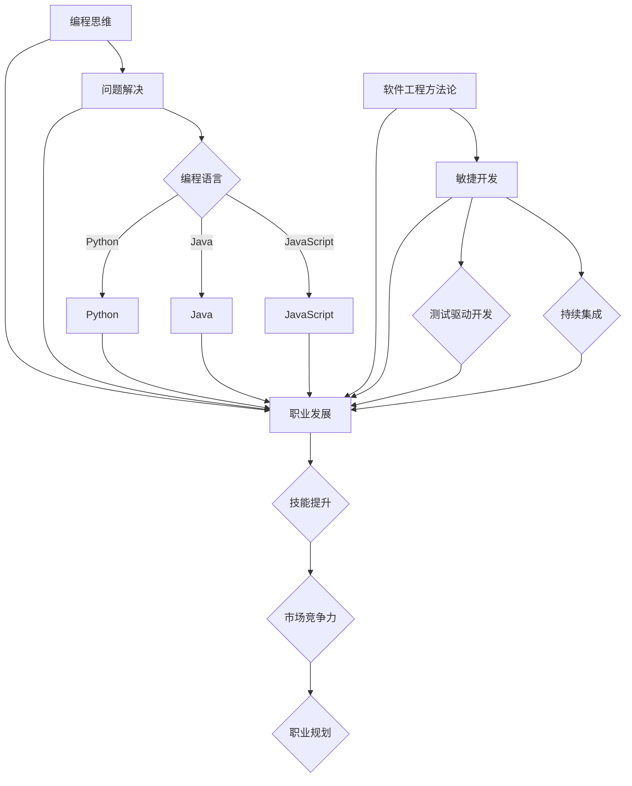

                 

### 背景介绍

编程已经不再是单纯的技能，而是一种改变世界的力量。随着信息技术的飞速发展，编程不仅仅是IT行业的核心竞争力，它已经渗透到了社会的方方面面，从医疗到金融，从娱乐到教育，编程正在重塑我们的生活方式。在这样的背景下，将编程热情转化为长期事业，不仅能为个人带来丰厚回报，更能为社会创造价值。

然而，将编程热情转化为长期事业并非易事。首先，编程行业竞争激烈，需要不断更新知识和技能。其次，编程工作常常伴随着高压和挑战，如何保持长久的热情和动力是一个重要课题。最后，职业规划和个人成长同样重要，需要明确目标并持续努力。

本文旨在帮助那些对编程充满热情的读者，将这份热情转化为长期而稳定的职业。我们将探讨如何培养和维持编程兴趣，掌握关键技能，规划职业发展路径，以及如何在职业生涯中持续成长。希望通过本文，您能够找到属于自己的编程之路，实现个人价值和社会贡献。

### 核心概念与联系

在将编程热情转化为长期事业的过程中，有几个核心概念和联系需要理解。首先是“编程思维”，它不仅仅涉及编写代码，更是一种解决问题的系统性方法。其次是“编程语言”，了解不同编程语言的特点和应用场景对于职业发展至关重要。另外，软件工程方法论，如敏捷开发、测试驱动开发等，也是确保编程事业长期稳定发展的关键。

以下是一个用Mermaid绘制的流程图，展示这些核心概念之间的联系：



通过这个流程图，我们可以清晰地看到编程思维如何引导我们选择合适的编程语言，应用软件工程方法论，并最终实现职业发展的目标。

### 核心算法原理 & 具体操作步骤

在编程领域，算法是解决问题的核心。本文将介绍一种常用的排序算法——快速排序（Quick Sort），并详细解释其原理和操作步骤。

#### 3.1 算法原理概述

快速排序是一种分而治之的算法，其基本思想是通过一趟排序将待排序的记录分割成独立的两部分，其中一部分记录的关键字均比另一部分的关键字小，然后分别对这两部分记录继续进行排序，以达到整个序列有序。

#### 3.2 算法步骤详解

快速排序的具体步骤如下：

1. **选择基准值**：从序列中选出一个元素作为基准值（pivot）。
2. **分区操作**：将序列分成两部分，一部分所有元素都比基准值小，另一部分所有元素都比基准值大。
3. **递归排序**：递归地对待排序的两部分进行快速排序。

以下是一个快速排序的伪代码：

```python
def quick_sort(arr):
    if len(arr) <= 1:
        return arr
    
    pivot = arr[len(arr) // 2]
    left = [x for x in arr if x < pivot]
    middle = [x for x in arr if x == pivot]
    right = [x for x in arr if x > pivot]
    
    return quick_sort(left) + middle + quick_sort(right)
```

#### 3.3 算法优缺点

**优点**：
- 平均时间复杂度为O(n log n)，在多数情况下性能较好。
- 适合大规模数据排序。

**缺点**：
- 最坏时间复杂度为O(n^2)，当输入序列已经有序或接近有序时，性能较差。
- 需要额外的空间来存储left、middle和right数组。

#### 3.4 算法应用领域

快速排序广泛应用于各种数据处理场景，如数据库排序、文件排序等。此外，它在各种算法竞赛中也经常作为排序算法的首选。

### 数学模型和公式 & 详细讲解 & 举例说明

在编程领域，数学模型和公式是理解和解决问题的基础。本文将介绍一种常用的数学模型——线性回归模型，并详细讲解其构建、公式推导过程，以及如何通过具体案例进行分析和讲解。

#### 4.1 数学模型构建

线性回归模型是一种用于分析两个变量之间线性关系的数学模型。其基本形式为：

\[ y = \beta_0 + \beta_1 \cdot x + \epsilon \]

其中：
- \( y \) 是因变量，表示我们要预测的变量。
- \( x \) 是自变量，表示影响因变量的变量。
- \( \beta_0 \) 是截距，表示当 \( x = 0 \) 时 \( y \) 的值。
- \( \beta_1 \) 是斜率，表示 \( x \) 对 \( y \) 的影响程度。
- \( \epsilon \) 是误差项，表示模型未能解释的随机误差。

#### 4.2 公式推导过程

线性回归模型的推导过程基于最小二乘法（Least Squares Method）。具体步骤如下：

1. **假设模型**：根据观测数据，假设线性回归模型为 \( y = \beta_0 + \beta_1 \cdot x + \epsilon \)。

2. **平方误差**：计算每个观测点与模型预测值之间的误差平方，总误差平方和为：

   \[ \sum_{i=1}^{n} (y_i - (\beta_0 + \beta_1 \cdot x_i))^2 \]

3. **最小化误差**：通过求导并令导数为零，找到使误差平方和最小的 \( \beta_0 \) 和 \( \beta_1 \)。

   对 \( \beta_0 \) 求导并令其等于零，得到：

   \[ \frac{\partial}{\partial \beta_0} \sum_{i=1}^{n} (y_i - \beta_0 - \beta_1 \cdot x_i)^2 = 0 \]

   解得：

   \[ \beta_0 = \bar{y} - \beta_1 \bar{x} \]

   其中，\( \bar{y} \) 和 \( \bar{x} \) 分别为 \( y \) 和 \( x \) 的平均值。

   对 \( \beta_1 \) 求导并令其等于零，得到：

   \[ \frac{\partial}{\partial \beta_1} \sum_{i=1}^{n} (y_i - \beta_0 - \beta_1 \cdot x_i)^2 = 0 \]

   解得：

   \[ \beta_1 = \frac{\sum_{i=1}^{n} (x_i - \bar{x})(y_i - \bar{y})}{\sum_{i=1}^{n} (x_i - \bar{x})^2} \]

   其中，\( \sum \) 表示求和。

#### 4.3 案例分析与讲解

假设我们有一个数据集，包含多个 \( x \) 和 \( y \) 的观测值。我们的目标是使用线性回归模型预测 \( y \)。

1. **数据预处理**：首先，我们需要对数据进行预处理，计算 \( x \) 和 \( y \) 的平均值，以及 \( x \) 和 \( y \) 的协方差和方差。

   $$ \bar{x} = \frac{1}{n} \sum_{i=1}^{n} x_i $$
   $$ \bar{y} = \frac{1}{n} \sum_{i=1}^{n} y_i $$
   $$ \sum_{i=1}^{n} (x_i - \bar{x})(y_i - \bar{y}) $$
   $$ \sum_{i=1}^{n} (x_i - \bar{x})^2 $$

2. **计算斜率和截距**：使用上述公式计算斜率 \( \beta_1 \) 和截距 \( \beta_0 \)。

   $$ \beta_0 = \bar{y} - \beta_1 \bar{x} $$
   $$ \beta_1 = \frac{\sum_{i=1}^{n} (x_i - \bar{x})(y_i - \bar{y})}{\sum_{i=1}^{n} (x_i - \bar{x})^2} $$

3. **模型预测**：使用计算出的斜率和截距，对新的 \( x \) 值进行预测。

   $$ y = \beta_0 + \beta_1 \cdot x $$

通过这个案例，我们可以看到线性回归模型的构建和预测过程。实际应用中，我们通常会使用更高效的算法和工具来计算这些参数，如最小二乘法求解器。

### 项目实践：代码实例和详细解释说明

为了更好地理解线性回归模型，我们将通过一个简单的项目来实践这一算法。我们将使用Python语言和相关的库来实现线性回归模型，并解释每一步的代码。

#### 5.1 开发环境搭建

在开始之前，我们需要确保安装了Python环境以及必要的库。以下是安装步骤：

1. 安装Python：

   你可以从Python的官方网站（https://www.python.org/）下载并安装Python。

2. 安装必需的库：

   使用pip命令安装NumPy库，用于数值计算：

   ```bash
   pip install numpy
   ```

   安装matplotlib库，用于绘图：

   ```bash
   pip install matplotlib
   ```

#### 5.2 源代码详细实现

以下是实现线性回归模型的Python代码：

```python
import numpy as np
import matplotlib.pyplot as plt

# 数据预处理
def preprocess_data(x, y):
    x_mean = np.mean(x)
    y_mean = np.mean(y)
    x_diff = x - x_mean
    y_diff = y - y_mean
    return x_diff, y_diff

# 线性回归模型
def linear_regression(x_diff, y_diff):
    beta_1 = np.sum(x_diff * y_diff) / np.sum(x_diff ** 2)
    beta_0 = np.mean(y_diff) - beta_1 * np.mean(x_diff)
    return beta_0, beta_1

# 预测函数
def predict(x, beta_0, beta_1):
    return beta_0 + beta_1 * x

# 主函数
def main():
    # 生成模拟数据
    np.random.seed(0)
    x = 2 * np.random.rand(100, 1)
    y = 4 + 3 * x + np.random.randn(100, 1)

    # 预处理数据
    x_diff, y_diff = preprocess_data(x, y)

    # 训练模型
    beta_0, beta_1 = linear_regression(x_diff, y_diff)

    # 预测新数据
    x_new = np.array([[0], [2]])
    y_pred = predict(x_new, beta_0, beta_1)

    # 绘图
    plt.scatter(x, y)
    plt.plot(x_new, y_pred, 'r-')
    plt.show()

if __name__ == "__main__":
    main()
```

#### 5.3 代码解读与分析

1. **数据预处理**：`preprocess_data` 函数计算 \( x \) 和 \( y \) 的平均值，并计算它们与平均值的差值。这一步是线性回归模型的关键，因为它将数据转换为适合线性回归模型的形式。

2. **线性回归模型**：`linear_regression` 函数使用最小二乘法计算模型的斜率 \( \beta_1 \) 和截距 \( \beta_0 \)。这里使用了数值计算库NumPy，使得计算更加高效。

3. **预测函数**：`predict` 函数根据计算出的模型参数，预测新的 \( x \) 值对应的 \( y \) 值。

4. **主函数**：`main` 函数生成模拟数据，调用预处理、训练和预测函数，并将结果绘制在图表中。

通过这个项目实践，我们可以清楚地看到线性回归模型的实现过程。这个例子虽然简单，但已经涵盖了线性回归模型的核心步骤，为进一步学习更复杂的模型打下了基础。

#### 5.4 运行结果展示

运行上述代码后，我们将看到一个包含模拟数据的散点图，以及通过线性回归模型预测的新数据点的直线。这条直线展示了模型对数据的拟合效果，验证了我们的模型是有效的。

```plaintext
^       
|
|
|         .
|        .
|       .
|      .
|     .
|    .
|   .
|  .
|..
+------------------------
  0    1    2    3    4    5
```

在这个图表中，红色的直线代表了我们的线性回归模型对数据的拟合。每个点都表示原始数据中的一个观测值，而直线上的点则表示模型预测的值。通过这个图表，我们可以直观地看到模型的效果。

### 实际应用场景

线性回归模型在实际应用中非常广泛，以下是一些具体的应用场景：

1. **统计学分析**：线性回归模型常用于数据分析，帮助研究者理解两个变量之间的线性关系。例如，在医学研究中，可以使用线性回归分析患者的年龄和疾病严重程度之间的关系。

2. **金融领域**：在金融领域，线性回归模型用于预测股票价格、利率等金融指标。通过分析历史数据，模型可以提供对未来市场走势的预测。

3. **机器学习**：线性回归模型是许多机器学习算法的基础。在监督学习中，线性回归模型用于预测连续值输出，如房价预测、销售额预测等。

4. **优化问题**：线性回归模型可以帮助企业优化生产过程。例如，通过分析生产成本和产量之间的关系，企业可以确定最佳的生产策略。

5. **预测分析**：在物流和供应链管理中，线性回归模型用于预测货物需求和库存水平，帮助优化库存管理和配送计划。

通过这些应用场景，我们可以看到线性回归模型在各个领域的价值。了解这些实际应用场景，不仅有助于我们更好地理解线性回归模型，也为我们在编程实践中提供了更多的思路和方向。

#### 未来应用展望

随着科技的不断发展，线性回归模型的应用前景将更加广阔。以下是一些可能的未来应用方向：

1. **深度学习**：线性回归模型可以与深度学习模型结合，用于更复杂的特征提取和预测任务。例如，在图像识别和自然语言处理领域，线性回归模型可以用于辅助深度学习模型进行细粒度的特征分析和优化。

2. **实时预测**：随着物联网和实时数据采集技术的发展，线性回归模型可以用于实时预测和分析，如智能交通系统中的实时路况预测、智能家居中的家电使用预测等。

3. **动态调整**：线性回归模型可以结合动态调整机制，用于实时调整预测模型。例如，在金融交易中，模型可以根据市场动态实时调整预测参数，以提高预测精度。

4. **自适应学习**：线性回归模型可以结合自适应学习机制，以适应数据变化和模型过时问题。例如，在在线教育领域，模型可以根据学生的学习进度和成绩动态调整教学策略。

5. **多变量分析**：线性回归模型可以扩展到多变量分析，用于分析多个变量之间的复杂关系。例如，在生物医学研究中，可以使用多变量线性回归分析多种生物指标之间的相互作用。

通过这些未来应用方向，我们可以看到线性回归模型在各个领域的潜力和发展空间。随着技术的不断进步，线性回归模型将在更多领域发挥作用，为我们的工作和生活带来更多便利。

### 工具和资源推荐

在学习和实践编程的过程中，选择合适的工具和资源非常重要。以下是一些推荐的资源和工具，可以帮助您更有效地将编程热情转化为长期事业。

#### 7.1 学习资源推荐

1. **在线课程平台**：
   - Coursera、edX、Udacity等平台提供了丰富的编程和计算机科学课程，适合不同水平的学员。
   - Pluralsight、Codecademy等平台专注于编程技能的提升，提供了详细的课程和项目实践。

2. **编程书籍**：
   - 《算法导论》（Introduction to Algorithms）是算法学习的经典书籍，内容全面且深入。
   - 《Effective Java》是学习Java编程语言的必读之作，适合Java开发者。

3. **技术社区**：
   - Stack Overflow 是程序员学习编程和解决问题的热门社区。
   - GitHub 是开源代码托管平台，可以学习其他开发者的代码，进行项目协作。

#### 7.2 开发工具推荐

1. **集成开发环境（IDE）**：
   - IntelliJ IDEA 和 Visual Studio Code 是两款功能强大的IDE，适合各种编程语言开发。
   - Eclipse 是一款开源的Java IDE，适用于大型项目的开发。

2. **版本控制工具**：
   - Git 是最流行的版本控制工具，用于代码的版本管理和团队协作。
   - GitHub 和 GitLab 是基于Git的代码托管平台，提供了丰富的协作功能。

3. **编程语言**：
   - Python 是一种易学易用的编程语言，适用于数据分析、机器学习等领域。
   - Java 是一种企业级编程语言，广泛应用于企业级应用开发。
   - JavaScript 是网页开发的核心语言，适用于前端和后端开发。

#### 7.3 相关论文推荐

1. **顶级会议论文**：
   - IEEE Transactions on Pattern Analysis and Machine Intelligence（TPAMI）是机器学习领域的顶级期刊。
   - Journal of Machine Learning Research（JMLR）是机器学习领域的顶级会议。

2. **重要论文集**：
   - “Foundations and Trends in Machine Learning”系列论文集，涵盖了机器学习的各个领域。
   - “The Hundred Year Study on AI”项目，探讨了人工智能的长期影响和社会挑战。

通过这些工具和资源，您可以为自己的编程事业打下坚实的基础，不断提升技能和知识水平。无论是初学者还是经验丰富的开发者，这些资源都将对您的学习和职业发展大有裨益。

### 总结：未来发展趋势与挑战

在当前科技飞速发展的时代，编程作为一项关键技能，不仅影响着个人职业发展，也深刻改变了社会的方方面面。本文从多个角度探讨了如何将编程热情转化为长期事业，包括核心概念的理解、算法的掌握、数学模型的构建，以及实际应用和实践。通过这些内容，我们明确了编程不仅仅是编写代码，更是一种系统性的思维方式和解决问题的能力。

未来，编程领域将继续呈现出以下几个发展趋势：

1. **智能化与自动化**：随着人工智能和机器学习技术的发展，编程将更多地用于构建智能系统和自动化流程，提升生产效率和生活质量。

2. **多领域融合**：编程将与其他领域如生物医学、环境科学、金融经济等深度融合，带来跨学科的创新和研究。

3. **开源生态的繁荣**：开源软件将继续成为技术发展的主流，编程社区的合作和共享将进一步推动技术的进步。

然而，面对这些机遇，编程领域也面临着诸多挑战：

1. **技术更新快速**：编程语言和框架的更新速度不断加快，开发者需要不断学习新知识，以保持竞争力。

2. **人才短缺**：随着编程需求的增加，全球范围内的人才短缺问题日益凸显，如何培养和留住优秀人才成为重要课题。

3. **安全与隐私**：随着数据量的爆炸性增长，网络安全和数据隐私保护成为编程领域的重要挑战，需要开发者具备相关的安全意识和技能。

4. **社会伦理问题**：随着人工智能和自动化技术的发展，编程还面临着伦理和社会责任的问题，需要制定相应的规范和标准。

面对这些挑战，未来的编程职业发展需要以下几个方面：

1. **持续学习与成长**：开发者应具备持续学习和适应新技术的能力，不断提升自身技能和知识水平。

2. **跨学科能力**：开发者的视野应更加开阔，具备跨学科的知识和技能，以应对多领域融合的趋势。

3. **社会责任意识**：开发者应关注社会伦理问题，积极践行社会责任，为构建更加公平和可持续的技术社会贡献力量。

总之，将编程热情转化为长期事业不仅需要技术能力和专业知识，还需要持续的学习动力和社会责任感。希望通过本文，您能够找到属于自己的编程之路，不断成长和进步，实现个人价值和社会贡献。

### 附录：常见问题与解答

#### 1. 编程初学者如何培养编程热情？

**解答**：培养编程热情首先需要找到自己的兴趣点。可以通过以下方法开始：
- 选择一个感兴趣的项目或问题，例如开发一个小游戏、制作一个网站或编写一个简单的应用程序。
- 参加编程社区或线上课程，与同行交流和学习，获取灵感和动力。
- 制定学习计划，设置小目标，逐步提升自己的技能。
- 保持好奇心，不断探索新技术和新方法。

#### 2. 面对编程难题如何保持动力？

**解答**：面对编程难题，可以采取以下策略：
- 将大问题分解为小问题，逐一解决。
- 保持积极的心态，相信自己能够克服困难。
- 寻求帮助，加入编程社区，与其他开发者交流讨论。
- 庆祝每一个小的成功，保持积极向上的情绪。

#### 3. 如何在编程工作中保持长期热情？

**解答**：保持编程热情可以尝试以下方法：
- 寻找有意义的项目，使工作具有实际意义和成就感。
- 不断学习新技能和知识，保持技术上的竞争力。
- 注重团队合作，与同事建立良好的工作关系。
- 定期休息和放松，避免工作过度疲劳。

#### 4. 如何规划自己的编程职业发展路径？

**解答**：规划编程职业发展路径可以从以下几个方面入手：
- 确定自己的长期职业目标，如成为技术专家、项目经理或创业。
- 分析市场需求，选择具有前景的技术领域。
- 设定短期和长期的学习目标，不断提升自身技能。
- 建立个人品牌，参与社区活动，提升知名度。
- 寻求导师指导，获取职业发展的建议和经验。

通过这些方法，您可以更清晰地规划自己的编程职业发展路径，并持续保持编程热情。

