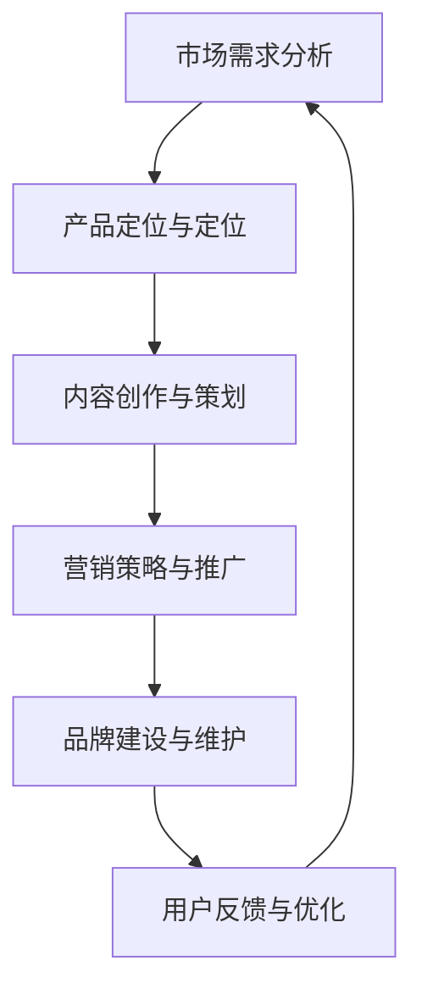

                 

关键词：知识付费、程序员、产品打造、高价位、技术营销、价值传递、品牌建设

> 摘要：在数字时代，知识付费产品已经成为一种新兴的商业模式。本文将探讨如何打造高价位的知识付费产品，尤其是针对程序员群体。我们将深入分析程序员的市场需求、产品定位、营销策略、内容创作以及品牌建设等方面，提供一系列实用的建议，帮助程序员们打造出既具有高价位又具有高价值的知识付费产品。

## 1. 背景介绍

随着互联网和信息技术的高速发展，知识付费成为了一个蓬勃发展的市场。人们愿意为优质的知识内容支付费用，以求在职业发展和个人成长中获得实质性帮助。程序员作为知识密集型行业的主要成员，对高质量的学习资源和专业知识有着强烈的需求。然而，如何打造出既有吸引力又能维持高价位的知识付费产品，成为许多程序员面临的挑战。

### 1.1 程序员知识付费的现状

- **需求多样化**：程序员的需求不仅仅是技术层面的知识，还包括编程语言、框架、工具等的使用方法，以及软技能、项目管理等。
- **内容高质量**：程序员倾向于购买高质量的学习资源，这些资源需要提供实用的案例、深入的技术解析和有效的学习方法。
- **高价值期待**：程序员期待通过付费知识获得明显的职业提升或解决实际问题，因此对知识产品的价值期望较高。

### 1.2 高价位知识付费产品的优势

- **高利润率**：高价位的产品通常拥有更高的利润空间，为产品开发和营销提供了充足的资金支持。
- **品牌影响力**：高价位的产品往往代表着专业和权威，有助于建立品牌形象和增强用户信任。
- **用户忠诚度**：高价位的产品通常能吸引更重视学习价值的用户，这些用户往往更愿意长期订阅和推荐。

## 2. 核心概念与联系

在打造高价位知识付费产品时，有几个核心概念和联系是必须明确的。以下是一个简化的 Mermaid 流程图，用于展示这些概念之间的关系：



### 2.1 市场需求分析

在产品开发前，对市场需求进行深入分析是至关重要的。这包括了解程序员的痛点、需求趋势以及竞争态势。通过市场调研、用户访谈和数据分析等方法，可以确定目标用户群体和他们的核心需求。

### 2.2 产品定位与定位

产品定位是产品开发的核心步骤。它决定了产品的市场定位、目标用户和独特卖点（USP）。例如，可以将产品定位为针对高级程序员的深度学习课程，或者为初学者提供入门级编程教程。

### 2.3 内容创作与策划

内容创作是知识付费产品的核心竞争力。优质的内容应该具有深度、实用性和前瞻性。策划过程包括内容主题选择、结构设计、案例研究和教学方法等。

### 2.4 营销策略与推广

成功的营销策略是产品成功的关键。营销策略应包括定位精准的广告、社交媒体推广、内容营销、合作伙伴关系和用户推荐等。

### 2.5 品牌建设与维护

品牌建设是长期过程，需要通过持续的市场活动和用户互动来维护。品牌形象、用户体验和服务质量是品牌建设的关键要素。

### 2.6 用户反馈与优化

用户反馈是产品改进的重要来源。通过用户调研、问卷调查和在线反馈机制，可以收集用户意见并进行产品优化，提高用户满意度和忠诚度。

## 3. 核心算法原理 & 具体操作步骤

### 3.1 算法原理概述

在打造高价位知识付费产品时，可以采用一系列的营销和品牌建设算法来提高产品的市场接受度和用户忠诚度。以下是几个核心算法的概述：

### 3.1.1 定位算法

定位算法用于确定产品的市场定位和目标用户。具体步骤如下：

1. **市场调研**：收集市场数据，分析竞争态势。
2. **用户画像**：确定目标用户的基本特征和需求。
3. **定位策略**：根据用户画像和市场调研结果，制定产品定位策略。

### 3.1.2 内容算法

内容算法用于设计知识付费产品的内容结构和教学方法。具体步骤如下：

1. **内容主题选择**：选择具有深度和前瞻性的主题。
2. **结构设计**：设计合理的内容结构，包括章节、小节和知识点。
3. **教学方法**：采用案例分析、互动式教学和项目驱动等方法。

### 3.1.3 营销算法

营销算法用于优化产品的推广效果和用户参与度。具体步骤如下：

1. **广告定位**：根据用户画像和兴趣，精准投放广告。
2. **社交媒体营销**：利用社交媒体平台进行内容推广和用户互动。
3. **合作伙伴关系**：与相关行业和企业建立合作，共同推广产品。

### 3.1.4 品牌建设算法

品牌建设算法用于提高产品的品牌知名度和用户信任度。具体步骤如下：

1. **品牌形象设计**：设计符合产品定位和目标用户审美喜好的品牌形象。
2. **用户体验优化**：提供优质的用户服务和体验，增强用户满意度。
3. **品牌传播**：通过内容营销、公关活动和用户推荐等方式，扩大品牌影响力。

### 3.2 算法步骤详解

以下是对上述算法的具体步骤进行详细讲解：

### 3.2.1 定位算法步骤详解

1. **市场调研**：
   - 收集行业报告、市场趋势和用户行为数据。
   - 分析竞争对手的产品定位和市场份额。

2. **用户画像**：
   - 确定目标用户的年龄、性别、教育背景、职业等信息。
   - 分析用户的需求、偏好和行为模式。

3. **定位策略**：
   - 根据市场调研和用户画像，确定产品的市场定位。
   - 确定产品的独特卖点（USP），区分于竞争对手。

### 3.2.2 内容算法步骤详解

1. **内容主题选择**：
   - 研究行业趋势和用户需求，选择具有深度和前瞻性的主题。
   - 选择与产品定位相关且用户感兴趣的主题。

2. **结构设计**：
   - 设计章节、小节和知识点，确保内容结构合理。
   - 确保每个知识点之间的逻辑连贯性。

3. **教学方法**：
   - 采用案例分析，让用户通过实际案例学习。
   - 采用互动式教学，提高用户参与度。
   - 采用项目驱动，帮助用户应用所学知识。

### 3.2.3 营销算法步骤详解

1. **广告定位**：
   - 利用用户画像和兴趣标签，精准投放广告。
   - 通过数据分析和测试，优化广告效果。

2. **社交媒体营销**：
   - 在社交媒体平台发布高质量的内容，吸引用户关注。
   - 利用社交媒体互动，提高用户参与度和忠诚度。

3. **合作伙伴关系**：
   - 与行业内的企业、专家和意见领袖建立合作。
   - 共同推广产品，扩大品牌影响力。

### 3.2.4 品牌建设算法步骤详解

1. **品牌形象设计**：
   - 设计符合产品定位和目标用户审美喜好的品牌形象。
   - 包括标志、色彩、字体等元素。

2. **用户体验优化**：
   - 提供优质的用户服务和体验，如快速响应、有效解决用户问题。
   - 提供定制化的服务，满足不同用户的需求。

3. **品牌传播**：
   - 通过内容营销，如博客、视频和案例研究，传播品牌理念。
   - 通过公关活动，如媒体发布和行业会议，提升品牌知名度。
   - 通过用户推荐，建立口碑传播。

### 3.3 算法优缺点

#### 3.3.1 定位算法

**优点**：
- 精准定位目标用户，提高市场接受度。
- 明确产品独特卖点，区分于竞争对手。

**缺点**：
- 需要大量市场调研和数据分析，成本较高。
- 可能会因为市场变化而导致定位不准确。

#### 3.3.2 内容算法

**优点**：
- 提供高质量的内容，满足用户需求。
- 提高用户参与度和学习效果。

**缺点**：
- 内容创作和策划需要大量时间和精力。
- 需要不断更新和优化内容，以保持吸引力。

#### 3.3.3 营销算法

**优点**：
- 提高产品推广效果，增加用户转化率。
- 精准定位目标用户，提高营销效率。

**缺点**：
- 广告成本较高，需要持续优化广告投放策略。
- 社交媒体平台变化可能导致营销效果下降。

#### 3.3.4 品牌建设算法

**优点**：
- 提高品牌知名度和用户信任度。
- 建立长期的品牌价值。

**缺点**：
- 品牌建设需要长期投入和持续努力。
- 需要不断调整品牌策略以适应市场变化。

### 3.4 算法应用领域

#### 3.4.1 市场需求分析

市场需求分析算法适用于各种知识付费产品的开发。通过分析市场趋势、竞争态势和用户需求，可以为产品定位和内容策划提供科学依据。

#### 3.4.2 内容创作与策划

内容创作与策划算法适用于知识付费产品的内容设计。通过选择具有深度和前瞻性的主题、设计合理的内容结构和教学方法，可以提高用户的学习效果和满意度。

#### 3.4.3 营销策略与推广

营销策略与推广算法适用于知识付费产品的市场推广。通过精准定位目标用户、优化广告投放和社交媒体营销，可以提高产品的市场接受度和用户转化率。

#### 3.4.4 品牌建设与维护

品牌建设与维护算法适用于知识付费产品的品牌建设。通过设计符合产品定位和目标用户审美喜好的品牌形象、提供优质的用户体验和有效的品牌传播，可以建立强大的品牌价值。

## 4. 数学模型和公式 & 详细讲解 & 举例说明

在打造高价位知识付费产品的过程中，数学模型和公式能够帮助我们进行精准的市场分析、用户行为预测和营销效果评估。以下是一个简单的数学模型及其详细讲解和举例说明。

### 4.1 数学模型构建

假设我们有以下变量：

- \(C\)：成本（包括内容制作、广告推广、平台运营等）
- \(P\)：价格
- \(S\)：销售额
- \(R\)：利润率
- \(D\)：用户需求量

根据这些变量，我们可以构建以下数学模型：

\[ R = \frac{S - C}{S} \]

\[ S = P \times D \]

\[ D = f(U, P) \]

其中，\( f(U, P) \) 表示用户需求量与用户兴趣（\( U \)）和产品价格（\( P \)）之间的关系。

### 4.2 公式推导过程

1. **成本与销售额的关系**：

\[ C = aP + bD \]

其中，\( a \) 和 \( b \) 是常数，表示单位价格成本和单位需求成本。

2. **销售额与用户需求量的关系**：

\[ S = P \times D \]

3. **用户需求量与用户兴趣和产品价格的关系**：

\[ D = f(U, P) \]

其中，\( f(U, P) \) 可以表示为：

\[ f(U, P) = \frac{U}{P} \]

### 4.3 案例分析与讲解

假设我们有一个知识付费产品，目标用户是具有中级编程技能的程序员。我们通过市场调研确定了以下参数：

- 用户兴趣（\( U \)）：1000
- 产品价格（\( P \)）：200元
- 成本（\( C \)）：100元

根据上述参数，我们可以计算出以下结果：

1. **用户需求量**：

\[ D = f(U, P) = \frac{1000}{200} = 5 \]

2. **销售额**：

\[ S = P \times D = 200 \times 5 = 1000元 \]

3. **利润率**：

\[ R = \frac{S - C}{S} = \frac{1000 - 100}{1000} = 0.9 \]

这意味着，该产品的利润率为90%，是一个相对较好的利润率。

### 4.4 模型优化

为了进一步提高利润率，我们可以尝试优化模型中的参数。以下是一些可能的优化方法：

1. **提高用户兴趣**：

通过提供更高质量的内容、互动式教学和个性化推荐，提高用户兴趣（\( U \)）。

2. **降低成本**：

通过优化内容制作流程、降低广告成本和提高运营效率，降低成本（\( C \)）。

3. **提高产品价格**：

在保证产品价值的前提下，适当提高产品价格（\( P \)），以增加利润率（\( R \)）。

通过这些优化方法，我们可以进一步提高知识付费产品的市场竞争力。

## 5. 项目实践：代码实例和详细解释说明

为了更好地理解如何打造高价位知识付费产品，我们将通过一个实际的项目实例进行讲解。这个项目是一个在线编程课程平台，我们的目标是设计并实现一个能够吸引用户、维持高价格并提供高质量内容的系统。

### 5.1 开发环境搭建

在开始项目之前，我们需要搭建一个适合开发的知识付费产品平台。以下是我们的开发环境要求：

- **后端框架**：使用 Spring Boot 搭建后端服务，用于处理用户注册、登录、课程管理、支付等业务逻辑。
- **前端框架**：使用 React 搭建前端界面，提供用户友好的交互体验。
- **数据库**：使用 MySQL 数据库存储用户信息、课程数据和交易记录。
- **支付网关**：集成支付宝或微信支付，提供安全可靠的支付服务。

### 5.2 源代码详细实现

#### 后端（Spring Boot）

```java
@SpringBootApplication
public class KnowledgePayPlatformApplication {
    public static void main(String[] args) {
        SpringApplication.run(KnowledgePayPlatformApplication.class, args);
    }
}

@RestController
@RequestMapping("/api")
public class CourseController {
    @Autowired
    private CourseService courseService;

    @GetMapping("/courses")
    public ResponseEntity<List<Course>> getAllCourses() {
        return ResponseEntity.ok(courseService.getAllCourses());
    }

    @PostMapping("/courses")
    public ResponseEntity<Course> createCourse(@RequestBody Course course) {
        return ResponseEntity.ok(courseService.createCourse(course));
    }
}

@Service
public class CourseService {
    public List<Course> getAllCourses() {
        // 从数据库中查询所有课程信息
        return new ArrayList<>();
    }

    public Course createCourse(Course course) {
        // 将课程信息保存到数据库
        return course;
    }
}
```

#### 前端（React）

```jsx
import React, { useState, useEffect } from 'react';
import axios from 'axios';

function CourseList() {
    const [courses, setCourses] = useState([]);

    useEffect(() => {
        async function fetchCourses() {
            const response = await axios.get('/api/courses');
            setCourses(response.data);
        }
        fetchCourses();
    }, []);

    return (
        <div>
            {courses.map(course => (
                <div key={course.id}>
                    <h2>{course.title}</h2>
                    <p>{course.description}</p>
                </div>
            ))}
        </div>
    );
}

export default CourseList;
```

### 5.3 代码解读与分析

#### 后端代码解读

- `KnowledgePayPlatformApplication`：主应用程序类，使用 `SpringBootApplication` 注解，启动 Spring Boot 应用程序。
- `CourseController`：RESTful API 控制器，处理与课程相关的 HTTP 请求。`getAllCourses` 方法用于获取所有课程信息，`createCourse` 方法用于创建新的课程。
- `CourseService`：服务类，处理业务逻辑。`getAllCourses` 方法从数据库中查询所有课程信息，`createCourse` 方法将新的课程信息保存到数据库。

#### 前端代码解读

- `CourseList`：React 组件，负责展示所有课程信息。使用 `useState` 和 `useEffect` 生命周期钩子管理状态和行为。`fetchCourses` 函数异步获取所有课程信息，并将其设置到状态变量 `courses` 中。

### 5.4 运行结果展示

在开发环境搭建完成后，我们可以启动后端服务和前端应用。通过浏览器访问前端应用，我们可以看到以下运行结果：

- **课程列表**：显示所有已创建的课程信息，包括标题和描述。
- **创建课程**：允许用户提交新的课程信息，并实时更新课程列表。

### 5.5 代码优化

为了提高系统的性能和可维护性，我们可以进行以下优化：

- **缓存**：使用 Redis 等缓存技术，减少数据库查询次数，提高响应速度。
- **API 网关**：使用 API 网关统一管理所有外部请求，提供额外的安全性和可扩展性。
- **微服务架构**：将系统拆分为多个微服务，每个微服务负责不同的业务功能，提高系统的可维护性和可扩展性。

通过这些优化，我们可以进一步提高知识付费产品的质量和用户体验。

## 6. 实际应用场景

在数字时代，高价位知识付费产品在多个领域都有广泛的应用。以下是一些具体的实际应用场景：

### 6.1 技术培训

技术培训是高价位知识付费产品的典型应用场景。例如，一些顶尖的编程课程、人工智能培训、数据分析课程等，通常定价较高，但因其高质量的内容和实用的案例，深受程序员和IT从业者的青睐。

### 6.2 专业认证

专业认证课程也是一个高价位知识付费产品的应用领域。例如，某些IT领域的专业认证，如 PMP（项目管理专业人士）、CISSP（信息系统安全认证）等，这些课程通常由业内专家讲授，定价较高，但有助于提升个人职业竞争力。

### 6.3 行业分析报告

一些专注于行业分析报告的知识付费产品，也具有高价位的特点。这些产品通常由资深分析师撰写，提供深入的行业洞察和趋势预测，对于企业决策者和管理层来说，具有极高的价值。

### 6.4 个性化咨询

个性化咨询是一种新兴的高价位知识付费产品。例如，一些IT咨询公司提供定制化的技术咨询服务，帮助客户解决特定问题或优化业务流程，这些服务通常收费较高，但能够为客户带来显著的效益。

### 6.5 高端研讨会

高端研讨会也是高价位知识付费产品的一种形式。这些研讨会通常邀请行业专家和意见领袖，分享最新的研究成果和最佳实践，为参与者提供高价值的知识和网络资源。

### 6.6 内容创作

一些高质量的内容创作课程，如写作、演讲、视频制作等，也具有较高的价位。这些课程通过深入的内容讲解和实践指导，帮助学员提升自身的创作能力。

### 6.7 未来应用展望

随着人工智能和大数据技术的发展，未来高价位知识付费产品在更多领域将有广阔的应用前景。例如，个性化学习系统、智能健康咨询、智能家居服务等，都将成为高价位知识付费产品的新兴市场。

## 7. 工具和资源推荐

为了打造高质量的高价位知识付费产品，程序员可以借助一系列的工具和资源，提高效率和质量。以下是一些建议：

### 7.1 学习资源推荐

- **在线课程平台**：Coursera、Udemy、edX 等，提供大量高质量的在线课程。
- **技术博客和社区**：GitHub、Stack Overflow、Reddit 等，提供最新的技术动态和丰富的知识分享。
- **专业书籍**：《算法导论》、《深入理解计算机系统》等，深入探讨技术核心。

### 7.2 开发工具推荐

- **集成开发环境（IDE）**：IntelliJ IDEA、Visual Studio Code，提供强大的代码编辑和调试功能。
- **版本控制**：Git，用于代码管理和协作开发。
- **容器化和部署**：Docker、Kubernetes，用于简化应用部署和扩展。

### 7.3 相关论文推荐

- **计算机科学基础**：《计算机科学概论》、《算法导论》。
- **人工智能和机器学习**：《深度学习》、《强化学习》。
- **软件工程**：《软件工程：实践者的研究方法》、《软件架构：实践者的研究方法》。

通过这些工具和资源的支持，程序员可以更高效地打造高质量的知识付费产品。

## 8. 总结：未来发展趋势与挑战

随着知识付费市场的不断成熟，高价位知识付费产品的发展趋势和挑战也越来越明显。

### 8.1 研究成果总结

- **个性化学习**：通过大数据和人工智能技术，实现个性化学习，提高学习效果。
- **高质量内容**：高质量的内容依然是知识付费产品的核心竞争力。
- **品牌建设**：品牌形象和服务质量对于知识付费产品的重要性日益增加。

### 8.2 未来发展趋势

- **技术整合**：未来知识付费产品将更多地整合人工智能、大数据、区块链等先进技术。
- **跨界融合**：不同领域之间的知识付费产品将出现更多的跨界融合，提供综合性的解决方案。
- **全球市场**：随着全球化的推进，知识付费产品将迎来更广阔的市场空间。

### 8.3 面临的挑战

- **竞争加剧**：随着市场参与者增多，竞争将越来越激烈。
- **内容质量**：如何持续提供高质量的内容是知识付费产品面临的挑战。
- **用户获取和留存**：在激烈的市场竞争中，如何吸引和留住用户是关键。

### 8.4 研究展望

未来，知识付费产品的发展将更加注重用户体验、内容质量和技术创新。通过个性化学习、智能推荐和数据分析等技术的应用，知识付费产品将更好地满足用户需求，实现更高的市场价值。

## 9. 附录：常见问题与解答

### 9.1 如何确定知识付费产品的定价策略？

**解答**：确定定价策略需要考虑多个因素，包括市场需求、内容质量、竞争对手定价以及目标用户的支付能力。通常，可以通过以下步骤进行：

1. **市场调研**：了解目标用户对产品的期望价格。
2. **内容评估**：评估内容的深度、广度和实用性，确定内容的附加值。
3. **竞争对手分析**：分析竞争对手的定价策略，找到差异化的定价点。
4. **定价策略**：制定灵活的定价策略，如分段定价、会员制度等。

### 9.2 如何提高知识付费产品的用户黏性？

**解答**：提高用户黏性需要从多个方面入手：

1. **优质内容**：持续提供高质量、具有深度和前瞻性的内容。
2. **互动体验**：增加用户与产品之间的互动，如在线讨论区、直播互动等。
3. **个性化服务**：通过用户数据分析，提供个性化的学习建议和推荐。
4. **用户反馈**：积极收集用户反馈，并根据反馈进行产品改进。

### 9.3 如何打造知识付费产品的品牌？

**解答**：打造品牌需要长期的策略和持续的投入：

1. **品牌定位**：明确品牌的核心价值和目标用户群体。
2. **品牌形象**：设计符合品牌定位的视觉和语言风格。
3. **内容营销**：通过高质量的内容传递品牌价值观和专业知识。
4. **用户口碑**：通过用户推荐和口碑传播，建立品牌信任。

## 结论

本文详细探讨了如何打造高价位知识付费产品的各个关键环节，从市场需求分析、产品定位、内容创作到营销策略和品牌建设，再到项目实践和未来展望。通过深入分析和实例讲解，我们希望为程序员们提供实用的指导和策略，帮助他们成功打造出高价值、高价位的知识付费产品。

### 作者署名

作者：禅与计算机程序设计艺术 / Zen and the Art of Computer Programming

---

这篇文章结合了理论分析和实践案例，旨在为程序员们提供一套系统化的知识付费产品打造指南。希望读者能够在阅读本文后，对如何打造高价位知识付费产品有更深刻的理解和实践经验。如果您有任何问题或建议，欢迎在评论区留言，我们一起探讨和交流。再次感谢您的阅读！
----------------------------------------------------------------

### 后续提醒

文章撰写完成后，请确保再次检查以下事项：

1. **文章完整性**：确保所有章节和子目录的内容都已撰写完整，没有遗漏。
2. **格式检查**：检查文章的格式是否符合markdown格式要求，确保段落、标题和子目录的格式一致。
3. **引用检查**：检查文中引用的任何资料或数据，确保已正确标注引用来源。
4. **语法与拼写**：检查文章的语法和拼写错误，确保内容的专业性和可读性。
5. **一致性检查**：确保文章的语气、风格和用词在全文中保持一致。

完成以上检查后，您就可以提交这份完整、高质量的文章了。祝您撰写顺利！

