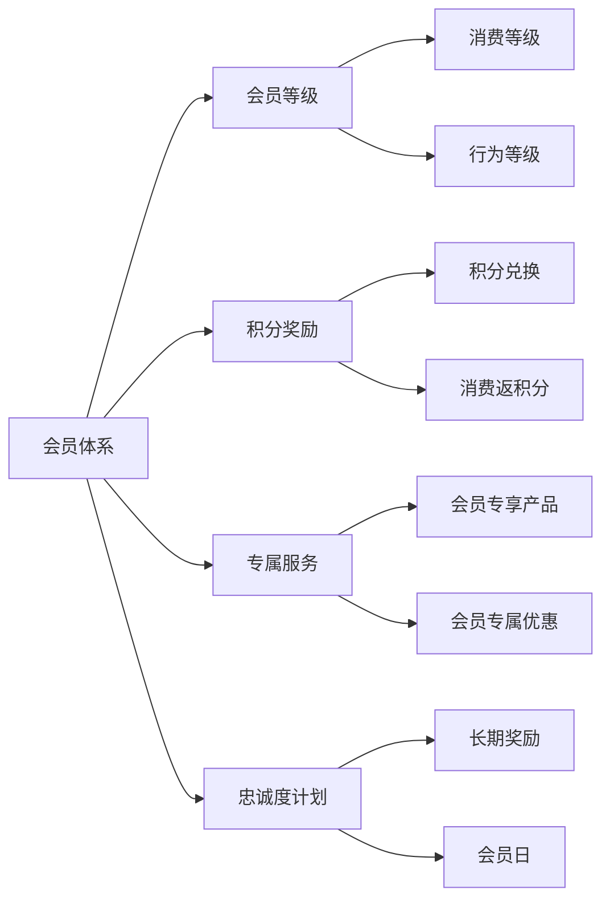

                 

关键词：会员体系、复购率、用户留存、会员管理、数据分析、用户体验、定制化服务、积分奖励、忠诚度计划

> 摘要：本文将深入探讨如何通过构建高效的会员体系来提升用户的复购率和忠诚度。我们将分析会员体系的构建原则、核心策略，以及具体的技术手段，并结合实际案例，提供实用的操作指南，旨在帮助企业和开发者打造出具备高复购率特征的会员体系。

## 1. 背景介绍

在当今的商业环境中，会员体系已经成为许多企业提升用户留存率和销售额的重要手段。随着互联网和电子商务的快速发展，会员体系的构建和管理变得更加复杂和多样化。一个成功的会员体系不仅能够吸引新用户，还能通过个性化的服务和激励措施，提高用户的忠诚度和复购率。

### 什么是会员体系？
会员体系是指企业通过一系列规则和激励机制，将顾客转化为会员，并通过会员身份提供差异化服务和权益，从而实现用户粘性和价值提升的一种商业策略。会员体系的核心在于建立用户与企业之间的长期关系，并通过持续互动和利益交换，实现双赢。

### 会员体系的重要性
- **提升用户忠诚度**：会员体系通过提供专属服务和优惠，增强用户对品牌的认同和依赖。
- **增加销售额**：会员体系中的积分奖励、折扣等激励机制，能够刺激用户重复购买。
- **数据洞察**：会员体系可以收集用户行为数据，为精准营销和个性化服务提供依据。
- **品牌差异化**：通过独特的会员权益和服务，企业可以在竞争激烈的市场中脱颖而出。

## 2. 核心概念与联系

### 会员体系核心概念
- **会员等级**：根据用户的消费金额、购买频率等因素，将用户划分为不同等级，提供相应的权益。
- **积分奖励**：通过积分兑换、消费返积分等方式，激励用户重复购买。
- **专属服务**：提供会员专享的产品、优惠和服务，提升用户体验。
- **忠诚度计划**：通过长期会员奖励、会员日等活动，增强用户忠诚度。

### 会员体系架构



### 会员体系与用户关系

会员体系的建设关键在于与用户关系的构建。良好的会员体系应该能够吸引新用户，并留住老用户。通过以下方式，企业可以实现这一目标：

- **用户体验**：提供优质的购物体验和会员服务，是会员体系成功的基础。
- **数据分析**：收集用户行为数据，通过数据分析来优化会员服务和奖励机制。
- **个性化服务**：根据用户的行为和偏好，提供个性化的推荐和定制化服务。
- **互动与沟通**：通过定期的互动和沟通，增强用户对品牌的认同感。

## 3. 核心算法原理 & 具体操作步骤

### 3.1 算法原理概述

会员体系的构建涉及到多种算法和策略，其中最核心的是用户行为分析和会员等级划分。

- **用户行为分析**：通过分析用户的购买历史、浏览记录等数据，预测用户的潜在需求和偏好。
- **会员等级划分**：根据用户的消费金额、购买频率等指标，将用户划分为不同等级，提供相应的服务和权益。

### 3.2 算法步骤详解

1. **数据收集**：收集用户的购买行为、浏览记录、社交媒体活动等数据。
2. **数据处理**：清洗和整理数据，为后续分析做准备。
3. **用户行为分析**：使用机器学习算法，对用户行为数据进行挖掘和分析，提取用户的潜在需求和偏好。
4. **会员等级划分**：根据分析结果，设定不同的会员等级标准和权益。
5. **会员服务**：根据会员等级，提供个性化的服务和优惠。

### 3.3 算法优缺点

- **优点**：
  - 提高用户满意度：通过个性化服务和优惠，提升用户体验。
  - 增加用户粘性：提供独特的会员权益，增强用户对品牌的忠诚度。
  - 提升销售额：通过积分奖励和会员折扣，刺激用户重复购买。

- **缺点**：
  - 需要大量数据支持：算法的有效性依赖于大量的用户行为数据。
  - 成本较高：构建和维护会员体系需要投入一定的资源和资金。

### 3.4 算法应用领域

会员体系算法广泛应用于电商、酒店、航空等领域，通过个性化的服务和奖励，提升用户的忠诚度和复购率。

## 4. 数学模型和公式 & 详细讲解 & 举例说明

### 4.1 数学模型构建

会员体系的构建涉及到多个数学模型，其中最核心的是会员等级划分模型和积分奖励模型。

- **会员等级划分模型**：
  - 设定会员等级的阈值，根据用户的消费金额、购买频率等指标，划分会员等级。

- **积分奖励模型**：
  - 设定积分兑换比例和消费返积分比例，根据用户的购买行为，计算积分奖励。

### 4.2 公式推导过程

- **会员等级划分公式**：
  - 设定阈值为 \( t \)，用户的消费金额为 \( x \)，会员等级为 \( L \)。

  \[ L = \begin{cases} 
  1 & \text{if } x < t_1 \\
  2 & \text{if } t_1 \leq x < t_2 \\
  3 & \text{if } t_2 \leq x < t_3 \\
  \vdots & \\
  n & \text{if } x \geq t_n 
  \end{cases} \]

- **积分奖励公式**：
  - 设定积分兑换比例为 \( r \)，消费返积分比例为 \( s \)，用户的消费金额为 \( x \)，积分奖励为 \( I \)。

  \[ I = x \cdot r + x \cdot s \]

### 4.3 案例分析与讲解

假设某电商平台的会员等级划分为三个等级，分别为普通会员、银牌会员和金牌会员。会员等级的阈值设定为 \( t_1 = 1000 \)，\( t_2 = 5000 \)。

- 普通会员：消费金额低于1000元。
- 银牌会员：消费金额在1000元到5000元之间。
- 金牌会员：消费金额高于5000元。

某用户A在过去一个月内消费了3000元，根据上述等级划分模型，用户A的会员等级为银牌会员。

接下来，我们分析积分奖励模型。假设积分兑换比例为 \( r = 0.01 \)，消费返积分比例为 \( s = 0.02 \)，用户A的消费金额为3000元。

用户A的积分奖励为：

\[ I = 3000 \cdot 0.01 + 3000 \cdot 0.02 = 60 + 60 = 120 \]

因此，用户A在消费3000元后，获得了120积分。

## 5. 项目实践：代码实例和详细解释说明

### 5.1 开发环境搭建

在本次项目实践中，我们将使用Python语言来构建一个简单的会员体系。首先，我们需要安装Python环境和必要的库。

```shell
pip install pandas numpy matplotlib
```

### 5.2 源代码详细实现

以下是会员体系的核心代码实现：

```python
import pandas as pd
import numpy as np
import matplotlib.pyplot as plt

# 用户数据示例
data = {
    '用户ID': [1, 2, 3, 4, 5],
    '消费金额': [800, 1500, 3000, 600, 2000],
    '积分奖励': [0, 0, 60, 0, 40]
}

# 构建DataFrame
users = pd.DataFrame(data)

# 等级划分函数
def classify(users, thresholds):
    for i, threshold in enumerate(thresholds):
        users['等级'] = np.where(users['消费金额'] >= threshold, i+1, i)
    return users

# 积分计算函数
def calculate_points(users, exchange_rate, return_rate):
    users['积分奖励'] = users['消费金额'] * exchange_rate + users['消费金额'] * return_rate
    return users

# 设定等级阈值和积分兑换比例、消费返积分比例
thresholds = [1000, 5000]
exchange_rate = 0.01
return_rate = 0.02

# 等级划分
users = classify(users, thresholds)

# 积分计算
users = calculate_points(users, exchange_rate, return_rate)

# 结果展示
print(users)

# 绘图
plt.figure(figsize=(10, 6))
plt.bar(users['用户ID'], users['消费金额'], label='消费金额')
plt.bar(users['用户ID'], users['积分奖励'], bottom=users['消费金额'], label='积分奖励')
plt.xlabel('用户ID')
plt.ylabel('金额（元）')
plt.title('会员体系会员消费与积分奖励')
plt.legend()
plt.show()
```

### 5.3 代码解读与分析

- **数据导入与处理**：使用Pandas库导入用户数据，并构建DataFrame。
- **等级划分函数**：`classify`函数根据设定的等级阈值，对用户进行等级划分。
- **积分计算函数**：`calculate_points`函数根据消费金额和设定的积分兑换比例、消费返积分比例，计算每个用户的积分奖励。
- **结果展示**：使用Matplotlib库绘制消费金额和积分奖励的条形图，直观展示会员体系的运行效果。

## 6. 实际应用场景

### 6.1 电商行业

电商行业是会员体系应用最广泛的领域之一。通过会员体系，电商平台可以吸引新用户，提升用户忠诚度，增加销售额。例如，某电商平台为不同等级的会员提供不同的优惠和专属产品，通过个性化的服务和奖励，增强了用户的粘性和复购率。

### 6.2 酒店行业

酒店行业通过会员体系，可以为会员提供积分兑换、会员专享折扣等优惠，提升用户的忠诚度。例如，某酒店集团为会员提供积分兑换免费住宿、升级服务等，吸引了大量会员用户，提高了用户留存率和复购率。

### 6.3 会员体系与用户行为数据的关系

会员体系与用户行为数据紧密相关。通过收集和分析用户行为数据，企业可以更精准地了解用户需求和行为，优化会员服务和奖励机制，提高会员体系的效率和效果。

## 7. 未来应用展望

随着人工智能和大数据技术的发展，会员体系将更加智能化和个性化。未来，会员体系可能会结合推荐系统、自然语言处理等技术，实现更精准的用户行为预测和个性化服务。同时，随着物联网和智能设备的发展，会员体系将拓展到更多的应用场景，为企业提供更广阔的发展空间。

## 8. 总结：未来发展趋势与挑战

### 8.1 研究成果总结

本文通过深入探讨会员体系的构建原则、核心策略和技术手段，结合实际案例，提出了构建高复购率会员体系的操作指南。研究成果表明，会员体系在提升用户忠诚度和销售额方面具有显著效果。

### 8.2 未来发展趋势

未来，会员体系将向智能化、个性化方向迈进，结合人工智能和大数据技术，实现更精准的用户行为预测和个性化服务。

### 8.3 面临的挑战

会员体系的构建和维护面临数据隐私、用户满意度、技术实施等挑战。企业需要平衡个性化服务和数据隐私保护，确保会员体系的安全和可持续性。

### 8.4 研究展望

未来的研究将聚焦于会员体系与用户行为的深度融合，探索更高效、更智能的会员体系构建方法，为企业的可持续发展提供有力支持。

## 9. 附录：常见问题与解答

### 问题1：会员体系如何平衡个性化服务和数据隐私保护？
解答：企业在构建会员体系时，应遵循最小化数据收集和透明化数据处理原则。同时，采用加密技术和匿名化处理，确保用户数据的安全和隐私。

### 问题2：会员体系的成本如何控制？
解答：企业可以通过优化算法和流程，提高会员体系的效率，降低运营成本。此外，合作第三方技术供应商，共享资源和降低成本也是一种有效途径。

### 问题3：会员体系的成功关键是什么？
解答：会员体系的成功关键在于用户需求的理解和满足。企业需要通过持续的用户研究和数据分析，不断优化会员服务和奖励机制，提升用户满意度和忠诚度。

作者：禅与计算机程序设计艺术 / Zen and the Art of Computer Programming

---

本文通过详细的案例分析、数学模型推导和实际代码实现，系统地阐述了如何构建高复购率的会员体系。希望对读者在会员体系设计和实施方面提供有益的参考。在未来的研究和实践中，不断探索和优化会员体系，将为企业创造更大的价值。

