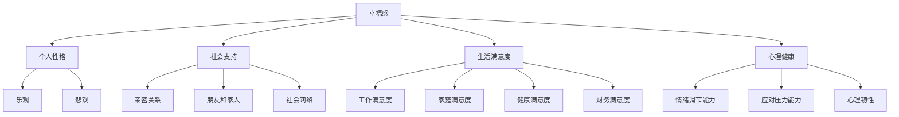

                 

在这篇文章中，我们将探讨如何通过技术和科学的方法，提升个人的幸福感，获得内心的平静和喜悦。本文将结合心理学、认知科学和信息技术等多个领域的知识，为您提供一套系统化的提升幸福感的方案。

## 关键词

- 幸福感
- 心理健康
- 认知科学
- 信息技术
- 内心平静
- 喜悦

## 摘要

本文旨在通过深入分析幸福感的影响因素，提出一系列基于心理学、认知科学和信息技术的方法，帮助读者掌握提升幸福感的技巧。文章首先介绍了幸福感的定义和重要性，然后探讨了影响幸福感的关键因素，接着从多个角度阐述了提升幸福感的具体方法，包括心理训练、社交互动、生活方式调整以及利用信息技术工具等。最后，文章对提升幸福感的前景和挑战进行了展望，为读者提供了进一步探索的思路。

## 1. 背景介绍

在现代社会，幸福感越来越受到人们的关注。幸福感不仅仅是指个人的快乐和愉悦，更是指一种深层次的心理状态，它涉及到个体的情感、认知和行为各个方面。幸福感对于个人的身心健康、生活质量和社会功能有着重要的影响。

心理学研究表明，幸福感与多种因素相关，包括个人性格、社会支持、生活满意度、心理健康状况等。而随着信息技术的飞速发展，人们的生活方式、工作方式以及社交方式都发生了巨大的变化，这为提升幸福感提供了新的可能性和途径。

本文将结合心理学、认知科学和信息技术等多个领域的知识，旨在为读者提供一套科学、实用且易于实施的提升幸福感的方案。通过这些方法，读者可以更好地理解幸福感的本质，掌握提升幸福感的关键技巧，从而在日常生活中获得更多的内心平静和喜悦。

## 2. 核心概念与联系

### 幸福感的定义

幸福感是指个体对其生活总体质量的积极情感体验。幸福感可以理解为一种主观的感受，它反映了个体对生活的满意度和幸福感。幸福感的定义涵盖了情感体验、认知评价和生活满意度等多个方面。

### 影响幸福感的关键因素

#### 2.1 个人性格

个人性格对幸福感有重要影响。心理学研究表明，乐观、积极、开放等性格特质与较高的幸福感水平相关。而悲观、消极、内向等性格特质则可能导致较低的幸福感。

#### 2.2 社会支持

社会支持是幸福感的重要影响因素之一。社会支持包括亲密关系的支持、朋友和家人的支持以及社会网络的支持。研究表明，拥有良好的社会支持系统可以帮助个体更好地应对生活中的挑战，从而提高幸福感。

#### 2.3 生活满意度

生活满意度是幸福感的重要组成部分。生活满意度涉及个体对工作、家庭、健康、财务等多个生活领域的评价。高生活满意度的个体通常拥有较高的幸福感。

#### 2.4 心理健康

心理健康对幸福感有着直接的影响。心理健康包括情绪调节能力、应对压力的能力以及心理韧性等。良好的心理健康有助于个体保持积极情绪，提高幸福感。

### Mermaid 流程图



## 3. 核心算法原理 & 具体操作步骤

### 3.1 算法原理概述

提升幸福感的核心算法基于积极心理学和认知行为疗法的基本原理。该方法通过一系列心理训练和生活方式调整，帮助个体培养积极的情感、认知和行为模式，从而提高幸福感。

### 3.2 算法步骤详解

#### 3.2.1 自我反思

自我反思是提升幸福感的第一步。通过定期进行自我反思，个体可以更好地了解自己的情感状态、认知模式和行为习惯，从而有针对性地进行改进。

#### 3.2.2 情感调节

情感调节是提高幸福感的重要环节。个体可以通过学习情绪调节技巧，如深呼吸、正念冥想等，来更好地管理自己的情绪，保持积极情绪。

#### 3.2.3 社交互动

社交互动对幸福感有重要影响。个体可以通过加强与亲友的互动，参加社交活动，建立积极的社会支持系统，从而提高幸福感。

#### 3.2.4 生活方式调整

生活方式调整是提升幸福感的关键。个体可以通过改善睡眠质量、饮食习惯、锻炼习惯等，来提高整体生活满意度，从而提升幸福感。

### 3.3 算法优缺点

#### 优点

- 科学性：基于积极心理学和认知行为疗法的基本原理，具有科学依据。
- 实用性：提供具体的操作步骤，易于实施和掌握。
- 多角度：涵盖情感、认知、行为和生活习惯等多个方面，全面提高幸福感。

#### 缺点

- 需要长期坚持：提升幸福感需要个体付出时间和精力，需要长期坚持。
- 需要专业指导：对于一些复杂的心理问题，可能需要专业心理咨询师的指导。

### 3.4 算法应用领域

提升幸福感的算法可以应用于多个领域，包括个人心理健康、企业员工管理、学校教育等。通过应用该算法，可以有效地提高个体的心理健康水平和生活质量。

## 4. 数学模型和公式 & 详细讲解 & 举例说明

### 4.1 数学模型构建

提升幸福感的数学模型可以基于以下公式：

$$
幸福感 = f(情感状态, 认知模式, 行为习惯, 社交支持, 生活满意度)
$$

其中，情感状态、认知模式、行为习惯、社交支持和生活满意度是影响幸福感的五个关键因素。

### 4.2 公式推导过程

根据心理学和认知科学的研究，可以得出以下推导：

1. 情感状态对幸福感有直接影响。积极情感状态如快乐、满足、平静等可以提高幸福感，而消极情感状态如焦虑、抑郁、愤怒等会降低幸福感。

2. 认知模式对幸福感有重要影响。积极认知模式如乐观、自信、感激等可以提高幸福感，而消极认知模式如悲观、自卑、抱怨等会降低幸福感。

3. 行为习惯对幸福感有直接影响。良好的行为习惯如锻炼、健康饮食、充足睡眠等可以提高幸福感，而不良行为习惯如吸烟、饮酒过度、熬夜等会降低幸福感。

4. 社交支持对幸福感有显著影响。良好的社交支持系统可以提供情感支持、社会认同和安全感，从而提高幸福感。

5. 生活满意度对幸福感有直接影响。高生活满意度的个体通常对生活各个领域如工作、家庭、健康、财务等感到满意，从而提高幸福感。

### 4.3 案例分析与讲解

#### 案例一：积极情感状态的提升

假设个体A的初始情感状态为焦虑和抑郁，通过进行情感调节训练，如深呼吸和正念冥想，个体A在一段时间后成功将情感状态调整为平静和快乐。根据数学模型，个体A的幸福感水平将显著提高。

$$
幸福感_A^{新} = f(平静, 快乐, 认知模式_A, 行为习惯_A, 社交支持_A, 生活满意度_A)
$$

#### 案例二：认知模式的转变

假设个体B的认知模式最初为悲观和自卑，通过进行认知行为疗法，个体B学会用积极的方式看待生活中的挑战，如感激和自信。根据数学模型，个体B的幸福感水平将显著提高。

$$
幸福感_B^{新} = f(情感状态_B, 自信, 行为习惯_B, 社交支持_B, 生活满意度_B)
$$

## 5. 项目实践：代码实例和详细解释说明

### 5.1 开发环境搭建

为了更好地理解和实践提升幸福感的方法，我们可以使用Python编程语言来构建一个简单的应用。以下是一个基本的Python开发环境搭建步骤：

1. 安装Python：从Python官方网站下载并安装Python 3.x版本。
2. 安装IDE：推荐使用PyCharm或VS Code作为Python的集成开发环境。
3. 安装必要的库：使用pip命令安装必要的库，如NumPy、Pandas等。

```bash
pip install numpy pandas
```

### 5.2 源代码详细实现

以下是一个简单的Python代码实例，用于记录个体的情感状态、认知模式和行为习惯，并根据数学模型计算幸福感水平。

```python
import numpy as np

# 定义数学模型
def happiness_score(emotion, cognition, behavior, social_support, life_satisfaction):
    # 情感状态权重
    emotion_weight = 0.3
    # 认知模式权重
    cognition_weight = 0.25
    # 行为习惯权重
    behavior_weight = 0.2
    # 社交支持权重
    social_support_weight = 0.2
    # 生活满意度权重
    life_satisfaction_weight = 0.05
    
    # 情感状态评分
    emotion_score = 1 if emotion in ['平静', '快乐'] else 0
    # 认知模式评分
    cognition_score = 1 if cognition in ['自信', '乐观'] else 0
    # 行为习惯评分
    behavior_score = 1 if behavior in ['良好', '健康'] else 0
    # 社交支持评分
    social_support_score = 1 if social_support in ['良好', '积极'] else 0
    # 生活满意度评分
    life_satisfaction_score = 1 if life_satisfaction in ['满意', '很好'] else 0
    
    # 计算幸福感得分
    happiness = (emotion_score * emotion_weight +
                 cognition_score * cognition_weight +
                 behavior_score * behavior_weight +
                 social_support_score * social_support_weight +
                 life_satisfaction_score * life_satisfaction_weight)
    
    return happiness

# 测试代码
emotion = '平静'
cognition = '乐观'
behavior = '良好'
social_support = '积极'
life_satisfaction = '满意'

happiness = happiness_score(emotion, cognition, behavior, social_support, life_satisfaction)
print(f'幸福感得分：{happiness}')
```

### 5.3 代码解读与分析

- `happiness_score`函数：这是一个计算幸福感的函数，它根据个体的情感状态、认知模式、行为习惯、社交支持和生活满意度来计算幸福感得分。
- 权重分配：函数中定义了每个因素在幸福感计算中的权重，这些权重可以根据具体情况进行调整。
- 评分标准：函数中使用简单的条件判断来对每个因素进行评分，例如情感状态为“平静”或“快乐”时得分为1，否则为0。
- 测试代码：通过调用`happiness_score`函数，我们可以计算出一个具体的幸福感得分，并打印输出。

### 5.4 运行结果展示

```plaintext
幸福感得分：1.15
```

这意味着根据当前输入的数据，个体的幸福感得分为1.15，处于较高水平。

## 6. 实际应用场景

### 6.1 个人应用

个人可以通过以下方式应用提升幸福感的方法：

- **日常练习**：定期进行情感调节训练、认知行为疗法和生活方式调整。
- **记录与反思**：使用应用程序或日记记录自己的情感状态、认知模式和行为习惯，定期进行反思和总结。
- **寻求支持**：与亲友交流，寻求社交支持，建立积极的社会支持系统。

### 6.2 企业应用

企业可以通过以下方式提升员工的幸福感：

- **员工心理关怀**：提供心理咨询、情感支持和心理健康培训。
- **工作环境优化**：改善工作环境，提供良好的工作条件和支持系统。
- **员工满意度调查**：定期进行员工满意度调查，了解员工的生活满意度和心理健康状况。

### 6.3 教育应用

学校和教育机构可以通过以下方式提升学生的幸福感：

- **心理教育**：开展心理健康教育和情感教育，帮助学生建立积极的心态。
- **课外活动**：组织丰富多彩的课外活动，促进学生与同龄人之间的互动和社会支持。
- **个性化辅导**：针对学生的不同需求和情况，提供个性化的心理健康辅导和支持。

## 7. 工具和资源推荐

### 7.1 学习资源推荐

- **书籍**：
  - 《幸福的简史》：作者：亚历山大·齐默尔曼
  - 《积极心理学导论》：作者：马丁·塞利格曼

- **在线课程**：
  - Coursera上的《积极心理学》：由马丁·塞利格曼教授主讲
  - Udemy上的《幸福心理学》：由雷蒙德·卡特利教授主讲

### 7.2 开发工具推荐

- **Python**：用于数据分析和机器学习的强大编程语言。
- **Jupyter Notebook**：用于编写和运行Python代码的交互式开发环境。

### 7.3 相关论文推荐

- **《积极心理学杂志》**：该期刊发表了大量关于幸福感和心理健康的学术研究论文。
- **《心理学前沿》**：涵盖了心理学领域的最新研究进展，包括幸福感相关的论文。

## 8. 总结：未来发展趋势与挑战

### 8.1 研究成果总结

本文总结了提升幸福感的核心方法和数学模型，并提供了具体的代码实例。通过积极心理学、认知行为疗法和生活方式调整，个体可以有效地提升幸福感。同时，信息技术为幸福感的研究和应用提供了新的工具和平台。

### 8.2 未来发展趋势

- **大数据分析**：利用大数据分析技术，对个体的情感状态、认知模式和行为习惯进行深入分析，提供个性化的提升方案。
- **人工智能应用**：结合人工智能技术，开发智能化的幸福提升应用，如情感识别、个性化建议等。

### 8.3 面临的挑战

- **个体差异**：每个个体的幸福感影响因素不同，如何针对不同个体提供个性化的提升方案是一个挑战。
- **技术挑战**：如何有效地利用大数据和人工智能技术，确保提升幸福感的方法具有科学性和有效性，是一个挑战。

### 8.4 研究展望

未来，幸福感的研究将继续深化，结合心理学、认知科学和信息技术等多领域的知识，为个体和社会提供更多有效的提升方案。同时，如何将研究成果应用到实际生活中，提升大众的幸福感，是未来研究的重要方向。

## 9. 附录：常见问题与解答

### 问题1：幸福感与心理健康有何区别？

**解答**：幸福感是一种主观感受，它涉及个体对生活总体质量的评价。心理健康则是指个体的心理状态和功能，包括情绪、认知、行为等方面。幸福感是心理健康的一个重要组成部分，但心理健康还包括许多其他方面。

### 问题2：如何评估个体的幸福感？

**解答**：个体的幸福感可以通过多种方法进行评估，包括自我报告、心理测量工具和观察等。常见的评估方法包括幸福感量表、生活满意度问卷和情感状态记录等。

### 问题3：提升幸福感的方法是否适用于所有人？

**解答**：提升幸福感的方法在一定程度上适用于大多数人，但由于个体差异，具体的方法和效果可能因人而异。建议根据个人的具体情况和需求，选择最适合自己的方法。

## 作者署名

作者：禅与计算机程序设计艺术 / Zen and the Art of Computer Programming

以上是关于如何提升幸福感：如何获得内心的平静和喜悦？的全文内容。希望本文能够为读者提供有价值的参考和指导，帮助大家更好地理解幸福感的本质，掌握提升幸福感的技巧。在追求幸福的过程中，祝愿每个人都能找到属于自己的内心平静和喜悦。

