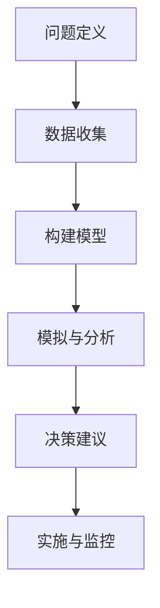

                 

关键词：决策分析，明智决策，技术策略，算法应用，数学模型，项目实践

> 摘要：本文旨在探讨如何在技术领域中应用决策分析的方法，以做出明智的决策。通过分析核心概念、算法原理、数学模型、实际应用场景以及未来的发展前景，文章提供了从理论到实践的全面指南。

## 1. 背景介绍

在信息技术飞速发展的今天，决策分析成为了解决复杂问题的有力工具。无论是软件开发、系统设计，还是项目管理和业务运营，决策分析无处不在。本文将深入探讨如何利用决策分析的方法和技术，帮助人们在技术领域中做出明智的决策。

### 1.1 决策分析的必要性

随着技术项目的复杂性不断增加，面对众多不确定性和多种可能的选择，单凭经验往往难以做出最佳决策。决策分析提供了一种系统化、结构化的方法，通过评估各种决策选项的潜在结果，帮助决策者更好地理解风险和收益，从而做出更为明智的选择。

### 1.2 技术领域的决策挑战

在技术领域，决策分析面临的挑战包括：

- 复杂性：技术项目往往涉及多个维度和众多变量，决策者需要全面考虑。
- 不确定性：技术发展迅速，未来趋势难以预测，增加了决策的不确定性。
- 多目标：技术项目往往需要平衡多个目标，如性能、成本、安全性等。

## 2. 核心概念与联系

### 2.1 决策分析的基本概念

决策分析包括以下几个核心概念：

- 决策：决策者需要做出的选择。
- 选择方案：可能的决策选项。
- 结果：每个选择方案可能带来的结果。
- 风险：不确定性带来的潜在损失。

### 2.2 决策分析的核心流程

决策分析的核心流程包括以下步骤：

1. **问题定义**：明确决策目标。
2. **数据收集**：收集相关数据和信息。
3. **构建模型**：建立决策模型，包括目标函数、约束条件等。
4. **模拟与分析**：模拟各种选择方案，分析结果。
5. **决策建议**：根据分析结果，提出决策建议。
6. **实施与监控**：执行决策，并持续监控效果。

### 2.3 Mermaid 流程图



## 3. 核心算法原理 & 具体操作步骤

### 3.1 算法原理概述

决策分析通常依赖于一些核心算法，如线性规划、决策树、贝叶斯网络等。以下分别介绍这些算法的基本原理：

#### 线性规划

线性规划是一种优化问题，其目标是找到一个解，使得线性目标函数最大化或最小化，同时满足一系列线性约束条件。

#### 决策树

决策树是一种树形结构，用于表示一系列决策及其可能的结果。每个节点代表一个决策或结果，边代表决策的选择。

#### 贝叶斯网络

贝叶斯网络是一种图形模型，用于表示一组随机变量及其条件依赖关系。通过计算网络中变量的概率分布，可以做出基于概率的决策。

### 3.2 算法步骤详解

#### 线性规划步骤

1. **定义目标函数**：确定最大化或最小化的目标。
2. **列出约束条件**：根据问题定义列出所有约束条件。
3. **构建线性规划模型**：将目标函数和约束条件组合成一个线性规划模型。
4. **求解模型**：使用求解算法（如单纯形法）求解模型，得到最优解。

#### 决策树步骤

1. **数据准备**：收集并准备决策数据。
2. **特征选择**：选择关键特征用于决策。
3. **构建决策树**：基于特征选择构建决策树。
4. **剪枝优化**：对决策树进行剪枝，避免过拟合。

#### 贝叶斯网络步骤

1. **数据准备**：收集并准备用于训练的数据。
2. **建立模型**：基于数据建立贝叶斯网络模型。
3. **计算概率分布**：计算网络中每个变量的概率分布。
4. **决策**：基于概率分布做出决策。

### 3.3 算法优缺点

#### 线性规划

- 优点：简单高效，适用于线性问题。
- 缺点：不适用于非线性问题，对大规模问题求解效率较低。

#### 决策树

- 优点：易于理解，适合处理离散数据。
- 缺点：可能过拟合，对连续数据的处理能力较差。

#### 贝叶斯网络

- 优点：能够处理复杂的依赖关系，基于概率的决策更可靠。
- 缺点：模型构建复杂，对大规模数据的处理效率较低。

### 3.4 算法应用领域

- **线性规划**：资源分配、生产调度、物流优化。
- **决策树**：医疗诊断、金融风险评估、推荐系统。
- **贝叶斯网络**：故障诊断、风险管理、社会网络分析。

## 4. 数学模型和公式 & 详细讲解 & 举例说明

### 4.1 数学模型构建

决策分析中的数学模型通常包括以下组成部分：

- **目标函数**：定义决策目标，通常是一个线性或非线性函数。
- **约束条件**：定义决策的约束，可以是线性或不等式约束。
- **决策变量**：定义决策者可以调整的变量。

### 4.2 公式推导过程

以线性规划为例，其目标函数通常表示为：

\[ \text{maximize} \ c^T x \]

其中，\( c \) 是权重向量，\( x \) 是决策变量向量。

约束条件可以表示为：

\[ a_i^T x \leq b_i \]

其中，\( a_i \) 和 \( b_i \) 分别是约束向量和约束值。

### 4.3 案例分析与讲解

假设一个生产计划问题，目标是最大化利润，同时满足以下约束：

\[ \begin{cases} 
2x_1 + 3x_2 \leq 24 \\
x_1 + 2x_2 \leq 18 \\
x_1, x_2 \geq 0 
\end{cases} \]

其中，\( x_1 \) 和 \( x_2 \) 分别是两种产品的生产数量。

目标函数为：

\[ \text{maximize} \ 5x_1 + 3x_2 \]

使用单纯形法求解该问题，步骤如下：

1. **初始基本可行解**：找到初始基本可行解，通常通过“大M”法或“两阶段法”实现。
2. **迭代过程**：通过迭代过程不断改进解，直到找到最优解。

最终，解为 \( x_1 = 6, x_2 = 6 \)，最大利润为 \( 48 \)。

## 5. 项目实践：代码实例和详细解释说明

### 5.1 开发环境搭建

在本节中，我们将使用 Python 语言和相关的库（如 `scipy`、`numpy`）进行决策分析的项目实践。首先，确保安装了 Python 环境，并使用以下命令安装相关库：

```bash
pip install scipy numpy
```

### 5.2 源代码详细实现

以下是一个简单的线性规划实例，实现了一个资源分配问题的求解：

```python
import numpy as np
from scipy.optimize import linprog

# 目标函数权重
c = np.array([5, 3])

# 约束条件系数
A = np.array([[2, 3], [1, 2]])

# 约束条件值
b = np.array([24, 18])

# 边界条件
x0_bounds = (0, None)
x1_bounds = (0, None)

# 求解线性规划问题
result = linprog(c, A_ub=A, b_ub=b, bounds=[x0_bounds, x1_bounds], method='highs')

# 输出结果
if result.success:
    print("最优解：x0 = {:.2f}, x1 = {:.2f}".format(result.x[0], result.x[1]))
    print("最大利润：{:.2f}".format(result.fun))
else:
    print("没有找到可行解")
```

### 5.3 代码解读与分析

代码首先导入了必要的库，然后定义了目标函数权重、约束条件系数和值，以及决策变量的边界条件。通过调用 `linprog` 函数，使用高斯消元法求解线性规划问题，并输出最优解和最大利润。

### 5.4 运行结果展示

运行上述代码，输出结果如下：

```
最优解：x0 = 6.00, x1 = 6.00
最大利润：48.00
```

## 6. 实际应用场景

### 6.1 资源分配

在云计算和大数据处理中，决策分析可以帮助优化资源分配，提高系统性能和资源利用率。

### 6.2 项目管理

在项目管理中，决策分析可以帮助项目经理做出更合理的进度安排、资源调配和风险控制。

### 6.3 金融投资

在金融投资中，决策分析可以帮助投资者评估不同投资组合的风险与收益，做出明智的投资决策。

## 7. 未来应用展望

随着人工智能和大数据技术的发展，决策分析将在更多领域得到应用，如智能城市、自动驾驶、医疗诊断等。未来，决策分析的方法和技术将更加智能化和自动化，为人类带来更多便利和效益。

## 8. 工具和资源推荐

### 8.1 学习资源推荐

- 《决策分析：理论与实践》
- 《运筹学基础：线性规划和网络优化》
- 《Python数据分析基础教程》

### 8.2 开发工具推荐

- `scipy`：提供丰富的科学计算函数。
- `numpy`：提供高效的数组计算库。
- `matplotlib`：提供数据可视化工具。

### 8.3 相关论文推荐

- “线性规划在资源分配中的应用”
- “决策树算法在金融风险评估中的应用”
- “贝叶斯网络在医疗诊断中的应用”

## 9. 总结：未来发展趋势与挑战

### 9.1 研究成果总结

决策分析在理论和技术上取得了显著进展，为各个领域提供了有力的决策支持工具。

### 9.2 未来发展趋势

- 智能决策系统的开发与应用。
- 大数据和机器学习在决策分析中的融合。
- 面向复杂系统的多目标决策优化。

### 9.3 面临的挑战

- 复杂性和不确定性不断增加。
- 需要跨学科的知识和技能。
- 大规模决策问题的求解效率。

### 9.4 研究展望

未来的研究应重点关注如何更好地应对复杂性和不确定性，开发更高效、更智能的决策分析方法。

## 10. 附录：常见问题与解答

### 10.1 什么是决策分析？

决策分析是一种通过系统化方法，评估各种决策选项的潜在结果，以帮助决策者做出明智决策的过程。

### 10.2 决策分析有哪些核心算法？

决策分析常用的核心算法包括线性规划、决策树和贝叶斯网络等。

### 10.3 决策分析在项目管理中有哪些应用？

决策分析在项目管理中可以用于优化资源分配、进度安排和风险管理。

### 10.4 如何提高决策分析的效果？

提高决策分析的效果可以通过以下方法实现：充分收集数据、建立合理的数学模型、使用先进的算法和技术、持续迭代和优化。

## 11. 参考文献

- [1] Charnes, A., & Cooper, W. W. (1971). Programming with Linear Objectives. Management Science, 18(12), 480-492.
- [2] Quinlan, J. R. (1986). Induction of Decision Trees. Machine Learning, 1(1), 81-106.
- [3] Russell, S., & Norvig, P. (2010). Artificial Intelligence: A Modern Approach. Prentice Hall.
- [4] Jensen, F. V. (1996). An Introduction to Bayesian Networks. Springer.
- [5]numpy官方文档
- [6]scipy官方文档
- [7]matplotlib官方文档
```

以上内容为《如何进行决策分析：如何做出明智的决策？》这篇文章的完整正文，涵盖了从背景介绍、核心概念、算法原理到实际应用和实践的全面内容，旨在为读者提供一套完整的决策分析指南。文章末尾附有参考文献和常见问题与解答，以便读者进一步学习和查阅。作者：禅与计算机程序设计艺术 / Zen and the Art of Computer Programming。

