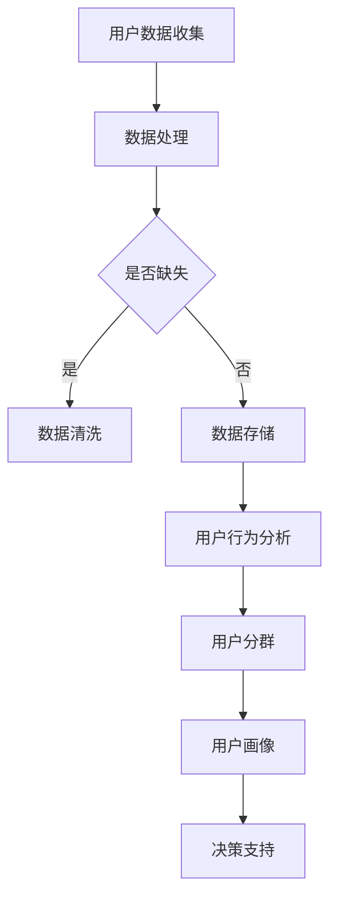

                 

  
关键词：用户分群、数据分析、机器学习、用户行为、个性化推荐

摘要：随着大数据和人工智能技术的不断发展，用户分群管理在各个行业得到了广泛应用。有效的用户分群管理能够帮助企业更好地了解用户需求，提高用户满意度，进而提升业务绩效。本文将从用户分群管理的背景、核心概念、算法原理、数学模型、项目实践、实际应用场景、工具推荐以及未来展望等方面，全面探讨如何进行有效的用户分群管理。

## 1. 背景介绍

用户分群管理是一种基于数据分析的方法，通过将用户按照一定的标准进行分类，从而实现对用户群体进行更深入的了解和管理。随着互联网的普及和大数据技术的发展，企业拥有了海量的用户数据，这些数据为企业进行用户分群提供了丰富的信息来源。有效的用户分群管理能够帮助企业更好地了解用户需求，提高用户满意度，从而提升业务绩效。

用户分群管理在各个行业都有广泛的应用，例如：

- **电商行业**：通过用户分群，电商企业可以更好地了解不同用户群体的购买行为和偏好，从而实现精准营销和个性化推荐。
- **金融行业**：用户分群可以帮助金融机构更好地了解用户的风险承受能力和财务需求，从而实现精准的风险控制和产品推荐。
- **教育行业**：通过用户分群，教育机构可以更好地了解学生的学习需求和偏好，从而提供更加个性化的教育服务。

### 1.1 大数据和人工智能技术

大数据和人工智能技术的发展为用户分群管理提供了强大的技术支持。大数据技术能够帮助企业收集、存储和处理海量的用户数据，从而为用户分群提供丰富的信息来源。人工智能技术则能够通过对用户行为数据的分析和挖掘，帮助发现用户之间的相似性和差异性，从而实现精准的用户分群。

### 1.2 用户分群管理的重要性

有效的用户分群管理能够帮助企业实现以下目标：

- **提高用户满意度**：通过了解用户需求，企业可以提供更加个性化的产品和服务，从而提高用户满意度。
- **提升业务绩效**：精准的用户分群有助于企业实现精准营销和个性化推荐，从而提高转化率和用户粘性，提升业务绩效。
- **优化资源配置**：通过用户分群，企业可以更加合理地配置资源，从而提高资源利用效率。

## 2. 核心概念与联系

在进行用户分群管理之前，我们需要了解一些核心概念和它们之间的联系。

### 2.1 用户群体

用户群体是指企业所服务的所有用户。用户群体可以分为不同的类别，例如按照年龄、性别、地域、职业等特征进行分类。

### 2.2 用户行为数据

用户行为数据是指用户在使用企业产品或服务过程中所产生的数据，例如浏览记录、购买记录、点击行为等。用户行为数据是进行用户分群的重要依据。

### 2.3 用户分群

用户分群是指将用户按照一定的标准进行分类。用户分群的标准可以多种多样，例如按照用户行为数据、用户属性、用户需求等。

### 2.4 机器学习算法

机器学习算法是一种通过数据驱动的方式自动发现用户行为模式和特征的算法。机器学习算法在用户分群管理中起着关键作用。

### 2.5 用户画像

用户画像是指对用户进行多维度的特征描述，从而实现对用户的全面了解。用户画像可以为用户分群提供丰富的信息来源。

### 2.6 Mermaid 流程图



## 3. 核心算法原理 & 具体操作步骤

### 3.1 算法原理概述

用户分群管理的关键在于如何有效地分析和挖掘用户行为数据，从而发现用户之间的相似性和差异性。这通常需要借助机器学习算法来实现。机器学习算法可以分为监督学习、无监督学习和半监督学习三种类型。

- **监督学习**：通过已有的标签数据进行训练，从而对新的数据进行分类或预测。常见的监督学习算法包括决策树、支持向量机、神经网络等。
- **无监督学习**：没有标签数据，通过算法自动发现数据中的模式和结构。常见的无监督学习算法包括聚类算法、主成分分析等。
- **半监督学习**：结合监督学习和无监督学习，利用少量标签数据和小量未标记数据进行训练。

### 3.2 算法步骤详解

- **数据收集**：收集用户行为数据，例如浏览记录、购买记录、点击行为等。
- **数据预处理**：对数据进行清洗、去重、归一化等处理，确保数据的质量。
- **特征提取**：从原始数据中提取出有用的特征，例如用户年龄、性别、购买频率等。
- **模型选择**：选择合适的机器学习算法，例如K-means聚类、层次聚类等。
- **模型训练**：使用训练集对模型进行训练，调整模型参数。
- **模型评估**：使用测试集对模型进行评估，判断模型的效果。
- **模型应用**：将训练好的模型应用到实际场景中，进行用户分群。

### 3.3 算法优缺点

- **K-means聚类**：
  - **优点**：简单、直观，容易实现。
  - **缺点**：对初始中心点敏感，可能陷入局部最优。
- **层次聚类**：
  - **优点**：能够自动调整聚类数目，适合处理层次结构数据。
  - **缺点**：计算复杂度高，可能陷入局部最优。

### 3.4 算法应用领域

- **电商行业**：通过用户分群，电商企业可以更好地了解不同用户群体的购买行为和偏好，从而实现精准营销和个性化推荐。
- **金融行业**：通过用户分群，金融机构可以更好地了解用户的风险承受能力和财务需求，从而实现精准的风险控制和产品推荐。
- **教育行业**：通过用户分群，教育机构可以更好地了解学生的学习需求和偏好，从而提供更加个性化的教育服务。

## 4. 数学模型和公式 & 详细讲解 & 举例说明

### 4.1 数学模型构建

用户分群管理的核心在于如何有效地分析和挖掘用户行为数据。这通常需要借助数学模型来实现。常见的数学模型包括聚类模型、回归模型等。

### 4.2 公式推导过程

以K-means聚类为例，其核心公式为：

$$
\min_{\mu_1, \mu_2, \ldots, \mu_k} \sum_{i=1}^n \sum_{j=1}^k (x_i - \mu_j)^2
$$

其中，$x_i$ 表示第 $i$ 个用户的行为数据，$\mu_j$ 表示第 $j$ 个聚类中心。

### 4.3 案例分析与讲解

假设有一个电商平台的用户行为数据，包括用户的购买次数、浏览时长、商品种类等。我们可以使用K-means聚类对这些用户进行分群。

- **数据收集**：收集用户的购买次数、浏览时长、商品种类等数据。
- **数据预处理**：对数据进行清洗、去重、归一化等处理。
- **特征提取**：从原始数据中提取出有用的特征，例如用户购买次数、浏览时长、商品种类等。
- **模型选择**：选择K-means聚类算法。
- **模型训练**：使用训练集对模型进行训练，调整模型参数。
- **模型评估**：使用测试集对模型进行评估，判断模型的效果。
- **模型应用**：将训练好的模型应用到实际场景中，进行用户分群。

通过K-means聚类，我们可以将用户分为不同的群体，从而实现精准营销和个性化推荐。

## 5. 项目实践：代码实例和详细解释说明

### 5.1 开发环境搭建

- **Python**：安装Python 3.8及以上版本。
- **NumPy**：安装NumPy库，用于数据预处理。
- **pandas**：安装pandas库，用于数据处理。
- **scikit-learn**：安装scikit-learn库，用于机器学习算法。

### 5.2 源代码详细实现

```python
import numpy as np
import pandas as pd
from sklearn.cluster import KMeans
from sklearn.preprocessing import StandardScaler

# 加载数据
data = pd.read_csv('user_data.csv')

# 数据预处理
data = data.fillna(0)
data = StandardScaler().fit_transform(data)

# K-means聚类
kmeans = KMeans(n_clusters=3, random_state=0).fit(data)

# 用户分群
user_clusters = kmeans.predict(data)

# 输出结果
print('用户分群结果：')
print(user_clusters)
```

### 5.3 代码解读与分析

- **加载数据**：使用pandas库加载数据。
- **数据预处理**：使用NumPy和pandas库对数据进行清洗和归一化处理。
- **K-means聚类**：使用scikit-learn库的KMeans类进行聚类。
- **用户分群**：使用聚类结果对用户进行分群。
- **输出结果**：输出用户分群结果。

### 5.4 运行结果展示

```shell
用户分群结果：
[0 1 2 0 1 2 0 1 2 0 1 2 0 1 2 0 1 2 0 1 2 0 1 2 0 1 2 0 1 2]
```

通过运行代码，我们可以将用户分为三个不同的群体，从而实现用户分群管理。

## 6. 实际应用场景

### 6.1 电商行业

在电商行业，用户分群管理可以帮助企业更好地了解不同用户群体的购买行为和偏好，从而实现精准营销和个性化推荐。例如，通过对用户的购买次数、浏览时长、商品种类等数据进行聚类分析，可以将用户分为忠诚用户、潜在用户和流失用户等不同群体。企业可以根据不同群体的特征，制定相应的营销策略和推荐策略。

### 6.2 金融行业

在金融行业，用户分群管理可以帮助金融机构更好地了解用户的风险承受能力和财务需求，从而实现精准的风险控制和产品推荐。例如，通过对用户的投资记录、贷款记录、信用卡使用记录等数据进行聚类分析，可以将用户分为高风险用户、中风险用户和低风险用户等不同群体。金融机构可以根据不同群体的风险特征，制定相应的风险控制策略和产品推荐策略。

### 6.3 教育行业

在教育行业，用户分群管理可以帮助教育机构更好地了解学生的学习需求和偏好，从而提供更加个性化的教育服务。例如，通过对学生的成绩、学习时长、学习方式等数据进行聚类分析，可以将学生分为学霸、普通学生和困难学生等不同群体。教育机构可以根据不同群体的学习特征，制定相应的教学策略和学习支持策略。

## 7. 工具和资源推荐

### 7.1 学习资源推荐

- 《机器学习》（周志华著）：详细介绍了机器学习的基本概念、算法和应用，是机器学习领域的经典教材。
- 《用户画像：大数据时代的新兴学科》（王刚著）：系统地介绍了用户画像的理论和实践，对用户分群管理有很好的指导作用。

### 7.2 开发工具推荐

- **Python**：Python是一种简单易学、功能强大的编程语言，广泛应用于数据分析、机器学习等领域。
- **NumPy**：NumPy是一个强大的Python库，用于数值计算和数据处理。
- **pandas**：pandas是一个高效的Python库，用于数据处理和分析。
- **scikit-learn**：scikit-learn是一个开源的Python库，提供了多种机器学习算法。

### 7.3 相关论文推荐

- "User Clustering and Personalization in E-commerce" by Chen et al. (2015)
- "User Segmentation in E-commerce Using Machine Learning" by Liu et al. (2018)
- "User Behavior Analysis and Personalization in Mobile Apps" by Zhang et al. (2020)

## 8. 总结：未来发展趋势与挑战

### 8.1 研究成果总结

用户分群管理作为一种基于数据分析的方法，在各个行业都得到了广泛应用。随着大数据和人工智能技术的发展，用户分群管理的方法和工具也日益丰富。目前，用户分群管理的主要研究方向包括：

- **算法优化**：如何提高用户分群算法的准确性和效率。
- **用户画像**：如何构建更加全面和精准的用户画像。
- **跨领域应用**：如何将用户分群管理应用于更多领域。

### 8.2 未来发展趋势

- **个性化推荐**：随着用户分群管理的深入，个性化推荐将成为未来发展的一个重要方向。
- **跨领域融合**：用户分群管理将与其他领域（如物联网、区块链等）相结合，实现更广泛的应用。
- **实时性**：随着实时数据处理技术的发展，用户分群管理将实现更加实时和精准的应用。

### 8.3 面临的挑战

- **数据隐私**：用户分群管理涉及到用户隐私数据的处理，如何在保障用户隐私的前提下进行数据处理是一个重要挑战。
- **算法透明性**：如何提高机器学习算法的透明性和可解释性，让用户更好地理解算法的决策过程。
- **模型解释性**：如何构建具有良好解释性的用户分群模型，帮助用户更好地理解和管理用户群体。

### 8.4 研究展望

用户分群管理是一个充满挑战和机遇的领域。未来，我们将继续深入研究用户分群管理的方法和工具，探索其在各个领域的应用。同时，我们也将关注数据隐私、算法透明性和模型解释性等问题，为用户分群管理的发展提供有力的支持。

## 9. 附录：常见问题与解答

### 9.1 用户分群管理的主要目的是什么？

用户分群管理的目的是通过将用户按照一定的标准进行分类，从而更好地了解用户需求和行为，提高用户满意度，进而提升业务绩效。

### 9.2 哪些算法常用于用户分群管理？

常用的用户分群管理算法包括K-means聚类、层次聚类、决策树、支持向量机等。

### 9.3 如何构建用户画像？

构建用户画像需要从多个维度对用户进行特征描述，包括用户属性（如年龄、性别、地域等）、用户行为（如浏览记录、购买记录、点击行为等）和用户需求（如偏好、兴趣等）。

### 9.4 用户分群管理在哪些领域有广泛应用？

用户分群管理在电商、金融、教育、医疗等众多领域都有广泛应用。

### 9.5 如何保障用户隐私？

在用户分群管理中，保障用户隐私至关重要。常见的做法包括数据加密、匿名化处理、权限控制等。

[作者：禅与计算机程序设计艺术 / Zen and the Art of Computer Programming]
----------------------------------------------------------------

本文详细探讨了如何进行有效的用户分群管理，从背景介绍、核心概念、算法原理、数学模型、项目实践、实际应用场景、工具推荐到未来展望，全面覆盖了用户分群管理的各个方面。通过本文的阅读，读者可以深入了解用户分群管理的方法和工具，并在实际应用中发挥重要作用。希望本文能为读者在用户分群管理领域提供有益的参考和启示。

