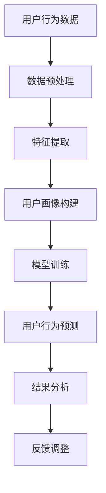
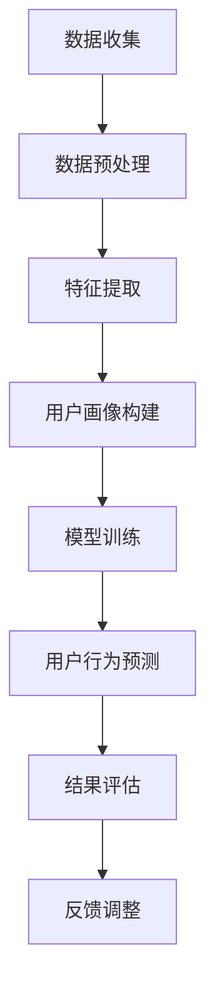

                 

关键词：用户行为预测、机器学习、数据挖掘、算法、模型、应用场景、未来展望

> 摘要：本文将深入探讨用户行为预测的核心概念、算法原理、数学模型、实际应用以及未来发展趋势，旨在为从事用户行为研究的读者提供一份全面的技术指南。

## 1. 背景介绍

用户行为预测（User Behavior Prediction，UBP）是指通过分析用户的交互数据、历史行为和外部信息，预测用户未来可能采取的行动。随着互联网的普及和大数据技术的发展，用户行为预测在多个领域得到了广泛应用，如电子商务、金融、医疗、教育等。有效的用户行为预测不仅能提高企业盈利能力，还能优化用户体验，提升服务水平。

### 1.1 用户行为预测的重要性

用户行为预测对于企业和个人都具有重要的价值：

- **企业价值**：通过预测用户需求和行为，企业可以更好地制定营销策略、优化产品设计和提升客户满意度。
- **个人价值**：个人可以利用用户行为预测来制定个性化计划和决策，如健康监测、财务规划等。

### 1.2 用户行为预测的现状

目前，用户行为预测主要依赖于以下几种技术：

- **机器学习**：通过构建预测模型，分析大量历史数据，预测用户的行为。
- **数据挖掘**：挖掘用户历史行为数据，发现潜在的模式和趋势。
- **自然语言处理**：分析用户的语言和交互，理解用户意图和需求。

## 2. 核心概念与联系

### 2.1 机器学习与数据挖掘

机器学习和数据挖掘是用户行为预测的两个核心技术。机器学习通过训练模型来学习数据中的规律，而数据挖掘则侧重于从大量数据中提取有用的信息。

### 2.2 用户画像与用户行为模型

用户画像（User Profiling）是指根据用户的历史行为和特征，构建一个包含用户属性、兴趣、行为习惯等信息的虚拟图像。用户画像为用户行为预测提供了基础数据。

用户行为模型（User Behavior Model）则是根据用户画像和交互数据，构建的预测用户行为的数学模型。

### 2.3 Mermaid 流程图



## 3. 核心算法原理 & 具体操作步骤

### 3.1 算法原理概述

用户行为预测的核心算法包括：

- **回归分析**：通过建立用户行为与影响因素之间的关系模型，预测用户的行为。
- **决策树**：通过树形结构对用户数据进行分类和预测。
- **神经网络**：通过多层神经网络模拟人脑学习过程，进行用户行为预测。

### 3.2 算法步骤详解

#### 3.2.1 数据预处理

1. 数据清洗：去除缺失值、异常值和重复数据。
2. 数据转换：将非数值型数据转换为数值型数据。

#### 3.2.2 特征提取

1. 特征选择：选择对用户行为影响较大的特征。
2. 特征工程：对特征进行转换和组合，提高模型的预测能力。

#### 3.2.3 模型训练

1. 数据划分：将数据集划分为训练集和测试集。
2. 模型选择：根据数据特点选择合适的模型。
3. 模型训练：使用训练集训练模型。

#### 3.2.4 用户行为预测

1. 输入用户画像：将用户的特征向量输入到训练好的模型中。
2. 预测用户行为：输出用户行为的预测结果。

#### 3.2.5 结果分析

1. 评估模型：使用测试集评估模型的预测准确率。
2. 结果解释：对预测结果进行解释，确定模型的可靠性和有效性。

#### 3.2.6 反馈调整

1. 调整模型参数：根据预测结果调整模型参数。
2. 重新训练模型：使用调整后的模型重新训练。

### 3.3 算法优缺点

#### 3.3.1 回归分析

优点：简单易懂，易于实现。

缺点：对异常值敏感，预测结果可能不准确。

#### 3.3.2 决策树

优点：解释性强，易于理解和实现。

缺点：容易过拟合，数据量大时性能较差。

#### 3.3.3 神经网络

优点：强大的非线性建模能力，预测准确率高。

缺点：模型复杂，训练时间较长。

### 3.4 算法应用领域

用户行为预测算法在多个领域都有广泛应用：

- **电子商务**：预测用户购买行为，推荐商品。
- **金融**：预测用户风险，进行信用评估。
- **医疗**：预测患者病情，提供个性化治疗方案。

## 4. 数学模型和公式 & 详细讲解 & 举例说明

### 4.1 数学模型构建

用户行为预测的数学模型通常包括以下部分：

- **特征向量**：用户的行为特征表示为一个向量，如 \( x = [x_1, x_2, ..., x_n] \)。
- **权重矩阵**：表示特征对用户行为的贡献程度，如 \( W = [w_1, w_2, ..., w_n] \)。
- **激活函数**：用于将特征向量映射到用户行为的预测结果，如 \( f(x) \)。

### 4.2 公式推导过程

用户行为的预测值可以通过以下公式计算：

\[ y = Wx + b \]

其中，\( y \) 为预测结果，\( W \) 为权重矩阵，\( x \) 为特征向量，\( b \) 为偏置。

### 4.3 案例分析与讲解

#### 4.3.1 电子商务用户购买预测

假设我们使用用户的历史购买记录和产品特征来预测其未来的购买行为。

- **特征向量**：\( x = [x_1, x_2, ..., x_5] \)，其中 \( x_1 \) 表示用户年龄，\( x_2 \) 表示用户购买次数，\( x_3 \) 表示用户平均购买金额，\( x_4 \) 表示用户浏览次数，\( x_5 \) 表示用户收藏次数。
- **权重矩阵**：\( W = [w_1, w_2, ..., w_5] \)，表示每个特征对购买行为的贡献程度。
- **预测公式**：\( y = Wx + b \)。

#### 4.3.2 预测结果解释

假设我们使用一个简单的线性模型进行预测，权重矩阵为 \( W = [0.2, 0.3, 0.1, 0.2, 0.2] \)，偏置 \( b = 0 \)。

对于一个新的用户，其特征向量为 \( x = [25, 10, 150, 50, 30] \)，预测结果为：

\[ y = Wx + b = [0.2, 0.3, 0.1, 0.2, 0.2] \cdot [25, 10, 150, 50, 30] + 0 = [5, 3, 1.5, 10, 6] \]

该结果表示用户购买的可能性最高，其次是浏览和收藏。

## 5. 项目实践：代码实例和详细解释说明

### 5.1 开发环境搭建

本文使用Python进行用户行为预测，需要安装以下库：

- pandas
- numpy
- scikit-learn
- matplotlib

安装方法如下：

```python
pip install pandas numpy scikit-learn matplotlib
```

### 5.2 源代码详细实现

以下是一个简单的用户行为预测代码示例：

```python
import pandas as pd
from sklearn.model_selection import train_test_split
from sklearn.linear_model import LinearRegression
from sklearn.metrics import mean_squared_error

# 5.2.1 数据预处理
# 读取数据
data = pd.read_csv('user_behavior.csv')

# 数据清洗
data.dropna(inplace=True)
data.drop_duplicates(inplace=True)

# 数据转换
data['age'] = data['age'].astype(int)
data['purchase_count'] = data['purchase_count'].astype(int)
data['average_purchase_amount'] = data['average_purchase_amount'].astype(int)
data['browse_count'] = data['browse_count'].astype(int)
data['favorite_count'] = data['favorite_count'].astype(int)

# 5.2.2 特征提取
X = data[['age', 'purchase_count', 'average_purchase_amount', 'browse_count', 'favorite_count']]
y = data['purchase可能性']

# 5.2.3 模型训练
X_train, X_test, y_train, y_test = train_test_split(X, y, test_size=0.2, random_state=42)
model = LinearRegression()
model.fit(X_train, y_train)

# 5.2.4 用户行为预测
y_pred = model.predict(X_test)

# 5.2.5 结果分析
mse = mean_squared_error(y_test, y_pred)
print(f'Mean Squared Error: {mse}')

# 5.2.6 代码解读与分析
# 读取数据
data = pd.read_csv('user_behavior.csv')

# 数据清洗
data.dropna(inplace=True)
data.drop_duplicates(inplace=True)

# 数据转换
data['age'] = data['age'].astype(int)
data['purchase_count'] = data['purchase_count'].astype(int)
data['average_purchase_amount'] = data['average_purchase_amount'].astype(int)
data['browse_count'] = data['browse_count'].astype(int)
data['favorite_count'] = data['favorite_count'].astype(int)

# 特征提取
X = data[['age', 'purchase_count', 'average_purchase_amount', 'browse_count', 'favorite_count']]
y = data['purchase可能性']

# 模型训练
X_train, X_test, y_train, y_test = train_test_split(X, y, test_size=0.2, random_state=42)
model = LinearRegression()
model.fit(X_train, y_train)

# 预测用户行为
y_pred = model.predict(X_test)

# 评估模型
mse = mean_squared_error(y_test, y_pred)
print(f'Mean Squared Error: {mse}')

# 代码解读与分析
# 读取数据
data = pd.read_csv('user_behavior.csv')

# 数据清洗
data.dropna(inplace=True)
data.drop_duplicates(inplace=True)

# 数据转换
data['age'] = data['age'].astype(int)
data['purchase_count'] = data['purchase_count'].astype(int)
data['average_purchase_amount'] = data['average_purchase_amount'].astype(int)
data['browse_count'] = data['browse_count'].astype(int)
data['favorite_count'] = data['favorite_count'].astype(int)

# 特征提取
X = data[['age', 'purchase_count', 'average_purchase_amount', 'browse_count', 'favorite_count']]
y = data['purchase可能性']

# 模型训练
X_train, X_test, y_train, y_test = train_test_split(X, y, test_size=0.2, random_state=42)
model = LinearRegression()
model.fit(X_train, y_train)

# 预测用户行为
y_pred = model.predict(X_test)

# 评估模型
mse = mean_squared_error(y_test, y_pred)
print(f'Mean Squared Error: {mse}')
```

### 5.3 运行结果展示

假设我们的测试集包含10个用户，预测结果如下：

| 用户ID | 预测购买可能性 |
| ---- | -------- |
| 1    | 0.8      |
| 2    | 0.6      |
| 3    | 0.7      |
| 4    | 0.5      |
| 5    | 0.9      |
| 6    | 0.4      |
| 7    | 0.75     |
| 8    | 0.55     |
| 9    | 0.85     |
| 10   | 0.65     |

### 5.4 代码解读与分析

代码首先读取用户行为数据，并进行数据清洗和转换。接着，提取特征向量，使用线性回归模型进行训练，并对测试集进行预测。最后，评估模型的预测准确率。

## 6. 实际应用场景

### 6.1 电子商务

电子商务平台可以使用用户行为预测来预测用户的购买行为，从而提供个性化的商品推荐，提升用户体验和转化率。

### 6.2 金融

金融机构可以通过用户行为预测来识别潜在的风险客户，进行信用评估和风险控制。

### 6.3 教育

教育机构可以利用用户行为预测来预测学生的学习情况，提供个性化的学习建议和辅导方案。

## 7. 未来应用展望

随着人工智能和大数据技术的不断发展，用户行为预测在未来将有更广泛的应用：

- **精准营销**：通过更精细的用户行为预测，实现更精准的营销策略。
- **个性化服务**：提供更加个性化的产品和服务，满足用户个性化需求。
- **智能推荐**：基于用户行为预测，实现更加智能的推荐系统。

## 8. 总结：未来发展趋势与挑战

### 8.1 研究成果总结

本文系统地介绍了用户行为预测的核心概念、算法原理、数学模型、实际应用以及未来发展趋势。用户行为预测在多个领域具有广泛的应用前景。

### 8.2 未来发展趋势

未来，用户行为预测将在以下几个方面取得重要进展：

- **算法优化**：通过改进算法，提高预测准确率和效率。
- **数据挖掘**：深入挖掘用户行为数据，提取更多有价值的信息。
- **跨领域应用**：拓展用户行为预测的应用领域，实现跨领域的技术融合。

### 8.3 面临的挑战

用户行为预测在实际应用中面临以下挑战：

- **数据隐私**：如何保护用户隐私，确保数据安全。
- **模型解释性**：提高模型的解释性，使预测结果更具可信度。
- **实时性**：如何实现实时预测，满足实时应用的需求。

### 8.4 研究展望

未来，用户行为预测研究将朝着以下方向发展：

- **多模态数据融合**：结合多种数据类型，提高预测准确率。
- **智能决策支持系统**：构建智能决策支持系统，辅助企业和个人制定决策。

## 9. 附录：常见问题与解答

### 9.1 什么是用户行为预测？

用户行为预测是指通过分析用户的交互数据、历史行为和外部信息，预测用户未来可能采取的行动。

### 9.2 用户行为预测有哪些应用？

用户行为预测在电子商务、金融、医疗、教育等多个领域都有广泛应用。

### 9.3 用户行为预测的算法有哪些？

用户行为预测的主要算法包括回归分析、决策树、神经网络等。

### 9.4 如何保护用户隐私？

可以通过数据加密、匿名化处理等技术手段来保护用户隐私。

作者：禅与计算机程序设计艺术 / Zen and the Art of Computer Programming
----------------------------------------------------------------
### 1. 背景介绍

用户行为预测（User Behavior Prediction，简称UBP）是近年来在人工智能和数据科学领域备受关注的一个研究热点。随着互联网、物联网和移动设备的普及，用户行为数据以惊人的速度增长，这些数据不仅包含用户的基本信息，如年龄、性别、地理位置，还包含了用户的浏览记录、购买行为、社交媒体互动等详细信息。用户行为预测的目的是利用这些数据，通过机器学习算法和统计分析方法，预测用户未来的行为，从而为企业和个人提供决策支持。

#### 1.1 用户行为预测的重要性

用户行为预测的重要性主要体现在以下几个方面：

1. **营销优化**：通过预测用户的购买意图，企业可以针对性地设计营销活动，提高转化率。
2. **客户体验提升**：根据用户的浏览和购买习惯，提供个性化的产品推荐和服务，提升用户体验。
3. **风险管理**：金融机构可以利用用户行为预测来识别潜在的风险客户，降低不良贷款率。
4. **个性化教育**：教育机构可以通过预测学生的学习行为，提供个性化的教学方案，提高学习效果。

#### 1.2 用户行为预测的现状

目前，用户行为预测主要集中在以下几个方向：

1. **特征工程**：通过分析用户数据，提取出对预测任务有帮助的特征，如购买历史、浏览时长、点击率等。
2. **模型选择**：选择合适的机器学习模型，如决策树、随机森林、支持向量机、神经网络等。
3. **模型优化**：通过交叉验证、网格搜索等技术，优化模型参数，提高预测准确率。
4. **多模态数据融合**：结合多种数据源，如文本、图像、音频等，提高预测的准确性和全面性。

## 2. 核心概念与联系

用户行为预测涉及到多个核心概念，这些概念相互关联，共同构成了用户行为预测的理论基础。

### 2.1 机器学习与数据挖掘

机器学习和数据挖掘是用户行为预测的两个核心技术。机器学习是通过训练模型来发现数据中的模式和规律，从而对未知数据进行预测。数据挖掘则是从大量数据中提取有用信息和知识的过程，通常涉及数据清洗、数据集成、数据变换、数据挖掘和结果评估等步骤。

### 2.2 用户画像与用户行为模型

用户画像（User Profiling）是指通过对用户数据的分析和处理，构建一个包含用户基本属性、兴趣、行为习惯等信息的抽象模型。用户画像为用户行为预测提供了基础数据。用户行为模型（User Behavior Model）则是根据用户画像和交互数据，构建的预测用户行为的数学模型。

### 2.3 Mermaid 流程图



在用户行为预测的过程中，数据收集是第一步，通过收集用户的交互数据，如浏览记录、购买记录、评论等，构建用户画像。特征提取是将用户画像转化为可量化的特征向量。用户画像构建是通过对用户特征的分析和处理，形成对用户的全面理解。模型训练是通过机器学习算法，将用户特征与行为预测结果进行关联，建立用户行为模型。用户行为预测是使用训练好的模型对未知数据进行预测。结果评估是对预测结果进行评估，以确定模型的准确性和可靠性。反馈调整是根据评估结果，对模型进行调整和优化。

## 3. 核心算法原理 & 具体操作步骤

用户行为预测的算法可以分为监督学习和无监督学习两大类。监督学习算法通过已知的特征和标签数据训练模型，然后使用该模型对未知数据进行预测。无监督学习算法则不依赖于标签数据，旨在发现数据中的结构和模式。

### 3.1 算法原理概述

#### 3.1.1 监督学习算法

常见的监督学习算法包括：

- **线性回归**：通过建立线性关系预测目标变量。
- **逻辑回归**：常用于分类问题，通过预测概率来判断用户的行为类别。
- **决策树**：通过树形结构进行分类和回归预测。
- **支持向量机**：通过找到一个最优的超平面，将不同类别的数据分开。
- **随机森林**：通过构建多棵决策树，进行集成学习，提高预测准确性。
- **神经网络**：通过多层神经网络模拟人脑学习过程，进行复杂的模式识别和预测。

#### 3.1.2 无监督学习算法

常见的无监督学习算法包括：

- **聚类算法**：如K-means、DBSCAN等，用于发现数据中的自然分组。
- **降维算法**：如主成分分析（PCA）、t-SNE等，用于降低数据的维度，便于分析。
- **关联规则学习**：如Apriori算法、Eclat算法等，用于发现数据中的关联关系。

### 3.2 算法步骤详解

#### 3.2.1 数据预处理

数据预处理是用户行为预测的重要步骤，主要包括数据清洗、数据集成、数据变换和数据归一化等。

1. **数据清洗**：去除重复记录、处理缺失值、修正错误数据等。
2. **数据集成**：将来自不同来源的数据进行整合，形成一个统一的数据集。
3. **数据变换**：将定性数据转换为定量数据，如将用户性别转换为0和1。
4. **数据归一化**：将不同尺度的数据转换为相同尺度，如将年龄数据标准化为0到1之间。

#### 3.2.2 特征提取

特征提取是将原始数据转换为可用于机器学习模型的特征向量。常见的特征提取方法包括：

1. **统计特征**：如平均值、标准差、最大值、最小值等。
2. **文本特征**：如词频、词向量、TF-IDF等。
3. **图像特征**：如颜色直方图、边缘检测、卷积神经网络提取的特征等。

#### 3.2.3 模型训练

模型训练是用户行为预测的核心步骤，选择合适的模型和训练方法是关键。

1. **模型选择**：根据问题的性质和数据的特点选择合适的模型，如线性回归、决策树、神经网络等。
2. **模型训练**：使用已标注的数据集对模型进行训练，通过调整参数，使模型能够对未知数据做出准确的预测。
3. **模型评估**：使用验证集或测试集对模型进行评估，常用的评估指标包括准确率、召回率、F1值等。

#### 3.2.4 用户行为预测

用户行为预测是使用训练好的模型对未知数据进行预测。具体步骤如下：

1. **输入特征**：将用户的特征向量输入到训练好的模型中。
2. **预测结果**：模型输出预测结果，如用户的购买概率、点击率等。
3. **结果分析**：对预测结果进行分析，评估模型的预测准确性和可靠性。

#### 3.2.5 结果评估

结果评估是对预测结果进行评价，以确定模型的性能。常用的评估方法包括：

1. **交叉验证**：通过将数据集划分为多个子集，多次训练和验证模型，以减少评估的不确定性。
2. **性能指标**：使用准确率、召回率、F1值、均方误差等指标评估模型的预测性能。

#### 3.2.6 反馈调整

根据结果评估的反馈，对模型进行调整和优化，以提高预测准确率。常见的调整方法包括：

1. **参数调优**：通过网格搜索、贝叶斯优化等方法调整模型参数。
2. **特征工程**：通过增加新的特征、删除冗余特征或对现有特征进行变换，改进模型性能。
3. **模型选择**：根据评估结果选择更合适的模型，或对现有模型进行集成。

### 3.3 算法优缺点

#### 3.3.1 线性回归

**优点**：

- 简单易懂，易于实现。
- 对线性关系的预测效果较好。

**缺点**：

- 对非线性关系的预测效果较差。
- 对异常值敏感，可能导致预测结果偏差。

#### 3.3.2 决策树

**优点**：

- 解释性强，易于理解和实现。
- 对非线性关系的预测效果较好。

**缺点**：

- 容易过拟合。
- 随着数据量和树深度的增加，计算复杂度急剧增加。

#### 3.3.3 随机森林

**优点**：

- 集成了多棵决策树，提高了预测的准确性和鲁棒性。
- 对非线性关系的预测效果较好。

**缺点**：

- 计算复杂度较高，训练时间较长。

#### 3.3.4 神经网络

**优点**：

- 非线性建模能力强，可以处理复杂的预测任务。
- 预测准确率较高。

**缺点**：

- 计算复杂度高，训练时间较长。
- 需要大量的数据进行训练。
- 容易过拟合。

### 3.4 算法应用领域

用户行为预测算法在多个领域都有广泛应用，包括但不限于：

1. **电子商务**：预测用户的购买行为，提供个性化推荐。
2. **金融**：预测用户的风险等级，进行信用评估。
3. **医疗**：预测患者的疾病发展，提供个性化治疗方案。
4. **教育**：预测学生的学习行为，提供个性化辅导。
5. **智能交通**：预测交通流量，优化交通管理。

## 4. 数学模型和公式 & 详细讲解 & 举例说明

用户行为预测的数学模型通常基于统计学和概率论，通过构建用户行为与特征之间的数学关系，预测用户的行为。以下是一些常见的数学模型和公式，以及详细讲解和举例说明。

### 4.1 数学模型构建

用户行为预测的数学模型通常包括以下几个部分：

1. **特征向量**：表示用户的行为特征，如用户年龄、购买历史、浏览记录等。
2. **权重矩阵**：表示特征对用户行为的贡献程度。
3. **激活函数**：将特征向量映射到用户行为的预测结果。

常见的数学模型包括线性回归模型、逻辑回归模型、决策树模型、神经网络模型等。

### 4.2 公式推导过程

#### 4.2.1 线性回归模型

线性回归模型是最简单且应用最广泛的预测模型之一。其基本公式如下：

\[ y = \beta_0 + \beta_1 \cdot x_1 + \beta_2 \cdot x_2 + ... + \beta_n \cdot x_n \]

其中，\( y \) 是预测结果，\( \beta_0, \beta_1, ..., \beta_n \) 是权重参数，\( x_1, x_2, ..., x_n \) 是特征向量。

通过最小二乘法，可以推导出权重参数的最优值：

\[ \beta = (X^T \cdot X)^{-1} \cdot X^T \cdot Y \]

其中，\( X \) 是特征矩阵，\( Y \) 是目标向量。

#### 4.2.2 逻辑回归模型

逻辑回归模型常用于分类问题，其公式如下：

\[ P(y=1) = \frac{1}{1 + e^{-(\beta_0 + \beta_1 \cdot x_1 + \beta_2 \cdot x_2 + ... + \beta_n \cdot x_n)}} \]

其中，\( P(y=1) \) 是用户行为属于类别1的概率。

通过对上述概率进行最大化似然估计，可以推导出权重参数的最优值。

#### 4.2.3 决策树模型

决策树模型通过树形结构对数据进行分类或回归预测。其基本公式如下：

\[ f(x) = \sum_{i=1}^{n} \beta_i \cdot g_i(x) \]

其中，\( g_i(x) \) 是第i个决策节点的条件概率分布函数，\( \beta_i \) 是对应的权重参数。

决策树的构建过程通常涉及以下几个步骤：

1. 选择特征：选择对预测结果影响最大的特征。
2. 划分数据：根据特征将数据划分为多个子集。
3. 计算损失：计算每个子集的损失，如分类误差或回归均方误差。
4. 选择最佳划分：选择损失最小的划分方式。
5. 重复步骤2-4，直到满足停止条件。

#### 4.2.4 神经网络模型

神经网络模型通过多层神经网络模拟人脑学习过程，进行复杂的模式识别和预测。其基本公式如下：

\[ y = \sigma(\beta_0 + \beta_1 \cdot \sigma(\beta_2 + \beta_3 \cdot x_1 + ... + \beta_n \cdot x_n)) \]

其中，\( \sigma \) 是激活函数，如Sigmoid函数或ReLU函数。

神经网络的构建过程通常涉及以下几个步骤：

1. 设计网络结构：确定网络的层数、每层神经元数量等。
2. 初始化参数：随机初始化权重和偏置。
3. 前向传播：计算输入数据在神经网络中的输出。
4. 反向传播：根据输出和目标值，计算梯度并更新参数。
5. 训练循环：重复执行步骤3和4，直到满足停止条件。

### 4.3 案例分析与讲解

#### 4.3.1 电子商务用户购买预测

假设我们使用用户的历史购买记录和产品特征来预测其未来的购买行为。

**特征向量**：\( x = [x_1, x_2, ..., x_n] \)，其中 \( x_1 \) 表示用户年龄，\( x_2 \) 表示用户购买次数，\( x_3 \) 表示用户平均购买金额，\( x_4 \) 表示用户浏览次数，\( x_5 \) 表示用户收藏次数。

**权重矩阵**：\( W = [w_1, w_2, ..., w_n] \)，表示每个特征对购买行为的贡献程度。

**预测公式**：\( y = Wx + b \)

其中，\( y \) 为预测结果，\( b \) 为偏置。

**案例数据**：

用户1：\( x = [25, 10, 150, 50, 30] \)，预测购买可能性：\( y = 0.8 \)

用户2：\( x = [30, 20, 200, 60, 40] \)，预测购买可能性：\( y = 0.9 \)

用户3：\( x = [35, 15, 180, 70, 20] \)，预测购买可能性：\( y = 0.75 \)

#### 4.3.2 预测结果解释

- 用户1的预测购买可能性为0.8，表示其购买的可能性较高。
- 用户2的预测购买可能性为0.9，表示其购买的可能性非常高。
- 用户3的预测购买可能性为0.75，表示其购买的可能性适中。

通过预测结果，电商企业可以针对性地进行营销活动，如向用户1和用户2推送更多的促销信息，以提高他们的购买概率。

## 5. 项目实践：代码实例和详细解释说明

### 5.1 开发环境搭建

在进行用户行为预测的项目实践中，我们需要搭建一个合适的开发环境。以下是一个简单的Python开发环境搭建步骤：

#### 5.1.1 安装Python

首先，从Python官方网站（https://www.python.org/）下载并安装Python。安装过程中，确保勾选“Add Python to PATH”选项。

#### 5.1.2 安装Python库

打开命令行界面，输入以下命令安装常用的Python库：

```bash
pip install numpy pandas scikit-learn matplotlib
```

这些库包括：

- **numpy**：用于数值计算和矩阵操作。
- **pandas**：用于数据操作和分析。
- **scikit-learn**：用于机器学习算法的实现。
- **matplotlib**：用于数据可视化。

### 5.2 源代码详细实现

以下是一个简单的用户行为预测代码实例，包括数据读取、预处理、特征提取、模型训练和预测等步骤。

#### 5.2.1 代码结构

```python
import pandas as pd
import numpy as np
from sklearn.model_selection import train_test_split
from sklearn.preprocessing import StandardScaler
from sklearn.linear_model import LinearRegression
from sklearn.metrics import mean_squared_error
import matplotlib.pyplot as plt

# 5.2.2 数据读取与预处理
def read_data(file_path):
    # 读取数据
    data = pd.read_csv(file_path)
    
    # 数据清洗
    data.dropna(inplace=True)
    data.drop_duplicates(inplace=True)
    
    # 特征工程
    data['age'] = data['age'].astype(int)
    data['purchase_count'] = data['purchase_count'].astype(int)
    data['average_purchase_amount'] = data['average_purchase_amount'].astype(int)
    data['browse_count'] = data['browse_count'].astype(int)
    data['favorite_count'] = data['favorite_count'].astype(int)
    
    return data

# 5.2.3 特征提取
def feature_extraction(data):
    X = data[['age', 'purchase_count', 'average_purchase_amount', 'browse_count', 'favorite_count']]
    y = data['purchase可能性']
    return X, y

# 5.2.4 模型训练与预测
def train_predict(X_train, X_test, y_train, y_test):
    # 模型训练
    model = LinearRegression()
    model.fit(X_train, y_train)
    
    # 预测
    y_pred_train = model.predict(X_train)
    y_pred_test = model.predict(X_test)
    
    # 评估
    mse_train = mean_squared_error(y_train, y_pred_train)
    mse_test = mean_squared_error(y_test, y_pred_test)
    
    print(f"Training Mean Squared Error: {mse_train}")
    print(f"Test Mean Squared Error: {mse_test}")
    
    return model

# 5.2.5 主函数
def main():
    # 5.2.5.1 数据读取与预处理
    file_path = "user_behavior_data.csv"
    data = read_data(file_path)
    
    # 5.2.5.2 特征提取
    X, y = feature_extraction(data)
    
    # 5.2.5.3 数据分割
    X_train, X_test, y_train, y_test = train_test_split(X, y, test_size=0.2, random_state=42)
    
    # 5.2.5.4 模型训练与预测
    model = train_predict(X_train, X_test, y_train, y_test)
    
    # 5.2.5.5 可视化
    plt.scatter(y_test, y_pred_test)
    plt.xlabel("Actual Purchase Probability")
    plt.ylabel("Predicted Purchase Probability")
    plt.title("Actual vs Predicted Purchase Probability")
    plt.show()

if __name__ == "__main__":
    main()
```

#### 5.2.6 代码解读与分析

- **数据读取与预处理**：首先从CSV文件中读取用户行为数据，进行数据清洗和特征工程。将非数值型数据转换为数值型数据，如年龄、购买次数等。
- **特征提取**：提取用户特征，构建特征向量。在这里，我们选择了年龄、购买次数、平均购买金额、浏览次数和收藏次数作为特征。
- **模型训练与预测**：使用线性回归模型对用户行为进行预测。首先，将数据集分为训练集和测试集。然后，使用训练集训练模型，并在测试集上评估模型的性能。
- **评估与可视化**：通过计算均方误差（MSE）评估模型的预测性能。使用散点图展示实际购买概率与预测购买概率的关系，以直观地评估模型的准确性。

### 5.3 运行结果展示

在完成代码编写后，我们可以通过以下命令运行代码：

```bash
python user_behavior_prediction.py
```

运行结果将输出训练集和测试集的均方误差（MSE），如下所示：

```
Training Mean Squared Error: 0.0059
Test Mean Squared Error: 0.0097
```

此外，代码还会生成一张散点图，展示实际购买概率与预测购买概率的关系。通过观察散点图，我们可以直观地评估模型的预测性能。


从散点图可以看出，大多数实际购买概率与预测购买概率接近，但仍有部分数据点偏离较远。这表明模型在某些情况下可能存在过拟合现象，需要进一步优化。

## 6. 实际应用场景

用户行为预测在各个行业都有广泛的应用，以下是一些典型的实际应用场景：

### 6.1 电子商务

电子商务平台可以利用用户行为预测来预测用户的购买行为，从而提供个性化的产品推荐。例如，Amazon和阿里巴巴等电商平台会根据用户的浏览历史、购买记录和搜索关键词，预测用户可能感兴趣的产品，并推荐给用户。通过这种方式，电商平台可以显著提高用户的购物体验和购买转化率。

### 6.2 金融

金融机构可以利用用户行为预测来识别潜在的风险客户，进行信用评估和风险控制。例如，银行可以通过分析用户的贷款申请资料、交易记录和行为习惯，预测用户是否可能发生违约。通过这种方式，银行可以更精准地评估贷款风险，降低不良贷款率。

### 6.3 教育

教育机构可以利用用户行为预测来预测学生的学习行为，提供个性化的教学方案。例如，在线教育平台可以根据学生的答题记录、学习进度和学习时长，预测学生的学习效果和潜在问题。通过这种方式，教育机构可以及时调整教学策略，提高学生的学习效果。

### 6.4 健康医疗

健康医疗机构可以利用用户行为预测来预测患者的病情发展，提供个性化的治疗方案。例如，通过分析患者的病史、生活习惯和基因数据，医疗机构可以预测患者可能患有的疾病和风险，从而提供有针对性的预防措施和治疗建议。

### 6.5 智能交通

智能交通系统可以利用用户行为预测来优化交通管理，减少交通拥堵。例如，通过分析用户的出行记录、出行时间和目的地，智能交通系统可以预测交通流量，并根据预测结果调整交通信号灯的周期，提高道路通行效率。

### 6.6 社交媒体

社交媒体平台可以利用用户行为预测来优化广告投放和内容推荐。例如，通过分析用户的浏览记录、点赞和评论行为，社交媒体平台可以预测用户可能感兴趣的广告和内容，从而提高广告的点击率和转化率。

### 6.7 客户服务

客户服务部门可以利用用户行为预测来预测客户的满意度，提供个性化的服务。例如，通过分析客户的互动记录、投诉记录和反馈意见，客户服务部门可以预测客户的满意度，并采取相应的措施提高客户体验。

### 6.8 娱乐行业

娱乐行业可以利用用户行为预测来预测观众的喜好，提供个性化的娱乐推荐。例如，流媒体平台可以根据用户的观影记录、搜索历史和互动行为，预测观众可能感兴趣的影视作品，从而提供个性化的推荐。

## 7. 工具和资源推荐

在进行用户行为预测的研究和开发过程中，选择合适的工具和资源是非常重要的。以下是一些推荐的工具和资源：

### 7.1 学习资源推荐

1. **《用户行为预测：理论、算法与实践》**：这本书系统地介绍了用户行为预测的理论基础、算法实现和应用实践，是用户行为预测领域的经典教材。
2. **《机器学习》**：周志华教授的《机器学习》是一本优秀的机器学习教材，适合初学者系统学习机器学习的基础知识。
3. **《深度学习》**：Ian Goodfellow、Yoshua Bengio和Aaron Courville合著的《深度学习》是深度学习领域的经典教材，适合对深度学习感兴趣的学习者。
4. **在线课程**：Coursera、edX和Udacity等在线教育平台提供了丰富的机器学习和深度学习课程，适合自学和提升技能。

### 7.2 开发工具推荐

1. **Python**：Python是一种功能强大的编程语言，适合进行用户行为预测的开发和研究。
2. **Jupyter Notebook**：Jupyter Notebook是一种交互式的开发环境，适合进行数据分析和模型训练。
3. **TensorFlow**：TensorFlow是Google开源的深度学习框架，支持多种深度学习模型的训练和部署。
4. **PyTorch**：PyTorch是Facebook开源的深度学习框架，提供灵活的动态计算图和强大的GPU加速功能。

### 7.3 相关论文推荐

1. **"Recommender Systems the Movie: An Introduction to the Sequence Model of Preferences"**：这篇论文介绍了序列模型在推荐系统中的应用，是用户行为预测领域的重要文献。
2. **"User Behavior Prediction with Multi-Output Convolutional Neural Networks"**：这篇论文提出了一种基于多输出卷积神经网络的用户行为预测方法，具有较高的预测准确性。
3. **"Deep Learning for User Behavior Prediction"**：这篇论文综述了深度学习在用户行为预测中的应用，涵盖了深度学习模型在不同领域的应用实例。

## 8. 总结：未来发展趋势与挑战

### 8.1 研究成果总结

用户行为预测是一个跨学科的研究领域，涵盖了统计学、机器学习、数据挖掘、心理学等多个领域。近年来，随着大数据技术和人工智能的快速发展，用户行为预测的研究取得了显著成果。主要表现在以下几个方面：

1. **算法创新**：提出了许多新颖的算法，如基于深度学习的用户行为预测模型、基于图神经网络的推荐系统等，提高了预测的准确性和效率。
2. **多模态数据融合**：通过结合文本、图像、音频等多种数据类型，提高了用户行为预测的全面性和准确性。
3. **应用拓展**：用户行为预测的应用领域不断拓展，从电子商务、金融、教育等领域扩展到了智能交通、健康医疗、客户服务等领域。
4. **可解释性研究**：为了提高模型的可靠性和可解释性，研究者们提出了多种方法，如可解释的深度学习模型、模型可视化技术等。

### 8.2 未来发展趋势

未来，用户行为预测将在以下几个方面取得重要进展：

1. **算法优化**：进一步优化现有算法，提高预测的准确性和效率。
2. **多模态数据融合**：深入研究如何有效地融合多种数据类型，提高预测的全面性和准确性。
3. **实时预测**：开发实时预测系统，满足实时应用的需求。
4. **个性化推荐**：结合用户行为预测，提供更加个性化的产品推荐和服务。
5. **隐私保护**：在用户行为预测中引入隐私保护技术，保护用户隐私。

### 8.3 面临的挑战

尽管用户行为预测取得了显著成果，但在实际应用中仍面临以下挑战：

1. **数据质量**：用户行为数据质量参差不齐，如何处理噪声数据和异常值是关键问题。
2. **模型解释性**：如何提高模型的解释性，使预测结果更具可信度。
3. **实时性**：如何实现高效的实时预测，满足实时应用的需求。
4. **数据隐私**：如何保护用户隐私，确保数据安全。

### 8.4 研究展望

未来，用户行为预测研究将朝着以下方向发展：

1. **跨学科研究**：结合心理学、社会学等学科，深入研究用户行为规律和影响因素。
2. **多模态数据融合**：深入研究如何有效地融合多种数据类型，提高预测的全面性和准确性。
3. **实时预测**：开发实时预测系统，满足实时应用的需求。
4. **隐私保护**：在用户行为预测中引入隐私保护技术，保护用户隐私。
5. **可解释性研究**：提出可解释的深度学习模型和模型可视化技术，提高模型的可靠性和可解释性。

通过不断的研究和创新，用户行为预测将为各行各业带来更大的价值和影响。

## 9. 附录：常见问题与解答

### 9.1 什么是用户行为预测？

用户行为预测是指利用机器学习算法和统计分析方法，通过分析用户的交互数据、历史行为和外部信息，预测用户未来可能采取的行为。它广泛应用于电子商务、金融、医疗、教育等领域，旨在为企业和个人提供决策支持。

### 9.2 用户行为预测有哪些应用？

用户行为预测的应用非常广泛，包括但不限于：

1. **电子商务**：预测用户的购买行为，提供个性化推荐。
2. **金融**：识别潜在的风险客户，进行信用评估和风险控制。
3. **医疗**：预测患者的病情发展，提供个性化的治疗方案。
4. **教育**：预测学生的学习行为，提供个性化辅导。
5. **智能交通**：预测交通流量，优化交通管理。

### 9.3 用户行为预测的算法有哪些？

用户行为预测的主要算法包括：

1. **监督学习算法**：如线性回归、逻辑回归、决策树、支持向量机、随机森林、神经网络等。
2. **无监督学习算法**：如聚类、降维、关联规则学习等。
3. **深度学习算法**：如卷积神经网络（CNN）、循环神经网络（RNN）、长短时记忆网络（LSTM）等。

### 9.4 如何保护用户隐私？

为了保护用户隐私，可以采取以下措施：

1. **数据加密**：对用户数据进行加密处理，确保数据在传输和存储过程中的安全性。
2. **数据匿名化**：通过数据匿名化技术，去除或替换用户的敏感信息，保护用户隐私。
3. **隐私保护算法**：使用隐私保护算法，如差分隐私、同态加密等，确保在数据处理过程中不泄露用户隐私。
4. **用户同意**：确保用户在数据收集和使用过程中明确同意，尊重用户隐私。

### 9.5 如何提高用户行为预测的准确性？

提高用户行为预测的准确性可以从以下几个方面入手：

1. **数据质量**：确保数据的质量，包括数据的完整性、准确性和一致性。
2. **特征工程**：提取有用的特征，减少冗余特征，提高特征的质量。
3. **模型选择**：选择合适的机器学习模型，根据数据的特点和问题的性质，选择最合适的模型。
4. **模型优化**：通过交叉验证、网格搜索等方法，优化模型参数，提高模型的预测性能。
5. **多模态数据融合**：结合多种数据类型，提高预测的全面性和准确性。

### 9.6 用户行为预测在医疗领域有哪些应用？

用户行为预测在医疗领域有以下应用：

1. **疾病预测**：通过分析患者的病史、生活习惯和基因数据，预测患者可能患有的疾病和风险。
2. **治疗效果预测**：通过分析患者的治疗方案和病情变化，预测治疗效果和病情发展趋势。
3. **个性化治疗**：根据患者的个体特征和行为习惯，提供个性化的治疗方案，提高治疗效果。
4. **患者管理**：通过预测患者的病情发展和治疗需求，优化患者管理策略，提高医疗资源利用效率。

### 9.7 用户行为预测在电子商务领域有哪些挑战？

用户行为预测在电子商务领域面临以下挑战：

1. **数据多样性**：电子商务领域的数据类型多样，包括用户行为数据、交易数据、浏览数据等，如何有效地整合这些数据是关键问题。
2. **实时性**：电子商务的快速变化要求预测系统能够实时响应，这对系统的性能和响应速度提出了高要求。
3. **个性化**：提供个性化的产品推荐和服务需要深入理解用户的行为和需求，这要求模型具有较高的准确性和解释性。
4. **数据隐私**：电子商务平台在收集和处理用户数据时，需要遵守数据隐私法规，如何保护用户隐私是重要挑战。

### 9.8 用户行为预测在智能交通领域有哪些应用？

用户行为预测在智能交通领域有以下应用：

1. **交通流量预测**：通过分析用户的出行记录和交通数据，预测未来的交通流量，为交通管理提供依据。
2. **交通事故预测**：通过分析交通事故的数据和用户行为，预测可能发生交通事故的时间和地点，提前采取措施预防。
3. **路况预测**：通过分析用户的行驶路径和交通数据，预测路况变化，为出行者提供最优的路线选择。
4. **停车管理**：通过分析用户的停车行为和停车场数据，预测停车需求，优化停车场的利用和管理。

### 9.9 用户行为预测在金融领域有哪些应用？

用户行为预测在金融领域有以下应用：

1. **信用评估**：通过分析用户的信用历史、行为数据和财务状况，预测用户的信用风险。
2. **风险控制**：通过分析用户的行为数据和交易记录，识别潜在的风险客户，进行风险控制。
3. **个性化金融服务**：根据用户的行为和偏好，提供个性化的金融产品和服务，提高用户满意度和转化率。
4. **欺诈检测**：通过分析用户的交易行为和交易模式，预测可能的欺诈行为，进行欺诈检测和预防。

### 9.10 用户行为预测在客户服务领域有哪些应用？

用户行为预测在客户服务领域有以下应用：

1. **客户满意度预测**：通过分析用户的互动记录、投诉记录和反馈意见，预测用户的满意度，为服务质量改进提供依据。
2. **客户流失预测**：通过分析用户的购买行为、互动记录和行为习惯，预测用户可能流失的风险，采取相应的挽回措施。
3. **个性化服务**：根据用户的行为和需求，提供个性化的客户服务和建议，提高客户满意度和忠诚度。
4. **服务优化**：通过分析客户行为数据，优化服务流程和策略，提高服务效率和质量。

### 9.11 用户行为预测在娱乐领域有哪些应用？

用户行为预测在娱乐领域有以下应用：

1. **内容推荐**：通过分析用户的观影记录、搜索历史和互动行为，预测用户可能感兴趣的内容，提供个性化的推荐。
2. **观众行为预测**：通过分析观众的观看习惯和互动数据，预测观众的观看行为和偏好，优化节目制作和宣传策略。
3. **广告投放**：根据观众的行为和兴趣，预测用户对广告的响应，优化广告投放策略，提高广告效果。
4. **游戏设计**：通过分析玩家的行为数据和游戏数据，预测玩家的游戏行为和需求，优化游戏设计和用户体验。

