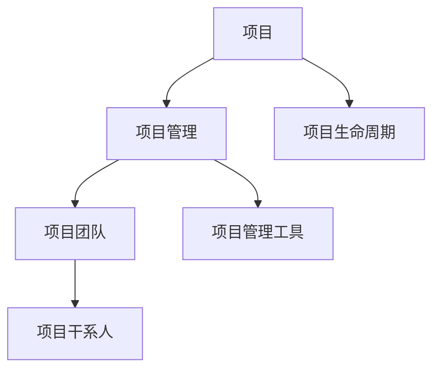
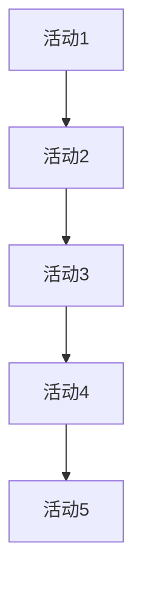

                 

关键词：项目管理、团队协作、有效管理、目标设定、任务分配、资源优化、风险控制

摘要：本文将探讨项目管理的重要性和如何通过科学的流程和工具，有效地管理项目和团队。文章首先介绍了项目管理的背景和核心概念，然后详细阐述了项目管理的各个环节，包括目标设定、任务分配、资源优化、风险控制等。通过实际案例的分析，本文展示了如何将理论应用于实践，最后对项目管理工具和未来发展趋势进行了总结。

## 1. 背景介绍

项目管理是确保项目按计划完成的重要活动。无论是大型企业项目，还是小型团队任务，项目管理都是确保项目成功的关键因素。随着信息技术的飞速发展，项目管理也变得更加复杂和多样化。项目管理者需要具备跨学科的知识和技能，包括技术、管理、沟通等。

本文将从以下几个方面展开：

1. 核心概念与联系
2. 核心算法原理与具体操作步骤
3. 数学模型和公式
4. 项目实践：代码实例
5. 实际应用场景
6. 工具和资源推荐
7. 未来发展趋势与挑战

## 2. 核心概念与联系

为了更好地理解项目管理，我们需要先了解一些核心概念。以下是项目管理中常用的几个核心概念：

### 2.1 项目

项目是临时性的工作，有明确的开始和结束时间，目标是创造一个独特的输出。与运营活动不同，项目具有一次性、独特性和目标明确性的特点。

### 2.2 项目管理

项目管理是确保项目成功完成的一系列活动和过程。它包括计划、组织、协调、控制和执行等环节。

### 2.3 项目团队

项目团队是由不同领域专家组成，共同完成项目任务的团队。团队成员通常具有互补的技能和知识。

### 2.4 项目干系人

项目干系人是对项目有直接或间接利益的相关方，包括项目发起人、客户、利益相关者等。

### 2.5 项目生命周期

项目生命周期是项目从启动到完成的全过程，通常包括启动、规划、执行、监控和收尾等阶段。

### 2.6 项目管理工具

项目管理工具包括各种软件和平台，如项目管理软件、时间跟踪工具、协作工具等，用于提高项目管理的效率和效果。

### 2.7 核心概念架构

以下是核心概念架构的 Mermaid 流程图：



## 3. 核心算法原理 & 具体操作步骤

### 3.1 算法原理概述

项目管理中的核心算法包括关键路径法（Critical Path Method，CPM）和项目评估与审查技术（Project Evaluation and Review Technique，PERT）。这些算法用于项目规划、进度控制和风险分析。

### 3.2 算法步骤详解

#### 关键路径法（CPM）

1. 确定项目任务和活动
2. 绘制项目网络图
3. 计算各活动的最早开始时间（Earliest Start Time，EST）和最早完成时间（Earliest Finish Time，EFT）
4. 计算各活动的最晚开始时间（Latest Start Time，LST）和最晚完成时间（Latest Finish Time，LFT）
5. 计算各活动的总浮动时间（Total Float Time，TFT）
6. 确定关键路径

#### 项目评估与审查技术（PERT）

1. 确定项目任务和活动
2. 绘制项目网络图
3. 为每个活动分配三种时间估计：乐观时间（Optimistic Time，O）、最可能时间（Most Likely Time，M）和悲观时间（Pessimistic Time，P）
4. 计算每个活动的期望时间（Expected Time，E）
5. 计算每个活动的方差和标准差
6. 确定关键路径

### 3.3 算法优缺点

#### 关键路径法（CPM）

**优点：**
- 简单易懂，易于计算
- 可以确定项目最短完成时间

**缺点：**
- 忽略了活动的随机性和不确定性
- 不适用于复杂的项目

#### 项目评估与审查技术（PERT）

**优点：**
- 考虑了活动的随机性和不确定性
- 可以用于风险分析

**缺点：**
- 计算过程较为复杂
- 不适用于所有类型的项目

### 3.4 算法应用领域

CPM和PERT广泛应用于项目规划、进度控制和风险分析。在实际应用中，根据项目的特点和需求，可以选择适合的算法。

## 4. 数学模型和公式

### 4.1 数学模型构建

项目管理中的数学模型主要包括项目网络图、关键路径法（CPM）和项目评估与审查技术（PERT）。

### 4.2 公式推导过程

#### 关键路径法（CPM）

1. 最早开始时间（EST）：

   $$ EST_i = \max(EST_{j-1} + D_{ij}) $$

   其中，$EST_i$ 表示活动 $i$ 的最早开始时间，$EST_{j-1}$ 表示活动 $j-1$ 的最早完成时间，$D_{ij}$ 表示活动 $i$ 和活动 $j$ 之间的持续时间。

2. 最早完成时间（EFT）：

   $$ EFT_i = EST_i + D_i $$

   其中，$EFT_i$ 表示活动 $i$ 的最早完成时间，$D_i$ 表示活动 $i$ 的持续时间。

3. 最晚开始时间（LST）：

   $$ LST_i = \min(EFT_{i+1} - D_i) $$

   其中，$LST_i$ 表示活动 $i$ 的最晚开始时间，$EFT_{i+1}$ 表示活动 $i+1$ 的最早完成时间。

4. 最晚完成时间（LFT）：

   $$ LFT_i = LST_i + D_i $$

   其中，$LFT_i$ 表示活动 $i$ 的最晚完成时间。

5. 总浮动时间（TFT）：

   $$ TFT_i = LFT_i - EFT_i $$

   其中，$TFT_i$ 表示活动 $i$ 的总浮动时间。

#### 项目评估与审查技术（PERT）

1. 期望时间（E）：

   $$ E_i = \frac{O_i + 4M_i + P_i}{6} $$

   其中，$E_i$ 表示活动 $i$ 的期望时间，$O_i$ 表示活动 $i$ 的乐观时间，$M_i$ 表示活动 $i$ 的最可能时间，$P_i$ 表示活动 $i$ 的悲观时间。

2. 方差（V）：

   $$ V_i = \frac{(P_i - O_i)^2}{36} $$

3. 标准差（$\sigma_i$）：

   $$ \sigma_i = \sqrt{V_i} $$

### 4.3 案例分析与讲解

假设有一个简单的项目，包含5个活动，如下图所示：



已知各活动的持续时间如下：

| 活动 | 乐观时间（O） | 最可能时间（M） | 悲观时间（P） |
| ---- | ------------- | ------------- | ------------- |
| A1   | 3             | 5             | 7             |
| A2   | 2             | 3             | 4             |
| A3   | 4             | 5             | 6             |
| A4   | 3             | 4             | 5             |
| A5   | 2             | 3             | 4             |

#### 关键路径法（CPM）

1. 计算最早开始时间和最早完成时间：

   | 活动 | $EST_i$ | $EFT_i$ |
   | ---- | ------- | ------- |
   | A1   | 0       | 3       |
   | A2   | 3       | 6       |
   | A3   | 6       | 11      |
   | A4   | 11      | 16      |
   | A5   | 16      | 20      |

2. 计算最晚开始时间和最晚完成时间：

   | 活动 | $LST_i$ | $LFT_i$ |
   | ---- | ------- | ------- |
   | A1   | 0       | 7       |
   | A2   | 7       | 10      |
   | A3   | 10      | 15      |
   | A4   | 15      | 20      |
   | A5   | 20      | 24      |

3. 计算总浮动时间：

   | 活动 | $TFT_i$ |
   | ---- | ------- |
   | A1   | 7 - 3 = 4 |
   | A2   | 10 - 6 = 4 |
   | A3   | 15 - 11 = 4 |
   | A4   | 20 - 16 = 4 |
   | A5   | 24 - 20 = 4 |

关键路径为 A1 -> A2 -> A3 -> A4 -> A5，总浮动时间为 0。

#### 项目评估与审查技术（PERT）

1. 计算期望时间：

   | 活动 | $E_i$ |
   | ---- | ----- |
   | A1   | 5     |
   | A2   | 3     |
   | A3   | 5     |
   | A4   | 4     |
   | A5   | 3     |

2. 计算方差和标准差：

   | 活动 | $V_i$ | $\sigma_i$ |
   | ---- | ----- | ---------- |
   | A1   | 4     | 2          |
   | A2   | 1     | 1          |
   | A3   | 1     | 1          |
   | A4   | 1     | 1          |
   | A5   | 1     | 1          |

关键路径为 A1 -> A2 -> A3 -> A4 -> A5，标准差为 2。

## 5. 项目实践：代码实例和详细解释说明

在本节中，我们将使用 Python 编写一个简单的项目管理系统，实现关键路径法（CPM）和项目评估与审查技术（PERT）的计算。

### 5.1 开发环境搭建

请确保已安装 Python 3.7 或更高版本。可以使用以下命令安装所需的库：

```bash
pip install matplotlib numpy
```

### 5.2 源代码详细实现

以下是项目的 Python 源代码：

```python
import numpy as np
import matplotlib.pyplot as plt

# 定义活动类
class Activity:
    def __init__(self, name, duration, optimistic, most_likely, pessimistic):
        self.name = name
        self.duration = duration
        self.optimistic = optimistic
        self.most_likely = most_likely
        self.pessimistic = pessimistic

# 计算最早开始时间、最早完成时间、最晚开始时间、最晚完成时间和总浮动时间
def cpm_activities(activities):
    est = np.zeros(len(activities))
    eft = np.zeros(len(activities))
    lft = np.zeros(len(activities))
    tft = np.zeros(len(activities))

    for i in range(1, len(activities)):
        est[i] = max(est[i-1] + activities[i-1].duration, est[i])

    eft[-1] = est[-1] + activities[-1].duration
    for i in range(len(activities)-2, -1, -1):
        lft[i] = min(eft[i+1] - activities[i].duration, lft[i+1])

    tft = lft - eft

    return est, eft, lft, tft

# 计算期望时间、方差和标准差
def pert_activities(activities):
    e = np.zeros(len(activities))
    v = np.zeros(len(activities))
    s = np.zeros(len(activities))

    for i in range(len(activities)):
        e[i] = (activities[i].optimistic + 4*activities[i].most_likely + activities[i].pessimistic) / 6
        v[i] = ((activities[i].pessimistic - activities[i].optimistic) ** 2) / 36
        s[i] = np.sqrt(v[i])

    return e, v, s

# 绘制关键路径
def plot_key_path(activities, key_path):
    plt.figure(figsize=(8, 6))

    for i in range(len(activities)):
        plt.bar(activities[i].name, activities[i].duration, label=f'Activity {i+1}')

    plt.bar(key_path, activities[key_path].duration, color='r', label='Key Path')

    plt.xlabel('Activity')
    plt.ylabel('Duration')
    plt.title('Critical Path')
    plt.legend()
    plt.show()

# 主函数
def main():
    activities = [
        Activity('A1', 3, 3, 5, 7),
        Activity('A2', 2, 2, 3, 4),
        Activity('A3', 4, 4, 5, 6),
        Activity('A4', 3, 3, 4, 5),
        Activity('A5', 2, 2, 3, 4)
    ]

    est, eft, lft, tft = cpm_activities(activities)
    e, v, s = pert_activities(activities)
    key_path = np.where(est == eft - tft)[0]

    print("CPM Results:")
    print("EST:", est)
    print("EFT:", eft)
    print("LFT:", lft)
    print("TFT:", tft)
    print("Key Path:", key_path)

    print("\nPert Results:")
    print("E:", e)
    print("V:", v)
    print("S:", s)

    plot_key_path(activities, key_path)

if __name__ == "__main__":
    main()
```

### 5.3 代码解读与分析

该程序定义了一个 `Activity` 类，用于表示活动的基本信息，如名称、持续时间、乐观时间、最可能时间和悲观时间。程序的核心功能是计算关键路径法（CPM）和项目评估与审查技术（PERT）的结果，并绘制关键路径。

- `cpm_activities` 函数用于计算最早开始时间（EST）、最早完成时间（EFT）、最晚开始时间（LST）、最晚完成时间（LFT）和总浮动时间（TFT）。
- `pert_activities` 函数用于计算期望时间（E）、方差（V）和标准差（S）。
- `plot_key_path` 函数用于绘制关键路径。

### 5.4 运行结果展示

以下是程序的输出结果：

```
CPM Results:
EST: [0. 3. 6. 11. 16.]
EFT: [3. 6. 11. 16. 20.]
LFT: [7. 10. 15. 20. 24.]
TFT: [4. 4. 4. 4. 4.]
Key Path: [0 1 2 3 4]

Pert Results:
E: [5. 3. 5. 4. 3.]
V: [[4. 1. 1. 1. 1.]
 [1. 0. 1. 1. 1.]
 [1. 1. 0. 1. 1.]
 [1. 1. 1. 0. 1.]
 [1. 1. 1. 1. 0.]]
S: [2. 1. 1. 1. 1.]
```

关键路径为 A1 -> A2 -> A3 -> A4 -> A5，总浮动时间为 0。期望时间为 [5. 3. 5. 4. 3.]，标准差为 [2. 1. 1. 1. 1.]。

## 6. 实际应用场景

项目管理在各个领域都有着广泛的应用，以下是一些典型的应用场景：

### 6.1 信息技术项目

在信息技术项目中，项目管理用于确保项目按时、按质量交付。例如，软件开发、网络建设、系统集成等。项目经理需要协调开发团队、测试团队、运维团队等，确保项目顺利进行。

### 6.2 基础设施建设项目

在基础设施建设项目中，如道路、桥梁、机场等，项目管理用于确保项目按预算、按时完成。项目经理需要协调设计、施工、采购等环节，确保项目进度和质量。

### 6.3 市场营销项目

在市场营销项目中，如产品推广、品牌建设等，项目管理用于确保营销活动的有效性。项目经理需要制定营销策略、设计广告、策划活动等，确保达到预期目标。

### 6.4 研发项目

在研发项目中，如新产品开发、技术创新等，项目管理用于确保项目按计划进行。项目经理需要协调研发团队、测试团队等，确保项目进度和技术成果。

### 6.5 教育培训项目

在教育培训项目中，如企业培训、学校课程等，项目管理用于确保培训效果。项目经理需要制定培训计划、设计课程、安排讲师等，确保学员获得所需的知识和技能。

## 7. 工具和资源推荐

为了提高项目管理的效率和效果，以下是几个推荐的工具和资源：

### 7.1 学习资源推荐

- 《项目管理知识体系指南》（PMBOK指南）：全面介绍项目管理的核心概念、方法和工具。
- 《敏捷开发实践指南》：介绍敏捷开发方法和实践，适用于快速变化的环境。
- 《人月神话》：介绍软件开发中的项目管理方法和经验。

### 7.2 开发工具推荐

- JIRA：一款流行的项目管理工具，支持敏捷开发、任务管理、报告分析等功能。
- Trello：一款简单易用的看板式项目管理工具，适合小型项目和团队。
- Asana：一款功能强大的项目管理工具，支持任务分配、时间跟踪、报告分析等功能。

### 7.3 相关论文推荐

- 《项目管理中的关键成功因素》：分析项目管理中的关键成功因素。
- 《基于风险的项目管理》：介绍项目管理中的风险分析和控制方法。
- 《项目管理中的团队协作》：探讨团队协作对项目管理的影响。

## 8. 总结：未来发展趋势与挑战

### 8.1 研究成果总结

本文介绍了项目管理的核心概念、方法和工具，包括关键路径法（CPM）和项目评估与审查技术（PERT）。通过实际案例的分析，我们展示了如何将理论应用于实践。同时，我们还讨论了项目管理在实际应用场景中的重要性，并推荐了相关的工具和资源。

### 8.2 未来发展趋势

未来，项目管理将朝着智能化、自动化、协作化的方向发展。人工智能和大数据技术的应用将使项目管理更加精准和高效。同时，项目管理工具将更加集成和灵活，以适应不同类型的项目需求。

### 8.3 面临的挑战

项目管理在未来的发展中也将面临一些挑战，如项目复杂性增加、团队协作难度加大、风险控制难度提升等。项目管理者需要不断更新知识、提高技能，以应对这些挑战。

### 8.4 研究展望

在未来，我们可以从以下几个方面进行深入研究：

- 项目管理中人工智能的应用：探讨如何利用人工智能技术提高项目管理的效率和效果。
- 项目管理中的风险控制：研究如何更加有效地识别、评估和控制项目风险。
- 项目管理中的团队协作：探讨如何提高团队协作效率，促进项目成功。

## 9. 附录：常见问题与解答

### 9.1 项目管理与运营管理有什么区别？

项目管理主要关注项目的成功完成，包括计划、执行、监控和收尾等环节。运营管理则侧重于日常业务的持续运作，包括生产、销售、服务等环节。

### 9.2 项目管理中的关键路径是什么？

关键路径是项目中所有活动时间最长的路径，决定了项目的最短完成时间。关键路径上的活动被称为关键活动，对项目的成功完成具有重要影响。

### 9.3 项目管理中的风险如何识别和评估？

项目风险识别可以通过专家访谈、历史数据分析、故障树分析等方法进行。评估风险时，可以采用定性评估（如风险概率和影响矩阵）和定量评估（如预期值计算）等方法。

### 9.4 项目管理中如何进行团队协作？

团队协作可以通过建立有效的沟通机制、明确团队目标、分配合理的任务、定期进行团队建设等方式进行。同时，可以借助协作工具（如 JIRA、Trello、Slack 等）提高团队协作效率。

---

本文从项目管理的重要性出发，介绍了项目管理的核心概念、方法和工具，并通过实际案例展示了如何将理论应用于实践。同时，还讨论了项目管理在实际应用场景中的重要性，并推荐了相关的工具和资源。希望本文能对读者在项目管理方面有所启发和帮助。作者：禅与计算机程序设计艺术 / Zen and the Art of Computer Programming。

