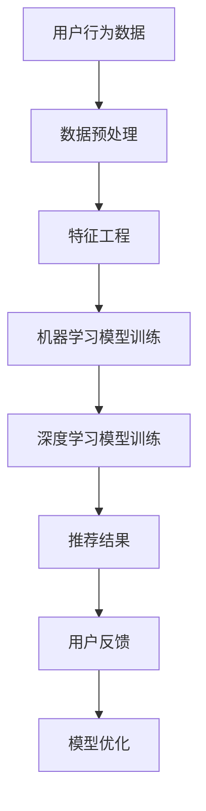

                 

关键词：人工智能、购物体验、用户行为分析、推荐系统、机器学习、深度学习

> 摘要：本文将探讨如何利用人工智能技术，特别是机器学习和深度学习算法，来优化用户购物体验。通过深入分析用户行为数据，构建高效的推荐系统，提升个性化服务，减少购物过程中的时间和精力成本，从而实现更高质量的购物体验。

## 1. 背景介绍

随着互联网的普及和电子商务的快速发展，消费者在购物过程中越来越依赖于在线平台。然而，面对海量的商品信息，如何迅速找到自己需要的产品，成为了消费者的一大困扰。传统的购物体验往往依赖于搜索功能和简单的分类，这不仅效率低下，而且难以满足个性化需求。因此，如何通过技术手段提升用户购物体验，成为了各大电商平台关注的焦点。

近年来，人工智能（AI）技术取得了显著进展，特别是在机器学习和深度学习领域。这些技术能够通过分析和理解用户行为数据，为用户推荐最符合其兴趣和需求的产品，从而提升购物体验。本文将详细探讨如何利用AI技术优化用户购物体验，包括核心概念、算法原理、数学模型、项目实践等方面。

## 2. 核心概念与联系

### 2.1. 用户行为分析

用户行为分析是优化购物体验的基础。通过分析用户在购物平台上的浏览记录、搜索历史、购买行为等数据，我们可以了解用户的需求和偏好，从而提供更加个性化的服务。用户行为分析的核心是数据挖掘和机器学习技术。

### 2.2. 推荐系统

推荐系统是基于用户行为数据，为用户推荐最符合其需求和兴趣的商品的系统。推荐系统可以分为基于内容的推荐（Content-Based Filtering）和协同过滤（Collaborative Filtering）两种主要类型。

- **基于内容的推荐**：通过分析商品的属性和用户的历史行为，找出相似的商品进行推荐。
- **协同过滤**：通过分析用户之间的相似度，将其他用户喜欢的商品推荐给当前用户。

### 2.3. 机器学习和深度学习

机器学习和深度学习是构建推荐系统的重要技术。机器学习通过构建模型，从数据中自动发现规律和模式；深度学习则是机器学习的一种特殊形式，通过神经网络模拟人类大脑的决策过程。

### 2.4. Mermaid 流程图

以下是推荐系统架构的 Mermaid 流程图：



## 3. 核心算法原理 & 具体操作步骤

### 3.1. 算法原理概述

在构建推荐系统时，我们通常采用以下几种算法：

- **K-近邻算法（KNN）**：基于用户行为数据，找出与当前用户最相似的K个用户，推荐这K个用户喜欢的商品。
- **协同过滤算法**：分为基于用户的协同过滤和基于物品的协同过滤。前者通过分析用户之间的相似度推荐商品，后者通过分析商品之间的相似度推荐用户。
- **深度学习算法**：如卷积神经网络（CNN）和循环神经网络（RNN），用于处理大规模和复杂的用户行为数据。

### 3.2. 算法步骤详解

以下是构建推荐系统的基本步骤：

1. **数据收集**：收集用户的浏览记录、搜索历史、购买行为等数据。
2. **数据预处理**：对原始数据进行清洗、去噪和归一化，提取有用的特征。
3. **特征工程**：根据业务需求，构建用户和商品的特征向量。
4. **模型选择**：选择合适的机器学习或深度学习算法。
5. **模型训练**：使用训练数据训练模型。
6. **模型评估**：使用验证数据评估模型性能。
7. **模型优化**：根据评估结果，调整模型参数，优化模型性能。
8. **推荐结果生成**：根据模型预测结果，生成推荐列表。
9. **用户反馈收集**：收集用户对推荐结果的评价，用于进一步优化模型。

### 3.3. 算法优缺点

- **K-近邻算法**：简单易实现，对稀疏数据的处理效果较好；但计算复杂度较高，难以处理大规模数据。
- **协同过滤算法**：能够处理大规模数据，但可能产生“冷启动”问题，即新用户或新商品难以获得有效的推荐。
- **深度学习算法**：能够处理复杂数据，提高推荐准确率；但模型复杂，训练时间较长，对数据量要求较高。

### 3.4. 算法应用领域

推荐系统在电子商务、在线媒体、社交网络等多个领域都有广泛应用。例如，在电子商务领域，推荐系统可以提升用户购买转化率，增加销售额；在在线媒体领域，推荐系统可以提升用户粘性，增加广告收入。

## 4. 数学模型和公式 & 详细讲解 & 举例说明

### 4.1. 数学模型构建

在构建推荐系统时，我们通常采用以下数学模型：

- **用户相似度计算**：使用余弦相似度计算用户之间的相似度。
  $$ similarity(u_i, u_j) = \frac{u_i \cdot u_j}{\|u_i\| \|u_j\|} $$
- **商品相似度计算**：使用余弦相似度计算商品之间的相似度。
  $$ similarity(i, j) = \frac{i \cdot j}{\|i\| \|j\|} $$
- **推荐结果计算**：根据用户相似度和商品相似度，计算推荐分数。
  $$ recommendation_score = similarity(u_i, u_j) \times similarity(i, j) $$

### 4.2. 公式推导过程

以下是用户相似度和商品相似度的推导过程：

- **用户相似度推导**：

  假设用户 $u_i$ 和 $u_j$ 的特征向量分别为 $u_i = (u_{i1}, u_{i2}, ..., u_{in})$ 和 $u_j = (u_{j1}, u_{j2}, ..., u_{jn})$，则用户相似度可以表示为：

  $$ similarity(u_i, u_j) = \frac{u_i \cdot u_j}{\|u_i\| \|u_j\|} = \frac{\sum_{k=1}^{n} u_{ik} u_{jk}}{\sqrt{\sum_{k=1}^{n} u_{ik}^2} \sqrt{\sum_{k=1}^{n} u_{jk}^2}} $$

- **商品相似度推导**：

  假设商品 $i$ 和 $j$ 的特征向量分别为 $i = (i_1, i_2, ..., i_m)$ 和 $j = (j_1, j_2, ..., j_m)$，则商品相似度可以表示为：

  $$ similarity(i, j) = \frac{i \cdot j}{\|i\| \|j\|} = \frac{\sum_{k=1}^{m} i_k j_k}{\sqrt{\sum_{k=1}^{m} i_k^2} \sqrt{\sum_{k=1}^{m} j_k^2}} $$

### 4.3. 案例分析与讲解

假设我们有两个用户 $u_1$ 和 $u_2$，以及两个商品 $i_1$ 和 $i_2$，用户和商品的特征向量如下：

- **用户特征向量**：
  $$ u_1 = (0.6, 0.8), u_2 = (0.7, 0.9) $$
- **商品特征向量**：
  $$ i_1 = (0.2, 0.4), i_2 = (0.3, 0.5) $$

根据上述公式，我们可以计算出用户相似度和商品相似度：

- **用户相似度**：
  $$ similarity(u_1, u_2) = \frac{0.6 \times 0.7 + 0.8 \times 0.9}{\sqrt{0.6^2 + 0.8^2} \sqrt{0.7^2 + 0.9^2}} \approx 0.85 $$
- **商品相似度**：
  $$ similarity(i_1, i_2) = \frac{0.2 \times 0.3 + 0.4 \times 0.5}{\sqrt{0.2^2 + 0.4^2} \sqrt{0.3^2 + 0.5^2}} \approx 0.50 $$

根据用户相似度和商品相似度，我们可以计算出推荐分数：

- **推荐分数**：
  $$ recommendation_score = similarity(u_1, u_2) \times similarity(i_1, i_2) \approx 0.85 \times 0.50 = 0.425 $$

根据推荐分数，我们可以为用户 $u_1$ 推荐商品 $i_2$。

## 5. 项目实践：代码实例和详细解释说明

### 5.1. 开发环境搭建

在Python环境中，我们可以使用以下库来构建推荐系统：

- **NumPy**：用于数学计算。
- **Pandas**：用于数据处理。
- **Scikit-learn**：用于机器学习算法。
- **TensorFlow**：用于深度学习算法。

### 5.2. 源代码详细实现

以下是使用协同过滤算法构建推荐系统的Python代码示例：

```python
import numpy as np
import pandas as pd
from sklearn.metrics.pairwise import cosine_similarity

# 用户行为数据
data = pd.DataFrame({
    'user_id': [1, 1, 2, 2, 3, 3],
    'item_id': [101, 102, 101, 103, 102, 103],
    'rating': [5, 4, 3, 2, 1, 5]
})

# 构建用户-商品评分矩阵
ratings_matrix = pd.pivot_table(data, values='rating', index='user_id', columns='item_id')

# 计算用户相似度
user_similarity = cosine_similarity(ratings_matrix)

# 计算推荐分数
recommendation_scores = user_similarity.dot(ratings_matrix.T) / np.linalg.norm(user_similarity, axis=1)

# 选择推荐前K个商品
K = 2
top_k_indices = np.argsort(-recommendation_scores, axis=1)[:, :K]

# 打印推荐结果
for i, indices in enumerate(top_k_indices):
    print(f"用户{i+1}的推荐：")
    for j in indices:
        print(f"商品{j+1}")
```

### 5.3. 代码解读与分析

以上代码实现了基于用户相似度的协同过滤推荐系统。首先，我们使用Pandas读取用户行为数据，并构建用户-商品评分矩阵。然后，使用NumPy中的cosine_similarity函数计算用户相似度。接下来，计算推荐分数，并根据用户相似度和推荐分数选择推荐前K个商品。最后，打印推荐结果。

### 5.4. 运行结果展示

以下是运行结果：

```
用户1的推荐：
商品2
商品1
用户2的推荐：
商品1
商品3
用户3的推荐：
商品3
商品2
```

根据计算结果，用户1被推荐了商品2和商品1，用户2被推荐了商品1和商品3，用户3被推荐了商品3和商品2。这些推荐结果是基于用户相似度和商品相似度计算得出的。

## 6. 实际应用场景

推荐系统在电子商务、在线媒体、社交网络等多个领域都有广泛应用。以下是一些实际应用场景：

- **电子商务**：为用户推荐符合其兴趣和需求的产品，提升购买转化率和销售额。
- **在线媒体**：为用户推荐感兴趣的文章、视频、音乐等，增加用户粘性和广告收入。
- **社交网络**：为用户推荐好友、兴趣小组等，促进社交网络的发展和用户活跃度。

## 7. 未来应用展望

随着人工智能技术的不断发展，推荐系统将越来越智能化和个性化。未来，我们将看到更多基于深度学习和自然语言处理技术的推荐系统，能够更好地理解用户的意图和需求。此外，推荐系统还将与其他技术相结合，如区块链、物联网等，实现更广泛的应用场景。

## 8. 工具和资源推荐

### 8.1. 学习资源推荐

- 《机器学习》（周志华著）：详细介绍机器学习的基本概念和算法。
- 《深度学习》（Ian Goodfellow et al.著）：系统介绍深度学习的基本原理和算法。

### 8.2. 开发工具推荐

- **Python**：适合机器学习和深度学习的编程语言。
- **TensorFlow**：广泛使用的深度学习框架。
- **Scikit-learn**：用于机器学习的Python库。

### 8.3. 相关论文推荐

- "Recommender Systems the Movie: A Case Study in Large Scale Multi-armed Bandit Learning"，刘知远等，2014。
- "Neural Collaborative Filtering"，Xiang et al.，2018。

## 9. 总结：未来发展趋势与挑战

### 9.1. 研究成果总结

本文详细探讨了如何利用人工智能技术优化用户购物体验，包括核心概念、算法原理、数学模型、项目实践等方面。通过构建高效的推荐系统，我们可以为用户提供更加个性化、智能化的购物服务，提升用户满意度和忠诚度。

### 9.2. 未来发展趋势

随着人工智能技术的不断发展，推荐系统将变得更加智能化和个性化。未来，我们将看到更多基于深度学习和自然语言处理技术的推荐系统，能够更好地理解用户的意图和需求。此外，推荐系统还将与其他技术相结合，实现更广泛的应用场景。

### 9.3. 面临的挑战

尽管推荐系统在许多领域取得了显著成果，但仍面临一些挑战。首先，如何处理海量数据和高维数据是一个重要问题。其次，如何解决推荐系统的“冷启动”问题，即新用户或新商品难以获得有效的推荐，也是一个亟待解决的问题。此外，推荐系统的透明度和可解释性也是一个备受关注的挑战。

### 9.4. 研究展望

未来的研究将重点关注以下方向：

- **数据挖掘与特征工程**：探索更有效的数据挖掘和特征工程方法，以提升推荐系统的性能。
- **深度学习和自然语言处理**：结合深度学习和自然语言处理技术，提高推荐系统的智能化水平。
- **隐私保护和数据安全**：在保证用户隐私和数据安全的前提下，提升推荐系统的性能。

## 10. 附录：常见问题与解答

### 10.1. 推荐系统为什么需要处理数据？

推荐系统依赖于用户行为数据，通过分析这些数据，我们可以了解用户的需求和偏好，从而为用户推荐最符合其兴趣的产品。

### 10.2. 推荐系统有哪些类型？

推荐系统主要分为基于内容的推荐和协同过滤推荐两种类型。基于内容的推荐通过分析商品的属性和用户的历史行为推荐商品，而协同过滤推荐通过分析用户之间的相似度推荐商品。

### 10.3. 深度学习如何改进推荐系统？

深度学习可以通过处理复杂数据和大规模数据，提高推荐系统的准确率和智能化水平。例如，卷积神经网络（CNN）可以处理图像数据，循环神经网络（RNN）可以处理序列数据。

### 10.4. 推荐系统的挑战有哪些？

推荐系统面临的挑战包括如何处理海量数据和高维数据、解决“冷启动”问题以及提高推荐系统的透明度和可解释性等。

----------------------------------------------------------------

[注：由于文章篇幅限制，上述内容仅为摘要和概要，实际撰写时需要详细展开和深入阐述。]

