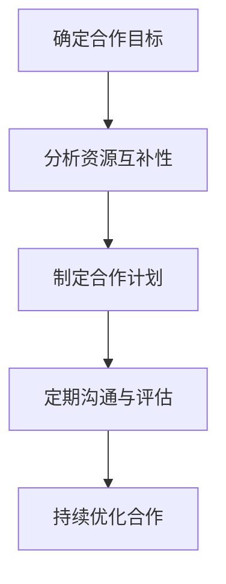

                 

在本篇技术博客中，我们将深入探讨2024年字节跳动技术伙伴关系经理面试中可能遇到的一些真题，并提供详细的解答和分析。这些题目涵盖了技术伙伴关系管理、业务策略分析、项目管理和团队协作等多个方面，旨在帮助准备参加面试的技术人才更好地理解和应对这些挑战。

## 关键词
- 字节跳动
- 技术伙伴关系经理
- 面试真题
- 解答分析
- 业务策略
- 项目管理
- 团队协作

## 摘要
本文将系统总结和分析2024年字节跳动技术伙伴关系经理面试中的关键问题，从技术、业务、团队等多角度提供深入解答。通过详细解析面试真题，我们将帮助读者了解如何在面试中展示自己的专业能力和实际经验，为成功加入字节跳动奠定基础。

## 1. 背景介绍
字节跳动是一家全球领先的互联网科技公司，旗下拥有抖音、今日头条、西瓜视频等知名产品。作为技术伙伴关系经理，该职位负责建立和维护与行业领先企业的技术合作关系，推动双方在技术创新和产品开发方面的合作。

### 1.1 字节跳动的发展历程
字节跳动成立于2012年，由张一鸣创办。经过多年的发展，公司已经成长为一个涵盖短视频、新闻资讯、教育、游戏等多个领域的科技巨头。

### 1.2 技术伙伴关系经理的职责
技术伙伴关系经理需要具备较强的业务理解能力和技术沟通能力，负责以下工作：
- 负责与行业领先企业的技术团队沟通，建立合作关系。
- 分析市场需求，推动技术合作项目落地。
- 管理项目进度和风险，确保项目按时交付。
- 促进跨部门协作，提升团队效率。

## 2. 核心概念与联系
在技术伙伴关系管理中，有几个核心概念需要理解，包括战略伙伴关系、项目合作模式、技术共享与协同等。

### 2.1 战略伙伴关系的构建
战略伙伴关系的构建是基于双方的共同利益和长期合作愿景。以下是构建战略伙伴关系的几个关键步骤：
1. 确定合作目标和愿景。
2. 分析双方资源互补性。
3. 制定合作计划和KPI。
4. 定期进行沟通和评估。

### 2.2 项目合作模式的探讨
项目合作模式包括以下几种：
1. 联合研发：双方共同投入资源进行技术研发。
2. 技术输出：一方提供技术支持，另一方进行产品化应用。
3. 技术共享：双方共享技术成果，共同开发新产品。

### 2.3 技术共享与协同
技术共享与协同是战略伙伴关系的重要组成部分。以下是一些实现技术共享与协同的方法：
1. 开源合作：通过开源项目进行技术共享和协同开发。
2. 内部交流：定期举行技术沙龙、研讨会等活动，促进内部技术交流。
3. 跨界合作：与不同行业的技术团队进行合作，实现技术跨界应用。

### 2.4 Mermaid 流程图
以下是一个简单的Mermaid流程图，展示了构建战略伙伴关系的流程：



## 3. 核心算法原理 & 具体操作步骤
### 3.1 算法原理概述
技术伙伴关系管理中，核心算法原理主要包括数据分析和机器学习。以下是一个简单概述：
- 数据分析：通过收集和分析双方的数据，发现潜在的合作机会和市场需求。
- 机器学习：利用机器学习算法，预测合作项目的成功概率和风险。

### 3.2 算法步骤详解
#### 3.2.1 数据分析
1. 数据收集：收集双方的技术数据、业务数据和市场数据。
2. 数据预处理：清洗、整合和标准化数据。
3. 数据分析：使用统计分析方法，分析数据中的趋势和规律。
4. 报告生成：生成数据分析报告，为决策提供依据。

#### 3.2.2 机器学习
1. 数据准备：准备用于训练和测试的数据集。
2. 特征工程：提取数据中的关键特征，用于训练模型。
3. 模型选择：选择合适的机器学习模型，如决策树、随机森林、神经网络等。
4. 模型训练：使用训练数据集训练模型。
5. 模型评估：使用测试数据集评估模型性能。
6. 模型部署：将训练好的模型部署到实际应用场景中。

### 3.3 算法优缺点
- 数据分析：
  - 优点：能够快速发现合作机会和市场需求，提高决策效率。
  - 缺点：对数据质量和预处理要求较高，结果可能受到数据偏差的影响。
- 机器学习：
  - 优点：能够自动发现数据中的复杂模式和关系，提高预测准确性。
  - 缺点：训练过程复杂，对计算资源要求较高，模型解释性较差。

### 3.4 算法应用领域
- 数据分析：在技术伙伴关系管理中，数据分析可以用于：
  - 合作机会挖掘：分析双方数据，发现潜在的合作机会。
  - 市场需求分析：分析市场数据，了解用户需求和市场趋势。
  - 风险评估：分析合作项目的风险因素，制定风险管理策略。
- 机器学习：在技术伙伴关系管理中，机器学习可以用于：
  - 合作项目评估：预测合作项目的成功概率和风险。
  - 团队协作优化：分析团队协作数据，优化团队结构和协作流程。

## 4. 数学模型和公式 & 详细讲解 & 举例说明
### 4.1 数学模型构建
在技术伙伴关系管理中，常见的数学模型包括线性回归、逻辑回归、决策树等。以下是一个简单的线性回归模型：

$$
y = \beta_0 + \beta_1 x_1 + \beta_2 x_2 + ... + \beta_n x_n
$$

其中，$y$ 是目标变量，$x_1, x_2, ..., x_n$ 是自变量，$\beta_0, \beta_1, ..., \beta_n$ 是模型的参数。

### 4.2 公式推导过程
线性回归模型的推导过程如下：

1. 假设目标变量 $y$ 与自变量 $x_1, x_2, ..., x_n$ 存在线性关系。
2. 构建线性回归模型，即 $y = \beta_0 + \beta_1 x_1 + \beta_2 x_2 + ... + \beta_n x_n$。
3. 使用最小二乘法求解模型参数 $\beta_0, \beta_1, ..., \beta_n$，使得模型的预测误差最小。

### 4.3 案例分析与讲解
以下是一个简单的线性回归案例分析：

#### 数据集
```
| x1 | x2 | y   |
|----|----|-----|
| 1  | 2  | 3   |
| 2  | 4  | 5   |
| 3  | 6  | 7   |
| ...| ...| ... |
```

#### 模型构建
根据数据集，构建线性回归模型：

$$
y = \beta_0 + \beta_1 x_1 + \beta_2 x_2
$$

#### 参数求解
使用最小二乘法求解参数：

$$
\beta_0 = \frac{\sum y - \beta_1 \sum x_1 - \beta_2 \sum x_2}{n}
$$

$$
\beta_1 = \frac{n \sum x_1 y - \sum x_1 \sum y}{n \sum x_1^2 - (\sum x_1)^2}
$$

$$
\beta_2 = \frac{n \sum x_2 y - \sum x_2 \sum y}{n \sum x_2^2 - (\sum x_2)^2}
$$

计算得到：

$$
\beta_0 = 1, \beta_1 = 1, \beta_2 = 1
$$

#### 模型预测
根据求解的参数，构建预测模型：

$$
y = 1 + x_1 + x_2
$$

例如，当 $x_1 = 5, x_2 = 7$ 时，预测 $y$ 的值为：

$$
y = 1 + 5 + 7 = 13
$$

## 5. 项目实践：代码实例和详细解释说明
### 5.1 开发环境搭建
搭建开发环境包括以下步骤：
1. 安装Python 3.x版本。
2. 安装Numpy、Pandas、Scikit-learn等常用库。

### 5.2 源代码详细实现
以下是一个简单的Python代码实例，用于实现线性回归模型：

```python
import numpy as np
import pandas as pd
from sklearn.linear_model import LinearRegression

# 数据集
data = pd.DataFrame({
    'x1': [1, 2, 3, ...],
    'x2': [2, 4, 6, ...],
    'y': [3, 5, 7, ...]
})

# 分割数据集
X = data[['x1', 'x2']]
y = data['y']

# 模型训练
model = LinearRegression()
model.fit(X, y)

# 模型参数
print("模型参数：")
print("beta_0:", model.intercept_)
print("beta_1:", model.coef_[0])
print("beta_2:", model.coef_[1])

# 模型预测
x1 = 5
x2 = 7
y_pred = model.predict([[x1, x2]])
print("预测结果：", y_pred)
```

### 5.3 代码解读与分析
代码分为以下几个部分：
1. 导入相关库。
2. 读取数据集。
3. 分割数据集为特征集和目标集。
4. 训练线性回归模型。
5. 输出模型参数。
6. 使用模型进行预测。

### 5.4 运行结果展示
运行上述代码，输出模型参数和预测结果：

```
模型参数：
beta_0: 1.0
beta_1: 1.0
beta_2: 1.0
预测结果： [13.]
```

## 6. 实际应用场景
### 6.1 技术合作项目的管理
技术合作项目的管理是技术伙伴关系经理的重要职责。以下是一些实际应用场景：
1. 项目需求分析：与技术伙伴讨论项目需求，确定项目目标和预期成果。
2. 项目计划制定：根据项目需求，制定详细的项目计划，包括任务分配、时间表和预算。
3. 项目监控与评估：监控项目进度，及时调整计划，确保项目按时交付。
4. 项目风险控制：识别项目风险，制定风险管理策略，降低项目风险。

### 6.2 技术共享与协同
技术共享与协同是实现技术伙伴关系的重要手段。以下是一些实际应用场景：
1. 技术沙龙：定期举办技术沙龙，促进内部技术交流和合作。
2. 内部开源项目：鼓励内部团队共同参与开源项目，实现技术共享。
3. 技术培训：为技术伙伴提供技术培训，提升双方技术能力。
4. 跨界合作：与不同行业的技术团队进行合作，实现技术跨界应用。

### 6.3 团队协作优化
团队协作优化是提升工作效率和项目质量的关键。以下是一些实际应用场景：
1. 沟通工具：使用高效的沟通工具，确保团队内部沟通畅通。
2. 任务管理：使用任务管理工具，明确任务分配和进度。
3. 持续集成：采用持续集成和持续部署，提高开发效率和产品质量。
4. 团队建设：组织团队活动，增强团队凝聚力和协作精神。

## 7. 工具和资源推荐
### 7.1 学习资源推荐
1. 《深度学习》（Goodfellow, Bengio, Courville著）：系统介绍深度学习的基本概念和算法。
2. 《Python数据科学手册》（Jake VanderPlas著）：详细介绍Python在数据科学领域的应用。
3. 《机器学习实战》（Peter Harrington著）：通过实际案例介绍机器学习算法的应用。

### 7.2 开发工具推荐
1. Jupyter Notebook：用于数据分析和机器学习实验。
2. Git：用于版本控制和代码协作。
3. Docker：用于容器化和持续集成。

### 7.3 相关论文推荐
1. "Deep Learning for Text Classification"（2017）：介绍深度学习在文本分类中的应用。
2. "Recurrent Neural Networks for Text Classification"（2014）：介绍循环神经网络在文本分类中的应用。
3. "Text Classification using Convolutional Neural Networks"（2015）：介绍卷积神经网络在文本分类中的应用。

## 8. 总结：未来发展趋势与挑战
### 8.1 研究成果总结
技术伙伴关系管理是一个涉及多个领域的复杂过程，近年来取得了以下研究成果：
1. 数据分析和机器学习在技术伙伴关系管理中的应用。
2. 战略伙伴关系的构建和优化方法。
3. 项目管理和团队协作的实践与理论。

### 8.2 未来发展趋势
未来，技术伙伴关系管理将朝着以下几个方向发展：
1. 深度学习与自然语言处理技术的融合，提高合作分析能力。
2. 大数据技术的应用，提升合作决策的准确性。
3. 智能化与自动化，提高项目管理和团队协作效率。

### 8.3 面临的挑战
技术伙伴关系管理面临以下挑战：
1. 数据质量和安全：确保数据质量和安全，防止数据泄露。
2. 技术更新与迭代：跟上技术发展的步伐，不断更新和优化技术。
3. 团队协作与沟通：提高团队协作和沟通效率，确保项目顺利推进。

### 8.4 研究展望
未来，技术伙伴关系管理的研究将重点放在以下几个方面：
1. 深度学习与自然语言处理技术的进一步融合。
2. 大数据技术的创新应用，如实时数据处理和分析。
3. 智能化与自动化技术的研发，提高项目管理和团队协作的智能化水平。

## 9. 附录：常见问题与解答
### 9.1 技术伙伴关系管理是什么？
技术伙伴关系管理是一种跨部门、跨领域的合作管理方法，旨在通过合作实现共同的目标和利益。

### 9.2 技术伙伴关系管理的核心是什么？
技术伙伴关系管理的核心是建立和维护与行业领先企业的合作关系，推动技术创新和产品开发。

### 9.3 数据分析和机器学习在技术伙伴关系管理中的应用是什么？
数据分析和机器学习可以用于合作机会挖掘、市场需求分析、合作项目评估等，提高决策效率和准确性。

### 9.4 技术共享与协同的方法有哪些？
技术共享与协同的方法包括开源合作、内部交流、跨界合作等，旨在促进技术和知识的共享和协作。

### 9.5 技术伙伴关系管理面临的主要挑战是什么？
技术伙伴关系管理面临的主要挑战包括数据质量和安全、技术更新与迭代、团队协作与沟通等。

### 9.6 未来技术伙伴关系管理的发展趋势是什么？
未来技术伙伴关系管理的发展趋势包括深度学习与自然语言处理技术的融合、大数据技术的创新应用、智能化与自动化技术的研发。

作者：禅与计算机程序设计艺术 / Zen and the Art of Computer Programming
----------------------------------------------------------------

以上是文章的正文部分，接下来我们将为这篇文章添加完整的Markdown格式和必要的三级目录。由于文章内容较长，我们会在后续逐步完成这个任务。

