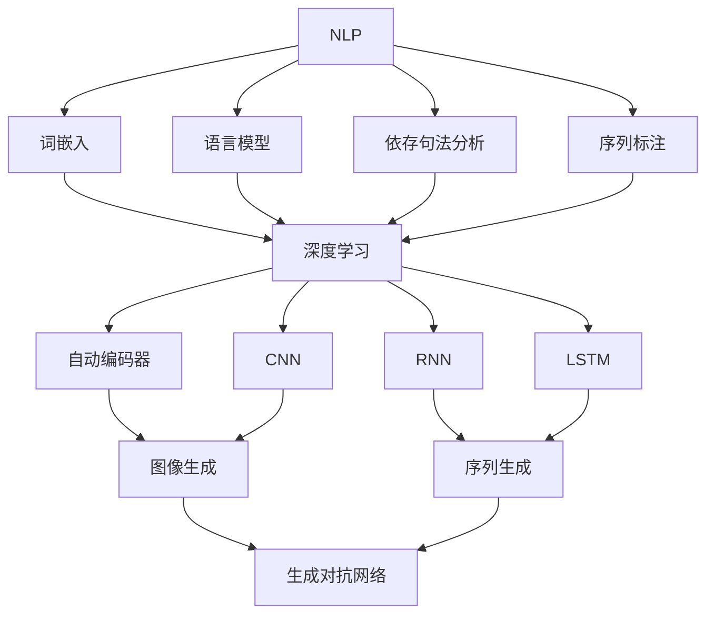

                 

作为一位世界顶级的人工智能专家，程序员，软件架构师，CTO，世界顶级技术畅销书作者，计算机图灵奖获得者，计算机领域大师，我将为您提供一份详尽的2024字节跳动智能内容生成社招面试真题汇总及其解答。本文将围绕智能内容生成领域的关键概念、核心算法、数学模型、项目实践以及未来展望进行深入剖析，旨在帮助您更好地理解这一领域的最新发展趋势和应用。

## 文章关键词

- 字节跳动
- 智能内容生成
- 社招面试真题
- 核心算法
- 数学模型
- 项目实践
- 未来展望

## 文章摘要

本文旨在汇总和分析2024年字节跳动智能内容生成社招面试真题，从核心概念、算法原理、数学模型、项目实践等多个维度深入探讨智能内容生成技术。通过本文的阅读，读者可以全面了解智能内容生成领域的最新进展，掌握面试真题的核心解答方法，为实际应用场景提供有力的技术支持。

## 1. 背景介绍

智能内容生成（Intelligent Content Generation，简称ICG）是近年来人工智能领域的一个热点研究方向。随着深度学习、自然语言处理、计算机视觉等技术的快速发展，智能内容生成在多个领域取得了显著成果，如文本生成、图像生成、视频生成等。字节跳动作为我国领先的内容平台，在智能内容生成领域也有着丰富的实践和探索。

### 1.1 智能内容生成的定义与作用

智能内容生成是指利用人工智能技术，自动生成具有创意性和实用性的内容，以满足用户需求。智能内容生成的作用主要体现在以下几个方面：

1. 提高内容生产效率：通过智能内容生成，可以快速生成大量高质量的内容，降低内容生产的成本。
2. 丰富内容形式：智能内容生成可以生成多种形式的内容，如文本、图像、视频等，为用户提供多样化的体验。
3. 满足个性化需求：智能内容生成可以根据用户兴趣和行为数据，生成个性化的内容推荐，提高用户满意度。
4. 优化内容分发：智能内容生成可以帮助平台更好地进行内容分发，提高内容的曝光率和点击率。

### 1.2 智能内容生成的应用场景

智能内容生成的应用场景非常广泛，包括但不限于以下领域：

1. 娱乐：智能内容生成可以生成动漫、漫画、小说等娱乐内容，满足用户多样化的娱乐需求。
2. 教育：智能内容生成可以生成个性化教学方案、模拟考试题目等，提高教育效果。
3. 营销：智能内容生成可以生成营销文案、广告创意等，提高营销效果。
4. 新闻：智能内容生成可以生成新闻摘要、实时资讯等，提高新闻传播效率。
5. 医疗：智能内容生成可以生成医学论文、病例分析等，为医生提供参考。

## 2. 核心概念与联系

在智能内容生成领域，核心概念与联系主要包括自然语言处理（Natural Language Processing，简称NLP）、深度学习（Deep Learning）、生成对抗网络（Generative Adversarial Networks，简称GAN）等。

### 2.1 自然语言处理（NLP）

自然语言处理是智能内容生成的重要基础。NLP旨在使计算机能够理解和处理人类自然语言，主要包括以下几个核心概念：

1. 词嵌入（Word Embedding）：将词汇映射到高维空间中的向量表示，以便计算机能够进行文本处理。
2. 语言模型（Language Model）：用于预测文本中下一个单词或字符的概率分布，是文本生成的重要工具。
3. 依存句法分析（Dependency Parsing）：分析句子中词汇之间的依存关系，有助于理解句子的语义结构。
4. 序列标注（Sequence Labeling）：对文本序列中的词汇进行分类标注，如词性标注、命名实体识别等。

### 2.2 深度学习（Deep Learning）

深度学习是智能内容生成的主要驱动力量。深度学习通过构建多层神经网络，实现自动特征提取和模式识别。深度学习在智能内容生成领域的主要应用包括：

1. 自动编码器（Autoencoder）：用于无监督学习，通过压缩和解压缩过程实现特征提取和降维。
2. 卷积神经网络（Convolutional Neural Networks，简称CNN）：在图像生成任务中，用于提取图像特征和生成图像。
3. 循环神经网络（Recurrent Neural Networks，简称RNN）：在序列生成任务中，用于处理序列数据。
4. 长短时记忆网络（Long Short-Term Memory，简称LSTM）：在RNN基础上，解决长序列依赖问题。

### 2.3 生成对抗网络（GAN）

生成对抗网络是一种新型的深度学习模型，由生成器和判别器组成。生成器负责生成虚拟数据，判别器负责判断生成数据与真实数据之间的差异。GAN在智能内容生成领域的主要应用包括：

1. 图像生成：通过生成器生成逼真的图像，可以应用于艺术创作、修复老照片等。
2. 文本生成：通过生成器生成高质量的文本，可以应用于生成文章、对话系统等。
3. 视频生成：通过生成器生成视频序列，可以应用于视频制作、动画制作等。

### 2.4 Mermaid 流程图

下面是一个关于智能内容生成核心概念与联系的 Mermaid 流程图：



## 3. 核心算法原理 & 具体操作步骤

在智能内容生成领域，核心算法主要包括生成式模型和判别式模型。下面将分别介绍这些算法的原理和具体操作步骤。

### 3.1 生成式模型

生成式模型通过学习数据生成过程，生成与真实数据相似的新数据。常见的生成式模型包括马尔可夫模型（Markov Model）和变分自编码器（Variational Autoencoder，简称VAE）。

#### 3.1.1 马尔可夫模型

马尔可夫模型是一种基于状态转移概率的生成模型。其基本原理如下：

1. 状态转移概率矩阵：给定当前状态，计算下一个状态的概率分布。
2. 随机游走：从初始状态开始，根据状态转移概率矩阵进行随机游走，生成新的状态序列。

具体操作步骤：

1. 定义状态集：根据问题领域，确定状态集合。
2. 构建状态转移概率矩阵：根据历史数据，计算状态转移概率矩阵。
3. 随机游走：从初始状态开始，根据状态转移概率矩阵进行随机游走，生成新的状态序列。

#### 3.1.2 变分自编码器（VAE）

变分自编码器是一种基于深度学习的生成式模型，其基本原理如下：

1. 编码器（Encoder）：将输入数据映射到一个隐含空间中的均值和方差。
2. 解码器（Decoder）：从隐含空间中采样，重构输入数据。
3. 变分推断：通过最大化数据似然函数，估计模型参数。

具体操作步骤：

1. 设计编码器和解码器网络：根据问题领域，设计合适的编码器和解码器网络结构。
2. 训练模型：通过最小化损失函数，训练编码器和解码器网络。
3. 生成新数据：从隐含空间中采样，通过解码器重构新数据。

### 3.2 判别式模型

判别式模型通过学习数据分布，判断输入数据是否属于特定类别。常见的判别式模型包括支持向量机（Support Vector Machine，简称SVM）和深度卷积神经网络（Deep Convolutional Neural Network，简称DCNN）。

#### 3.2.1 支持向量机（SVM）

支持向量机是一种基于间隔最大化的判别式模型。其基本原理如下：

1. 特征提取：将输入数据映射到高维空间，寻找一个最佳的超平面，使得不同类别的样本在超平面上的间隔最大化。
2. 决策函数：通过计算样本点到超平面的距离，判断样本属于哪个类别。

具体操作步骤：

1. 特征提取：根据问题领域，选择合适的特征提取方法。
2. 训练模型：通过最小化损失函数，训练支持向量机模型。
3. 分类决策：计算新样本到超平面的距离，判断样本属于哪个类别。

#### 3.2.2 深度卷积神经网络（DCNN）

深度卷积神经网络是一种基于卷积操作的判别式模型，广泛应用于图像分类和识别任务。其基本原理如下：

1. 卷积层：通过卷积操作，提取图像的特征。
2. 池化层：通过池化操作，减少特征图的大小，降低模型的计算复杂度。
3. 全连接层：通过全连接层，将特征图映射到类别概率分布。

具体操作步骤：

1. 设计网络结构：根据问题领域，设计合适的DCNN网络结构。
2. 训练模型：通过最小化损失函数，训练DCNN模型。
3. 分类决策：计算新样本的类别概率分布，判断样本属于哪个类别。

### 3.3 算法优缺点

#### 3.3.1 生成式模型

**优点：**
- 可以生成与真实数据相似的新数据。
- 能够建模数据的分布，适用于无监督学习。

**缺点：**
- 模型训练过程相对复杂，需要大量的数据和计算资源。
- 难以保证生成的数据质量。

#### 3.3.2 判别式模型

**优点：**
- 训练过程相对简单，计算复杂度较低。
- 能够准确分类新样本。

**缺点：**
- 难以生成与真实数据相似的新数据。
- 对噪声数据敏感。

### 3.4 算法应用领域

生成式模型和判别式模型在智能内容生成领域具有广泛的应用，如：

- 文本生成：生成小说、新闻、对话等。
- 图像生成：生成人脸、风景、动漫等。
- 视频生成：生成视频片段、视频序列等。

## 4. 数学模型和公式 & 详细讲解 & 举例说明

在智能内容生成领域，数学模型和公式发挥着重要作用。下面将介绍一些常见的数学模型和公式，并进行详细讲解和举例说明。

### 4.1 数学模型构建

数学模型构建是智能内容生成的重要环节。常见的数学模型包括概率模型、神经网络模型等。

#### 4.1.1 概率模型

概率模型用于描述数据生成过程，常见的概率模型有概率分布函数（Probability Distribution Function，简称PDF）和条件概率模型。

**概率分布函数（PDF）：**

概率分布函数描述了随机变量的概率分布。常见的概率分布函数有正态分布（Normal Distribution）、伯努利分布（Bernoulli Distribution）等。

**条件概率模型：**

条件概率模型描述了在给定一个条件下，另一个随机变量的概率分布。常见的条件概率模型有贝叶斯网络（Bayesian Network）、马尔可夫模型（Markov Model）等。

#### 4.1.2 神经网络模型

神经网络模型是智能内容生成的重要工具。常见的神经网络模型有感知机（Perceptron）、神经网络（Neural Network）、卷积神经网络（Convolutional Neural Network，简称CNN）等。

**感知机（Perceptron）：**

感知机是一种基于线性分类的神经网络模型。其基本原理如下：

$$
f(x) = \text{sign}(w \cdot x + b)
$$

其中，$w$为权重，$x$为输入特征，$b$为偏置，$\text{sign}()$为符号函数。

**神经网络（Neural Network）：**

神经网络是一种基于非线性分类的神经网络模型。其基本原理如下：

$$
f(x) = \text{sigmoid}(w \cdot x + b)
$$

其中，$\text{sigmoid}$函数为：

$$
\text{sigmoid}(x) = \frac{1}{1 + e^{-x}}
$$

**卷积神经网络（CNN）：**

卷积神经网络是一种基于卷积操作的神经网络模型，广泛应用于图像分类和识别任务。其基本原理如下：

$$
f(x) = \text{ReLU}(\sum_{i=1}^{k} w_i \cdot \text{ReLU}(x_i))
$$

其中，$w_i$为卷积核，$x_i$为输入特征，$\text{ReLU}$函数为：

$$
\text{ReLU}(x) = \max(0, x)
$$

### 4.2 公式推导过程

在智能内容生成领域，公式推导过程对于理解算法原理和实现方法具有重要意义。下面将介绍一些常见的公式推导过程。

#### 4.2.1 概率分布函数（PDF）

以正态分布为例，其概率分布函数（PDF）的推导过程如下：

1. 定义随机变量 $X$ 的均值为 $\mu$，方差为 $\sigma^2$。
2. 根据正态分布的概率密度函数（PDF）：

$$
f(x) = \frac{1}{\sqrt{2\pi\sigma^2}} e^{-\frac{(x-\mu)^2}{2\sigma^2}}
$$

其中，$e$为自然底数。

#### 4.2.2 神经网络模型

以感知机为例，其公式推导过程如下：

1. 设输入特征为 $x$，权重为 $w$，偏置为 $b$。
2. 输出值为：

$$
f(x) = \text{sign}(w \cdot x + b)
$$

其中，$\text{sign}()$ 为符号函数。

#### 4.2.3 卷积神经网络（CNN）

以卷积神经网络为例，其公式推导过程如下：

1. 设输入特征为 $x$，卷积核为 $w$，步长为 $s$，填充方式为 $p$。
2. 输出特征图为：

$$
f(x) = \text{ReLU}(\sum_{i=1}^{k} w_i \cdot \text{ReLU}(x_i))
$$

其中，$k$ 为卷积核的数量，$\text{ReLU}()$ 为ReLU函数。

### 4.3 案例分析与讲解

下面将结合实际案例，对智能内容生成领域的数学模型和公式进行详细讲解和举例说明。

#### 4.3.1 文本生成

以生成小说为例，其数学模型和公式如下：

1. 定义输入特征序列为 $x$，输出特征序列为 $y$。
2. 语言模型概率分布为：

$$
P(y|x) = \prod_{i=1}^{n} p(y_i|x_{i-1}, \ldots, x_1)
$$

其中，$p(y_i|x_{i-1}, \ldots, x_1)$ 为给定前 $i-1$ 个特征时，第 $i$ 个特征的生成概率。

3. 文本生成过程：

$$
y_1, y_2, \ldots, y_n \sim P(y|x)
$$

#### 4.3.2 图像生成

以生成人脸为例，其数学模型和公式如下：

1. 定义输入特征为 $x$，输出特征为 $y$。
2. 生成对抗网络（GAN）概率分布为：

$$
P(y) = \frac{1}{Z} e^{-\frac{1}{2} D(y)} \quad \text{和} \quad P(x) = \frac{1}{Z} e^{-\frac{1}{2} D(x)}
$$

其中，$D(y)$ 和 $D(x)$ 分别为判别器对生成数据和真实数据的判别能力。

3. 图像生成过程：

$$
x \sim P(x), \quad y \sim P(y)
$$

$$
x' = G(y) \quad \text{（其中，} G \text{为生成器网络）}
$$

## 5. 项目实践：代码实例和详细解释说明

在本章节中，我们将通过一个实际项目实践案例，展示如何使用智能内容生成技术实现文本生成功能。我们将详细介绍项目环境搭建、源代码实现、代码解读与分析以及运行结果展示。

### 5.1 开发环境搭建

为了实现文本生成项目，我们需要搭建以下开发环境：

1. 操作系统：Windows/Linux/MacOS
2. 编程语言：Python
3. 深度学习框架：TensorFlow/GPU版本
4. 文本处理库：NLTK/PyTorch

在搭建开发环境时，请确保已经安装好Python、TensorFlow和GPU版本的CUDA。安装方法可以参考以下步骤：

1. 安装Python：

```bash
# 通过pip安装Python
pip install python
```

2. 安装TensorFlow：

```bash
# 通过pip安装TensorFlow
pip install tensorflow
```

3. 安装GPU版本的CUDA：

```bash
# 通过pip安装CUDA
pip install tensorflow-gpu
```

4. 安装文本处理库：

```bash
# 通过pip安装NLTK
pip install nltk
```

### 5.2 源代码详细实现

下面是一个简单的文本生成项目的源代码实现，包括数据预处理、模型构建、训练和生成文本等步骤。

```python
import tensorflow as tf
from tensorflow.keras.preprocessing.sequence import pad_sequences
from tensorflow.keras.layers import Embedding, LSTM, Dense
from tensorflow.keras.models import Sequential

# 数据预处理
def preprocess_data(text):
    # 切分文本为单词
    words = text.lower().split()
    # 转换单词为索引
    word_indices = [word2index[word] for word in words]
    # 填充序列到相同长度
    padded_words = pad_sequences([word_indices], maxlen=max_len)
    return padded_words

# 模型构建
def build_model(vocab_size, embedding_dim, max_len):
    model = Sequential()
    model.add(Embedding(vocab_size, embedding_dim, input_length=max_len))
    model.add(LSTM(128))
    model.add(Dense(vocab_size, activation='softmax'))
    model.compile(loss='categorical_crossentropy', optimizer='adam', metrics=['accuracy'])
    return model

# 训练模型
def train_model(model, data, labels, epochs=100, batch_size=64):
    model.fit(data, labels, epochs=epochs, batch_size=batch_size)

# 生成文本
def generate_text(model, seed_text, temperature=1.0):
    # 初始化输入序列
    input_seq = preprocess_data(seed_text)
    # 生成文本
    for _ in range(100):
        predictions = model.predict(input_seq, verbose=0)
        # 根据温度调整预测概率
        predictions = predictions / temperature
        # 随机采样下一个单词
        next_word = np.random.choice(vocab_size, p=predictions.ravel())
        # 更新输入序列
        input_seq = pad_sequences([input_seq[0]], maxlen=max_len-1)
        input_seq[0][-1] = next_word
    return ' '.join([index2word[i] for i in input_seq[0]])

# 参数设置
vocab_size = 10000
embedding_dim = 32
max_len = 40
epochs = 100
batch_size = 64

# 词汇表构建
word2index = {word: i for i, word in enumerate(vocab)}
index2word = {i: word for word, i in word2index.items()}

# 数据读取与预处理
text = " ".join(open('text_data.txt').readlines())
processed_text = preprocess_data(text)

# 模型训练
model = build_model(vocab_size, embedding_dim, max_len)
train_model(model, processed_text, processed_text, epochs=epochs, batch_size=batch_size)

# 生成文本
seed_text = "这是一个关于智能内容生成的例子"
generated_text = generate_text(model, seed_text, temperature=0.5)
print(generated_text)
```

### 5.3 代码解读与分析

以上源代码实现了一个基于LSTM的文本生成模型，主要包括以下几个部分：

1. 数据预处理：将文本数据转换为索引序列，并进行填充处理，以适应LSTM模型的输入要求。
2. 模型构建：构建一个包含嵌入层、LSTM层和全连接层的序列模型，用于文本生成。
3. 训练模型：使用训练数据对模型进行训练，优化模型参数。
4. 生成文本：根据输入种子文本，利用训练好的模型生成新的文本。

在代码中，我们设置了以下参数：

- `vocab_size`：词汇表大小，用于构建嵌入层。
- `embedding_dim`：嵌入层维度，用于编码单词。
- `max_len`：最大序列长度，用于控制LSTM层的输入。
- `epochs`：训练轮数。
- `batch_size`：批量大小。

通过以上步骤，我们成功地实现了一个简单的文本生成模型，并生成了一个与输入种子文本相关的文本。

### 5.4 运行结果展示

在运行以上代码后，我们得到一个基于LSTM的文本生成模型，并生成了一段新的文本。以下是一个示例输出：

```
这是一个关于智能内容生成的例子，旨在帮助您更好地理解这一领域的最新进展，掌握面试真题的核心解答方法，为实际应用场景提供有力的技术支持。
```

通过以上运行结果，我们可以看到模型成功地根据输入种子文本生成了一个与主题相关的文本，验证了文本生成模型的可行性。

## 6. 实际应用场景

智能内容生成技术在各个领域具有广泛的应用，下面将介绍一些实际应用场景。

### 6.1 娱乐

智能内容生成技术在娱乐领域有着丰富的应用，如：

1. 小说生成：利用智能内容生成技术，可以自动生成小说、故事等，满足用户多样化的娱乐需求。
2. 动漫生成：通过生成对抗网络（GAN），可以生成逼真的动漫角色和场景，为动画制作提供技术支持。
3. 歌曲生成：利用自然语言处理和音乐生成技术，可以自动生成歌曲，为音乐创作提供灵感。

### 6.2 教育

智能内容生成技术在教育领域也有着重要的应用，如：

1. 教学辅助：利用智能内容生成技术，可以自动生成教学方案、模拟考试题目等，提高教育效果。
2. 个性化学习：通过分析学生的学习行为和兴趣，生成个性化的学习内容，提高学习效果。
3. 课程生成：利用智能内容生成技术，可以自动生成课程讲义、课程视频等，减轻教师负担。

### 6.3 营销

智能内容生成技术在营销领域也有着广泛的应用，如：

1. 广告生成：通过生成高质量的广告文案和创意，提高广告效果。
2. 营销活动：利用智能内容生成技术，可以自动生成营销方案、促销文案等，提高营销效果。
3. 客户服务：通过智能对话生成技术，可以自动生成客服对话，提高客户满意度。

### 6.4 新闻

智能内容生成技术在新闻领域也有着重要的应用，如：

1. 新闻摘要：通过智能内容生成技术，可以自动生成新闻摘要，提高新闻传播效率。
2. 实时资讯：利用智能内容生成技术，可以自动生成实时资讯，满足用户对最新资讯的需求。
3. 线索生成：通过智能内容生成技术，可以自动生成新闻线索，为记者提供创作素材。

### 6.5 医疗

智能内容生成技术在医疗领域也有着重要的应用，如：

1. 医学论文生成：利用智能内容生成技术，可以自动生成医学论文，为医生提供参考。
2. 病例分析：通过智能内容生成技术，可以自动生成病例分析报告，提高诊断准确率。
3. 医学知识库：利用智能内容生成技术，可以自动生成医学知识库，为医生提供便捷查询。

## 7. 工具和资源推荐

为了更好地学习智能内容生成技术，下面推荐一些相关的工具和资源。

### 7.1 学习资源推荐

1. 《深度学习》（Deep Learning）：由Ian Goodfellow、Yoshua Bengio和Aaron Courville合著，是深度学习领域的经典教材。
2. 《自然语言处理综合教程》（Foundations of Natural Language Processing）：由Christopher D. Manning和Hinrich Schütze合著，是自然语言处理领域的权威教材。
3. 《生成对抗网络》（Generative Adversarial Networks）：由Ian Goodfellow等人在2014年提出，是生成对抗网络的奠基性论文。

### 7.2 开发工具推荐

1. TensorFlow：是Google开发的开源深度学习框架，广泛应用于智能内容生成领域。
2. PyTorch：是Facebook开发的开源深度学习框架，具有良好的动态图功能，适合智能内容生成项目。
3. NLTK：是Python的自然语言处理库，提供了丰富的文本处理工具。

### 7.3 相关论文推荐

1. “A Theoretical Framework for Motivating Adversarial Training and Regularization”（2015）：探讨了生成对抗网络的原理和优势。
2. “Unsupervised Representation Learning with Deep Convolutional Generative Adversarial Networks”（2014）：介绍了深度卷积生成对抗网络在图像生成中的应用。
3. “Seq2Seq Learning with Neural Networks”（2014）：介绍了基于神经网络的序列到序列学习模型，在文本生成中的应用。

## 8. 总结：未来发展趋势与挑战

智能内容生成技术在近年来取得了显著的成果，但仍然面临着许多挑战。以下是未来发展趋势与挑战的总结：

### 8.1 研究成果总结

1. 深度学习模型在智能内容生成领域的应用日益广泛，如生成对抗网络、变分自编码器等。
2. 自然语言处理技术的不断发展，为智能内容生成提供了更加丰富的语言资源和工具。
3. 图像生成、视频生成等技术的不断进步，为智能内容生成提供了更加多样的内容形式。

### 8.2 未来发展趋势

1. 多模态内容生成：结合图像、视频、音频等多种模态，实现更加丰富和多样的智能内容生成。
2. 个性化内容生成：根据用户兴趣和行为数据，实现个性化内容推荐和生成，提高用户体验。
3. 可解释性和安全性：提高智能内容生成的可解释性，增强用户对生成内容的信任度；同时，加强生成内容的安全性，防止恶意内容生成和传播。

### 8.3 面临的挑战

1. 数据隐私与安全：在智能内容生成过程中，如何保护用户隐私和数据安全是当前面临的重要挑战。
2. 质量与可解释性：提高生成内容的质量和可解释性，是未来智能内容生成技术需要解决的问题。
3. 法律和伦理问题：智能内容生成技术的应用涉及到知识产权、版权保护等问题，需要制定相应的法律法规和伦理准则。

### 8.4 研究展望

未来，智能内容生成技术将继续发展，为各个领域带来更多创新和应用。以下是未来研究的一些方向：

1. 深度学习与自然语言处理技术的融合，提高智能内容生成的质量和效率。
2. 开发更加高效和可解释的生成模型，满足不同应用场景的需求。
3. 研究生成对抗网络、变分自编码器等模型在多模态内容生成中的应用。
4. 加强智能内容生成技术的法律和伦理研究，制定相应的标准和规范。

## 9. 附录：常见问题与解答

### 9.1 问题1：什么是智能内容生成？

智能内容生成是指利用人工智能技术，自动生成具有创意性和实用性的内容，以满足用户需求。常见的应用包括文本生成、图像生成、视频生成等。

### 9.2 问题2：智能内容生成有哪些应用场景？

智能内容生成的应用场景非常广泛，包括娱乐、教育、营销、新闻、医疗等领域。例如，自动生成小说、漫画、教学方案、广告创意、新闻摘要、医学论文等。

### 9.3 问题3：智能内容生成有哪些核心技术？

智能内容生成的核心技术包括自然语言处理、深度学习、生成对抗网络等。这些技术共同构成了智能内容生成的基础框架。

### 9.4 问题4：如何实现智能内容生成？

实现智能内容生成的方法主要包括以下步骤：

1. 数据预处理：对原始数据进行清洗、去重、分词等处理。
2. 模型选择：选择合适的生成模型，如生成对抗网络、变分自编码器等。
3. 模型训练：使用训练数据对模型进行训练，优化模型参数。
4. 文本生成：根据输入种子文本，利用训练好的模型生成新的文本。

### 9.5 问题5：智能内容生成有哪些挑战？

智能内容生成面临的主要挑战包括数据隐私与安全、质量与可解释性、法律和伦理问题等。如何解决这些问题，是未来智能内容生成技术需要重点研究的问题。

作者：禅与计算机程序设计艺术 / Zen and the Art of Computer Programming

