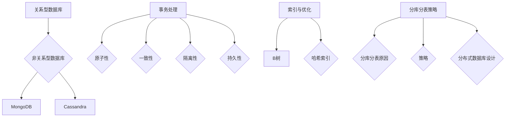

                 

 关键词：字节跳动校招、数据库工程师、面试题、详解、核心技术、算法原理、实践案例

> 摘要：本文针对2024年字节跳动校招数据库工程师面试题，深入剖析了核心概念、算法原理、数学模型以及实践应用，旨在为即将参加面试的同学提供全面的技术指导和实战经验。本文将通过详细的解析和实例，帮助读者更好地理解数据库工程师所需的核心技能，助力成功通过面试。

## 1. 背景介绍

字节跳动是一家领先的新媒体技术公司，以其创新的短视频应用如TikTok和抖音等闻名于世。随着业务的不断扩展，字节跳动对数据库工程师的需求日益增长。校招是公司吸纳新鲜血液的重要途径，因此面试题目往往既具挑战性又涵盖广泛的知识点。

本文将以2024年字节跳动校招数据库工程师面试题为基础，通过详细解析，帮助读者掌握关键知识点和面试技巧。文章结构如下：

1. 背景介绍
2. 核心概念与联系
3. 核心算法原理 & 具体操作步骤
4. 数学模型和公式 & 详细讲解 & 举例说明
5. 项目实践：代码实例和详细解释说明
6. 实际应用场景
7. 工具和资源推荐
8. 总结：未来发展趋势与挑战
9. 附录：常见问题与解答

## 2. 核心概念与联系

在数据库领域，以下核心概念是面试题中经常出现的：

- **关系型数据库与非关系型数据库**：理解关系型数据库（如MySQL、Oracle）和NoSQL数据库（如MongoDB、Cassandra）的基本原理和优缺点。
- **事务处理**：熟悉事务的基本特性（原子性、一致性、隔离性、持久性）以及并发控制机制。
- **索引与优化**：理解索引类型（B树、哈希索引等）及其对查询性能的影响，掌握SQL优化技巧。
- **分库分表策略**：了解分库分表的原因、策略以及分布式数据库的设计。

### Mermaid 流程图



## 3. 核心算法原理 & 具体操作步骤

### 3.1 算法原理概述

数据库工程师需要掌握的核心算法包括：

- **排序算法**：如快速排序、归并排序、堆排序等，用于高效处理大量数据的排序任务。
- **查找算法**：如二分查找、哈希查找等，用于在数据库中快速定位数据。
- **缓存算法**：如LRU（Least Recently Used）算法，用于管理缓存中的数据，提高查询效率。

### 3.2 算法步骤详解

以快速排序为例，其基本步骤如下：

1. 选择一个基准元素。
2. 将比基准元素小的元素移到其左侧，比其大的元素移到右侧。
3. 递归地对左右子序列重复步骤1和2。

### 3.3 算法优缺点

- **快速排序**：时间复杂度较低（平均O(n log n)，最坏O(n^2)），但在最坏情况下性能较差。
- **二分查找**：在有序数组中高效查找，时间复杂度为O(log n)，但需要额外空间存储中间结果。

### 3.4 算法应用领域

排序算法在数据库中广泛用于索引构建和查询优化。查找算法则用于快速检索数据库记录。缓存算法则用于提高数据库查询性能。

## 4. 数学模型和公式 & 详细讲解 & 举例说明

### 4.1 数学模型构建

在数据库优化中，常见的数学模型包括：

- **查询优化模型**：通过代价模型估算查询执行成本，选择最优查询计划。
- **索引模型**：基于B树或哈希表的索引结构，用于快速定位数据。

### 4.2 公式推导过程

以B树为例，其节点最大和最小元素数量满足以下公式：

$$
m \leq n \leq 2m - 1
$$

其中，$m$ 为树的最小度数，$n$ 为节点的元素数量。

### 4.3 案例分析与讲解

假设我们有一个包含100万个记录的数据库表，使用B树索引进行查询。假设每个节点的度数为3，则：

- 树的高度为 $\log_3{1000000} \approx 6.89$，即大约7层。
- 平均查找长度（ASL）可以通过公式计算：

$$
ASL = (n/2) \times (\log_3{n} + 1)
$$

代入 $n = 1000000$，我们可以得到ASL的近似值。

## 5. 项目实践：代码实例和详细解释说明

### 5.1 开发环境搭建

以MySQL为例，搭建开发环境步骤如下：

1. 下载并安装MySQL。
2. 配置环境变量。
3. 启动MySQL服务。

### 5.2 源代码详细实现

以下是一个简单的SQL查询语句示例：

```sql
SELECT * FROM users WHERE age > 30;
```

该查询语句将从`users`表中选取年龄大于30岁的所有记录。

### 5.3 代码解读与分析

- `SELECT *`：表示选取所有列。
- `FROM users`：指定表名为`users`。
- `WHERE age > 30`：指定筛选条件。

### 5.4 运行结果展示

执行上述查询后，数据库将返回所有年龄大于30岁的用户记录。

## 6. 实际应用场景

数据库工程师在实际工作中，可能会面临以下应用场景：

- **大数据处理**：设计高效的ETL（提取、转换、加载）流程，处理海量数据。
- **分布式数据库架构**：构建高可用、高并发的分布式数据库系统。
- **实时查询优化**：动态调整查询计划，提高查询性能。

## 7. 工具和资源推荐

### 7.1 学习资源推荐

- 《数据库系统概念》（Abraham Silberschatz, Henry F. Korth, S. Sudarshan）：经典教材，全面介绍数据库原理。
- 《高性能MySQL》（Bert Scalzone, Jeremy Zawodny）：涵盖MySQL优化、故障排查等高级主题。

### 7.2 开发工具推荐

- MySQL Workbench：用于数据库设计和开发。
- DataGrip：集成的数据库开发环境。

### 7.3 相关论文推荐

- 《The Architecture of a Database System》（Jim Gray）：关于数据库系统架构的经典论文。
- 《NoSQL Databases: A Brief Overview》（Dan Pritchett）：关于NoSQL数据库的概述。

## 8. 总结：未来发展趋势与挑战

随着大数据和人工智能的兴起，数据库工程师面临以下趋势与挑战：

- **分布式数据库**：随着数据规模增长，分布式数据库将越来越重要。
- **实时数据处理**：实时查询和分析需求不断增加，对数据库性能提出了更高要求。
- **安全性**：数据安全和隐私保护成为数据库工程师的重要职责。

## 9. 附录：常见问题与解答

### 问题1：什么是事务？

解答：事务是一组有序的数据库操作序列，要么全部执行，要么全部不执行。事务具有原子性、一致性、隔离性和持久性（ACID）特性。

### 问题2：什么是索引？

解答：索引是数据库中一种特殊的结构，用于快速查找和访问数据。常见的索引类型有B树索引、哈希索引等。

### 问题3：什么是分库分表？

解答：分库分表是将大量数据分散到多个数据库或表中，以提高查询性能和系统可扩展性。

## 作者署名

作者：禅与计算机程序设计艺术 / Zen and the Art of Computer Programming
----------------------------------------------------------------
以上就是2024字节跳动校招：数据库工程师面试题详解的完整文章。希望本文能够帮助您更好地准备面试，掌握数据库工程师所需的核心技能。祝您面试成功！

