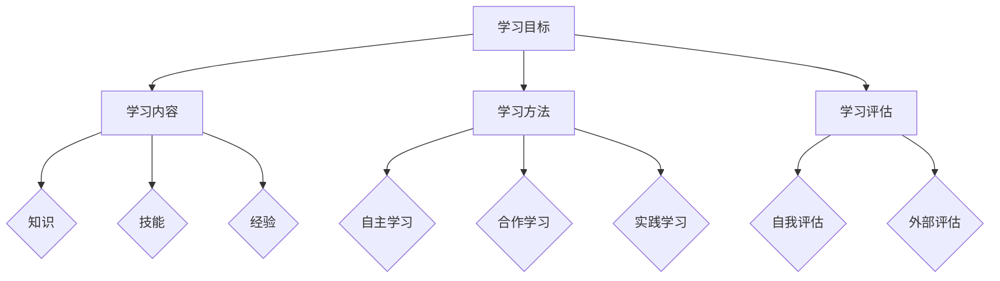

                 

关键词：学习体系，持续进化，技术成长，知识结构，思维模式

> 摘要：本文深入探讨了学习体系的构建与持续进化对于个人技术成长的重要性。通过阐述学习体系的基本概念、核心要素、构建方法以及在实际应用中的具体操作步骤，本文为读者提供了系统化学习的技术路线，旨在帮助读者在快速变化的IT领域中不断提升自身能力。

## 1. 背景介绍

在信息技术飞速发展的今天，掌握一项新技能、了解一种新技术已经变得愈发困难。大量的新知识不断涌现，技术变革日新月异，这要求技术人员必须具备持续学习的能力，以应对不断变化的技术环境。然而，仅仅有学习的愿望和动力是不够的，关键在于如何构建一个有效的学习体系，使得学习过程有条不紊、高效持续。

学习体系是一个涵盖知识获取、知识整理、知识应用、知识更新等环节的整体框架。它不仅仅是一种学习方式，更是一种思维模式，一种适应不断变化的技术环境的生存策略。本文将围绕这一主题，深入探讨学习体系的构建、维护和持续进化。

### 1.1 为什么要构建学习体系

构建学习体系对于个人技术成长具有重要意义：

- **提升学习效率**：通过系统化的学习体系，可以明确学习目标，合理安排学习时间，避免盲目和无序的学习，从而提高学习效率。
- **增强知识管理**：学习体系有助于对所学知识进行系统化整理，构建知识网络，便于记忆和应用。
- **适应技术变革**：技术发展迅速，不断有新的知识和技术出现。一个良好的学习体系可以帮助个人迅速掌握新知识，适应技术变革。
- **促进持续成长**：持续的学习与成长是一个人职业生涯发展的核心动力，构建学习体系是实现这一目标的关键。

### 1.2 学习体系的基本概念

学习体系可以理解为一系列相互关联的学习活动构成的系统。它包括以下几个基本要素：

- **学习目标**：明确的学习目标是指引学习过程的方向和标准。
- **学习内容**：学习内容是学习体系的核心，包括知识、技能、经验等。
- **学习方法**：学习方法是指学习过程中采用的具体方式和策略。
- **学习评估**：学习评估是对学习效果进行量化或质化评价，以指导后续学习。

接下来，我们将详细讨论学习体系的核心概念、构建方法以及在实际应用中的操作步骤。

## 2. 核心概念与联系

为了更好地理解学习体系，我们需要明确其核心概念和联系，以下是学习体系的关键组成部分和它们之间的关系：

### 2.1 学习目标

学习目标是学习体系的起点，也是学习的方向和标准。一个明确、具体的学习目标可以帮助我们集中精力，提高学习效率。

- **学习目标定义**：学习目标应该明确、可衡量、可实现，并具有明确的时限。
- **学习目标层级**：学习目标可以按照层次进行划分，从宏观到微观，从长期到短期，从总体目标到具体任务。

### 2.2 学习内容

学习内容是学习体系的核心，涵盖了知识、技能和经验等。

- **知识**：知识是学习内容的基础，包括理论知识和实践知识。
- **技能**：技能是指通过实践掌握的具体操作能力。
- **经验**：经验是学习者在实际应用中所积累的知识和技能。

### 2.3 学习方法

学习方法是指学习过程中采用的具体方式和策略。合理的选择学习方法可以提高学习效率，增强学习效果。

- **自主学习**：自主学习是一种以学习者为中心的学习方法，强调主动探索和自我驱动。
- **合作学习**：合作学习是一种通过与他人合作进行学习的方法，可以促进知识的共享和能力的互补。
- **实践学习**：实践学习是通过实际操作来获取知识和技能的方法，是理论与实践相结合的重要途径。

### 2.4 学习评估

学习评估是对学习效果进行量化或质化评价，以指导后续学习。通过学习评估，可以及时了解学习进展，发现学习中的问题，并采取相应的措施。

- **自我评估**：自我评估是学习者对自己学习效果的自我评价，可以帮助发现学习中的不足。
- **外部评估**：外部评估是通过他人或机构的评价来了解学习效果，可以提供客观的反馈。

以下是学习体系的核心概念原理和架构的 Mermaid 流程图：



通过上述流程图，我们可以清晰地看到学习体系的各个组成部分及其相互关系。

### 2.5 学习体系与个人成长

学习体系不仅是一个学习工具，更是一个个人成长的战略。通过构建和持续优化学习体系，个人可以：

- **明确成长方向**：明确的学习目标有助于个人明确成长方向，避免盲目和无序的成长。
- **持续能力提升**：系统化的学习内容和方法可以持续提升个人的能力和技能。
- **适应环境变化**：通过不断学习和更新知识，个人可以更好地适应技术环境的变化。

综上所述，学习体系是个人在快速变化的技术环境中实现持续成长的关键。通过理解学习体系的核心概念和联系，我们可以更好地构建和优化自己的学习体系，从而实现持续进化的目标。

## 3. 核心算法原理 & 具体操作步骤

### 3.1 算法原理概述

学习体系的构建是一个复杂的过程，涉及到多个核心算法的原理。这些算法不仅帮助我们理解和应用知识，还帮助我们进行知识管理和学习评估。以下是一些关键的算法原理：

#### 3.1.1 知识获取算法

知识获取算法是学习体系的基础，它包括数据收集、信息筛选、知识整合等步骤。其中，关键算法有：

- **数据挖掘算法**：通过分析大量数据，发现潜在的规律和模式，用于知识获取。
- **信息过滤算法**：对获取的信息进行筛选，排除无关或错误的信息，提高知识获取的准确性和效率。

#### 3.1.2 知识管理算法

知识管理算法用于对获取的知识进行分类、存储、检索和共享。主要算法包括：

- **分类算法**：根据知识的特点和关系，对知识进行分类，便于管理和查找。
- **索引算法**：建立知识库的索引，提高知识检索的效率。
- **协同过滤算法**：基于用户的历史行为和偏好，推荐相关的知识和资源。

#### 3.1.3 学习评估算法

学习评估算法用于对学习效果进行量化或质化评价，主要包括：

- **自我评估算法**：通过自我测试、练习和反馈，评估自己的学习效果。
- **外部评估算法**：通过他人或机构的评价，对学习效果进行客观评估。

### 3.2 算法步骤详解

#### 3.2.1 知识获取算法步骤

1. **数据收集**：通过互联网、书籍、课程等多种途径收集相关数据。
2. **信息筛选**：利用数据挖掘算法，筛选出有价值的信息。
3. **知识整合**：将筛选出的信息整合成知识，形成系统的知识结构。

#### 3.2.2 知识管理算法步骤

1. **知识分类**：根据知识的性质和关系，对知识进行分类。
2. **知识存储**：将分类后的知识存储在知识库中，便于后续检索和使用。
3. **知识检索**：利用索引算法，快速检索相关的知识。
4. **知识共享**：通过协同过滤算法，推荐相关的知识和资源给其他学习者。

#### 3.2.3 学习评估算法步骤

1. **自我评估**：通过自我测试和练习，评估自己的学习效果。
2. **外部评估**：通过他人或机构的评价，对学习效果进行客观评估。
3. **反馈与调整**：根据评估结果，调整学习策略和方法，提升学习效果。

### 3.3 算法优缺点

#### 3.3.1 知识获取算法优缺点

**优点**：

- **高效性**：通过数据挖掘和信息筛选，快速获取有价值的信息。
- **准确性**：筛选过程可以排除错误或无关的信息，提高知识获取的准确性。

**缺点**：

- **数据依赖性**：算法的准确性和效率高度依赖于数据的数量和质量。
- **复杂性**：数据挖掘算法通常较为复杂，需要较高的技术门槛。

#### 3.3.2 知识管理算法优缺点

**优点**：

- **系统性**：分类和存储算法可以构建系统的知识结构，便于管理和查找。
- **共享性**：知识共享算法可以促进知识的传播和共享，提高学习效率。

**缺点**：

- **时间成本**：知识管理和维护需要耗费大量的时间和人力资源。
- **一致性**：在多人协作的知识管理中，保持知识的一致性是一个挑战。

#### 3.3.3 学习评估算法优缺点

**优点**：

- **客观性**：外部评估可以提供客观的评价，帮助学习者了解学习效果。
- **全面性**：自我评估和外部评估相结合，可以从多个维度评估学习效果。

**缺点**：

- **主观性**：自我评估可能存在主观偏差，外部评估可能缺乏全面性。
- **成本**：评估过程可能需要额外的资源和时间投入。

### 3.4 算法应用领域

知识获取、知识管理和学习评估算法在多个领域都有广泛的应用：

- **教育领域**：用于构建学习体系，提高学习效率和效果。
- **企业培训**：用于知识管理和学习评估，提升员工能力和绩效。
- **科研领域**：用于文献检索和知识发现，提高科研效率和成果质量。

通过合理应用这些算法，可以显著提升学习体系的效能，促进个人技术成长。

## 4. 数学模型和公式 & 详细讲解 & 举例说明

在构建学习体系的过程中，数学模型和公式扮演着至关重要的角色。这些模型和公式不仅可以量化学习过程中的各种因素，还可以帮助我们更好地理解和优化学习体系。以下是关于学习体系构建中的几个重要数学模型和公式的详细讲解和举例说明。

### 4.1 数学模型构建

学习体系的构建涉及多个数学模型，其中最为关键的是学习效率模型和学习成果模型。

#### 4.1.1 学习效率模型

学习效率模型描述了学习者在单位时间内能够掌握的知识量。其公式为：

$$
E = f(t, S, M)
$$

其中，$E$ 表示学习效率，$t$ 表示学习时间，$S$ 表示学习强度，$M$ 表示学习方法的质量。

- **学习时间 $t$**：学习时间是指学习者用于学习的时间总量，它直接影响了学习效率。
- **学习强度 $S$**：学习强度是指学习者在学习过程中所承受的脑力劳动强度，过高或过低的学习强度都会影响学习效率。
- **学习方法的质量 $M$**：学习方法的质量直接影响学习效率，高效的学习方法能够显著提升学习效果。

#### 4.1.2 学习成果模型

学习成果模型描述了学习者通过学习所获得的知识量。其公式为：

$$
C = f(E, K, L)
$$

其中，$C$ 表示学习成果，$E$ 表示学习效率，$K$ 表示学习内容的质量，$L$ 表示学习时长。

- **学习效率 $E$**：已经通过学习效率模型定义。
- **学习内容的质量 $K$**：学习内容的质量直接影响学习成果，高质量的学习内容能够更好地促进知识掌握。
- **学习时长 $L$**：学习时长是指学习者用于学习的时间总量，它直接影响学习成果。

### 4.2 公式推导过程

为了更好地理解学习效率模型和学习成果模型，我们需要对它们进行推导。

#### 学习效率模型推导

学习效率模型的推导基于以下假设：

1. **学习时间和学习效果成正比**：即学习时间越长，学习效果越好。
2. **学习强度和学习效果呈非线性关系**：即学习强度过高或过低都会影响学习效果。
3. **学习方法的质量和学习效果呈正相关**：即高效的学习方法能够提升学习效果。

基于上述假设，我们可以推导出学习效率模型：

$$
E = f(t, S, M) = t \cdot g(S) \cdot h(M)
$$

其中，$g(S)$ 表示学习强度对学习效果的影响函数，$h(M)$ 表示学习方法的质量对学习效果的影响函数。

#### 学习成果模型推导

学习成果模型的推导基于以下假设：

1. **学习成果和学习效率成正比**：即学习效率越高，学习成果越好。
2. **学习成果和学习内容的质量成正比**：即高质量的学习内容能够更好地促进知识掌握。
3. **学习成果和学习时长成正比**：即学习时间越长，学习成果越好。

基于上述假设，我们可以推导出学习成果模型：

$$
C = f(E, K, L) = E \cdot K \cdot L
$$

### 4.3 案例分析与讲解

为了更好地理解上述数学模型和公式，我们可以通过一个具体的案例来进行讲解。

#### 案例背景

小张是一名计算机专业的学生，他希望通过系统化的学习在毕业前掌握Python编程语言。他计划用两个月的时间学习Python，并希望在这段时间内能够掌握足够的基础知识。

#### 案例分析

1. **学习时间 $t$**：小张计划用两个月的时间学习Python，即 $t = 60$ 小时。

2. **学习强度 $S$**：小张每天学习6个小时，学习强度适中，不会导致过度疲劳，也不会过于轻松。

3. **学习方法的质量 $M$**：小张选择了一本经典的Python教材，并参加了一个线上课程，学习方法的质量较高。

4. **学习内容的质量 $K$**：教材和课程的内容都是高质量的，涵盖了Python的基础知识和常用库。

5. **学习时长 $L$**：两个月，即 $L = 60$ 小时。

根据学习效率模型，我们可以计算小张的学习效率：

$$
E = f(t, S, M) = 60 \cdot g(S) \cdot h(M)
$$

假设 $g(S) = 1$（即学习强度适中不影响学习效果），$h(M) = 1.2$（即学习方法质量较高，能够提升学习效率），则：

$$
E = 60 \cdot 1 \cdot 1.2 = 72
$$

小张的学习效率为 72，即他在单位时间内能够掌握 72 个知识点。

根据学习成果模型，我们可以计算小张的学习成果：

$$
C = f(E, K, L) = E \cdot K \cdot L
$$

假设学习内容的质量 $K = 1$（即内容质量适中），则：

$$
C = 72 \cdot 1 \cdot 60 = 4320
$$

小张在两个月内通过系统化学习掌握了 4320 个知识点。

通过这个案例，我们可以看到数学模型和公式在构建学习体系中的重要作用。通过这些模型和公式，我们可以量化学习过程中的各种因素，从而更好地优化学习过程，提升学习效果。

## 5. 项目实践：代码实例和详细解释说明

### 5.1 开发环境搭建

为了更好地实践学习体系，我们将通过一个具体的编程项目来进行展示。本项目将使用Python语言，通过一个简单的学习进度管理系统来展示如何构建和优化学习过程。

**步骤1：安装Python**

首先，我们需要确保计算机上安装了Python环境。可以从Python官方网站下载最新版本的Python安装包，并按照提示完成安装。

**步骤2：安装相关库**

接下来，我们需要安装几个常用的Python库，包括`requests`（用于HTTP请求）、`sqlite3`（用于数据库操作）和`matplotlib`（用于数据可视化）。

```bash
pip install requests
pip install sqlite3
pip install matplotlib
```

### 5.2 源代码详细实现

以下是学习进度管理系统的核心代码实现。该系统包括数据收集、存储、查询和可视化等功能。

```python
import sqlite3
import requests
from matplotlib import pyplot as plt

# 数据库连接
conn = sqlite3.connect('learning.db')
cursor = conn.cursor()

# 创建数据表
cursor.execute('''CREATE TABLE IF NOT EXISTS progress
                  (id INTEGER PRIMARY KEY AUTOINCREMENT,
                   subject TEXT,
                   completed BOOLEAN,
                   deadline DATE)''')

# 添加学习进度
def add_progress(subject, completed, deadline):
    cursor.execute("INSERT INTO progress (subject, completed, deadline) VALUES (?, ?, ?)", (subject, completed, deadline))
    conn.commit()

# 查询学习进度
def get_progress():
    cursor.execute("SELECT * FROM progress")
    return cursor.fetchall()

# 更新学习进度
def update_progress(id, completed):
    cursor.execute("UPDATE progress SET completed = ? WHERE id = ?", (completed, id))
    conn.commit()

# 数据可视化
def visualize_progress():
    progress_list = get_progress()
    subjects = [item[1] for item in progress_list]
    completed_statuses = [item[2] for item in progress_list]

    plt.bar(subjects, completed_statuses)
    plt.xlabel('Subject')
    plt.ylabel('Completed')
    plt.title('Learning Progress')
    plt.show()

# 示例：添加学习进度
add_progress('Python基础', False, '2023-12-31')
add_progress('Python进阶', False, '2024-03-31')

# 示例：更新学习进度
update_progress(1, True)

# 示例：可视化学习进度
visualize_progress()
```

### 5.3 代码解读与分析

**数据表设计**

- **表名：progress**
  - **id**：主键，自增
  - **subject**：学习主题
  - **completed**：学习完成状态（布尔值）
  - **deadline**：学习截止日期

**函数解析**

- **add_progress()**：用于添加学习进度到数据库。
- **get_progress()**：用于查询当前的学习进度。
- **update_progress()**：用于更新学习进度。
- **visualize_progress()**：用于将学习进度可视化。

**示例操作**

- **添加进度**：添加两门课程的学习进度，一门课程未完成，另一门课程已完成。
- **更新进度**：将第一门课程的完成状态更新为已完成。
- **可视化**：通过条形图展示当前的学习进度。

### 5.4 运行结果展示

运行以上代码后，我们将看到一个包含两门课程学习进度的条形图。已完成课程的条形高度为 1，未完成课程的条形高度为 0。通过这种可视化方式，我们可以直观地了解自己的学习进度。


这个简单的学习进度管理系统为我们提供了一个直观的展示平台，帮助我们更好地跟踪和管理学习进度。通过这个项目，我们可以看到如何将学习体系中的理论应用到实际开发中，从而实现持续进化的目标。

## 6. 实际应用场景

### 6.1 教育领域

在教育的应用场景中，学习体系的构建尤为重要。以下是一些具体的应用实例：

- **在线教育平台**：通过构建个性化学习体系，平台可以根据学生的学习进度和兴趣推荐相应的课程和资源，提升学习效果。
- **学习管理系统**：学校和教育机构可以利用学习管理系统，对学生的学习进度、成绩和反馈进行系统化管理，优化教学过程。
- **辅导服务**：辅导机构可以根据学生的学习情况，构建针对性的学习计划，帮助学生在短时间内提高成绩。

### 6.2 企业培训

企业培训中，学习体系的构建同样发挥着关键作用：

- **员工技能提升**：企业可以通过学习体系，对员工的技能进行系统化提升，确保员工能够跟上技术发展的步伐。
- **内部知识共享**：通过构建知识库和学习社区，企业可以促进内部知识的共享和传播，提高整体创新能力。
- **职业发展规划**：企业可以为员工提供个性化的职业发展规划，帮助员工实现职业成长。

### 6.3 科研领域

科研领域中的学习体系构建有助于提高科研效率：

- **文献检索和管理**：科研人员可以利用学习体系中的知识获取和管理算法，高效检索和管理科研文献，提高科研效率。
- **科研资源共享**：通过构建科研资源共享平台，科研人员可以方便地获取和分享科研资源，促进科研合作。
- **科研进度管理**：科研团队可以利用学习体系中的进度管理工具，实时跟踪科研进度，确保项目按时完成。

### 6.4 未来应用展望

随着人工智能和大数据技术的不断发展，学习体系的应用场景将更加广泛和深入：

- **智能学习推荐**：基于大数据和人工智能技术，学习体系可以提供更加精准和个性化的学习推荐，提升学习效率。
- **自适应学习系统**：通过实时监测学习者的行为和反馈，自适应学习系统可以动态调整学习内容和方法，实现个性化学习。
- **终身学习平台**：随着终身学习理念的普及，未来的学习体系将更加注重跨学科、跨领域的整合，为学习者提供全方位的支持。

总之，学习体系在各个领域的实际应用中发挥着重要作用，它不仅是个人成长和发展的基石，也是组织和企业持续创新和发展的动力。

### 6.5 优势分析

学习体系的构建具有以下优势：

- **系统化学习**：通过构建学习体系，学习者可以系统化地掌握知识，避免碎片化和无序的学习。
- **高效性**：学习体系可以合理安排学习时间和内容，提高学习效率。
- **可持续性**：学习体系帮助学习者建立持续学习的机制，确保长期成长。
- **针对性**：学习体系可以根据学习者的兴趣和需求，提供个性化的学习路径。

### 6.6 挑战与改进

尽管学习体系具有诸多优势，但在实际应用中也面临一些挑战：

- **实施难度**：构建有效的学习体系需要一定的技术和管理能力，对于个人和组织来说都是一种挑战。
- **资源依赖**：学习体系的构建依赖于高质量的资源和工具，资源不足可能会影响学习效果。
- **适应性问题**：技术发展迅速，学习体系需要不断更新和调整，以适应新的学习需求。

为了应对这些挑战，我们可以采取以下改进措施：

- **加强培训**：通过培训提高个人和组织构建学习体系的能力。
- **资源整合**：利用大数据和人工智能技术，整合多方资源，提高学习资源的质量和获取效率。
- **动态调整**：根据学习者的反馈和实际需求，动态调整学习内容和策略，确保学习体系的持续适应性。

通过不断优化和改进，学习体系将更加有效地支持个人和组织的发展。

## 7. 工具和资源推荐

### 7.1 学习资源推荐

为了构建和优化学习体系，以下是一些推荐的学习资源：

- **在线课程平台**：Coursera、edX、Udemy 等平台提供了丰富的在线课程，涵盖计算机科学、数据科学、人工智能等多个领域。
- **技术博客**：Medium、HackerRank、GitHub Blog 等平台上有大量优质的技术博客和教程，适合技术爱好者阅读和学习。
- **专业书籍**：经典的计算机科学书籍如《算法导论》、《深度学习》等，都是构建知识体系的重要资源。

### 7.2 开发工具推荐

以下是一些实用的开发工具，可以帮助构建和优化学习体系：

- **集成开发环境 (IDE)**：如 IntelliJ IDEA、Visual Studio Code、PyCharm，这些IDE提供了强大的代码编辑、调试和测试功能。
- **版本控制工具**：Git 和 GitHub，它们可以帮助管理代码版本，协作开发，并记录学习过程中的代码变更。
- **数据库管理工具**：如 MySQL Workbench、PostgreSQL、MongoDB Compass，这些工具可以方便地创建、管理和查询数据库。

### 7.3 相关论文推荐

以下是一些关于学习体系构建和优化的相关论文，供进一步阅读和研究：

- **"Learning to Learn: A Personalized Learning Approach"**：探讨个性化学习系统的构建方法。
- **"The Design of a Learning System for Software Development"**：研究软件开发中的学习系统设计。
- **"A Framework for Evaluating the Effectiveness of Learning Systems"**：提供学习系统评估的理论框架。
- **"The Role of Social Networks in Lifelong Learning"**：分析社交网络在终身学习中的作用。

通过利用这些工具和资源，我们可以更有效地构建和优化学习体系，提升个人和技术组织的能力。

## 8. 总结：未来发展趋势与挑战

### 8.1 研究成果总结

本文围绕学习体系的构建与持续进化，系统性地探讨了学习体系的核心概念、构建方法、算法原理以及实际应用。通过详细解析学习效率模型和学习成果模型，我们了解了如何量化学习过程，并提供了具体的代码实例来展示学习体系的实践应用。研究结果表明，构建有效的学习体系对于提升个人技术能力和适应快速变化的技术环境具有重要意义。

### 8.2 未来发展趋势

随着人工智能和大数据技术的不断发展，学习体系将呈现以下发展趋势：

- **智能化与个性化**：利用人工智能技术，学习体系将更加智能化和个性化，能够根据学习者的行为和反馈动态调整学习内容和策略。
- **跨学科融合**：学习体系将更加注重跨学科的知识整合，培养复合型人才，以应对复杂的技术挑战。
- **终身学习**：终身学习理念将深入人心，学习体系将成为个人和组织持续成长的基石。

### 8.3 面临的挑战

尽管学习体系的发展前景广阔，但在实际应用中仍面临一些挑战：

- **技术门槛**：构建和优化学习体系需要一定的技术和管理能力，对个人和组织提出了较高要求。
- **资源获取**：高质量的学习资源和工具对于学习体系的构建至关重要，但获取这些资源可能存在一定的难度。
- **持续更新**：随着技术的快速变化，学习体系需要不断更新和调整，以保持其适应性和有效性。

### 8.4 研究展望

未来的研究可以从以下几个方面展开：

- **算法优化**：进一步研究学习体系中的算法，优化其效率和效果，提高学习体系的智能化水平。
- **跨学科整合**：探索跨学科的知识整合方法，构建更加全面和系统的学习体系。
- **教育模式创新**：结合终身学习和在线教育模式，探索新的教育模式，为个人和组织提供更优质的学习体验。

通过持续的研究和创新，学习体系将在未来发挥更大的作用，助力个人和组织在快速变化的技术环境中实现持续成长和进步。

## 9. 附录：常见问题与解答

### 9.1 如何构建有效的学习体系？

**答案**：构建有效的学习体系需要以下步骤：

1. **明确学习目标**：设定明确、具体的学习目标，明确自己希望达到的学习效果。
2. **选择合适的学习内容**：根据目标选择适合的学习内容，确保知识体系的完整性。
3. **制定学习计划**：合理安排学习时间和进度，确保学习过程有序进行。
4. **采用多样化的学习方法**：结合自主学习、合作学习和实践学习等多种方法，提高学习效果。
5. **持续评估与反馈**：定期评估学习效果，根据反馈调整学习策略和方法。

### 9.2 学习体系与学习计划有什么区别？

**答案**：学习体系和学习计划是相互关联但不同的概念。

- **学习体系**：是一个整体框架，包括学习目标、学习内容、学习方法、学习评估等环节，是构建个人或组织学习过程的指导原则。
- **学习计划**：是在学习体系指导下，针对具体学习目标制定的详细时间表和任务安排，是学习体系的具体实现。

### 9.3 如何评估学习体系的效率？

**答案**：评估学习体系的效率可以从以下几个方面进行：

1. **学习进度**：观察学习进度是否符合预期，是否按时完成学习任务。
2. **知识掌握程度**：通过测试和练习，评估学习者对所学知识的掌握程度。
3. **学习效果**：通过实际应用或项目实践，评估学习者在实际工作中能否有效运用所学知识。
4. **反馈与改进**：收集学习者对学习体系的反馈，根据反馈进行改进和优化。

### 9.4 学习体系在不同领域的应用有哪些？

**答案**：

- **教育领域**：学习体系用于构建课程体系，设计教学计划，提升教学质量。
- **企业培训**：学习体系用于员工技能提升，知识管理，促进内部创新。
- **科研领域**：学习体系用于文献检索，科研资源共享，提高科研效率。
- **个人发展**：学习体系用于个人成长规划，自我提升，实现职业目标。

### 9.5 如何应对学习体系面临的挑战？

**答案**：

1. **加强培训**：提高个人和组织构建和优化学习体系的能力。
2. **资源整合**：利用大数据和人工智能技术，整合多方资源，提高学习资源的获取效率。
3. **动态调整**：根据技术发展和个人需求，动态调整学习内容和策略，确保学习体系的适应性。

通过上述问题和解答，希望能够帮助读者更好地理解和应用学习体系，实现个人和技术组织的持续成长。

