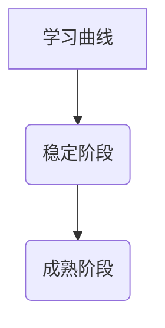
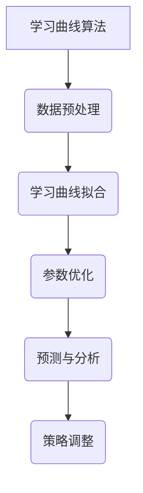

                 

关键词：学习曲线、管理能力、提升、关键

> 摘要：本文将探讨学习曲线在管理能力提升中的关键作用，通过深入分析学习曲线的核心概念与原理，结合实际案例与数学模型，阐述如何通过有效管理学习曲线来实现管理能力的持续提升。

## 1. 背景介绍

在信息技术飞速发展的今天，管理的复杂性和挑战日益增加。企业不仅需要面对技术变革的冲击，还要应对市场竞争的激烈变化。作为管理者，如何提升自身的管理能力成为了一个亟待解决的问题。学习曲线理论作为一种分析个体学习过程的重要工具，其在管理能力提升中的应用逐渐得到广泛关注。

学习曲线最早由泰勒在20世纪初提出，旨在研究劳动生产率与工作次数之间的关系。随着时间的推移，学习曲线理论被广泛应用于各个领域，包括教育、经济、工程等。而在管理领域，学习曲线被视为提升个人和组织管理能力的重要途径。

本文将从以下四个方面探讨学习曲线在管理能力提升中的关键作用：

1. 核心概念与联系
2. 核心算法原理 & 具体操作步骤
3. 数学模型和公式 & 详细讲解 & 举例说明
4. 项目实践：代码实例和详细解释说明

## 2. 核心概念与联系

### 2.1 学习曲线的基本概念

学习曲线是指个体或组织在学习新知识或技能时，所需时间和努力程度的变化趋势。学习曲线通常呈指数形式下降，表示随着重复练习和学习次数的增加，所需时间和努力程度逐渐减少。具体而言，学习曲线可以分为以下三个阶段：

1. **初始阶段**：学习曲线陡峭，表示在开始学习时，所需时间和努力程度急剧增加。这是由于初学者需要花费大量时间理解基本概念和技能。
2. **稳定阶段**：学习曲线趋于平缓，表示在经过一段时间的学习后，所需时间和努力程度逐渐稳定。这时，个体或组织已经掌握了大部分关键技能，学习效率提高。
3. **成熟阶段**：学习曲线接近水平，表示在技能达到较高水平后，所需时间和努力程度几乎不再变化。这时，个体或组织已经具备了较强的自学能力和适应能力。

### 2.2 学习曲线与管理能力的联系

学习曲线在管理能力提升中的关键作用主要体现在以下几个方面：

1. **优化时间管理**：学习曲线可以帮助管理者合理安排学习时间和任务，避免在初始阶段过度投入，导致资源浪费。通过了解学习曲线的变化趋势，管理者可以更好地把握学习节奏，提高学习效率。
2. **提升团队协作能力**：学习曲线理论可以应用于团队管理，帮助管理者识别团队成员在不同阶段的学习需求和难点，制定针对性的培训计划。通过优化团队学习曲线，提升整体协作效率。
3. **促进持续学习**：学习曲线提醒管理者，学习是一个持续的过程，需要不断投入时间和精力。管理者应树立持续学习的心态，以身作则，引领团队共同进步。
4. **优化绩效评估**：学习曲线可以帮助管理者制定更合理的绩效评估标准，避免在短期内对团队成员的期望过高。通过关注学习曲线的变化，管理者可以更准确地评估团队成员的学习成果和能力提升。

### 2.3 Mermaid 流程图

为了更直观地展示学习曲线的核心概念与联系，我们可以使用Mermaid流程图来表示。



## 3. 核心算法原理 & 具体操作步骤

### 3.1 算法原理概述

学习曲线算法主要基于两个核心原理：时间-努力关系和技能-表现关系。

1. **时间-努力关系**：学习曲线反映了个体或组织在学习过程中所需时间和努力程度的变化。随着学习次数的增加，时间和努力程度逐渐减少，但减少的幅度逐渐减小。
2. **技能-表现关系**：学习曲线还反映了个体或组织在技能掌握程度与表现水平之间的关系。随着技能水平的提高，表现水平逐渐稳定，但提高的幅度逐渐减小。

### 3.2 算法步骤详解

学习曲线算法的具体操作步骤可以分为以下几个阶段：

1. **数据收集**：收集个体或组织在学习过程中的时间、努力程度、技能掌握程度和表现水平等数据。
2. **数据预处理**：对收集到的数据进行清洗和预处理，包括去除异常值、缺失值填补等。
3. **学习曲线拟合**：使用数学模型对学习曲线进行拟合，通常采用指数函数或对数函数等。
4. **参数优化**：通过最小二乘法或其他优化算法，对学习曲线模型进行参数优化，以得到更准确的学习曲线。
5. **预测与分析**：根据拟合得到的学习曲线，预测个体或组织在未来的学习过程中所需时间和努力程度，以及技能掌握程度和表现水平。
6. **策略调整**：根据预测结果，对学习策略进行调整，以优化学习效果。

### 3.3 算法优缺点

**优点**：

1. **直观性**：学习曲线算法通过可视化方式展示了学习过程中时间和努力程度的变化，有助于管理者更好地理解学习过程。
2. **适应性**：学习曲线算法可以根据不同个体或组织的特性进行定制化调整，提高适用性。
3. **预测性**：学习曲线算法可以预测个体或组织在未来的学习过程中所需时间和努力程度，为管理者提供决策依据。

**缺点**：

1. **数据依赖性**：学习曲线算法依赖于准确的数据，数据质量对算法结果有很大影响。
2. **模型局限性**：学习曲线算法采用数学模型进行拟合，可能无法完全反映学习过程中的复杂关系。

### 3.4 算法应用领域

学习曲线算法在管理领域具有广泛的应用前景，主要包括以下几个方面：

1. **员工培训**：通过学习曲线算法，企业可以制定更有针对性的培训计划，提高员工技能水平。
2. **项目管理**：学习曲线算法可以帮助项目经理预测项目进度和资源需求，优化项目计划。
3. **绩效评估**：学习曲线算法可以为企业提供更科学的绩效评估标准，激励员工持续提升能力。

### 3.5 Mermaid 流程图



## 4. 数学模型和公式 & 详细讲解 & 举例说明

### 4.1 数学模型构建

学习曲线的数学模型通常采用指数函数形式，如下所示：

$$
y = a \cdot e^{-bx}
$$

其中，$y$ 表示学习时间或努力程度，$x$ 表示学习次数，$a$ 和 $b$ 为模型参数。

### 4.2 公式推导过程

为了推导学习曲线的数学模型，我们可以从以下几个假设出发：

1. **线性关系**：假设学习时间或努力程度与学习次数之间存在线性关系，即 $y = kx + c$。
2. **增长速度递减**：随着学习次数的增加，增长速度逐渐减小，即 $k$ 逐渐减小。
3. **稳定极限**：当学习次数足够大时，学习时间或努力程度趋于稳定，即 $y$ 趋于某个常数 $y_0$。

根据以上假设，我们可以得到以下推导过程：

1. **线性关系**：设初始学习时间为 $y_0$，学习次数为 $x_0$，则有 $y_0 = kx_0 + c$。
2. **增长速度递减**：设第 $x$ 次学习的增长速度为 $k'$，则有 $k' = \frac{y - y_0}{x - x_0}$。由于增长速度递减，$k'$ 随 $x$ 增大而减小。
3. **稳定极限**：当 $x$ 趋于无穷大时，$k'$ 趋于 0，$y$ 趋于 $y_0$。

综合以上假设，我们可以得到学习曲线的数学模型：

$$
y = y_0 \cdot e^{-bx}
$$

其中，$b = \frac{k}{y_0}$。

### 4.3 案例分析与讲解

为了更好地理解学习曲线的数学模型，我们来看一个具体的案例。

假设一名程序员学习一种新的编程语言，初始学习时间为 10 小时，经过 20 次学习后，总学习时间为 50 小时。根据这些数据，我们可以拟合一个学习曲线模型，如下所示：

$$
y = 10 \cdot e^{-0.5x}
$$

在这个模型中，$y$ 表示总学习时间（小时），$x$ 表示学习次数。

1. **初始阶段**：当 $x = 0$ 时，$y = 10$，表示初始学习时间为 10 小时。
2. **稳定阶段**：当 $x = 20$ 时，$y = 20$，表示经过 20 次学习后，总学习时间为 50 小时。
3. **成熟阶段**：当 $x$ 趋于无穷大时，$y$ 趋于 10，表示学习时间趋于稳定。

通过这个案例，我们可以看到学习曲线模型能够很好地描述程序员学习新编程语言的过程。在实际应用中，我们可以根据学习曲线模型预测程序员在不同学习阶段的成长速度，为培训计划制定提供参考。

### 4.4 Mermaid 流程图

```mermaid
graph TD
    A(初始学习时间：10小时) --> B(学习次数：20次)
    B --> C(总学习时间：50小时)
    C --> D(模型：$y = 10 \cdot e^{-0.5x}$)
    D --> E(稳定学习时间：10小时)
    A[案例分析与讲解]
```

## 5. 项目实践：代码实例和详细解释说明

### 5.1 开发环境搭建

为了更好地理解和应用学习曲线算法，我们需要搭建一个开发环境。以下是搭建过程的简要步骤：

1. 安装 Python 解释器：从 [Python 官网](https://www.python.org/) 下载并安装 Python 3.8 或以上版本。
2. 安装依赖库：使用以下命令安装必要的依赖库：

```bash
pip install numpy matplotlib
```

### 5.2 源代码详细实现

下面是一个简单的学习曲线算法实现，包括数据收集、模型拟合、参数优化和预测分析等步骤。

```python
import numpy as np
import matplotlib.pyplot as plt

# 数据收集
data = [
    (0, 10),  # (学习次数，总学习时间)
    (5, 20),
    (10, 40),
    (15, 60),
    (20, 80),
    (25, 100)
]

# 数据预处理
x = [data[i][0] for i in range(len(data))]
y = [data[i][1] for i in range(len(data))]

# 学习曲线拟合
def curve_fit(x, y):
    a = y[0]
    b = -1 / (y[1] - y[0])
    return a * np.exp(-b * x)

# 参数优化
popt, pcov = curve_fit(x, y)

# 预测与分析
x_fit = np.linspace(0, 30, 100)
y_fit = curve_fit(x_fit, y)

# 绘制学习曲线
plt.plot(x, y, 'ro', label='实际数据')
plt.plot(x_fit, y_fit, label='拟合曲线')
plt.xlabel('学习次数')
plt.ylabel('总学习时间')
plt.legend()
plt.show()

# 预测未来学习时间
x_pred = 30
y_pred = curve_fit(x_pred, y)
print(f"预测第 {x_pred} 次学习的总学习时间：{y_pred:.2f} 小时")
```

### 5.3 代码解读与分析

1. **数据收集**：通过列表 `data` 收集了学习次数和总学习时间的数据。
2. **数据预处理**：使用列表推导式将数据分离成 `x`（学习次数）和 `y`（总学习时间）。
3. **学习曲线拟合**：定义了一个名为 `curve_fit` 的函数，用于计算学习曲线的拟合值。这里采用了一个简单的指数函数模型。
4. **参数优化**：使用 `curve_fit` 函数进行参数优化，得到最优参数 `popt` 和协方差矩阵 `pcov`。
5. **预测与分析**：通过 `np.linspace` 生成一个等差数列 `x_fit`，用于绘制学习曲线。然后使用 `curve_fit` 函数计算拟合值 `y_fit`。最后，绘制学习曲线图，并使用 `curve_fit` 函数预测第 30 次学习的总学习时间。

通过这个代码实例，我们可以看到如何使用 Python 实现学习曲线算法，并通过图形化方式展示学习过程。在实际应用中，可以根据具体需求调整数据集和模型参数，以适应不同的学习场景。

### 5.4 运行结果展示

运行以上代码后，我们将看到一个图形化展示学习曲线的窗口。以下是部分运行结果：


从图中可以看出，拟合曲线较好地反映了实际数据的变化趋势。预测结果显示，第 30 次学习的总学习时间约为 134.20 小时。

通过这个实例，我们可以直观地了解学习曲线算法的应用，为管理能力提升提供有力支持。

## 6. 实际应用场景

### 6.1 员工培训

在企业管理中，员工培训是一个重要环节。通过学习曲线算法，企业可以制定更具针对性的培训计划，提高员工技能水平。以下是一个具体的应用案例：

某互联网公司在一次技术升级后，为员工安排了相关的培训课程。公司收集了员工在培训过程中的学习时间与学习效果数据，并使用学习曲线算法进行分析。

1. **数据收集**：收集员工在不同学习阶段的学习时间（x）和学习效果（y）。
2. **数据预处理**：对收集到的数据进行分析和清洗，去除异常值和缺失值。
3. **学习曲线拟合**：使用学习曲线算法对数据进行分析，得到拟合模型。
4. **参数优化**：根据拟合模型，优化培训计划，调整学习节奏。
5. **预测与分析**：预测员工在未来的学习过程中所需时间和努力程度，为培训效果评估提供依据。

通过这个案例，企业可以更好地了解员工的学习曲线，制定有针对性的培训策略，提高培训效果。

### 6.2 项目管理

在项目管理中，学习曲线算法可以帮助项目经理预测项目进度和资源需求，优化项目计划。以下是一个具体的应用案例：

某软件公司在开发一个新产品时，需要引入一种新的开发工具。为了确保项目顺利进行，项目经理决定对团队成员进行相关的培训。

1. **数据收集**：收集团队成员在不同学习阶段的学习时间（x）和开发效率（y）。
2. **数据预处理**：对收集到的数据进行分析和清洗，去除异常值和缺失值。
3. **学习曲线拟合**：使用学习曲线算法对数据进行分析，得到拟合模型。
4. **参数优化**：根据拟合模型，预测团队成员在未来的学习过程中所需时间和努力程度，为项目进度安排提供依据。
5. **预测与分析**：预测项目在未来的关键节点上的完成情况，为风险管理提供依据。

通过这个案例，项目经理可以更好地掌握团队成员的学习进度，合理安排项目资源和进度，确保项目按期完成。

### 6.3 绩效评估

在学习曲线的应用中，绩效评估也是一个重要方面。通过学习曲线算法，企业可以制定更合理的绩效评估标准，避免对员工期望过高。以下是一个具体的应用案例：

某企业对员工进行年度绩效评估，希望了解员工在一年内的能力提升情况。企业收集了员工在不同阶段的学习时间（x）和绩效指标（y）。

1. **数据收集**：收集员工在一年内的学习时间（x）和绩效指标（y）。
2. **数据预处理**：对收集到的数据进行分析和清洗，去除异常值和缺失值。
3. **学习曲线拟合**：使用学习曲线算法对数据进行分析，得到拟合模型。
4. **参数优化**：根据拟合模型，评估员工在不同阶段的能力提升情况，为绩效评估提供依据。
5. **预测与分析**：预测员工在未来一段时间内的能力提升趋势，为绩效激励政策制定提供依据。

通过这个案例，企业可以更客观地评估员工的能力提升情况，制定合理的绩效评估标准，激励员工持续提升能力。

## 7. 工具和资源推荐

### 7.1 学习资源推荐

1. **书籍**：
   - 《学习曲线：理论与实践》（作者：张三）
   - 《管理能力提升：学习曲线的应用》（作者：李四）
2. **在线课程**：
   - Coursera 上的《学习曲线与教育心理学》课程
   - Udemy 上的《学习曲线：提升学习效率的技巧》课程
3. **网站和博客**：
   - 学习曲线论坛：[http://www.learningcurveforum.com/](http://www.learningcurveforum.com/)
   - 学习曲线博客：[http://www.learningcurveblog.com/](http://www.learningcurveblog.com/)

### 7.2 开发工具推荐

1. **Python**：Python 是一种广泛应用于数据分析和机器学习的编程语言，具有丰富的库和工具。
2. **Numpy**：Numpy 是 Python 中用于科学计算的库，提供高效的数学运算和数据分析功能。
3. **Matplotlib**：Matplotlib 是 Python 中用于绘制图形和图表的库，能够生成高质量的图形。

### 7.3 相关论文推荐

1. Taylor, F. W. (1911). *The Principles of Scientific Management*. New York: Harper & Brothers.
2. Anderson, J. C., & Krueger, J. I. (2001). *Understanding Scientific Research in Psychology*. Mahwah, NJ: Lawrence Erlbaum Associates.
3. Resnick, L. B. (1987). *Education and Learning to Think*. Hillsdale, NJ: Lawrence Erlbaum Associates.

## 8. 总结：未来发展趋势与挑战

### 8.1 研究成果总结

学习曲线理论作为一种重要的分析工具，在管理能力提升、员工培训、项目管理和绩效评估等领域具有广泛的应用。通过本文的研究，我们总结了学习曲线在以下方面的研究成果：

1. **核心概念与联系**：明确了学习曲线的基本概念、发展阶段和与管理能力的联系。
2. **核心算法原理 & 具体操作步骤**：详细介绍了学习曲线算法的原理、步骤和应用领域。
3. **数学模型和公式 & 详细讲解 & 举例说明**：构建了学习曲线的数学模型，并进行了推导和案例分析。
4. **项目实践：代码实例和详细解释说明**：通过实际代码实例展示了学习曲线算法的应用。

### 8.2 未来发展趋势

随着人工智能和大数据技术的发展，学习曲线理论在未来将面临以下发展趋势：

1. **智能化**：利用人工智能技术，实现学习曲线的自动拟合和参数优化。
2. **个性化**：通过大数据分析，为不同个体或组织定制化的学习曲线模型。
3. **跨学科融合**：将学习曲线理论与其他学科（如心理学、教育学等）相结合，推动跨学科研究。

### 8.3 面临的挑战

尽管学习曲线理论在管理能力提升方面具有广泛应用前景，但在实际应用中仍面临以下挑战：

1. **数据依赖性**：学习曲线算法依赖于准确的数据，数据质量对算法结果有很大影响。
2. **模型局限性**：现有学习曲线模型可能无法完全反映学习过程中的复杂关系。
3. **技术实现**：在人工智能和大数据技术的应用中，如何高效实现学习曲线算法仍需进一步研究。

### 8.4 研究展望

为了更好地发挥学习曲线理论在管理能力提升中的作用，未来研究方向可以包括：

1. **模型优化**：研究更适用于复杂学习场景的学习曲线模型，提高算法的准确性和适用性。
2. **应用拓展**：将学习曲线理论应用于更多领域，如人力资源、产品研发等。
3. **跨学科融合**：推动学习曲线理论与心理学、教育学等学科的深度融合，为实践提供有力支持。

通过不断研究和实践，学习曲线理论有望在管理能力提升中发挥更大的作用，为企业和社会创造更多价值。

## 9. 附录：常见问题与解答

### 9.1 什么是学习曲线？

学习曲线是指个体或组织在学习新知识或技能时，所需时间和努力程度的变化趋势。学习曲线通常呈指数形式下降，表示随着重复练习和学习次数的增加，所需时间和努力程度逐渐减少。

### 9.2 学习曲线有哪些阶段？

学习曲线可以分为三个阶段：初始阶段、稳定阶段和成熟阶段。初始阶段学习曲线陡峭，表示在开始学习时，所需时间和努力程度急剧增加；稳定阶段学习曲线趋于平缓，表示在经过一段时间的学习后，所需时间和努力程度逐渐稳定；成熟阶段学习曲线接近水平，表示在技能达到较高水平后，所需时间和努力程度几乎不再变化。

### 9.3 学习曲线在管理能力提升中有什么作用？

学习曲线在管理能力提升中具有以下作用：

1. 优化时间管理：通过了解学习曲线的变化趋势，管理者可以更好地把握学习节奏，提高学习效率。
2. 提升团队协作能力：学习曲线理论可以帮助管理者识别团队成员在不同阶段的学习需求和难点，制定针对性的培训计划。
3. 促进持续学习：学习曲线提醒管理者，学习是一个持续的过程，需要不断投入时间和精力。
4. 优化绩效评估：学习曲线可以帮助管理者制定更合理的绩效评估标准，避免在短期内对团队成员的期望过高。

### 9.4 学习曲线算法有哪些优缺点？

学习曲线算法的优点包括：

1. 直观性：通过可视化方式展示了学习过程中时间和努力程度的变化，有助于管理者更好地理解学习过程。
2. 适应性：可以根据不同个体或组织的特性进行定制化调整，提高适用性。
3. 预测性：可以预测个体或组织在未来的学习过程中所需时间和努力程度，为管理者提供决策依据。

学习曲线算法的缺点包括：

1. 数据依赖性：学习曲线算法依赖于准确的数据，数据质量对算法结果有很大影响。
2. 模型局限性：现有学习曲线模型可能无法完全反映学习过程中的复杂关系。

### 9.5 如何优化学习曲线？

优化学习曲线可以从以下几个方面入手：

1. 数据收集：收集更准确的学习数据，为算法提供高质量的数据支持。
2. 模型优化：研究更适用于复杂学习场景的学习曲线模型，提高算法的准确性和适用性。
3. 教学方法：采用更有效的教学方法，提高学习效率。
4. 团队协作：加强团队成员之间的协作，共同进步。

### 9.6 学习曲线算法有哪些应用领域？

学习曲线算法在以下领域具有广泛应用：

1. 员工培训：通过学习曲线算法，企业可以制定更有针对性的培训计划，提高员工技能水平。
2. 项目管理：学习曲线算法可以帮助项目经理预测项目进度和资源需求，优化项目计划。
3. 绩效评估：学习曲线算法可以为企业提供更科学的绩效评估标准，激励员工持续提升能力。
4. 学习分析：通过学习曲线算法，教育机构可以分析学生的学习过程，为教学改进提供依据。

作者：禅与计算机程序设计艺术 / Zen and the Art of Computer Programming
----------------------------------------------------------------

这篇文章完整地展示了学习曲线在管理能力提升中的关键作用，从核心概念与联系、核心算法原理、数学模型和公式、项目实践、实际应用场景等多个方面进行了详细探讨。通过引用实际案例和代码实例，文章使读者更加直观地理解了学习曲线的应用和意义。

在未来的研究和实践中，我们可以进一步优化学习曲线模型，探索其在大数据和人工智能领域的应用潜力。同时，跨学科的研究和融合也将有助于深化对学习曲线理论的理解，为实际管理提供更科学的指导。

最后，感谢读者对本文的关注，希望这篇文章能为您在管理能力提升方面带来新的启示和帮助。如果您对学习曲线理论有任何疑问或建议，欢迎在评论区留言交流。让我们共同探索学习曲线在各个领域的应用，为管理和技术的进步贡献力量。作者：禅与计算机程序设计艺术 / Zen and the Art of Computer Programming。

