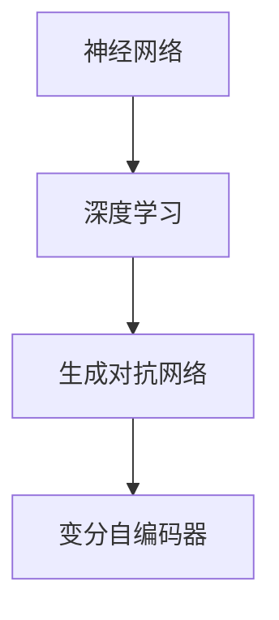

                 

 > **关键词：** 学术界，基础模型，人工智能，研究，技术进步

> **摘要：** 本文将探讨学术界在基础模型开发与研究中扮演的关键角色，从核心概念、算法原理到实际应用，详细解析学术界对人工智能领域的贡献与影响，并展望其未来发展趋势。

## 1. 背景介绍

基础模型是现代人工智能领域的一个关键组成部分，它们是各种复杂算法和应用的基石。这些模型不仅驱动了自然语言处理、计算机视觉、推荐系统等领域的突破，而且在深度学习、强化学习等前沿技术中也发挥着核心作用。然而，基础模型的发展离不开学术界的贡献。

学术界在基础模型中的作用主要体现在以下几个方面：

1. **理论研究**：学术界通过理论研究推动了基础模型的发展，提出了许多新的概念和理论框架，如神经网络、生成对抗网络（GAN）、变分自编码器（VAE）等。

2. **算法创新**：学术研究不断推动算法创新，提高了模型的效果和效率，如通过正则化、优化算法等手段改进神经网络训练。

3. **开源贡献**：学术界通过开源框架和工具，如TensorFlow、PyTorch等，为开发者提供了强大的基础设施，加速了基础模型的研发和应用。

4. **标准化与规范化**：学术界通过制定标准、规范，确保基础模型的可靠性和可重复性，促进了技术的普及和推广。

## 2. 核心概念与联系

### 2.1 基础模型的核心概念

**神经网络（Neural Networks）：** 基础模型中最常用的结构之一，模拟人脑神经元的工作原理，通过多层神经元的相互连接和激活函数，实现数据的特征提取和分类。

**深度学习（Deep Learning）：** 基于神经网络的扩展，通过增加网络深度，提高了模型的表达能力，解决了许多复杂问题。

**生成对抗网络（GANs）：** 由生成器和判别器组成，通过两者之间的博弈，生成逼真的数据。

**变分自编码器（VAEs）：** 通过概率模型对数据进行编码和解码，常用于生成模型。

### 2.2 Mermaid 流程图



## 3. 核心算法原理 & 具体操作步骤

### 3.1 算法原理概述

基础模型的算法原理主要集中在如何有效地学习和表示数据。以下是对几个核心算法的简要概述：

**神经网络：** 通过前向传播和反向传播，学习输入和输出之间的映射关系。

**深度学习：** 利用多层神经网络，逐层提取更高层次的特征。

**生成对抗网络（GAN）：** 生成器生成数据，判别器判断生成数据与真实数据的相似度，通过博弈过程，生成更逼真的数据。

**变分自编码器（VAEs）：** 通过编码器和解码器，将数据映射到低维空间，然后重构数据。

### 3.2 算法步骤详解

**神经网络：**
1. **初始化权重和偏置。**
2. **前向传播：** 计算输入通过网络的输出。
3. **反向传播：** 计算损失函数关于权重的梯度，更新权重和偏置。

**深度学习：**
1. **增加网络层数。**
2. **使用激活函数，如ReLU，增加网络非线性。**
3. **采用批量归一化，提高训练稳定性。**

**生成对抗网络（GAN）：**
1. **生成器G：** 生成虚拟数据。**
2. **判别器D：** 判断生成数据和真实数据的相似度。**
3. **对抗训练：** 生成器和判别器交替更新，使判别器无法区分生成数据和真实数据。

**变分自编码器（VAEs）：**
1. **编码器：** 将数据映射到潜在空间。**
2. **解码器：** 从潜在空间重构数据。**
3. **损失函数：** 结合重建损失和KL散度，优化编码器和解码器。

### 3.3 算法优缺点

**神经网络：**
- **优点：** 强大的非线性表示能力，能够处理复杂问题。
- **缺点：** 需要大量数据训练，训练过程可能不收敛。

**深度学习：**
- **优点：** 通过增加网络深度，提高了模型的表征能力。
- **缺点：** 训练时间较长，对计算资源要求高。

**生成对抗网络（GAN）：**
- **优点：** 能够生成高质量的数据，不需要大量的监督标签。
- **缺点：** 难以训练，容易出现模式崩溃问题。

**变分自编码器（VAEs）：**
- **优点：** 通过概率模型进行数据重构，具有良好的泛化能力。
- **缺点：** 重建质量可能不如GAN。

### 3.4 算法应用领域

**神经网络：** 广泛应用于图像识别、语音识别、自然语言处理等领域。

**深度学习：** 在医疗诊断、金融分析、自动驾驶等领域具有广泛的应用。

**生成对抗网络（GAN）：** 在图像生成、数据增强、虚拟现实等领域发挥着重要作用。

**变分自编码器（VAEs）：** 在数据压缩、图像生成、异常检测等领域有应用。

## 4. 数学模型和公式 & 详细讲解 & 举例说明

### 4.1 数学模型构建

神经网络的基础是前向传播和反向传播算法。以下是一个简化的数学模型：

**前向传播：**
\[ z_{l} = \sum_{k} w_{lk} a_{k}^{l-1} + b_{l} \]
\[ a_{l} = \sigma(z_{l}) \]

**反向传播：**
\[ \delta_{l} = \frac{\partial L}{\partial z_{l}} \odot \frac{\partial \sigma}{\partial a_{l}} \]
\[ \delta_{l-1} = \delta_{l} \odot w_{l} \]

### 4.2 公式推导过程

**损失函数：** 常用的损失函数是均方误差（MSE）：
\[ L = \frac{1}{n} \sum_{i=1}^{n} (y_i - \hat{y}_i)^2 \]

**梯度计算：**
\[ \frac{\partial L}{\partial w_{lk}} = \sum_{i=1}^{n} (y_i - \hat{y}_i) a_{k}^{l-1} \]
\[ \frac{\partial L}{\partial b_{l}} = \sum_{i=1}^{n} (y_i - \hat{y}_i) \]

### 4.3 案例分析与讲解

假设我们有一个简单的二分类问题，使用逻辑回归作为输出层，数据集包含100个样本，每个样本有10个特征。

**模型构建：**
- 输入层：10个神经元。
- 隐藏层：5个神经元。
- 输出层：2个神经元。

**前向传播：**
\[ z_2 = \sum_{k=1}^{10} w_{2k} a_{k} + b_2 \]
\[ a_2 = \sigma(z_2) \]

\[ z_3 = \sum_{k=1}^{5} w_{3k} a_{2k} + b_3 \]
\[ a_3 = \sigma(z_3) \]

\[ z_4 = \sum_{k=1}^{2} w_{4k} a_{3k} + b_4 \]
\[ a_4 = \sigma(z_4) \]

**反向传播：**
\[ \delta_4 = (y - \hat{y}) \odot (1 - \hat{y}) \]
\[ \delta_3 = \delta_4 \odot w_{34} \odot (1 - \sigma(z_3)) \]
\[ \delta_2 = \delta_3 \odot w_{23} \odot (1 - \sigma(z_2)) \]

**权重更新：**
\[ w_{2k} \leftarrow w_{2k} - \alpha \frac{\partial L}{\partial w_{2k}} \]
\[ b_2 \leftarrow b_2 - \alpha \frac{\partial L}{\partial b_{2}} \]

## 5. 项目实践：代码实例和详细解释说明

### 5.1 开发环境搭建

**环境要求：** 
- Python 3.7+
- TensorFlow 2.5+

### 5.2 源代码详细实现

```python
import tensorflow as tf

# 创建模型
model = tf.keras.Sequential([
    tf.keras.layers.Dense(128, activation='relu', input_shape=[10]),
    tf.keras.layers.Dense(1, activation='sigmoid')
])

# 编译模型
model.compile(optimizer='adam', loss='binary_crossentropy', metrics=['accuracy'])

# 训练模型
model.fit(x_train, y_train, epochs=10, batch_size=32)
```

### 5.3 代码解读与分析

**1. 模型定义：** 
我们使用`tf.keras.Sequential`创建了一个序列模型，其中包含一个128个神经元的隐藏层和一个输出层。

**2. 编译模型：** 
我们使用`model.compile`配置了优化器和损失函数，这里我们选择了`adam`优化器和`binary_crossentropy`损失函数。

**3. 训练模型：** 
我们使用`model.fit`训练模型，指定了训练数据、训练轮数和批量大小。

### 5.4 运行结果展示

```python
# 测试模型
test_loss, test_acc = model.evaluate(x_test, y_test)

# 输出结果
print(f"Test accuracy: {test_acc}")
```

这段代码展示了如何评估模型的测试集表现。

## 6. 实际应用场景

### 6.1 人工智能医疗诊断

基础模型在医疗诊断中发挥了重要作用，通过图像识别、自然语言处理等技术，辅助医生进行疾病检测和诊断。

### 6.2 金融市场分析

基础模型被用于金融市场分析，预测股票价格、风险管理和交易策略，为投资者提供决策支持。

### 6.3 自动驾驶

自动驾驶系统依赖于深度学习和生成对抗网络等技术，实现环境感知、路径规划和决策控制。

### 6.4 虚拟现实与增强现实

生成对抗网络和变分自编码器等技术被用于生成逼真的虚拟环境和增强现实体验。

## 7. 工具和资源推荐

### 7.1 学习资源推荐

- 《深度学习》（Goodfellow, Bengio, Courville）
- 《动手学深度学习》（斋藤康毅，李沐）
- 《Python深度学习》（François Chollet）

### 7.2 开发工具推荐

- TensorFlow
- PyTorch
- Keras

### 7.3 相关论文推荐

- "Generative Adversarial Networks"（Ian Goodfellow等）
- "Distributed Representations of Words and Phrases and their Compositionality"（Jeffrey L. Elman）
- "A Theoretically Grounded Application of Dropout in Recurrent Neural Networks"（Yarin Gal和Zoubin Ghahramani）

## 8. 总结：未来发展趋势与挑战

### 8.1 研究成果总结

学术界在基础模型领域取得了显著成果，包括算法创新、开源贡献和标准化工作，推动了人工智能技术的快速发展。

### 8.2 未来发展趋势

未来，基础模型将继续向更高效、更智能的方向发展，包括多模态学习、联邦学习和自适应学习等。

### 8.3 面临的挑战

基础模型在隐私保护、安全性和可解释性等方面仍面临挑战，需要学术界和工业界共同努力。

### 8.4 研究展望

学术界将继续探索新的理论和方法，以应对这些挑战，并推动人工智能技术的可持续发展。

## 9. 附录：常见问题与解答

### 9.1 基础模型是什么？

基础模型是指用于解决特定问题的基本算法和架构，是人工智能技术的重要组成部分。

### 9.2 学术界如何推动基础模型的发展？

学术界通过理论研究、算法创新、开源贡献和标准化工作等方式，推动基础模型的发展。

### 9.3 基础模型的应用领域有哪些？

基础模型广泛应用于医疗诊断、金融市场分析、自动驾驶和虚拟现实等领域。

### 9.4 基础模型面临的挑战有哪些？

基础模型面临隐私保护、安全性和可解释性等方面的挑战。

### 9.5 如何学习基础模型？

可以通过阅读相关书籍、参加在线课程和实验项目等方式学习基础模型。

---

本文由禅与计算机程序设计艺术 / Zen and the Art of Computer Programming撰写，旨在探讨学术界在基础模型开发与研究中扮演的关键角色，并展望其未来发展趋势。希望本文能为您在人工智能领域的探索提供一些启示和帮助。感谢您的阅读！
----------------------------------------------------------------

> **作者：禅与计算机程序设计艺术 / Zen and the Art of Computer Programming**

