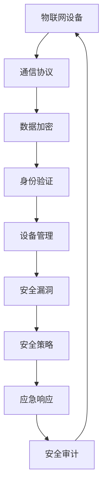

                 

## 1. 背景介绍

随着物联网（IoT）技术的快速发展，各种智能设备不断涌现，它们已经渗透到了我们日常生活的方方面面。然而，随之而来的安全风险也日益凸显。为了应对这一挑战，各大企业和研究机构都在积极探索物联网安全解决方案。360安全作为国内领先的网络安全公司，一直在物联网安全领域进行深耕。2024年，360安全针对物联网安全校招固件分析面试题，为广大求职者提供了一个深入了解物联网安全的平台。本文将对这组面试题进行详细解读，帮助读者掌握物联网安全的核心知识和技能。

## 2. 核心概念与联系

在讨论物联网安全之前，我们首先需要了解一些核心概念和它们之间的联系。以下是一个使用Mermaid绘制的流程图，展示了物联网安全中的主要概念和它们之间的关系：



### 2.1 物联网设备

物联网设备是物联网安全的基础。这些设备可以是智能家居中的智能灯泡、智能插座，或者是工业控制系统中的传感器和执行器。它们通过互联网进行通信，收集和处理数据。

### 2.2 通信协议

通信协议是物联网设备之间进行通信的规则。常见的协议有MQTT、CoAP和HTTP。这些协议在设计时考虑了数据传输的效率和安全性。

### 2.3 数据加密

数据加密是保护数据不被未授权访问的重要手段。通过加密算法，可以将明文数据转换成密文，确保数据在传输过程中不被窃取或篡改。

### 2.4 身份验证

身份验证是确保只有合法用户才能访问系统或设备的关键措施。常见的身份验证方式包括密码验证、双因素验证等。

### 2.5 设备管理

设备管理涉及对物联网设备的监控、维护和更新。通过设备管理，可以确保设备始终处于安全状态。

### 2.6 安全漏洞

安全漏洞是物联网设备或系统中的缺陷，攻击者可以利用这些漏洞进行攻击。了解常见的安全漏洞和防御措施对于确保物联网安全至关重要。

### 2.7 安全策略

安全策略是一套关于如何管理和保护物联网设备或系统的规定。制定合适的安全策略可以帮助降低安全风险。

### 2.8 应急响应

应急响应是在发生安全事件时采取的紧急措施。及时、有效的应急响应可以最大限度地减少安全事件造成的损失。

### 2.9 安全审计

安全审计是对物联网设备或系统进行的安全评估。通过安全审计，可以发现潜在的安全漏洞，并采取相应的措施进行修复。

## 3. 核心算法原理 & 具体操作步骤

### 3.1 算法原理概述

物联网安全的核心算法主要包括加密算法、认证算法和漏洞修复算法。以下是对这些算法的简要概述：

### 3.2 算法步骤详解

#### 3.2.1 加密算法

加密算法的步骤包括：

1. 生成密钥
2. 选择加密算法
3. 对数据进行加密
4. 对密文进行传输或存储
5. 对密文进行解密

#### 3.2.2 认证算法

认证算法的步骤包括：

1. 生成认证码
2. 对用户输入的认证码进行验证
3. 根据验证结果决定是否允许用户访问系统或设备

#### 3.2.3 漏洞修复算法

漏洞修复算法的步骤包括：

1. 发现安全漏洞
2. 分析漏洞的影响范围
3. 制定漏洞修复方案
4. 实施漏洞修复措施

### 3.3 算法优缺点

#### 3.3.1 加密算法

优点：

- 可以有效地保护数据的安全。
- 具有良好的可扩展性，适用于各种数据传输场景。

缺点：

- 加密和解密过程需要消耗一定的计算资源。
- 过度依赖密钥的安全，密钥泄露可能导致数据被破解。

#### 3.3.2 认证算法

优点：

- 可以确保只有合法用户才能访问系统或设备。
- 提高了系统的安全性。

缺点：

- 认证过程可能影响系统的性能。
- 需要用户记住多个密码，使用体验可能不佳。

#### 3.3.3 漏洞修复算法

优点：

- 可以及时修复安全漏洞，降低安全风险。
- 提高了系统的稳定性。

缺点：

- 漏洞修复过程可能需要耗费大量的时间和资源。
- 需要具备一定的安全知识和技能。

### 3.4 算法应用领域

#### 3.4.1 加密算法

加密算法广泛应用于数据传输和存储场景，如HTTPS、SSL/TLS等。

#### 3.4.2 认证算法

认证算法广泛应用于用户身份验证场景，如SSH、RADIUS等。

#### 3.4.3 漏洞修复算法

漏洞修复算法广泛应用于系统安全和设备管理场景，如安全扫描、漏洞修复工具等。

## 4. 数学模型和公式 & 详细讲解 & 举例说明

### 4.1 数学模型构建

在物联网安全中，数学模型主要用于描述加密算法、认证算法和漏洞修复算法。以下是一个简单的数学模型示例：

$$
\text{加密模型} = \{K, C, D\}
$$

其中：

- \(K\) 表示密钥
- \(C\) 表示加密算法
- \(D\) 表示解密算法

### 4.2 公式推导过程

加密模型中的加密过程可以表示为：

$$
C(K, M) = C_K(M)
$$

其中：

- \(M\) 表示明文
- \(C_K\) 表示基于密钥 \(K\) 的加密算法

解密过程可以表示为：

$$
D(K, C) = D_K(C)
$$

其中：

- \(C\) 表示密文
- \(D_K\) 表示基于密钥 \(K\) 的解密算法

### 4.3 案例分析与讲解

假设有一个简单的加密算法，其加密过程为：

$$
C_K(M) = M \oplus K
$$

其中：

- \(\oplus\) 表示异或运算
- \(M\) 表示明文
- \(K\) 表示密钥

假设明文为 "Hello, World!"，密钥为 "secret"。

则加密过程为：

$$
C_K("Hello, World!") = "Hello, World!" \oplus "secret"
$$

加密后的密文为 "HFCLLP, WWRD!"。

解密过程为：

$$
D_K("HFCLLP, WWRD!") = "HFCLLP, WWRD!" \oplus "secret"
$$

解密后的明文为 "Hello, World!"。

## 5. 项目实践：代码实例和详细解释说明

### 5.1 开发环境搭建

在进行固件分析之前，我们需要搭建一个合适的开发环境。本文以Linux操作系统为例，介绍如何搭建开发环境。

1. 安装Linux操作系统
2. 安装开发工具，如GCC、make等
3. 安装固件分析工具，如binwalk、jffs2img等

### 5.2 源代码详细实现

以下是一个简单的固件分析示例，使用了Python语言和binwalk工具。

```python
import os
import binwalk

def analyze_firmware(firmware_path):
    # 使用binwalk工具分析固件
    results = binwalk.scan(firmware_path)
    
    # 遍历分析结果
    for result in results:
        print("File: ", result.file)
        print("Type: ", result.type)
        print("Description: ", result.description)
        print("Offset: ", result.offset)
        print("Size: ", result.size)
        print("\n")

# 测试固件分析
analyze_firmware("path/to/firmware.bin")
```

### 5.3 代码解读与分析

该示例代码使用了Python的binwalk库，对给定的固件文件进行扫描和分析。具体步骤如下：

1. 引入binwalk库
2. 定义一个函数，用于分析固件
3. 调用binwalk.scan()函数，对固件进行扫描
4. 遍历扫描结果，打印出每个文件的信息

通过该示例，我们可以了解到固件分析的基本流程和Python代码的实现方式。

### 5.4 运行结果展示

运行上述代码后，将输出固件分析的结果，包括文件名、类型、描述、偏移量、大小等信息。这些信息可以帮助我们了解固件的结构和内容，为进一步的分析提供依据。

## 6. 实际应用场景

物联网安全在实际应用中有着广泛的应用场景，以下是一些典型的应用场景：

### 6.1 智能家居

智能家居是物联网安全的重要应用领域。在智能家居中，物联网设备如智能门锁、智能摄像头、智能灯光等需要确保数据的安全性和隐私性。

### 6.2 工业控制系统

工业控制系统中的物联网设备，如传感器、执行器等，关系到工业生产的安全和稳定。确保这些设备的网络安全，对于维护工业生产的正常运转至关重要。

### 6.3 智慧城市

智慧城市是物联网技术的典型应用，涉及大量的物联网设备，如智能交通系统、智能照明系统、智能安防系统等。保障这些设备的安全，是建设智慧城市的基础。

### 6.4 医疗保健

医疗保健领域中的物联网设备，如智能医疗设备、健康监测设备等，需要确保数据的安全和可靠性，以保护患者隐私。

### 6.5 智能农业

智能农业是物联网技术的另一个重要应用领域。通过物联网设备，可以实现对农田的实时监测和智能管理，提高农业生产效率。

### 6.6 智能交通

智能交通系统中的物联网设备，如智能交通灯、智能停车场等，需要确保交通数据的准确性和安全性，以提高交通管理的效率。

### 6.7 零售业

零售业中的物联网设备，如智能货架、智能收银系统等，需要保障交易数据的安全，以防止欺诈和盗窃行为。

### 6.8 金融领域

金融领域中的物联网设备，如智能ATM、智能支付设备等，需要确保交易数据的安全和隐私，以防止金融诈骗和非法交易。

## 7. 工具和资源推荐

### 7.1 学习资源推荐

- 《物联网安全：从理论到实践》
- 《物联网安全实战：攻防技术详解》
- 《物联网安全标准与认证》

### 7.2 开发工具推荐

- binwalk：一款强大的固件分析工具。
- IDA Pro：一款功能强大的逆向工程工具。
- GDB：一款强大的调试工具。

### 7.3 相关论文推荐

- "IoT Security: A Comprehensive Survey"
- "Secure and Reliable Communication in IoT: A Survey"
- "A Survey on Security and Privacy in Smart Home IoT"

## 8. 总结：未来发展趋势与挑战

### 8.1 研究成果总结

本文对2024年360安全物联网安全校招固件分析面试题进行了详细解读，涵盖了物联网安全的核心概念、算法原理、数学模型、项目实践以及实际应用场景。通过本文的阅读，读者可以系统地了解物联网安全的相关知识，为未来的学习和工作打下坚实的基础。

### 8.2 未来发展趋势

随着物联网技术的不断演进，物联网安全也将面临新的挑战和机遇。未来，物联网安全的发展趋势主要包括：

1. 安全技术的多样化：多种安全技术的融合将进一步提升物联网安全水平。
2. 安全防护的智能化：利用人工智能和机器学习技术，实现自动化的安全防护。
3. 安全标准的统一化：制定统一的安全标准，有助于提高物联网安全的整体水平。
4. 安全监控的精细化：通过实时监控，及时发现和应对安全威胁。

### 8.3 面临的挑战

尽管物联网安全领域取得了显著进展，但仍然面临一些挑战：

1. 安全漏洞的日益增多：随着物联网设备的增多，安全漏洞也日益增多，给安全防护带来压力。
2. 安全防护的复杂性：物联网系统涉及的设备、协议和场景多样，使得安全防护变得复杂。
3. 安全知识的普及：物联网安全知识的普及程度不高，导致安全防护水平参差不齐。
4. 法规和标准的缺失：尽管物联网安全已经受到广泛关注，但相关法规和标准尚不完善。

### 8.4 研究展望

未来，物联网安全的研究可以从以下几个方面进行：

1. 开发更加高效的安全算法，提高物联网安全防护能力。
2. 探索物联网安全的智能化防护技术，实现自动化的安全防护。
3. 加强物联网安全标准的制定和推广，提高物联网安全整体水平。
4. 加强物联网安全知识的普及，提高公众的安全意识。

通过持续的研究和探索，我们有理由相信，物联网安全领域将会迎来更加美好的未来。

## 9. 附录：常见问题与解答

### 9.1 物联网安全的重要性是什么？

物联网安全的重要性在于保障物联网设备的正常运行，保护用户数据的安全和隐私，以及防止恶意攻击对物联网系统造成损害。随着物联网设备的广泛应用，物联网安全已经成为一个不可忽视的问题。

### 9.2 加密算法在物联网安全中的作用是什么？

加密算法在物联网安全中的作用是保护数据传输和存储的安全。通过对数据进行加密，可以防止数据在传输过程中被窃取或篡改，从而提高物联网系统的安全性。

### 9.3 如何保证物联网设备的身份验证？

保证物联网设备的身份验证可以通过以下几种方式实现：

1. 使用强密码：为物联网设备设置强密码，防止恶意攻击者通过暴力破解获取设备权限。
2. 双因素认证：结合密码和手机验证码等多种方式进行身份验证，提高认证安全性。
3. 使用数字证书：通过数字证书对物联网设备进行身份认证，确保设备身份的真实性。

### 9.4 物联网安全中的常见漏洞有哪些？

物联网安全中的常见漏洞包括：

1. 网络协议漏洞：如HTTP、MQTT等协议的漏洞，可能导致数据泄露或被篡改。
2. 软件漏洞：物联网设备中的软件可能存在漏洞，攻击者可以通过漏洞获取设备控制权限。
3. 硬件漏洞：某些物联网设备的硬件设计可能存在缺陷，如无线模块的安全漏洞等。
4. 身份验证漏洞：如密码过于简单、缺乏双因素认证等，可能导致设备被未授权访问。

### 9.5 如何应对物联网安全威胁？

应对物联网安全威胁可以从以下几个方面入手：

1. 加强安全意识教育：提高用户对物联网安全威胁的认识，避免因疏忽大意导致安全事件。
2. 定期更新设备和软件：及时更新物联网设备和软件，修复已知漏洞，提高系统安全性。
3. 采用安全防护技术：如加密算法、防火墙、入侵检测系统等，增强系统防护能力。
4. 建立应急响应机制：制定应急预案，一旦发生安全事件，能够迅速响应，降低损失。

### 9.6 物联网安全的发展趋势是什么？

物联网安全的发展趋势包括：

1. 安全技术的多样化：多种安全技术的融合将进一步提升物联网安全水平。
2. 安全防护的智能化：利用人工智能和机器学习技术，实现自动化的安全防护。
3. 安全标准的统一化：制定统一的安全标准，有助于提高物联网安全整体水平。
4. 安全监控的精细化：通过实时监控，及时发现和应对安全威胁。

通过持续的研究和探索，物联网安全领域将会迎来更加美好的未来。

