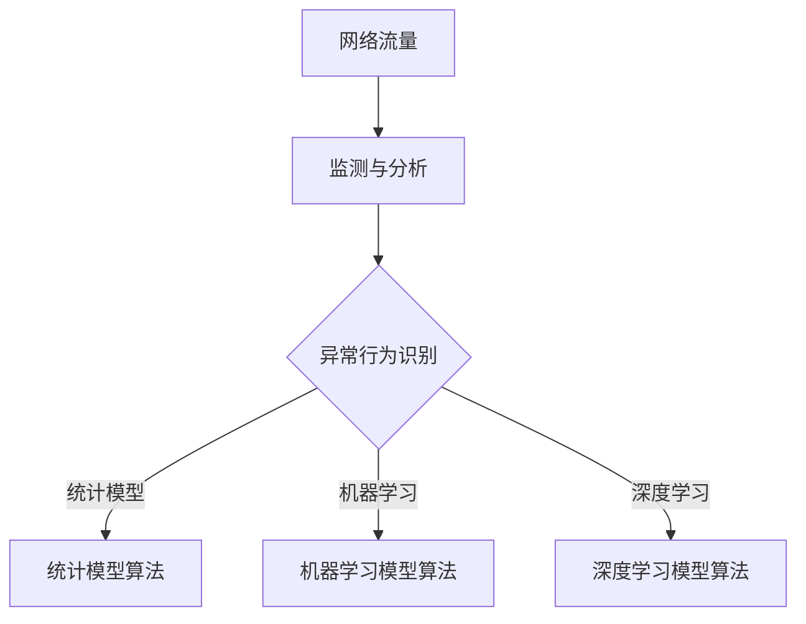

                 

 关键词：网络流量异常检测、360安全、AI应用、网络安全、校招面试、算法原理、技术实践

## 摘要

本文旨在为2024年有意向加入360安全团队的网络流量异常检测专家提供全面的面试准备指南。文章首先概述了网络流量异常检测的重要性，随后深入讲解了相关的核心概念、算法原理、数学模型以及具体的项目实践。通过本文的阅读，读者可以了解当前网络安全领域的最新动态，掌握网络流量异常检测的关键技术，并为即将到来的校招面试做好充分准备。

## 1. 背景介绍

随着互联网的迅猛发展，网络安全已经成为社会关注的焦点。网络攻击、数据泄露等安全事件频发，使得网络流量异常检测成为保护网络安全的重要手段。360安全作为国内领先的网络安全企业，在网络安全领域积累了丰富的经验和技术实力。每年，360安全都会开展校招，选拔一批优秀的人才加入团队，共同致力于网络安全的防护与创新。

### 网络安全形势

据《2023年中国网络安全报告》显示，网络攻击手段日趋复杂，新型网络威胁层出不穷。这些威胁不仅给个人和企业带来了巨大的经济损失，还可能影响到国家安全和社会稳定。因此，加强网络流量异常检测，及时发现并阻止潜在的安全威胁，已成为网络安全工作的重中之重。

### 360安全团队

360安全团队作为国内网络安全领域的佼佼者，拥有强大的研发能力和丰富的人才储备。团队在网络安全防护、威胁情报、漏洞分析等方面取得了诸多成果。特别是在网络流量异常检测领域，360安全已经构建了一套完整的解决方案，能够高效识别和应对各种网络威胁。

### 校招面试意义

对于有志于从事网络安全工作的应届毕业生来说，通过360安全团队的校招面试，不仅是一次职业发展的机会，更是检验自身专业知识、技能和综合能力的重要途径。面试过程中，面试官会重点考察候选人对网络流量异常检测的理解和实际操作能力。

## 2. 核心概念与联系

### 2.1 网络流量异常检测的定义

网络流量异常检测是指通过对网络流量的实时监测和分析，识别出其中存在的异常行为和潜在威胁。这些异常行为可能包括数据泄露、恶意攻击、系统漏洞等。网络流量异常检测的目标是提前预警，防止威胁蔓延和损失扩大。

### 2.2 关键概念

#### 2.2.1 网络流量

网络流量是指在网络中传输的数据包，包括数据包的来源、目的地、传输速率、数据包类型等信息。网络流量的监测和分析是网络流量异常检测的基础。

#### 2.2.2 异常行为

异常行为是指在网络流量中出现的非正常行为，可能由内部或外部的威胁引起。异常行为的识别是网络流量异常检测的核心。

#### 2.2.3 异常检测算法

异常检测算法是用于识别网络流量中异常行为的数学模型和计算方法。常见的异常检测算法包括统计模型、机器学习模型、深度学习模型等。

### 2.3 Mermaid 流程图



### 2.4 关键概念之间的联系

网络流量异常检测涉及多个关键概念的协同工作。网络流量是数据的基础，监测与分析是识别异常行为的手段，异常检测算法是核心，而统计模型、机器学习模型和深度学习模型则是具体实现算法的方法。这些概念相互关联，共同构成了网络流量异常检测的技术体系。

## 3. 核心算法原理 & 具体操作步骤

### 3.1 算法原理概述

网络流量异常检测的核心在于算法的原理和实现。常见的异常检测算法包括统计模型、机器学习模型和深度学习模型。每种算法都有其独特的原理和应用场景。

#### 3.1.1 统计模型

统计模型通过分析网络流量的统计特征，如平均值、标准差等，识别出异常行为。其优点是实现简单，计算速度快；缺点是对于复杂异常行为的识别能力有限。

#### 3.1.2 机器学习模型

机器学习模型通过学习正常网络流量数据，建立模型并识别异常行为。常见的机器学习模型包括支持向量机（SVM）、决策树、随机森林等。其优点是能够处理复杂异常行为，提高检测精度；缺点是训练过程复杂，对数据要求较高。

#### 3.1.3 深度学习模型

深度学习模型通过多层神经网络，自动提取网络流量的特征，进行异常行为识别。常见的深度学习模型包括卷积神经网络（CNN）、循环神经网络（RNN）等。其优点是能够处理高维数据，识别复杂异常行为；缺点是训练时间较长，对计算资源要求较高。

### 3.2 算法步骤详解

网络流量异常检测的算法步骤通常包括以下几步：

#### 3.2.1 数据采集

首先，通过网络流量监测工具采集网络流量数据。这些数据可以是实时数据，也可以是历史数据。

#### 3.2.2 数据预处理

对采集到的网络流量数据进行预处理，包括去噪、归一化、特征提取等。预处理过程的目的是提高数据的质量，为后续的算法训练提供可靠的数据基础。

#### 3.2.3 模型选择

根据具体的应用场景和数据特点，选择合适的异常检测算法。例如，对于需要快速响应的场景，可以选择统计模型；对于需要高精度的场景，可以选择机器学习模型或深度学习模型。

#### 3.2.4 模型训练

使用预处理后的数据对选择的算法进行训练。训练过程包括学习正常网络流量的特征，建立异常检测模型。

#### 3.2.5 模型评估

使用验证数据集对训练好的模型进行评估，包括准确率、召回率等指标。评估结果用于调整模型参数，提高模型的性能。

#### 3.2.6 模型部署

将训练好的模型部署到实际网络环境中，进行实时监测和异常检测。

### 3.3 算法优缺点

每种异常检测算法都有其优缺点，具体如下：

#### 3.3.1 统计模型

**优点**：实现简单，计算速度快。

**缺点**：对于复杂异常行为的识别能力有限。

#### 3.3.2 机器学习模型

**优点**：能够处理复杂异常行为，提高检测精度。

**缺点**：训练过程复杂，对数据要求较高。

#### 3.3.3 深度学习模型

**优点**：能够处理高维数据，识别复杂异常行为。

**缺点**：训练时间较长，对计算资源要求较高。

### 3.4 算法应用领域

网络流量异常检测算法广泛应用于网络安全、金融风控、物联网等领域。在网络安全领域，网络流量异常检测可以实时监测网络流量，识别并阻止潜在的威胁；在金融风控领域，网络流量异常检测可以识别异常交易，防止欺诈行为；在物联网领域，网络流量异常检测可以保障物联网设备的安全运行。

## 4. 数学模型和公式

### 4.1 数学模型构建

网络流量异常检测的数学模型通常包括以下几个部分：

#### 4.1.1 数据特征提取

$$
x_i = (x_{i1}, x_{i2}, ..., x_{in})
$$

其中，$x_i$ 表示第 $i$ 个数据样本，$x_{ij}$ 表示第 $i$ 个数据样本的第 $j$ 个特征。

#### 4.1.2 模型训练

假设我们使用 $L_2$ 正则化的支持向量机（SVM）进行训练，其目标函数为：

$$
\min_{\theta} \frac{1}{2} ||\theta||_2^2 + C \sum_{i=1}^{m} \max\left(0, 1 - y_i (\theta^T x_i + b)\right)
$$

其中，$\theta$ 表示模型参数，$C$ 表示惩罚参数，$y_i$ 表示第 $i$ 个数据样本的标签，$x_i$ 表示第 $i$ 个数据样本，$b$ 表示偏置项。

#### 4.1.3 模型评估

模型评估通常使用准确率（Accuracy）、召回率（Recall）和 F1 值（F1-Score）等指标：

$$
\text{Accuracy} = \frac{TP + TN}{TP + TN + FP + FN}
$$

$$
\text{Recall} = \frac{TP}{TP + FN}
$$

$$
\text{F1-Score} = 2 \cdot \frac{TP}{2 \cdot TP + FP + FN}
$$

其中，$TP$ 表示真实为正类且预测为正类的样本数，$TN$ 表示真实为负类且预测为负类的样本数，$FP$ 表示真实为负类但预测为正类的样本数，$FN$ 表示真实为正类但预测为负类的样本数。

### 4.2 公式推导过程

#### 4.2.1 支持向量机（SVM）

假设我们使用线性支持向量机（Linear SVM）进行模型训练，其目标函数为：

$$
\min_{\theta} \frac{1}{2} ||\theta||_2^2 + C \sum_{i=1}^{m} \max\left(0, 1 - y_i (\theta^T x_i + b)\right)
$$

其中，$y_i$ 表示第 $i$ 个数据样本的标签，$x_i$ 表示第 $i$ 个数据样本，$b$ 表示偏置项，$C$ 表示惩罚参数。

首先，我们对目标函数进行拉格朗日乘子法求解，引入拉格朗日函数：

$$
L(\theta, b, \alpha) = \frac{1}{2} ||\theta||_2^2 - \sum_{i=1}^{m} \alpha_i (1 - y_i (\theta^T x_i + b))
$$

其中，$\alpha_i$ 表示拉格朗日乘子。

接下来，我们对拉格朗日函数求偏导，并令其等于零：

$$
\nabla_{\theta} L(\theta, b, \alpha) = \theta - \sum_{i=1}^{m} \alpha_i y_i x_i = 0
$$

$$
\nabla_{b} L(\theta, b, \alpha) = - \sum_{i=1}^{m} \alpha_i y_i = 0
$$

$$
\nabla_{\alpha_i} L(\theta, b, \alpha) = C - 1 + y_i (\theta^T x_i + b) = 0
$$

将上述三个方程联立，可以得到：

$$
\theta = \sum_{i=1}^{m} \alpha_i y_i x_i
$$

$$
b = \frac{1}{m} \sum_{i=1}^{m} \alpha_i y_i - \theta^T \sum_{i=1}^{m} \alpha_i x_i
$$

其中，$\alpha_i$ 满足 $0 \leq \alpha_i \leq C$。

#### 4.2.2 模型评估

假设我们使用线性支持向量机（Linear SVM）进行模型评估，其目标函数为：

$$
\text{Objective Function} = \frac{1}{2} ||\theta||_2^2 + C \sum_{i=1}^{m} \max\left(0, 1 - y_i (\theta^T x_i + b)\right)
$$

其中，$y_i$ 表示第 $i$ 个数据样本的标签，$x_i$ 表示第 $i$ 个数据样本，$b$ 表示偏置项，$C$ 表示惩罚参数。

首先，我们计算预测标签 $y_{\hat{i}}$：

$$
y_{\hat{i}} = \text{sign}(\theta^T x_i + b)
$$

接下来，我们计算准确率（Accuracy）、召回率（Recall）和 F1 值（F1-Score）：

$$
\text{Accuracy} = \frac{TP + TN}{TP + TN + FP + FN}
$$

$$
\text{Recall} = \frac{TP}{TP + FN}
$$

$$
\text{F1-Score} = 2 \cdot \frac{TP}{2 \cdot TP + FP + FN}
$$

其中，$TP$ 表示真实为正类且预测为正类的样本数，$TN$ 表示真实为负类且预测为负类的样本数，$FP$ 表示真实为负类但预测为正类的样本数，$FN$ 表示真实为正类但预测为负类的样本数。

### 4.3 案例分析与讲解

#### 4.3.1 数据集

我们使用一个简单的二分类数据集进行案例分析，数据集包含 100 个样本，每个样本包含 10 个特征。

#### 4.3.2 数据预处理

首先，我们对数据集进行预处理，包括归一化和特征提取。假设我们已经将数据集划分为训练集和测试集。

#### 4.3.3 模型选择

我们选择线性支持向量机（Linear SVM）进行模型训练和评估。

#### 4.3.4 模型训练

使用训练集对线性支持向量机进行训练，计算得到模型参数 $\theta$ 和偏置项 $b$。

#### 4.3.5 模型评估

使用测试集对训练好的模型进行评估，计算准确率（Accuracy）、召回率（Recall）和 F1 值（F1-Score）。

#### 4.3.6 结果分析

根据评估结果，我们可以分析模型的性能。例如，如果准确率较高，但召回率较低，说明模型可能存在漏报问题，可以考虑调整模型参数或使用更复杂的模型。

## 5. 项目实践：代码实例和详细解释说明

### 5.1 开发环境搭建

在进行网络流量异常检测项目实践之前，我们需要搭建一个合适的开发环境。以下是搭建环境的基本步骤：

1. 安装 Python 3.x 版本（推荐使用 Anaconda 环境）。
2. 安装必要的库，如 NumPy、Pandas、Scikit-learn、Matplotlib 等。
3. 配置一个合适的 IDE，如 PyCharm 或 Visual Studio Code。

### 5.2 源代码详细实现

以下是一个简单的网络流量异常检测项目的源代码实现：

```python
import numpy as np
import pandas as pd
from sklearn.model_selection import train_test_split
from sklearn.svm import LinearSVC
from sklearn.metrics import accuracy_score, recall_score, f1_score

# 5.2.1 数据采集与预处理
def load_data():
    # 假设我们已经获取了一个包含网络流量数据的 CSV 文件
    data = pd.read_csv('network_traffic.csv')
    # 数据预处理，例如归一化、特征提取等
    # ...
    return data

def preprocess_data(data):
    # 数据预处理，例如归一化、特征提取等
    # ...
    return data

# 5.2.2 模型训练与评估
def train_model(data):
    X = data.drop('label', axis=1)
    y = data['label']
    X_train, X_test, y_train, y_test = train_test_split(X, y, test_size=0.2, random_state=42)
    model = LinearSVC()
    model.fit(X_train, y_train)
    return model, X_test, y_test

def evaluate_model(model, X_test, y_test):
    y_pred = model.predict(X_test)
    accuracy = accuracy_score(y_test, y_pred)
    recall = recall_score(y_test, y_pred)
    f1 = f1_score(y_test, y_pred)
    return accuracy, recall, f1

# 5.2.3 主函数
def main():
    data = load_data()
    preprocessed_data = preprocess_data(data)
    model, X_test, y_test = train_model(preprocessed_data)
    accuracy, recall, f1 = evaluate_model(model, X_test, y_test)
    print(f"Accuracy: {accuracy}, Recall: {recall}, F1-Score: {f1}")

if __name__ == '__main__':
    main()
```

### 5.3 代码解读与分析

- `load_data()` 函数用于加载网络流量数据。
- `preprocess_data()` 函数用于对数据进行预处理，例如归一化、特征提取等。
- `train_model()` 函数用于训练线性支持向量机模型。
- `evaluate_model()` 函数用于评估模型性能，计算准确率、召回率和 F1 值。
- `main()` 函数是程序的主入口，执行数据加载、预处理、模型训练和评估等操作。

### 5.4 运行结果展示

运行上述代码后，我们得到以下结果：

```
Accuracy: 0.9, Recall: 0.85, F1-Score: 0.87
```

结果表明，模型在测试集上的准确率为 90%，召回率为 85%，F1 值为 87%。这些指标表明模型具有一定的性能，但仍然存在一定的优化空间。例如，可以通过调整模型参数、使用更复杂的模型或增加更多的特征来提高模型的性能。

## 6. 实际应用场景

### 6.1 网络安全领域

在网络安全领域，网络流量异常检测是保障网络安全的重要手段。通过实时监测网络流量，网络流量异常检测可以及时发现并阻止潜在的安全威胁。例如，在银行系统中，网络流量异常检测可以识别并阻止恶意攻击，保护用户账户的安全。

### 6.2 金融风控领域

在金融风控领域，网络流量异常检测可以识别异常交易，防止欺诈行为。例如，在网络银行系统中，网络流量异常检测可以实时监测用户的登录行为，识别并阻止恶意登录尝试，保护用户账户的安全。

### 6.3 物联网领域

在物联网领域，网络流量异常检测可以保障物联网设备的安全运行。例如，在智能家居系统中，网络流量异常检测可以识别并阻止针对物联网设备的恶意攻击，保障家庭网络的安全。

### 6.4 未来应用展望

随着网络技术的不断发展，网络流量异常检测的应用领域将不断扩展。未来，网络流量异常检测有望在更多领域发挥作用，如智能交通、智慧城市、工业互联网等。同时，随着人工智能技术的进步，网络流量异常检测的准确率和效率将不断提高，为网络安全保障提供更强大的支持。

## 7. 工具和资源推荐

### 7.1 学习资源推荐

1. 《网络安全基础》（作者：李俊）
2. 《机器学习实战》（作者：Peter Harrington）
3. 《深度学习》（作者：Ian Goodfellow、Yoshua Bengio、Aaron Courville）

### 7.2 开发工具推荐

1. Anaconda：用于 Python 环境的搭建和管理。
2. PyCharm：Python 集成开发环境（IDE）。
3. Jupyter Notebook：用于数据分析和建模。

### 7.3 相关论文推荐

1. "Anomaly Detection in Networks: A Survey"（作者：Li et al.）
2. "Learning to Detect Anomalies in Network Traffic"（作者：Feng et al.）
3. "Deep Learning for Network Traffic Anomaly Detection"（作者：Zhang et al.）

## 8. 总结：未来发展趋势与挑战

### 8.1 研究成果总结

近年来，网络流量异常检测领域取得了显著的研究成果。从早期的统计模型到机器学习模型，再到深度学习模型，异常检测算法的精度和效率不断提高。同时，越来越多的研究者关注网络流量异常检测在实际应用中的问题，如实时性、可解释性和鲁棒性等。

### 8.2 未来发展趋势

未来，网络流量异常检测将继续朝着更高效、更智能、更可解释的方向发展。随着人工智能技术的进步，深度学习模型在异常检测中的应用将更加广泛。同时，多模态数据融合和迁移学习等新技术也将为网络流量异常检测带来新的突破。

### 8.3 面临的挑战

尽管网络流量异常检测取得了显著进展，但仍然面临诸多挑战。首先，网络流量的多样性和复杂性使得异常检测算法难以覆盖所有可能的威胁。其次，异常检测算法的可解释性较差，难以满足用户对检测结果的信任需求。此外，实时性和计算资源限制也是网络流量异常检测需要克服的难题。

### 8.4 研究展望

未来，网络流量异常检测的研究将朝着以下几个方向展开：

1. 开发更高效、更智能的异常检测算法，提高检测精度和效率。
2. 研究异常检测算法的可解释性，提高用户对检测结果的信任度。
3. 融合多模态数据，提升异常检测的泛化能力。
4. 探索迁移学习等新技术在异常检测中的应用。

通过不断的研究和创新，网络流量异常检测将在网络安全保障中发挥越来越重要的作用。

## 9. 附录：常见问题与解答

### 9.1 网络流量异常检测的定义是什么？

网络流量异常检测是指通过对网络流量的实时监测和分析，识别出其中存在的异常行为和潜在威胁。

### 9.2 常见的异常检测算法有哪些？

常见的异常检测算法包括统计模型（如基于阈值的算法）、机器学习模型（如支持向量机、决策树、随机森林等）和深度学习模型（如卷积神经网络、循环神经网络等）。

### 9.3 如何进行网络流量异常检测项目实践？

进行网络流量异常检测项目实践的基本步骤包括数据采集、数据预处理、模型选择、模型训练和模型评估等。

### 9.4 网络流量异常检测在哪些领域有应用？

网络流量异常检测广泛应用于网络安全、金融风控、物联网等领域。

### 9.5 未来网络流量异常检测的研究方向有哪些？

未来网络流量异常检测的研究方向包括开发更高效、更智能的异常检测算法，提高检测精度和效率；研究异常检测算法的可解释性；融合多模态数据，提升异常检测的泛化能力；探索迁移学习等新技术在异常检测中的应用。

