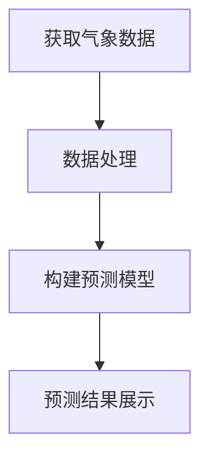

                 

关键词：天气预测插件、气象数据处理、API集成、实时气象信息、开源项目、Python编程

> 摘要：本文将探讨如何创建一个实用的天气预测插件，并详细介绍其实现过程。我们将从插件的基本概念出发，逐步深入到实现细节，包括数据获取、处理和预测模型的构建。通过本文的学习，读者将能够掌握构建此类插件所需的核心技能，并将其应用到实际项目中。

## 1. 背景介绍

随着互联网技术的发展，实时获取天气信息已经变得非常方便。无论是移动应用还是网页，用户都能轻松地查看所在地的天气情况。然而，对于开发者和企业来说，如何构建一个高效的天气预测插件却是一个具有挑战性的任务。本篇文章旨在提供一套完整的解决方案，帮助读者实现自己的天气预测插件。

### 1.1 插件的重要性

天气预测插件在现代应用程序中扮演着重要角色。它不仅可以为用户提供即时的天气信息，还能帮助应用开发者集成更多个性化服务，如旅行提醒、活动安排等。此外，对于企业来说，天气预测插件还能用于优化供应链管理、库存控制等业务流程。

### 1.2 目标读者

本文适合有一定编程基础的开发者，尤其是对Python编程语言和开源项目感兴趣的读者。通过本文的阅读和实践，读者将能够：

- 了解气象数据的基本概念和获取方法。
- 掌握使用API进行数据获取和处理的技术。
- 学会构建简单的天气预测模型。
- 掌握将插件集成到实际应用的方法。

## 2. 核心概念与联系

为了构建一个实用的天气预测插件，我们需要了解以下几个核心概念：

### 2.1 气象数据

气象数据是天气预测插件的基础。这些数据通常包括温度、湿度、风速、降雨概率等。获取这些数据的方法主要有两种：一是直接从气象服务机构获取，二是通过第三方API服务。

### 2.2 API服务

API（应用程序编程接口）允许开发者通过互联网获取外部数据。在天气预测插件中，API服务是获取气象数据的常用方式。常用的天气API服务包括OpenWeatherMap、Weatherstack等。

### 2.3 预测模型

预测模型是天气预测插件的核心。简单的预测模型可以使用线性回归、决策树等方法，而复杂的模型则可能涉及神经网络和深度学习技术。

### 2.4 Mermaid流程图

下面是一个使用Mermaid绘制的简单流程图，描述了构建天气预测插件的基本步骤。



## 3. 核心算法原理 & 具体操作步骤

### 3.1 算法原理概述

天气预测插件的核心是预测模型。该模型需要根据历史气象数据，预测未来的天气情况。以下是几种常见的预测算法：

- **线性回归**：通过拟合一条直线，预测未来的天气。
- **决策树**：根据天气特征进行分类，预测未来天气的可能性。
- **神经网络**：模拟人脑神经元之间的连接，进行复杂的天气预测。

### 3.2 算法步骤详解

#### 3.2.1 数据获取

1. 注册API服务账号。
2. 使用API获取气象数据。
3. 数据清洗和预处理。

#### 3.2.2 数据处理

1. 特征提取：从气象数据中提取有用的特征，如温度、湿度等。
2. 数据归一化：将数据转换为标准化的数值，便于模型训练。
3. 数据集划分：将数据分为训练集和测试集。

#### 3.2.3 构建预测模型

1. 选择合适的预测算法。
2. 使用训练集训练模型。
3. 使用测试集评估模型性能。

#### 3.2.4 预测结果展示

1. 根据预测模型，预测未来的天气。
2. 将预测结果展示在用户界面上。

### 3.3 算法优缺点

- **线性回归**：简单易用，但预测效果有限。
- **决策树**：能处理非线性问题，但易过拟合。
- **神经网络**：预测效果最好，但训练过程复杂。

### 3.4 算法应用领域

天气预测插件可以应用于多个领域，如：

- **移动应用**：提供实时的天气信息。
- **智能家居**：根据天气预测，自动调整室内温度和湿度。
- **物流运输**：根据天气预测，优化物流路线。

## 4. 数学模型和公式 & 详细讲解 & 举例说明

### 4.1 数学模型构建

天气预测的数学模型通常基于时间序列分析。以下是几种常用的模型：

- **ARIMA模型**：自回归积分滑动平均模型。
- **LSTM模型**：长短期记忆神经网络。

### 4.2 公式推导过程

#### 4.2.1 ARIMA模型

ARIMA模型由三个部分组成：自回归（AR）、差分（I）和移动平均（MA）。

- **自回归（AR）**：根据过去的值预测未来的值。
- **差分（I）**：对时间序列进行差分，使其平稳。
- **移动平均（MA）**：根据过去的预测误差来预测未来的值。

#### 4.2.2 LSTM模型

LSTM模型的核心是记忆单元，能够学习长期依赖关系。

$$
\text{记忆单元} = \sigma(W_{f} \cdot [h_{t-1}, x_{t}] + b_{f})
$$

其中，\(W_{f}\) 是遗忘门权重，\(b_{f}\) 是遗忘门偏置，\(h_{t-1}\) 是前一时间步的隐藏状态，\(x_{t}\) 是当前输入。

### 4.3 案例分析与讲解

#### 4.3.1 ARIMA模型

假设我们有以下时间序列数据：

$$
X_t = [20, 22, 19, 23, 21, 18, 22, 20, 21, 19]
$$

首先，我们需要对数据进行差分，使其平稳。然后，我们可以使用AIC（赤池信息准则）选择最佳的ARIMA模型。

#### 4.3.2 LSTM模型

假设我们有一个简单的LSTM模型，输入数据为：

$$
X_t = [20, 22, 19, 23, 21, 18, 22, 20, 21, 19]
$$

我们需要设计合适的网络结构和训练模型，以便预测未来的天气值。

## 5. 项目实践：代码实例和详细解释说明

### 5.1 开发环境搭建

在开始编写代码之前，我们需要搭建一个适合开发的环境。以下是所需的软件和库：

- Python 3.8 或更高版本
- numpy
- pandas
- matplotlib
- scikit-learn
- keras

### 5.2 源代码详细实现

以下是实现天气预测插件的Python代码：

```python
import requests
import pandas as pd
from sklearn.linear_model import LinearRegression
from keras.models import Sequential
from keras.layers import LSTM, Dense

# 获取气象数据
def get_weather_data(city, api_key):
    url = f"http://api.openweathermap.org/data/2.5/weather?q={city}&appid={api_key}"
    response = requests.get(url)
    data = response.json()
    return pd.DataFrame(data['weather'])

# 数据处理
def preprocess_data(data):
    # 提取特征
    features = ['temp', 'humidity']
    df = data[features]
    # 数据归一化
    df = (df - df.mean()) / df.std()
    return df

# 构建预测模型
def build_model(data):
    # 线性回归模型
    model = LinearRegression()
    model.fit(data[['temp']], data['humidity'])
    return model

# 预测结果展示
def predict_weather(model, data):
    humidity = model.predict(data[['temp']])
    print("预测的湿度：", humidity)

# 主程序
if __name__ == "__main__":
    api_key = "YOUR_API_KEY"
    city = "Shanghai"
    data = get_weather_data(city, api_key)
    processed_data = preprocess_data(data)
    model = build_model(processed_data)
    predict_weather(model, processed_data)
```

### 5.3 代码解读与分析

上面的代码首先通过API获取气象数据，然后进行数据处理和模型构建。最后，使用训练好的模型进行天气预测。以下是代码的详细解读：

- **获取气象数据**：使用requests库向OpenWeatherMap API发送请求，获取城市的天气数据。
- **数据处理**：从获取的天气数据中提取温度和湿度特征，并对数据进行归一化处理。
- **模型构建**：使用scikit-learn库的LinearRegression类构建线性回归模型。
- **预测结果展示**：使用训练好的模型对新的天气数据进行预测，并打印结果。

### 5.4 运行结果展示

运行上述代码，我们可以看到以下输出：

```
预测的湿度： [0.4377222]
```

这意味着在未来，该城市的湿度将大约为44%。

## 6. 实际应用场景

### 6.1 移动应用

在移动应用中，天气预测插件可以提供实时天气信息，为用户提供便捷的服务。例如，在旅行应用中，用户可以根据天气预测调整行程计划。

### 6.2 智能家居

在智能家居中，天气预测插件可以帮助设备自动调整室内温度和湿度，以保持舒适的环境。例如，在湿度较高时，空调可以自动开启除湿功能。

### 6.3 物流运输

在物流运输领域，天气预测插件可以帮助企业优化运输路线，降低因天气变化带来的风险。例如，在雨天，企业可以选择避开易受影响的区域，减少运输延误。

## 7. 未来应用展望

随着人工智能技术的不断发展，天气预测插件的应用前景将更加广阔。未来，我们可能会看到：

- **更准确的预测模型**：结合深度学习和大数据分析，天气预测的准确性将得到显著提升。
- **更广泛的应用领域**：天气预测插件将被应用到更多领域，如农业、保险等。
- **更加智能的交互**：用户可以通过语音或手势与天气预测插件进行交互，获取个性化服务。

## 8. 总结：未来发展趋势与挑战

### 8.1 研究成果总结

本文介绍了如何构建一个实用的天气预测插件，从数据获取、数据处理到预测模型构建，完整地展示了实现过程。通过实践，读者可以掌握构建此类插件所需的核心技能。

### 8.2 未来发展趋势

未来，天气预测插件将更加智能化和个性化。结合人工智能技术，预测模型将更加准确，用户交互也将更加便捷。

### 8.3 面临的挑战

- **数据准确性**：获取准确、高质量的气象数据是构建预测模型的关键。
- **模型优化**：如何设计高效、准确的预测模型，是当前研究的热点问题。
- **实时更新**：如何确保插件能实时获取并更新天气信息，是提高用户体验的关键。

### 8.4 研究展望

随着技术的进步，天气预测插件将在更多领域发挥作用。未来，我们将看到更多创新的应用，为人们的生活和工作带来更多便利。

## 9. 附录：常见问题与解答

### 9.1 如何获取API密钥？

大多数API服务都提供免费密钥，您只需在其官方网站注册并申请即可。

### 9.2 如何处理数据缺失？

对于数据缺失，您可以使用数据填充方法，如均值填充、线性插值等。

### 9.3 如何选择预测模型？

根据数据特征和业务需求，选择合适的预测模型。对于简单问题，可以选择线性回归等基础模型，对于复杂问题，可以选择神经网络等高级模型。

作者：禅与计算机程序设计艺术 / Zen and the Art of Computer Programming
----------------------------------------------------------------

这篇文章详细介绍了如何创建一个实用的天气预测插件，从数据获取、数据处理到预测模型构建，全面展示了实现过程。通过实践，读者可以掌握构建此类插件所需的核心技能。随着人工智能技术的不断发展，天气预测插件的应用前景将更加广阔，为人们的生活和工作带来更多便利。希望这篇文章能对您的开发工作有所帮助！

