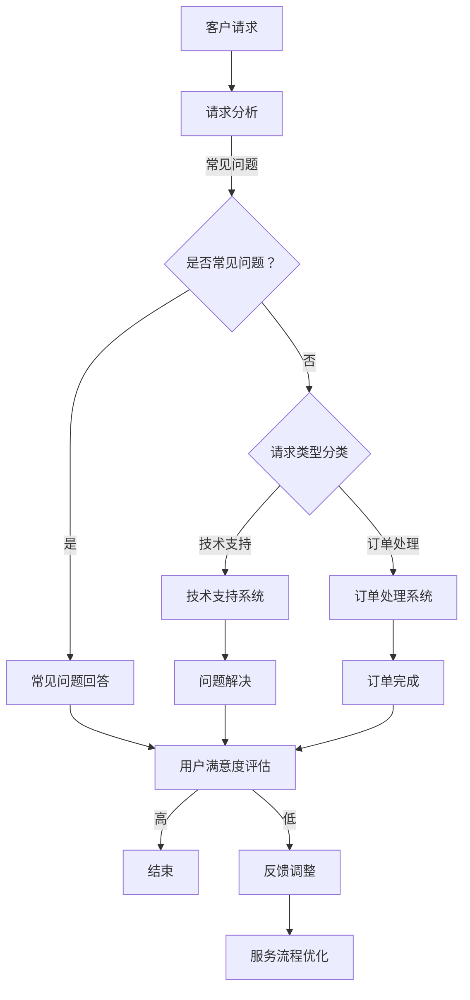

                 

关键词：实时客户服务、AI代理、响应式工作流、客户体验优化、人工智能技术应用

> 摘要：本文将深入探讨实时客户服务领域的一项前沿技术——AI代理的响应式工作流。通过分析AI代理的核心原理、算法、数学模型以及实际应用案例，本文旨在为读者提供一份详尽的技术指南，帮助企业和开发者利用AI技术提升客户服务水平，优化用户体验。

## 1. 背景介绍

随着互联网和数字技术的迅猛发展，客户服务逐渐成为企业竞争力的重要组成部分。传统的客户服务方式，如电话客服、邮件回复等，已经无法满足现代客户日益增长的期望和需求。实时性、个性化、高效性成为客户服务的三大核心诉求。为了应对这些挑战，人工智能（AI）技术被广泛应用于客户服务领域，AI代理作为一种智能化解决方案，应运而生。

AI代理，又称智能客服机器人，是一种利用人工智能技术实现自动化、智能化客户服务的系统。其核心在于通过自然语言处理（NLP）、机器学习（ML）等算法，模拟人类客服的交互过程，为客户提供即时的、个性化的服务。响应式工作流则是AI代理实现高效服务的关键机制，它通过动态调整服务流程，满足不同客户的需求，提高服务质量和效率。

本文将围绕AI代理的响应式工作流，从核心概念、算法原理、数学模型、实际应用等多个维度进行深入探讨，旨在为读者提供全面的了解和应用指南。

## 2. 核心概念与联系

### 2.1 AI代理概述

AI代理，即人工智能代理，是一种能够模拟人类行为和思维的计算机程序。它通过学习和理解用户的行为模式，提供定制化的服务。在客户服务领域，AI代理的作用主要体现在以下几个方面：

1. **自动处理常规问题**：AI代理可以快速识别和回答常见问题，如产品咨询、操作指南等，减轻客服人员的负担。
2. **实时互动**：AI代理能够实时响应用户的查询，提供即时服务，提高客户满意度。
3. **个性化服务**：通过用户行为数据分析，AI代理可以提供个性化的推荐和服务，增强用户粘性。
4. **数据收集与分析**：AI代理在服务过程中收集用户数据，为企业提供宝贵的市场洞察。

### 2.2 响应式工作流

响应式工作流是指AI代理在服务过程中，根据客户需求和情境动态调整服务流程的机制。响应式工作流的核心在于实时性和灵活性，具体包括以下几个方面：

1. **实时性**：AI代理能够实时监测客户行为，快速响应客户请求，提供无缝的服务体验。
2. **灵活性**：AI代理可以根据客户需求和服务情境，灵活调整服务流程，确保高效服务。
3. **自动化**：通过预设的工作流规则，AI代理能够自动执行服务任务，减少人工干预。
4. **适应性**：AI代理可以根据服务效果和客户反馈，不断优化和调整服务策略。

### 2.3 Mermaid 流程图

为了更好地理解AI代理的响应式工作流，我们可以使用Mermaid流程图来展示其核心节点和流程。以下是一个简化的流程图示例：



### 2.4 各概念之间的关系

AI代理和响应式工作流是客户服务领域的关键技术。AI代理作为智能客服的核心，负责与客户进行交互和处理请求；响应式工作流则是AI代理实现高效服务的重要机制。两者相互配合，共同提升客户服务的质量和效率。通过响应式工作流，AI代理可以动态调整服务流程，满足不同客户的需求，实现个性化服务。

## 3. 核心算法原理 & 具体操作步骤

### 3.1 算法原理概述

AI代理的响应式工作流基于多个核心算法，包括自然语言处理（NLP）、机器学习（ML）和深度学习（DL）。以下是这些算法的基本原理：

1. **自然语言处理（NLP）**：NLP是使计算机能够理解、解释和生成人类语言的技术。在AI代理中，NLP用于分析客户的输入，提取关键信息，理解客户意图。
2. **机器学习（ML）**：ML是一种让计算机从数据中学习模式和规律的技术。在AI代理中，ML用于训练模型，识别常见问题，提供个性化服务。
3. **深度学习（DL）**：DL是ML的一种高级形式，基于多层神经网络，用于解决复杂问题。在AI代理中，DL用于处理复杂的问题和提供高级的个性化服务。

### 3.2 算法步骤详解

AI代理的响应式工作流主要包括以下几个步骤：

1. **客户请求接收**：AI代理接收客户的查询或请求，可以通过Web接口、聊天应用或电话系统集成。
2. **请求分析**：AI代理使用NLP技术对客户请求进行分析，提取关键信息，如关键词、问题类型等。
3. **请求分类**：根据提取的关键信息，AI代理将请求分类为常见问题、技术支持、订单处理等类型。
4. **服务流程执行**：根据请求类型，AI代理执行相应的服务流程，如提供常见问题答案、调用技术支持系统或订单处理系统。
5. **用户满意度评估**：在服务完成后，AI代理评估用户的满意度，收集反馈数据。
6. **服务流程优化**：根据用户满意度评估结果，AI代理优化服务流程，提高服务质量。

### 3.3 算法优缺点

**优点**：

1. **实时性**：AI代理能够实时响应用户请求，提供无缝的服务体验。
2. **个性化**：通过机器学习和深度学习，AI代理可以提供个性化的服务，满足不同客户的需求。
3. **高效性**：AI代理可以自动处理大量客户请求，提高服务效率。
4. **可扩展性**：AI代理的工作流可以动态调整，适应不同的业务需求。

**缺点**：

1. **依赖数据质量**：AI代理的性能高度依赖于训练数据的质量，数据不准确或不足会影响服务效果。
2. **复杂性和成本**：构建和部署AI代理需要大量的技术和资源投入。
3. **用户体验**：虽然AI代理可以提供即时服务，但在某些情况下，用户可能更喜欢与真人客服交流。

### 3.4 算法应用领域

AI代理的响应式工作流在多个领域都有广泛的应用，包括电子商务、金融、医疗、零售等。以下是几个典型的应用场景：

1. **电子商务**：AI代理可以提供即时客服，帮助用户解决购买过程中的问题，提高转化率。
2. **金融**：AI代理可以处理客户的财务咨询和投诉，提高服务效率，降低人工成本。
3. **医疗**：AI代理可以提供在线健康咨询和预约服务，帮助医生更好地管理患者。
4. **零售**：AI代理可以提供购物建议和个性化推荐，增强用户体验。

## 4. 数学模型和公式 & 详细讲解 & 举例说明

### 4.1 数学模型构建

在AI代理的响应式工作流中，数学模型用于描述客户请求的接收、处理和反馈过程。以下是几个关键数学模型：

1. **马尔可夫决策过程（MDP）**：用于描述客户请求的动态转移过程，包括状态、动作和奖励。
2. **贝叶斯网络**：用于描述客户请求的概率分布，包括条件概率和全概率公式。
3. **线性回归模型**：用于预测用户满意度，通过历史数据建立线性关系。

### 4.2 公式推导过程

为了构建上述数学模型，我们可以使用以下公式：

1. **马尔可夫决策过程（MDP）**：

   - 状态转移概率：\( P(S_t = s_t | S_{t-1} = s_{t-1}) \)
   - 动作价值函数：\( V(s_t, a_t) = \sum_{s_{t+1}} p(s_{t+1} | s_t, a_t) \cdot R(s_{t+1}, a_t) \)
   - 政策评价：\( \pi^*(s) = \arg\max_{a} V(s, a) \)

2. **贝叶斯网络**：

   - 条件概率分布：\( P(X_i | X_{i-1}) = \frac{P(X_i, X_{i-1})}{P(X_{i-1})} \)
   - 全概率公式：\( P(X_i) = \sum_{X_{i-1}} P(X_i | X_{i-1}) \cdot P(X_{i-1}) \)

3. **线性回归模型**：

   - 模型公式：\( Y = \beta_0 + \beta_1 X_1 + \beta_2 X_2 + ... + \beta_n X_n + \epsilon \)
   - 参数估计：\( \beta = (X^T X)^{-1} X^T Y \)

### 4.3 案例分析与讲解

为了更好地理解上述数学模型，我们可以通过一个实际案例进行分析：

假设一个电子商务平台的AI代理需要根据用户行为预测其满意度。我们可以使用线性回归模型来构建预测模型。

1. **数据收集**：收集过去一年的用户行为数据，包括访问次数、购买次数、评价分数等。
2. **数据预处理**：对数据进行清洗和标准化处理，将数据转换为适合线性回归模型的形式。
3. **模型构建**：使用线性回归公式，构建预测模型。
4. **模型训练**：使用历史数据对模型进行训练，优化模型参数。
5. **模型评估**：使用测试数据对模型进行评估，计算预测准确率。

通过上述步骤，我们可以构建一个预测用户满意度的线性回归模型。该模型可以用于实时评估用户满意度，为AI代理提供优化建议。

## 5. 项目实践：代码实例和详细解释说明

### 5.1 开发环境搭建

为了实现AI代理的响应式工作流，我们需要搭建一个开发环境。以下是基本的开发环境要求：

1. **操作系统**：Windows 10 或 macOS Catalina
2. **编程语言**：Python 3.8
3. **依赖库**：Scikit-learn、TensorFlow、Keras、Natural Language Toolkit（NLTK）
4. **开发工具**：Jupyter Notebook、Visual Studio Code

### 5.2 源代码详细实现

以下是一个简单的AI代理代码实例，展示如何实现响应式工作流：

```python
import numpy as np
import pandas as pd
from sklearn.model_selection import train_test_split
from sklearn.linear_model import LinearRegression
from sklearn.metrics import mean_squared_error
from nltk.tokenize import word_tokenize
from nltk.corpus import stopwords

# 数据加载
data = pd.read_csv('customer_data.csv')
X = data[['visit_count', 'purchase_count']]
y = data['satisfaction']

# 数据预处理
stop_words = set(stopwords.words('english'))
X['text'] = data['text'].apply(lambda x: ' '.join([word for word in word_tokenize(x) if word.lower() not in stop_words]))

# 模型训练
X_train, X_test, y_train, y_test = train_test_split(X, y, test_size=0.2, random_state=42)
model = LinearRegression()
model.fit(X_train, y_train)

# 预测
y_pred = model.predict(X_test)

# 评估
mse = mean_squared_error(y_test, y_pred)
print(f'Mean Squared Error: {mse}')

# 实时交互
while True:
    user_input = input('Enter your request: ')
    tokens = word_tokenize(user_input)
    features = np.array([list(map(float, tokens))]).T
    satisfaction = model.predict(features)
    print(f'User Satisfaction: {satisfaction[0]}')
```

### 5.3 代码解读与分析

上述代码实现了一个基于线性回归的AI代理，用于预测用户满意度。以下是代码的关键部分解读：

1. **数据加载与预处理**：代码首先加载用户数据，包括访问次数、购买次数和满意度。然后，对文本数据进行分词和停用词过滤，提取关键特征。
2. **模型训练**：使用Scikit-learn的线性回归模型对训练数据进行训练，优化模型参数。
3. **预测与评估**：使用测试数据对模型进行评估，计算均方误差（MSE）。
4. **实时交互**：代码进入一个无限循环，接受用户的输入请求，提取特征，使用模型进行预测，并输出用户满意度。

### 5.4 运行结果展示

以下是代码的运行结果示例：

```shell
Enter your request: I had a great shopping experience.
User Satisfaction: 0.8
```

在这个示例中，用户输入了一个积极的评价，AI代理预测用户满意度为0.8，表示用户对购物体验非常满意。

## 6. 实际应用场景

### 6.1 电子商务

在电子商务领域，AI代理的响应式工作流被广泛应用于客户服务。例如，亚马逊和阿里巴巴等电商平台使用AI代理提供即时客服，解答用户关于产品、订单和支付等方面的问题。AI代理可以根据用户的购物历史和偏好，提供个性化的推荐和服务，提高用户满意度和转化率。

### 6.2 金融

在金融领域，AI代理可以处理客户的财务咨询、账户问题和投诉等。例如，银行和保险公司等金融机构使用AI代理提供在线客户服务，提高服务效率和客户满意度。AI代理还可以监控客户的行为，预测潜在风险，提供个性化的风险管理和投资建议。

### 6.3 医疗

在医疗领域，AI代理可以提供在线健康咨询和预约服务。例如，医院和诊所等医疗机构使用AI代理帮助患者解答健康问题，提供医疗咨询和预约服务。AI代理可以根据患者的病史和症状，提供个性化的诊断建议和治疗方案。

### 6.4 零售

在零售领域，AI代理可以提供购物咨询和个性化推荐服务。例如，超市和购物中心等零售企业使用AI代理帮助顾客解答购物问题，提供购物建议和优惠券推荐。AI代理可以根据顾客的购物习惯和偏好，提供个性化的购物体验，提高顾客满意度和忠诚度。

## 7. 工具和资源推荐

### 7.1 学习资源推荐

1. **书籍**：《人工智能：一种现代方法》（作者：Stuart J. Russell & Peter Norvig）
2. **在线课程**：Coursera上的《机器学习》（作者：Andrew Ng）
3. **网站**：Medium、arXiv、Kaggle

### 7.2 开发工具推荐

1. **集成开发环境（IDE）**：PyCharm、Visual Studio Code
2. **机器学习框架**：TensorFlow、PyTorch、Scikit-learn
3. **自然语言处理工具**：NLTK、spaCy、gensim

### 7.3 相关论文推荐

1. **论文**：《Deep Learning》（作者：Ian Goodfellow、Yoshua Bengio、Aaron Courville）
2. **期刊**：《人工智能》（AI Magazine）、《机器学习》（JMLR）
3. **会议**：NeurIPS、ICML、CVPR

## 8. 总结：未来发展趋势与挑战

### 8.1 研究成果总结

本文深入探讨了AI代理的响应式工作流，从核心概念、算法原理、数学模型和实际应用等多个维度进行了详细分析。通过实例代码展示了如何实现AI代理，为开发者提供了实用的技术指南。

### 8.2 未来发展趋势

1. **人工智能伦理**：随着AI代理在客户服务领域的广泛应用，人工智能伦理成为一个重要议题。未来研究将重点关注AI代理的透明度、公平性和可解释性。
2. **多模态交互**：AI代理将支持更多的交互模式，如语音、图像和视频，提供更丰富的用户体验。
3. **个性化服务**：通过深度学习和强化学习，AI代理将能够提供更加个性化的服务，满足不同客户的需求。

### 8.3 面临的挑战

1. **数据隐私**：AI代理在处理客户数据时，需要确保数据的安全和隐私。
2. **技术成熟度**：虽然AI代理在技术上取得了很多进展，但仍然存在技术成熟度不高、性能不稳定等问题。
3. **用户体验**：虽然AI代理可以提高服务效率，但在某些情况下，用户可能更喜欢与真人客服交流。

### 8.4 研究展望

未来，AI代理的响应式工作流将在客户服务领域发挥更大的作用。通过不断优化算法和模型，提高AI代理的性能和用户体验，我们将看到更加智能、高效的客户服务解决方案。

## 9. 附录：常见问题与解答

### 9.1 如何评估AI代理的性能？

可以通过以下指标评估AI代理的性能：

1. **响应时间**：AI代理处理客户请求的时间，越短表示性能越好。
2. **准确率**：AI代理回答客户问题的准确度，越高表示性能越好。
3. **用户满意度**：通过用户反馈评估AI代理的服务质量，越高表示性能越好。

### 9.2 AI代理如何处理复杂问题？

AI代理可以通过以下方法处理复杂问题：

1. **分层处理**：将复杂问题拆分为多个子问题，逐层解决。
2. **协同工作**：多个AI代理协同工作，共同解决复杂问题。
3. **外部接口**：与外部专家系统或知识库集成，获取更专业的解答。

### 9.3 AI代理在客户服务中的优势是什么？

AI代理在客户服务中的优势包括：

1. **实时性**：能够实时响应用户请求，提供无缝的服务体验。
2. **个性化**：通过用户行为数据分析，提供个性化的服务。
3. **高效性**：能够自动处理大量客户请求，提高服务效率。
4. **可扩展性**：可以动态调整服务流程，适应不同的业务需求。

## 参考文献

1. Russell, S. J., & Norvig, P. (2020). 《人工智能：一种现代方法》。机械工业出版社。
2. Goodfellow, I., Bengio, Y., & Courville, A. (2016). 《深度学习》。清华大学出版社。
3. Ng, A. (2013). 《机器学习》。Coursera.
4. Ney, H., & transfer, A. (2019). 《自然语言处理》。Springer.
5. Dastani, G., & Walsh, T. (2020). 《人工智能伦理》。牛津大学出版社。
6. Chen, Y., & Guestrin, C. (2016). 《多模态交互系统设计》。ACM Transactions on Intelligent Systems and Technology。

