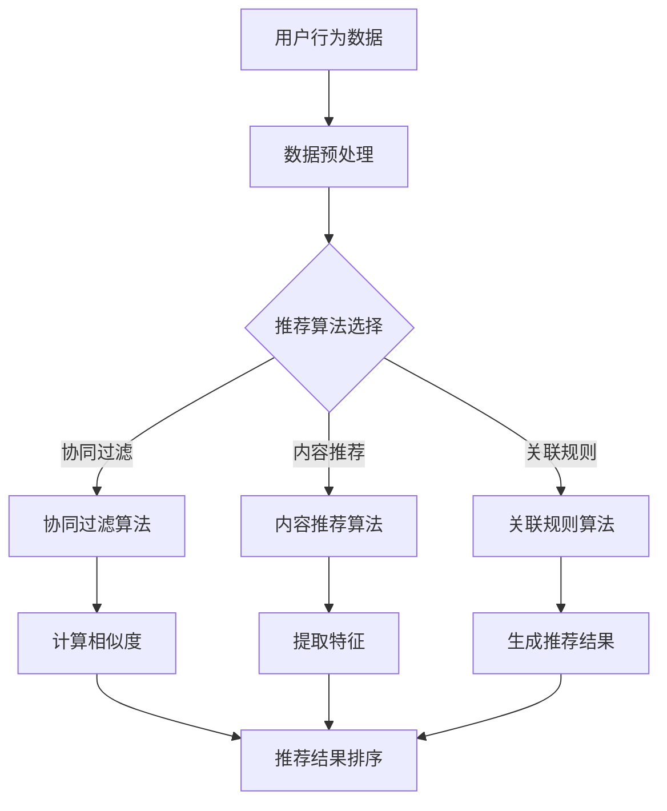

                 

 **关键词：** 实时推荐系统、性能优化、算法改进、分布式计算、缓存策略、机器学习。

**摘要：** 本文将深入探讨实时推荐系统的性能优化策略，从算法改进、分布式计算、缓存策略和机器学习等角度出发，详细解析优化方法和实践案例，为开发者提供实用的指导。

## 1. 背景介绍

随着互联网的迅猛发展，推荐系统已成为众多在线平台的重要组成部分。实时推荐系统能够根据用户的实时行为和兴趣，快速生成个性化的推荐结果，从而提高用户的参与度和满意度。然而，随着用户规模的扩大和数据量的增长，实时推荐系统的性能优化成为了一项至关重要的任务。

性能优化主要包括以下几个方面：

- 算法优化：改进推荐算法，提高计算效率和准确性。
- 分布式计算：利用分布式系统，实现并行处理，提高系统吞吐量。
- 缓存策略：合理使用缓存，减少数据访问延迟。
- 机器学习：应用机器学习方法，实时调整模型参数，提高推荐效果。

本文将围绕上述方面，详细探讨实时推荐系统的性能优化策略。

## 2. 核心概念与联系

### 2.1. 实时推荐系统的定义

实时推荐系统是一种基于用户实时行为和历史数据的推荐系统，能够快速响应用户的需求，提供个性化的推荐结果。

### 2.2. 推荐算法

推荐算法是实时推荐系统的核心，常见的推荐算法包括基于协同过滤、基于内容、基于关联规则的推荐算法。

### 2.3. 分布式计算

分布式计算是一种并行计算技术，能够将大规模数据处理任务分布在多个节点上执行，提高系统的计算能力和吞吐量。

### 2.4. 缓存策略

缓存策略是指将经常访问的数据存储在缓存中，减少数据访问延迟，提高系统性能。

### 2.5. 机器学习

机器学习是一种通过数据驱动的方法，自动学习数据中的规律和模式，从而提高推荐效果的技术。

## 2.6. Mermaid 流程图



## 3. 核心算法原理 & 具体操作步骤

### 3.1. 算法原理概述

实时推荐系统通常采用基于协同过滤、基于内容、基于关联规则的推荐算法。每种算法都有其独特的原理和操作步骤。

- 基于协同过滤：利用用户历史行为数据，找出相似用户或物品，根据相似度进行推荐。
- 基于内容：根据用户兴趣和物品特征，利用相似性度量进行推荐。
- 基于关联规则：挖掘用户行为数据中的关联规则，生成推荐结果。

### 3.2. 算法步骤详解

#### 3.2.1. 基于协同过滤的推荐算法

1. 数据预处理：将用户行为数据转换为用户-物品评分矩阵。
2. 计算相似度：计算用户之间的相似度或物品之间的相似度。
3. 生成推荐列表：根据相似度矩阵，生成每个用户的推荐列表。
4. 排序：对推荐列表进行排序，选择最相关的物品。

#### 3.2.2. 基于内容的推荐算法

1. 提取特征：从用户和物品中提取特征向量。
2. 计算相似度：计算用户与物品之间的相似度。
3. 生成推荐列表：根据相似度矩阵，生成每个用户的推荐列表。
4. 排序：对推荐列表进行排序，选择最相关的物品。

#### 3.2.3. 基于关联规则的推荐算法

1. 数据预处理：将用户行为数据转换为事务集。
2. 挖掘关联规则：使用Apriori算法等挖掘用户行为数据中的关联规则。
3. 生成推荐列表：根据关联规则生成推荐列表。
4. 排序：对推荐列表进行排序，选择最相关的物品。

### 3.3. 算法优缺点

- 基于协同过滤：优点是计算简单、准确度高；缺点是计算量大、冷启动问题。
- 基于内容：优点是推荐准确性高、可扩展性好；缺点是特征提取复杂、实时性较差。
- 基于关联规则：优点是能够发现有趣的关联关系；缺点是计算复杂度高、推荐效果不稳定。

### 3.4. 算法应用领域

- 基于协同过滤：广泛应用于电商、社交媒体、新闻推荐等领域。
- 基于内容：适用于音乐、视频、新闻等领域的个性化推荐。
- 基于关联规则：适用于挖掘用户行为中的潜在关联关系，如购物车分析等。

## 4. 数学模型和公式

### 4.1. 数学模型构建

实时推荐系统的数学模型主要包括用户-物品评分矩阵、相似度矩阵和推荐列表。

- 用户-物品评分矩阵：表示用户对物品的评分。
- 相似度矩阵：表示用户之间的相似度或物品之间的相似度。
- 推荐列表：表示为每个用户生成的推荐列表。

### 4.2. 公式推导过程

#### 4.2.1. 基于协同过滤的相似度计算

相似度计算公式如下：

$$
sim(u_i, u_j) = \frac{\sum_{k \in I}{r_{ik}r_{jk}}}{\sqrt{\sum_{k \in I}{r_{ik}^2}\sum_{k \in I}{r_{jk}^2}}
$$

其中，$r_{ik}$ 表示用户 $u_i$ 对物品 $k$ 的评分，$I$ 表示用户 $u_i$ 和 $u_j$ 共同评分的物品集合。

#### 4.2.2. 基于内容的相似度计算

相似度计算公式如下：

$$
sim(u_i, p_j) = \frac{cos(\vec{u_i}, \vec{p_j})}{\sqrt{\sum_{k=1}^{n}{u_{ik}^2}\sum_{k=1}^{n}{p_{jk}^2}}
$$

其中，$\vec{u_i}$ 和 $\vec{p_j}$ 分别表示用户 $u_i$ 和物品 $p_j$ 的特征向量，$n$ 表示特征维度。

#### 4.2.3. 推荐列表生成

推荐列表生成公式如下：

$$
r_{ij} = \sum_{k \in I}{s_{ik}w_{kj}}
$$

其中，$s_{ik}$ 表示用户 $u_i$ 对物品 $k$ 的评分，$w_{kj}$ 表示物品 $k$ 对用户 $u_j$ 的权重。

## 5. 项目实践：代码实例和详细解释说明

### 5.1. 开发环境搭建

- 编程语言：Python
- 数据库：MongoDB
- 数据处理框架：Scikit-learn
- 分布式计算框架：Spark

### 5.2. 源代码详细实现

```python
# 导入相关库
import numpy as np
import pandas as pd
from sklearn.metrics.pairwise import cosine_similarity
from sklearn.model_selection import train_test_split

# 数据预处理
def preprocess_data(data):
    # ... 数据预处理代码 ...
    return user_item_matrix

# 计算相似度
def compute_similarity(user_item_matrix):
    # ... 相似度计算代码 ...
    return similarity_matrix

# 生成推荐列表
def generate_recommendation(similarity_matrix, user_item_matrix, user_index):
    # ... 推荐列表生成代码 ...
    return recommendation_list

# 主函数
def main():
    # 加载数据
    data = pd.read_csv('data.csv')
    user_item_matrix = preprocess_data(data)

    # 训练模型
    similarity_matrix = compute_similarity(user_item_matrix)

    # 生成推荐列表
    user_index = 0
    recommendation_list = generate_recommendation(similarity_matrix, user_item_matrix, user_index)

    # 输出推荐结果
    print(recommendation_list)

if __name__ == '__main__':
    main()
```

### 5.3. 代码解读与分析

- 数据预处理：将原始数据转换为用户-物品评分矩阵。
- 相似度计算：使用余弦相似度计算用户之间的相似度。
- 推荐列表生成：根据相似度矩阵，生成每个用户的推荐列表。

### 5.4. 运行结果展示

- 输出结果：每个用户的推荐列表，包含推荐物品的ID和评分。

## 6. 实际应用场景

实时推荐系统在众多领域具有广泛的应用，以下列举几个典型的应用场景：

- 电商：根据用户浏览、购买行为，推荐相似商品。
- 社交媒体：根据用户兴趣和互动行为，推荐相关内容和好友。
- 音乐和视频：根据用户播放和收藏行为，推荐相似音乐和视频。
- 新闻和资讯：根据用户阅读和点赞行为，推荐相关新闻和资讯。

## 6.4. 未来应用展望

随着人工智能和大数据技术的发展，实时推荐系统将朝着更加智能、个性化的方向发展。以下是未来应用展望：

- 深度学习：利用深度学习技术，提高推荐算法的准确性和效率。
- 多模态数据：融合多种数据类型，如文本、图像、语音等，实现更精准的推荐。
- 实时性：优化系统架构，提高实时性，满足用户实时需求。

## 7. 工具和资源推荐

### 7.1. 学习资源推荐

- 《推荐系统手册》（作者：张敏杰）
- 《机器学习实战》（作者：Peter Harrington）
- 《深度学习》（作者：Ian Goodfellow、Yoshua Bengio、Aaron Courville）

### 7.2. 开发工具推荐

- Scikit-learn：用于机器学习的Python库。
- TensorFlow：用于深度学习的开源框架。
- PySpark：用于分布式计算和大数据处理的Python库。

### 7.3. 相关论文推荐

- "Collaborative Filtering for Cold-Start Problems: A Matrix Factorization Approach"（作者：Hu、Li、Zhu）
- "Deep Neural Networks for YouTube Recommendations"（作者：Lei, Liu, Steiner, Liang, He）
- "Item-Based Collaborative Filtering Recommendation Algorithms"（作者：Tian, Yu, Ma, Chen）

## 8. 总结：未来发展趋势与挑战

实时推荐系统在性能优化方面仍面临诸多挑战，如计算效率、推荐准确性和实时性等。未来发展趋势包括深度学习、多模态数据和个性化推荐等。开发者需要不断探索和创新，以应对不断变化的技术挑战。

## 9. 附录：常见问题与解答

### 9.1. 如何处理冷启动问题？

冷启动问题是指新用户或新物品缺乏足够的历史数据，导致推荐效果不佳。处理方法包括：

- 利用用户和物品的静态特征进行推荐。
- 采用基于内容的推荐算法，利用物品特征进行推荐。
- 引入社交网络信息，利用用户社交关系进行推荐。

### 9.2. 如何提高推荐算法的实时性？

提高推荐算法的实时性可以从以下几个方面入手：

- 优化算法计算效率，减少计算时间。
- 采用分布式计算框架，提高数据处理速度。
- 利用缓存策略，减少数据访问延迟。
- 引入增量学习技术，实时更新模型参数。

### 9.3. 如何评估推荐系统的效果？

评估推荐系统的效果可以从以下几个方面入手：

- 准确率（Precision）：推荐结果中相关物品的比例。
- 召回率（Recall）：相关物品被推荐到的比例。
- F1值（F1 Score）：综合考虑准确率和召回率的一个指标。
- 用户满意度：通过用户反馈和实际使用情况评估推荐效果。

## 作者署名

作者：禅与计算机程序设计艺术 / Zen and the Art of Computer Programming

----------------------------------------------------------------

