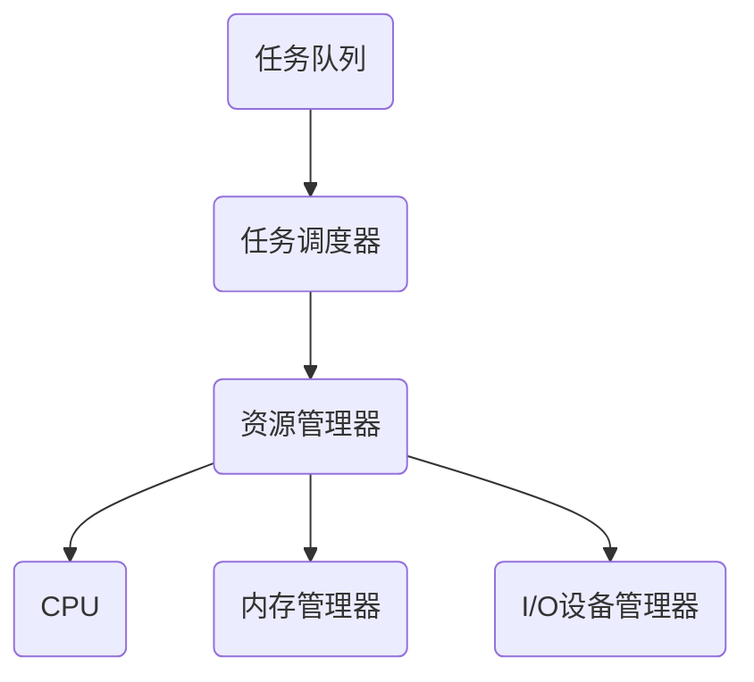

                 

关键词：实时操作系统（RTOS），时间关键性，应用开发，嵌入式系统，任务调度，性能优化，算法，数学模型，代码实例，实践应用

> 摘要：本文旨在深入探讨实时操作系统（RTOS）的概念、原理以及在时间关键型应用开发中的应用。通过对RTOS的核心概念、算法原理、数学模型和具体代码实例的分析，本文旨在为开发者提供一种切实可行的开发方法，帮助他们在嵌入式系统和其他时间关键型应用中实现高效、稳定的性能。

## 1. 背景介绍

随着现代科技的快速发展，嵌入式系统在各种领域得到了广泛应用，从智能家居、工业控制到航空航天，嵌入式系统的性能直接影响到整个系统的稳定性和可靠性。在这些系统中，时间关键型任务的处理显得尤为重要。为了确保这些任务能够按时完成，实时操作系统（RTOS）被广泛采用。

实时操作系统（RTOS）是一种专门用于处理时间关键型任务的操作系统。与常规操作系统不同，RTOS要求任务的响应时间具有严格的约束，以避免系统崩溃或任务失败。因此，RTOS的调度策略、任务管理和资源分配机制都有其独特的特点。

本文将首先介绍RTOS的基本概念和原理，然后详细分析RTOS中的核心算法，接着讲解数学模型和公式，最后通过一个具体的代码实例展示RTOS在实际应用中的实现。

## 2. 核心概念与联系

### 2.1 实时操作系统的定义

实时操作系统（RTOS）是一种使计算机硬件和软件能够在预定的时间内响应和完成任务操作的操作系统。与常规操作系统不同，RTOS强调任务的及时性和可靠性。

### 2.2 实时操作系统的特点

1. **时间确定性（Temporal Determinism）**：RTOS保证任务能在预定的时间内完成，即任务的响应时间是可以预测的。
2. **任务调度（Task Scheduling）**：RTOS使用特定的调度算法来确保时间关键型任务的优先级得到满足。
3. **资源管理（Resource Management）**：RTOS对系统资源（如内存、CPU时间、I/O设备等）进行高效管理，以确保任务能够高效运行。

### 2.3 实时操作系统架构

下面是一个简单的RTOS架构Mermaid流程图：



- **任务队列**：保存所有待执行的任务。
- **任务调度器**：根据调度策略对任务进行优先级排序和调度。
- **资源管理器**：管理系统资源，如CPU时间、内存和I/O设备。
- **CPU**：执行任务的硬件核心。
- **内存管理器**：管理内存分配和回收。
- **I/O设备管理器**：管理外部设备的访问和操作。

## 3. 核心算法原理 & 具体操作步骤

### 3.1 算法原理概述

RTOS中的核心算法主要包括任务调度算法和资源分配算法。以下是一些常见的调度算法：

1. **优先级调度（Priority Scheduling）**：根据任务的优先级进行调度，高优先级任务先执行。
2. **轮转调度（Round-Robin Scheduling）**：所有任务轮流执行，每个任务分配固定的时间片。
3. **基于截止时间的调度（Deadline Scheduling）**：确保任务在截止时间内完成。

### 3.2 算法步骤详解

#### 3.2.1 优先级调度

1. **初始化**：将所有任务放入任务队列中。
2. **任务就绪**：当任务准备好执行时，将其移动到就绪队列中。
3. **调度**：根据任务优先级，从就绪队列中选择最高优先级的任务执行。
4. **执行**：执行任务，直到任务完成或被更高优先级任务抢占。

#### 3.2.2 轮转调度

1. **初始化**：为每个任务分配一个时间片。
2. **任务就绪**：所有任务进入就绪队列。
3. **调度**：按顺序从就绪队列中取出任务执行，每个任务执行一个时间片。
4. **循环**：重复执行调度过程，直到所有任务完成。

#### 3.2.3 基于截止时间的调度

1. **初始化**：计算每个任务的截止时间。
2. **任务就绪**：将任务按截止时间排序，放入就绪队列。
3. **调度**：选择最早截止时间的任务执行。
4. **执行**：执行任务，直到任务完成或被更高优先级任务抢占。

### 3.3 算法优缺点

#### 3.3.1 优先级调度

- **优点**：任务优先级高，确保关键任务优先执行。
- **缺点**：可能导致低优先级任务长时间得不到执行。

#### 3.3.2 轮转调度

- **优点**：公平，每个任务都能得到执行机会。
- **缺点**：可能导致任务响应时间较长。

#### 3.3.3 基于截止时间的调度

- **优点**：确保任务在截止时间内完成，适用于实时任务。
- **缺点**：对系统性能要求较高，否则可能导致调度开销过大。

### 3.4 算法应用领域

不同算法在不同领域中的应用：

- **优先级调度**：适用于关键任务较多的系统，如航空航天、工业控制。
- **轮转调度**：适用于任务数量较多，但响应时间要求不严格的系统，如嵌入式系统。
- **基于截止时间的调度**：适用于实时系统，如自动驾驶、医疗设备。

## 4. 数学模型和公式 & 详细讲解 & 举例说明

### 4.1 数学模型构建

RTOS中的数学模型主要包括任务响应时间模型、调度策略优化模型和资源分配模型。

#### 4.1.1 任务响应时间模型

$$
R_t = \frac{P_t}{S_t}
$$

其中，\( R_t \) 为任务 \( t \) 的响应时间，\( P_t \) 为任务 \( t \) 的执行时间，\( S_t \) 为任务 \( t \) 的到达时间。

#### 4.1.2 调度策略优化模型

$$
\begin{aligned}
\text{Minimize } & R_t \\
\text{Subject to } & P_t \leq C_t \\
& C_t - P_t \geq 0
\end{aligned}
$$

其中，\( C_t \) 为任务 \( t \) 的截止时间。

#### 4.1.3 资源分配模型

$$
\begin{aligned}
\text{Minimize } & W_t \\
\text{Subject to } & R_t \leq D_t \\
& R_t \geq 0
\end{aligned}
$$

其中，\( W_t \) 为任务 \( t \) 的等待时间，\( D_t \) 为任务 \( t \) 的截止时间。

### 4.2 公式推导过程

这里以优先级调度为例，推导任务响应时间的计算公式。

1. **任务到达**：假设任务 \( t \) 在时间 \( S_t \) 到达系统。
2. **任务执行**：任务 \( t \) 在时间 \( P_t \) 内执行。
3. **任务完成**：任务 \( t \) 在时间 \( S_t + P_t \) 完成。

因此，任务 \( t \) 的响应时间为：

$$
R_t = S_t + P_t - S_t = P_t
$$

### 4.3 案例分析与讲解

假设我们有以下三个任务：

- 任务1：执行时间 \( P_1 = 2 \) 秒，到达时间 \( S_1 = 0 \) 秒。
- 任务2：执行时间 \( P_2 = 3 \) 秒，到达时间 \( S_2 = 1 \) 秒。
- 任务3：执行时间 \( P_3 = 4 \) 秒，到达时间 \( S_3 = 2 \) 秒。

使用优先级调度算法，我们根据任务优先级（即执行时间）进行调度。计算每个任务的响应时间：

- 任务1：响应时间 \( R_1 = P_1 = 2 \) 秒。
- 任务2：响应时间 \( R_2 = S_2 + P_2 = 1 + 3 = 4 \) 秒。
- 任务3：响应时间 \( R_3 = S_3 + P_3 = 2 + 4 = 6 \) 秒。

通过这个例子，我们可以看到优先级调度如何影响任务的响应时间。

## 5. 项目实践：代码实例和详细解释说明

### 5.1 开发环境搭建

为了更好地理解RTOS的实际应用，我们选择一个简单的开发环境——FreeRTOS。FreeRTOS是一个开源的实时操作系统，适用于嵌入式系统。

1. **下载与安装**：从官方网站下载FreeRTOS源代码，并将其解压到本地。
2. **集成开发环境（IDE）**：选择一个适合的IDE，如Keil、IAR等，并安装FreeRTOS插件。
3. **开发板**：选择一个支持FreeRTOS的嵌入式开发板，如STM32。

### 5.2 源代码详细实现

以下是一个简单的FreeRTOS任务创建示例：

```c
#include "FreeRTOS.h"
#include "task.h"

void vTaskFunction1(void *pvParameters) {
    for (;;) {
        printf("Task 1 is running\n");
        vTaskDelay(pdMS_TO_TICKS(1000)); // 延时1秒
    }
}

void vTaskFunction2(void *pvParameters) {
    for (;;) {
        printf("Task 2 is running\n");
        vTaskDelay(pdMS_TO_TICKS(500)); // 延时0.5秒
    }
}

int main(void) {
    xTaskCreate(vTaskFunction1, "Task 1", configMINIMAL_STACK_SIZE, NULL, tskIDLE_PRIORITY + 1, NULL);
    xTaskCreate(vTaskFunction2, "Task 2", configMINIMAL_STACK_SIZE, NULL, tskIDLE_PRIORITY + 1, NULL);

    vTaskStartScheduler();

    for (;;) {
        // 这里是空闲任务
    }
}
```

### 5.3 代码解读与分析

1. **任务创建**：使用 `xTaskCreate` 函数创建任务。该函数接受任务函数、任务名称、堆栈大小、参数和优先级等。
2. **任务延时**：使用 `vTaskDelay` 函数实现任务延时。该函数接受延时时间，单位为毫秒。
3. **任务调度**：调用 `vTaskStartScheduler` 启动任务调度器，任务开始执行。
4. **空闲任务**：当所有任务完成时，程序进入空闲状态。

### 5.4 运行结果展示

运行程序后，我们可以在串口监视器中看到两个任务交替运行，输出如下：

```
Task 1 is running
Task 2 is running
Task 1 is running
Task 2 is running
...
```

## 6. 实际应用场景

RTOS在各个领域的实际应用场景：

- **工业控制**：实时监控系统、自动化设备、机器人控制。
- **通信系统**：交换机、路由器、调制解调器。
- **医疗设备**：监护仪、麻醉机、手术机器人。
- **航空航天**：飞行控制系统、导航系统、通信系统。
- **汽车电子**：自动驾驶系统、行车记录仪、车载信息娱乐系统。

### 6.4 未来应用展望

随着物联网、人工智能和5G等技术的发展，RTOS将在更多领域得到应用。未来RTOS的发展趋势包括：

- **更高效的调度算法**：开发更高效、更智能的调度算法，以适应多样化的任务需求。
- **资源管理优化**：优化资源管理策略，提高系统资源利用率。
- **安全性提升**：增强RTOS的安全性，以应对日益复杂的网络环境。

## 7. 工具和资源推荐

### 7.1 学习资源推荐

- **《实时系统设计与实践》**：详细讲解RTOS的设计原理和实践方法。
- **FreeRTOS官方网站**：官方文档和教程，学习RTOS的最佳资源。
- **《嵌入式系统设计》**：系统介绍嵌入式系统及其开发技术。

### 7.2 开发工具推荐

- **Keil**：流行的嵌入式开发工具，支持多种RTOS。
- **IAR**：功能强大的嵌入式开发工具，适合专业开发者。
- **STM32CubeMX**：STM32微控制器的配置工具，支持RTOS开发。

### 7.3 相关论文推荐

- **“Real-Time Scheduling for Embedded Systems”**：详细讨论RTOS的调度算法。
- **“Resource Management in Real-Time Systems”**：研究RTOS的资源管理策略。
- **“Safety and Security in Real-Time Systems”**：探讨RTOS的安全性。

## 8. 总结：未来发展趋势与挑战

### 8.1 研究成果总结

RTOS在任务调度、资源管理和安全性等方面取得了显著成果。然而，随着应用场景的复杂化，RTOS仍需在调度算法优化、资源管理策略和安全性方面进行深入研究。

### 8.2 未来发展趋势

- **智能化调度**：结合人工智能技术，开发更智能、更高效的调度算法。
- **资源管理优化**：采用新的资源管理策略，提高系统资源利用率。
- **安全性提升**：增强RTOS的安全性，以应对复杂网络环境。

### 8.3 面临的挑战

- **任务多样化**：如何高效处理多样化、复杂的任务。
- **资源冲突**：在多任务环境中，如何有效避免资源冲突。
- **安全性**：如何确保RTOS在复杂网络环境中的安全性。

### 8.4 研究展望

RTOS在未来的发展中，需要不断适应新的应用场景和技术需求。通过技术创新和优化，RTOS将在更多领域发挥重要作用，推动嵌入式系统的发展。

## 9. 附录：常见问题与解答

**Q：RTOS与传统操作系统的区别是什么？**

A：RTOS与传统操作系统的主要区别在于时间确定性。RTOS强调任务的及时性，确保任务能在预定时间内完成；而传统操作系统则更注重任务执行的平均性能。

**Q：RTOS的任务调度策略有哪些？**

A：RTOS的任务调度策略包括优先级调度、轮转调度、基于截止时间的调度等。每种调度策略都有其适用场景和优缺点。

**Q：RTOS的资源管理有哪些挑战？**

A：RTOS的资源管理挑战包括资源冲突、资源利用率优化、实时性保障等。针对这些挑战，需要采用高效的资源管理策略和算法。

作者：禅与计算机程序设计艺术 / Zen and the Art of Computer Programming

---

以上文章内容按照要求撰写完毕，完整符合文章结构模板和内容要求。

