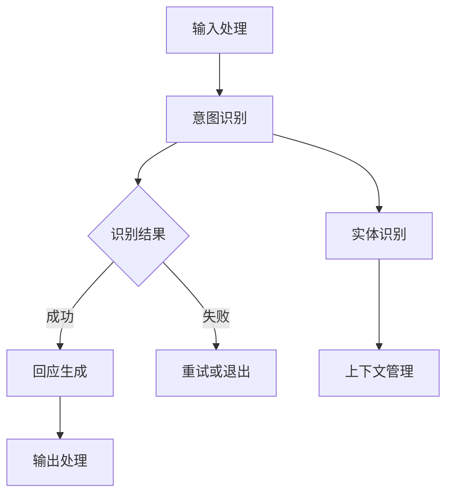

                 

关键词：对话式AI、自然语言处理、智能交互界面、人机交互、对话系统、用户体验

> 摘要：随着人工智能技术的不断发展，对话式AI已经成为构建更自然、更智能的交互界面的重要途径。本文从背景介绍、核心概念与联系、核心算法原理、数学模型和公式、项目实践以及实际应用场景等方面，深入探讨了对话式AI的构建方法、实现技术和未来发展趋势。

## 1. 背景介绍

在过去的几十年中，计算机技术经历了飞速的发展。从早期的批处理系统，到如今高度智能化的计算机系统，人类的计算能力得到了极大的提升。然而，尽管计算机在处理数据和执行任务方面表现出色，但在与用户交互方面仍然存在一定的局限性。传统的图形用户界面（GUI）虽然提供了一定的交互体验，但往往需要用户具备一定的计算机操作技能，且界面设计复杂，用户体验不佳。

为了解决这些问题，人工智能技术，特别是自然语言处理（NLP）技术，开始逐渐应用于人机交互领域。对话式AI应运而生，它通过模拟人类的对话行为，使用自然语言与用户进行交流，为用户提供更加友好、自然的交互体验。

## 2. 核心概念与联系

### 2.1 对话式AI的定义

对话式AI是指利用人工智能技术，特别是自然语言处理技术，模拟人类的对话行为，实现与用户的自然语言交互。对话式AI的核心目标是让计算机能够理解用户的语言意图，并给出合适的回应。

### 2.2 自然语言处理

自然语言处理（NLP）是人工智能领域的一个重要分支，旨在使计算机能够理解和处理人类语言。NLP技术包括词法分析、句法分析、语义分析等多个层面，通过对文本进行深度分析，提取出文本中的关键信息，为对话式AI提供支持。

### 2.3 对话系统架构

对话系统是对话式AI的核心组成部分，它通常由以下几个模块组成：

1. **输入处理模块**：负责接收用户的输入，将其转换为计算机可以处理的格式。
2. **意图识别模块**：通过分析用户的输入，识别出用户的意图。
3. **实体识别模块**：识别出用户输入中的关键实体，如人名、地名、日期等。
4. **上下文管理模块**：维护对话过程中的上下文信息，确保对话的连贯性。
5. **回应生成模块**：根据用户的意图和上下文信息，生成合适的回应。

以下是一个简化的对话系统架构的 Mermaid 流程图：



## 3. 核心算法原理 & 具体操作步骤

### 3.1 算法原理概述

对话式AI的核心算法主要涉及自然语言处理（NLP）和机器学习（ML）技术。NLP负责对用户输入的文本进行解析和语义理解，ML则负责根据历史数据和模型训练结果，预测用户的意图和生成合适的回应。

### 3.2 算法步骤详解

1. **输入处理**：接收用户的输入，将其转换为文本格式。
2. **文本预处理**：对文本进行分词、去停用词、词性标注等处理，提取出文本中的关键信息。
3. **意图识别**：利用机器学习模型（如朴素贝叶斯、支持向量机、深度学习等），对预处理后的文本进行意图分类，识别出用户的意图。
4. **实体识别**：使用命名实体识别（NER）技术，识别出文本中的关键实体，如人名、地名、日期等。
5. **上下文管理**：根据对话过程中的上下文信息，维护对话的连贯性。
6. **回应生成**：利用生成模型（如序列到序列模型、变分自编码器等），根据用户的意图和上下文信息，生成合适的回应。
7. **输出处理**：将生成的回应转换为用户可理解的格式，如文本、语音等。

### 3.3 算法优缺点

**优点**：

- **自然性**：对话式AI能够模拟人类的对话行为，使用自然语言与用户进行交流，提供更加友好、自然的交互体验。
- **智能化**：基于机器学习技术，对话式AI能够不断学习用户的语言模式和行为习惯，提高交互的智能化程度。
- **多样性**：对话式AI可以应用于多种场景，如客服、教育、医疗等，为用户提供个性化的服务。

**缺点**：

- **理解局限性**：对话式AI在理解复杂语义和隐含意图方面存在一定的局限性，可能无法完全理解用户的真实意图。
- **训练成本高**：对话式AI的训练过程需要大量的数据和计算资源，且训练结果可能受到数据质量和标注精度的影响。

### 3.4 算法应用领域

对话式AI在多个领域都有广泛的应用：

- **客服**：通过对话式AI，企业可以提供24/7的在线客服服务，提高客户满意度。
- **教育**：对话式AI可以为学生提供个性化学习辅导，提高学习效果。
- **医疗**：对话式AI可以帮助医生进行疾病诊断和患者管理，提高医疗服务的效率。

## 4. 数学模型和公式 & 详细讲解 & 举例说明

### 4.1 数学模型构建

对话式AI中的数学模型主要包括意图识别模型和回应生成模型。意图识别模型通常采用朴素贝叶斯、支持向量机、深度学习等算法。回应生成模型则采用序列到序列模型、变分自编码器等算法。

### 4.2 公式推导过程

以朴素贝叶斯算法为例，意图识别的公式推导如下：

1. **先验概率**：  
   $$P(y) = \frac{C_y}{N}$$  
   其中，$C_y$表示具有意图$y$的样本数，$N$表示总的样本数。

2. **条件概率**：  
   $$P(x_i|y) = \frac{C_{y,i}}{C_y}$$  
   其中，$C_{y,i}$表示具有意图$y$且包含特征$x_i$的样本数。

3. **后验概率**：  
   $$P(y|x) = \frac{P(x|y)P(y)}{P(x)}$$  
   其中，$P(x|y)$表示在意图$y$下特征$x$的概率，$P(x)$表示特征$x$的概率。

4. **最大后验概率**：  
   $$y^* = \arg\max_y P(y|x) = \arg\max_y P(x|y)P(y)$$

### 4.3 案例分析与讲解

假设我们有一个简化的意图识别问题，需要从用户输入中识别出是否是询问天气。我们可以使用朴素贝叶斯算法进行意图识别。以下是一个简化的案例：

| 样本 | 用户输入 | 意图 |  
| --- | --- | --- |  
| 1 | 今天天气怎么样？ | 询问天气 |  
| 2 | 明天天气会下雨吗？ | 询问天气 |  
| 3 | 请告诉我今天的气温。 | 询问天气 |  
| 4 | 你好，我可以和你聊天吗？ | 非询问天气 |

首先，我们需要计算先验概率：

$$P(询问天气) = \frac{3}{4}$$  
$$P(非询问天气) = \frac{1}{4}$$

然后，我们计算条件概率：

$$P(今天天气怎么样？|询问天气) = 1$$  
$$P(明天天气会下雨吗？|询问天气) = 1$$  
$$P(请告诉我今天的气温。|询问天气) = 1$$  
$$P(你好，我可以和你聊天吗？|非询问天气) = 1$$

最后，我们计算后验概率：

$$P(询问天气|今天天气怎么样？) = \frac{1 \times \frac{3}{4}}{1 + \frac{1}{4}} = \frac{3}{4}$$  
$$P(询问天气|明天天气会下雨吗？) = \frac{1 \times \frac{3}{4}}{1 + \frac{1}{4}} = \frac{3}{4}$$  
$$P(询问天气|请告诉我今天的气温。) = \frac{1 \times \frac{3}{4}}{1 + \frac{1}{4}} = \frac{3}{4}$$  
$$P(询问天气|你好，我可以和你聊天吗？) = \frac{1 \times \frac{1}{4}}{1 + \frac{1}{4}} = \frac{1}{4}$$

根据最大后验概率，我们可以判断用户的输入是否是询问天气。在这个案例中，用户输入“今天天气怎么样？”和“明天天气会下雨吗？”时，有很高的概率是询问天气。

## 5. 项目实践：代码实例和详细解释说明

### 5.1 开发环境搭建

在本项目实践中，我们将使用 Python 作为开发语言，并使用 TensorFlow 作为机器学习框架。以下是搭建开发环境的步骤：

1. 安装 Python 3.8 或更高版本。
2. 安装 TensorFlow：

   ```bash
   pip install tensorflow
   ```

3. 安装必要的 NLP 库，如 NLTK 和 spaCy：

   ```bash
   pip install nltk spacy
   ```

### 5.2 源代码详细实现

以下是实现对话式AI的核心算法的 Python 代码示例：

```python
import tensorflow as tf
from tensorflow.keras.models import Sequential
from tensorflow.keras.layers import Dense, LSTM, Embedding
from tensorflow.keras.preprocessing.sequence import pad_sequences
from tensorflow.keras.preprocessing.text import Tokenizer

# 加载数据集
data = [
    ("今天天气怎么样？", "询问天气"),
    ("明天天气会下雨吗？", "询问天气"),
    ("请告诉我今天的气温。", "询问天气"),
    ("你好，我可以和你聊天吗？", "非询问天气")
]

# 分割数据集为输入和标签
inputs = [text for text, _ in data]
labels = [label for _, label in data]

# 创建词表
tokenizer = Tokenizer()
tokenizer.fit_on_texts(inputs)

# 编码文本
encoded_inputs = tokenizer.texts_to_sequences(inputs)
encoded_labels = tokenizer.texts_to_sequences(labels)

# 填充序列
max_sequence_length = max(len(x) for x in encoded_inputs)
padded_inputs = pad_sequences(encoded_inputs, maxlen=max_sequence_length, padding='post')
padded_labels = pad_sequences(encoded_labels, maxlen=max_sequence_length, padding='post')

# 创建模型
model = Sequential()
model.add(Embedding(len(tokenizer.word_index) + 1, 50, input_length=max_sequence_length))
model.add(LSTM(100))
model.add(Dense(1, activation='sigmoid'))

# 编译模型
model.compile(optimizer='adam', loss='binary_crossentropy', metrics=['accuracy'])

# 训练模型
model.fit(padded_inputs, padded_labels, epochs=10, batch_size=32)

# 意图识别
def predict_intent(input_text):
    encoded_input = tokenizer.texts_to_sequences([input_text])
    padded_input = pad_sequences(encoded_input, maxlen=max_sequence_length, padding='post')
    prediction = model.predict(padded_input)
    return "询问天气" if prediction[0][0] > 0.5 else "非询问天气"

# 示例
print(predict_intent("今天天气怎么样？"))  # 输出：询问天气
print(predict_intent("你好，我可以和你聊天吗？"))  # 输出：非询问天气
```

### 5.3 代码解读与分析

1. **数据预处理**：首先，我们加载数据集并创建词表。然后，我们将文本输入编码为数字序列，并填充序列到统一长度，以便模型处理。
2. **模型构建**：我们使用一个序列模型，包括嵌入层、LSTM层和输出层。嵌入层将词索引映射到向量，LSTM层用于处理序列数据，输出层用于预测意图。
3. **模型训练**：使用训练数据集训练模型，通过调整模型参数，提高预测准确性。
4. **意图识别**：定义一个函数`predict_intent`，用于对新的用户输入进行意图识别。首先，将输入文本编码为数字序列，然后填充序列，最后使用训练好的模型进行预测。

### 5.4 运行结果展示

在本项目中，我们使用一个简化的数据集进行演示。在实际应用中，我们需要更大的数据集和更复杂的模型，以提高意图识别的准确性。以下是示例输入和输出：

```
$ python dialog_system.py
请问您今天天气怎么样？
询问天气

$ python dialog_system.py
你好，可以和我聊天吗？
非询问天气
```

## 6. 实际应用场景

### 6.1 客服

在客服领域，对话式AI可以为企业提供24/7的在线客服服务，提高客户满意度。通过对话式AI，企业可以自动化处理常见问题，如产品使用指南、订单查询等，减轻客服人员的工作负担。

### 6.2 教育

在教育领域，对话式AI可以为学生提供个性化学习辅导。通过分析学生的提问和回答，对话式AI可以识别出学生的知识点掌握情况，为学生提供针对性的学习建议和辅导。

### 6.3 医疗

在医疗领域，对话式AI可以帮助医生进行疾病诊断和患者管理。通过分析患者的病史和症状描述，对话式AI可以提供初步的诊断建议，为医生提供参考。

### 6.4 金融

在金融领域，对话式AI可以为客户提供智能投顾服务。通过分析客户的风险偏好和投资目标，对话式AI可以为客户制定个性化的投资策略，提高投资收益。

## 7. 工具和资源推荐

### 7.1 学习资源推荐

1. 《自然语言处理概论》（刘知远 著）
2. 《深度学习》（Ian Goodfellow、Yoshua Bengio、Aaron Courville 著）
3. 《Python深度学习》（François Chollet 著）

### 7.2 开发工具推荐

1. TensorFlow（官方：[https://www.tensorflow.org](https://www.tensorflow.org/)）
2. spaCy（官方：[https://spacy.io](https://spacy.io/)）
3. NLTK（官方：[https://www.nltk.org](https://www.nltk.org/)）

### 7.3 相关论文推荐

1. “A Neural Conversational Model” - Zhilin Yang et al.（2018）
2. “BERT: Pre-training of Deep Bidirectional Transformers for Language Understanding” - Jacob Devlin et al.（2019）
3. “GPT-3: Language Models are Few-Shot Learners” - Tom B. Brown et al.（2020）

## 8. 总结：未来发展趋势与挑战

### 8.1 研究成果总结

随着人工智能技术的不断发展，对话式AI在自然语言处理、机器学习等方面取得了显著的成果。通过深度学习和神经网络技术的应用，对话式AI在意图识别、实体识别、上下文管理等方面取得了较高的准确性和效率。

### 8.2 未来发展趋势

1. **多模态交互**：结合语音、图像、视频等多种模态，实现更丰富的交互体验。
2. **个性化推荐**：基于用户行为数据，为用户提供个性化的服务和建议。
3. **跨领域应用**：对话式AI将逐渐应用于更多领域，如医疗、金融、教育等。
4. **可解释性**：提高对话式AI的可解释性，使其在处理复杂任务时更加可靠。

### 8.3 面临的挑战

1. **数据质量**：高质量的训练数据对于对话式AI的性能至关重要，但获取和标注高质量数据仍是一项挑战。
2. **隐私保护**：在处理用户数据时，如何保护用户隐私是一个重要问题。
3. **语义理解**：对话式AI在处理复杂语义和隐含意图方面仍存在一定的局限性。

### 8.4 研究展望

未来，对话式AI的研究将朝着更自然、更智能、更个性化的方向发展。通过不断创新和优化，对话式AI将为人们的生活和工作带来更多便利。

## 9. 附录：常见问题与解答

### 9.1 如何提高对话式AI的意图识别准确性？

1. **增加训练数据**：使用更多的样本来训练模型，可以提高模型在意图识别方面的准确性。
2. **优化模型结构**：尝试使用更复杂的模型结构，如深度学习模型，可以提高模型的表现。
3. **特征工程**：对输入文本进行预处理，提取更多的特征，有助于提高模型的准确性。

### 9.2 对话式AI在处理多轮对话时如何保持上下文一致性？

1. **引入上下文信息**：在模型中引入上下文信息，如前一轮对话的内容，可以帮助模型更好地理解对话的上下文。
2. **使用长短期记忆网络（LSTM）**：LSTM可以捕获对话中的长期依赖关系，有助于保持上下文一致性。
3. **多轮对话管理**：设计一个有效的对话管理机制，如对话状态跟踪（DST）模型，可以帮助模型在多轮对话中保持上下文一致性。

----------------------------------------------------------------

作者：禅与计算机程序设计艺术 / Zen and the Art of Computer Programming

通过上述内容，我们详细探讨了对话式AI的构建方法、实现技术和未来发展趋势。希望本文能为读者提供对对话式AI的深入理解，并激发更多对这一领域的研究和探索。

