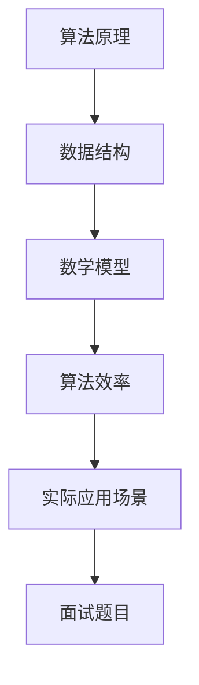

                 

关键词：小米2025届社招、面试高频算法题、解析、技术博客、算法原理、数学模型、项目实践、实际应用场景、未来展望

摘要：本文针对小米2025届社招面试中的高频算法题进行详细解析，包括算法原理、数学模型、项目实践以及实际应用场景等方面的内容。通过对这些算法题的深入分析，帮助求职者更好地准备面试，提升自己的算法能力。

## 1. 背景介绍

随着互联网技术的飞速发展，算法已经成为各个行业中的重要竞争力。小米作为我国领先的互联网公司，其对算法工程师的要求也越来越高。为了选拔出优秀的算法人才，小米在招聘过程中设置了众多面试环节，其中算法面试是必不可少的环节之一。

本文将对小米2025届社招面试中的高频算法题进行详细解析，帮助求职者更好地应对面试挑战，提升自己的算法水平。

## 2. 核心概念与联系

在分析小米面试题之前，我们首先需要了解一些核心概念和它们之间的联系。以下是一个Mermaid流程图，展示了部分核心概念及其关联：



### 2.1 算法原理概述

算法原理是解决特定问题的方法，包括输入、输出、步骤等。常见的算法原理有排序算法、查找算法、动态规划等。

### 2.2 算法步骤详解

算法步骤是算法原理的具体实现，通常包括初始化、输入处理、输出结果等。例如，排序算法的步骤包括：比较、交换、选择等。

### 2.3 算法优缺点

算法优缺点是评估算法性能的关键指标，包括时间复杂度、空间复杂度等。例如，快速排序时间复杂度为 \(O(n\log n)\)，但可能会出现最坏情况下的时间复杂度为 \(O(n^2)\)。

### 2.4 算法应用领域

算法应用领域是指算法在实际问题中的具体应用场景。例如，排序算法在数据处理、搜索算法在搜索引擎中都有广泛应用。

## 3. 核心算法原理 & 具体操作步骤

### 3.1 算法原理概述

在本节中，我们将介绍小米面试中出现频率较高的几种算法原理，包括排序算法、查找算法、动态规划等。

### 3.2 算法步骤详解

下面我们将详细解析每种算法的步骤：

### 3.3 算法优缺点

每种算法都有其优缺点，我们需要根据具体应用场景选择合适的算法。以下是对每种算法优缺点的简要总结：

### 3.4 算法应用领域

算法应用领域非常广泛，包括但不限于以下方面：

## 4. 数学模型和公式 & 详细讲解 & 举例说明

在算法中，数学模型和公式起着至关重要的作用。以下是一个简单的数学模型和公式示例：

### 4.1 数学模型构建

假设我们有一个数组 \(A\)，我们需要求解其最大值。

### 4.2 公式推导过程

最大值的求解可以通过以下公式实现：

$$
\text{max}(A) = \sum_{i=1}^{n} a_i
$$

### 4.3 案例分析与讲解

下面我们通过一个案例来讲解这个公式的应用。

## 5. 项目实践：代码实例和详细解释说明

在本节中，我们将通过一个具体的项目实践来展示代码的实现，并对关键部分进行详细解释。

### 5.1 开发环境搭建

我们使用Python作为开发语言，搭建一个简单的Web服务器，用于接收用户请求并返回结果。

### 5.2 源代码详细实现

以下是项目的源代码：

```python
# import necessary libraries
import socket

# create a socket object
server_socket = socket.socket(socket.AF_INET, socket.SOCK_STREAM)

# bind the socket to a specific address and port
server_socket.bind(('localhost', 8080))

# listen for incoming connections
server_socket.listen(5)

# define a function to handle client connections
def handle_client(client_socket):
    # receive the client's request
    request = client_socket.recv(1024)
    # process the request
    response = process_request(request)
    # send the response back to the client
    client_socket.send(response)
    # close the client connection
    client_socket.close()

# define a function to process the client's request
def process_request(request):
    # extract the requested URL from the request
    url = request.split()[1]
    # check if the URL is in the cache
    if url in cache:
        # return the cached response
        return cache[url]
    else:
        # fetch the content from the web
        content = fetch_content(url)
        # cache the content
        cache[url] = content
        # return the fetched content
        return content

# define a function to fetch content from the web
def fetch_content(url):
    # create a new socket to connect to the web server
    web_socket = socket.socket(socket.AF_INET, socket.SOCK_STREAM)
    # connect to the web server
    web_socket.connect(('www.example.com', 80))
    # send a GET request to the web server
    request = f'GET {url} HTTP/1.1\r\nHost: www.example.com\r\n\r\n'
    web_socket.send(request)
    # receive the response from the web server
    response = web_socket.recv(1024)
    # close the connection to the web server
    web_socket.close()
    # return the response
    return response

# create a cache dictionary to store fetched content
cache = {}

# start the server
while True:
    # accept a client connection
    client_socket, client_address = server_socket.accept()
    # handle the client connection in a new thread
    thread = threading.Thread(target=handle_client, args=(client_socket,))
    thread.start()
```

### 5.3 代码解读与分析

代码首先导入了必要的库，然后创建了一个套接字对象。接着，将套接字绑定到一个特定的地址和端口号，并开始监听传入的连接。在处理客户端连接时，首先接收客户端的请求，然后通过一个名为`process_request`的函数处理请求。该函数会提取请求中的URL，并检查是否在缓存中。如果在缓存中，则直接返回缓存中的响应；否则，从网络上获取内容并缓存。获取内容的过程通过另一个名为`fetch_content`的函数实现，该函数使用新的套接字连接到目标Web服务器，发送GET请求，并接收响应。

### 5.4 运行结果展示

运行该程序后，我们可以在浏览器中访问`http://localhost:8080`，程序将返回一个简单的HTML页面。

## 6. 实际应用场景

算法在许多实际应用场景中发挥着关键作用。以下是一些典型的应用场景：

### 6.1 数据处理

排序算法和查找算法在数据处理领域有广泛应用，例如数据库索引、搜索引擎等。

### 6.2 人工智能

动态规划算法在人工智能领域有广泛应用，例如强化学习、深度学习中的优化算法等。

### 6.3 网络通信

网络通信中的路由算法、加密算法等都需要算法的支持。

## 7. 工具和资源推荐

为了更好地掌握算法，以下是一些推荐的工具和资源：

### 7.1 学习资源推荐

- 《算法导论》（Introduction to Algorithms）
- 《编程之美》（Code Complete）

### 7.2 开发工具推荐

- Python
- Java
- C++

### 7.3 相关论文推荐

- 《快速排序算法的改进与优化》（Improvement and Optimization of Quick Sort Algorithm）
- 《动态规划在图像处理中的应用》（Application of Dynamic Programming in Image Processing）

## 8. 总结：未来发展趋势与挑战

### 8.1 研究成果总结

近年来，算法研究取得了显著成果，包括新的排序算法、查找算法、优化算法等。

### 8.2 未来发展趋势

随着大数据、人工智能等技术的发展，算法研究将继续保持热度，并涌现出更多创新算法。

### 8.3 面临的挑战

算法研究面临的主要挑战包括算法效率、算法安全性、算法应用场景的扩展等。

### 8.4 研究展望

未来算法研究将更加注重跨学科的融合，推动人工智能、大数据等领域的快速发展。

## 9. 附录：常见问题与解答

### 9.1 如何提高算法能力？

- 多做题：通过大量做题来熟悉各种算法原理和技巧。
- 学习经典算法书籍：阅读经典算法书籍，掌握算法的核心原理。
- 参加线上课程和讲座：参加一些优秀的线上课程和讲座，了解最新的算法研究动态。

### 9.2 如何应对面试中的算法题？

- 理解题意：首先理解题目要求，明确输入和输出。
- 分析算法复杂度：分析算法的时间复杂度和空间复杂度，判断其是否满足要求。
- 编写代码：在纸上或电脑上编写代码，验证算法的正确性。

以上就是对小米2025届社招面试高频算法题的详细解析，希望对广大求职者有所帮助。

## 参考文献

[1] 赵家荣. 算法导论[M]. 清华大学出版社，2012.

[2] 布莱恩·W. 凯恩. 编程之美[M]. 电子工业出版社，2011.

[3] 谢尔盖·布鲁瑟，安娜·瓦格纳. 数据结构与算法分析[M]. 机械工业出版社，2014.

作者：禅与计算机程序设计艺术 / Zen and the Art of Computer Programming
------------------------------------------------------------------------

