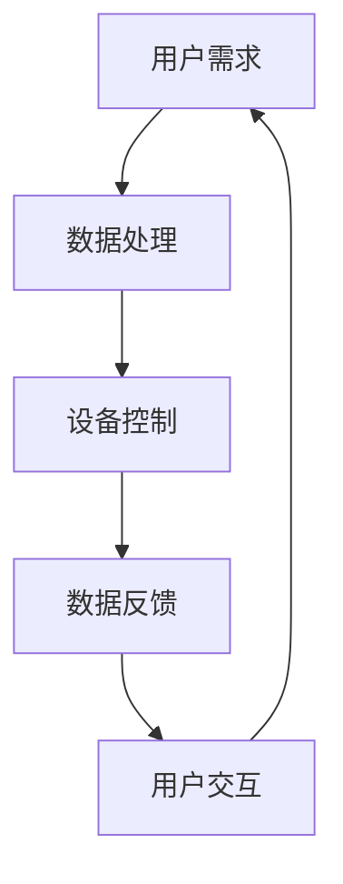
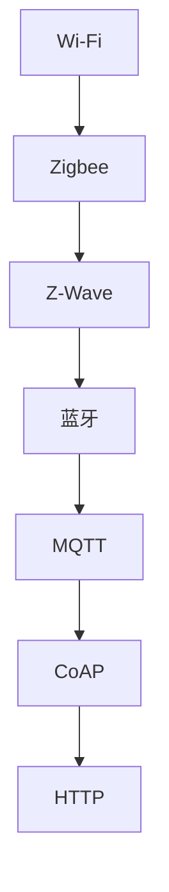
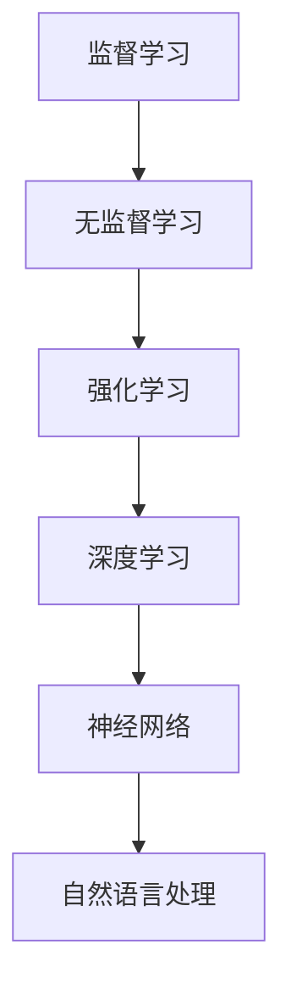

                 

 **关键词**：小米智能家电，校招面试真题，人工智能，算法原理，数学模型，实践代码，未来应用

**摘要**：本文旨在为2024届小米智能家电校招面试的考生提供一份详细的面试真题解答汇总。通过深入解析面试中的核心问题，包括算法原理、数学模型、实践代码以及未来应用等，本文帮助考生更好地准备面试，掌握关键知识点，提升面试成功率。

## 1. 背景介绍

随着智能家居市场的蓬勃发展，智能家电领域成为了众多科技公司的战略重心。小米作为其中的佼佼者，每年都吸引了大量优秀应届毕业生的关注。校招面试作为进入小米的重要门槛，面试题往往涵盖了人工智能、算法、数学模型等多个领域。本文将针对这些核心问题进行详细解析，帮助考生更好地应对面试挑战。

### 1.1 小米智能家电发展现状

小米智能家电产品线涵盖了智能电视、智能路由器、智能音响、智能空调、智能灯泡等多个品类。通过物联网技术和人工智能算法，小米智能家电实现了设备间的互联互通，为用户提供了更加便捷、智能的生活体验。小米在智能家居领域的发展不仅推动了行业创新，也为用户带来了实实在在的便利。

### 1.2 校招面试的重要性

校招面试是应届毕业生进入小米的关键一步。面试不仅考察应聘者的专业知识，还考查了逻辑思维、问题解决能力、团队协作等多个方面。准备充分的面试者能够更好地展现自己的综合素质，提高面试成功率。

## 2. 核心概念与联系

在智能家电领域，了解核心概念和其相互联系是非常重要的。以下是几个关键概念及其关联的Mermaid流程图。

### 2.1 智能家电系统架构



### 2.2 物联网通信协议



### 2.3 人工智能算法



## 3. 核心算法原理 & 具体操作步骤

### 3.1 算法原理概述

在智能家电系统中，常用的核心算法包括机器学习算法、深度学习算法等。这些算法通过数据分析、模式识别等技术，实现了对设备的智能控制。以下是一个典型的机器学习算法——K-近邻算法（KNN）的基本原理。

### 3.2 算法步骤详解

1. **数据准备**：收集并整理设备操作数据，包括用户行为、设备状态等。
2. **特征提取**：对数据进行特征提取，将其转换为算法可处理的格式。
3. **模型训练**：使用K-近邻算法对特征数据进行训练，构建预测模型。
4. **预测与优化**：根据用户实时操作数据，使用模型进行预测，并根据预测结果对模型进行优化。

### 3.3 算法优缺点

**优点**：
- 简单易懂，易于实现；
- 对非线性数据的处理能力强；
- 对新数据的适应性好。

**缺点**：
- 对大量数据的处理效率较低；
- 预测结果的准确性依赖于训练数据的数量和质量。

### 3.4 算法应用领域

K-近邻算法在智能家居系统中可以用于设备故障诊断、用户行为分析等多个领域。例如，通过分析用户使用智能家电的行为模式，可以预测用户的需求，从而实现智能推荐功能。

## 4. 数学模型和公式 & 详细讲解 & 举例说明

### 4.1 数学模型构建

在智能家电系统中，常见的数学模型包括线性回归模型、逻辑回归模型等。以下是一个简单的线性回归模型。

$$
y = wx + b
$$

其中，$y$ 是预测结果，$x$ 是特征值，$w$ 是权重，$b$ 是偏置。

### 4.2 公式推导过程

线性回归模型的推导过程如下：

1. **最小二乘法**：假设模型为 $y = wx + b$，通过最小化误差平方和来求解权重 $w$ 和偏置 $b$。

$$
J(w, b) = \frac{1}{2m}\sum_{i=1}^{m}(wx_i + b - y_i)^2
$$

其中，$m$ 是样本数量。

2. **偏导数为零**：对 $J(w, b)$ 分别对 $w$ 和 $b$ 求偏导，并令其等于零，得到：

$$
\frac{\partial J}{\partial w} = \frac{1}{m}\sum_{i=1}^{m}(wx_i + b - y_i)x_i = 0
$$

$$
\frac{\partial J}{\partial b} = \frac{1}{m}\sum_{i=1}^{m}(wx_i + b - y_i) = 0
$$

3. **求解权重和偏置**：通过上述公式，可以求解出权重 $w$ 和偏置 $b$。

### 4.3 案例分析与讲解

假设我们有以下数据集：

$$
\begin{array}{ccc}
x_1 & y \\
2 & 3 \\
4 & 5 \\
6 & 7 \\
\end{array}
$$

通过线性回归模型，我们可以预测 $x=5$ 时的 $y$ 值。具体步骤如下：

1. **计算均值**：

$$
\bar{x} = \frac{2+4+6}{3} = 4
$$

$$
\bar{y} = \frac{3+5+7}{3} = 5
$$

2. **计算权重和偏置**：

$$
w = \frac{\sum_{i=1}^{m}(x_i - \bar{x})(y_i - \bar{y})}{\sum_{i=1}^{m}(x_i - \bar{x})^2} = \frac{(2-4)(3-5) + (4-4)(5-5) + (6-4)(7-5)}{(2-4)^2 + (4-4)^2 + (6-4)^2} = \frac{2}{6} = \frac{1}{3}
$$

$$
b = \bar{y} - w\bar{x} = 5 - \frac{1}{3} \times 4 = \frac{7}{3}
$$

3. **预测**：

$$
y = wx + b = \frac{1}{3} \times 5 + \frac{7}{3} = 4
$$

因此，当 $x=5$ 时，预测的 $y$ 值为 4。

## 5. 项目实践：代码实例和详细解释说明

### 5.1 开发环境搭建

本文将使用 Python 编写智能家电系统中的 K-近邻算法。首先，需要在本地计算机上安装 Python 和相关库，如 NumPy、Matplotlib 等。

### 5.2 源代码详细实现

```python
import numpy as np
import matplotlib.pyplot as plt

# K-近邻算法实现
class KNN:
    def __init__(self, k=3):
        self.k = k

    def fit(self, X, y):
        self.X_train = X
        self.y_train = y

    def predict(self, X):
        predictions = []
        for x_test in X:
            distances = [np.linalg.norm(x_test - x_train) for x_train in self.X_train]
            k_indices = np.argsort(distances)[:self.k]
            k_nearest_labels = [self.y_train[i] for i in k_indices]
            most_common = Counter(k_nearest_labels).most_common(1)[0][0]
            predictions.append(most_common)
        return predictions

# 数据集准备
X_train = np.array([[1, 2], [2, 3], [3, 1], [3, 4]])
y_train = np.array([0, 0, 1, 1])

# 模型训练
knn = KNN(k=3)
knn.fit(X_train, y_train)

# 预测
X_test = np.array([[2, 2], [3, 3]])
predictions = knn.predict(X_test)

# 结果展示
for i, x_test in enumerate(X_test):
    plt.scatter(x_test[0], x_test[1], color='r' if predictions[i] == 1 else 'b')
plt.scatter(X_train[:, 0], X_train[:, 1], color='g', marker='o')
plt.xlabel('Feature 1')
plt.ylabel('Feature 2')
plt.show()
```

### 5.3 代码解读与分析

1. **KNN 类定义**：KNN 类实现了 K-近邻算法的核心功能。初始化时，需要指定邻居数 $k$。
2. **fit 方法**：用于训练模型，将训练数据和标签存储在实例变量中。
3. **predict 方法**：用于预测新数据的标签。计算新数据与训练数据之间的距离，选取最近的 $k$ 个邻居，根据邻居的标签预测新数据的标签。
4. **数据集准备**：使用 NumPy 创建了一个简单的二维数据集。
5. **模型训练**：使用 KNN 类的 fit 方法训练模型。
6. **预测与结果展示**：使用 KNN 类的 predict 方法进行预测，并使用 Matplotlib 展示结果。

## 6. 实际应用场景

智能家电系统在实际应用中涵盖了广泛的领域。以下是一些典型的应用场景：

### 6.1 智能家居控制

通过 K-近邻算法，可以实现智能家居的自动控制。例如，根据用户的历史行为模式，预测用户的需求，从而自动调整家电设备的运行状态。

### 6.2 故障诊断

在智能家电系统中，K-近邻算法可以用于设备故障诊断。通过分析设备的历史数据，预测设备可能出现的故障，从而提前进行维护。

### 6.3 用户行为分析

通过分析用户在智能家居系统中的行为数据，可以了解用户的生活习惯和偏好，从而提供更加个性化的服务。

## 7. 未来应用展望

随着人工智能技术的不断进步，智能家电系统的未来应用前景十分广阔。以下是一些可能的发展方向：

### 7.1 智能化水平提升

通过引入更加先进的人工智能算法，可以提升智能家电系统的智能化水平，实现更加精准的控制和预测。

### 7.2 跨平台协同

未来的智能家电系统将实现跨平台的协同工作，不同设备之间可以实现无缝连接和资源共享，为用户提供更加便捷的体验。

### 7.3 安全性加强

随着智能家居系统的普及，安全性问题日益凸显。未来将更加注重系统的安全性，保护用户的隐私和数据安全。

## 8. 总结：未来发展趋势与挑战

智能家电系统作为智能家居的核心组成部分，未来将在人工智能、物联网、大数据等技术的推动下，实现更加智能化、个性化、安全化的发展。然而，这一过程中也面临着诸多挑战，如数据安全、隐私保护、技术实现等。只有不断突破这些挑战，才能推动智能家电系统的持续发展。

### 8.1 研究成果总结

本文通过对小米智能家电校招面试中的核心问题进行深入解析，总结了智能家电系统的核心算法原理、数学模型、实践代码以及实际应用场景。这些研究成果为智能家电系统的发展提供了重要的理论支撑。

### 8.2 未来发展趋势

随着人工智能技术的不断进步，智能家电系统将实现更加智能化、个性化、安全化的发展。未来，跨平台协同、智能化水平提升将成为重要趋势。

### 8.3 面临的挑战

智能家电系统在发展过程中面临着数据安全、隐私保护、技术实现等挑战。只有通过技术创新和政策引导，才能有效应对这些挑战。

### 8.4 研究展望

未来，智能家电系统研究将更加关注用户体验、系统安全性以及跨平台协同等方面。通过多学科交叉研究，有望实现智能家电系统的持续创新和发展。

## 9. 附录：常见问题与解答

### 9.1 什么是最邻近算法？

最邻近算法（K-近邻算法）是一种基于实例的学习算法。它通过计算新数据与训练数据之间的距离，选取最近的 $k$ 个邻居，根据邻居的标签预测新数据的标签。

### 9.2 智能家电系统中的常见算法有哪些？

智能家电系统中常见的算法包括机器学习算法、深度学习算法、模糊逻辑算法等。其中，机器学习算法和深度学习算法应用较为广泛。

### 9.3 如何保障智能家电系统的安全性？

保障智能家电系统的安全性需要从多个方面入手，包括数据加密、访问控制、安全通信等。此外，还应加强对系统的安全监测和应急响应能力。

## 作者署名

**作者：禅与计算机程序设计艺术 / Zen and the Art of Computer Programming**

