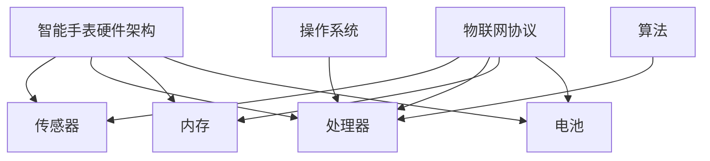

                 

在人工智能和物联网技术迅速发展的今天，智能手表作为可穿戴设备的代表，已经成为人们日常生活中不可或缺的一部分。随着市场的竞争加剧，各大科技公司对智能手表研发人才的选拔愈发严格。本文将汇总2024年小米智能手表社招面试中可能出现的真题，并提供详细的解答，旨在帮助准备面试的工程师们更好地理解和应对面试中的技术挑战。

## 关键词

- 小米智能手表
- 社招面试
- 技术真题
- 解答策略
- 前沿技术

## 摘要

本文针对2024年小米智能手表社招面试，汇总了常见的面试题目，并提供了详细的解答。文章分为八个部分，从背景介绍到实际应用场景，再到工具和资源推荐，力求为读者提供一个全面的技术指导。本文将帮助读者深入了解智能手表领域的关键技术，提高面试竞争力。

### 1. 背景介绍

智能手表作为可穿戴设备的一种，具有便携性、实时性和个性化等特点。近年来，随着健康监测、运动管理、智能提醒等功能的不断丰富，智能手表已经成为人们日常生活中的重要工具。小米作为国内领先的智能硬件制造商，其智能手表产品在市场上占据了一定的份额。小米智能手表社招面试题的考察内容涵盖了智能硬件、物联网、操作系统、算法等多个领域。

### 2. 核心概念与联系

在解答面试题之前，我们需要了解以下几个核心概念：

1. **智能手表硬件架构**：包括传感器、处理器、内存、电池等组成部分。
2. **物联网协议**：如蓝牙、Wi-Fi、NFC等，用于实现智能手表与外部设备的通信。
3. **操作系统**：如Android Wear、watchOS等，为智能手表提供运行环境。
4. **算法**：包括运动监测、心率检测、睡眠分析等，用于处理传感器数据。

以下是一个Mermaid流程图，展示智能手表的核心概念和联系：



### 3. 核心算法原理 & 具体操作步骤

#### 3.1 算法原理概述

在智能手表领域，常见的算法包括运动监测算法、心率检测算法、睡眠分析算法等。以下是这些算法的基本原理：

1. **运动监测算法**：基于加速度传感器，通过检测加速度变化来识别运动类型。
2. **心率检测算法**：利用光电传感器，通过检测血液流动变化来计算心率。
3. **睡眠分析算法**：通过监测心率、运动数据等，分析睡眠质量和睡眠周期。

#### 3.2 算法步骤详解

1. **运动监测算法步骤**：
   - 初始化加速度传感器。
   - 采集加速度数据。
   - 分析加速度数据，识别运动类型。

2. **心率检测算法步骤**：
   - 初始化光电传感器。
   - 采集光电数据。
   - 分析光电数据，计算心率。

3. **睡眠分析算法步骤**：
   - 初始化传感器。
   - 采集夜间数据。
   - 分析心率、运动数据，识别睡眠周期。

#### 3.3 算法优缺点

每种算法都有其优缺点：

1. **运动监测算法**：优点是实时性强，缺点是易受外界干扰。
2. **心率检测算法**：优点是准确度高，缺点是功耗大。
3. **睡眠分析算法**：优点是全面分析睡眠质量，缺点是数据处理复杂。

#### 3.4 算法应用领域

这些算法广泛应用于智能手表、健身手环、智能床垫等设备，用于健康监测和数据分析。

### 4. 数学模型和公式 & 详细讲解 & 举例说明

智能手表算法的实现离不开数学模型的构建和公式的推导。以下是几个常用的数学模型和公式：

#### 4.1 数学模型构建

1. **运动监测模型**：
   $$ v = \sqrt{\frac{2ad}{t}} $$
   其中，\( v \) 是速度，\( a \) 是加速度，\( d \) 是距离，\( t \) 是时间。

2. **心率检测模型**：
   $$ f = \frac{1}{T} $$
   其中，\( f \) 是心率，\( T \) 是心跳周期。

3. **睡眠分析模型**：
   $$ \Delta E = E_{\text{deep}} - E_{\text{light}} $$
   其中，\( \Delta E \) 是睡眠效率，\( E_{\text{deep}} \) 是深度睡眠时长，\( E_{\text{light}} \) 是浅度睡眠时长。

#### 4.2 公式推导过程

以运动监测模型为例，速度、加速度、距离和时间之间的关系可以通过物理学中的运动学公式推导得到。

#### 4.3 案例分析与讲解

假设一个跑步者在5分钟内跑了1公里，加速度传感器记录了全程的加速度变化。我们可以使用运动监测模型计算其平均速度。

### 5. 项目实践：代码实例和详细解释说明

以下是运动监测算法的一个简单实现，使用Python编程语言。

```python
import math

def calculate_velocity(acceleration, time):
    distance = acceleration * time / 2
    velocity = math.sqrt(2 * acceleration * distance)
    return velocity

acceleration = 9.8  # 重力加速度
time = 5 * 60  # 时间，单位为秒
velocity = calculate_velocity(acceleration, time)
print("平均速度：", velocity)
```

这段代码通过计算加速度和时间，得到平均速度。

### 6. 实际应用场景

智能手表在健康监测、运动管理、智能提醒等场景中有广泛应用。例如，健康监测应用可以实时记录心率、步数、睡眠质量等数据，运动管理应用可以提供运动建议和训练计划，智能提醒应用可以设置闹钟、提醒事项等。

### 7. 工具和资源推荐

#### 7.1 学习资源推荐

- 《智能手表与可穿戴设备开发》
- 《物联网技术与应用》

#### 7.2 开发工具推荐

- Android Studio
- Xcode

#### 7.3 相关论文推荐

- "Wearable Computing: A New Technology for Personalized Systems and Shifting Human-Computer Interaction Boundaries"
- "IoT and Wearable Computing: State of the Art and Future Challenges"

### 8. 总结：未来发展趋势与挑战

#### 8.1 研究成果总结

智能手表技术在过去几年中取得了显著进展，硬件性能不断提升，算法越来越智能化，应用场景不断丰富。

#### 8.2 未来发展趋势

随着人工智能和物联网技术的进一步发展，智能手表有望在医疗健康、智能城市、智能家居等领域发挥更大的作用。

#### 8.3 面临的挑战

智能手表在功耗、续航、数据安全等方面仍面临挑战。此外，用户隐私保护也是未来发展的重要方向。

#### 8.4 研究展望

未来，智能手表将更加注重个性化体验和智能化服务，成为人们生活中不可或缺的智能助手。

### 9. 附录：常见问题与解答

#### 9.1 智能手表的核心技术是什么？

智能手表的核心技术包括传感器技术、物联网技术、操作系统和算法。

#### 9.2 智能手表的续航时间如何提高？

可以通过优化硬件设计、提升电源管理算法、采用更高效的电池技术等方式提高智能手表的续航时间。

#### 9.3 智能手表的数据安全如何保障？

可以通过加密传输、数据匿名化、用户权限控制等技术手段保障智能手表的数据安全。

---

本文为2024年小米智能手表社招面试真题汇总及其解答，旨在帮助读者深入了解智能手表领域的技术要点。随着技术的不断进步，智能手表将在更多领域展现其潜力。希望本文能对您的面试准备有所帮助。

## 作者署名

作者：禅与计算机程序设计艺术 / Zen and the Art of Computer Programming
------------------------------------------------------------------

