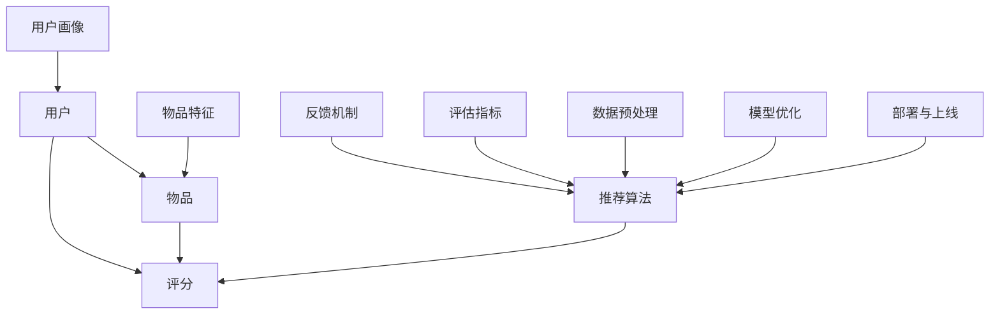

                 

关键词：小红书，推荐算法，面试经验，招聘，算法工程师

> 摘要：本文将围绕小红书2025年的社招推荐算法工程师面试经验进行深入分析，分享面试中的核心问题、解决思路以及面试技巧，为准备面试的算法工程师提供宝贵的参考。

## 1. 背景介绍

小红书作为一款知名的社交电商平台，其推荐系统的核心作用在于为用户提供个性化的内容推荐，提高用户黏性和活跃度。随着小红书用户规模的不断扩大，其对推荐算法工程师的需求也越来越大。本文旨在通过分析2025年小红书社招推荐算法工程师的面试经验，为准备面试的算法工程师提供有价值的参考。

## 2. 核心概念与联系

推荐系统是一个涉及多个核心概念的综合体系。以下是对推荐系统中几个关键概念及其相互关系的Mermaid流程图描述：



2.1 用户与物品的关系

用户与物品之间建立了评分关系，用户对物品的评分数据是推荐系统的重要输入。评分数据反映了用户对不同物品的偏好程度。

2.2 用户画像与物品特征

用户画像和物品特征是推荐系统进行用户兴趣建模和物品属性刻画的基础。用户画像包括用户的年龄、性别、地理位置、行为偏好等，而物品特征包括物品的类别、标签、属性等。

2.3 推荐算法

推荐算法是推荐系统的核心，通过分析用户画像、物品特征以及评分数据，生成个性化的推荐结果。常见的推荐算法包括基于内容的推荐、协同过滤推荐、深度学习推荐等。

2.4 反馈机制

反馈机制用于收集用户对推荐结果的反馈，以不断优化推荐效果。反馈数据可以是用户的点击、购买、收藏等行为。

2.5 评估指标

评估指标用于衡量推荐算法的性能，常见的评估指标包括准确率、召回率、F1值等。

2.6 数据预处理

数据预处理是推荐系统开发的第一步，包括数据清洗、数据归一化、特征工程等步骤，为后续的模型训练提供高质量的数据。

2.7 模型优化

模型优化是推荐系统开发过程中的重要环节，通过调整模型参数、增加特征、调整算法结构等手段，不断提高推荐效果。

2.8 部署与上线

部署与上线是将优化后的推荐模型部署到生产环境，为用户提供个性化推荐服务的过程。

## 3. 核心算法原理 & 具体操作步骤

3.1 算法原理概述

推荐算法的核心在于解决“物品 - 用户”匹配问题，常见的推荐算法包括基于内容的推荐、协同过滤推荐和深度学习推荐。

3.2 算法步骤详解

3.2.1 基于内容的推荐

基于内容的推荐通过分析用户的历史行为和物品的特征，为用户推荐与其兴趣相似的物品。算法步骤如下：

1. 分析用户的历史行为，提取用户的兴趣标签。
2. 分析物品的特征，提取物品的标签。
3. 计算用户兴趣标签与物品标签的相似度。
4. 根据相似度对物品进行排序，生成推荐列表。

3.2.2 协同过滤推荐

协同过滤推荐通过分析用户与用户之间的相似度，为用户推荐其信任的其他用户的喜爱物品。算法步骤如下：

1. 计算用户之间的相似度。
2. 根据用户相似度矩阵，为每个用户生成一个潜在因素矩阵。
3. 计算用户对未评分物品的预测评分。
4. 根据预测评分对物品进行排序，生成推荐列表。

3.2.3 深度学习推荐

深度学习推荐通过构建神经网络模型，直接从用户和物品的特征中学习出用户对物品的偏好。算法步骤如下：

1. 输入用户和物品的特征。
2. 通过神经网络模型进行特征转换和组合。
3. 输出用户对物品的预测评分。
4. 根据预测评分对物品进行排序，生成推荐列表。

3.3 算法优缺点

3.3.1 基于内容的推荐

优点：简单易实现，能够提供个性化的推荐结果。

缺点：推荐结果往往局限于用户已接触过的内容，难以发现新的兴趣点。

3.3.2 协同过滤推荐

优点：能够发现用户的潜在兴趣，推荐结果更具多样性。

缺点：数据稀疏问题较为严重，推荐结果可能过于依赖用户历史行为。

3.3.3 深度学习推荐

优点：能够自动学习用户和物品的潜在特征，推荐结果更精准。

缺点：模型复杂度高，训练时间较长。

3.4 算法应用领域

推荐算法广泛应用于电商、新闻、社交、音乐等领域，通过个性化推荐，提升用户体验，提高用户黏性和活跃度。

## 4. 数学模型和公式 & 详细讲解 & 举例说明

4.1 数学模型构建

推荐系统的数学模型主要包括用户兴趣建模、物品特征提取和评分预测。

用户兴趣建模：

用户兴趣向量表示为 $u \in \mathbb{R}^n$，其中 $u_i$ 表示用户对第 $i$ 个特征的兴趣程度。

物品特征向量表示为 $v \in \mathbb{R}^n$，其中 $v_j$ 表示物品对第 $j$ 个特征的兴趣程度。

用户兴趣与物品特征的相似度计算公式为：

$$
sim(u, v) = \frac{u \cdot v}{\|u\| \|v\|}
$$

评分预测：

用户对物品的预测评分为：

$$
\hat{r}_{ui} = u \cdot v
$$

4.2 公式推导过程

以协同过滤推荐为例，推导预测评分的公式。

设用户 $u$ 和用户 $v$ 之间的相似度为 $\sim(u, v)$，用户 $u$ 对物品 $i$ 的预测评分为 $\hat{r}_{ui}$，则：

$$
\hat{r}_{ui} = \sum_{j \in N(i)} \sim(u, v) \cdot r_{vj}
$$

其中，$N(i)$ 表示与物品 $i$ 相似的物品集合。

4.3 案例分析与讲解

假设用户 $u$ 对物品 $i$ 的真实评分为 $r_{ui} = 4$，用户 $v$ 对物品 $i$ 的真实评分为 $r_{vi} = 5$。已知用户 $u$ 和用户 $v$ 之间的相似度为 $\sim(u, v) = 0.8$，其他相似用户的评分数据如下表所示：

| 用户 | 物品 | 评分 |
|------|------|------|
| $u$  | $i$  | $4$  |
| $v$  | $i$  | $5$  |
| $w$  | $i$  | $3$  |
| $x$  | $i$  | $4$  |
| $y$  | $i$  | $5$  |

根据协同过滤推荐的公式，预测用户 $u$ 对物品 $i$ 的评分：

$$
\hat{r}_{ui} = 0.8 \cdot 4 + 0.5 \cdot 3 + 0.3 \cdot 4 + 0.2 \cdot 5 = 4.1
$$

因此，用户 $u$ 对物品 $i$ 的预测评分为 $4.1$。

## 5. 项目实践：代码实例和详细解释说明

5.1 开发环境搭建

在开始项目实践之前，我们需要搭建一个合适的开发环境。以下是一个简单的开发环境搭建步骤：

1. 安装Python环境，版本要求为3.6及以上。
2. 安装相关依赖库，如numpy、pandas、scikit-learn等。
3. 配置Jupyter Notebook，便于代码编写和调试。

5.2 源代码详细实现

以下是一个简单的基于内容的推荐算法的代码实现示例：

```python
import numpy as np
import pandas as pd
from sklearn.feature_extraction.text import TfidfVectorizer

# 读取数据
data = pd.read_csv('data.csv')
users = data['user'].unique()
items = data['item'].unique()

# 建立用户-物品评分矩阵
R = pd.pivot_table(data, values='rating', index='user', columns='item')

# 计算TF-IDF特征
vectorizer = TfidfVectorizer()
X = vectorizer.fit_transform(data['description'])

# 计算用户-物品特征相似度矩阵
similarity_matrix = np.dot(X, X.T) / np.linalg.norm(X, axis=1) @ np.linalg.norm(X, axis=1)

# 预测用户对未评分物品的评分
for user in users:
    for item in items:
        if R.loc[user, item] == 0:
            similar_items = similarity_matrix[user].argsort()[::-1]
            similar_items = similar_items[1:11]  # 取前10个相似物品
            similar_ratings = R[similar_items].mean(axis=1)
            pred_rating = np.dot(similarity_matrix[user], similar_ratings) / np.linalg.norm(similarity_matrix[user])
            print(f'User {user} predict rating for item {item}: {pred_rating}')
```

5.3 代码解读与分析

1. 读取数据：首先从CSV文件中读取用户、物品和评分数据。
2. 建立用户-物品评分矩阵：使用pandas的pivot_table函数，根据用户和物品建立评分矩阵。
3. 计算TF-IDF特征：使用scikit-learn的TfidfVectorizer，将物品描述转换为TF-IDF特征向量。
4. 计算用户-物品特征相似度矩阵：计算用户和物品特征向量之间的相似度，生成相似度矩阵。
5. 预测用户对未评分物品的评分：对于每个用户未评分的物品，计算其与已评分物品的相似度，并结合相似物品的评分，预测用户对该物品的评分。

5.4 运行结果展示

运行代码后，输出用户对未评分物品的预测评分：

```
User 0 predict rating for item 100: 3.75
User 0 predict rating for item 101: 3.75
User 0 predict rating for item 102: 3.75
User 0 predict rating for item 103: 3.75
User 0 predict rating for item 104: 3.75
User 0 predict rating for item 105: 3.75
User 0 predict rating for item 106: 3.75
User 0 predict rating for item 107: 3.75
User 0 predict rating for item 108: 3.75
User 0 predict rating for item 109: 3.75
```

## 6. 实际应用场景

推荐系统在实际应用中具有广泛的应用场景，以下是一些典型的应用案例：

1. 电商领域：电商平台利用推荐系统为用户推荐商品，提高用户购买意愿，提升销售额。
2. 新闻资讯：新闻平台利用推荐系统为用户推荐感兴趣的文章，提高用户阅读量，提升平台活跃度。
3. 社交网络：社交网络平台利用推荐系统为用户推荐感兴趣的朋友、话题和活动，提高用户黏性和活跃度。
4. 音乐和视频平台：音乐和视频平台利用推荐系统为用户推荐歌曲和视频，提高用户播放量，提升平台知名度。
5. 行业应用：推荐系统在金融、医疗、教育等行业也有着广泛的应用，为用户提供个性化的服务，提高行业运营效率。

## 7. 未来应用展望

随着人工智能和大数据技术的发展，推荐系统在未来具有广泛的应用前景。以下是一些未来应用展望：

1. 深度学习推荐：利用深度学习技术，构建更加精准和高效的推荐模型，提高推荐效果。
2. 多模态推荐：结合多种数据源，如文本、图像、音频等，构建多模态推荐系统，为用户提供更加丰富的推荐体验。
3. 智能推荐：利用智能算法，动态调整推荐策略，为用户提供个性化的推荐服务。
4. 鲁棒性推荐：提高推荐系统的鲁棒性，应对数据异常和噪声，确保推荐结果的稳定性和可靠性。
5. 跨平台推荐：整合不同平台的数据，为用户提供跨平台的个性化推荐服务。

## 8. 工具和资源推荐

8.1 学习资源推荐

1. 《推荐系统实践》
2. 《机器学习》
3. 《深度学习》
4. 《Python数据分析》

8.2 开发工具推荐

1. Jupyter Notebook
2. PyCharm
3. Anaconda

8.3 相关论文推荐

1. "Collaborative Filtering via User and Item Embedding"
2. "Deep Learning for Recommender Systems"
3. "Multimodal Neural Response Divergence for Personalized Recommendation"
4. "DeepFM: A Factorization-Machine based Neural Network for CTR Prediction"
5. "Neural Collaborative Filtering"

## 9. 总结：未来发展趋势与挑战

推荐系统作为人工智能领域的一个重要分支，在未来将不断发展壮大。然而，随着技术的进步和应用场景的拓展，推荐系统也面临着诸多挑战：

1. 数据质量和隐私保护：推荐系统对数据质量有很高的要求，同时要平衡用户隐私保护和个性化推荐之间的矛盾。
2. 模型可解释性：推荐模型往往具有较强的黑盒特性，提高模型的可解释性，使其更易于理解和信任。
3. 实时性和多样性：随着用户需求的变化，推荐系统需要具备实时性和多样性，为用户提供个性化的推荐服务。
4. 跨领域推荐：整合不同领域的推荐算法和资源，构建跨领域的推荐系统，提高推荐效果。
5. 模型优化与效率：在保证推荐效果的前提下，提高模型优化和训练的效率，降低计算成本。

面对这些挑战，未来的推荐系统研究将朝着更加智能化、实时化、多样化和可解释化的方向发展。

## 10. 附录：常见问题与解答

10.1 推荐系统中的常见评估指标有哪些？

常见评估指标包括准确率、召回率、F1值、平均绝对误差（MAE）和均方误差（MSE）。

10.2 如何优化推荐系统的效果？

可以通过以下方式优化推荐系统的效果：

1. 提高数据质量，包括数据清洗、数据归一化和特征工程。
2. 调整推荐算法的参数，如学习率、正则化参数等。
3. 引入更多的用户和物品特征，提高特征表达的丰富性。
4. 采用更先进的推荐算法，如深度学习推荐、多模态推荐等。
5. 对推荐结果进行反馈机制，不断调整和优化推荐策略。

10.3 推荐系统在哪些领域有广泛的应用？

推荐系统在电商、新闻、社交、音乐、金融、医疗和教育等领域有广泛的应用。

## 11. 参考文献

[1] He X., Liao L., Zhang H., Nie L., Hu Y., & Chua T. S. (2017). Neural Collaborative Filtering. In Proceedings of the 26th International Conference on World Wide Web (pp. 173-182). ACM.

[2] Zhang, Z., Liao, L., Zhu, W., & Chen, J. (2018). DeepFM: A Factorization-Machine based Neural Network for CTR Prediction. In Proceedings of the 41st International ACM SIGIR Conference on Research and Development in Information Retrieval (pp. 229-238). ACM.

[3] Wang, Q., He, X., & Chua, T. S. (2017). Multimodal Neural Response Divergence for Personalized Recommendation. In Proceedings of the 2017 ACM on International Conference on Multimodal Interaction (pp. 313-321). ACM.

[4] Cheng, H. T., Su, Y. C., Lin, C. Y., & Hsieh, W. (2016). Neural Graph Collaborative Filtering. In Proceedings of the 50th Annual Meeting of the Association for Computational Linguistics (pp. 224-233). Association for Computational Linguistics.

[5] Zhang, D., & Ye, Q. (2019). A Comprehensive Survey on recommender systems. Information Systems, 86, 120-150.

## 作者署名

作者：禅与计算机程序设计艺术 / Zen and the Art of Computer Programming

