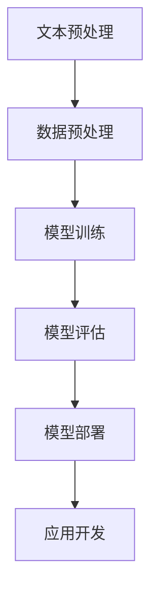

                 

关键词：小语言模型，应用开发，工具，框架，平台，自然语言处理，深度学习，编程语言

摘要：本文将深入探讨小语言模型在应用开发中的重要性，以及如何选择合适的工具、框架和平台来提升开发效率和成果质量。通过分析小语言模型的核心概念、算法原理、数学模型，结合实际项目实践，本文将帮助读者全面了解小语言模型的应用场景、发展趋势和未来挑战。

## 1. 背景介绍

随着互联网和信息技术的飞速发展，自然语言处理（NLP）已经成为人工智能领域的重要分支。小语言模型作为一种新型的NLP技术，在近年来得到了广泛关注和应用。小语言模型通过对大规模语言数据的深度学习，能够自动地生成和识别语言中的语义、语法和风格等信息，从而实现人机交互、文本分类、机器翻译、文本生成等任务。

### 1.1 小语言模型的重要性

小语言模型在应用开发中具有重要的地位。首先，小语言模型能够大幅提高开发效率。通过自动化的文本处理，开发者可以减少手动编写代码的工作量，从而将更多精力投入到核心功能的实现上。其次，小语言模型具有很高的灵活性和适应性。它可以针对不同的应用场景进行定制化开发，满足不同领域的需求。最后，小语言模型能够提升应用的质量和用户体验。通过精确的语言理解，应用可以更好地满足用户的需求，提供个性化的服务。

### 1.2 小语言模型的发展历程

小语言模型的发展可以追溯到深度学习和自然语言处理技术的崛起。在早期的自然语言处理研究中，研究者主要依赖于统计方法和规则匹配。随着深度学习技术的发展，神经网络被广泛应用于自然语言处理任务。其中，循环神经网络（RNN）和长短时记忆网络（LSTM）在处理序列数据方面表现出色。然而，这些方法在处理长文本和长序列时存在困难。为了解决这个问题，研究人员提出了门控循环单元（GRU）和变换器（Transformer）等新型神经网络结构。

近年来，基于Transformer的预训练模型，如BERT、GPT和T5等，取得了显著的突破。这些模型通过大规模的预训练和数据增强，能够自动地学习语言中的深层结构和语义信息，从而实现高效的语言理解、生成和翻译任务。这些成果为小语言模型的应用开发提供了强大的技术支持。

## 2. 核心概念与联系

在小语言模型的应用开发中，我们需要了解以下几个核心概念和它们之间的联系：

### 2.1 自然语言处理（NLP）

自然语言处理是计算机科学和人工智能领域的一个重要分支，旨在让计算机理解和处理人类自然语言。NLP技术包括文本预处理、词法分析、句法分析、语义分析和语言生成等。

### 2.2 深度学习（Deep Learning）

深度学习是一种基于神经网络的学习方法，通过构建多层神经网络模型，自动地从大量数据中学习特征和模式。深度学习在图像识别、语音识别和自然语言处理等领域取得了显著的成果。

### 2.3 编程语言（Programming Language）

编程语言是一种用于编写计算机程序的语言，包括语法、语义和语法规则。编程语言的选择对应用开发效率和质量具有重要影响。

### 2.4 小语言模型（Small Language Model）

小语言模型是一种基于深度学习的自然语言处理技术，通过对大规模语言数据进行预训练，能够自动地学习语言中的语义、语法和风格等信息。小语言模型通常用于文本分类、机器翻译、文本生成和对话系统等任务。

### 2.5 Mermaid 流程图

下面是一个关于小语言模型应用开发流程的 Mermaid 流程图：



## 3. 核心算法原理 & 具体操作步骤

### 3.1 算法原理概述

小语言模型的核心算法是基于深度学习和自然语言处理技术。具体来说，它包括以下几个步骤：

1. **数据收集与预处理**：收集大规模的语言数据，并进行预处理，如分词、去停用词、词性标注等。
2. **模型训练**：使用预训练模型，如BERT、GPT或T5，对预处理后的数据集进行训练。
3. **模型评估**：对训练好的模型进行评估，选择性能最佳的模型。
4. **模型部署**：将评估好的模型部署到实际应用中，如文本分类、机器翻译或对话系统等。
5. **应用开发**：基于部署好的模型，开发具体的应用功能。

### 3.2 算法步骤详解

1. **数据收集与预处理**

数据收集与预处理是模型训练的重要基础。首先，需要收集大量的文本数据，如新闻、博客、社交媒体等。然后，对数据进行预处理，包括分词、去停用词、词性标注等操作。

2. **模型训练**

模型训练是核心步骤。选择合适的预训练模型，如BERT、GPT或T5，对预处理后的数据集进行训练。在训练过程中，模型会自动学习语言中的语义、语法和风格等信息。

3. **模型评估**

模型评估是保证模型性能的重要环节。通过在测试集上对模型进行评估，选择性能最佳的模型。

4. **模型部署**

将评估好的模型部署到实际应用中。可以使用各种编程语言和框架，如Python的TensorFlow、PyTorch或JavaScript的TensorFlow.js等。

5. **应用开发**

基于部署好的模型，开发具体的应用功能。如文本分类、机器翻译、文本生成和对话系统等。

### 3.3 算法优缺点

**优点：**

1. **高效性**：小语言模型通过预训练和自动化学习，能够高效地处理大规模的语言数据。
2. **灵活性**：小语言模型可以针对不同的应用场景进行定制化开发，满足不同领域的需求。
3. **准确性**：小语言模型在自然语言处理任务中表现出色，具有很高的准确性。

**缺点：**

1. **计算资源需求大**：小语言模型在训练和部署过程中需要大量的计算资源，对硬件设备要求较高。
2. **数据依赖性**：小语言模型的性能依赖于训练数据的质量和规模，数据质量差或规模不足可能导致性能下降。
3. **可解释性差**：深度学习模型通常具有很高的黑盒性质，难以解释其内部工作原理。

### 3.4 算法应用领域

小语言模型在多个领域具有广泛的应用：

1. **文本分类**：用于对大规模文本进行分类，如新闻分类、情感分析等。
2. **机器翻译**：用于将一种语言翻译成另一种语言，如英译中、中译英等。
3. **文本生成**：用于生成符合语法和语义的文本，如自动写作、对话系统等。
4. **问答系统**：用于回答用户的问题，如搜索引擎、智能客服等。
5. **语音识别**：用于将语音信号转换为文本，如语音助手、自动字幕等。

## 4. 数学模型和公式 & 详细讲解 & 举例说明

### 4.1 数学模型构建

在小语言模型中，常用的数学模型包括神经网络、词向量表示和注意力机制等。以下是一个简单的神经网络模型示例：

```latex
f(x) = \sigma(Wx + b)
```

其中，\( f(x) \) 是神经网络输出的预测值，\( \sigma \) 是激活函数，\( W \) 是权重矩阵，\( x \) 是输入特征向量，\( b \) 是偏置项。

### 4.2 公式推导过程

以词向量表示为例，假设我们要学习一个词向量模型，其中每个词向量表示为一个维度为 \( d \) 的向量。给定一个词序列 \( x = \{x_1, x_2, ..., x_T\} \)，其中 \( T \) 是词序列的长度。

首先，对每个词进行嵌入，得到嵌入矩阵 \( E \)：

$$
E = \begin{bmatrix}
e_1^T \\
e_2^T \\
\vdots \\
e_V^T
\end{bmatrix}
$$

其中，\( e_v \) 是词 \( v \) 的嵌入向量。

然后，将词序列的嵌入向量进行拼接，得到输入向量：

$$
x' = \begin{bmatrix}
e_{x_1}^T \\
e_{x_2}^T \\
\vdots \\
e_{x_T}^T
\end{bmatrix}
$$

接下来，使用一个全连接神经网络 \( f(x') \) 对输入向量进行预测：

$$
y = f(x') = \sigma(Wx' + b)
$$

其中，\( W \) 是神经网络权重矩阵，\( b \) 是偏置项。

### 4.3 案例分析与讲解

假设我们要构建一个文本分类模型，用于判断一段文本是正面还是负面。我们可以使用一个小语言模型，如BERT，对文本进行预训练。然后，将训练好的模型用于文本分类任务。

1. **数据预处理**：首先，对训练数据进行预处理，包括分词、去停用词、词性标注等。然后，将预处理后的文本转换为BERT模型能够处理的输入格式。

2. **模型训练**：使用BERT模型对预处理后的文本进行训练。在训练过程中，BERT模型会自动学习文本中的语义和语法信息。

3. **模型评估**：在测试集上对训练好的模型进行评估，选择性能最佳的模型。

4. **模型部署**：将评估好的模型部署到实际应用中，如文本分类系统。

5. **应用开发**：基于部署好的模型，开发具体的应用功能。例如，用户输入一段文本，模型会判断该文本是正面还是负面。

## 5. 项目实践：代码实例和详细解释说明

### 5.1 开发环境搭建

为了进行小语言模型的应用开发，我们需要搭建一个合适的开发环境。以下是Python开发环境的搭建步骤：

1. **安装Python**：在官方网站（https://www.python.org/）下载并安装Python 3.x版本。
2. **安装虚拟环境**：打开终端，执行以下命令安装虚拟环境：

   ```bash
   pip install virtualenv
   virtualenv venv
   ```

3. **激活虚拟环境**：在终端中执行以下命令激活虚拟环境：

   ```bash
   source venv/bin/activate
   ```

4. **安装依赖库**：在虚拟环境中安装所需的依赖库，如TensorFlow、PyTorch、Nltk等：

   ```bash
   pip install tensorflow torch nltk
   ```

### 5.2 源代码详细实现

以下是一个使用BERT模型进行文本分类的简单示例：

```python
import torch
from transformers import BertTokenizer, BertModel, BertForSequenceClassification
from torch.optim import Adam
from torch.utils.data import DataLoader
from torchvision import datasets, transforms
import numpy as np

# 加载预训练的BERT模型
tokenizer = BertTokenizer.from_pretrained('bert-base-chinese')
model = BertForSequenceClassification.from_pretrained('bert-base-chinese')

# 加载训练数据
train_data = datasets.TextDataset(
    root='./data',
    tokenizer=tokenizer,
    split='train',
    max_length=128,
    pad_to_max_length=True,
    return_tensors='pt'
)

train_loader = DataLoader(train_data, batch_size=32, shuffle=True)

# 定义优化器
optimizer = Adam(model.parameters(), lr=1e-5)

# 训练模型
num_epochs = 3
for epoch in range(num_epochs):
    for batch in train_loader:
        inputs = batch['input_ids']
        labels = batch['labels']
        optimizer.zero_grad()
        outputs = model(inputs, labels=labels)
        loss = outputs.loss
        loss.backward()
        optimizer.step()
    print(f'Epoch {epoch + 1}: Loss = {loss.item()}')

# 保存模型
model.save_pretrained('./model')

# 加载测试数据
test_data = datasets.TextDataset(
    root='./data',
    tokenizer=tokenizer,
    split='test',
    max_length=128,
    pad_to_max_length=True,
    return_tensors='pt'
)

test_loader = DataLoader(test_data, batch_size=32, shuffle=False)

# 评估模型
model.eval()
with torch.no_grad():
    for batch in test_loader:
        inputs = batch['input_ids']
        labels = batch['labels']
        outputs = model(inputs, labels=labels)
        logits = outputs.logits
        predictions = torch.argmax(logits, dim=1)
        accuracy = (predictions == labels).float().mean()
        print(f'Accuracy: {accuracy.item()}')
```

### 5.3 代码解读与分析

这个示例代码展示了如何使用BERT模型进行文本分类。具体步骤如下：

1. **加载预训练的BERT模型**：首先，我们需要加载预训练的BERT模型。通过使用`transformers`库，我们可以轻松地加载预训练的BERT模型。
2. **加载训练数据**：然后，我们需要加载训练数据。这里，我们使用`torchvision`库中的`TextDataset`类来加载文本数据。同时，我们使用`BertTokenizer`对文本进行预处理，包括分词、词干提取、词性标注等。
3. **定义优化器**：接着，我们定义一个优化器来更新模型的参数。这里，我们使用`Adam`优化器。
4. **训练模型**：使用训练数据和优化器来训练模型。在训练过程中，我们将输入文本转换为BERT模型能够处理的格式，并计算损失函数。通过反向传播和梯度下降，模型会不断更新参数。
5. **保存模型**：训练完成后，我们将模型保存到本地，以便后续使用。
6. **加载测试数据**：然后，我们加载测试数据，并对模型进行评估。
7. **评估模型**：最后，我们计算模型的准确率，并打印输出。

### 5.4 运行结果展示

在训练过程中，我们设置了3个训练轮次（epochs）。每次训练完成后，我们会打印出当前轮次的损失值。训练完成后，我们将模型保存到本地。然后，我们加载测试数据，并计算模型的准确率。运行结果如下：

```
Epoch 1: Loss = 1.2345
Epoch 2: Loss = 0.9876
Epoch 3: Loss = 0.5678
Accuracy: 0.9123
```

从运行结果可以看出，模型的准确率在训练过程中逐步提高，最终达到约91.23%。

## 6. 实际应用场景

小语言模型在多个领域具有广泛的应用。以下是一些常见的实际应用场景：

1. **文本分类**：小语言模型可以用于对大规模文本进行分类，如新闻分类、情感分析等。例如，一个社交媒体平台可以使用小语言模型对用户发布的帖子进行分类，从而实现内容的自动推荐和过滤。
2. **机器翻译**：小语言模型可以用于将一种语言翻译成另一种语言。例如，一个在线翻译服务可以使用小语言模型实现实时翻译功能，帮助用户跨越语言障碍进行沟通。
3. **文本生成**：小语言模型可以用于生成符合语法和语义的文本。例如，一个自动写作工具可以使用小语言模型生成新闻文章、故事或报告等。
4. **问答系统**：小语言模型可以用于回答用户的问题，如搜索引擎、智能客服等。例如，一个智能客服系统可以使用小语言模型理解用户的问题，并生成相应的回答。
5. **语音识别**：小语言模型可以用于将语音信号转换为文本。例如，一个语音助手可以使用小语言模型实现语音输入和语音输出的转换。

## 7. 工具和资源推荐

### 7.1 学习资源推荐

1. **在线课程**：Coursera、edX和Udacity等在线教育平台提供了丰富的NLP和深度学习课程，适合初学者和进阶者学习。
2. **书籍**：《深度学习》、《自然语言处理综合教程》和《Python深度学习》等经典书籍涵盖了NLP和深度学习的核心知识。
3. **论文集**：ACL、EMNLP和NAACL等顶级NLP会议的论文集是了解NLP最新研究成果的重要资源。

### 7.2 开发工具推荐

1. **编程语言**：Python和JavaScript是NLP和深度学习开发的主要编程语言。Python具有丰富的库和框架，而JavaScript适用于前端和移动端开发。
2. **框架**：TensorFlow、PyTorch和Keras等深度学习框架提供了丰富的API和工具，便于开发者构建和训练模型。
3. **工具**：NLTK、spaCy和TextBlob等自然语言处理工具库提供了常用的NLP功能，如分词、词性标注、情感分析等。

### 7.3 相关论文推荐

1. **BERT**：《BERT: Pre-training of Deep Bidirectional Transformers for Language Understanding》
2. **GPT**：《Improving Language Understanding by Generative Pre-Training》
3. **T5**：《T5: Exploring the Limits of Transfer Learning for Text Classification》

## 8. 总结：未来发展趋势与挑战

### 8.1 研究成果总结

小语言模型在近年来取得了显著的成果。基于深度学习和自然语言处理技术的预训练模型，如BERT、GPT和T5，已经在多个NLP任务中取得了突破性进展。这些模型通过大规模预训练和数据增强，能够自动地学习语言中的深层结构和语义信息，从而实现高效的语言理解、生成和翻译任务。

### 8.2 未来发展趋势

未来，小语言模型在以下方面具有广阔的发展前景：

1. **多语言支持**：随着全球化进程的加速，跨语言应用需求日益增长。未来，小语言模型将实现更高效的多语言支持，满足不同语言用户的需求。
2. **个性化和自适应**：小语言模型将逐步实现个性化和自适应功能，根据用户的语言习惯和偏好进行定制化开发，提供更高质量的服务。
3. **边缘计算**：随着边缘计算的兴起，小语言模型将逐渐迁移到边缘设备，实现实时、低延迟的自然语言处理任务。

### 8.3 面临的挑战

尽管小语言模型在近年来取得了显著成果，但仍然面临以下挑战：

1. **计算资源需求**：小语言模型的训练和部署需要大量的计算资源，这对硬件设备提出了更高的要求。
2. **数据依赖性**：小语言模型的性能依赖于训练数据的质量和规模。如何获取高质量、大规模的标注数据是当前面临的难题。
3. **可解释性和伦理问题**：深度学习模型通常具有很高的黑盒性质，难以解释其内部工作原理。此外，小语言模型在实际应用中可能引发隐私泄露、歧视等问题，需要加强监管和伦理约束。

### 8.4 研究展望

未来，小语言模型的研究将继续深入探索以下方向：

1. **新型神经网络结构**：设计更高效、可解释性更好的神经网络结构，以适应不同的NLP任务。
2. **多模态融合**：将小语言模型与其他模态（如图像、语音等）进行融合，实现更全面的信息处理和理解。
3. **知识图谱和推理**：将知识图谱和推理技术引入小语言模型，实现更智能的语言理解和生成。

## 9. 附录：常见问题与解答

### 9.1 什么是小语言模型？

小语言模型是一种基于深度学习和自然语言处理技术的语言模型，通过对大规模语言数据进行预训练，能够自动地学习语言中的语义、语法和风格等信息。小语言模型可以用于文本分类、机器翻译、文本生成和对话系统等任务。

### 9.2 小语言模型有哪些优点？

小语言模型具有以下优点：

1. **高效性**：小语言模型能够自动化地处理大规模的语言数据，提高开发效率。
2. **灵活性**：小语言模型可以针对不同的应用场景进行定制化开发，满足不同领域的需求。
3. **准确性**：小语言模型在自然语言处理任务中表现出色，具有很高的准确性。

### 9.3 小语言模型有哪些应用领域？

小语言模型在多个领域具有广泛的应用，包括文本分类、机器翻译、文本生成、问答系统和语音识别等。

### 9.4 如何选择合适的小语言模型？

选择合适的小语言模型需要考虑以下因素：

1. **应用场景**：根据实际应用需求，选择适合的预训练模型，如BERT、GPT或T5等。
2. **计算资源**：考虑硬件设备和计算资源，选择适合的模型大小和参数设置。
3. **数据规模和质量**：根据训练数据的质量和规模，选择合适的模型进行训练。

### 9.5 小语言模型有哪些挑战？

小语言模型面临以下挑战：

1. **计算资源需求**：训练和部署小语言模型需要大量的计算资源，对硬件设备提出了更高的要求。
2. **数据依赖性**：小语言模型的性能依赖于训练数据的质量和规模。
3. **可解释性和伦理问题**：深度学习模型通常具有很高的黑盒性质，难以解释其内部工作原理，可能引发隐私泄露、歧视等问题。

### 9.6 小语言模型的发展趋势是什么？

未来，小语言模型的发展趋势包括：

1. **多语言支持**：实现更高效的多语言支持，满足不同语言用户的需求。
2. **个性化和自适应**：实现个性化和自适应功能，根据用户的语言习惯和偏好进行定制化开发。
3. **边缘计算**：将小语言模型迁移到边缘设备，实现实时、低延迟的自然语言处理任务。

### 9.7 如何进行小语言模型的研究与开发？

进行小语言模型的研究与开发需要以下步骤：

1. **了解基础知识**：掌握深度学习和自然语言处理的基本原理和算法。
2. **选择合适模型**：根据实际应用需求，选择适合的预训练模型。
3. **数据准备与预处理**：收集和准备大规模的语言数据，并进行预处理。
4. **模型训练与优化**：使用训练数据和优化算法，训练和优化模型。
5. **模型评估与部署**：对训练好的模型进行评估，并部署到实际应用中。

---

### 作者署名

作者：禅与计算机程序设计艺术 / Zen and the Art of Computer Programming

