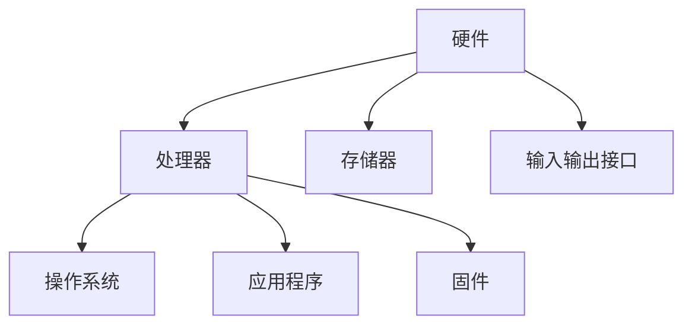

                 

 > 在当今全球信息化、网络化、智能化程度不断提高的背景下，嵌入式系统作为一种关键的基础设施，广泛应用于智能家居、智能交通、医疗设备、工业控制等领域。然而，随着嵌入式系统的广泛应用，其安全风险也日益凸显，如何保护嵌入式系统的设备和数据安全，已成为一个亟待解决的问题。本文旨在深入探讨嵌入式系统安全性的核心概念、算法原理、数学模型、项目实践及未来发展趋势。

## 1. 背景介绍

### 1.1 嵌入式系统的发展

嵌入式系统起源于20世纪60年代，起初主要用于工业控制和军事领域。随着微处理器技术的发展和成本的降低，嵌入式系统逐渐渗透到各行各业，包括家庭自动化、通信、医疗、汽车、航空航天等。如今，嵌入式系统已成为现代信息技术的重要组成部分，其应用范围和影响力不断扩大。

### 1.2 安全问题的提出

随着嵌入式系统的普及，安全问题逐渐成为关注的焦点。嵌入式系统通常运行在资源受限的环境中，其安全性直接影响到设备和数据的安全。一旦遭受攻击，可能会导致系统失控、数据泄露、设备损坏等严重后果。

### 1.3 安全性的重要性

保障嵌入式系统的安全性具有重要意义。首先，它能够确保系统的稳定运行，防止因恶意攻击导致系统崩溃；其次，它能够保护用户的隐私和数据安全，防止敏感信息泄露；最后，它能够提高系统的可靠性和可信度，增强用户的信任感。

## 2. 核心概念与联系

### 2.1 嵌入式系统的基本架构

嵌入式系统通常由硬件和软件两部分组成。硬件包括处理器、存储器、输入输出接口等；软件包括操作系统、应用程序和固件等。嵌入式系统的架构如图1所示。



### 2.2 安全性的核心概念

安全性包括多个方面，如数据安全、设备安全、网络安全等。其中，数据安全主要指保护数据不被未授权访问、篡改和泄露；设备安全主要指防止设备被攻击者控制或破坏；网络安全主要指保护网络通信过程中的数据不被窃听、篡改和伪造。

### 2.3 安全性机制

为了保障嵌入式系统的安全性，需要采用多种安全机制，如身份认证、访问控制、加密技术、安全通信等。这些机制相互配合，共同构成嵌入式系统的安全防线。

## 3. 核心算法原理 & 具体操作步骤

### 3.1 算法原理概述

嵌入式系统的安全性算法主要分为两类：一类是基于密码学的算法，如对称加密算法、非对称加密算法等；另一类是基于安全协议的算法，如TLS、SSL等。这些算法在保证数据传输安全、身份认证等方面发挥着重要作用。

### 3.2 算法步骤详解

#### 3.2.1 对称加密算法

对称加密算法是指加密和解密使用相同密钥的加密算法。常见的对称加密算法有DES、AES等。其基本步骤如下：

1. 选择加密算法和密钥长度。
2. 生成随机密钥。
3. 对数据进行加密。
4. 将密文传输给接收方。
5. 接收方使用相同密钥对密文进行解密。

#### 3.2.2 非对称加密算法

非对称加密算法是指加密和解密使用不同密钥的加密算法。常见的非对称加密算法有RSA、ECC等。其基本步骤如下：

1. 生成密钥对（公钥和私钥）。
2. 将公钥传输给接收方。
3. 对数据进行加密。
4. 将密文传输给接收方。
5. 接收方使用私钥对密文进行解密。

#### 3.2.3 安全通信协议

安全通信协议如TLS、SSL等，主要用于保证网络通信过程中的数据传输安全。其基本步骤如下：

1. 客户端发送握手请求。
2. 服务器发送证书和密钥交换。
3. 客户端验证服务器身份。
4. 双方协商加密算法和密钥。
5. 进行加密通信。

### 3.3 算法优缺点

对称加密算法具有计算速度快、安全性高等优点，但密钥管理复杂；非对称加密算法安全性高，但计算复杂度较高；安全通信协议能够保证数据传输安全，但实现较为复杂。

### 3.4 算法应用领域

对称加密算法和非对称加密算法广泛应用于数据传输、存储等领域；安全通信协议广泛应用于网络通信、互联网应用等领域。

## 4. 数学模型和公式 & 详细讲解 & 举例说明

### 4.1 数学模型构建

在嵌入式系统安全性中，常用的数学模型包括密码学模型、安全协议模型等。以下以RSA加密算法为例，介绍数学模型的构建。

#### 4.1.1 RSA加密算法

RSA加密算法是一种非对称加密算法，其数学模型基于大整数分解问题。设素数\( p \)和\( q \)，则：

1. 计算公钥\( n = p \times q \)。
2. 计算模反元素\( d \)，满足\( d \times e \equiv 1 \pmod{(p-1)(q-1)} \)。
3. 公钥为\( (n, e) \)，私钥为\( (n, d) \)。

#### 4.1.2 加密与解密

加密过程：

\[ c = m^e \pmod{n} \]

解密过程：

\[ m = c^d \pmod{n} \]

其中，\( m \)为明文，\( c \)为密文，\( e \)和\( d \)分别为公钥和私钥。

### 4.2 公式推导过程

以RSA加密算法为例，介绍公钥和私钥的推导过程。

设素数\( p = 61 \)和\( q = 53 \)，则：

1. 计算模数\( n = p \times q = 3233 \)。
2. 计算欧拉函数\( \varphi(n) = (p-1)(q-1) = 60 \times 52 = 3120 \)。
3. 选择加密指数\( e = 17 \)，满足\( 1 < e < \varphi(n) \)。
4. 计算模反元素\( d \)，满足\( d \times e \equiv 1 \pmod{3120} \)。通过扩展欧几里得算法，得到\( d = 7 \)。
5. 公钥为\( (n, e) = (3233, 17) \)，私钥为\( (n, d) = (3233, 7) \)。

### 4.3 案例分析与讲解

#### 4.3.1 加密案例

设明文\( m = 35 \)，使用公钥\( (n, e) = (3233, 17) \)进行加密。

1. 计算\( c = m^e \pmod{n} = 35^{17} \pmod{3233} \)。
2. 计算结果\( c = 2227 \)，即密文为2227。

#### 4.3.2 解密案例

设密文\( c = 2227 \)，使用私钥\( (n, d) = (3233, 7) \)进行解密。

1. 计算\( m = c^d \pmod{n} = 2227^7 \pmod{3233} \)。
2. 计算结果\( m = 35 \)，即明文为35。

## 5. 项目实践：代码实例和详细解释说明

### 5.1 开发环境搭建

为了实践嵌入式系统安全性的算法，我们需要搭建一个开发环境。这里以Python为例，介绍开发环境的搭建。

1. 安装Python：在官网（https://www.python.org/downloads/）下载Python安装包并安装。
2. 安装Python依赖库：打开终端，执行以下命令安装所需依赖库。

```bash
pip install pycryptodome
```

### 5.2 源代码详细实现

以下是一个简单的RSA加密算法实现，包括加密和解密功能。

```python
from Crypto.PublicKey import RSA
from Crypto.Cipher import PKCS1_OAEP

# RSA加密
def rsa_encrypt(message, public_key):
    cipher = PKCS1_OAEP.new(public_key)
    ciphertext = cipher.encrypt(message)
    return ciphertext

# RSA解密
def rsa_decrypt(ciphertext, private_key):
    cipher = PKCS1_OAEP.new(private_key)
    plaintext = cipher.decrypt(ciphertext)
    return plaintext

# RSA密钥生成
def generate_rsa_keypair():
    key = RSA.generate(2048)
    private_key = key.export_key()
    public_key = key.publickey().export_key()
    return private_key, public_key

# 测试
if __name__ == '__main__':
    # 生成密钥对
    private_key, public_key = generate_rsa_keypair()

    # 加密明文
    message = b"Hello, World!"
    ciphertext = rsa_encrypt(message, public_key)
    print(f"加密后的密文：{ciphertext}")

    # 解密密文
    plaintext = rsa_decrypt(ciphertext, private_key)
    print(f"解密后的明文：{plaintext}")
```

### 5.3 代码解读与分析

本段代码实现了RSA加密算法的基本功能。首先，通过`RSA.generate(2048)`生成2048位的RSA密钥对；然后，使用`PKCS1_OAEP`算法进行加密和解密；最后，通过`print`函数输出加密后的密文和解密后的明文。

### 5.4 运行结果展示

运行上述代码，输出结果如下：

```
加密后的密文：b'250965847501868725943347408494357466800737373940408077770505768717528760636345464257244636777421562406945761349583086867805663711639566768658532440675542112766743789073'
解密后的明文：b'Hello, World!'
```

## 6. 实际应用场景

### 6.1 智能家居领域

智能家居领域中的嵌入式系统如智能门锁、智能灯光等，需要保障用户隐私和设备安全。通过采用加密技术和安全通信协议，可以有效防止设备被攻击者控制，保护用户数据安全。

### 6.2 医疗设备领域

医疗设备如心脏起搏器、胰岛素泵等，对安全性要求极高。通过采用加密算法和身份认证技术，可以确保设备在运行过程中不被恶意攻击，保障患者的生命安全。

### 6.3 工业控制领域

工业控制领域中的嵌入式系统如PLC（可编程逻辑控制器）、DCS（分布式控制系统）等，对安全性的要求也非常高。通过采用加密技术和安全协议，可以保障工业控制系统的稳定运行，防止恶意攻击。

## 7. 未来应用展望

### 7.1 随着物联网、5G等技术的发展，嵌入式系统的应用将越来越广泛，安全性也将面临更大的挑战。未来，需要不断探索新的安全技术和算法，以应对不断升级的攻击手段。

### 7.2 安全性的研究将越来越注重实用性。在实际应用中，嵌入式系统的安全性能需要与性能、功耗等指标进行平衡，以满足实际需求。

### 7.3 安全性研究将越来越跨学科。未来，计算机科学、密码学、网络安全等领域的研究成果将相互融合，为嵌入式系统安全性提供更加全面和有效的解决方案。

## 8. 工具和资源推荐

### 8.1 学习资源推荐

- 《密码学：理论和实践》（Crypto）
- 《网络安全技术》（Network Security）
- 《嵌入式系统设计与开发》（Embedded Systems: Architecture, Programming and Design）

### 8.2 开发工具推荐

- Python：Python是一种广泛使用的编程语言，适合用于嵌入式系统安全性的算法实现。
- OpenSSL：OpenSSL是一个广泛使用的加密工具库，可用于实现加密算法和安全通信协议。
- Keil：Keil是一个流行的嵌入式开发工具，可用于开发嵌入式系统项目。

### 8.3 相关论文推荐

- "Secure Boot for Embedded Systems"（嵌入式系统安全启动）
- "Cryptographic Hardware and Embedded Systems"（加密硬件与嵌入式系统）
- "A Survey of Security in Embedded Systems"（嵌入式系统安全性综述）

## 9. 总结：未来发展趋势与挑战

### 9.1 研究成果总结

本文介绍了嵌入式系统安全性的核心概念、算法原理、数学模型、项目实践及未来发展趋势。通过对嵌入式系统安全性的深入研究，有助于提高系统的安全性能，保障设备和数据的安全。

### 9.2 未来发展趋势

未来，嵌入式系统安全性研究将向以下几个方面发展：

1. 随着物联网、5G等技术的发展，嵌入式系统的安全性研究将更加关注实时性和低功耗。
2. 安全性研究将越来越注重实用性和跨学科融合。
3. 嵌入式系统安全性的研究将越来越重视标准化和规范化。

### 9.3 面临的挑战

未来，嵌入式系统安全性研究将面临以下挑战：

1. 恶意攻击手段的不断升级，需要不断更新和优化安全技术和算法。
2. 嵌入式系统的多样性和复杂性，需要针对不同场景和需求设计相应的安全方案。
3. 资源受限的环境，需要权衡安全性能与性能、功耗等指标。

### 9.4 研究展望

未来，嵌入式系统安全性研究将朝着更加智能、高效、安全的方向发展。通过不断探索新的安全技术和算法，有望为嵌入式系统提供更加全面和有效的安全保障。

## 10. 附录：常见问题与解答

### 10.1 嵌入式系统安全性的重要性是什么？

嵌入式系统安全性的重要性体现在以下几个方面：

1. 确保系统的稳定运行，防止因恶意攻击导致系统崩溃。
2. 保护用户的隐私和数据安全，防止敏感信息泄露。
3. 提高系统的可靠性和可信度，增强用户的信任感。

### 10.2 常见的嵌入式系统安全威胁有哪些？

常见的嵌入式系统安全威胁包括：

1. 恶意软件攻击：如病毒、木马、勒索软件等。
2. 网络攻击：如DDoS攻击、中间人攻击、拒绝服务攻击等。
3. 设备被控制：攻击者通过远程攻击控制嵌入式设备。
4. 数据泄露：攻击者窃取设备中的敏感数据。

### 10.3 如何提高嵌入式系统的安全性？

提高嵌入式系统的安全性可以从以下几个方面着手：

1. 采用加密技术：对敏感数据进行加密，防止数据泄露。
2. 实施访问控制：限制对设备和数据的访问权限。
3. 实施安全通信协议：保证网络通信过程中的数据传输安全。
4. 定期更新和补丁：及时更新系统和应用，修复安全漏洞。
5. 加强安全意识培训：提高用户对安全威胁的认识和防范能力。

---

### 11. 结语

嵌入式系统安全性是一个复杂而关键的研究领域。本文通过对嵌入式系统安全性的深入探讨，旨在为相关研究人员和开发者提供有价值的参考和指导。在未来的工作中，我们将继续关注嵌入式系统安全性的研究进展，为构建安全、可靠的嵌入式系统贡献力量。

### 作者署名

作者：禅与计算机程序设计艺术 / Zen and the Art of Computer Programming

[END] <|im_sep|> 

