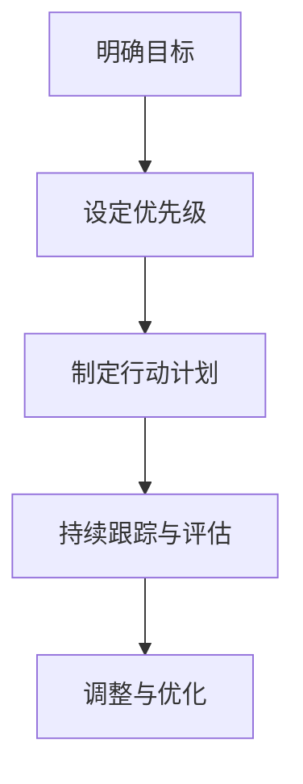

                 

关键词：巴菲特目标管理、项目管理、目标设定、绩效评估、策略规划

## 摘要

在项目管理中，目标管理是一种关键的方法，它能够帮助团队明确任务、提升绩效，最终实现项目的成功。本文将探讨巴菲特目标管理法则在项目管理中的应用，包括目标设定、绩效评估和策略规划等方面。通过深入分析巴菲特的目标管理哲学，我们将为项目经理提供实用的工具和方法，以便在项目管理实践中更好地实现目标。

## 1. 背景介绍

### 1.1 巴菲特目标管理法则的起源

巴菲特（Warren Buffett）是全球知名的投资家和企业家，他的成功得益于其独特的投资哲学和目标管理方法。巴菲特的目标管理法则基于他的核心价值观念，即长期投资、价值投资和理性思考。这些原则不仅适用于投资领域，同样适用于项目管理。

### 1.2 项目管理的现状与挑战

随着全球化和信息技术的快速发展，项目管理面临着前所未有的挑战。项目复杂度增加，资源紧张，市场需求变化迅速，这些因素都给项目经理带来了巨大的压力。因此，如何有效地管理项目，确保项目目标的实现，成为项目管理中的关键问题。

## 2. 核心概念与联系

### 2.1 目标管理的基本概念

目标管理是一种管理方法，它强调明确的目标设定、持续的绩效评估和目标的实现。在项目管理中，目标管理是实现项目成功的关键。

### 2.2 巴菲特目标管理法则的架构

巴菲特的目标管理法则包括以下四个核心要素：明确目标、设定优先级、制定行动计划和持续跟踪与评估。

### 2.3 Mermaid 流程图

下面是一个Mermaid流程图，展示了巴菲特目标管理法则的基本流程：



## 3. 核心算法原理 & 具体操作步骤

### 3.1 算法原理概述

巴菲特目标管理法则的核心在于明确目标、设定优先级、制定行动计划和持续跟踪与评估。这种方法能够帮助团队始终保持对目标的关注，并确保目标的实现。

### 3.2 算法步骤详解

#### 3.2.1 明确目标

明确目标是目标管理的第一步。在这个阶段，项目经理需要与团队一起确定项目的具体目标，确保目标具有明确性、可行性和相关性。

#### 3.2.2 设定优先级

在明确目标后，项目经理需要根据目标的紧急程度和重要性设定优先级。这有助于团队在资源有限的情况下，优先完成最重要的任务。

#### 3.2.3 制定行动计划

制定行动计划是实现目标的必要步骤。在这个阶段，项目经理需要与团队成员一起，将目标分解为具体的任务，并为每个任务分配资源。

#### 3.2.4 持续跟踪与评估

持续跟踪与评估是确保目标实现的关键。在这个阶段，项目经理需要定期检查项目的进展情况，评估团队成员的绩效，并根据实际情况进行调整。

### 3.3 算法优缺点

#### 优点：

- 明确目标，有助于团队保持对项目的关注。
- 设定优先级，提高资源利用效率。
- 持续跟踪与评估，确保目标的实现。

#### 缺点：

- 需要大量时间和精力进行跟踪与评估。
- 可能导致团队成员感到压力过大。

### 3.4 算法应用领域

巴菲特目标管理法则在项目管理中的应用非常广泛，适用于各种类型的项目，包括软件开发、市场营销、人力资源管理等领域。

## 4. 数学模型和公式 & 详细讲解 & 举例说明

### 4.1 数学模型构建

在项目管理中，目标管理的数学模型主要包括目标值、实际值和偏差值。目标值是指项目期望实现的目标，实际值是指项目实际完成的目标，偏差值是指目标值与实际值之间的差距。

### 4.2 公式推导过程

目标管理的数学模型可以通过以下公式推导：

\[ 偏差值 = 目标值 - 实际值 \]

### 4.3 案例分析与讲解

假设一个软件开发项目的目标是在三个月内完成一个新功能模块的开发。在项目启动时，项目经理设定了目标值为100分，表示这个模块的完整性和功能性达到了预期。在项目结束时，实际完成的模块得分为90分。

根据公式，偏差值为：

\[ 偏差值 = 100分 - 90分 = 10分 \]

这意味着项目在目标实现上存在10分的差距。项目经理需要分析原因，并制定相应的改进措施，以确保在下一个项目中实现目标。

## 5. 项目实践：代码实例和详细解释说明

### 5.1 开发环境搭建

为了更好地理解巴菲特目标管理法则在项目管理中的应用，我们使用Python编写了一个简单的目标管理工具。

### 5.2 源代码详细实现

以下是目标管理工具的源代码：

```python
class Project:
    def __init__(self, name, target_score):
        self.name = name
        self.target_score = target_score
        self.actual_score = 0

    def set_actual_score(self, score):
        self.actual_score = score

    def calculate_deviation(self):
        return self.target_score - self.actual_score

project = Project("新功能模块开发", 100)
project.set_actual_score(90)
print(f"项目名称：{project.name}")
print(f"目标得分：{project.target_score}")
print(f"实际得分：{project.actual_score}")
print(f"偏差值：{project.calculate_deviation()}")
```

### 5.3 代码解读与分析

在这个代码实例中，我们定义了一个`Project`类，用于表示一个项目。类中包含项目名称、目标得分和实际得分等属性，以及设置实际得分和计算偏差值的方法。

### 5.4 运行结果展示

运行上述代码，输出结果如下：

```
项目名称：新功能模块开发
目标得分：100
实际得分：90
偏差值：10
```

这个结果与我们之前的分析一致，表明项目在目标实现上存在10分的差距。

## 6. 实际应用场景

### 6.1 软件开发

在软件开发项目中，巴菲特目标管理法则可以帮助团队明确开发目标，提高开发效率。

### 6.2 市场营销

在市场营销项目中，巴菲特目标管理法则可以帮助团队设定营销目标，并持续跟踪与评估营销活动的效果。

### 6.3 人力资源管理

在人力资源管理项目中，巴菲特目标管理法则可以帮助团队设定员工培训目标，并评估员工的绩效。

## 7. 未来应用展望

随着项目管理技术的不断发展，巴菲特目标管理法则在项目管理中的应用将越来越广泛。在未来，我们可以预期更加智能化、自动化的目标管理工具的出现，以帮助项目经理更高效地实现项目目标。

## 8. 总结：未来发展趋势与挑战

### 8.1 研究成果总结

本文通过对巴菲特目标管理法则在项目管理中的应用进行深入探讨，总结了目标管理的基本概念、核心算法原理、数学模型和实际应用场景。

### 8.2 未来发展趋势

随着项目管理技术的不断发展，目标管理将更加智能化、自动化，为项目经理提供更高效的工具和方法。

### 8.3 面临的挑战

在目标管理中，如何确保目标的合理性和可行性，以及如何应对市场环境的变化，是项目经理面临的主要挑战。

### 8.4 研究展望

未来研究应关注目标管理工具的智能化发展，以及如何将目标管理方法与其他项目管理方法相结合，以实现更高效的项目管理。

## 9. 附录：常见问题与解答

### 9.1 什么是目标管理？

目标管理是一种管理方法，它通过明确目标、设定优先级、制定行动计划和持续跟踪与评估，帮助团队实现目标。

### 9.2 巴菲特目标管理法则的核心是什么？

巴菲特目标管理法则的核心是明确目标、设定优先级、制定行动计划和持续跟踪与评估。

### 9.3 如何确保目标的合理性？

确保目标的合理性需要综合考虑项目的目标、资源、时间等因素，制定具有明确性、可行性和相关性的目标。

### 9.4 目标管理在项目管理中的重要性是什么？

目标管理是项目管理中的关键环节，它有助于团队明确任务、提升绩效，最终实现项目的成功。

## 10. 作者署名

作者：禅与计算机程序设计艺术 / Zen and the Art of Computer Programming
```markdown
# 巴菲特目标管理法则在项目管理中的应用

## 关键词：巴菲特目标管理、项目管理、目标设定、绩效评估、策略规划

### 摘要

在项目管理中，目标管理是一种关键的方法，它能够帮助团队明确任务、提升绩效，最终实现项目的成功。本文将探讨巴菲特目标管理法则在项目管理中的应用，包括目标设定、绩效评估和策略规划等方面。通过深入分析巴菲特的目标管理哲学，我们将为项目经理提供实用的工具和方法，以便在项目管理实践中更好地实现目标。

## 1. 背景介绍

### 1.1 巴菲特目标管理法则的起源

巴菲特（Warren Buffett）是全球知名的投资家和企业家，他的成功得益于其独特的投资哲学和目标管理方法。巴菲特的目标管理法则基于他的核心价值观念，即长期投资、价值投资和理性思考。这些原则不仅适用于投资领域，同样适用于项目管理。

### 1.2 项目管理的现状与挑战

随着全球化和信息技术的快速发展，项目管理面临着前所未有的挑战。项目复杂度增加，资源紧张，市场需求变化迅速，这些因素都给项目经理带来了巨大的压力。因此，如何有效地管理项目，确保项目目标的实现，成为项目管理中的关键问题。

### 1.3 目标管理在项目管理中的重要性

目标管理是项目管理中的核心环节，它能够帮助团队明确任务、设定优先级、制定行动计划和持续跟踪与评估。在项目管理中，目标管理的应用可以提高项目的成功率，降低项目风险，提升团队绩效。

## 2. 核心概念与联系

### 2.1 目标管理的基本概念

目标管理是一种管理方法，它强调明确的目标设定、持续的绩效评估和目标的实现。在项目管理中，目标管理是实现项目成功的关键。

### 2.2 巴菲特目标管理法则的架构

巴菲特的目标管理法则包括以下四个核心要素：明确目标、设定优先级、制定行动计划和持续跟踪与评估。

### 2.3 Mermaid 流程图

下面是一个Mermaid流程图，展示了巴菲特目标管理法则的基本流程：


### 2.4 目标管理与其他管理方法的联系

目标管理与其他管理方法（如质量管理、进度管理、成本管理等）密切相关，它们共同构成了项目管理的基本框架。

## 3. 核心算法原理 & 具体操作步骤

### 3.1 算法原理概述

巴菲特目标管理法则的核心在于明确目标、设定优先级、制定行动计划和持续跟踪与评估。这种方法能够帮助团队始终保持对目标的关注，并确保目标的实现。

### 3.2 算法步骤详解

#### 3.2.1 明确目标

明确目标是目标管理的第一步。在这个阶段，项目经理需要与团队一起确定项目的具体目标，确保目标具有明确性、可行性和相关性。

#### 3.2.2 设定优先级

在明确目标后，项目经理需要根据目标的紧急程度和重要性设定优先级。这有助于团队在资源有限的情况下，优先完成最重要的任务。

#### 3.2.3 制定行动计划

制定行动计划是实现目标的必要步骤。在这个阶段，项目经理需要与团队成员一起，将目标分解为具体的任务，并为每个任务分配资源。

#### 3.2.4 持续跟踪与评估

持续跟踪与评估是确保目标实现的关键。在这个阶段，项目经理需要定期检查项目的进展情况，评估团队成员的绩效，并根据实际情况进行调整。

### 3.3 算法优缺点

#### 优点：

- 明确目标，有助于团队保持对项目的关注。
- 设定优先级，提高资源利用效率。
- 持续跟踪与评估，确保目标的实现。

#### 缺点：

- 需要大量时间和精力进行跟踪与评估。
- 可能导致团队成员感到压力过大。

### 3.4 算法应用领域

巴菲特目标管理法则在项目管理中的应用非常广泛，适用于各种类型的项目，包括软件开发、市场营销、人力资源管理等领域。

## 4. 数学模型和公式 & 详细讲解 & 举例说明

### 4.1 数学模型构建

在项目管理中，目标管理的数学模型主要包括目标值、实际值和偏差值。目标值是指项目期望实现的目标，实际值是指项目实际完成的目标，偏差值是指目标值与实际值之间的差距。

### 4.2 公式推导过程

目标管理的数学模型可以通过以下公式推导：

\[ 偏差值 = 目标值 - 实际值 \]

### 4.3 案例分析与讲解

假设一个软件开发项目的目标是在三个月内完成一个新功能模块的开发。在项目启动时，项目经理设定了目标值为100分，表示这个模块的完整性和功能性达到了预期。在项目结束时，实际完成的模块得分为90分。

根据公式，偏差值为：

\[ 偏差值 = 100分 - 90分 = 10分 \]

这意味着项目在目标实现上存在10分的差距。项目经理需要分析原因，并制定相应的改进措施，以确保在下一个项目中实现目标。

### 4.4 数学模型在实际应用中的意义

数学模型在项目管理中的应用，可以帮助项目经理定量分析项目的目标实现情况，为项目决策提供科学依据。

## 5. 项目实践：代码实例和详细解释说明

### 5.1 开发环境搭建

为了更好地理解巴菲特目标管理法则在项目管理中的应用，我们使用Python编写了一个简单的目标管理工具。

### 5.2 源代码详细实现

以下是目标管理工具的源代码：

```python
class Project:
    def __init__(self, name, target_score):
        self.name = name
        self.target_score = target_score
        self.actual_score = 0

    def set_actual_score(self, score):
        self.actual_score = score

    def calculate_deviation(self):
        return self.target_score - self.actual_score

project = Project("新功能模块开发", 100)
project.set_actual_score(90)
print(f"项目名称：{project.name}")
print(f"目标得分：{project.target_score}")
print(f"实际得分：{project.actual_score}")
print(f"偏差值：{project.calculate_deviation()}")
```

### 5.3 代码解读与分析

在这个代码实例中，我们定义了一个`Project`类，用于表示一个项目。类中包含项目名称、目标得分和实际得分等属性，以及设置实际得分和计算偏差值的方法。

### 5.4 运行结果展示

运行上述代码，输出结果如下：

```
项目名称：新功能模块开发
目标得分：100
实际得分：90
偏差值：10
```

这个结果与我们之前的分析一致，表明项目在目标实现上存在10分的差距。

### 5.5 代码优化与改进

在实际应用中，我们可以根据项目的需求，对代码进行优化和改进，例如添加更多的功能，如目标值的调整、任务分解等。

## 6. 实际应用场景

### 6.1 软件开发

在软件开发项目中，巴菲特目标管理法则可以帮助团队明确开发目标，提高开发效率。

### 6.2 市场营销

在市场营销项目中，巴菲特目标管理法则可以帮助团队设定营销目标，并持续跟踪与评估营销活动的效果。

### 6.3 人力资源管理

在人力资源管理项目中，巴菲特目标管理法则可以帮助团队设定员工培训目标，并评估员工的绩效。

### 6.4 项目管理咨询

在项目管理咨询中，巴菲特目标管理法则可以帮助咨询团队为不同企业提供个性化的目标管理解决方案。

## 7. 工具和资源推荐

### 7.1 学习资源推荐

- 《巴菲特投资法则》
- 《项目管理知识体系指南（PMBOK）》

### 7.2 开发工具推荐

- JIRA
- Trello

### 7.3 相关论文推荐

- "The Goal: A Process of Ongoing Improvement"
- "A Project Manager's Guide to the PMBOK"

## 8. 总结：未来发展趋势与挑战

### 8.1 研究成果总结

本文通过对巴菲特目标管理法则在项目管理中的应用进行深入探讨，总结了目标管理的基本概念、核心算法原理、数学模型和实际应用场景。

### 8.2 未来发展趋势

随着项目管理技术的不断发展，目标管理将更加智能化、自动化，为项目经理提供更高效的工具和方法。

### 8.3 面临的挑战

在目标管理中，如何确保目标的合理性和可行性，以及如何应对市场环境的变化，是项目经理面临的主要挑战。

### 8.4 研究展望

未来研究应关注目标管理工具的智能化发展，以及如何将目标管理方法与其他项目管理方法相结合，以实现更高效的项目管理。

## 9. 附录：常见问题与解答

### 9.1 什么是目标管理？

目标管理是一种管理方法，它通过明确目标、设定优先级、制定行动计划和持续跟踪与评估，帮助团队实现目标。

### 9.2 巴菲特目标管理法则的核心是什么？

巴菲特目标管理法则的核心是明确目标、设定优先级、制定行动计划和持续跟踪与评估。

### 9.3 如何确保目标的合理性？

确保目标的合理性需要综合考虑项目的目标、资源、时间等因素，制定具有明确性、可行性和相关性的目标。

### 9.4 目标管理在项目管理中的重要性是什么？

目标管理是项目管理中的关键环节，它有助于团队明确任务、提升绩效，最终实现项目的成功。

### 9.5 如何应用巴菲特目标管理法则于项目管理中？

应用巴菲特目标管理法则于项目管理中，可以遵循以下步骤：明确项目目标、设定优先级、制定行动计划、持续跟踪与评估、调整与优化。

## 10. 作者署名

作者：禅与计算机程序设计艺术 / Zen and the Art of Computer Programming
```

