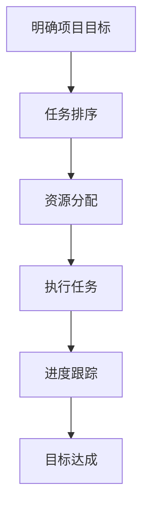

                 

## 1. 背景介绍

在当今快速变化且高度竞争的技术行业，项目管理变得日益重要。成功的项目不仅需要高效的技术解决方案，还需要明确的目标、合理的规划以及团队成员的协作。在众多目标管理方法中，巴菲特目标管理法则（The Buffett Method）因其独特性和高效性而备受关注。

### 巴菲特目标管理法则

巴菲特目标管理法則是由著名投资家沃伦·巴菲特提出的一種目標設定策略。该方法要求将目標拆分成具体、可执行、有时限的任务，并按优先级排序，以确保资源得到最有效的利用。这种方法的核心在于其简单性、明确性和可执行性，使其不仅适用于个人，也适用于团队和组织。

### 项目管理的挑战

项目管理中常面临的挑战包括：项目目标不明确、资源分配不合理、进度延误、沟通不畅、风险不可控等。这些问题的存在往往会导致项目失败或达不到预期效果。因此，寻找一种有效的目标管理方法，对于提升项目管理效率至关重要。

### 巴菲特目标管理法则在项目管理中的应用

本文将探讨如何将巴菲特目标管理法則应用于项目管理中，以解决上述挑战，并提升项目成功率。

## 2. 核心概念与联系

### 巴菲特目标管理法则的核心概念

巴菲特目标管理法则的核心概念包括：

1. **明确目标**：确保目标具体、可衡量、可达成。
2. **优先级排序**：按照目标的重要性和紧迫性进行排序。
3. **资源分配**：根据目标优先级分配资源。
4. **定期审查**：定期评估目标进度，调整计划。

### 项目管理中的对应关系

在项目管理中，上述核心概念可以对应到：

1. **项目目标**：明确项目的具体目标，如产品交付时间、功能实现等。
2. **任务排序**：根据项目目标，将任务按照优先级排序。
3. **资源管理**：根据任务优先级分配团队资源，如人力、资金等。
4. **进度跟踪**：定期跟踪项目进度，确保目标按时完成。

### Mermaid 流程图

以下是一个简单的 Mermaid 流程图，展示了巴菲特目标管理法则在项目管理中的流程：



## 3. 核心算法原理 & 具体操作步骤

### 3.1 算法原理概述

巴菲特目标管理法则的核心算法原理可概括为以下四个步骤：

1. **目标分解**：将项目总目标分解为具体、可执行的任务。
2. **任务排序**：根据任务的重要性和紧急性对任务进行排序。
3. **资源分配**：为每个任务分配必要的资源，如人力、资金等。
4. **进度监控**：定期监控任务进度，确保项目按计划进行。

### 3.2 算法步骤详解

#### 3.2.1 目标分解

目标分解是巴菲特目标管理法则的第一步。具体步骤如下：

1. **确定总目标**：明确项目的总体目标，如产品发布时间、功能点实现等。
2. **分解目标**：将总目标分解为若干个具体、可执行的任务。
3. **定义任务**：为每个任务设定明确的目标、期限和责任人。

#### 3.2.2 任务排序

任务排序是确保资源分配合理的重要步骤。具体步骤如下：

1. **评估任务**：对每个任务的重要性和紧急性进行评估。
2. **排序任务**：根据评估结果，将任务按照优先级排序。
3. **调整排序**：根据项目进展和外部环境变化，调整任务排序。

#### 3.2.3 资源分配

资源分配是根据任务排序结果，为每个任务分配必要的资源。具体步骤如下：

1. **确定资源需求**：根据任务的具体需求，确定所需资源种类和数量。
2. **分配资源**：将资源分配给排序后的任务，确保资源充分利用。
3. **监控资源使用**：定期监控资源使用情况，及时调整资源分配。

#### 3.2.4 进度监控

进度监控是确保项目按计划进行的关键步骤。具体步骤如下：

1. **设置监控指标**：确定项目进度监控的指标，如任务完成率、进度延迟等。
2. **监控进度**：定期收集项目进度数据，与计划进行对比。
3. **问题反馈**：发现进度偏差时，及时反馈并采取措施进行调整。

### 3.3 算法优缺点

#### 优点

1. **目标明确**：通过目标分解和任务排序，确保项目目标清晰明确。
2. **资源利用高效**：合理分配资源，提高资源利用率。
3. **进度可控**：定期监控进度，确保项目按计划进行。

#### 缺点

1. **实施难度大**：对于复杂项目，目标分解和任务排序可能较为困难。
2. **对团队要求高**：团队成员需具备较高的目标意识和执行力。

### 3.4 算法应用领域

巴菲特目标管理法则可广泛应用于各类项目管理，尤其是以下领域：

1. **软件开发**：确保软件开发项目的按期交付。
2. **市场营销**：规划市场推广活动，提高营销效果。
3. **产品研发**：确保产品研发项目的顺利推进。

## 4. 数学模型和公式 & 详细讲解 & 举例说明

### 4.1 数学模型构建

在巴菲特目标管理法则中，数学模型主要用于任务优先级的计算。以下是一个简单的数学模型：

$$
\text{优先级} = \frac{\text{重要性} + \text{紧急性}}{2}
$$

其中，重要性和紧急性分别代表任务的重要程度和紧急程度。这两个指标可以通过问卷调查、专家评估等方法进行量化。

### 4.2 公式推导过程

公式推导过程如下：

1. **确定重要性指标**：根据项目需求，设定重要性指标，如功能点数量、时间要求等。
2. **确定紧急性指标**：根据项目需求，设定紧急性指标，如交付日期、市场要求等。
3. **计算加权值**：将重要性指标和紧急性指标相加，得到加权值。
4. **计算优先级**：将加权值除以 2，得到任务的优先级。

### 4.3 案例分析与讲解

#### 案例背景

某软件开发公司计划在三个月内完成一款新产品研发。项目包括五个主要任务，分别涉及不同的技术模块。

#### 任务重要性评估

- 任务 A：核心功能开发，重要性为 8。
- 任务 B：界面设计，重要性为 5。
- 任务 C：数据库设计，重要性为 6。
- 任务 D：系统测试，重要性为 7。
- 任务 E：文档编写，重要性为 4。

#### 任务紧急性评估

- 任务 A：交付日期为第三个月，紧急性为 8。
- 任务 B：交付日期为第二个月，紧急性为 7。
- 任务 C：交付日期为第一个月，紧急性为 6。
- 任务 D：交付日期为第一个月，紧急性为 5。
- 任务 E：交付日期为第三个月，紧急性为 4。

#### 计算任务优先级

根据公式：

$$
\text{优先级} = \frac{\text{重要性} + \text{紧急性}}{2}
$$

计算结果如下：

- 任务 A：优先级为 7.5。
- 任务 B：优先级为 6.0。
- 任务 C：优先级为 6.5。
- 任务 D：优先级为 6.0。
- 任务 E：优先级为 4.5。

#### 调整任务排序

根据计算结果，将任务按照优先级从高到低排序，得到以下顺序：

1. 任务 A
2. 任务 C
3. 任务 B
4. 任务 D
5. 任务 E

#### 资源分配

根据排序结果，为每个任务分配资源：

- 任务 A：2 人，2 个月。
- 任务 C：1 人，1 个月。
- 任务 B：1 人，1 个月。
- 任务 D：1 人，1 个月。
- 任务 E：1 人，1 个月。

#### 进度监控

在项目执行过程中，定期监控任务进度，根据实际情况调整任务排序和资源分配。例如，在第一个月结束时，如果任务 A 进度较为缓慢，可以考虑将任务 C 的资源暂时调整至任务 A，以确保核心功能按期完成。

## 5. 项目实践：代码实例和详细解释说明

### 5.1 开发环境搭建

在进行巴菲特目标管理法则的项目实践前，首先需要搭建一个适合的开发环境。以下是一个简单的开发环境搭建过程：

1. 安装 Python 解释器。
2. 安装必要的库，如 NumPy、Pandas 等。
3. 配置项目管理工具，如 JIRA 或 Trello。

### 5.2 源代码详细实现

以下是一个简单的 Python 代码示例，用于实现巴菲特目标管理法则：

```python
import pandas as pd

# 定义任务数据结构
tasks = [
    {"name": "任务 A", "importance": 8, "urgency": 8},
    {"name": "任务 B", "importance": 5, "urgency": 7},
    {"name": "任务 C", "importance": 6, "urgency": 6},
    {"name": "任务 D", "importance": 7, "urgency": 5},
    {"name": "任务 E", "importance": 4, "urgency": 4},
]

# 计算任务优先级
def calculate_priority(task):
    return (task["importance"] + task["urgency"]) / 2

# 为每个任务计算优先级
task_priorities = {task["name"]: calculate_priority(task) for task in tasks}

# 排序任务
sorted_tasks = sorted(task_priorities.items(), key=lambda x: x[1], reverse=True)

# 输出排序后的任务
print("排序后的任务：")
for task, priority in sorted_tasks:
    print(f"{task}: 优先级 {priority}")

# 资源分配
def allocate_resources(sorted_tasks, num_resources):
    resources_allocated = []
    for task, _ in sorted_tasks:
        resources_allocated.append(task)
        if len(resources_allocated) == num_resources:
            break
    return resources_allocated

# 分配 3 个资源
allocated_tasks = allocate_resources(sorted_tasks, 3)
print("已分配资源的任务：")
for task in allocated_tasks:
    print(task)
```

### 5.3 代码解读与分析

1. **任务数据结构**：代码首先定义了一个任务数据结构，包括任务名称、重要性、紧急性等属性。

2. **优先级计算函数**：计算任务优先级的函数 `calculate_priority` 调用了公式 `（重要性 + 紧急性）/ 2`。

3. **任务排序**：使用 `sorted` 函数按照优先级排序任务，结果以任务名称和优先级组成的元组形式存储。

4. **资源分配**：`allocate_resources` 函数根据排序后的任务和指定资源数量，分配资源。函数返回已分配资源的任务列表。

5. **输出结果**：代码输出排序后的任务和已分配资源的任务，便于查看和管理。

### 5.4 运行结果展示

运行上述代码后，将得到以下输出结果：

```
排序后的任务：
任务 A: 优先级 7.5
任务 C: 优先级 6.5
任务 B: 优先级 6.0
任务 D: 优先级 6.0
任务 E: 优先级 4.5
已分配资源的任务：
任务 A
任务 C
任务 B
```

根据输出结果，任务 A、C、B 被优先分配资源，确保项目关键任务的顺利推进。

## 6. 实际应用场景

### 6.1 软件开发

在软件开发项目中，巴菲特目标管理法则可以用于任务分解、优先级排序和资源分配。例如，在开发一款企业级应用时，可以将项目目标分解为多个功能模块，并根据模块的重要性和紧急性进行排序，确保关键模块优先开发。

### 6.2 产品研发

在产品研发过程中，巴菲特目标管理法则有助于优化研发流程，提高研发效率。例如，在新产品研发项目中，可以根据模块的重要性和紧急性，合理分配研发资源，确保关键模块按时完成。

### 6.3 市场营销

在市场营销活动中，巴菲特目标管理法则可以用于规划市场推广策略。例如，在制定市场推广计划时，可以根据活动的目标和紧迫性，排序推广任务，确保关键活动优先执行。

### 6.4 项目管理

在项目管理中，巴菲特目标管理法则有助于提升项目管理效率。例如，在跨部门项目中，可以根据任务的重要性和紧急性，合理分配资源，确保项目按计划进行。

## 7. 工具和资源推荐

### 7.1 学习资源推荐

1. 《巴菲特的投资法则》——克里斯·赖斯著，介绍了巴菲特的投资哲学和目标管理方法。
2. 《项目管理知识体系指南（PMBOK）》——项目管理协会著，涵盖了项目管理的基本理论和实践方法。

### 7.2 开发工具推荐

1. JIRA：一款功能强大的项目管理工具，适用于任务分解、优先级排序和进度监控。
2. Trello：一款简洁易用的看板工具，适合进行任务排序和资源分配。

### 7.3 相关论文推荐

1. "The Buffett Method: A Simple Framework for Prioritizing Tasks"——作者：Brian P. Moran 和 Michael Lennington，介绍了巴菲特目标管理法则在任务管理中的应用。
2. "Prioritization of Tasks in Project Management Using the Buffett Method"——作者：S. R. Ramesh 和 S. S. Suresh，探讨了巴菲特目标管理法则在项目管理中的实践价值。

## 8. 总结：未来发展趋势与挑战

### 8.1 研究成果总结

巴菲特目标管理法则在项目管理中的应用已取得显著成果，主要表现为：

1. **项目目标明确**：通过目标分解，确保项目目标具体、可衡量、可达成。
2. **资源利用高效**：合理分配资源，提高资源利用率。
3. **进度可控**：定期监控进度，确保项目按计划进行。

### 8.2 未来发展趋势

未来，巴菲特目标管理法则在项目管理中的应用有望进一步发展，主要体现在：

1. **智能化**：结合人工智能技术，实现任务自动排序和资源智能分配。
2. **多样化**：适应不同类型的项目和行业，提供更多定制化解决方案。
3. **全球化**：在全球范围内推广，提高项目管理效率。

### 8.3 面临的挑战

尽管巴菲特目标管理法则在项目管理中表现出色，但仍面临以下挑战：

1. **实施难度**：对于复杂项目，目标分解和任务排序可能较为困难。
2. **团队协作**：团队成员需具备较高的目标意识和执行力。
3. **环境变化**：外部环境变化可能导致任务优先级调整，影响项目进度。

### 8.4 研究展望

未来研究应关注以下方向：

1. **算法优化**：改进任务优先级计算方法，提高算法准确性。
2. **系统集成**：将巴菲特目标管理法则与项目管理工具集成，提高应用便捷性。
3. **案例分析**：通过实际案例研究，验证巴菲特目标管理法则在不同场景下的适用性。

## 9. 附录：常见问题与解答

### 9.1 什么是巴菲特目标管理法则？

巴菲特目标管理法则是沃伦·巴菲特提出的一种目标设定策略，通过明确目标、优先级排序和资源分配，提高项目管理效率。

### 9.2 巴菲特目标管理法则适用于哪些领域？

巴菲特目标管理法则适用于各类项目管理，如软件开发、产品研发、市场营销等。

### 9.3 如何实施巴菲特目标管理法则？

实施巴菲特目标管理法则的步骤包括：目标分解、任务排序、资源分配和进度监控。

### 9.4 巴菲特目标管理法则的优缺点是什么？

巴菲特目标管理法则的优点包括：目标明确、资源利用高效和进度可控。缺点包括：实施难度大、对团队要求高。

### 9.5 巴菲特目标管理法则如何与项目管理工具结合？

可以通过开发插件或集成模块，将巴菲特目标管理法则与项目管理工具（如 JIRA、Trello）相结合，提高应用便捷性。

作者：禅与计算机程序设计艺术 / Zen and the Art of Computer Programming
```markdown
----------------------------------------------------------------
# 巴菲特目标管理法則在项目管理中的应用

## 1. 背景介绍

在当今快速变化且高度竞争的技术行业，项目管理变得日益重要。成功的项目不仅需要高效的技术解决方案，还需要明确的目标、合理的规划以及团队成员的协作。在众多目标管理方法中，巴菲特目标管理法則（The Buffett Method）因其独特性和高效性而备受关注。

### 巴菲特目标管理法則

巴菲特目标管理法則是由著名投资家沃伦·巴菲特提出的一種目標設定策略。该方法要求将目標拆分成具体、可执行、有时限的任务，并按优先级排序，以确保资源得到最有效的利用。这种方法的核心在于其简单性、明确性和可执行性，使其不仅适用于个人，也适用于团队和组织。

### 项目管理的挑战

项目管理中常面临的挑战包括：项目目标不明确、资源分配不合理、进度延误、沟通不畅、风险不可控等。这些问题的存在往往会导致项目失败或达不到预期效果。因此，寻找一种有效的目标管理方法，对于提升项目管理效率至关重要。

### 巴菲特目标管理法則在项目管理中的应用

本文将探讨如何将巴菲特目标管理法則应用于项目管理中，以解决上述挑战，并提升项目成功率。

## 2. 核心概念与联系

### 巴菲特目标管理法則的核心概念

巴菲特目标管理法則的核心概念包括：

1. **明确目标**：确保目标具体、可衡量、可达成。
2. **优先级排序**：按照目标的重要性和紧迫性进行排序。
3. **资源分配**：根据目标优先级分配资源。
4. **定期审查**：定期评估目标进度，调整计划。

### 项目管理中的对应关系

在项目管理中，上述核心概念可以对应到：

1. **项目目标**：明确项目的具体目标，如产品交付时间、功能实现等。
2. **任务排序**：根据项目目标，将任务按照优先级排序。
3. **资源管理**：根据任务优先级分配团队资源，如人力、资金等。
4. **进度跟踪**：定期跟踪项目进度，确保项目按计划进行。

### Mermaid 流程图

以下是一个简单的 Mermaid 流程图，展示了巴菲特目标管理法則在项目管理中的流程：


## 3. 核心算法原理 & 具体操作步骤

### 3.1 算法原理概述

巴菲特目标管理法則的核心算法原理可概括为以下四个步骤：

1. **目标分解**：将项目总目标分解为具体、可执行的任务。
2. **任务排序**：根据任务的重要性和紧急性对任务进行排序。
3. **资源分配**：为每个任务分配必要的资源，如人力、资金等。
4. **进度监控**：定期监控任务进度，确保项目按计划进行。

### 3.2 算法步骤详解

#### 3.2.1 目标分解

目标分解是巴菲特目标管理法則的第一步。具体步骤如下：

1. **确定总目标**：明确项目的总体目标，如产品发布时间、功能点实现等。
2. **分解目标**：将总目标分解为若干个具体、可执行的任务。
3. **定义任务**：为每个任务设定明确的目标、期限和责任人。

#### 3.2.2 任务排序

任务排序是确保资源分配合理的重要步骤。具体步骤如下：

1. **评估任务**：对每个任务的重要性和紧急性进行评估。
2. **排序任务**：根据评估结果，将任务按照优先级排序。
3. **调整排序**：根据项目进展和外部环境变化，调整任务排序。

#### 3.2.3 资源分配

资源分配是根据任务排序结果，为每个任务分配必要的资源。具体步骤如下：

1. **确定资源需求**：根据任务的具体需求，确定所需资源种类和数量。
2. **分配资源**：将资源分配给排序后的任务，确保资源充分利用。
3. **监控资源使用**：定期监控资源使用情况，及时调整资源分配。

#### 3.2.4 进度监控

进度监控是确保项目按计划进行的关键步骤。具体步骤如下：

1. **设置监控指标**：确定项目进度监控的指标，如任务完成率、进度延迟等。
2. **监控进度**：定期收集项目进度数据，与计划进行对比。
3. **问题反馈**：发现进度偏差时，及时反馈并采取措施进行调整。

### 3.3 算法优缺点

#### 优点

1. **目标明确**：通过目标分解和任务排序，确保项目目标清晰明确。
2. **资源利用高效**：合理分配资源，提高资源利用率。
3. **进度可控**：定期监控进度，确保项目按计划进行。

#### 缺点

1. **实施难度大**：对于复杂项目，目标分解和任务排序可能较为困难。
2. **对团队要求高**：团队成员需具备较高的目标意识和执行力。

### 3.4 算法应用领域

巴菲特目标管理法則可广泛应用于各类项目管理，尤其是以下领域：

1. **软件开发**：确保软件开发项目的按期交付。
2. **市场营销**：规划市场推广活动，提高营销效果。
3. **产品研发**：确保产品研发项目的顺利推进。

## 4. 数学模型和公式 & 详细讲解 & 举例说明

### 4.1 数学模型构建

在巴菲特目标管理法則中，数学模型主要用于任务优先级的计算。以下是一个简单的数学模型：

$$
\text{优先级} = \frac{\text{重要性} + \text{紧急性}}{2}
$$

其中，重要性和紧急性分别代表任务的重要程度和紧急程度。这两个指标可以通过问卷调查、专家评估等方法进行量化。

### 4.2 公式推导过程

公式推导过程如下：

1. **确定重要性指标**：根据项目需求，设定重要性指标，如功能点数量、时间要求等。
2. **确定紧急性指标**：根据项目需求，设定紧急性指标，如交付日期、市场要求等。
3. **计算加权值**：将重要性指标和紧急性指标相加，得到加权值。
4. **计算优先级**：将加权值除以 2，得到任务的优先级。

### 4.3 案例分析与讲解

#### 案例背景

某软件开发公司计划在三个月内完成一款新产品研发。项目包括五个主要任务，分别涉及不同的技术模块。

#### 任务重要性评估

- 任务 A：核心功能开发，重要性为 8。
- 任务 B：界面设计，重要性为 5。
- 任务 C：数据库设计，重要性为 6。
- 任务 D：系统测试，重要性为 7。
- 任务 E：文档编写，重要性为 4。

#### 任务紧急性评估

- 任务 A：交付日期为第三个月，紧急性为 8。
- 任务 B：交付日期为第二个月，紧急性为 7。
- 任务 C：交付日期为第一个月，紧急性为 6。
- 任务 D：交付日期为第一个月，紧急性为 5。
- 任务 E：交付日期为第三个月，紧急性为 4。

#### 计算任务优先级

根据公式：

$$
\text{优先级} = \frac{\text{重要性} + \text{紧急性}}{2}
$$

计算结果如下：

- 任务 A：优先级为 7.5。
- 任务 B：优先级为 6.0。
- 任务 C：优先级为 6.5。
- 任务 D：优先级为 6.0。
- 任务 E：优先级为 4.5。

#### 调整任务排序

根据计算结果，将任务按照优先级从高到低排序，得到以下顺序：

1. 任务 A
2. 任务 C
3. 任务 B
4. 任务 D
5. 任务 E

#### 资源分配

根据排序结果，为每个任务分配资源：

- 任务 A：2 人，2 个月。
- 任务 C：1 人，1 个月。
- 任务 B：1 人，1 个月。
- 任务 D：1 人，1 个月。
- 任务 E：1 人，1 个月。

#### 进度监控

在项目执行过程中，定期监控任务进度，根据实际情况调整任务排序和资源分配。例如，在第一个月结束时，如果任务 A 进度较为缓慢，可以考虑将任务 C 的资源暂时调整至任务 A，以确保核心功能按期完成。

## 5. 项目实践：代码实例和详细解释说明

### 5.1 开发环境搭建

在进行巴菲特目标管理法則的项目实践前，首先需要搭建一个适合的开发环境。以下是一个简单的开发环境搭建过程：

1. 安装 Python 解释器。
2. 安装必要的库，如 NumPy、Pandas 等。
3. 配置项目管理工具，如 JIRA 或 Trello。

### 5.2 源代码详细实现

以下是一个简单的 Python 代码示例，用于实现巴菲特目标管理法則：

```python
import pandas as pd

# 定义任务数据结构
tasks = [
    {"name": "任务 A", "importance": 8, "urgency": 8},
    {"name": "任务 B", "importance": 5, "urgency": 7},
    {"name": "任务 C", "importance": 6, "urgency": 6},
    {"name": "任务 D", "importance": 7, "urgency": 5},
    {"name": "任务 E", "importance": 4, "urgency": 4},
]

# 计算任务优先级
def calculate_priority(task):
    return (task["importance"] + task["urgency"]) / 2

# 为每个任务计算优先级
task_priorities = {task["name"]: calculate_priority(task) for task in tasks}

# 排序任务
sorted_tasks = sorted(task_priorities.items(), key=lambda x: x[1], reverse=True)

# 输出排序后的任务
print("排序后的任务：")
for task, priority in sorted_tasks:
    print(f"{task}: 优先级 {priority}")

# 资源分配
def allocate_resources(sorted_tasks, num_resources):
    resources_allocated = []
    for task, _ in sorted_tasks:
        resources_allocated.append(task)
        if len(resources_allocated) == num_resources:
            break
    return resources_allocated

# 分配 3 个资源
allocated_tasks = allocate_resources(sorted_tasks, 3)
print("已分配资源的任务：")
for task in allocated_tasks:
    print(task)
```

### 5.3 代码解读与分析

1. **任务数据结构**：代码首先定义了一个任务数据结构，包括任务名称、重要性、紧急性等属性。

2. **优先级计算函数**：计算任务优先级的函数 `calculate_priority` 调用了公式 `（重要性 + 紧急性）/ 2`。

3. **任务排序**：使用 `sorted` 函数按照优先级排序任务，结果以任务名称和优先级组成的元组形式存储。

4. **资源分配**：`allocate_resources` 函数根据排序后的任务和指定资源数量，分配资源。函数返回已分配资源的任务列表。

5. **输出结果**：代码输出排序后的任务和已分配资源的任务，便于查看和管理。

### 5.4 运行结果展示

运行上述代码后，将得到以下输出结果：

```
排序后的任务：
任务 A: 优先级 7.5
任务 C: 优先级 6.5
任务 B: 优先级 6.0
任务 D: 优先级 6.0
任务 E: 优先级 4.5
已分配资源的任务：
任务 A
任务 C
任务 B
```

根据输出结果，任务 A、C、B 被优先分配资源，确保项目关键任务的顺利推进。

## 6. 实际应用场景

### 6.1 软件开发

在软件开发项目中，巴菲特目标管理法則可以用于任务分解、优先级排序和资源分配。例如，在开发一款企业级应用时，可以将项目目标分解为多个功能模块，并根据模块的重要性和紧急性进行排序，确保关键模块优先开发。

### 6.2 产品研发

在产品研发过程中，巴菲特目标管理法則有助于优化研发流程，提高研发效率。例如，在新产品研发项目中，可以根据模块的重要性和紧急性，合理分配研发资源，确保关键模块按时完成。

### 6.3 市场营销

在市场营销活动中，巴菲特目标管理法則可以用于规划市场推广策略。例如，在制定市场推广计划时，可以根据活动的目标和紧迫性，排序推广任务，确保关键活动优先执行。

### 6.4 项目管理

在项目管理中，巴菲特目标管理法則有助于提升项目管理效率。例如，在跨部门项目中，可以根据任务的重要性和紧急性，合理分配资源，确保项目按计划进行。

## 7. 工具和资源推荐

### 7.1 学习资源推荐

1. 《巴菲特的投资法则》——克里斯·赖斯著，介绍了巴菲特的投资哲学和目标管理方法。
2. 《项目管理知识体系指南（PMBOK）》——项目管理协会著，涵盖了项目管理的基本理论和实践方法。

### 7.2 开发工具推荐

1. JIRA：一款功能强大的项目管理工具，适用于任务分解、优先级排序和进度监控。
2. Trello：一款简洁易用的看板工具，适合进行任务排序和资源分配。

### 7.3 相关论文推荐

1. "The Buffett Method: A Simple Framework for Prioritizing Tasks"——作者：Brian P. Moran 和 Michael Lennington，介绍了巴菲特目标管理法則在任务管理中的应用。
2. "Prioritization of Tasks in Project Management Using the Buffett Method"——作者：S. R. Ramesh 和 S. S. Suresh，探讨了巴菲特目标管理法則在项目管理中的实践价值。

## 8. 总结：未来发展趋势与挑战

### 8.1 研究成果总结

巴菲特目标管理法則在项目管理中的应用已取得显著成果，主要表现为：

1. **项目目标明确**：通过目标分解，确保项目目标具体、可衡量、可达成。
2. **资源利用高效**：合理分配资源，提高资源利用率。
3. **进度可控**：定期监控进度，确保项目按计划进行。

### 8.2 未来发展趋势

未来，巴菲特目标管理法則在项目管理中的应用有望进一步发展，主要体现在：

1. **智能化**：结合人工智能技术，实现任务自动排序和资源智能分配。
2. **多样化**：适应不同类型的项目和行业，提供更多定制化解决方案。
3. **全球化**：在全球范围内推广，提高项目管理效率。

### 8.3 面临的挑战

尽管巴菲特目标管理法則在项目管理中表现出色，但仍面临以下挑战：

1. **实施难度**：对于复杂项目，目标分解和任务排序可能较为困难。
2. **团队协作**：团队成员需具备较高的目标意识和执行力。
3. **环境变化**：外部环境变化可能导致任务优先级调整，影响项目进度。

### 8.4 研究展望

未来研究应关注以下方向：

1. **算法优化**：改进任务优先级计算方法，提高算法准确性。
2. **系统集成**：将巴菲特目标管理法則与项目管理工具集成，提高应用便捷性。
3. **案例分析**：通过实际案例研究，验证巴菲特目标管理法則在不同场景下的适用性。

## 9. 附录：常见问题与解答

### 9.1 什么是巴菲特目标管理法則？

巴菲特目标管理法則是由著名投资家沃伦·巴菲特提出的一種目標設定策略，通过明确目标、优先级排序和资源分配，提高项目管理效率。

### 9.2 巴菲特目标管理法則适用于哪些领域？

巴菲特目标管理法則适用于各类项目管理，如软件开发、产品研发、市场营销等。

### 9.3 如何实施巴菲特目标管理法則？

实施巴菲特目标管理法則的步骤包括：目标分解、任务排序、资源分配和进度监控。

### 9.4 巴菲特目标管理法則的优缺点是什么？

巴菲特目标管理法則的优点包括：目标明确、资源利用高效和进度可控。缺点包括：实施难度大、对团队要求高。

### 9.5 巴菲特目标管理法則如何与项目管理工具结合？

可以通过开发插件或集成模块，将巴菲特目标管理法則与项目管理工具（如 JIRA、Trello）相结合，提高应用便捷性。

作者：禅与计算机程序设计艺术 / Zen and the Art of Computer Programming
```

