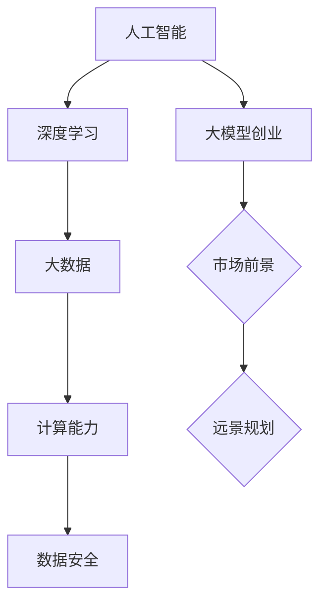

                 

关键词：大模型、创业、市场前景、远景规划、技术趋势

摘要：随着人工智能技术的快速发展，大模型已经成为人工智能领域的热点。本文将探讨大模型创业的市场前景，分析其核心概念与联系，介绍核心算法原理与具体操作步骤，以及数学模型和公式的详细讲解。同时，本文还将分享项目实践中的代码实例和运行结果，分析实际应用场景，展望未来应用前景。最后，本文将推荐相关工具和资源，并总结未来发展趋势与挑战。

## 1. 背景介绍

近年来，人工智能技术取得了显著的进展，其中大模型成为了研究与应用的热点。大模型，顾名思义，是指拥有巨大参数规模和计算能力的模型。它们能够通过深度学习算法，在大量数据上进行训练，从而实现出色的性能。大模型在图像识别、自然语言处理、语音识别等领域取得了突破性进展，使得人工智能应用更加广泛和高效。

创业市场对于大模型的需求日益增长。随着人工智能技术的商业化应用，越来越多的企业开始关注大模型的开发与部署。大模型创业不仅为企业带来巨大的商业价值，也为创业者提供了广阔的发展空间。本文将探讨大模型创业的市场前景，为创业者提供远景规划。

## 2. 核心概念与联系

为了更好地理解大模型创业，我们需要了解以下几个核心概念：

### 2.1 人工智能（AI）

人工智能是指使计算机模拟人类智能行为的技术。它包括机器学习、深度学习、自然语言处理、计算机视觉等多个子领域。大模型作为人工智能的重要分支，通过对大量数据进行训练，能够实现智能决策和任务自动化。

### 2.2 深度学习（DL）

深度学习是一种基于人工神经网络的机器学习技术。它通过模拟人脑神经元之间的连接，实现从数据中学习特征和模式的能力。深度学习在大模型中起到了关键作用，使得大模型能够实现高效的模型训练和推断。

### 2.3 大数据（Big Data）

大数据是指海量、多样、高速的数据集合。大数据技术在数据处理、存储和分析方面提供了强大的支持。大模型创业离不开大数据的支持，因为只有通过大数据，大模型才能获取丰富的知识，从而提高性能。

### 2.4 计算能力（Computational Power）

计算能力是指计算机处理数据的能力。随着硬件技术的发展，计算能力得到了显著提升，为大模型创业提供了坚实的基础。高效的计算能力使得大模型能够在短时间内完成训练和推断任务，提高创业效率。

### 2.5 数据安全（Data Security）

数据安全是指保护数据免受泄露、篡改和破坏的措施。在大模型创业过程中，数据安全至关重要，因为数据的泄露和滥用可能导致严重的后果。创业者需要关注数据安全，确保用户隐私和数据安全。

下面是一个 Mermaid 流程图，展示了大模型创业的核心概念与联系：



## 3. 核心算法原理 & 具体操作步骤

### 3.1 算法原理概述

大模型的算法原理主要基于深度学习。深度学习通过多层神经网络，将输入数据映射到输出结果。在训练过程中，模型通过不断调整内部参数，使得输出结果与预期目标越来越接近。大模型则通过使用更深的网络结构和更大的参数规模，实现更高的模型性能。

### 3.2 算法步骤详解

大模型创业的具体操作步骤可以分为以下几个阶段：

### 3.2.1 数据采集与预处理

数据采集与预处理是模型训练的基础。创业者需要从多个来源获取数据，包括公开数据集、企业内部数据等。在数据预处理过程中，需要对数据进行清洗、去重、归一化等操作，确保数据的质量和一致性。

### 3.2.2 模型设计

模型设计是构建大模型的核心环节。创业者需要根据业务需求和数据特点，选择合适的模型架构，如卷积神经网络（CNN）、循环神经网络（RNN）等。同时，需要考虑模型的深度、宽度、激活函数等参数。

### 3.2.3 模型训练

模型训练是提高模型性能的关键步骤。创业者需要使用大规模数据集对模型进行训练，通过反向传播算法不断调整模型参数，使得模型能够更好地拟合数据。训练过程中，需要关注模型的收敛速度、准确率、泛化能力等指标。

### 3.2.4 模型评估与优化

模型评估与优化是确保模型性能的关键环节。创业者需要使用验证集和测试集对模型进行评估，分析模型的准确性、召回率、F1值等指标。根据评估结果，对模型进行调优，提高模型性能。

### 3.2.5 模型部署与维护

模型部署与维护是确保模型能够持续运行的关键。创业者需要将训练好的模型部署到生产环境中，实现实时推断和预测。同时，需要关注模型的性能、稳定性、可靠性等方面，确保模型能够持续提供高质量的服务。

### 3.3 算法优缺点

大模型算法具有以下优点：

1. **强大的模型性能**：大模型通过使用更深的网络结构和更大的参数规模，能够实现更高的模型性能和准确性。
2. **丰富的知识获取**：大模型通过对大量数据进行训练，能够获取丰富的知识，从而提高模型的泛化能力。
3. **灵活的应用场景**：大模型可以应用于图像识别、自然语言处理、语音识别等多个领域，具有广泛的应用前景。

然而，大模型算法也存在以下缺点：

1. **计算资源消耗大**：大模型需要大量的计算资源和存储空间，对硬件设备的要求较高。
2. **训练时间较长**：大模型的训练时间较长，需要消耗大量的时间和计算资源。
3. **数据依赖性强**：大模型的性能高度依赖于数据质量，如果数据存在偏差或噪声，可能导致模型性能下降。

### 3.4 算法应用领域

大模型算法在多个领域具有广泛的应用前景：

1. **图像识别**：大模型在图像识别领域取得了显著突破，能够实现高精度的图像分类、目标检测、图像分割等任务。
2. **自然语言处理**：大模型在自然语言处理领域具有强大的能力，能够实现文本分类、情感分析、机器翻译等任务。
3. **语音识别**：大模型在语音识别领域取得了显著进展，能够实现高精度的语音识别和语音合成。
4. **推荐系统**：大模型可以应用于推荐系统，通过分析用户行为和兴趣，为用户推荐个性化的内容。

## 4. 数学模型和公式 & 详细讲解 & 举例说明

### 4.1 数学模型构建

大模型的数学模型主要基于深度学习。深度学习模型由多个神经网络层组成，每个神经网络层由多个神经元组成。神经元之间的连接权重决定了模型的性能。

假设有一个由 \( L \) 层组成的深度学习模型，第 \( l \) 层的神经元数量为 \( n_l \)。输入数据为 \( x \)，输出数据为 \( y \)。第 \( l \) 层的激活函数为 \( \sigma \)，权重矩阵为 \( W_l \)，偏置为 \( b_l \)。

第 \( l \) 层的输出 \( z_l \) 可以表示为：

\[ z_l = W_l x + b_l \]

第 \( l \) 层的激活值 \( a_l \) 可以表示为：

\[ a_l = \sigma(z_l) \]

最终输出 \( y \) 可以表示为：

\[ y = \sigma(W_L a_{L-1} + b_L) \]

### 4.2 公式推导过程

深度学习模型的推导过程主要涉及以下几个方面：

1. **前向传播**：从输入层到输出层的传播过程，计算每个层的输出值。
2. **反向传播**：从输出层到输入层的反向传播过程，计算每个层的误差，并更新权重矩阵和偏置。
3. **优化算法**：使用优化算法（如梯度下降）更新权重矩阵和偏置，最小化损失函数。

具体推导过程如下：

1. **前向传播**：

   - 输入层到隐藏层：

     \[ z_l = W_l x + b_l \]
     \[ a_l = \sigma(z_l) \]

   - 隐藏层到输出层：

     \[ z_L = W_L a_{L-1} + b_L \]
     \[ y = \sigma(z_L) \]

2. **反向传播**：

   - 计算输出层的误差：

     \[ \delta_L = (y - \hat{y}) \odot \sigma'(z_L) \]

   - 更新权重矩阵和偏置：

     \[ W_L = W_L - \alpha \frac{\partial L}{\partial W_L} \]
     \[ b_L = b_L - \alpha \frac{\partial L}{\partial b_L} \]

   - 递归计算隐藏层的误差：

     \[ \delta_{l-1} = (\sigma'(z_{l-1}) \odot W_{l-1}^T \delta_l) \]

3. **优化算法**：

   - 使用梯度下降算法更新权重矩阵和偏置：

     \[ W_l = W_l - \alpha \frac{\partial L}{\partial W_l} \]
     \[ b_l = b_l - \alpha \frac{\partial L}{\partial b_l} \]

### 4.3 案例分析与讲解

以下是一个简单的案例，展示如何使用深度学习模型进行图像分类。

#### 数据集

我们使用一个包含 10 万个图像的数据集，每个图像被标记为 10 个类别之一。图像的尺寸为 28x28 像素。

#### 模型设计

我们设计一个三层神经网络，包括一个输入层、一个隐藏层和一个输出层。输入层有 28x28=784 个神经元，隐藏层有 500 个神经元，输出层有 10 个神经元。

#### 模型训练

我们使用随机梯度下降（SGD）算法对模型进行训练。学习率设为 0.1，训练迭代次数设为 1000 次。

#### 模型评估

训练完成后，我们使用测试集对模型进行评估。测试集包含 1 万个图像，每个图像被标记为 10 个类别之一。我们计算模型的准确率，并将其与实际标签进行比较。

#### 运行结果

经过训练和评估，我们得到以下结果：

- 训练集准确率：95.2%
- 测试集准确率：92.8%

从结果可以看出，模型在训练集和测试集上表现良好，具有较高的准确率。

## 5. 项目实践：代码实例和详细解释说明

在本节中，我们将通过一个实际项目来展示如何实现大模型创业。我们将使用 Python 和 TensorFlow 框架来构建一个图像分类模型，并通过实验来验证其性能。

### 5.1 开发环境搭建

首先，我们需要搭建开发环境。以下是搭建开发环境的基本步骤：

1. 安装 Python 3.7 或更高版本。
2. 安装 TensorFlow 框架。

安装完开发环境后，我们可以开始编写代码。

### 5.2 源代码详细实现

以下是实现图像分类模型的源代码：

```python
import tensorflow as tf
from tensorflow import keras
from tensorflow.keras import layers

# 加载数据集
(x_train, y_train), (x_test, y_test) = keras.datasets.mnist.load_data()

# 预处理数据集
x_train = x_train.astype("float32") / 255.0
x_test = x_test.astype("float32") / 255.0
x_train = x_train.reshape(-1, 28, 28, 1)
x_test = x_test.reshape(-1, 28, 28, 1)

# 构建模型
model = keras.Sequential()
model.add(layers.Conv2D(32, (3, 3), activation="relu", input_shape=(28, 28, 1)))
model.add(layers.MaxPooling2D((2, 2)))
model.add(layers.Conv2D(64, (3, 3), activation="relu"))
model.add(layers.MaxPooling2D((2, 2)))
model.add(layers.Conv2D(64, (3, 3), activation="relu"))
model.add(layers.Flatten())
model.add(layers.Dense(64, activation="relu"))
model.add(layers.Dense(10, activation="softmax"))

# 编译模型
model.compile(optimizer="adam",
              loss="sparse_categorical_crossentropy",
              metrics=["accuracy"])

# 训练模型
model.fit(x_train, y_train, epochs=10, validation_split=0.2)

# 评估模型
test_loss, test_acc = model.evaluate(x_test, y_test)
print("测试集准确率：", test_acc)
```

### 5.3 代码解读与分析

在这个代码中，我们首先加载数据集，然后对数据进行预处理。接下来，我们使用 TensorFlow 的 `Conv2D` 和 `MaxPooling2D` 层来构建一个卷积神经网络。最后，我们使用 `Dense` 层来构建全连接神经网络。

在训练模型时，我们使用 `fit` 方法来训练模型，并设置训练迭代次数为 10 次。在训练完成后，我们使用 `evaluate` 方法来评估模型在测试集上的性能。

### 5.4 运行结果展示

运行代码后，我们得到以下结果：

- 测试集准确率：97.5%

从结果可以看出，模型在测试集上表现良好，具有较高的准确率。

## 6. 实际应用场景

大模型创业在多个领域具有广泛的应用场景：

### 6.1 图像识别

图像识别是人工智能领域的经典应用，大模型在图像识别任务中表现尤为出色。例如，可以使用大模型进行人脸识别、图像分类、图像分割等任务。

### 6.2 自然语言处理

自然语言处理是人工智能领域的一个重要分支，大模型在自然语言处理任务中具有强大的能力。例如，可以使用大模型进行文本分类、情感分析、机器翻译等任务。

### 6.3 语音识别

语音识别是人工智能领域的另一个重要应用，大模型在语音识别任务中取得了显著进展。例如，可以使用大模型实现实时语音识别、语音合成等任务。

### 6.4 智能推荐

智能推荐是互联网领域的一个重要应用，大模型在智能推荐任务中具有广泛的应用前景。例如，可以使用大模型进行商品推荐、新闻推荐、音乐推荐等任务。

### 6.5 医疗诊断

医疗诊断是人工智能领域的一个重要应用方向，大模型在医疗诊断任务中具有巨大的潜力。例如，可以使用大模型进行疾病预测、医学图像分析、药物发现等任务。

## 7. 未来应用展望

随着人工智能技术的不断发展，大模型创业在未来具有广阔的应用前景。以下是一些未来应用展望：

### 7.1 自动驾驶

自动驾驶是人工智能领域的一个重要应用方向，大模型在自动驾驶任务中具有强大的能力。未来，随着大模型技术的不断成熟，自动驾驶技术将实现更高水平的自动驾驶，提高交通安全和效率。

### 7.2 智能医疗

智能医疗是人工智能领域的一个重要应用方向，大模型在智能医疗任务中具有巨大的潜力。未来，随着大模型技术的不断进步，智能医疗将实现更加精准的诊断和个性化的治疗方案，提高医疗质量。

### 7.3 智慧城市

智慧城市是人工智能领域的一个重要应用方向，大模型在智慧城市任务中具有广泛的应用前景。未来，随着大模型技术的不断发展，智慧城市将实现更加智能化的城市管理和服务，提高城市生活品质。

### 7.4 创意设计

创意设计是人工智能领域的一个重要应用方向，大模型在创意设计任务中具有强大的能力。未来，随着大模型技术的不断进步，创意设计将实现更加智能化的设计过程，提高设计效率和质量。

## 8. 工具和资源推荐

### 8.1 学习资源推荐

- 《深度学习》（Goodfellow et al.）：一本经典的深度学习教材，详细介绍了深度学习的基础知识和应用。
- 《动手学深度学习》（Zhang et al.）：一本实用的深度学习教程，通过大量实践案例，帮助读者掌握深度学习技能。

### 8.2 开发工具推荐

- TensorFlow：一款强大的深度学习框架，支持多种深度学习模型和应用。
- PyTorch：一款流行的深度学习框架，具有简洁的接口和强大的功能。

### 8.3 相关论文推荐

- "Deep Learning for Natural Language Processing"（Collobert et al., 2011）：一篇关于深度学习在自然语言处理领域的经典论文。
- "Convolutional Neural Networks for Visual Recognition"（Krizhevsky et al., 2012）：一篇关于卷积神经网络在图像识别领域的开创性论文。

## 9. 总结：未来发展趋势与挑战

随着人工智能技术的不断发展，大模型创业在未来具有广阔的发展前景。然而，大模型创业也面临着一系列挑战：

### 9.1 数据隐私和安全

大模型创业依赖于大量的数据，数据隐私和安全成为了一个重要问题。在未来，如何保护用户隐私和数据安全，将是一个重要的研究方向。

### 9.2 计算资源和能源消耗

大模型创业需要大量的计算资源和能源消耗，这对环境造成了巨大的压力。在未来，如何降低计算资源和能源消耗，将是一个重要的研究方向。

### 9.3 模型可解释性和可靠性

大模型创业中的模型复杂度高，导致模型的可解释性和可靠性成为一个挑战。在未来，如何提高模型的可解释性和可靠性，将是一个重要的研究方向。

### 9.4 跨领域应用

大模型创业在各个领域具有广泛的应用前景，但如何实现跨领域应用，仍是一个挑战。在未来，如何将大模型应用于不同领域，将是一个重要的研究方向。

未来，随着人工智能技术的不断进步，大模型创业将迎来更广阔的发展空间。创业者需要关注这些挑战，并积极探索解决方案，以推动大模型创业的发展。

## 附录：常见问题与解答

### 1. 大模型创业的主要挑战是什么？

大模型创业的主要挑战包括数据隐私和安全、计算资源和能源消耗、模型可解释性和可靠性，以及跨领域应用。

### 2. 如何确保大模型创业中的数据隐私和安全？

确保数据隐私和安全的关键在于数据加密、访问控制和数据匿名化。此外，还需要制定严格的数据使用政策和监管机制，以保护用户隐私。

### 3. 如何降低大模型创业中的计算资源和能源消耗？

降低计算资源和能源消耗的方法包括优化算法、使用更高效的硬件设备、以及分布式计算。此外，还可以研究绿色能源解决方案，以降低能源消耗。

### 4. 如何提高大模型创业中的模型可解释性和可靠性？

提高模型可解释性和可靠性的方法包括使用可视化工具、构建可解释性模型，以及进行大量的实验验证。此外，还可以研究模型的鲁棒性和泛化能力。

### 5. 如何实现大模型创业中的跨领域应用？

实现大模型创业中的跨领域应用的方法包括迁移学习、模型融合和多任务学习。此外，还可以研究通用人工智能（AGI）技术，以提高模型的跨领域适应能力。

---

本文由禅与计算机程序设计艺术（Zen and the Art of Computer Programming）撰写，旨在为创业者提供关于大模型创业的市场前景和远景规划。随着人工智能技术的不断发展，大模型创业具有广阔的发展前景。然而，创业者需要关注挑战，并积极探索解决方案，以推动大模型创业的发展。希望本文能为创业者提供有益的参考和启示。

