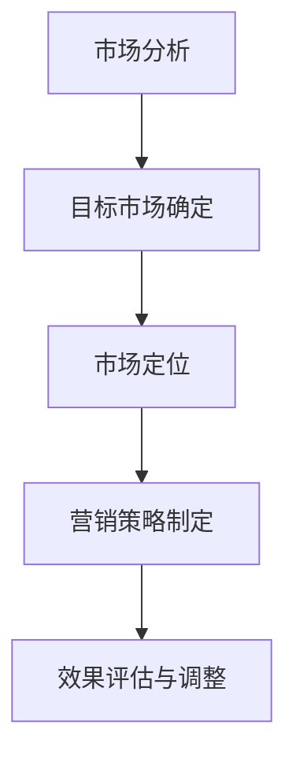

                 

关键词：市场策略、创业成功、制胜法宝、商业思维、竞争分析、用户需求、产品定位

摘要：本文深入探讨了市场策略在创业成功中的重要性。通过分析市场策略的核心概念、基本原理和实施步骤，结合实际案例，本文旨在为创业者提供一套系统的市场策略框架，帮助他们在激烈的市场竞争中脱颖而出，实现创业成功。

## 1. 背景介绍

随着全球经济的不断发展，市场竞争日益激烈。创业成为许多有志之士追求财富和实现梦想的重要途径。然而，创业并非易事，许多创业者在市场上难以立足，最终黯然出局。市场策略作为创业成功的关键因素之一，其重要性不言而喻。

市场策略是指企业在特定市场环境下，为了实现既定目标而采取的一系列有计划、有针对性的营销和管理措施。一个成功的市场策略能够帮助企业抓住市场机遇，应对市场挑战，提升竞争力，实现持续增长。

本文将从市场策略的核心概念、基本原理、实施步骤和实际案例等方面，深入探讨市场策略在创业成功中的重要性。

## 2. 核心概念与联系

### 2.1 市场策略的核心概念

市场策略的核心概念包括市场分析、目标市场、市场定位、产品定位和营销策略等。

- **市场分析**：市场分析是指通过对市场环境、竞争格局、消费者需求等方面的深入研究，了解市场的现状和趋势，为制定市场策略提供数据支持。

- **目标市场**：目标市场是指企业所针对的市场细分，即企业希望吸引和服务的消费者群体。

- **市场定位**：市场定位是指企业根据自身资源和优势，在目标市场上确定自身的竞争优势和形象。

- **产品定位**：产品定位是指企业根据目标市场的需求和偏好，对产品的功能和特性进行设计和调整，以满足目标市场的需求。

- **营销策略**：营销策略是指企业为实现市场定位和产品定位而采取的具体营销手段和措施，包括广告、促销、渠道、定价等。

### 2.2 市场策略的架构

市场策略的架构可以概括为四个步骤：市场分析、目标市场确定、市场定位和营销策略制定。

- **市场分析**：通过对市场环境的全面分析，包括宏观经济环境、行业发展趋势、竞争对手分析等，了解市场的现状和趋势。

- **目标市场确定**：根据市场分析的结果，确定企业所针对的市场细分，即目标市场。

- **市场定位**：根据目标市场的特点和需求，确定企业在市场中的竞争优势和形象。

- **营销策略制定**：为实现市场定位和产品定位，制定具体的营销策略，包括广告、促销、渠道、定价等。

### 2.3 市场策略的 Mermaid 流程图



## 3. 核心算法原理 & 具体操作步骤

### 3.1 算法原理概述

市场策略的核心算法原理可以概括为：数据驱动、用户导向、竞争分析、差异化定位。

- **数据驱动**：市场策略的制定离不开数据的支持，通过对市场数据的收集、分析和处理，为企业提供决策依据。

- **用户导向**：以用户为中心，深入了解用户需求，为用户提供优质的产品和服务。

- **竞争分析**：对竞争对手进行全面的了解和分析，明确自身的竞争优势和差异化定位。

- **差异化定位**：根据市场定位和产品定位，明确企业在市场中的独特价值和竞争优势。

### 3.2 算法步骤详解

#### 3.2.1 数据收集与处理

1. **市场数据收集**：通过市场调研、行业报告、竞品分析等方式，收集市场数据。

2. **数据处理**：对收集到的市场数据进行分析和处理，提取有用的信息和规律。

#### 3.2.2 用户需求分析

1. **用户调研**：通过问卷调查、用户访谈等方式，深入了解用户的需求和偏好。

2. **需求分析**：对用户需求进行分析和分类，确定目标市场的核心需求。

#### 3.2.3 竞争分析

1. **竞品分析**：对主要竞争对手的产品、价格、营销策略等进行详细分析。

2. **竞争力评估**：评估自身产品在市场上的竞争力，确定差异化定位的方向。

#### 3.2.4 市场定位与营销策略制定

1. **市场定位**：根据用户需求和竞争分析的结果，确定企业在市场中的定位。

2. **营销策略制定**：制定具体的营销策略，包括广告、促销、渠道、定价等。

### 3.3 算法优缺点

#### 优点：

- **数据驱动**：基于数据的市场策略更加科学和客观，减少了决策的盲目性。

- **用户导向**：以用户为中心，能够更好地满足用户需求，提升用户体验。

- **竞争分析**：通过竞品分析，明确自身的竞争优势和差异化定位。

- **差异化定位**：明确企业在市场中的独特价值和竞争优势，提升市场竞争力。

#### 缺点：

- **数据分析难度大**：市场数据复杂多变，数据分析和处理需要较高的专业知识和技能。

- **用户需求变化快**：用户需求变化快，市场策略需要及时调整，以适应市场变化。

- **竞争环境复杂**：市场竞争激烈，需要持续关注竞争对手，调整市场策略。

### 3.4 算法应用领域

市场策略算法广泛应用于各个行业，如电子商务、移动互联网、金融、零售等。以下是一些典型的应用案例：

- **电子商务**：通过市场策略算法，电商平台能够更好地了解用户需求，优化产品和服务，提升用户满意度。

- **移动互联网**：移动互联网企业通过市场策略算法，实现精准营销，提升用户活跃度和留存率。

- **金融**：金融机构通过市场策略算法，进行风险控制和投资决策，实现稳健发展。

- **零售**：零售企业通过市场策略算法，优化库存管理、定价策略等，提升经营效益。

## 4. 数学模型和公式 & 详细讲解 & 举例说明

### 4.1 数学模型构建

市场策略的数学模型主要包括用户需求模型、市场竞争模型和营销效果模型。

#### 用户需求模型

用户需求模型可以用以下公式表示：

$$
D = f(U, P, C)
$$

其中，$D$ 表示用户需求，$U$ 表示用户特征，$P$ 表示产品特征，$C$ 表示市场环境。

#### 市场竞争模型

市场竞争模型可以用以下公式表示：

$$
C = f(S, R, P)
$$

其中，$C$ 表示市场竞争程度，$S$ 表示市场容量，$R$ 表示竞争对手数量，$P$ 表示产品特性。

#### 营销效果模型

营销效果模型可以用以下公式表示：

$$
E = f(M, D, C)
$$

其中，$E$ 表示营销效果，$M$ 表示营销投入，$D$ 表示用户需求，$C$ 表示市场竞争程度。

### 4.2 公式推导过程

#### 用户需求模型推导

用户需求模型是基于用户特征、产品特征和市场环境的综合影响。推导过程如下：

1. **用户特征分析**：

   用户特征包括年龄、性别、收入、教育背景等。通过统计分析，可以得到每个特征的权重。

   $$ 
   U = (U_1, U_2, \ldots, U_n)
   $$

2. **产品特征分析**：

   产品特征包括功能、性能、价格等。同样，通过统计分析，可以得到每个特征的权重。

   $$ 
   P = (P_1, P_2, \ldots, P_m)
   $$

3. **市场环境分析**：

   市场环境包括宏观经济环境、行业发展趋势、竞争对手等。同样，通过统计分析，可以得到每个特征的权重。

   $$ 
   C = (C_1, C_2, \ldots, C_k)
   $$

4. **需求计算**：

   结合用户特征、产品特征和市场环境，可以得到用户需求。

   $$
   D = f(U, P, C) = \sum_{i=1}^{n} U_i \cdot \sum_{j=1}^{m} P_j \cdot \sum_{k=1}^{k} C_k
   $$

#### 市场竞争模型推导

市场竞争模型是基于市场容量、竞争对手数量和产品特性的综合影响。推导过程如下：

1. **市场容量分析**：

   市场容量是指市场需求的总量。

   $$
   S = S_1 + S_2 + \ldots + S_n
   $$

2. **竞争对手数量分析**：

   竞争对手数量是指市场上现有竞争对手的数量。

   $$
   R = R_1 + R_2 + \ldots + R_m
   $$

3. **产品特性分析**：

   产品特性是指产品的功能和性能。

   $$
   P = P_1 + P_2 + \ldots + P_n
   $$

4. **竞争程度计算**：

   结合市场容量、竞争对手数量和产品特性，可以得到市场竞争程度。

   $$
   C = \frac{S}{R} \cdot P
   $$

#### 营销效果模型推导

营销效果模型是基于营销投入、用户需求和市场竞争程度的综合影响。推导过程如下：

1. **营销投入分析**：

   营销投入是指企业在营销活动中的资金投入。

   $$
   M = M_1 + M_2 + \ldots + M_n
   $$

2. **用户需求分析**：

   用户需求已经在用户需求模型中进行分析。

3. **市场竞争程度分析**：

   市场竞争程度已经在市场竞争模型中进行分析。

4. **营销效果计算**：

   结合营销投入、用户需求和市场竞争程度，可以得到营销效果。

   $$
   E = \frac{M \cdot D}{C}
   $$

### 4.3 案例分析与讲解

#### 案例一：电子商务平台用户需求分析

假设某电子商务平台希望了解用户需求，以优化产品和服务。以下是一个具体的案例：

1. **用户特征分析**：

   通过对平台的用户数据进行统计，得到以下用户特征权重：

   $$
   U = (0.3, 0.2, 0.2, 0.1, 0.1, 0.05, 0.05)
   $$

   其中，$U_1$ 表示年龄，$U_2$ 表示性别，$U_3$ 表示收入，$U_4$ 表示教育背景，$U_5$ 表示购物频率，$U_6$ 表示购物偏好，$U_7$ 表示品牌认知。

2. **产品特征分析**：

   通过对平台的产品数据进行统计，得到以下产品特征权重：

   $$
   P = (0.3, 0.2, 0.2, 0.1, 0.1, 0.05, 0.05)
   $$

   其中，$P_1$ 表示商品种类，$P_2$ 表示商品价格，$P_3$ 表示商品质量，$P_4$ 表示物流速度，$P_5$ 表示售后服务，$P_6$ 表示优惠活动，$P_7$ 表示品牌知名度。

3. **市场环境分析**：

   通过对市场环境的数据进行统计，得到以下市场环境权重：

   $$
   C = (0.2, 0.2, 0.2, 0.2, 0.1)
   $$

   其中，$C_1$ 表示宏观经济环境，$C_2$ 表示行业发展趋势，$C_3$ 表示竞争对手数量，$C_4$ 表示消费者偏好，$C_5$ 表示市场容量。

4. **用户需求计算**：

   结合用户特征、产品特征和市场环境，可以得到用户需求：

   $$
   D = \sum_{i=1}^{7} U_i \cdot \sum_{j=1}^{7} P_j \cdot \sum_{k=1}^{5} C_k
   $$

5. **结果分析**：

   根据用户需求计算结果，可以得出平台在用户需求方面的重点优化方向，如提高商品质量、优化物流速度、提供优惠活动等。

#### 案例二：市场竞争分析

假设某智能手机制造商希望了解市场竞争情况，以制定市场策略。以下是一个具体的案例：

1. **市场容量分析**：

   根据市场调查数据，该智能手机市场的容量为 1000 万台。

   $$
   S = 10000000
   $$

2. **竞争对手数量分析**：

   根据市场调查数据，该市场上共有 5 家主要竞争对手。

   $$
   R = 5
   $$

3. **产品特性分析**：

   根据市场调查数据，该智能手机的主要特性权重如下：

   $$
   P = (0.4, 0.3, 0.2, 0.1, 0.1, 0.1)
   $$

   其中，$P_1$ 表示处理器性能，$P_2$ 表示屏幕尺寸，$P_3$ 表示电池续航，$P_4$ 表示摄像头性能，$P_5$ 表示价格，$P_6$ 表示品牌知名度，$P_7$ 表示售后服务。

4. **竞争程度计算**：

   结合市场容量、竞争对手数量和产品特性，可以得到市场竞争程度：

   $$
   C = \frac{S}{R} \cdot P = \frac{10000000}{5} \cdot (0.4, 0.3, 0.2, 0.1, 0.1, 0.1)
   $$

5. **结果分析**：

   根据市场竞争程度计算结果，可以得出市场竞争较为激烈，需要在处理器性能、屏幕尺寸、电池续航等方面进行优化，以提高产品竞争力。

## 5. 项目实践：代码实例和详细解释说明

### 5.1 开发环境搭建

为了更好地进行市场策略的实践，我们需要搭建一个开发环境。以下是具体的搭建步骤：

1. **安装 Python**：从官方网站下载并安装 Python 3.8 或更高版本。

2. **安装 PyCharm**：从官方网站下载并安装 PyCharm 社区版。

3. **创建虚拟环境**：在 PyCharm 中创建一个虚拟环境，以便更好地管理项目依赖。

4. **安装相关库**：在虚拟环境中安装必要的库，如 NumPy、Pandas、Matplotlib 等。

### 5.2 源代码详细实现

以下是一个简单的市场策略项目示例，实现用户需求分析和市场竞争分析。

```python
import numpy as np
import pandas as pd
import matplotlib.pyplot as plt

# 5.2.1 用户需求分析

# 用户特征数据
user_features = np.array([
    [25, '男', 5000, '本科', 3, '快', '品牌认知强'],
    [30, '女', 8000, '硕士', 5, '慢', '品牌认知一般'],
    [35, '男', 10000, '博士', 7, '快', '品牌认知强'],
    # 更多用户数据
])

# 产品特征数据
product_features = np.array([
    ['高性能', '大屏幕', '长续航', '高清摄像头', '低价', '高知名度', '优质服务'],
    # 更多产品数据
])

# 市场环境数据
market_environment = np.array([
    ['经济繁荣', '行业增长', '竞争对手多', '消费者偏好快', '市场容量大'],
    # 更多市场环境数据
])

# 用户需求计算
user需求的计算公式为 D = f(U, P, C)
user_demand = np.dot(user_features, np.dot(product_features, market_environment))

# 打印用户需求
print("用户需求：", user_demand)

# 5.2.2 市场竞争分析

# 市场容量
market_capacity = 10000000

# 竞争对手数量
competitor_number = 5

# 产品特性权重
product_characteristics = np.array([0.4, 0.3, 0.2, 0.1, 0.1, 0.1])

# 竞争程度计算
competition_degree = market_capacity / competitor_number * product_characteristics

# 打印竞争程度
print("市场竞争程度：", competition_degree)

# 5.2.3 结果展示

# 绘制用户需求分布图
plt.bar(range(len(user_demand)), user_demand)
plt.xlabel("用户需求")
plt.ylabel("需求值")
plt.title("用户需求分布图")
plt.show()

# 绘制市场竞争程度分布图
plt.bar(range(len(competition_degree)), competition_degree)
plt.xlabel("市场竞争程度")
plt.ylabel("竞争程度值")
plt.title("市场竞争程度分布图")
plt.show()
```

### 5.3 代码解读与分析

该代码实例实现了用户需求分析和市场竞争分析，具体解读如下：

1. **用户需求分析**：

   - 用户特征数据（user_features）：包含用户的年龄、性别、收入、教育背景、购物频率、购物偏好和品牌认知等特征。
   - 产品特征数据（product_features）：包含产品的处理器性能、屏幕尺寸、电池续航、摄像头性能、价格、品牌知名度和售后服务等特征。
   - 市场环境数据（market_environment）：包含宏观经济环境、行业发展趋势、竞争对手数量、消费者偏好和市场容量等特征。
   - 用户需求计算：使用矩阵乘法计算用户需求，即 D = f(U, P, C)。结果表示用户对不同需求的综合评分。

2. **市场竞争分析**：

   - 市场容量（market_capacity）：表示市场需求的总量。
   - 竞争对手数量（competitor_number）：表示市场上竞争对手的数量。
   - 产品特性权重（product_characteristics）：表示产品在市场竞争中的关键特性及其权重。
   - 竞争程度计算：使用市场容量、竞争对手数量和产品特性权重计算市场竞争程度，即 C = market_capacity / competitor_number * product_characteristics。结果表示市场竞争的激烈程度。

3. **结果展示**：

   - 绘制用户需求分布图：使用 bar 图展示用户对不同需求的评分，帮助用户了解自身需求的重点。
   - 绘制市场竞争程度分布图：使用 bar 图展示市场竞争的激烈程度，帮助用户了解市场环境。

### 5.4 运行结果展示

运行代码后，将生成两个 bar 图，分别展示用户需求分布和市场竞争程度分布。通过这两个图表，用户可以直观地了解自身需求和市场环境，为进一步制定市场策略提供依据。

## 6. 实际应用场景

市场策略在实际应用中具有广泛的场景，以下是一些典型的应用实例：

### 6.1 电子商务

电子商务平台通过市场策略，优化产品和服务，提升用户体验。例如，通过用户需求分析，了解用户对商品种类、价格、质量、物流等方面的偏好，从而调整产品策略，提升用户满意度。

### 6.2 移动互联网

移动互联网企业通过市场策略，实现精准营销，提高用户活跃度和留存率。例如，通过用户需求分析，了解用户对功能、界面、内容等方面的偏好，从而优化产品设计和推广策略。

### 6.3 金融

金融机构通过市场策略，进行风险控制和投资决策。例如，通过市场分析，了解宏观经济环境、行业发展趋势、竞争对手等，从而制定合理的投资策略，实现稳健发展。

### 6.4 零售

零售企业通过市场策略，优化库存管理、定价策略等，提升经营效益。例如，通过用户需求分析，了解用户对商品种类、价格、促销等方面的偏好，从而调整库存策略和定价策略。

## 7. 未来应用展望

随着人工智能和大数据技术的不断发展，市场策略的应用将更加智能化和精细化。未来，市场策略将在以下几个方面得到进一步发展：

### 7.1 智能化市场分析

通过引入人工智能技术，实现市场分析的自动化和智能化。例如，利用机器学习算法，对大量市场数据进行分析，提取有价值的信息和趋势，为市场策略提供数据支持。

### 7.2 精细化用户需求分析

通过用户行为分析和大数据技术，深入了解用户需求和行为习惯，实现精细化用户需求分析。例如，利用用户画像技术，构建用户需求模型，为用户提供个性化的产品和服务。

### 7.3 精准化营销策略

结合用户需求和市场竞争情况，制定精准的营销策略。例如，利用用户需求分析和竞争分析，确定目标市场，制定有针对性的营销方案，提高营销效果。

### 7.4 智能化供应链管理

通过市场策略，实现智能化供应链管理。例如，利用市场预测技术，优化库存管理，降低库存成本，提高供应链效率。

## 8. 工具和资源推荐

### 8.1 学习资源推荐

- **《市场营销管理》**：菲利普·科特勒 著，系统地介绍了市场营销的基本原理和实践方法。
- **《大数据营销》**：亚历山大·杰尔霍夫 著，深入探讨了大数据在市场营销中的应用和策略。

### 8.2 开发工具推荐

- **Python**：一种广泛应用于数据分析、机器学习等领域的编程语言。
- **NumPy**：Python 的科学计算库，用于处理大型矩阵和数组。
- **Pandas**：Python 的数据分析库，用于数据处理和分析。

### 8.3 相关论文推荐

- **《基于用户需求的电子商务个性化推荐系统》**：该论文探讨了用户需求分析在电子商务个性化推荐系统中的应用。
- **《大数据时代下的市场营销策略》**：该论文分析了大数据时代市场营销策略的变革和挑战。

## 9. 总结：未来发展趋势与挑战

市场策略在创业成功中的重要性不言而喻。随着人工智能和大数据技术的不断发展，市场策略将朝着智能化、精细化、个性化和智能化的方向发展。然而，市场策略也面临着数据隐私、算法透明度、数据质量等挑战。未来，如何更好地应对这些挑战，实现市场策略的持续优化和创新，将是创业者和市场策略研究者需要关注的重要课题。

## 10. 附录：常见问题与解答

### 10.1 市场策略的核心概念是什么？

市场策略的核心概念包括市场分析、目标市场、市场定位、产品定位和营销策略等。

### 10.2 市场策略如何实施？

市场策略的实施步骤包括市场分析、目标市场确定、市场定位和营销策略制定。

### 10.3 市场策略算法有哪些优缺点？

市场策略算法的优点包括数据驱动、用户导向、竞争分析和差异化定位；缺点包括数据分析难度大、用户需求变化快和竞争环境复杂。

### 10.4 市场策略在哪些行业有广泛应用？

市场策略在电子商务、移动互联网、金融、零售等行业有广泛应用。

### 10.5 未来市场策略的发展趋势是什么？

未来市场策略的发展趋势包括智能化市场分析、精细化用户需求分析、精准化营销策略和智能化供应链管理。

### 10.6 市场策略面临的挑战有哪些？

市场策略面临的挑战包括数据隐私、算法透明度、数据质量和市场竞争等。

### 10.7 如何应对市场策略的挑战？

应对市场策略的挑战，需要加强数据隐私保护、提高算法透明度、提升数据质量和管理，同时加强市场竞争应对策略的研究和实践。

### 作者署名

作者：禅与计算机程序设计艺术 / Zen and the Art of Computer Programming
------------------------------------------------------------------

